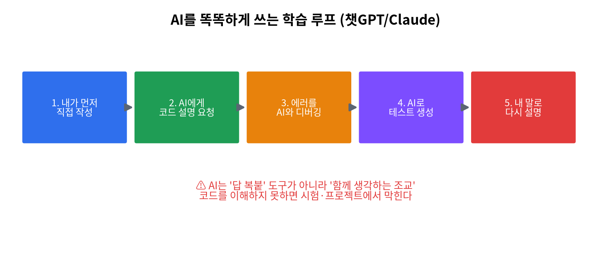

# 🧠 AI 활용 가이드 (챗GPT·Claude와 함께 C 배우기)

> AI는 이 수업의 공식 학습 도구다. 단 **"답을 복붙하는 도구"가 아니라 "함께 생각하는 조교"** 로 쓰는 법을 익힌다.

## 황금 규칙 3가지
1. **먼저 내가 시도한다.** 막힌 지점을 들고 간다(빈 화면을 통째로 맡기지 않는다).
2. **이해 못한 코드는 제출하지 않는다.** 받은 코드를 *한 줄씩 내 말로* 설명할 수 있어야 한다.
3. **검증은 내 몫이다.** AI는 그럴듯하게 **틀린다**(특히 포인터·메모리·하드웨어). 항상 컴파일·실행으로 확인.

## 학습 루프 (5단계)
1. 내가 먼저 직접 작성 → 2. AI에게 코드 설명 요청 → 3. 에러를 AI와 디버깅 → 4. AI로 테스트케이스 생성 → 5. 내 말로 다시 설명(검증)

## 좋은 질문 예시
- "이 C 코드를 한 줄씩 입문자에게 설명해줘. 특히 `int *p = &a;`가 메모리에서 무슨 일을 하는지."
- "gcc로 'segmentation fault'가 난다. 원인을 단계별로 짚고 **한 군데만** 고쳐줘. [코드+에러]"
- "`parse_sensor_line()`의 경계/예외 입력 테스트 5개를 표로 제안해줘."

## 정책 (운영)
- ✅ 허용: 개념 질문, 디버깅, 설명, 테스트 생성, 리팩터링 아이디어, 영어 문서 번역
- ⚠️ 조건: 제출물에 **AI 활용 3줄 회고**(무엇을 물었나 / 무엇을 배웠나 / 무엇을 직접 고쳤나)
- ❌ 금지: 문제를 그대로 붙여 정답 복붙·무비판 제출, 시험에서 AI 의존

!!! tip "왜 AI 리터러시인가? (2026)"
    채용시장에서 AI 활용 역량은 *우대 → 필수*로 빠르게 전환 중(연 +11.9%p). 그러나 연구의 65%가 **과의존→피상적 학습**을 경고한다.
    그래서 "AI가 만든 C 코드의 **버그를 학생이 찾아 고치기**"를 과제로 둔다 — AI 리터러시와 C 이해를 동시에 키운다.

## AI가 자주 틀리는 C 함정 (검증 체크리스트)
| 영역 | 흔한 오류 | 확인법 |
|------|-----------|--------|
| 포인터 | 미초기화 포인터 역참조 | `-Wall` 경고·실행 |
| 배열 | 인덱스 범위 초과 | 경계값 직접 테스트 |
| 문자열 | 널 종료 누락 | `strncpy`+수동 종료 |
| 하드웨어 | 없는 핀/라이브러리 API | 데이터시트 대조 |
