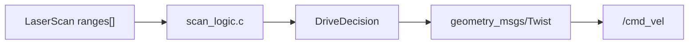

# C와 ROS2 예제

ROS2 연동은 한 번에 어렵게 느껴질 수 있다. 이 강의에서는 먼저 **C 함수가 판단을 담당하고, ROS2 노드는 그 함수를 호출하는 껍데기**라고 이해한다.

## 추천 환경

| 항목 | 권장 |
|------|------|
| OS | Ubuntu 24.04 LTS |
| ROS2 | Jazzy Jalisco |
| 빌드 | `colcon` |
| 기본 방식 | Serial Bridge 또는 PC ROS2 노드 |
| 도전 방식 | micro-ROS |

## 예제 목록

| 예제 | 역할 |
|------|------|
| `stella_n2_bridge` | `/scan` LiDAR 배열을 읽고 C 함수로 주행 판단 후 `/cmd_vel` 발행 |
| `packet_parser.c` | Arduino 문자열 패킷 `"S,42.0,25.0,RUN"`을 구조체로 변환 |
| `scan_logic.c` | 순수 C로 거리 배열을 분석해 전진/회피/정지 결정 |

## 핵심 연결



## 빌드와 실행

```bash
source /opt/ros/jazzy/setup.bash
mkdir -p ~/cprog_ws/src
cp -r courses-src/c-programming-202602/docs/code/ros2/stella_n2_bridge ~/cprog_ws/src/
cd ~/cprog_ws
colcon build --packages-select stella_n2_bridge
source install/setup.bash
ros2 run stella_n2_bridge stella_n2_bridge
```

## 테스트

실제 로봇이 없을 때는 `/scan`을 직접 발행해 본다.

```bash
ros2 topic pub /scan sensor_msgs/msg/LaserScan "{ranges: [1.2, 0.9, 0.4, 0.8, 1.1], range_min: 0.05, range_max: 8.0}" -r 2
ros2 topic echo /cmd_vel
```

가운데 방향에 가까운 장애물이 있으면 회피 또는 정지 명령이 나온다.

!!! warning "로봇 안전"
    실제 Stella N2에서 실행할 때는 바퀴를 띄운 상태로 먼저 시험한다. `/cmd_vel`은 실제 모터 명령이므로 속도 제한과 비상정지 방법을 먼저 확인한다.

## 공식 문서

- [ROS2 Jazzy 설치 문서](https://docs.ros.org/en/jazzy/Installation.html)
- [ROS2 튜토리얼](https://docs.ros.org/en/jazzy/Tutorials.html)
- [micro-ROS Arduino 저장소](https://github.com/micro-ROS/micro_ros_arduino)
