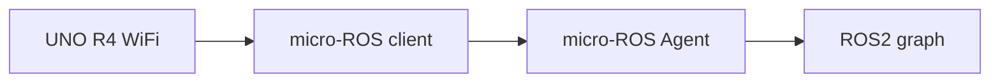

# micro-ROS UNO R4 도전 과제

이 폴더는 15주차 이후 도전 과제 안내용이다. 기본 수업은 **Serial Bridge**로 진행하고, 여유가 있는 팀은 micro-ROS를 사용해 보드가 직접 ROS2 노드처럼 동작하도록 확장한다.

## 왜 도전 과제인가?

- micro-ROS는 MCU 메모리와 통신 설정의 영향을 많이 받는다.
- Arduino 예제보다 설정 단계가 많다.
- 성공하면 보드가 직접 ROS2 토픽을 발행/구독하는 구조를 볼 수 있다.

## 공식 출발점

- micro-ROS Arduino 저장소: <https://github.com/micro-ROS/micro_ros_arduino>
- micro-ROS 개요: <https://micro.ros.org/>

## 수업 적용 제안

1. 먼저 `15_struct_packet`으로 구조체 패킷을 시리얼로 출력한다.
2. PC에서 `packet_parser.c`로 문자열 파싱을 이해한다.
3. Serial Bridge 방식으로 ROS2 토픽 변환을 성공시킨다.
4. 그 다음 micro-ROS Arduino 예제를 UNO R4 WiFi에 맞춰 실험한다.

!!! warning "기본 과제 아님"
    micro-ROS는 네트워크, Agent, 보드 라이브러리 버전 문제로 시간이 걸릴 수 있다. 기말 프로젝트의 기본 경로는 Serial Bridge로 두고, micro-ROS는 가산점 또는 심화 과제로 운영한다.
