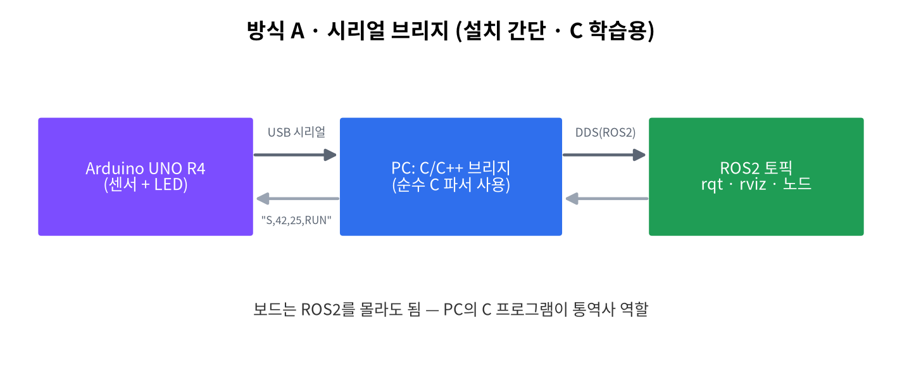
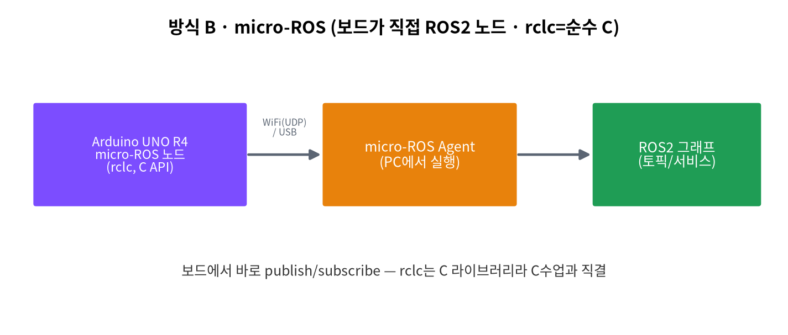

# 🤖 C ↔ ROS2 & Stella N2 로봇 연계

> *"내가 짠 C 함수가 진짜 자율주행 로봇을 움직인다."*
> 손에 쥔 보드(Arduino R4) → 내가 짠 C 다리(bridge) → 진짜 로봇(Stella N2)이 한 줄로 이어진다.


## 왜 이 조합이 흥미를 폭발시키나?
| 단계 | 장비 | 학생 경험 | 배우는 C |
|------|------|-----------|----------|
| ① 보인다 | Arduino R4 WiFi | LED 표정이 바뀐다 | 조건·반복·배열 |
| ② 연결된다 | 내가 짠 C 브리지 | 내 코드가 통역사가 된다 | 구조체·포인터·문자열 |
| ③ 움직인다 | Stella N2 로봇 | 진짜 로봇이 굴러간다 | 배열분석 → 판단 → 제어 |

## 두 가지 연동 방식

=== "방식 A · 시리얼 브리지 (수업 기본)"
    보드는 단순 시리얼 송수신, PC의 C/C++ 브리지가 ROS2로 변환. 설치 간단(gcc/colcon), C 학습(파싱·구조체)에 집중.

    

=== "방식 B · micro-ROS (도전)"
    보드가 직접 ROS2 노드가 된다. **rclc = 순수 C API** → 수업에서 배운 C가 그대로 등장. (UNO R4 공식 지원, RAM 32KB라 경량 노드)

    

## Stella N2 로봇 (NTREX / IdeaRobot)
| 항목 | 사양 |
|------|------|
| 탑재 컴퓨터 | ODROID-C4 (Ubuntu Mate) |
| ROS | ROS2 Foxy (ROS1 Noetic도 지원) |
| 센서 | YDLIDAR(2D 라이다), IMU |
| 구동 | 12V 차동구동 |
| SLAM/주행 | Cartographer |

> 표준 ROS2 인터페이스(`/scan`, `/cmd_vel`)를 쓰므로 우리가 만든 C 브리지가 그대로 붙는다.
> 공식 문서: <https://idearobot.gitbook.io/stella-n2>

## 핵심 아이디어 — LiDAR 배열을 C로 분석
자율주행의 심장(거리 배열 → 동작 판단)을 1학년이 배운 **배열 + 반복문 + 구조체**로 구현한다.

```c
// 가장 가까운 장애물을 찾아 전진/회피/정지를 결정 (순수 C)
ScanResult analyze_scan(const float *ranges, int n, float stop_dist) {
    // 1) 배열에서 최솟값(가장 가까운 거리) 탐색
    // 2) 거리·방향으로 F(전진)/L/R(회피)/S(정지) 결정
}
```

## 캡스톤 아이디어 (난이도↑)
| 난이도 | 프로젝트 |
|--------|----------|
| ⭐ | LED 신호등 대시보드 (로봇 상태 표시) |
| ⭐⭐ | 장애물 회피 주행 / 아두이노 수동 텔레옵 |
| ⭐⭐⭐ | 추종 주행 / micro-ROS 직결 |

!!! warning "안전 최우선"
    처음엔 로봇 바퀴를 바닥에서 띄워 받침대 위에서 시험한다. 속도는 작게, 정지거리(`stop_dist`)는 크게 시작.

> 자세한 실습 절차·코드·채점 루브릭은 강의 저장소(비공개)에서 제공된다. 후속 교과(센서처리와 모터제어, 이동로봇과 ROS)의 예고편이다.
