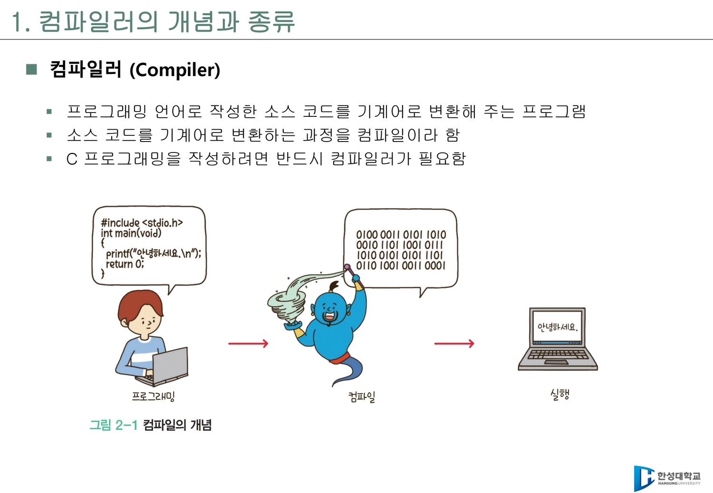
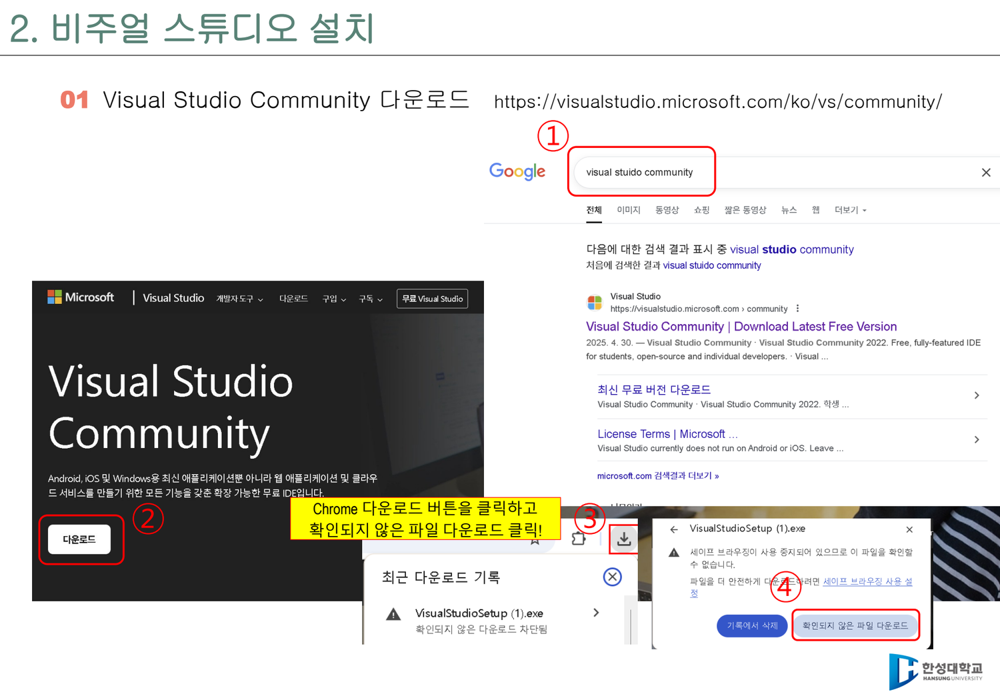
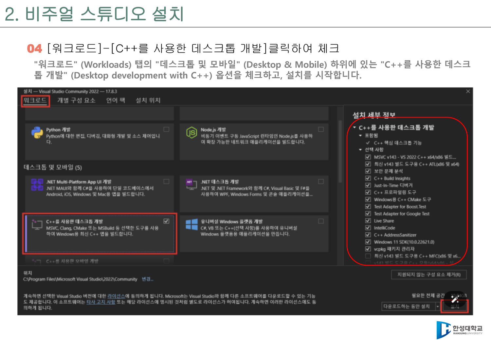
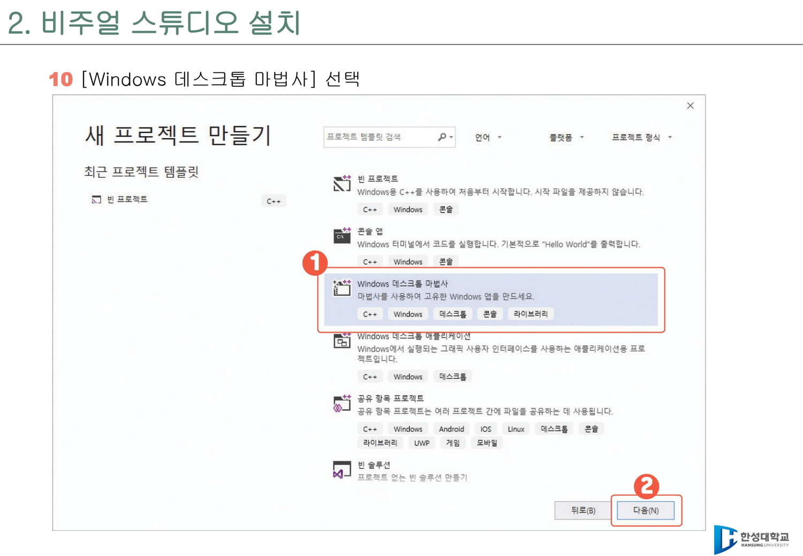
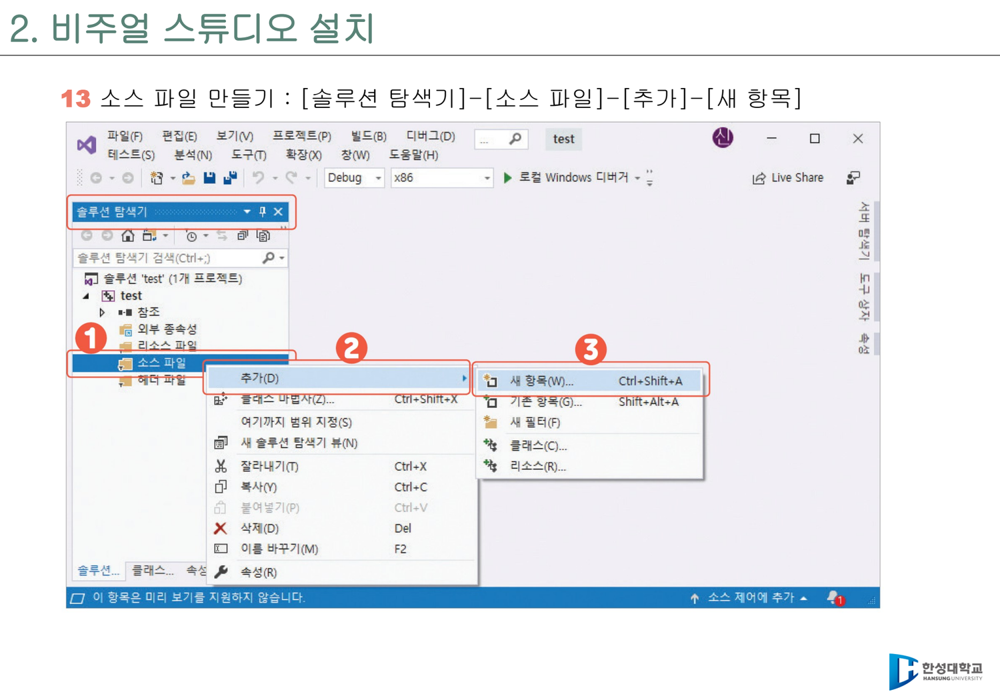
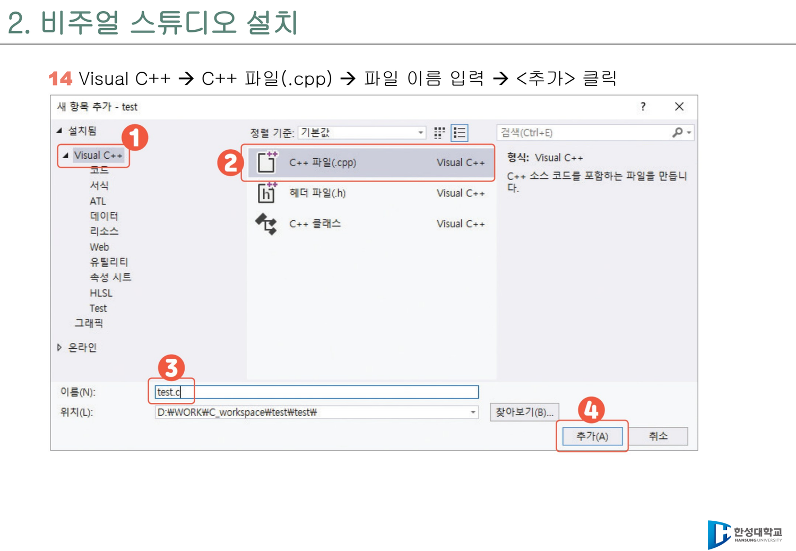
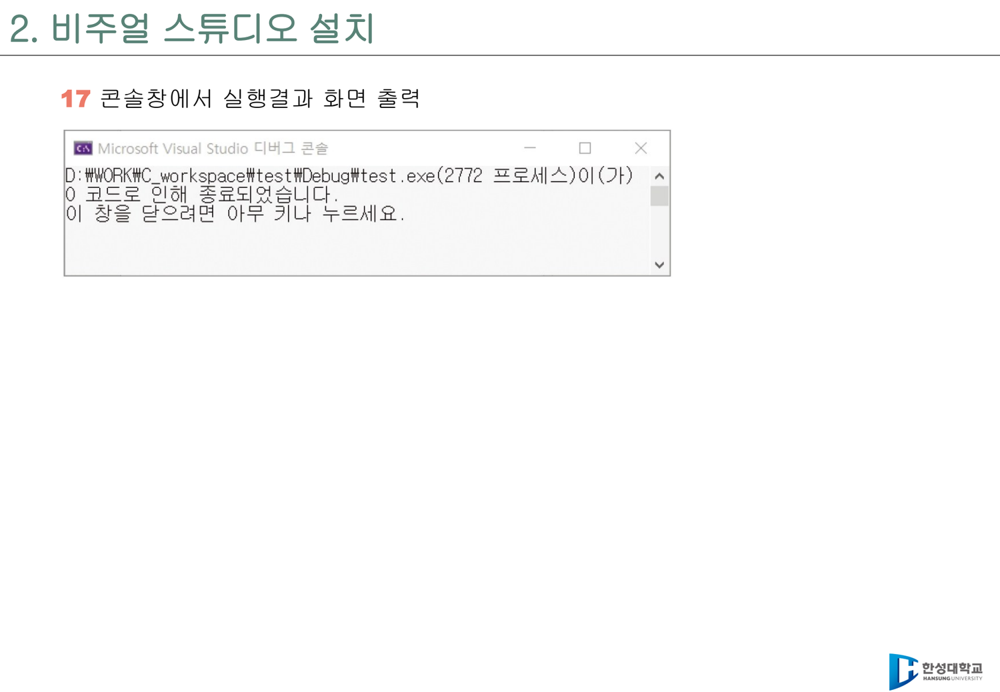
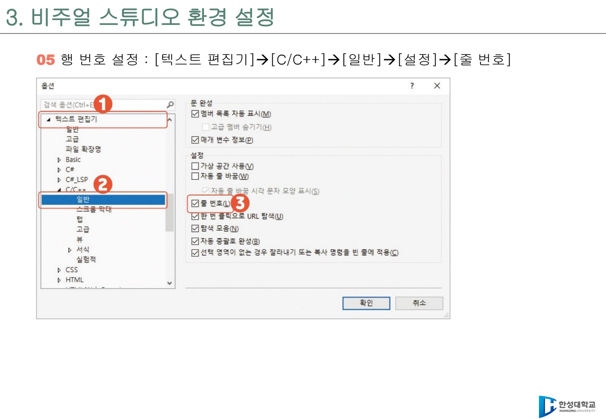
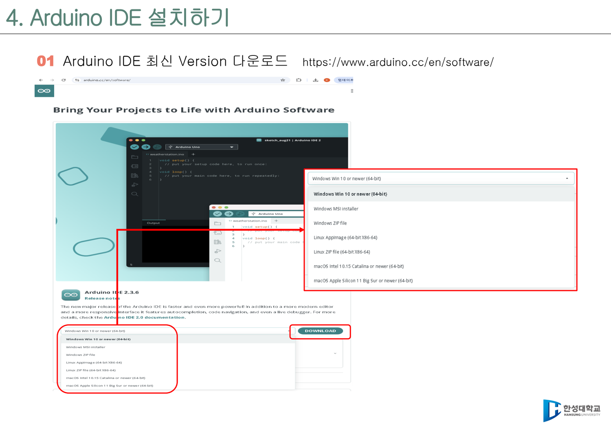
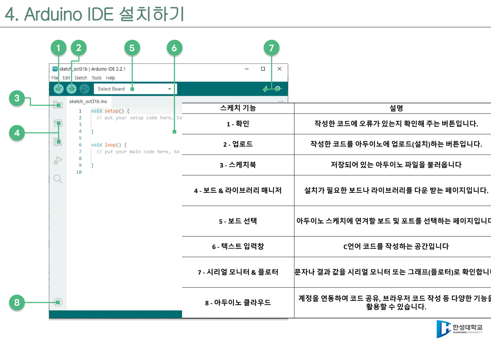

# 환경 설정 상세 가이드

이 문서는 1주차 PDF 자료의 Visual Studio 2022, Arduino IDE, Tinkercad 설치 내용을 바탕으로 정리한 실습 준비 안내다. 수업 첫 주에는 모든 학생이 **PC에서 C 코드를 컴파일하고**, **Arduino UNO R4 WiFi에 예제를 업로드하고**, **실습 결과를 저장할 준비**를 마치는 것이 목표다.

## 1. 컴파일러와 IDE의 역할

| 구분 | 의미 | 수업에서의 역할 |
|------|------|----------------|
| 컴파일러 | C 소스 코드를 컴퓨터가 실행할 수 있는 기계어로 바꾸는 프로그램 | `.c` 파일을 실행파일로 변환 |
| IDE | 편집, 빌드, 실행, 디버깅을 한곳에서 제공하는 통합 개발 환경 | Visual Studio, Arduino IDE |
| 프로젝트 | 소스 파일, 설정, 실행 정보를 묶은 작업 단위 | 과제와 실습을 주차별로 관리 |

C 언어는 실행 전에 컴파일이 필요하다. 따라서 C 수업에서는 문법만 아는 것으로 끝나지 않고, 소스 파일을 만들고 빌드하고 오류 메시지를 읽는 환경 사용 능력이 함께 필요하다.



*원본 강의자료 크롭: C 수업에서 컴파일러는 선택 사항이 아니라 필수 도구다. 소스 코드를 실행 가능한 형태로 바꾸는 과정을 항상 의식한다.*

## 2. Visual Studio 2022 설치

1. [Visual Studio Community](https://visualstudio.microsoft.com/ko/vs/community/) 페이지에 접속한다.
2. **Community 2022** 설치 파일을 내려받아 실행한다.
3. 워크로드 선택 화면에서 **C++를 사용한 데스크톱 개발**을 체크한다.
4. 필요하면 **개별 구성 요소**에서 도움말 뷰어를 선택한다.
5. 언어팩은 한국어를 기본으로 두고, 필요하면 영어도 함께 선택한다.
6. 설치를 시작한다. PC 성능과 네트워크 상태에 따라 시간이 오래 걸릴 수 있다.
7. 첫 실행 시 로그인 화면이 나오면 Microsoft 계정으로 로그인하거나 나중에 로그인을 선택한다.
8. 개발 설정은 **Visual C++** 계열로 선택하고, 색 테마는 편한 것으로 고른다.



*다운로드 버튼을 누른 뒤 브라우저에서 확인되지 않은 파일 경고가 나오면, 출처가 Visual Studio 공식 사이트인지 확인하고 설치를 진행한다.*



*C 언어 실습을 하더라도 Visual Studio에서는 C 컴파일 도구가 이 워크로드에 포함되어 있으므로 반드시 선택한다.*

!!! warning "C 수업인데 왜 C++ 워크로드를 선택하나?"
    Visual Studio에서는 C 컴파일에 필요한 도구가 **C++를 사용한 데스크톱 개발** 워크로드 안에 포함되어 있다. C++을 배우기 위한 선택이 아니라, C 컴파일러와 빌드 도구를 설치하기 위한 선택이다.

## 3. 첫 C 프로젝트 만들기

1. Visual Studio를 실행하고 **새 프로젝트 만들기**를 클릭한다.
2. **빈 프로젝트** 또는 **Windows 데스크톱 마법사**를 선택한다.
3. 프로젝트 이름을 예를 들어 `HelloWorld`로 입력한다.
4. 저장 위치를 확인하고 프로젝트를 만든다.
5. 오른쪽 **솔루션 탐색기**에서 **소스 파일**을 마우스 오른쪽 클릭한다.
6. **추가 → 새 항목**을 선택한다.
7. **C++ 파일(.cpp)** 항목을 선택하되, 파일 이름은 반드시 `Hello.c`처럼 `.c` 확장자로 끝나게 만든다.
8. 아래 코드를 입력한다.

```c
#include <stdio.h>

int main(void) {
    printf("Hello world!\n");
    return 0;
}
```

9. **디버그하지 않고 시작** 또는 `Ctrl + F5`로 실행한다.
10. 콘솔 창에 `Hello world!`가 출력되는지 확인한다.



*프로젝트 템플릿은 C 코드 실행을 위한 그릇이다. 이후 소스 파일을 직접 추가한다.*



*소스 파일은 반드시 프로젝트 안에 추가한다. 파일만 따로 만들면 Visual Studio 빌드 대상에 포함되지 않을 수 있다.*



*항목은 C++ 파일로 보이더라도 파일 이름을 `Hello.c`처럼 `.c`로 끝내야 C 언어 실습 흐름과 맞다.*



*실행 결과가 바로 닫히면 `Ctrl + F5`로 실행하거나 디버깅 옵션에서 콘솔 자동 닫기 설정을 확인한다.*

## 4. Visual Studio 기본 설정

| 설정 | 경로 | 권장 이유 |
|------|------|-----------|
| 프로젝트 저장 위치 | `도구 → 옵션 → 프로젝트 및 솔루션 → 위치` | 실습 파일을 찾기 쉽게 관리 |
| 색 테마 | `도구 → 옵션 → 환경 → 일반` | 장시간 코딩 시 눈 피로 감소 |
| 글꼴 | `도구 → 옵션 → 환경 → 글꼴 및 색` | 코드 가독성 향상 |
| 줄 번호 | `도구 → 옵션 → 텍스트 편집기 → C/C++ → 일반 → 줄 번호` | 오류 위치와 질문 위치를 정확히 공유 |
| 콘솔 자동 닫기 | `도구 → 옵션 → 디버깅 → 일반` | 실행 결과를 확인하기 쉽게 조정 |

수업에서는 오류 메시지의 줄 번호를 자주 확인한다. 따라서 줄 번호 표시를 반드시 켜 두는 것이 좋다.



*질문할 때 "오류가 났어요"보다 "17번째 줄에서 오류가 납니다"라고 말할 수 있어야 해결이 빨라진다.*

## 5. `scanf` 경고 처리

Visual Studio는 보안상 `scanf`보다 `scanf_s` 사용을 권장한다. 이 강의 자료에서는 Visual Studio 환경에 맞추어 기본 예제에서 `scanf_s`를 우선 사용한다.

다만 교재나 외부 예제에서 `scanf`가 그대로 등장할 수 있다. 학습 목적으로 `scanf` 예제를 컴파일해야 하는 경우에는 파일 맨 위에 다음 줄을 추가하면 경고를 줄일 수 있다.

```c
#define _CRT_SECURE_NO_WARNINGS
#include <stdio.h>
```

!!! note "수업 권장"
    처음 배우는 학생은 우선 `scanf_s("%d", &n);`처럼 `scanf_s`와 주소 연산자 `&`를 함께 쓰는 습관을 들인다. 교재 예제를 그대로 따라 해야 할 때만 `_CRT_SECURE_NO_WARNINGS`를 사용한다.

## 6. Arduino IDE 설치

1. [Arduino Software](https://www.arduino.cc/en/software/) 페이지에 접속한다.
2. Arduino IDE 2.x 최신 버전을 내려받아 설치한다.
3. UNO R4 WiFi 보드를 USB 케이블로 PC에 연결한다.
4. Arduino IDE에서 보드와 포트를 선택한다.
5. 아래 스케치를 입력하고 업로드한다.

```cpp
void setup() {
    Serial.begin(115200);
    Serial.println("Hello, Mobility!");
}

void loop() {
}
```

6. 시리얼 모니터를 열고 속도를 `115200`으로 맞춘다.
7. `Hello, Mobility!`가 보이면 업로드와 시리얼 통신이 정상이다.



*Arduino IDE는 보드에 코드를 올리는 도구다. Visual Studio가 PC용 C 실습 중심이라면, Arduino IDE는 보드 실행 확인 중심이다.*

## 7. Arduino IDE 화면 구성

| 기능 | 설명 |
|------|------|
| 확인 | 작성한 코드의 오류를 검사한다. |
| 업로드 | 코드를 보드에 컴파일해 전송한다. |
| 스케치북 | 저장된 Arduino 스케치를 연다. |
| 보드/라이브러리 매니저 | 필요한 보드 패키지와 라이브러리를 설치한다. |
| 보드 선택 | 연결할 보드와 포트를 고른다. |
| 텍스트 입력창 | Arduino C/C++ 코드를 작성한다. |
| 시리얼 모니터/플로터 | 문자 출력과 센서값 변화를 확인한다. |

Arduino 실습에서 가장 흔한 문제는 보드 종류, 포트, USB 케이블, 시리얼 모니터 속도 설정이다. 업로드가 안 될 때는 코드보다 이 네 가지를 먼저 확인한다.



*수업 중 가장 많이 사용할 버튼은 확인, 업로드, 보드 선택, 시리얼 모니터다. 코드 작성 전 보드와 포트가 맞는지 먼저 본다.*

## 8. Tinkercad 준비

Tinkercad는 실제 보드가 없거나 회로를 먼저 시뮬레이션하고 싶을 때 유용하다.

1. [Tinkercad](https://www.tinkercad.com/)에 접속한다.
2. 계정을 만들고 로그인한다.
3. Circuits 기능에서 Arduino 회로를 만든다.
4. LED, 저항, 버튼 같은 부품을 연결해 간단한 디지털 입출력을 실험한다.

이 강의의 중심 보드는 UNO R4 WiFi이지만, 기본 입출력 개념을 연습할 때는 Tinkercad 시뮬레이션도 도움이 된다.


*실제 보드가 없는 상황에서는 Tinkercad로 LED, 저항, 버튼 연결을 먼저 연습하고, 이후 같은 개념을 UNO R4 WiFi에서 확인한다.*

## 9. 1주차 제출 체크리스트

- [ ] Visual Studio 2022 설치 완료
- [ ] **C++를 사용한 데스크톱 개발** 워크로드 설치 확인
- [ ] `.c` 파일로 `Hello world!` 실행
- [ ] Arduino IDE 2.x 설치 완료
- [ ] UNO R4 WiFi 보드와 포트 선택
- [ ] `Hello, Mobility!` 시리얼 출력 확인
- [ ] GitHub 과제 저장소 생성
- [ ] 설치 화면과 실행 결과를 캡처해 저장
