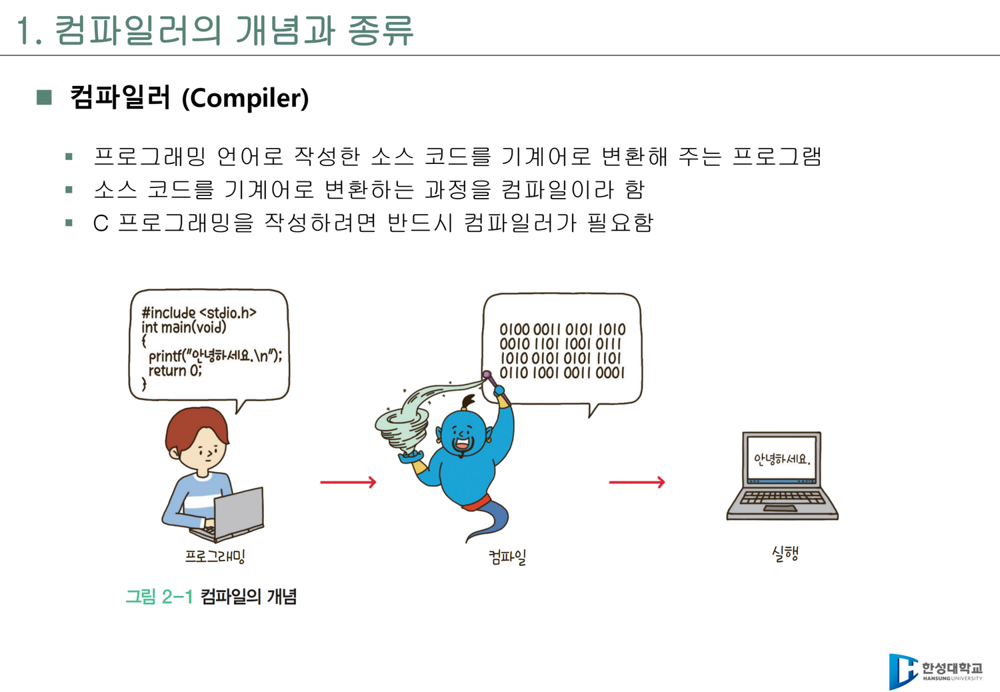
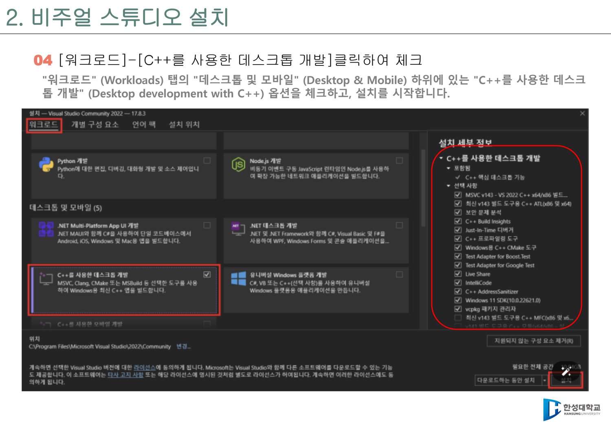
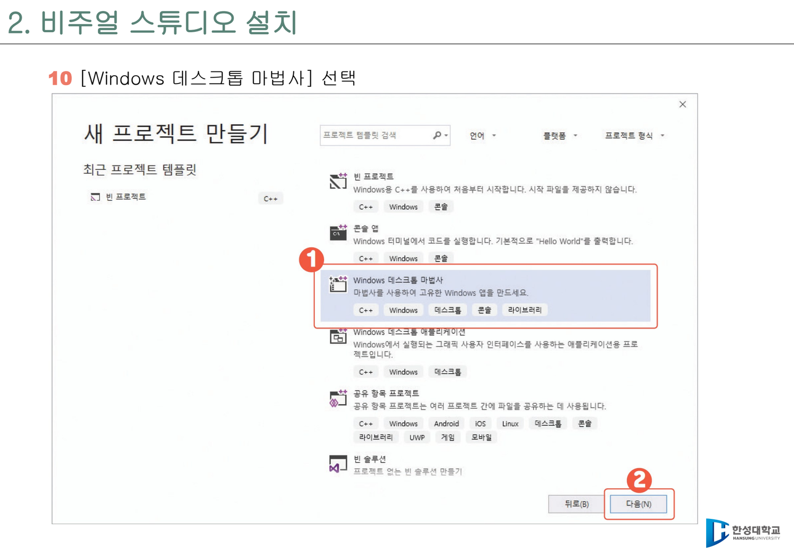
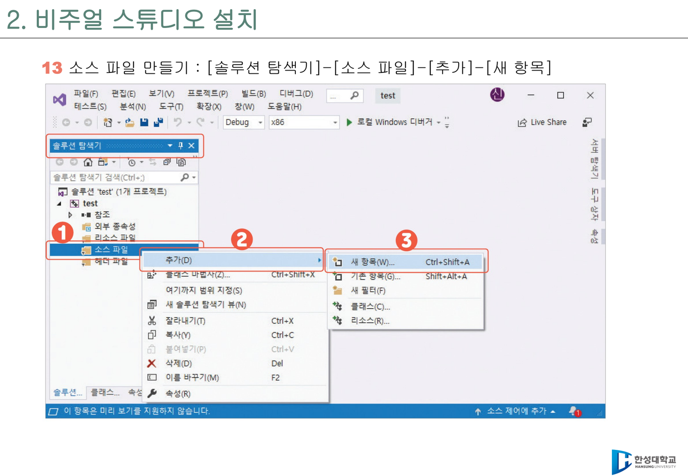
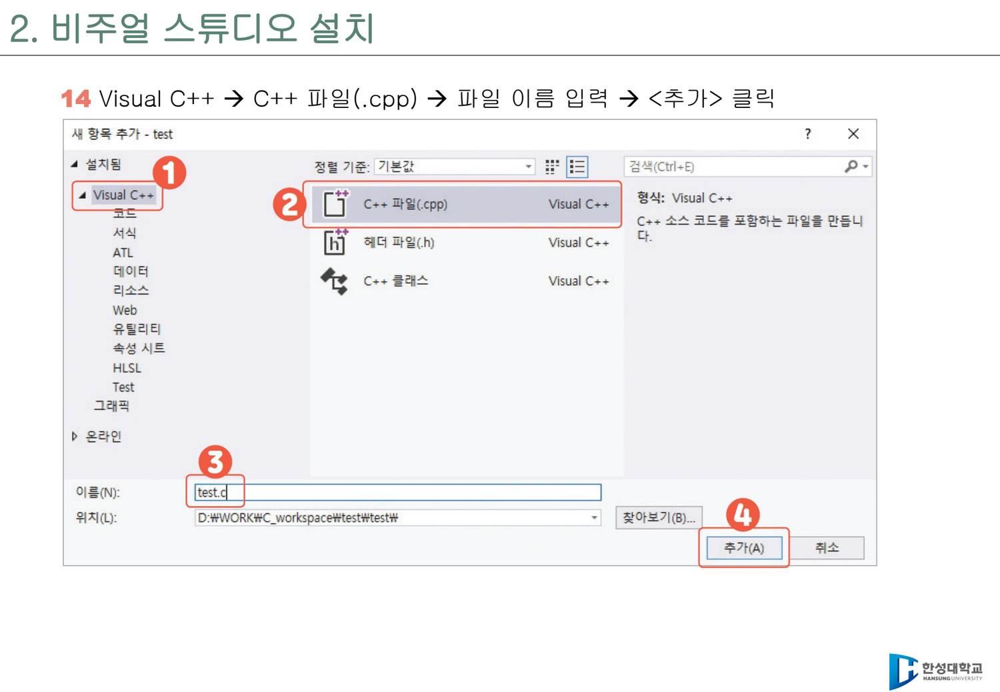
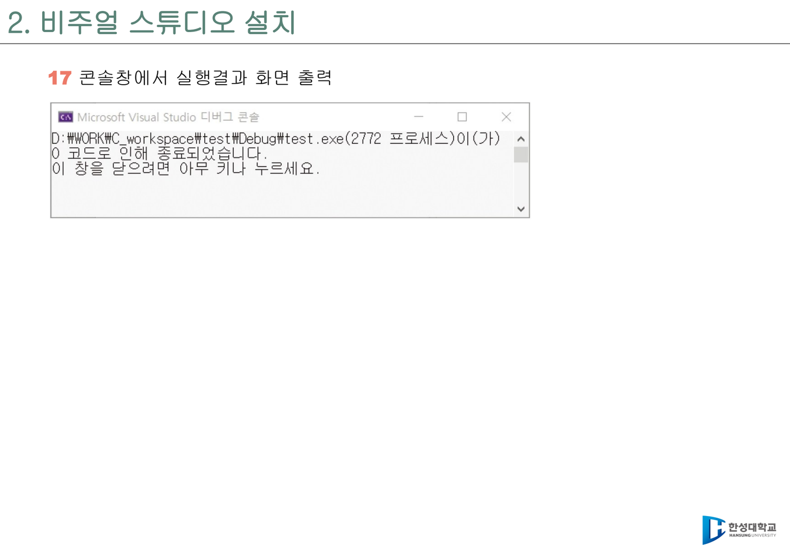
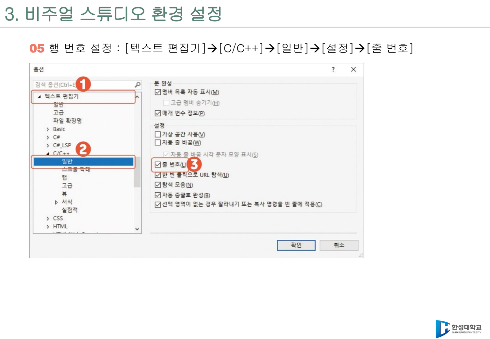
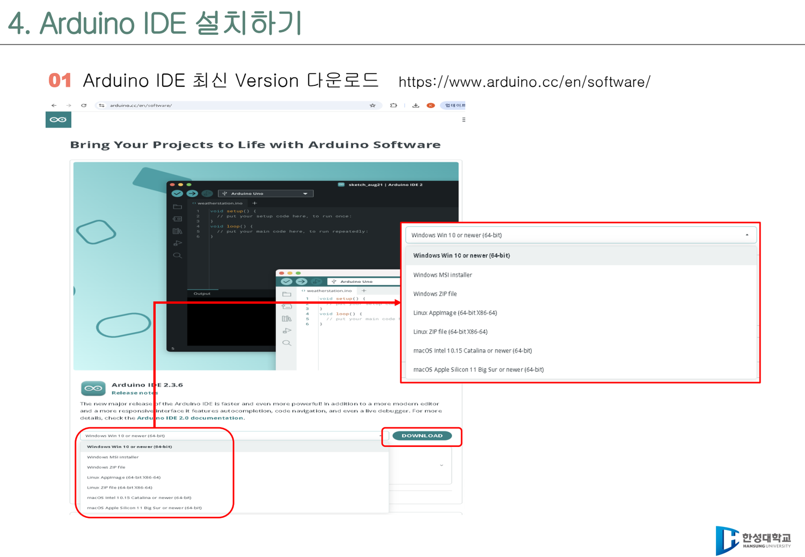
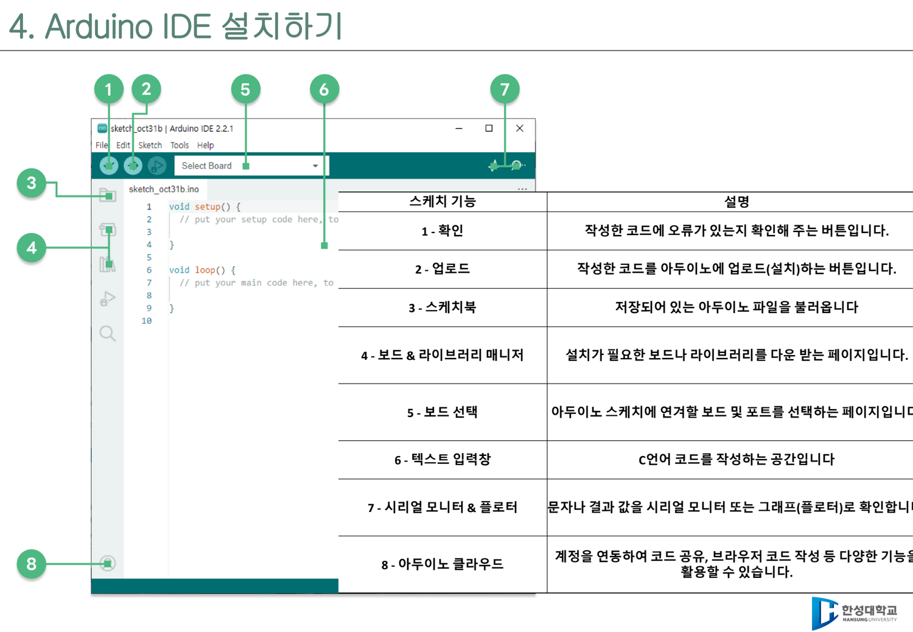

# 환경 설정 상세 가이드

이 문서는 1주차 PDF 자료의 Visual Studio 2022, Arduino IDE, Tinkercad 설치 내용을 바탕으로 정리한 실습 준비 안내다. 여기에 더해 6절에서는 같은 컴파일러를 그대로 쓰면서 편집기만 바꾸는 VS Code 구성을 선택 경로로 안내한다. 수업 첫 주에는 모든 학생이 **PC에서 C 코드를 컴파일하고**, **Arduino UNO R4 WiFi에 예제를 업로드하고**, **실습 결과를 저장할 준비**를 마치는 것이 목표다.

## 1. 컴파일러와 IDE의 역할

| 구분 | 의미 | 수업에서의 역할 |
|------|------|----------------|
| 컴파일러 | C 소스 코드를 컴퓨터가 실행할 수 있는 기계어로 바꾸는 프로그램 | `.c` 파일을 실행파일로 변환 |
| IDE | 편집, 빌드, 실행, 디버깅을 한곳에서 제공하는 통합 개발 환경 | Visual Studio, Arduino IDE |
| 프로젝트 | 소스 파일, 설정, 실행 정보를 묶은 작업 단위 | 과제와 실습을 주차별로 관리 |

C 언어는 실행 전에 컴파일이 필요하다. 따라서 C 수업에서는 문법만 아는 것으로 끝나지 않고, 소스 파일을 만들고 빌드하고 오류 메시지를 읽는 환경 사용 능력이 함께 필요하다.



*원본 강의자료 크롭: C 수업에서 컴파일러는 선택 사항이 아니라 필수 도구다. 소스 코드를 실행 가능한 형태로 바꾸는 과정을 항상 의식한다.*

## 2. Visual Studio 2022 설치

1. [Visual Studio Community](https://visualstudio.microsoft.com/ko/vs/community/) 페이지에 접속한다.
2. **Community 2022** 설치 파일을 내려받아 실행한다.
3. 워크로드 선택 화면에서 **C++를 사용한 데스크톱 개발**을 체크한다.
4. 필요하면 **개별 구성 요소**에서 도움말 뷰어를 선택한다.
5. 언어팩은 한국어를 기본으로 두고, 필요하면 영어도 함께 선택한다.
6. 설치를 시작한다. PC 성능과 네트워크 상태에 따라 시간이 오래 걸릴 수 있다.
7. 첫 실행 시 로그인 화면이 나오면 Microsoft 계정으로 로그인하거나 나중에 로그인을 선택한다.
8. 개발 설정은 **Visual C++** 계열로 선택하고, 색 테마는 편한 것으로 고른다.


*다운로드 버튼을 누른 뒤 브라우저에서 확인되지 않은 파일 경고가 나오면, 출처가 Visual Studio 공식 사이트인지 확인하고 설치를 진행한다.*



*C 언어 실습을 하더라도 Visual Studio에서는 C 컴파일 도구가 이 워크로드에 포함되어 있으므로 반드시 선택한다.*

!!! warning "C 수업인데 왜 C++ 워크로드를 선택하나?"
    Visual Studio에서는 C 컴파일에 필요한 도구가 **C++를 사용한 데스크톱 개발** 워크로드 안에 포함되어 있다. C++을 배우기 위한 선택이 아니라, C 컴파일러와 빌드 도구를 설치하기 위한 선택이다.

## 3. 첫 C 프로젝트 만들기

1. Visual Studio를 실행하고 **새 프로젝트 만들기**를 클릭한다.
2. **빈 프로젝트** 또는 **Windows 데스크톱 마법사**를 선택한다.
3. 프로젝트 이름을 예를 들어 `HelloWorld`로 입력한다.
4. 저장 위치를 확인하고 프로젝트를 만든다.
5. 오른쪽 **솔루션 탐색기**에서 **소스 파일**을 마우스 오른쪽 클릭한다.
6. **추가 → 새 항목**을 선택한다.
7. **C++ 파일(.cpp)** 항목을 선택하되, 파일 이름은 반드시 `Hello.c`처럼 `.c` 확장자로 끝나게 만든다.
8. 아래 코드를 입력한다.

```c
#include <stdio.h>

int main(void) {
    printf("Hello world!\n");
    return 0;
}
```

9. **디버그하지 않고 시작** 또는 `Ctrl + F5`로 실행한다.
10. 콘솔 창에 `Hello world!`가 출력되는지 확인한다.



*프로젝트 템플릿은 C 코드 실행을 위한 그릇이다. 이후 소스 파일을 직접 추가한다.*



*소스 파일은 반드시 프로젝트 안에 추가한다. 파일만 따로 만들면 Visual Studio 빌드 대상에 포함되지 않을 수 있다.*



*항목은 C++ 파일로 보이더라도 파일 이름을 `Hello.c`처럼 `.c`로 끝내야 C 언어 실습 흐름과 맞다.*



*실행 결과가 바로 닫히면 `Ctrl + F5`로 실행하거나 디버깅 옵션에서 콘솔 자동 닫기 설정을 확인한다.*

## 4. Visual Studio 기본 설정

| 설정 | 경로 | 권장 이유 |
|------|------|-----------|
| 프로젝트 저장 위치 | `도구 → 옵션 → 프로젝트 및 솔루션 → 위치` | 실습 파일을 찾기 쉽게 관리 |
| 색 테마 | `도구 → 옵션 → 환경 → 일반` | 장시간 코딩 시 눈 피로 감소 |
| 글꼴 | `도구 → 옵션 → 환경 → 글꼴 및 색` | 코드 가독성 향상 |
| 줄 번호 | `도구 → 옵션 → 텍스트 편집기 → C/C++ → 일반 → 줄 번호` | 오류 위치와 질문 위치를 정확히 공유 |
| 콘솔 자동 닫기 | `도구 → 옵션 → 디버깅 → 일반` | 실행 결과를 확인하기 쉽게 조정 |

수업에서는 오류 메시지의 줄 번호를 자주 확인한다. 따라서 줄 번호 표시를 반드시 켜 두는 것이 좋다.



*질문할 때 "오류가 났어요"보다 "17번째 줄에서 오류가 납니다"라고 말할 수 있어야 해결이 빨라진다.*

## 5. `scanf` 경고 처리

Visual Studio는 보안상 `scanf`보다 `scanf_s` 사용을 권장한다. 이 강의 자료에서는 Visual Studio 환경에 맞추어 기본 예제에서 `scanf_s`를 우선 사용한다.

다만 교재나 외부 예제에서 `scanf`가 그대로 등장할 수 있다. 학습 목적으로 `scanf` 예제를 컴파일해야 하는 경우에는 파일 맨 위에 다음 줄을 추가하면 경고를 줄일 수 있다.

```c
#define _CRT_SECURE_NO_WARNINGS
#include <stdio.h>
```

!!! note "수업 권장"
    처음 배우는 학생은 우선 `scanf_s("%d", &n);`처럼 `scanf_s`와 주소 연산자 `&`를 함께 쓰는 습관을 들인다. 교재 예제를 그대로 따라 해야 할 때만 `_CRT_SECURE_NO_WARNINGS`를 사용한다.

## 6. VS Code로 실습하기 (선택)

Visual Studio 2022는 프로젝트와 솔루션 단위로 움직이기 때문에, 파일 하나짜리 주차 실습에는 준비 단계가 다소 무겁다. VS Code는 폴더 하나를 그대로 열어 `.c` 파일을 바로 빌드·디버깅할 수 있어 주차 과제에 편하다.

!!! warning "VS Code는 컴파일러가 아니다"
    VS Code는 편집기다. C 코드를 실제로 번역하는 것은 **2절에서 설치한 Visual Studio 2022의 컴파일러 `cl.exe`** 다. 따라서 VS Code를 쓰더라도 **Visual Studio 2022를 지우면 안 된다.** 이 구성을 택하는 이유도 여기에 있다. 같은 `cl.exe`를 쓰므로 이 강의의 `scanf_s()` 예제가 그대로 동작하고, 과제 채점 기준인 "Visual Studio 2022에서 경고 없이 빌드"와 결과가 일치한다.

### 6.1 설치

1. [VS Code](https://code.visualstudio.com/) 페이지에서 Windows 설치 파일을 내려받아 실행한다.
2. 설치 옵션에서 **"Code로 열기" 작업을 Windows 탐색기 파일/디렉터리 상황에 맞는 메뉴에 추가**와 **PATH에 추가**를 체크한다.
3. VS Code를 열고 왼쪽 활동 표시줄의 **확장**(`Ctrl + Shift + X`)을 클릭한다.
4. 검색창에 `C/C++ Extension Pack`을 입력하고, **게시자가 Microsoft인 것**을 확인한 뒤 설치한다.
5. (선택) `Korean Language Pack`을 설치하면 메뉴가 한국어로 바뀐다.

확장팩 하나에 다음 세 가지가 함께 설치된다.

| 확장 | 하는 일 | 이 수업에서 |
|------|---------|-------------|
| C/C++ | IntelliSense(자동완성·오류 표시), 디버깅 | 필수 |
| C/C++ Themes | C 코드용 색 테마 | 선택 |
| CMake Tools | CMake 프로젝트 관리 | 이 수업에서는 쓰지 않음 |

!!! tip "CMake Tools가 거슬리면"
    파일 하나짜리 실습에서는 CMake Tools가 "CMakeLists.txt를 찾을 수 없다"는 알림을 띄울 수 있다. 확장 목록에서 CMake Tools를 **사용 안 함**으로 두어도 C 실습에는 영향이 없다.

### 6.2 반드시 이 방법으로 실행한다

여기가 가장 많이 막히는 지점이다. `cl.exe`는 환경변수가 준비된 상태에서만 동작하므로, **VS Code를 바탕화면 아이콘으로 직접 열면 컴파일러를 찾지 못한다.**

1. 시작 메뉴에서 **`Developer Command Prompt for VS 2022`**(한국어판은 **`VS 2022용 개발자 명령 프롬프트`**)를 찾아 실행한다.
2. 실습 폴더로 이동한다.
3. `code .` 을 입력한다. 점(`.`)은 "현재 폴더를 열라"는 뜻이다.

```text
C:\> mkdir C:\cprog\week01
C:\> cd C:\cprog\week01
C:\cprog\week01> code .
```

**제대로 열렸는지 확인하는 방법**은 하나뿐이다. VS Code에서 터미널을 열고(`` Ctrl + ` ``) `cl` 을 입력한다.

```text
C:\cprog\week01> cl
Microsoft (R) C/C++ Optimizing Compiler Version 19.xx.xxxxx for x64
```

이 배너가 나오면 성공이다. `'cl'은(는) 내부 또는 외부 명령... 이 아닙니다`가 나오면 개발자 명령 프롬프트를 거치지 않고 연 것이므로, VS Code를 닫고 1번부터 다시 한다.

!!! note "매번 이렇게 열어야 하나"
    그렇다. 이 구성에서는 개발자 명령 프롬프트가 컴파일러 환경을 물려주는 통로다. 번거로우면 바탕화면에 개발자 명령 프롬프트 바로가기를 만들어 두고, 거기서 `code .` 로 시작하는 습관을 들인다.

### 6.3 첫 파일 만들고 빌드하기

1. 탐색기 창에서 **새 파일** 아이콘을 눌러 `Hello.c`를 만든다. 확장자는 반드시 `.c`다.
2. 아래 코드를 입력하고 저장한다(`Ctrl + S`).

```c
#include <stdio.h>

int main(void) {
    printf("Hello world!\n");
    return 0;
}
```

3. `Ctrl + Shift + B`를 누르고 **`C/C++: cl.exe 활성 파일 빌드`**를 선택한다.
4. 처음 한 번은 VS Code가 `.vscode/tasks.json`을 자동으로 만든다.

만들어진 `tasks.json`을 다음처럼 손봐 두면 이 수업의 채점 기준과 맞는다.

```json
{
  "version": "2.0.0",
  "tasks": [
    {
      "type": "cppbuild",
      "label": "C: cl.exe 활성 파일 빌드",
      "command": "cl.exe",
      "args": [
        "/Zi",
        "/W4",
        "/nologo",
        "/Fe:",
        "${fileDirname}\\${fileBasenameNoExtension}.exe",
        "${file}"
      ],
      "options": { "cwd": "${fileDirname}" },
      "problemMatcher": ["$msCompile"],
      "group": { "kind": "build", "isDefault": true }
    }
  ]
}
```

| 옵션 | 뜻 | 왜 넣는가 |
|------|-----|-----------|
| `/Zi` | 디버그 정보 생성 | 중단점을 걸려면 필요 |
| `/W4` | 경고 수준 4 | 과제 제출 기준이 "수준 4에서 경고 0개"다 |
| `/nologo` | 시작 배너 숨김 | 출력에서 오류만 보이게 |
| `/Fe:` | 실행파일 이름 지정 | `Hello.c` → `Hello.exe` |

빌드가 끝나면 터미널에서 실행한다.

```text
C:\cprog\week01> .\Hello.exe
Hello world!
```

### 6.4 디버깅과 `scanf_s()` 입력

`F5`를 누르고 **C++ (Windows)** → **`cl.exe 활성 파일 빌드 및 디버그`**를 선택하면 `.vscode/launch.json`이 만들어진다.

!!! danger "이 한 줄이 없으면 `scanf_s()`에서 멈춘다"
    VS Code의 기본 디버그 콘솔은 **키보드 입력을 받지 않는다.** 이 강의 예제는 3주차부터 대부분 `scanf_s()`로 값을 입력받으므로, `launch.json`에 반드시 `"console": "integratedTerminal"` 을 넣어야 한다. 이 줄이 없으면 프로그램이 입력을 기다리며 멈춘 것처럼 보인다.

```json
{
  "version": "0.2.0",
  "configurations": [
    {
      "name": "C: cl.exe 활성 파일 디버그",
      "type": "cppvsdbg",
      "request": "launch",
      "program": "${fileDirname}\\${fileBasenameNoExtension}.exe",
      "args": [],
      "stopAtEntry": false,
      "cwd": "${fileDirname}",
      "console": "integratedTerminal",
      "preLaunchTask": "C: cl.exe 활성 파일 빌드"
    }
  ]
}
```

디버깅 기본 조작은 다음 네 가지면 충분하다.

| 조작 | 키 | 하는 일 |
|------|-----|---------|
| 중단점 | 줄 번호 왼쪽 클릭 | 그 줄에서 실행을 멈춘다 |
| 프로시저 단위 실행 | `F10` | 한 줄씩 넘어간다 |
| 한 단계씩 코드 실행 | `F11` | 함수 안으로 들어간다 |
| 계속 | `F5` | 다음 중단점까지 진행 |

!!! tip "12주차 포인터 예습"
    멈춘 상태에서 왼쪽 **조사식**에 `&count`를 입력하면 변수의 **주소**가 보인다. 3주차에서 "`scanf_s()`에 왜 `&`가 필요한가"로 설명했던 내용을, 12주차 포인터 단원 전에 눈으로 확인할 수 있다.

### 6.5 IntelliSense 구성

`Ctrl + Shift + P` → **`C/C++: 구성 편집(UI)`** 을 열고 세 가지만 맞춘다.

| 항목 | 값 |
|------|-----|
| 컴파일러 경로 | `cl.exe` |
| IntelliSense 모드 | `windows-msvc-x64` |
| C 표준 | `c17` |

C 표준을 `c17`로 두는 이유는 과제 소스 머리말에 적는 `환경: Visual Studio 2022 (C17)` 표기와 맞추기 위해서다.

### 6.6 한글이 깨질 때

VS Code는 파일을 기본적으로 **BOM 없는 UTF-8**로 저장한다. 그런데 `cl.exe`는 BOM이 없으면 소스를 Windows 기본 코드페이지(한국어판은 CP949)로 읽으므로, 한글 문자열이 깨지거나 경고가 난다.

**해결**: 파일을 **UTF-8 with BOM**으로 저장한다. 설정에 다음 한 줄을 넣으면 이후 새로 만드는 파일에 자동 적용된다.

```json
"files.encoding": "utf8bom"
```

이미 만든 파일은 아래쪽 상태 표시줄의 `UTF-8`을 클릭 → **인코딩하여 저장** → **UTF-8 with BOM**을 고른다.

!!! note "왜 BOM을 붙이는 쪽을 고르나"
    `/utf-8` 컴파일 옵션으로도 소스는 읽히지만, 그러면 실행 시점의 한글도 UTF-8 3바이트가 되어 `printf("%-6s", "국어")` 같은 **자리 맞춤 폭이 강의자료와 달라진다.** BOM만 붙이면 소스는 정확히 읽히고 실행 문자셋은 CP949 그대로라, 강의자료·과제 예시의 출력 정렬이 그대로 재현된다. 같은 이유로 Visual Studio 2022에서 열어도 문제가 없다.

### 6.7 동작 확인 체크리스트

- [ ] 개발자 명령 프롬프트에서 `code .` 로 열었다
- [ ] 통합 터미널에서 `cl` 배너가 나온다
- [ ] `Ctrl + Shift + B` 로 `.exe`가 만들어진다
- [ ] `F5` 로 중단점에서 실행이 멈춘다
- [ ] `scanf_s()` 예제에서 통합 터미널에 값을 입력할 수 있다
- [ ] 한글 `printf` 출력이 깨지지 않는다

### 6.8 이 구성으로 되지 않는 것

- **`gcc` 빌드는 되지 않는다.** `cl.exe`는 Microsoft 컴파일러다. 과제 1이 요구하는 gcc 빌드와 `code/index.md`의 `gcc -Wall -Wextra -std=c11` 명령은 WSL이나 온라인 컴파일러 같은 별도 경로가 필요하다.
- **Arduino 스케치 업로드는 다루지 않는다.** 보드 실습은 7절의 Arduino IDE를 그대로 사용한다.

## 7. Arduino IDE 설치

1. [Arduino Software](https://www.arduino.cc/en/software/) 페이지에 접속한다.
2. Arduino IDE 2.x 최신 버전을 내려받아 설치한다.
3. UNO R4 WiFi 보드를 USB 케이블로 PC에 연결한다.
4. Arduino IDE에서 보드와 포트를 선택한다.
5. 아래 스케치를 입력하고 업로드한다.

```cpp
void setup() {
    Serial.begin(115200);
    Serial.println("Hello, Mobility!");
}

void loop() {
}
```

6. 시리얼 모니터를 열고 속도를 `115200`으로 맞춘다.
7. `Hello, Mobility!`가 보이면 업로드와 시리얼 통신이 정상이다.



*Arduino IDE는 보드에 코드를 올리는 도구다. Visual Studio가 PC용 C 실습 중심이라면, Arduino IDE는 보드 실행 확인 중심이다.*

## 8. Arduino IDE 화면 구성

| 기능 | 설명 |
|------|------|
| 확인 | 작성한 코드의 오류를 검사한다. |
| 업로드 | 코드를 보드에 컴파일해 전송한다. |
| 스케치북 | 저장된 Arduino 스케치를 연다. |
| 보드/라이브러리 매니저 | 필요한 보드 패키지와 라이브러리를 설치한다. |
| 보드 선택 | 연결할 보드와 포트를 고른다. |
| 텍스트 입력창 | Arduino C/C++ 코드를 작성한다. |
| 시리얼 모니터/플로터 | 문자 출력과 센서값 변화를 확인한다. |

Arduino 실습에서 가장 흔한 문제는 보드 종류, 포트, USB 케이블, 시리얼 모니터 속도 설정이다. 업로드가 안 될 때는 코드보다 이 네 가지를 먼저 확인한다.



*수업 중 가장 많이 사용할 버튼은 확인, 업로드, 보드 선택, 시리얼 모니터다. 코드 작성 전 보드와 포트가 맞는지 먼저 본다.*

## 9. Tinkercad 준비

Tinkercad는 실제 보드가 없거나 회로를 먼저 시뮬레이션하고 싶을 때 유용하다.

1. [Tinkercad](https://www.tinkercad.com/)에 접속한다.
2. 계정을 만들고 로그인한다.
3. Circuits 기능에서 Arduino 회로를 만든다.
4. LED, 저항, 버튼 같은 부품을 연결해 간단한 디지털 입출력을 실험한다.

이 강의의 중심 보드는 UNO R4 WiFi이지만, 기본 입출력 개념을 연습할 때는 Tinkercad 시뮬레이션도 도움이 된다.


*실제 보드가 없는 상황에서는 Tinkercad로 LED, 저항, 버튼 연결을 먼저 연습하고, 이후 같은 개념을 UNO R4 WiFi에서 확인한다.*

## 10. 1주차 제출 체크리스트

- [ ] Visual Studio 2022 설치 완료
- [ ] **C++를 사용한 데스크톱 개발** 워크로드 설치 확인
- [ ] `.c` 파일로 `Hello world!` 실행
- [ ] (선택) VS Code + C/C++ Extension Pack 설치, 터미널에서 `cl` 배너 확인
- [ ] Arduino IDE 2.x 설치 완료
- [ ] UNO R4 WiFi 보드와 포트 선택
- [ ] `Hello, Mobility!` 시리얼 출력 확인
- [ ] GitHub 과제 저장소 생성
- [ ] 설치 화면과 실행 결과를 캡처해 저장
