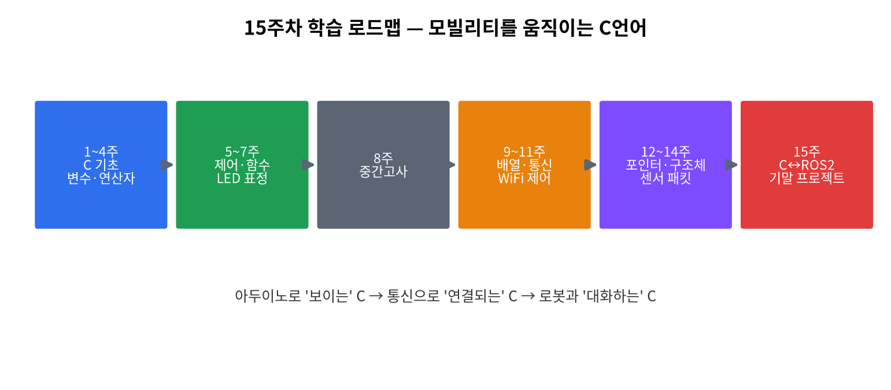

# 1주차 · 오리엔테이션 · 환경설정 · "왜 C인가"
> C언어 · 미래모빌리티학과 | CLO1 | 교재 Ch01–02



## 학습 목표
- C언어의 위치와 특징을 설명하고, **컴파일 과정**을 단계별로 이해한다.
- Visual Studio 2022 / Arduino IDE / (선택) Linux·gcc 환경을 구축한다.
- Git/GitHub로 과제 저장소를 만들고 첫 커밋을 push한다.

---

## 1. 이론

### 1.1 C언어란 무엇인가
- 1972년 데니스 리치(Dennis Ritchie)가 UNIX 개발을 위해 만든 **절차지향 언어**.
- 특징: **하드웨어에 가까움**(저수준 제어) + **이식성** + **빠른 실행 속도**.
- 그래서 운영체제·임베디드·자동차 ECU·로봇 펌웨어의 **기반 언어**로 지금도 1순위.

!!! note "왜 모빌리티에서 C인가 (2026)"
    자동차가 **SDV(소프트웨어 정의 차량)·Physical AI**로 진화해도, 실시간 제어 루프·센서 드라이버·모터 제어는 **결정론적(deterministic)** 으로 동작해야 한다. 이 계층의 표준이 C/C++다.
    **"AI는 두뇌, C는 신경·근육."** → [2026 트렌드 검토](review.md)

### 1.2 컴파일 과정 (소스 → 실행파일)
```
hello.c ─(전처리)→ ─(컴파일)→ hello.s ─(어셈블)→ hello.o ─(링크)→ hello(실행파일)
 #include 처리      C→어셈블리     어셈블리→기계어   라이브러리 결합
```
| 단계 | 하는 일 |
|------|---------|
| 전처리(preprocess) | `#include`, `#define` 치환 |
| 컴파일(compile) | C 코드 → 어셈블리 |
| 어셈블(assemble) | 어셈블리 → 목적파일(`.o`) |
| 링크(link) | 목적파일 + 표준 라이브러리 → 실행파일 |

> 인터프리터(파이썬)는 한 줄씩 즉시 해석한다. C는 **미리 통째로 번역**해서 빠르다.

### 1.3 C 프로그램의 기본 구조
```c
#include <stdio.h>      // 전처리기: 표준 입출력 기능을 포함
int main(void) {        // main: 프로그램이 시작되는 함수
    printf("Hello, Mobility!\n");
    return 0;           // 0 = 정상 종료
}
```
- `#include <stdio.h>` : `printf`를 쓰기 위한 선언 포함.
- `int main(void)` : 모든 C 프로그램의 **시작점**.
- `return 0;` : 종료 코드(0=성공).

### 1.4 개발환경 3종
| 환경 | 용도 |
|------|------|
| Visual Studio 2022 | PC에서 C 작성·컴파일·디버깅(주력) |
| Arduino IDE 2.x | 보드(UNO R4 WiFi)에 업로드 |
| Linux + gcc(선택) | 명령줄 컴파일, ROS2의 기반(후반부) |

---

## 2. 핵심 용어 정리
| 용어 | 설명 |
|------|------|
| 컴파일러 | 소스코드를 기계어로 번역하는 프로그램 |
| 링커 | 목적파일·라이브러리를 묶어 실행파일을 만드는 단계 |
| IDE | 편집·컴파일·디버깅 통합개발환경 |
| 소스/목적/실행 파일 | `.c` / `.o`(.obj) / 실행파일 |
| 표준 라이브러리 | `stdio.h` 등 기본 제공 함수 모음 |
| 펌웨어 | 하드웨어(보드)에 올라가 동작하는 SW |
| SDV | Software-Defined Vehicle |
| Git/commit/push | 버전관리 / 변경 기록 / 원격 업로드 |

---

## 3. 실습

### 실습 1-1 · VS2022 첫 빌드
빈 콘솔 프로젝트 → `main.c`(위 1.3) → 빌드·실행 → `Hello, Mobility!` 확인.

### 실습 1-2 · gcc 컴파일(선택, Linux/WSL)
```bash
gcc hello.c -o hello   # 컴파일
./hello                # 실행
```

### 실습 1-3 · 아두이노 첫 출력
```cpp
void setup() { Serial.begin(115200); Serial.println("Hello, Mobility!"); }
void loop() {}
```

### 실습 1-4 · GitHub 과제 저장소
개인 저장소 생성 → `add → commit → push`. 학기말 **포트폴리오**가 된다.

---

## 4. 과제
- 설치 스크린샷·보드 인식·`Hello` 출력 → **GitHub에 push**.

## 5. 참조
- 교재 Ch01–02
- C 레퍼런스 <https://en.cppreference.com/w/c> · Arduino <https://docs.arduino.cc/> · Git <https://docs.github.com/get-started>

## 형성평가 체크포인트
- [ ] 컴파일 4단계 설명 · [ ] 첫 빌드 성공 · [ ] GitHub push · [ ] "C가 왜 중요한가" 한 문장
