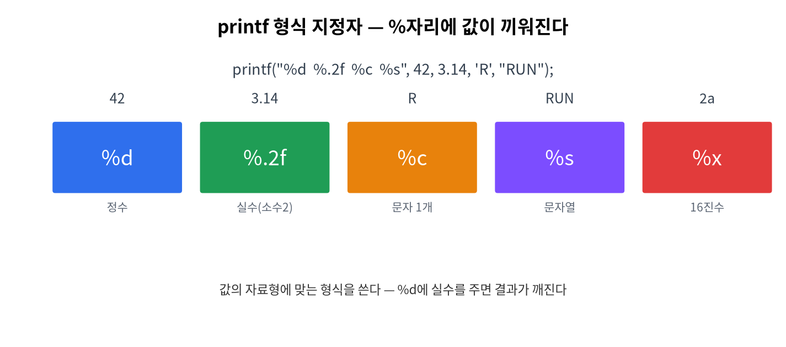

# 2주차 · 표준 출력 (printf)
> C언어 · 미래모빌리티학과 | CLO1 | 교재 Ch03




## 학습 목표
- `printf`의 **형식 지정자**·폭·정밀도·이스케이프 문자를 정확히 사용한다.
- "차량 대시보드"를 보기 좋게 정렬 출력한다.

---

## 강의 해설

2주차는 C 프로그램이 사용자에게 정보를 보여 주는 방법을 배운다. `printf`는 단순히 글자를 출력하는 함수처럼 보이지만, 실제로는 값의 종류를 해석하고 사람이 읽기 좋은 형태로 바꾸는 도구다. 속도, RPM, 배터리 잔량, 센서 상태처럼 모빌리티 시스템에서 계속 관찰해야 하는 값은 결국 화면, 로그, 시리얼 모니터, 대시보드 중 어딘가에 출력된다.

학생들이 가장 자주 헷갈리는 부분은 형식 지정자와 실제 변수의 자료형을 맞추는 일이다. `%d`는 정수, `%f`는 실수, `%c`는 문자, `%s`는 문자열이다. 이 짝이 맞지 않으면 출력이 이상해지거나 경고가 발생한다. 따라서 `printf`는 "출력 함수"이면서 동시에 "자료형을 정확히 의식하는 연습"이다.

폭과 정밀도는 시험용 잔기술이 아니라 데이터 표시 품질과 관련된다. 예를 들어 차량 대시보드에서 숫자 칸이 매번 흔들리면 운전자가 읽기 어렵고, 로그 파일에서도 값이 정렬되어야 비교가 쉽다. 이번 주차에서는 `%6.1f`, `%-10s`, `%05d` 같은 표현을 보면서 "데이터를 보기 좋게 설계한다"는 감각을 익힌다.

## 3시간 강의 운영 포인트

- **0~20분**: 1주차 환경 오류를 빠르게 점검하고, `printf`가 디버깅과 로그의 출발점임을 연결한다.
- **20~70분**: 형식 문자열, 형식 지정자, 이스케이프 문자를 작은 예제로 반복 시연한다. 자료형과 지정자가 맞지 않을 때 어떤 경고와 이상 출력이 생기는지 일부러 보여 준다.
- **70~135분**: 차량 대시보드 예제를 함께 작성한다. 숫자 폭과 정밀도를 바꾸며 출력 정렬이 어떻게 달라지는지 학생이 직접 비교하게 한다.
- **135~180분**: 표 정렬 미션을 개인 실습으로 진행하고, 마지막에는 가장 읽기 쉬운 출력 형식을 서로 비교한다. 이때 "보기 좋은 로그가 좋은 디버깅을 만든다"는 메시지로 정리한다.

## 강의 본문 보강

### 개념을 더 풀어 설명하기
`printf`는 단순한 출력 함수가 아니라 프로그램 내부 상태를 밖으로 꺼내 보여 주는 창이다. C를 처음 배울 때는 디버거보다 `printf`가 더 직관적인 관찰 도구가 된다. 변수에 어떤 값이 들어갔는지, 계산 결과가 예상과 맞는지, 조건문이 어느 방향으로 갔는지 확인할 때 가장 먼저 쓰는 함수가 `printf`다.

형식 지정자는 값의 종류를 약속하는 기호다. `%d`는 정수, `%f`는 실수, `%c`는 문자, `%s`는 문자열을 뜻한다. 학생이 여기서 배워야 할 핵심은 "컴퓨터는 내가 의도한 자료형을 추측하지 않는다"는 점이다. 형식 지정자와 실제 값의 자료형이 어긋나면 출력이 이상해지거나 경고가 발생한다. 이 경험이 3주차 자료형 학습으로 자연스럽게 이어진다.

### 라이브 코딩 흐름
처음에는 `printf("Hello\n");`처럼 고정 문장을 출력한다. 다음에는 `int speed = 42;`를 만들고 `printf("speed=%d\n", speed);`로 변수값을 출력한다. 이후 속도, RPM, 배터리, 기어, 상태를 한 줄 대시보드로 출력한다. 마지막에는 폭과 정밀도를 조정해 숫자가 흔들리지 않는 표를 만든다.

```c
printf("%-10s %6.1f %6d %5.1f%%\n", "RUN", 42.5, 1500, 87.3);
```

이 한 줄을 설명할 때는 문자열 왼쪽 정렬, 실수 소수점 한 자리, 정수 폭 지정, 퍼센트 출력까지 한꺼번에 연결한다.

### 학생 활동
- 같은 값을 `%d`, `%f`, `%c`로 바꾸어 출력해 보고 결과를 비교한다.
- 차량 대시보드를 3줄 이상 출력하고 열이 맞도록 폭을 조정한다.
- `\n`, `\t`, `\\`, `\"`를 각각 한 번 이상 사용한 예제를 만든다.
- 보기 좋은 출력과 보기 어려운 출력을 비교해 어떤 차이가 있는지 적는다.

### 자주 막히는 지점
- `%` 자체를 출력하려면 `%%`를 써야 한다.
- `\n`을 빼면 다음 출력이 같은 줄에 붙어 디버깅이 어려워진다.
- 실수 기본 출력은 소수점 아래가 너무 길 수 있으므로 `%.2f`처럼 정밀도를 지정한다.
- 폭 지정은 값 자체를 바꾸는 것이 아니라 화면에 보이는 칸의 모양을 바꾼다.

## 1. 이론

### 1.1 printf의 동작
`printf`("print formatted")는 **형식 문자열(format string)** 안의 `%...` 자리에 뒤의 값들을 차례로 끼워 넣어 화면(표준출력)에 보낸다.
```c
int v = 42;
printf("속도: %d km/h\n", v);   // 속도: 42 km/h
```

### 1.2 형식 지정자 표
| 지정자 | 자료형 | 예 |
|--------|--------|----|
| `%d` | int(정수) | `42` |
| `%f` | float/double(실수) | `42.500000` |
| `%c` | char(문자 1개) | `D` |
| `%s` | 문자열 | `RUN` |
| `%x` | 16진수 | `2a` |
| `%%` | 퍼센트 기호 | `%` |

### 1.3 폭·정밀도·플래그
`%[플래그][폭][.정밀도]지정자`
```c
printf("[%6.1f]\n", 3.14159);  // [   3.1]  폭6, 소수1자리
printf("[%-6d]\n", 42);        // [42    ]  왼쪽 정렬(-)
printf("[%05d]\n", 42);        // [00042]   0 채움
```
| 요소 | 뜻 |
|------|----|
| 폭(width) | 최소 출력 칸 수 |
| 정밀도(.n) | 소수점 이하 자리수(실수) |
| `-` | 왼쪽 정렬 |
| `0` | 빈칸을 0으로 채움 |

### 1.4 이스케이프 문자
| 표기 | 의미 |
|------|------|
| `\n` | 줄바꿈 |
| `\t` | 탭 |
| `\\` | 역슬래시 |
| `\"` | 큰따옴표 |

---

## 2. 핵심 용어 정리
| 용어 | 설명 |
|------|------|
| 표준출력(stdout) | 화면으로 나가는 기본 출력 통로 |
| 형식 문자열 | `"%d ..."`처럼 출력 틀을 정의한 문자열 |
| 형식 지정자 | `%d %f %c %s` 등 값의 종류 표시 |
| 폭/정밀도 | 출력 칸 수 / 소수 자리수 |
| 이스케이프 시퀀스 | `\n \t` 등 특수 문자 표기 |

---

## 3. 실습

### 실습 2-1 · 차량 대시보드 (예제 `ex01_dashboard.c`)
```c
#include <stdio.h>
int main(void) {
    float speed = 42.5f; int rpm = 2500; char gear = 'D';
    printf("==== 대시보드 ====\n");
    printf("속도  : %6.1f km/h\n", speed);
    printf("RPM   : %6d\n", rpm);
    printf("기어  : %c\n", gear);
    return 0;
}
```
**예상 출력**
```
==== 대시보드 ====
속도  :   42.5 km/h
RPM   :   2500
기어  : D
```

### 실습 2-2 · 표 정렬
`%-10s`, `%8.2f`로 항목/값을 열 맞춰 출력해 본다.

---

## 4. 과제
- 내 차 대시보드(속도·RPM·기어) 출력 + 표 정렬. 연습문제 1-1~1-2.

## 5. 참조
- 교재 Ch03 · `printf` 레퍼런스 <https://en.cppreference.com/w/c/io/fprintf>

## 형성평가 체크포인트
- [ ] `%6.1f` 의미 설명 · [ ] 이스케이프(`\n \t`) 사용 · [ ] 정렬 출력 · [ ] Git push

---

## 연습문제
1. `printf("[%5d]", 42);` 의 출력은?
2. `printf("[%-5d]", 42);` 의 출력은?
3. `printf("%.2f", 3.14159);` 의 출력은?
4. 줄바꿈을 만드는 이스케이프 문자는?

??? success "정답 및 해설"
    1. `[   42]` — 폭 5, 오른쪽 정렬(앞 공백 3).
    2. `[42   ]` — `-`는 왼쪽 정렬.
    3. `3.14` — 소수 둘째 자리까지 반올림.
    4. `\n`
