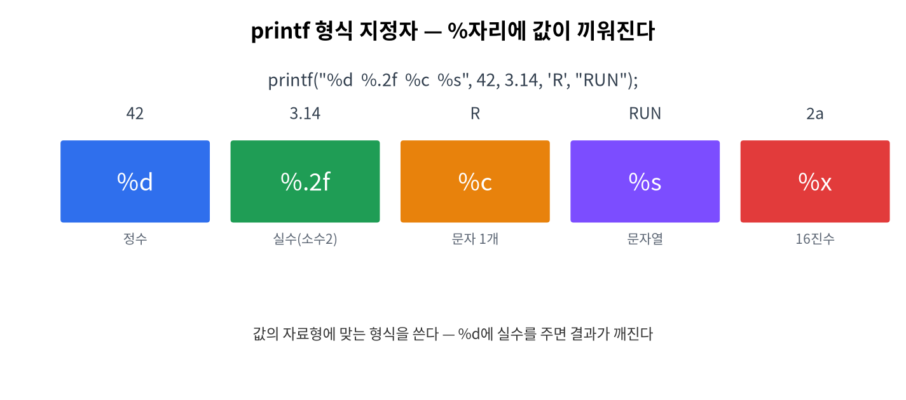
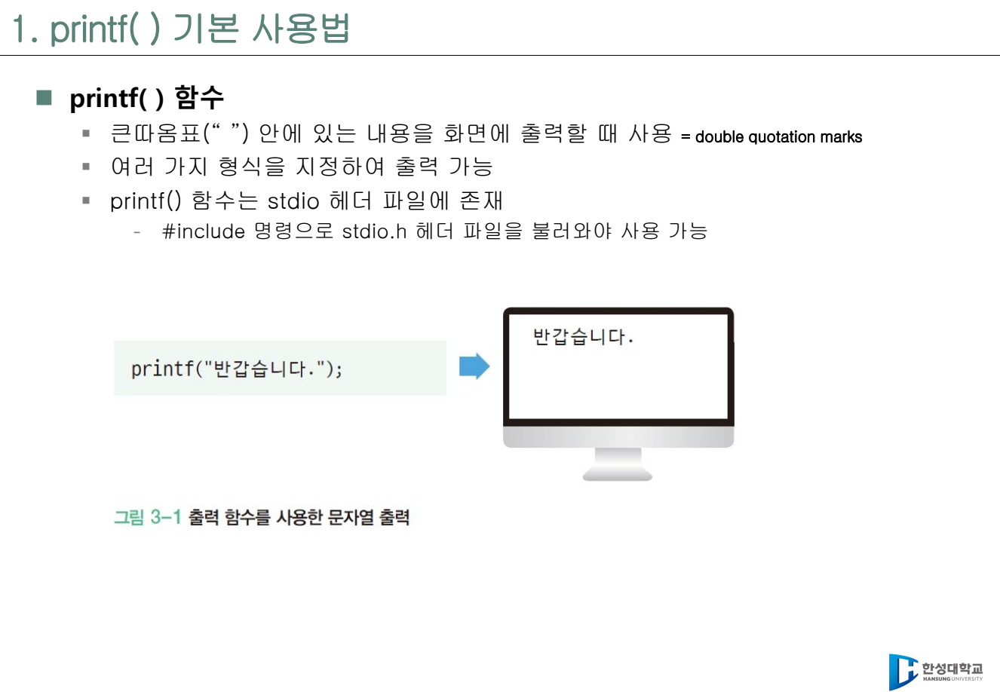
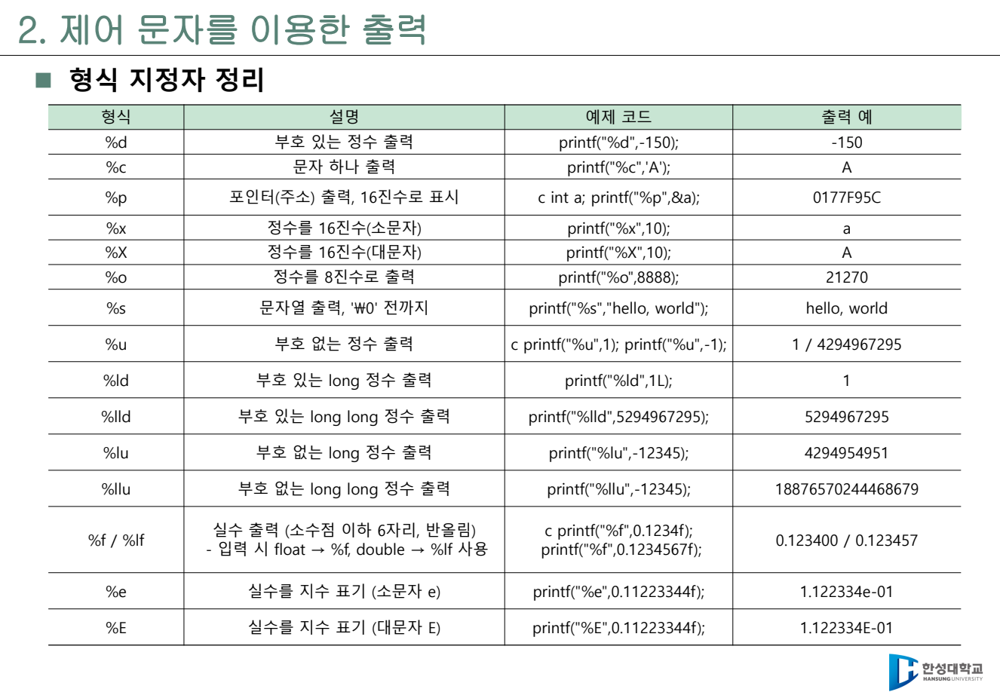
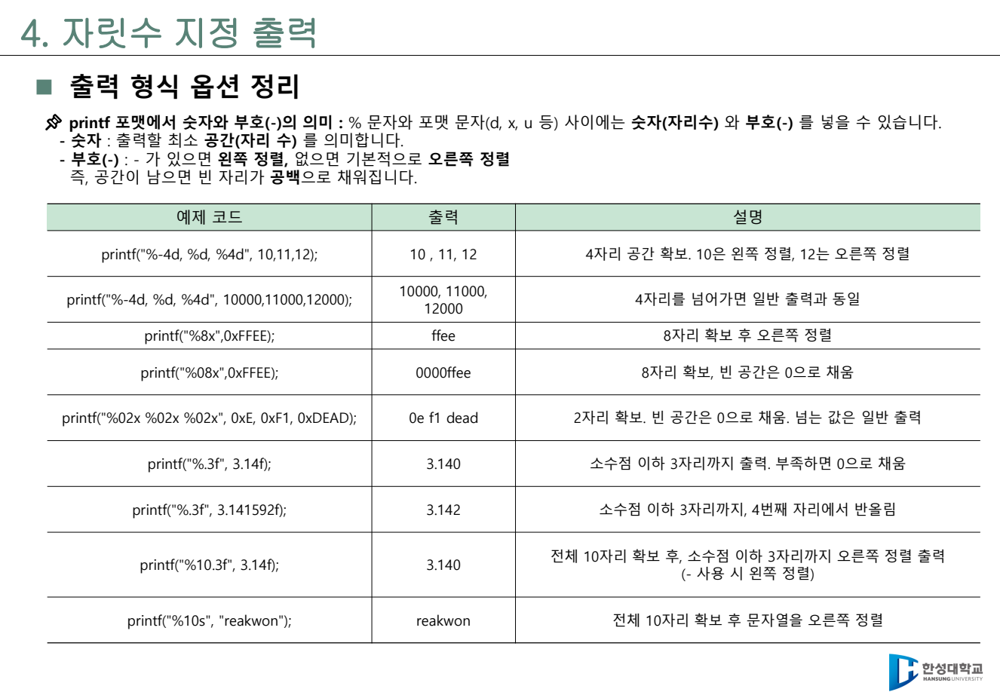
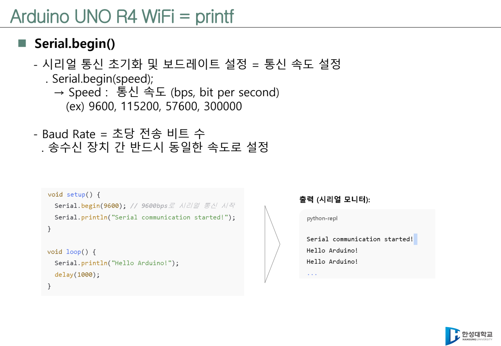
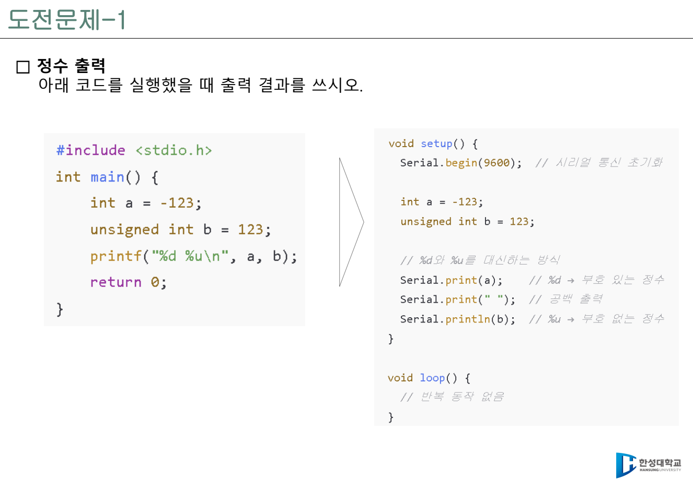
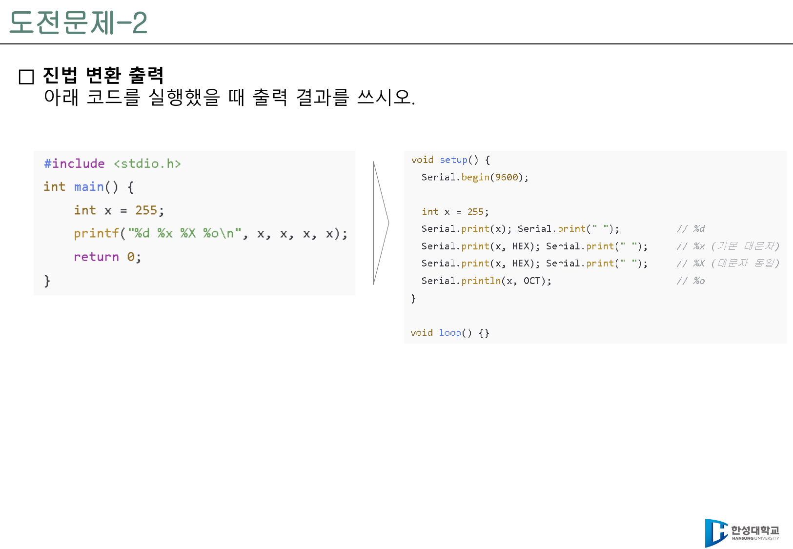
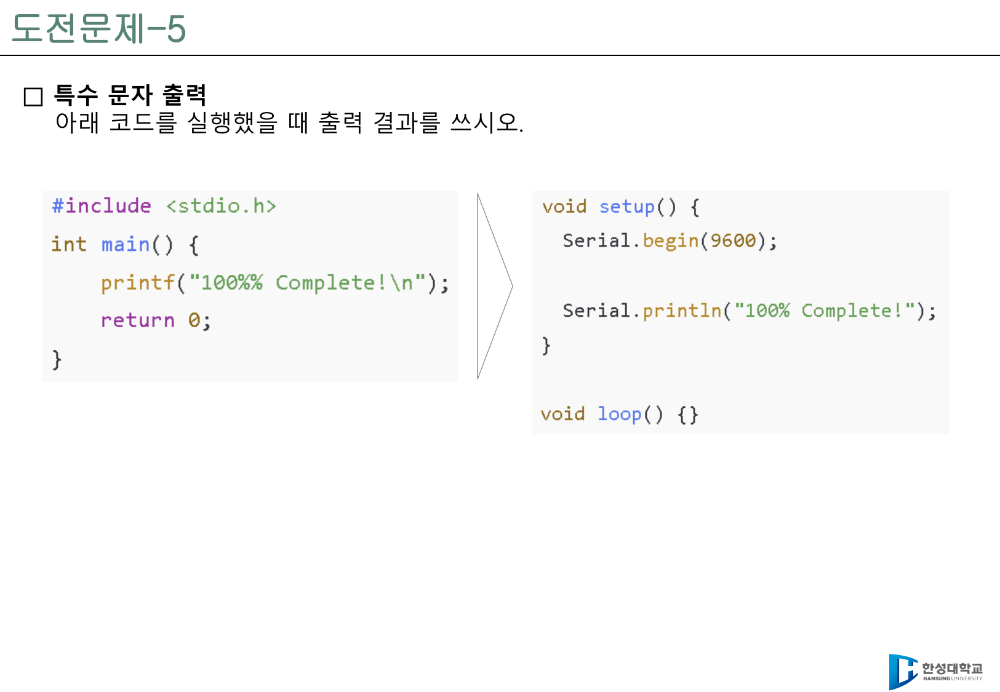
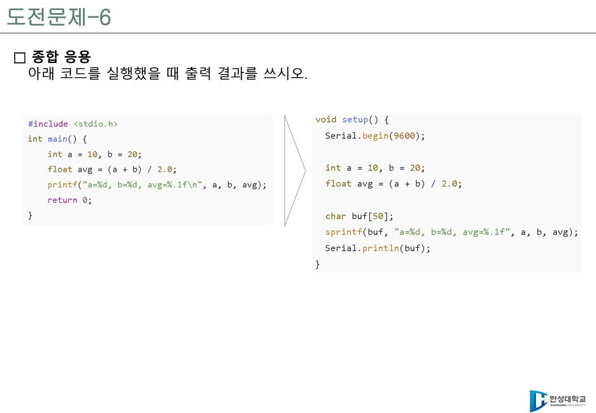

# 2주차 · 표준 출력(printf)
> C언어 · 미래모빌리티학과 | CLO1 | 교재 Ch03 | 원본 PDF: `3. 표준 입출력 함수`, `3-1. Printf 실습`



## 학습 목표

- `printf()`가 표준 출력으로 문자열과 값을 보내는 과정을 설명할 수 있다.
- `#include <stdio.h>`와 형식 문자열(format string)의 역할을 이해한다.
- `%d`, `%u`, `%f`, `%c`, `%s`, `%x`, `%o`, `%%`를 자료형에 맞게 선택한다.
- `\n`, `\t`, `\\`, `\"` 같은 제어 문자를 사용해 읽기 좋은 출력을 만든다.
- 폭(width), 정밀도(precision), 왼쪽 정렬(`-`), 0 채움(`0`), 진법 접두어(`#`)를 이용해 표 형태의 로그를 출력한다.
- C 콘솔의 `printf()` 사고방식을 Arduino UNO R4 WiFi의 `Serial.print()`, `Serial.println()`, `sprintf()`로 연결한다.
- 프로그램을 **모듈**(입력·계산·출력)로 나누어 생각하고, 그 경계를 한 문장으로 설명할 수 있다.
- **SRS**(무엇을 만들 것인가)와 **SDP**(어떻게 만들고 어떻게 확인할 것인가)를 다섯 칸·네 칸으로 작성할 수 있다.
- AI에게 코드를 부탁할 때 요구사항과 **제약(배운 문법 범위)** 을 함께 적어야 하는 이유를 설명할 수 있다.

---

## 이번 주차의 큰 그림

2주차의 핵심은 "프로그램이 자기 상태를 사람에게 어떻게 보여 주는가"이다. C 프로그램은 내부에서 숫자와 문자를 계산하지만, 그 값이 화면에 나오기 전까지는 사람이 확인할 방법이 없다. 그래서 `printf()`는 초반 C 수업에서 가장 중요한 관찰 도구다. 디버거를 쓰기 전에도 변수값, 계산 결과, 조건문 흐름, 반복문 진행 상황을 확인할 수 있기 때문이다.

원본 강의자료의 흐름은 다음 네 단계로 잡으면 이해하기 쉽다.

1. `printf()` 기본 사용법: 큰따옴표 안의 문자열을 화면에 출력한다.
2. 제어 문자: 줄바꿈, 탭, 따옴표, 역슬래시처럼 화면 모양을 제어한다.
3. 형식 지정자: 값의 자료형과 출력 형식을 일대일로 맞춘다.
4. 자릿수 지정 출력: 값이 많아졌을 때 표처럼 정렬해 읽기 좋은 로그를 만든다.



여기서 중요한 말은 "큰따옴표 안은 문자열"이라는 점이다. `"123"`은 숫자처럼 보이지만 문자열이다. 즉 `"123" + "456"`처럼 계산하는 대상이 아니다. 반대로 `123`은 정수값이고, 이 값을 화면에 출력하려면 `%d` 같은 형식 지정자가 필요하다. 이 구분이 3주차 변수와 자료형 수업으로 이어진다.

## 원본 자료 확인 결과와 보강 범위

첨부된 `3. 표준 입출력 함수.pdf`와 `3-1. Printf 실습.pdf`를 다시 확인한 결과, 2주차 페이지에는 `printf()` 기본, 제어 문자, 형식 지정자, 폭/정밀도, Arduino `Serial.print()` 연결이 이미 반영되어 있었다. 다만 원본 실습 자료의 도전문제 흐름을 기준으로 보면 **진법 변환 출력**과 **특수 문자 출력**이 독립 도전문제로 더 명확히 보강될 필요가 있었다. 또한 원본 이론 자료에는 `long`, `long long`, 지수 표기 `%e/%E`도 포함되어 있어, 표준 출력 형식 지정자 설명을 조금 더 넓혀 두는 것이 좋다.

이번 보강에서는 다음을 추가한다.

| 보강 항목 | 원본 자료 위치 | 추가 위치 |
|-----------|----------------|-----------|
| `long`, `long long`, `%e`, `%E` 확장 지정자 | `3. 표준 입출력 함수.pdf` 형식 지정자 정리 | 3절 |
| 진법 변환 도전문제 | `3-1. Printf 실습.pdf` 도전문제-2 | 9절 |
| 특수 문자 출력 도전문제 | `3-1. Printf 실습.pdf` 도전문제-5 | 9절 |
| Arduino `Serial.print(x, HEX/OCT)`와 C `printf("%x/%o")` 비교 | `3-1. Printf 실습.pdf` 도전문제-2 | 9절 |

## 3시간 강의 운영안

| 시간 | 내용 | 교수자 진행 포인트 | 학생 활동 |
|---:|---|---|---|
| 0~15분 | 1주차 환경 확인 | Visual Studio에서 새 C 파일 생성, 빌드/실행 확인 | `Hello C` 출력 |
| 15~35분 | `printf()` 기본 | `stdio.h`, `main()`, 세미콜론, 문자열 출력 구조 설명 | 문자열 3줄 출력 |
| 35~60분 | 제어 문자 | `\n`, `\t`, `\\`, `\"`, `%%`를 실제 화면 결과로 비교 | 자기소개 문장을 줄바꿈/탭으로 정리 |
| 60~95분 | 형식 지정자 | `%d`, `%u`, `%f`, `%c`, `%s`, `%x`, `%o`의 의미와 자료형 매칭 | 같은 값을 여러 형식으로 출력 |
| 95~115분 | 잘못된 매칭 | 지정자 수와 값의 수가 다를 때 경고, 가비지값 가능성 설명 | 오류 예제를 고쳐 보기 |
| 115~145분 | 폭·정밀도·정렬 | `%6d`, `%-6d`, `%05d`, `%.2f`, `%8.2f`로 표 정렬 | 차량 대시보드 표 만들기 |
| 145~160분 | 모듈형·SRS·SDP | 대시보드를 세 번 고친 이유로 도입. 미니 SRS 5칸·SDP 4칸 시범 작성 | 실습 2-4의 SRS를 코드보다 먼저 작성 |
| 160~175분 | Arduino UNO R4 연결 | `printf()`와 `Serial.print()`의 공통점, `sprintf()`로 포맷 문자열 만들기 | 시리얼 모니터 출력 코드 읽기 |
| 175~180분 | 형성평가 | 도전문제 2개를 짧게 풀이 | 제출 전 체크 |

---

## 이론-실습 연결표

| 이론 개념 | 바로 해볼 실습 | 확인 질문 |
|---|---|---|
| 문자열 출력 | `printf("Hello\n");`를 3줄 자기소개로 바꾼다 | 큰따옴표 안의 내용과 변수값은 어떻게 다른가? |
| 제어 문자 | `\n`, `\t`, `\\`, `\"`, `%%`를 한 파일에서 출력한다 | 화면에 보이는 문자와 출력 모양을 바꾸는 문자를 구분할 수 있는가? |
| 형식 지정자 | 같은 정수를 `%d`, `%x`, `%o`로 출력한다 | 값은 같지만 표현 방식이 달라진다는 점을 설명할 수 있는가? |
| Arduino Serial 출력 | `Serial.print()`와 `sprintf()` 예제를 읽는다 | C의 `printf()` 형식 문자열이 보드 출력에서 어떻게 재사용되는가? |

## 1. `printf()` 기본 사용법

`printf`는 "print formatted"의 줄임말로 이해하면 된다. 단순히 글자를 출력하는 함수가 아니라, 값을 지정한 형식으로 바꾸어 출력하는 함수다. 사용하려면 표준 입출력 헤더인 `stdio.h`를 포함해야 한다.

```c
#include <stdio.h>

int main(void) {
    printf("Hello C\n");
    return 0;
}
```

수업에서 처음 강조할 부분은 세 가지다.

- `#include <stdio.h>`: `printf()`가 어디에 정의되어 있는지 컴파일러에게 알려 준다.
- `"Hello C\n"`: 큰따옴표 안의 내용은 문자열이다.
- `\n`: 출력 후 다음 줄로 이동한다.

학생들이 처음 작성하는 출력 예제는 짧아도 좋지만, 결과 화면을 반드시 확인해야 한다. `\n`을 뺀 코드와 넣은 코드를 비교하면 제어 문자의 필요성을 바로 느낄 수 있다.

```c
printf("Hello");
printf("C");
printf("\n");

printf("Hello\n");
printf("C\n");
```

첫 번째 코드는 `HelloC`처럼 한 줄에 붙어 보인다. 두 번째 코드는 줄이 나뉘어 읽기 쉽다. 디버깅 로그에서는 이런 작은 차이가 매우 중요하다.

## 2. 제어 문자를 이용한 출력

제어 문자는 화면에 보이는 일반 문자라기보다 "출력 방식을 바꾸는 약속"이다. 원본 자료에서는 줄바꿈, 따옴표, 특정 문자를 출력하기 위한 문자를 제어 문자로 소개한다.

| 표기 | 이름 | 출력 효과 | 예 |
|---|---|---|---|
| `\n` | newline | 다음 줄로 이동 | `printf("A\nB");` |
| `\t` | tab | 일정 간격 띄우기 | `printf("A\tB");` |
| `\\` | backslash | 역슬래시 자체 출력 | `printf("C:\\temp");` |
| `\"` | double quote | 큰따옴표 출력 | `printf("\"C\"");` |
| `%%` | percent | `%` 자체 출력 | `printf("100%%");` |

실습에서는 다음 코드를 직접 실행하게 한다.

```c
#include <stdio.h>

int main(void) {
    printf("이름\t점수\t등급\n");
    printf("Kim\t95\tA\n");
    printf("Lee\t88\tB\n");
    printf("경로: C:\\workspace\\c\n");
    printf("문장: \"printf는 출력 함수입니다.\"\n");
    printf("배터리: 87%%\n");
    return 0;
}
```

**설명 포인트:** `\t`는 간단한 표를 만들 때 편하지만, 글자 수가 크게 달라지면 열이 완벽히 맞지 않을 수 있다. 실제 로그를 정렬할 때는 뒤에서 배우는 폭 지정(`%8d`, `%10s`)을 쓰는 편이 더 안정적이다.

## 3. 형식 지정자와 자료형 매칭

`printf()`는 형식 문자열 안의 `%...` 자리에 뒤쪽 값을 차례대로 끼워 넣는다.

```c
int speed = 42;
printf("속도: %d km/h\n", speed);
```

이때 `%d`와 `speed`는 한 쌍이다. 원본 자료에서 강조하는 것처럼 숫자와 표준 출력 형식 지정자는 일대일 대응 관계로 맞아야 한다. 지정자는 값의 종류를 알려 주고, 값은 지정자 자리에 들어간다.



| 지정자 | 의미 | 대표 자료형 | 예제 | 출력 예 |
|---|---|---|---|---|
| `%d` | 부호 있는 10진 정수 | `int` | `printf("%d", -150);` | `-150` |
| `%u` | 부호 없는 10진 정수 | `unsigned int` | `printf("%u", 123u);` | `123` |
| `%f` | 실수 | `float`, `double` | `printf("%f", 3.14);` | `3.140000` |
| `%c` | 문자 1개 | `char` | `printf("%c", 'A');` | `A` |
| `%s` | 문자열 | `char[]`, 문자열 리터럴 | `printf("%s", "RUN");` | `RUN` |
| `%x` | 16진수 소문자 | 정수 | `printf("%x", 255);` | `ff` |
| `%X` | 16진수 대문자 | 정수 | `printf("%X", 255);` | `FF` |
| `%o` | 8진수 | 정수 | `printf("%o", 8);` | `10` |
| `%p` | 주소 | 포인터 | `printf("%p", (void *)&a);` | 환경마다 다름 |
| `%%` | 퍼센트 문자 | 값 없음 | `printf("100%%");` | `100%` |

### 확장 형식 지정자

원본 자료에는 `int`보다 큰 정수와 지수 표기 실수도 함께 정리되어 있다. 처음부터 모두 외울 필요는 없지만, 컴파일 경고를 읽고 고칠 수 있도록 "자료형이 커지면 지정자도 달라진다"는 감각은 잡아야 한다.

| 지정자 | 의미 | 대표 자료형 | 예 |
|--------|------|-------------|----|
| `%ld` | 부호 있는 long 정수 | `long` | `printf("%ld", 100000L);` |
| `%lld` | 부호 있는 long long 정수 | `long long` | `printf("%lld", 5294967295LL);` |
| `%lu` | 부호 없는 long 정수 | `unsigned long` | `printf("%lu", 100000UL);` |
| `%llu` | 부호 없는 long long 정수 | `unsigned long long` | `printf("%llu", 5294967295ULL);` |
| `%e` | 지수 표기 실수, 소문자 `e` | `double` | `1.122334e-01` |
| `%E` | 지수 표기 실수, 대문자 `E` | `double` | `1.122334E-01` |

!!! note "출력과 입력의 `%f`, `%lf`"
    `printf()`에서는 `float` 값이 전달될 때 자동으로 `double`로 승격되므로 보통 `%f`로 출력한다. 반면 3주차 이후 `scanf_s()`로 입력받을 때는 `float`에는 `%f`, `double`에는 `%lf`를 사용한다. 출력과 입력의 규칙이 다르다는 점을 미리 표시해 두면 3주차 혼동을 줄일 수 있다.

### 일대일 대응 예제

```c
#include <stdio.h>

int main(void) {
    int rpm = 2500;
    double voltage = 4.98;
    char gear = 'D';

    printf("RPM=%d, voltage=%.2fV, gear=%c\n", rpm, voltage, gear);
    return 0;
}
```

**예상 출력**

```text
RPM=2500, voltage=4.98V, gear=D
```

위 코드에서 지정자는 `%d`, `%.2f`, `%c` 세 개이고, 뒤의 값도 `rpm`, `voltage`, `gear` 세 개다. 순서도 맞아야 한다.

### 잘못된 사용 예

```c
printf("%d %d\n", 123);          // 지정자가 값보다 많음
printf("%d\n", 123, 456);        // 값이 지정자보다 많음
printf("%d\n", 3.14);            // 자료형이 맞지 않음
printf("%f\n", 10);              // 자료형이 맞지 않음
```

이런 코드는 컴파일 경고가 발생하거나, 실행 결과가 이상해질 수 있다. 수업에서는 일부러 잘못된 예제를 보여 준 뒤 "경고를 읽고 고치는 습관"으로 연결한다. 특히 지정자가 값보다 많으면 남는 자리에 예측할 수 없는 값이 출력될 수 있다. 이런 값을 흔히 가비지값이라고 부른다.

## 4. 자릿수 지정 출력

값이 하나일 때는 그냥 출력해도 된다. 하지만 값이 여러 줄로 쌓이면 정렬이 중요해진다. 차량 대시보드, 센서 로그, 로봇 상태 메시지는 사람이 빠르게 비교해야 하므로 열이 흔들리지 않아야 한다.

형식은 다음처럼 읽는다.

```text
%[플래그][폭][.정밀도]지정자
```



| 표현 | 의미 | 예제 출력 |
|---|---|---|
| `%4d` | 최소 4칸, 오른쪽 정렬 | `[  10]` |
| `%-4d` | 최소 4칸, 왼쪽 정렬 | `[10  ]` |
| `%04d` | 최소 4칸, 빈칸은 0으로 채움 | `[0010]` |
| `%8x` | 16진수를 8칸 확보 후 출력 | `[    ffee]` |
| `%08x` | 16진수를 8칸, 0으로 채움 | `[0000ffee]` |
| `%.3f` | 소수점 이하 3자리 | `[3.140]` |
| `%10.3f` | 전체 10칸, 소수점 이하 3자리 | `[     3.140]` |
| `%10s` | 문자열 10칸, 오른쪽 정렬 | `[       RUN]` |

예제를 실행하면서 대괄호를 함께 찍으면 공백 위치가 눈에 잘 보인다.

```c
#include <stdio.h>

int main(void) {
    printf("[%4d]\n", 10);
    printf("[%-4d]\n", 10);
    printf("[%04d]\n", 10);
    printf("[%.3f]\n", 3.14);
    printf("[%10.3f]\n", 3.14);
    return 0;
}
```

**강의 설명:** 폭은 "최소 출력 칸 수"다. 값이 폭보다 길면 값이 잘리는 것이 아니라 그대로 출력된다. 정밀도는 실수에서 소수점 아래 자리 수를 정한다. `%.3f`는 소수점 이하 3자리까지 출력하고, 부족하면 0을 채우며, 넘치면 반올림한다.

### 진법과 접두어

정수는 10진수뿐 아니라 16진수, 8진수로도 출력할 수 있다. 임베디드와 로봇 제어에서는 레지스터 값, 센서 패킷, 색상값 등을 16진수로 볼 일이 많다.

```c
printf("%x\n", 0xFF11);     // ff11
printf("%#x\n", 0xFF11);    // 0xff11
printf("%#X\n", 0xFF11);    // 0XFF11
printf("%#o\n", 077);       // 077
```

`#`은 진법 접두어를 표시할 때 유용하다. 단, `%b` 이진수 출력은 표준 C가 아니라 일부 컴파일러 확장 기능이므로 수업에서는 "환경에 따라 동작하지 않을 수 있다"고 안내한다.

---

## 5. 라이브 코딩: 차량 대시보드 로그

이번 주차의 대표 예제는 차량 또는 로봇 상태를 한눈에 볼 수 있는 로그다. 단순 출력에서 시작해 표 정렬까지 확장한다.

### 5.1 첫 번째 버전: 값만 출력

```c
#include <stdio.h>

int main(void) {
    double speed = 42.5;
    int rpm = 2500;
    double battery = 87.3;
    char gear = 'D';

    printf("speed=%f\n", speed);
    printf("rpm=%d\n", rpm);
    printf("battery=%f\n", battery);
    printf("gear=%c\n", gear);

    return 0;
}
```

이 코드는 동작하지만 실수 출력이 너무 길고, 단위가 없어 읽기 어렵다. 다음 단계에서 사람이 읽는 로그로 바꾼다.

### 5.2 두 번째 버전: 단위와 정밀도 추가

```c
#include <stdio.h>

int main(void) {
    double speed = 42.5;
    int rpm = 2500;
    double battery = 87.3;
    char gear = 'D';

    printf("속도: %.1f km/h\n", speed);
    printf("RPM : %d rpm\n", rpm);
    printf("배터리: %.1f%%\n", battery);
    printf("기어: %c\n", gear);

    return 0;
}
```

`%.1f`는 소수점 아래 한 자리만 보여 준다. 배터리 뒤의 `%`를 출력하려면 `%%`를 써야 한다.

### 5.3 세 번째 버전: 표 정렬

```c
#include <stdio.h>

int main(void) {
    double speed = 42.5;
    int rpm = 2500;
    double battery = 87.3;
    char gear = 'D';

    printf("================================\n");
    printf("%-10s %10s\n", "ITEM", "VALUE");
    printf("--------------------------------\n");
    printf("%-10s %7.1f km/h\n", "Speed", speed);
    printf("%-10s %7d rpm\n", "RPM", rpm);
    printf("%-10s %7.1f %%\n", "Battery", battery);
    printf("%-10s %10c\n", "Gear", gear);
    printf("================================\n");

    return 0;
}
```

**예상 출력**

```text
================================
ITEM            VALUE
--------------------------------
Speed            42.5 km/h
RPM              2500 rpm
Battery          87.3 %
Gear                D
================================
```

이 예제는 5주차 조건문, 6주차 반복문, 7주차 시리얼 제어 실습의 기반이 된다. 지금은 값이 고정되어 있지만, 나중에는 센서값이나 사용자 입력값으로 바뀐다.

---

## 6. 모듈형 설계와 개발 문서 (SRS · SDP)

이 절은 문법이 아니라 **일하는 방법**에 관한 것이다. 지금 배워 두면 이 수업 내내, 그리고 AI와 함께 코드를 짤 때마다 쓰인다.

### 6.1 왜 5절에서 같은 프로그램을 세 번 고쳤나

5절에서 대시보드를 세 번 고쳐 썼다. 값만 출력했다가(5.1), 단위와 정밀도를 붙였다가(5.2), 표로 정렬했다(5.3). 코드 실력이 부족해서가 아니다. **무엇을 만들지 먼저 적지 않았기 때문**이다.

"대시보드를 출력한다"는 말은 사람마다 다르게 읽힌다. 소수점을 몇 자리까지 쓸지, 열을 맞출지, 단위를 붙일지가 전부 열려 있다. 그래서 만들고 나서야 "이게 아닌데" 하고 다시 고치게 된다.

!!! tip "AI를 쓰면 이 문제가 더 커진다"
    사람은 애매한 지시를 받으면 되묻는다. AI는 되묻지 않고 **그럴듯하게 하나를 골라서 만들어 준다.** 그래서 지시가 애매하면 매번 다른 결과가 나오고, 어느 것이 맞는지 판단할 기준도 없다. 적어 두면 결과가 안정되고, 틀렸을 때 어디가 틀렸는지 짚을 수 있다.

---

### 6.2 모듈형 — 프로그램을 덩어리로 나누기

**모듈(module)** 은 "한 가지 일만 맡는 덩어리"다. 모듈형 설계는 프로그램을 이런 덩어리로 나누어 만드는 방식이다.

지금 여러분의 코드는 `main()` 하나뿐이다. 하지만 머릿속에서는 이미 나뉘어 있다.


```mermaid
flowchart LR
    A["값 준비<br/>(입력)"] --> B["계산<br/>(처리)"]
    B --> C["보여 주기<br/>(출력)"]
```

이 세 덩어리는 이 수업에서 주차별로 하나씩 채워진다.

| 모듈 | 하는 일 | 배우는 주차 |
|---|---|---|
| 출력 | 값을 사람이 읽을 수 있게 보여 준다 | **2주차 (지금)** — `printf()` |
| 입력 | 바깥에서 값을 받아 온다 | 3주차 — `scanf_s()` |
| 계산 | 받은 값으로 새 값을 만든다 | 4주차 — 연산자 |
| 판단 | 값에 따라 다르게 행동한다 | 5주차 — 조건문 |
| 반복 | 같은 일을 여러 번 한다 | 6주차 — 반복문 |
| 묶기 | 덩어리에 이름을 붙여 따로 뗀다 | 7주차 — 함수 |

즉 **7주차 함수는 "모듈을 문법으로 표현하는 방법"** 이다. 지금은 문법이 없어도, 주석으로 덩어리를 구분해 두는 습관부터 들이면 된다.

```c
#include <stdio.h>

int main(void) {
    /* --- 값 준비 --- */
    double speed = 42.5;
    int rpm = 2500;

    /* --- 계산 --- */
    double speed_ms = speed / 3.6;

    /* --- 출력 --- */
    printf("%-10s %7.1f km/h\n", "Speed", speed);
    printf("%-10s %7.1f m/s\n", "Speed", speed_ms);
    printf("%-10s %7d rpm\n", "RPM", rpm);

    return 0;
}
```

#### 덩어리 경계를 정하는 한 문장

모듈을 나눌 때는 이 문장을 채울 수 있어야 한다.

> **"이 덩어리는 〈무엇〉을 받아서 〈무엇〉을 내놓는다."**

- 출력 모듈: **값(속도·RPM)** 을 받아서 **정렬된 화면 한 줄** 을 내놓는다.
- 계산 모듈: **km/h 속도** 를 받아서 **m/s 속도** 를 내놓는다.

이 문장이 안 채워지면 덩어리가 두 가지 일을 하고 있다는 뜻이다. 그때는 더 쪼갠다.

#### 모듈로 나누면 좋은 점

| 이유 | 무슨 뜻인가 |
|---|---|
| 고치기 쉽다 | 출력 모양만 바꾸고 싶을 때 계산 부분을 건드리지 않는다 |
| 나눠서 만들 수 있다 | 팀 과제에서 사람마다 다른 덩어리를 맡는다 (15주차 기말 프로젝트) |
| **AI에게 한 덩어리씩 시킬 수 있다** | 프로그램 전체를 통째로 맡기면 검증할 수 없다. 덩어리 단위면 입력·출력이 분명해 확인이 쉽다 |

---

### 6.3 SRS — 무엇을 만들 것인가

**SRS(Software Requirements Specification, 소프트웨어 요구사항 명세서)** 는 "무엇을 만들 것인가"를 적어 둔 문서다. 국제표준 **ISO/IEC/IEEE 29148:2018**(예전 IEEE 830)이 형식을 정하고 있다.

실무 SRS는 수십 쪽짜리지만, 1학년 과제에는 **다섯 칸이면 충분하다.**

| 칸 | 적는 것 | 확인 질문 |
|---|---|---|
| 목적 | 이 프로그램은 무엇을 위한 것인가 | 한 문장으로 말할 수 있는가? |
| 입력 | 무엇이 들어오는가 (값·범위·단위) | 단위가 빠지지 않았는가? |
| 출력 | 무엇이 나가는가 (형식·자릿수·정렬) | 화면 모양을 그대로 그릴 수 있는가? |
| 제약 | 지켜야 하는 조건 | 어떤 환경·표준을 따르는가? |
| 예외 | 잘못된 값이 들어오면 어떻게 하는가 | 0, 음수, 범위 밖은? |

#### 5절 대시보드의 SRS 예

| 칸 | 내용 |
|---|---|
| 목적 | 차량 상태 4개(속도·RPM·배터리·기어)를 한 화면에 표로 보여 준다 |
| 입력 | `speed` km/h (0.0~200.0), `rpm` (0~8000), `battery` % (0.0~100.0), `gear` 문자 `P/R/N/D` |
| 출력 | 항목명은 **왼쪽 정렬 10칸**, 숫자는 **오른쪽 정렬 7칸 소수 1자리**, 단위를 뒤에 붙인다. 표 위아래에 `=` 32개 구분선 |
| 제약 | `<stdio.h>`만 사용. Visual Studio 2022, 경고 수준 4에서 경고 0개 |
| 예외 | 이번 주차는 값이 코드에 고정되어 있어 예외 없음. 3주차에 입력을 받으면서 추가한다 |

#### 요구사항은 **검증 가능**해야 한다

가장 중요한 규칙이다. 읽는 사람마다 다르게 판단할 수 있으면 요구사항이 아니다.

| ❌ 검증할 수 없는 요구사항 | ✅ 검증할 수 있는 요구사항 |
|---|---|
| 보기 좋게 출력한다 | 항목명 `%-10s`, 값 `%7.1f`로 출력한다 |
| 속도를 정확히 보여 준다 | 속도를 소수점 이하 1자리까지 km/h 단위로 보여 준다 |
| 빠르게 동작한다 | 값 4개를 출력하는 데 화면 갱신이 1초에 1회 이상 가능하다 |

!!! warning "형식을 바꾸면 기대 결과도 같이 바꾼다"
    출력 폭을 `%10`에서 `%7`로 바꾸면 화면의 공백 개수가 바뀐다. 이때 코드만 고치고 "예상 출력"을 그대로 두면, 문서와 실제가 어긋난 채 남는다. **요구사항·코드·기대 결과 셋은 항상 같이 움직인다.**

#### 기능 요구사항 vs 비기능 요구사항

SRS는 두 종류를 나누어 적는다. 정보처리기사 필기·실기에 그대로 나오는 구분이다.

| 종류 | 무엇을 정하는가 | 대시보드 예 |
|---|---|---|
| 기능 요구사항 | 프로그램이 **무엇을 하는가** | 속도·RPM·배터리·기어를 출력한다 |
| 비기능 요구사항 | **얼마나 잘** 해야 하는가 | 경고 0개로 빌드된다, 열이 흐트러지지 않는다, 표준 C만 쓴다 |

---

### 6.4 SDP — 어떻게 만들 것인가

**SDP(Software Development Plan, 소프트웨어 개발 계획서)** 는 "어떻게·어떤 순서로 만들고, 다 됐는지 어떻게 확인할 것인가"를 적는다. 국제표준은 **ISO/IEC/IEEE 16326:2019**(예전 IEEE 1058)다.

SRS가 **목적지**라면 SDP는 **경로와 도착 확인 방법**이다. 역시 네 칸이면 충분하다.

| 칸 | 적는 것 |
|---|---|
| 단계 | 무엇을 먼저 하고 무엇을 나중에 하는가 |
| 산출물 | 그 단계가 끝나면 무엇이 남는가 |
| 검증 방법 | 끝났다는 것을 **어떻게 확인**하는가 |
| 마감 | 언제까지 |

#### 5절 대시보드의 SDP 예

5.1 → 5.2 → 5.3이 사실 이 계획이었다. 미리 적어 두었더라면 세 번 고치는 게 아니라 **세 단계로 쌓는 일**이 되었을 것이다.

| 단계 | 산출물 | 검증 방법 | 마감 |
|---|---|---|---|
| 1. 값을 화면에 내보낸다 | 값 4개가 출력되는 `.c` | 네 값이 모두 화면에 보인다 | 수업 중 |
| 2. 단위와 자릿수를 붙인다 | 소수 1자리 + 단위가 붙은 `.c` | `42.500000`이 아니라 `42.5 km/h`로 나온다 | 수업 중 |
| 3. 표로 정렬한다 | 폭 지정이 들어간 최종 `.c` | 값을 바꿔도 열이 흐트러지지 않는다 | 제출 전 |

!!! note "검증 방법 칸이 핵심이다"
    "다 만들었다"는 느낌이 아니라 **눈으로 확인할 수 있는 문장**을 적는다. 이 칸이 비어 있으면 언제 끝났는지 아무도 모른다. 과제 채점 기준(경계값 확인, 경고 0개)도 결국 이 칸이다.

---

### 6.5 AI와 함께 개발할 때 무엇이 달라지나

같은 대시보드를 AI에게 시킨다고 하자.

=== "❌ 문서 없이 시킬 때"

    ```text
    C로 자동차 대시보드 출력하는 코드 짜줘
    ```

    - 속도 단위가 mph로 나올 수도 있다.
    - 소수점 자리가 매번 달라진다.
    - 배우지 않은 문법(구조체·함수·배열)이 섞여 나온다.
    - **결과가 맞는지 판단할 기준이 없다.**

=== "✅ SRS를 주고 시킬 때"

    ```text
    아래 요구사항대로 C 코드를 작성해 줘.

    [목적] 차량 상태 4개를 한 화면에 표로 출력
    [입력] 코드에 고정: speed=42.5(km/h), rpm=2500, battery=87.3(%), gear='D'
    [출력] 항목명 %-10s, 숫자 %7.1f(정수는 %7d), 단위를 뒤에 붙임
           표 위아래에 '=' 32개 구분선
    [제약] <stdio.h>만 사용. 함수는 main 하나. 배열·구조체·조건문 금지
           (2주차까지 배운 문법만)
    [검증] 값을 바꿔도 열이 흐트러지지 않아야 함
    ```

    - 결과가 매번 거의 같다.
    - 제약을 적었으므로 **아직 안 배운 문법이 섞이지 않는다.**
    - 검증 문장이 있으므로 맞는지 내가 채점할 수 있다.

!!! danger "AI는 요구사항에 없는 것을 지어낸다"
    AI는 빈칸을 그럴듯하게 채운다. 여러분이 적지 않은 것은 **AI가 대신 정해 버린다.** 그래서 적어 둔 SRS가 있으면 "이건 내가 시킨 적 없는데"가 바로 눈에 보인다. 적어 두지 않으면 그게 내 의도였는지 AI가 지어낸 것인지 구분조차 못 한다.

    받은 코드를 확인하는 순서는 늘 같다. **① SRS의 출력 형식과 맞는가 → ② 제약을 어기지 않았는가 → ③ 컴파일·실행해서 검증 문장이 참인가.**

`제약` 칸을 꼭 쓰라고 강조하는 이유가 있다. 이 수업은 문법을 순서대로 배우는데, AI는 그 순서를 모른다. **"2주차까지 배운 문법만 써 줘"** 한 줄이 "설명할 수 없는 코드"를 제출하는 사고를 막아 준다.

---

### 6.6 이번 주차에 적용하기

**실습 2-4(차량 대시보드 만들기)** 에 아래 한 장을 붙여 제출한다. 코드보다 먼저 쓴다.

```text
[미니 SRS]
목적:
입력:
출력:
제약:
예외:

[미니 SDP]
단계 / 산출물 / 검증 방법
1.
2.
3.
```

순서를 지키는 것이 중요하다. **적는다 → 짠다 → 적어 둔 검증 방법으로 확인한다.** 코드를 먼저 짜고 나중에 문서를 채우면 아무 의미가 없다.

| 이어지는 곳 | 무엇이 연결되나 |
|---|---|
| [AI 활용 가이드](ai-literacy.md) | 설계 우선 5단계 — SRS는 1단계, SDP는 그 실행 계획이다 |
| [프로그램 설계 문제](design-problems.md) | 설계 문제 6선은 SRS부터 쓰고 시작한다 |
| [정보처리기사 필기 이론](exam-written.md) | 요구사항 분석, 기능/비기능 요구사항 구분은 시험 출제 범위다 |
| 7주차 함수 | 여기서 나눈 모듈이 실제 함수가 된다 |
| 15주차 기말 프로젝트 | 팀 프로젝트는 SRS·SDP를 제출물에 포함한다 |

!!! tip "한 줄 요약"
    **모듈형**은 프로그램을 덩어리로 나누는 것, **SRS**는 무엇을 만들지 적는 것, **SDP**는 어떻게 만들고 어떻게 확인할지 적는 것이다.
    AI 시대에 실력 차이는 타이핑이 아니라 **이 세 가지를 얼마나 분명하게 적을 수 있는가**에서 갈린다.

---

## 7. Arduino UNO R4 WiFi와 연결하기

원본 강의자료는 2주차 후반에 Arduino UNO R4 WiFi를 소개하고, `printf()`와 같은 출력 사고를 시리얼 통신으로 연결한다. 콘솔 C에서는 `printf()`가 화면으로 출력한다. Arduino에서는 `Serial.print()`와 `Serial.println()`이 시리얼 모니터로 출력한다.



### 7.1 `Serial.begin()`의 의미

```cpp
void setup() {
    Serial.begin(9600);
    Serial.println("Serial communication started!");
}

void loop() {
    Serial.println("Hello Arduino!");
    delay(1000);
}
```

`Serial.begin(9600)`은 시리얼 통신 속도를 9600 bps로 맞춘다는 뜻이다. 보드와 시리얼 모니터가 같은 속도를 사용해야 글자가 정상적으로 보인다. 수업에서는 9600을 기본으로 쓰고, 필요하면 115200도 소개한다.

### 7.2 `printf()`와 `Serial.print()` 비교

| C 콘솔 | Arduino UNO R4 | 설명 |
|---|---|---|
| `printf("Hello\n");` | `Serial.println("Hello");` | 줄바꿈 포함 출력 |
| `printf("%d", a);` | `Serial.print(a);` | 정수 출력 |
| `printf("%u", b);` | `Serial.print(b);` | 부호 없는 정수 출력 |
| `printf("%.1f", avg);` | `Serial.print(avg, 1);` | 소수점 한 자리 출력 |
| `printf("a=%d, b=%d", a, b);` | `sprintf(buf, "a=%d, b=%d", a, b); Serial.println(buf);` | 포맷 문자열을 버퍼에 만든 뒤 출력 |

Arduino의 `Serial.print()`는 간단한 출력에는 편하지만, C의 `printf()`처럼 복잡한 형식을 한 번에 만들고 싶을 때는 `sprintf()`를 함께 사용한다.

```cpp
void setup() {
    Serial.begin(9600);

    int a = 10;
    int b = 20;
    float avg = (a + b) / 2.0;

    char buf[50];
    sprintf(buf, "a=%d, b=%d, avg=%.1f", a, b, avg);
    Serial.println(buf);
}

void loop() {
}
```

**예상 출력**

```text
a=10, b=20, avg=15.0
```

**주의:** `char buf[50]`은 출력 문자열을 담는 공간이다. 너무 작은 배열에 긴 문자열을 만들면 문제가 생길 수 있다. 12주차 포인터, 14주차 구조체로 갈수록 이런 메모리 감각이 중요해진다.

---

## 8. 실습

### 실습 2-1 · 문자열과 제어 문자

다음 요구사항을 만족하는 프로그램을 작성한다.

- 첫 줄에 본인 이름 출력
- 둘째 줄에 학과와 학번 출력
- 셋째 줄에 `"C programming"`처럼 큰따옴표가 포함된 문장 출력
- 넷째 줄에 `C:\workspace\week02` 경로 출력

```c
#include <stdio.h>

int main(void) {
    printf("이름: Kim\n");
    printf("학과\t학번\n");
    printf("\"C programming\"\n");
    printf("C:\\workspace\\week02\n");
    return 0;
}
```

### 실습 2-2 · 정수와 진법 출력

```c
#include <stdio.h>

int main(void) {
    int value = 255;

    printf("decimal = %d\n", value);
    printf("hex     = %x\n", value);
    printf("HEX     = %X\n", value);
    printf("octal   = %o\n", value);
    printf("prefix  = %#x\n", value);

    return 0;
}
```

수업 질문: `255`가 16진수로 `ff`가 되는 이유를 아직 완벽히 몰라도 괜찮다. 지금은 "같은 정수를 다른 표기법으로 볼 수 있다"는 점을 이해하면 된다.

### 실습 2-3 · 폭과 정렬 비교

```c
#include <stdio.h>

int main(void) {
    printf("[%5d]\n", 42);
    printf("[%-5d]\n", 42);
    printf("[%05d]\n", 42);
    printf("[%8.2f]\n", 3.14159);
    printf("[%-8.2f]\n", 3.14159);
    return 0;
}
```

실행 후 대괄호 안의 공백 위치를 관찰한다. 공백을 눈으로 보기 어렵다면 대괄호를 꼭 함께 출력한다.

### 실습 2-4 · 차량 대시보드 만들기

아래 값들을 사용해 표 형태로 출력한다.

| 항목 | 값 |
|---|---:|
| Speed | `42.5` |
| RPM | `2500` |
| Battery | `87.3` |
| Gear | `'D'` |

필수 조건:

- 제목 줄과 구분선을 출력한다.
- 실수는 소수점 한 자리만 출력한다.
- 항목 이름은 왼쪽 정렬한다.
- 배터리 뒤에는 `%`를 출력한다.

### 실습 2-5 · Arduino R4 시리얼 출력 읽기

아래 Arduino 코드를 보고 시리얼 모니터에 어떤 결과가 나올지 적는다.

```cpp
void setup() {
    Serial.begin(9600);

    int a = -123;
    unsigned int b = 123;

    Serial.print(a);
    Serial.print(" ");
    Serial.println(b);
}

void loop() {
}
```

정답은 C 코드 `printf("%d %u\n", a, b);`와 같은 사고방식으로 확인할 수 있다.

---

## 9. 도전문제

원본 실습 PDF의 도전문제는 C 콘솔 코드와 Arduino 코드를 나란히 비교하는 방식이다. 수업에서는 먼저 C 코드를 읽고 출력 결과를 쓴 뒤, 오른쪽 Arduino 코드가 같은 결과를 어떻게 시리얼 모니터에 보내는지 설명한다.



### 도전문제 1 · 정수 출력

```c
#include <stdio.h>

int main(void) {
    int a = -123;
    unsigned int b = 123;
    printf("%d %u\n", a, b);
    return 0;
}
```

질문: 출력 결과를 쓰시오.

??? success "정답 및 해설"
    출력은 `-123 123`이다. `%d`는 부호 있는 정수, `%u`는 부호 없는 정수를 출력한다.

### 도전문제 2 · 진법 변환 출력



```c
#include <stdio.h>

int main(void) {
    int x = 255;
    printf("%d %x %X %o\n", x, x, x, x);
    return 0;
}
```

질문: 출력 결과를 쓰시오.

??? success "정답 및 해설"
    출력은 `255 ff FF 377`이다.

    - `%d`: 10진수이므로 `255`
    - `%x`: 16진수 소문자이므로 `ff`
    - `%X`: 16진수 대문자이므로 `FF`
    - `%o`: 8진수이므로 `377`

    Arduino에서는 같은 값을 다음처럼 출력한다.

    ```cpp
    Serial.print(x);
    Serial.print(" ");
    Serial.print(x, HEX);
    Serial.print(" ");
    Serial.print(x, HEX);
    Serial.print(" ");
    Serial.println(x, OCT);
    ```

    Arduino의 `HEX` 출력은 기본적으로 대문자로 보일 수 있다. C의 `%x`와 `%X`처럼 소문자/대문자 형식을 세밀하게 구분하려면 `sprintf()`로 문자열을 만든 뒤 출력하는 방법을 사용할 수 있다.

### 도전문제 3 · 폭과 정렬

```c
printf("[%5d]\n", 42);
printf("[%-5d]\n", 42);
printf("[%05d]\n", 42);
```

??? success "정답 및 해설"
    `[   42]`, `[42   ]`, `[00042]`가 출력된다. 폭 5칸을 확보하고, `-`는 왼쪽 정렬, `0`은 빈칸을 0으로 채운다.

### 도전문제 4 · 소수점 자리수

```c
printf("%.2f\n", 3.14159);
printf("%8.3f\n", 3.14159);
```

??? success "정답 및 해설"
    첫 줄은 `3.14`, 둘째 줄은 전체 8칸을 확보한 뒤 `3.142`가 출력된다. 소수점 자리수는 반올림되어 표시된다.

### 도전문제 5 · 특수 문자 출력



```c
#include <stdio.h>

int main(void) {
    printf("C:\\workspace\\week02\n");
    printf("\"printf\" practice\n");
    printf("Progress: 100%%\n");
    return 0;
}
```

질문: 출력 결과를 쓰시오.

??? success "정답 및 해설"
    출력은 다음과 같다.

    ```text
    C:\workspace\week02
    "printf" practice
    Progress: 100%
    ```

    `\\`는 역슬래시 하나, `\"`는 큰따옴표, `%%`는 퍼센트 기호를 출력한다. `\n`은 줄바꿈을 만든다. 이 문제는 화면에 보이는 결과만 외우기보다, "문자열 안에서 특별한 의미를 가진 문자를 어떻게 문자 그대로 출력하는가"를 묻는 문제로 이해해야 한다.

### 도전문제 6 · 종합 응용과 `sprintf()`



```c
#include <stdio.h>

int main(void) {
    int a = 10, b = 20;
    float avg = (a + b) / 2.0;
    printf("a=%d, b=%d, avg=%.1f\n", a, b, avg);
    return 0;
}
```

Arduino에서는 다음처럼 같은 문자열을 만든 뒤 시리얼 모니터로 보낼 수 있다.

```cpp
void setup() {
    Serial.begin(9600);

    int a = 10, b = 20;
    float avg = (a + b) / 2.0;

    char buf[50];
    sprintf(buf, "a=%d, b=%d, avg=%.1f", a, b, avg);
    Serial.println(buf);
}

void loop() {
}
```

??? success "정답 및 해설"
    출력은 `a=10, b=20, avg=15.0`이다. `avg` 계산에서 `2.0`을 사용했기 때문에 실수 나눗셈이 되고, `%.1f`로 소수점 한 자리까지 표시한다.

---

## 10. 자주 막히는 지점

- `printf("123")`의 `123`은 문자열이다. 계산 가능한 숫자 `123`과 다르다.
- `printf("%d", 3.14);`처럼 지정자와 자료형이 다르면 경고나 이상 출력이 생길 수 있다.
- 지정자 수와 뒤쪽 값의 수는 맞아야 한다.
- `%` 자체를 출력하려면 `%%`를 쓴다.
- `\n`을 빼면 다음 출력이 같은 줄에 붙는다.
- 실수 기본 출력은 보통 소수점 아래 6자리까지 나오므로 `%.1f`, `%.2f`처럼 정밀도를 지정한다.
- 폭 지정은 값 자체를 바꾸지 않는다. 화면에 보이는 최소 칸 수만 정한다.
- Arduino 시리얼 모니터 글자가 깨지면 `Serial.begin()`의 보드레이트와 시리얼 모니터 설정이 같은지 확인한다.

## 11. 형성평가 체크포인트

- [ ] `printf()`를 사용하려면 어떤 헤더 파일이 필요한지 말할 수 있다.
- [ ] `\n`, `\t`, `\\`, `\"`, `%%`의 출력 결과를 설명할 수 있다.
- [ ] `%d`, `%u`, `%f`, `%c`, `%s`, `%x`, `%o` 중 상황에 맞는 지정자를 고를 수 있다.
- [ ] 지정자와 값의 수가 맞지 않을 때 왜 문제가 되는지 설명할 수 있다.
- [ ] `%6.1f`, `%-10s`, `%05d`의 의미를 말할 수 있다.
- [ ] C의 `printf()` 예제를 Arduino UNO R4의 `Serial.print()` 흐름으로 바꿔 읽을 수 있다.
- [ ] 내 프로그램을 입력·계산·출력 모듈로 나누고 각 경계를 한 문장으로 말할 수 있다.
- [ ] "보기 좋게 출력한다"가 왜 요구사항이 될 수 없는지 설명하고, 검증 가능한 문장으로 바꿀 수 있다.
- [ ] AI에게 코드를 부탁하는 프롬프트에 목적·입력·출력·제약·검증을 넣어 쓸 수 있다.

## 12. 과제

1. 본인의 이름, 학과, 학번을 제어 문자 `\n`, `\t`, `\"`를 포함해 출력한다.
2. 정수 하나를 10진수, 16진수, 8진수로 출력한다.
3. 차량 대시보드 표를 만든다. 항목은 `Speed`, `RPM`, `Battery`, `Gear`를 포함한다.
4. Arduino UNO R4 WiFi 시리얼 모니터에 `a=10, b=20, avg=15.0`이 출력되는 코드를 작성한다.
5. 3번 대시보드에 **미니 SRS(5칸)와 미니 SDP(3단계)** 를 한 장으로 붙인다. 코드보다 **먼저** 작성하고, 다 만든 뒤 SDP의 검증 방법대로 확인한 결과를 함께 적는다.

## 13. 다음 주차 연결

이번 주차에는 값을 직접 코드에 적어 두고 출력했다. 3주차에는 사용자가 키보드로 입력한 값을 변수에 저장하고, 그 값을 다시 `printf()`로 출력한다. 즉 2주차는 "보여 주기", 3주차는 "입력받고 보여 주기"로 확장된다.

6절에서 나눈 모듈로 보면 3주차는 비어 있던 **입력 모듈**을 채우는 주차다. SRS의 `입력` 칸도 이때부터 실제로 값이 들어오므로, `예외` 칸(0, 음수, 범위 밖)을 처음으로 채우게 된다. 모듈에 이름을 붙여 따로 떼어 내는 문법인 **함수**는 7주차에 배운다.

## 참조

- 교재 Ch03 · 표준 입출력 함수
- `printf` 레퍼런스: <https://en.cppreference.com/w/c/io/fprintf>

## 📚 참고 레퍼런스 (외부)
- printf 형식(표) https://en.cppreference.com/w/c/io/fprintf
- 이스케이프 https://en.cppreference.com/w/c/language/escape
- 전체 정리: [참고 자료 모음](references.md)
