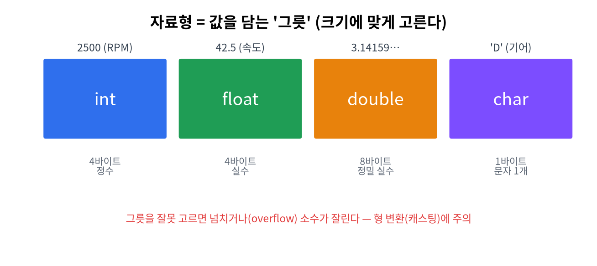

# 3주차 · 입력 · 변수와 자료형
> C언어 · 미래모빌리티학과 | CLO1 | 교재 Ch03–04



## 학습 목표
- 변수가 메모리에 저장되는 방식과 **자료형의 크기·범위**를 이해한다.
- `scanf_s`로 입력을 받고, **형 변환(캐스팅)**·상수를 올바르게 쓴다.

---

## 1. 이론

### 1.1 변수와 메모리
- **변수**: 값을 담는 이름 붙은 메모리 공간. `int a = 10;` → 4바이트 공간에 10 저장.
- 변수는 **선언(자료형 지정) → 사용** 순서. 자료형이 "그릇의 크기·종류"를 정한다.

### 1.2 기본 자료형
| 자료형 | 크기(보통) | 범위/용도 | 형식지정자 |
|--------|-----------|-----------|------------|
| `int` | 4바이트 | 약 ±21억 정수 | `%d` |
| `float` | 4바이트 | 실수(정밀도 7자리) | `%f` |
| `double` | 8바이트 | 실수(정밀도 15자리) | `%lf` |
| `char` | 1바이트 | 문자/작은 정수 | `%c` |
| `unsigned int` | 4바이트 | 0 이상 정수 | `%u` |

> `sizeof(자료형)`으로 크기를 확인할 수 있다: `printf("%zu", sizeof(int));` → 4

### 1.3 상수
```c
const double PI = 3.14159;   // const: 변경 불가 변수
#define MAX_SPEED 120        // 전처리기 매크로 상수
```

### 1.4 형 변환(캐스팅)
- **암묵적**: 서로 다른 자료형 연산 시 자동 변환.
- **명시적**: `(double)a` 처럼 직접 지정. **정수 나눗셈 함정**을 피하는 핵심.
```c
int a = 7, b = 2;
printf("%d\n", a / b);          // 3  (정수 나눗셈, 소수점 버림)
printf("%.1f\n", (double)a / b);// 3.5 (캐스팅 필요)
```

### 1.5 입력: scanf_s
```c
int speed;
scanf_s("%d", &speed);   // &speed: 값을 저장할 변수의 '주소'
```
!!! warning "자주 하는 실수"
    - `scanf`에 **`&`(주소)** 를 빠뜨리면 안 된다(문자열 배열 제외).
    - `float`는 `%f`, `double` 입력은 `%lf`.
    - 부동소수는 오차가 있다(0.1을 정확히 못 담음).

---

## 2. 핵심 용어 정리
| 용어 | 설명 |
|------|------|
| 변수 | 값을 담는 이름 붙은 메모리 공간 |
| 자료형 | 값의 종류·크기(int/float/char…) |
| 리터럴 | 코드에 직접 쓴 값(`10`, `3.14`, `'A'`) |
| 상수 | 변하지 않는 값(`const`, `#define`) |
| 캐스팅 | 자료형을 바꾸는 것 `(double)a` |
| 오버플로 | 자료형 범위를 넘어 값이 깨지는 현상 |
| 부동소수점 | 실수를 근사 표현하는 방식(오차 존재) |

---

## 3. 실습

### 실습 3-1 · 입력→출력
거리(cm)·시간(s)을 입력받아 그대로 출력.
```c
double dist, t;
scanf_s("%lf %lf", &dist, &t);
printf("거리 %.1f cm, 시간 %.1f s\n", dist, t);
```

### 실습 3-2 · 자료형 크기 비교
```c
printf("int=%zu float=%zu double=%zu char=%zu\n",
       sizeof(int), sizeof(float), sizeof(double), sizeof(char));
```

### 실습 3-3 · 캐스팅 실험
정수 7/2와 실수 7/2를 모두 출력하고 차이를 주석으로 설명(연습 1-3).

---

## 4. 과제
- 거리·시간 입력 후 출력, `sizeof` 비교, 캐스팅 실험.

## 5. 참조
- 교재 Ch03–04 · 자료형 <https://en.cppreference.com/w/c/language/type>

## 형성평가 체크포인트
- [ ] scanf에 `&` 사용 · [ ] 캐스팅 필요성 설명 · [ ] 자료형 크기 인지 · [ ] 부동소수 오차 이해

---

## 연습문제
1. `int a=7,b=2; printf("%d", a/b);` 의 출력은?
2. `printf("%.1f", (double)7/2);` 의 출력은?
3. `scanf_s`로 정수를 받을 때 변수 앞에 반드시 붙여야 하는 기호는?
4. `double` 값을 입력받을 때 쓰는 형식 지정자는?

??? success "정답 및 해설"
    1. `3` — 정수끼리 나눗셈은 몫만 남는다(소수점 버림).
    2. `3.5` — 한쪽을 `(double)`로 캐스팅하면 실수 나눗셈.
    3. `&` (주소 연산자). 예: `scanf_s("%d", &n);`
    4. `%lf`

    **🖼 그림으로 복습** — 변수는 메모리의 한 자리(주소)를 차지한다

    
