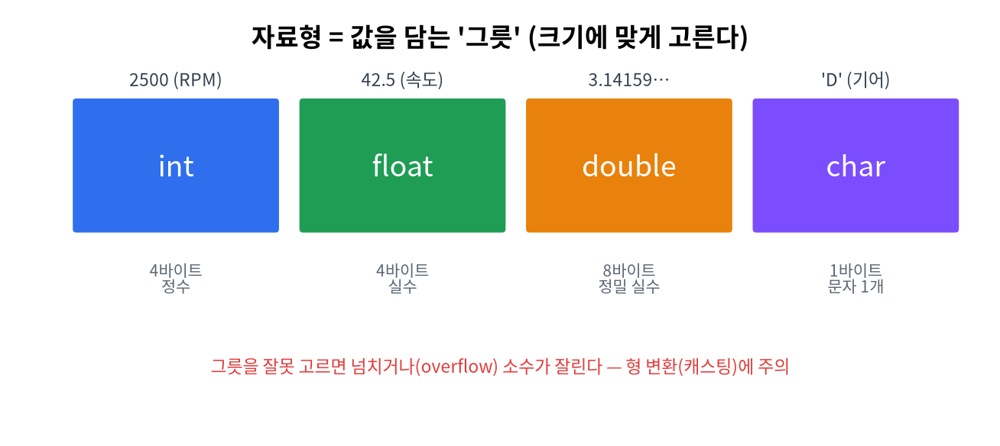
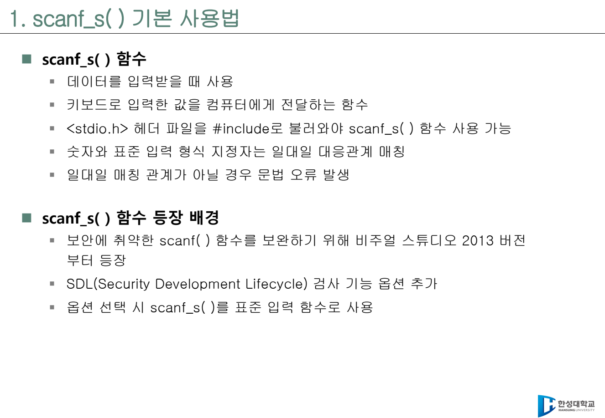
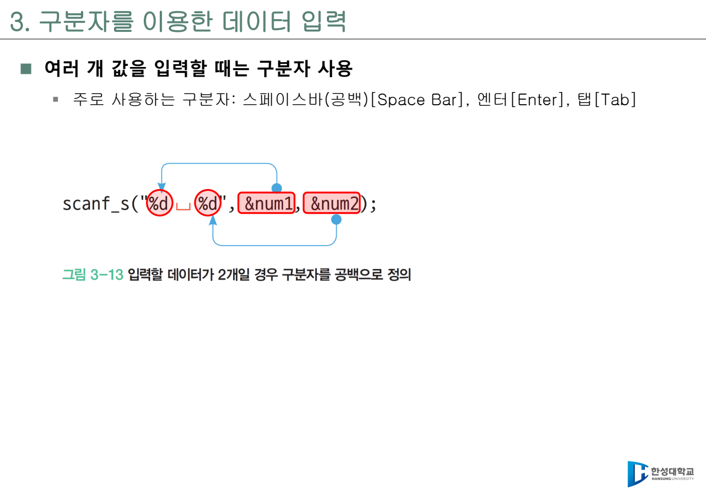
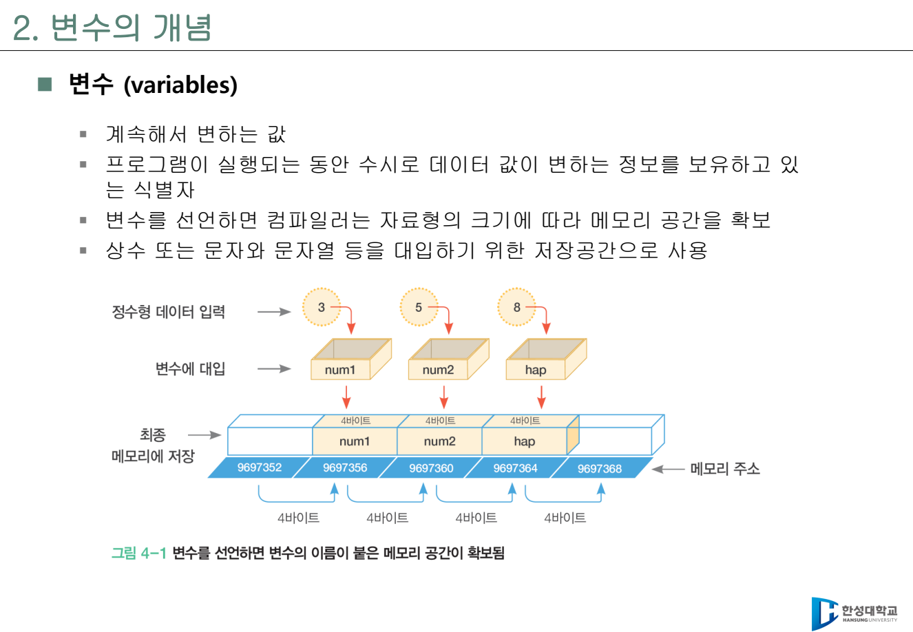
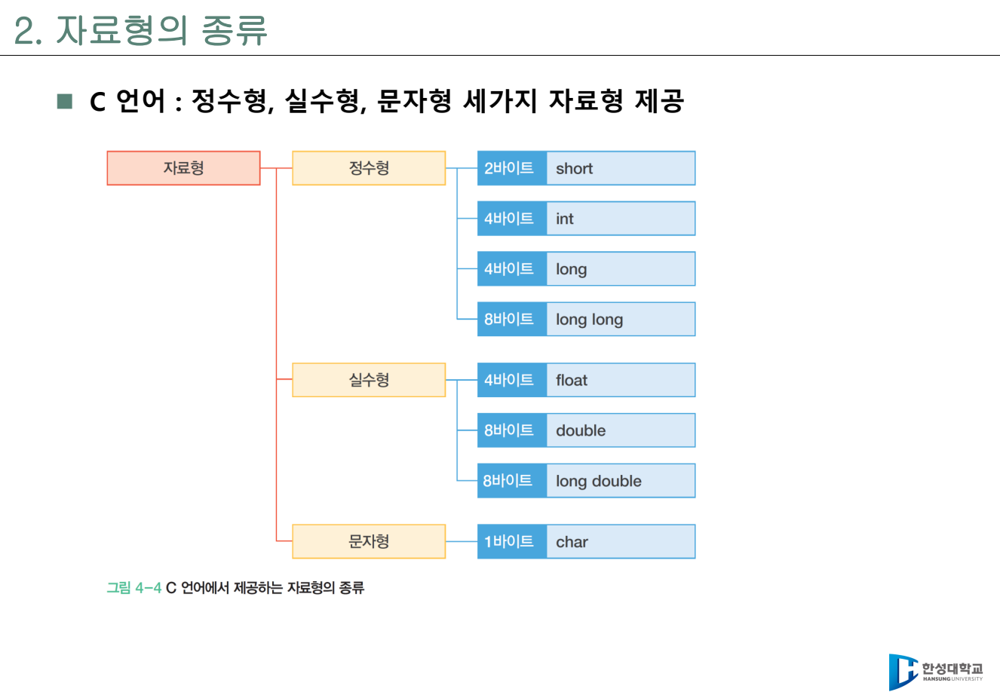
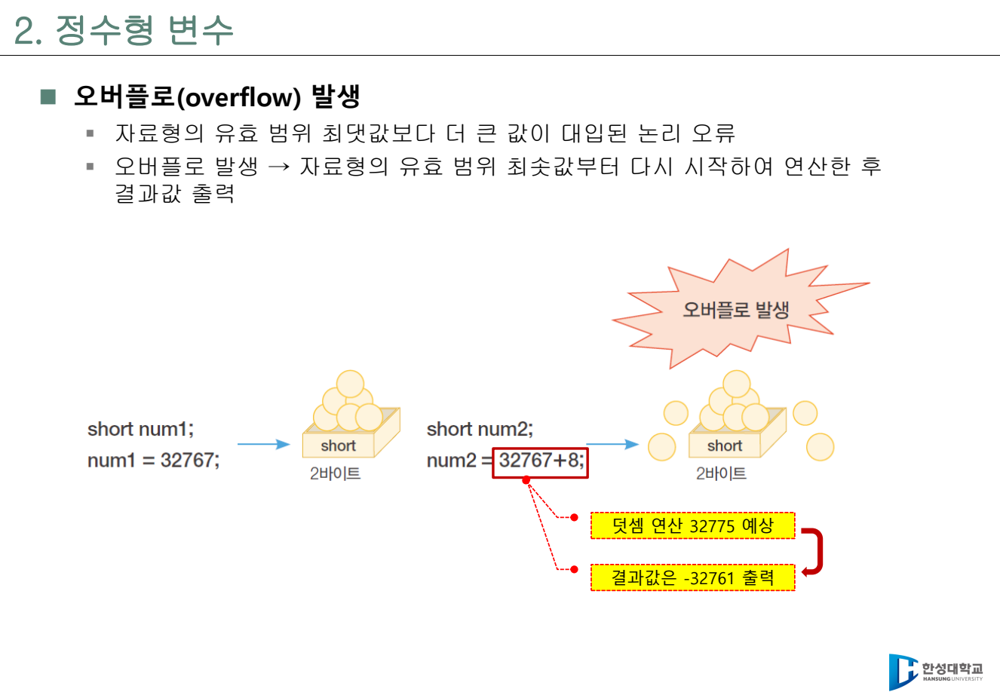
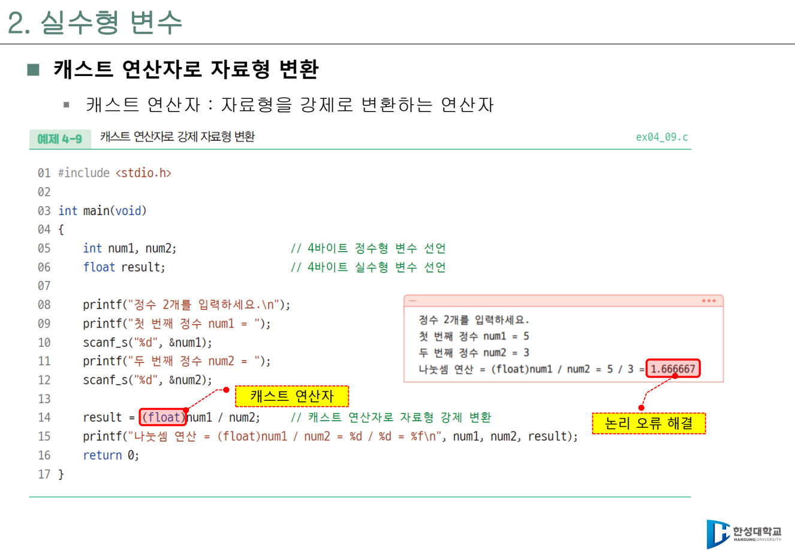
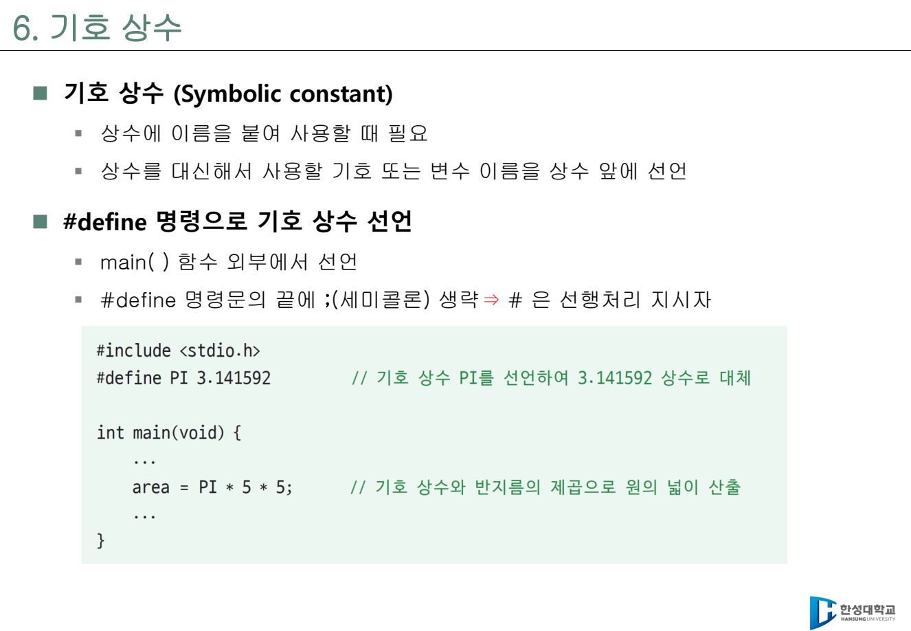
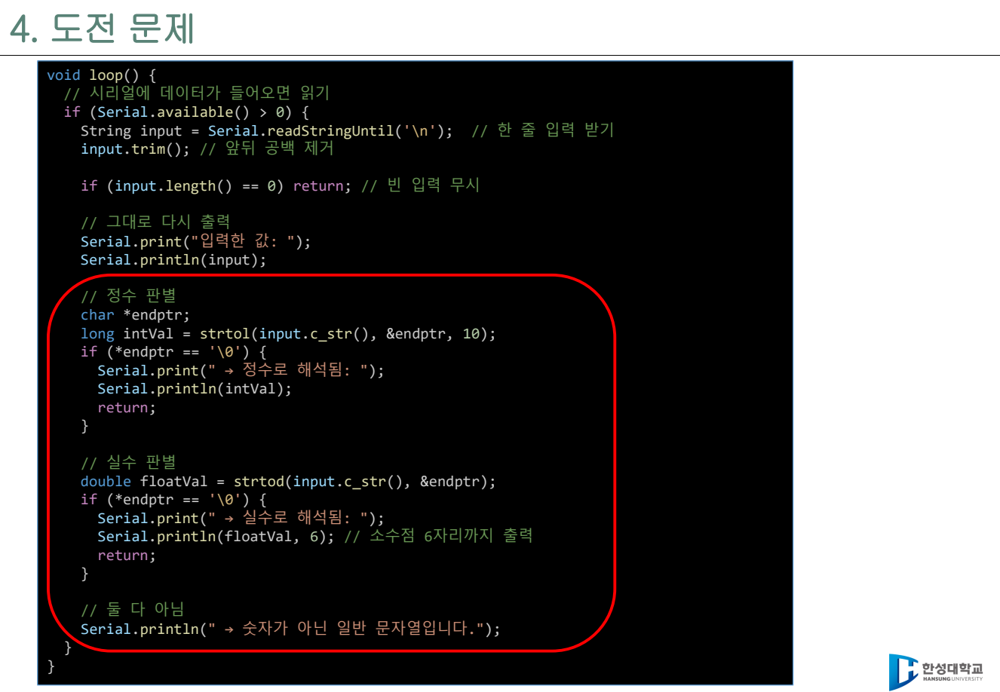

# 3주차 · 입력·변수·자료형
> C언어 · 미래모빌리티학과 | CLO1 | 교재 Ch03-04 | 원본 PDF: `3. 표준 입출력 함수-Scanf`, `3-2. Scanf_s 실습`, `4-1~4-4. 변수와 자료형`



## 학습 목표

- `scanf_s()`가 키보드 입력을 변수에 저장하는 과정을 설명할 수 있다.
- 입력 형식 지정자와 변수의 자료형을 일대일로 맞출 수 있다.
- `&` 주소 연산자가 왜 필요한지 "값을 저장할 위치" 관점에서 설명할 수 있다.
- 식별자, 예약어, 변수 선언, 초기화, 자료형 선택 기준을 이해한다.
- `int`, `float`, `double`, `char`, `unsigned`의 크기와 용도를 비교한다.
- 오버플로, 언더플로, 부동소수점 오차, 정수 나눗셈 함정을 예제로 확인한다.
- `const`, `#define`, 형 변환 `(double)`을 적절히 사용할 수 있다.
- Arduino UNO R4 WiFi의 Serial 입력을 C의 입력·자료형 사고와 연결한다.

---

## 이번 주차의 큰 그림

2주차에는 프로그램이 값을 화면에 보여 주는 방법인 `printf()`를 배웠다. 3주차에는 반대로 사용자가 입력한 값을 프로그램 안으로 가져오는 방법을 배운다. 입력받은 값은 그냥 떠다니는 것이 아니라 반드시 어떤 변수에 저장된다. 그래서 이번 주차는 `scanf_s()`와 변수·자료형을 한 묶음으로 이해해야 한다.

핵심 흐름은 다음과 같다.

1. 사용자가 키보드로 값을 입력한다.
2. `scanf_s()`가 입력 형식 지정자를 보고 값을 해석한다.
3. `&변수명`이 알려 준 메모리 위치에 값이 저장된다.
4. 저장된 값은 자료형에 따라 계산되고 `printf()`로 다시 확인된다.

즉 입력은 "값을 읽는 일"이면서 동시에 "값을 어디에 어떤 모양으로 저장할지 결정하는 일"이다.



원본 자료에서 강조하듯 `scanf_s()`는 Visual Studio 환경에서 보안에 취약한 `scanf()`를 보완하기 위해 사용한다. 이 강의에서는 Windows/Visual Studio 기준으로 `scanf_s()`를 기본으로 다룬다. 다른 컴파일러에서는 `scanf_s()`가 지원되지 않을 수 있으므로, 실습 환경이 달라지면 `scanf()` 또는 별도 입력 함수로 바꿔야 한다.

---

## 3시간 강의 운영안

| 시간 | 내용 | 교수자 진행 포인트 | 학생 활동 |
|---:|---|---|---|
| 0~15분 | 2주차 복습 | `printf()` 형식 지정자와 값의 일대일 대응 복습 | `printf("%d", 10)` 해석 |
| 15~45분 | `scanf_s()` 기본 | 입력값, 형식 지정자, `&`의 역할을 한 줄 코드로 설명 | 정수 1개 입력 후 출력 |
| 45~70분 | 여러 값 입력과 구분자 | 공백, Enter, Tab이 구분자로 동작하는 방식 시연 | 정수 2개, 실수 2개 입력 |
| 70~95분 | 문자·문자열 입력 | `%c`, `%s`, 버퍼 크기 인자, 문자열 끝 `'\0'` 설명 | 문자 1개와 이름 입력 |
| 95~125분 | 변수와 자료형 | 식별자 규칙, 예약어, 변수 선언·초기화, `sizeof` 비교 | 자료형 크기 표 작성 |
| 125~150분 | 범위와 논리 오류 | 오버플로/언더플로, 부동소수점 오차, 정수 나눗셈 함정 | 잘못된 결과 원인 찾기 |
| 150~170분 | 상수와 캐스팅 | `const`, `#define`, `(double)`로 계산 의도 명시 | 평균/속도 계산 수정 |
| 170~180분 | Arduino 연결 | Serial 입력 문자열을 정수/실수로 해석하는 흐름 소개 | 도전문제 방향 확인 |

---

## 이론-실습 연결표

| 이론 개념 | 바로 해볼 실습 | 확인 질문 |
|---|---|---|
| 입력값은 저장 위치가 필요하다 | `scanf_s("%d", &number);`를 실행한다 | `&number`가 빠지면 왜 저장할 위치를 알 수 없는가? |
| 자료형은 값의 모양을 정한다 | `int`, `float`, `double`, `char`의 `sizeof`를 출력한다 | 값의 범위와 정밀도가 왜 자료형마다 다른가? |
| 입력 오류는 반환값으로 확인한다 | `scanf_s()`의 반환값을 검사해 잘못된 입력을 거른다 | 입력 성공 여부를 확인하지 않으면 어떤 문제가 생기는가? |
| Serial 입력도 문자열에서 시작한다 | Arduino `readStringUntil()` 예제를 숫자 변환 흐름으로 읽는다 | PC 입력과 보드 입력의 공통점은 무엇인가? |

## 1. `scanf_s()` 기본 사용법

`scanf_s()`는 키보드로 입력한 값을 변수에 저장할 때 사용한다. `printf()`가 출력용 함수라면, `scanf_s()`는 입력용 함수다. 두 함수 모두 `<stdio.h>` 헤더가 필요하고, 형식 지정자를 사용한다는 공통점이 있다.

```c
#include <stdio.h>

int main(void) {
    int number;

    printf("정수를 입력하세요: ");
    scanf_s("%d", &number);
    printf("입력한 정수: %d\n", number);

    return 0;
}
```

이 코드에서 가장 중요한 부분은 `scanf_s("%d", &number);`이다.

- `%d`: 정수를 입력받겠다는 뜻이다.
- `number`: 입력값이 저장될 변수다.
- `&number`: `number` 변수의 주소다. 입력 함수가 값을 저장할 위치를 알아야 하므로 `&`가 필요하다.

`printf()`는 변수의 값을 읽어서 출력하므로 `printf("%d", number);`처럼 변수 이름만 넘겨도 된다. 하지만 `scanf_s()`는 변수 안의 값을 바꿔야 하므로 `scanf_s("%d", &number);`처럼 변수의 주소를 넘긴다. 이 내용은 12주차 포인터의 예고편이다.

!!! warning "자주 하는 실수"
    `scanf_s("%d", number);`처럼 `&`를 빼면 입력값을 저장할 위치를 알 수 없어서 오류가 발생한다. 지금은 "입력받을 때는 주소가 필요하다"는 규칙으로 익히고, 포인터 단원에서 원리를 다시 해석한다.

## 2. 입력 형식 지정자

입력에서도 형식 지정자와 변수 자료형은 일대일로 맞아야 한다. 원본 자료에서는 자료형에 맞지 않는 입력 형식 지정자를 사용하면 문법 오류 또는 실행 오류가 발생할 수 있다고 설명한다.

| 입력하려는 값 | 변수 예 | `scanf_s()` 형식 | 설명 |
|---|---|---|---|
| 정수 | `int n;` | `scanf_s("%d", &n);` | 부호 있는 정수 |
| 부호 없는 정수 | `unsigned int u;` | `scanf_s("%u", &u);` | 0 이상 정수 |
| 실수(float) | `float f;` | `scanf_s("%f", &f);` | 4바이트 실수 |
| 실수(double) | `double d;` | `scanf_s("%lf", &d);` | 8바이트 실수 |
| 문자 1개 | `char c;` | `scanf_s(" %c", &c, 1);` | Visual Studio `scanf_s`는 크기 인자 필요 |
| 문자열 | `char name[20];` | `scanf_s("%19s", name, (unsigned)sizeof(name));` | 배열 이름은 주소처럼 전달됨 |

`printf()`에서는 `double`도 보통 `%f`로 출력한다. 그러나 `scanf_s()`로 `double`을 입력받을 때는 `%lf`를 써야 한다. 이 차이는 학생들이 자주 헷갈리는 지점이므로 반드시 예제로 나누어 보여 준다.

```c
double distance;

printf("거리(m): ");
scanf_s("%lf", &distance);
printf("입력한 거리 = %.2f m\n", distance);
```

### 입력 성공 여부 확인

`scanf_s()`는 성공적으로 입력받은 항목 수를 반환한다. 처음에는 생략해도 되지만, 잘못된 입력을 처리하려면 반환값을 확인해야 한다.

```c
#include <stdio.h>

int main(void) {
    int number;
    int result;

    printf("정수를 입력하세요: ");
    result = scanf_s("%d", &number);

    if (result == 1) {
        printf("입력한 정수: %d\n", number);
    } else {
        printf("정수가 아닙니다.\n");
    }

    return 0;
}
```

이 코드는 5주차 조건문을 미리 맛보는 예제다. 지금은 `result == 1`이면 입력 성공, 아니면 실패라는 흐름만 이해하면 된다.

## 3. 여러 값 입력과 구분자

여러 값을 입력할 때는 구분자가 필요하다. 원본 자료에서는 주로 사용하는 구분자로 공백(Space), Enter, Tab을 제시한다. `scanf_s()`는 대부분의 숫자 입력에서 공백, 줄바꿈, 탭을 모두 값 사이의 구분자로 처리한다.



```c
#include <stdio.h>

int main(void) {
    int a, b;

    printf("정수 2개 입력: ");
    scanf_s("%d %d", &a, &b);

    printf("%d + %d = %d\n", a, b, a + b);
    return 0;
}
```

사용자는 다음처럼 입력할 수 있다.

```text
10 20
```

또는 첫 값을 입력하고 Enter를 누른 뒤 둘째 값을 입력해도 된다.

```text
10
20
```

둘 다 `%d %d`에 맞게 두 개의 정수를 제공하므로 정상적으로 동작한다.

### 문자 입력에서 공백 처리

문자 입력은 숫자 입력보다 조심해야 한다. 앞선 입력에서 남은 Enter가 다음 `%c`에 들어갈 수 있기 때문이다. 그래서 문자 입력 앞에는 공백을 넣어 `scanf_s(" %c", &grade, 1);`처럼 작성하면 앞쪽 공백 문자를 건너뛸 수 있다.

```c
char grade;

printf("등급 입력(A/B/C): ");
scanf_s(" %c", &grade, 1);
printf("grade = %c\n", grade);
```

## 4. 문자열 입력과 버퍼

C에는 `string`이라는 기본 자료형이 없다. 문자열은 문자 배열로 다룬다. 문자열 끝에는 항상 널 문자 `'\0'`이 붙으므로, 실제 글자 수보다 배열 크기를 하나 더 크게 잡아야 한다.

```c
#include <stdio.h>

int main(void) {
    char name[20];

    printf("이름 입력: ");
    scanf_s("%19s", name, (unsigned)sizeof(name));

    printf("name = %s\n", name);
    return 0;
}
```

여기서 `name` 앞에는 `&`를 붙이지 않는다. 배열 이름 자체가 배열의 시작 주소처럼 전달되기 때문이다. 또한 Visual Studio의 `scanf_s()`에서 `%s`를 사용할 때는 버퍼 크기 인자를 함께 넘겨야 한다.

!!! warning "문자열 입력 안전 규칙"
    `char name[20];`이면 최대 19글자까지만 입력받도록 `"%19s"`를 사용한다. 마지막 1칸은 문자열 끝을 표시하는 `'\0'`을 위해 남겨 둔다.

## 5. 버퍼형 입력의 감각

원본 자료에서는 `scanf_s()`를 버퍼형 표준 입력 함수로 설명한다. 사용자가 키보드로 값을 치고 Enter를 누르면, 입력된 내용이 버퍼에 모였다가 프로그램으로 전달된다. 그래서 연속 입력에서는 이전 Enter나 잘못 입력한 문자가 다음 입력에 영향을 줄 수 있다.

수업에서는 다음 순서로 설명하면 이해가 쉽다.

1. 사용자가 키보드로 입력한다.
2. 입력 내용은 바로 변수에 들어가지 않고 입력 버퍼에 잠시 머문다.
3. Enter를 누르면 `scanf_s()`가 형식에 맞는 부분을 읽는다.
4. 형식에 맞지 않는 문자가 남으면 다음 입력에 영향을 줄 수 있다.

초반에는 복잡한 버퍼 비우기 코드를 깊게 다루기보다, "입력 형식과 실제 입력을 맞추는 습관"을 먼저 잡는다.

---

## 6. 변수와 식별자

변수는 값을 담는 이름 붙은 메모리 공간이다. 프로그램이 실행되는 동안 값이 바뀔 수 있기 때문에 변수(variable)라고 부른다.



```c
int count = 10;
double speed = 42.5;
char gear = 'D';
```

위 코드에서 `count`, `speed`, `gear`는 식별자(identifier)다. 식별자는 프로그래머가 이름을 붙인 대상이다. 변수명, 함수명, 배열명 등이 모두 식별자가 될 수 있다.

### 식별자 규칙

- 알파벳, 숫자, 언더바(`_`)를 조합해 만든다.
- 숫자로 시작할 수 없다.
- C의 예약어(`int`, `return`, `if`, `while` 등)는 사용할 수 없다.
- 대문자와 소문자를 구분한다. `speed`와 `Speed`는 다른 이름이다.
- 한글 변수명은 수업에서 사용하지 않는다. 컴파일러와 인코딩 환경에 따라 문제가 생길 수 있다.
- 변수의 용도를 알 수 있는 이름을 사용한다.

좋은 변수명은 디버깅 시간을 줄인다.

```c
double distance_m;     // 거리, 단위 m
double time_s;         // 시간, 단위 s
double speed_mps;      // 속도, 단위 m/s
int wheel_count;       // 바퀴 회전 카운트
```

`a`, `b`, `c` 같은 이름은 짧은 예제에서는 괜찮지만, 실제 로봇/모빌리티 코드에서는 의미가 부족하다. 단위까지 변수명에 넣으면 계산 실수를 줄일 수 있다.

## 7. 자료형의 개념

자료형(data type)은 변수를 선언할 때 메모리 공간의 크기와 값의 해석 방식을 정한다. 같은 4바이트라도 `int`와 `float`는 값을 저장하고 해석하는 방식이 다르다.



| 자료형 | 보통 크기 | 저장하는 값 | 대표 형식 지정자 | 모빌리티 예 |
|---|---:|---|---|---|
| `int` | 4바이트 | 정수 | `%d` | 바퀴 회전 수, 카운터 |
| `unsigned int` | 4바이트 | 0 이상 정수 | `%u` | 센서 샘플 번호, 비트 마스크 |
| `float` | 4바이트 | 실수 | `%f` | 간단한 센서값 |
| `double` | 8바이트 | 더 정밀한 실수 | `printf`: `%f`, `scanf_s`: `%lf` | 거리, 시간, 속도 계산 |
| `char` | 1바이트 | 문자 1개 또는 작은 정수 | `%c` | 기어 상태 `'D'`, 명령 문자 |

자료형을 고를 때는 다음 질문을 한다.

1. 값에 소수점이 필요한가?
2. 음수가 나올 수 있는가?
3. 값의 최대·최소 범위는 어느 정도인가?
4. 사람이 읽는 문자인가, 계산할 숫자인가?
5. 나중에 `printf()` 또는 `scanf_s()`에서 어떤 형식 지정자로 다룰 것인가?

### `sizeof`로 크기 확인

자료형 크기는 환경에 따라 달라질 수 있으므로 `sizeof`로 확인하는 습관이 좋다.

```c
#include <stdio.h>

int main(void) {
    printf("char   = %zu byte\n", sizeof(char));
    printf("int    = %zu byte\n", sizeof(int));
    printf("float  = %zu byte\n", sizeof(float));
    printf("double = %zu byte\n", sizeof(double));
    return 0;
}
```

`sizeof`의 결과는 `size_t` 자료형이므로 출력할 때 `%zu`를 사용한다.

## 8. 변수 선언과 초기화

변수 선언은 컴파일러에게 "이 이름의 변수를 사용할 것이고, 이만큼의 메모리 공간이 필요하다"고 알려 주는 일이다.

```c
int count;
double speed;
char gear;
```

초기화는 변수를 선언하면서 처음 값을 넣는 일이다.

```c
int count = 0;
double speed = 0.0;
char gear = 'P';
```

초기화하지 않은 변수에는 이전에 메모리에 남아 있던 알 수 없는 값이 들어 있을 수 있다. 이런 값을 가비지값이라고 부른다. 누적합, 평균, 카운터처럼 값을 계속 더해 가는 변수는 반드시 0으로 초기화한다.

```c
int sum = 0;
int count = 0;
```

## 9. 오버플로와 언더플로

자료형에는 저장할 수 있는 범위가 있다. 범위를 넘으면 값이 사람이 예상한 방향으로 커지는 것이 아니라, 자료형의 표현 범위 안에서 다시 돌아가거나 깨진다.



- 오버플로(overflow): 자료형의 최댓값보다 큰 값을 저장하려고 할 때 발생한다.
- 언더플로(underflow): 자료형의 최솟값보다 작은 값을 저장하려고 할 때 발생한다.

```c
#include <stdio.h>
#include <limits.h>

int main(void) {
    int max_value = INT_MAX;

    printf("INT_MAX     = %d\n", max_value);
    printf("INT_MAX + 1 = %d\n", max_value + 1);

    return 0;
}
```

이 예제는 "큰 수를 넣으면 알아서 더 큰 그릇을 써 주겠지"라는 생각이 틀렸음을 보여 준다. C는 선언한 자료형의 범위 안에서만 값을 다룬다.

!!! warning "실무 연결"
    센서 카운터, 엔코더 누적값, 주행 시간처럼 계속 증가하는 값은 오버플로를 고려해야 한다. 로봇이 오래 동작할수록 작은 자료형의 한계가 실제 버그가 될 수 있다.

## 10. 실수형과 부동소수점 오차

실수형은 소수점을 포함하는 값을 저장한다. `float`보다 `double`이 더 많은 비트를 사용하므로 더 정밀하게 표현할 수 있다. 하지만 실수형도 모든 소수를 정확히 저장하는 것은 아니다.

```c
#include <stdio.h>

int main(void) {
    double x = 0.1 + 0.2;
    printf("%.17f\n", x);
    return 0;
}
```

실행하면 `0.30000000000000004`처럼 보일 수 있다. 이것은 C가 틀린 것이 아니라, 컴퓨터가 10진 소수를 2진 부동소수점으로 근사해서 저장하기 때문이다.

수업에서는 이 정도만 기억하면 된다.

- 실수 비교에서 `==`만 믿으면 위험할 수 있다.
- 출력 자리수는 `%.2f`, `%.3f`처럼 필요한 만큼 제한한다.
- 물리량 계산은 `int`보다 `double`이 자연스러운 경우가 많다.

## 11. 정수 나눗셈과 캐스팅

학생들이 가장 자주 만나는 논리 오류는 정수 나눗셈이다. 정수끼리 나누면 결과도 정수로 계산되어 소수점 이하가 버려진다.

```c
int a = 5;
int b = 3;
printf("%f\n", a / b);    // 기대: 1.666667, 실제로는 잘못된 코드
```

정수 나눗셈 결과 `a / b`는 `1`이다. 이를 실수처럼 출력하려고 하면 의도와 다른 결과가 나온다. 해결하려면 계산하기 전에 둘 중 하나를 실수로 바꿔야 한다.



```c
#include <stdio.h>

int main(void) {
    int a = 5;
    int b = 3;

    printf("integer division = %d\n", a / b);
    printf("real division    = %.6f\n", (double)a / b);

    return 0;
}
```

`(double)a`는 `a` 자체의 자료형을 영구히 바꾸는 것이 아니다. 이 계산식 안에서만 `a`를 `double`처럼 보겠다는 명시적 형 변환이다.

### 거리와 시간으로 속도 계산

```c
#include <stdio.h>

int main(void) {
    double distance_m;
    double time_s;
    double speed_mps;

    printf("거리(m)와 시간(s)을 입력하세요: ");
    scanf_s("%lf %lf", &distance_m, &time_s);

    speed_mps = distance_m / time_s;
    printf("speed = %.2f m/s\n", speed_mps);

    return 0;
}
```

이 예제는 입력, 변수, 자료형, 계산, 출력이 한 번에 연결되는 3주차 대표 실습이다.

## 12. 상수

상수(constant)는 프로그램 실행 중 변하지 않는 값이다. 원본 자료에서는 정수형 상수, 실수형 상수, 문자형 상수, 문자열형 상수, 기호 상수를 다룬다.

| 종류 | 예 | 설명 |
|---|---|---|
| 정수형 상수 | `10`, `-3`, `0xFF`, `013` | 10진수, 16진수, 8진수 표현 가능 |
| 실수형 상수 | `3.14`, `1.2e3` | 소수점 또는 지수 표기 |
| 문자형 상수 | `'A'` | 작은따옴표 사용, 문자 1개 |
| 문자열 상수 | `"Hello"` | 큰따옴표 사용, 끝에 `'\0'` 포함 |
| 기호 상수 | `#define MAX 100`, `const double PI = 3.14;` | 이름을 붙인 상수 |



### `#define`과 `const`

```c
#include <stdio.h>

#define MAX_SPEED 120

int main(void) {
    const double PI = 3.141592;
    double radius = 2.0;

    printf("max speed = %d\n", MAX_SPEED);
    printf("area = %.2f\n", PI * radius * radius);

    return 0;
}
```

`#define`은 전처리 단계에서 이름을 값으로 치환한다. 문장 끝에 세미콜론을 붙이지 않는다. `const`는 자료형이 있는 읽기 전용 변수처럼 사용할 수 있고, 세미콜론을 붙인다. 초보자에게는 자료형이 명확한 `const`가 디버깅하기 더 쉽다.

## 13. 문자와 아스키 코드

`char`는 문자 하나를 저장하지만, 내부적으로는 작은 정수값처럼 다룰 수 있다. 예를 들어 `'A'`의 아스키코드 값은 65다.

```c
#include <stdio.h>

int main(void) {
    char ch;

    printf("문자 1개 입력: ");
    scanf_s(" %c", &ch, 1);

    printf("문자 = %c\n", ch);
    printf("ASCII = %d\n", ch);

    return 0;
}
```

문자 상수는 작은따옴표로 감싼다. `'A'`는 문자 1개이고, `"A"`는 문자열이다. 둘은 다르다.

## 14. Arduino UNO R4 WiFi와 연결하기

PC 콘솔 C에서 `scanf_s()`로 입력을 받는다면, Arduino에서는 Serial Monitor로 들어오는 문자열을 읽어 처리한다. 원본 실습 자료의 도전문제는 `Serial.readStringUntil('\n')`으로 한 줄을 입력받고, 그 문자열을 정수 또는 실수로 해석하는 흐름을 보여 준다.



```cpp
void loop() {
    if (Serial.available() > 0) {
        String input = Serial.readStringUntil('\n');
        input.trim();

        if (input.length() == 0) return;

        Serial.print("입력한 값: ");
        Serial.println(input);
    }
}
```

여기까지는 입력한 문자열을 그대로 다시 출력하는 echo 프로그램이다. 숫자로 해석하려면 `strtol()` 또는 `strtod()`를 사용할 수 있다.

```cpp
void loop() {
    if (Serial.available() > 0) {
        String input = Serial.readStringUntil('\n');
        input.trim();

        if (input.length() == 0) return;

        char *endptr;

        long int_value = strtol(input.c_str(), &endptr, 10);
        if (*endptr == '\0') {
            Serial.print("정수로 해석됨: ");
            Serial.println(int_value);
            return;
        }

        double double_value = strtod(input.c_str(), &endptr);
        if (*endptr == '\0') {
            Serial.print("실수로 해석됨: ");
            Serial.println(double_value, 6);
            return;
        }

        Serial.println("숫자가 아닌 문자열입니다.");
    }
}
```

이 코드는 아직 C 초반부 학생에게는 길지만, 핵심 사고는 단순하다.

- 입력은 처음에는 문자열로 들어온다.
- 문자열이 정수로 해석되는지 먼저 확인한다.
- 정수가 아니면 실수로 해석되는지 확인한다.
- 둘 다 아니면 일반 문자열로 처리한다.

이 흐름은 7주차 시리얼 제어, 11주차 통신, 15주차 C와 ROS2 연결에서 다시 사용된다.

---

## 15. 실습

### 실습 3-1 · 정수 입력 후 다시 출력

```c
#include <stdio.h>

int main(void) {
    int age;

    printf("나이 입력: ");
    scanf_s("%d", &age);

    printf("age = %d\n", age);
    return 0;
}
```

확인 질문: `scanf_s()`에서 `age` 앞에 `&`를 붙이는 이유는 무엇인가?

### 실습 3-2 · 거리와 시간 입력

```c
#include <stdio.h>

int main(void) {
    double distance_m;
    double time_s;

    printf("거리(m) 시간(s): ");
    scanf_s("%lf %lf", &distance_m, &time_s);

    printf("거리 %.2f m, 시간 %.2f s\n", distance_m, time_s);
    return 0;
}
```

입력 예:

```text
100 3
```

### 실습 3-3 · 속도 계산

실습 3-2를 확장해 속도를 계산한다.

```c
double speed_mps = distance_m / time_s;
printf("속도 = %.2f m/s\n", speed_mps);
```

추가 질문: `time_s`에 0을 입력하면 어떤 문제가 생길까? 이 문제는 5주차 조건문에서 막을 수 있다.

### 실습 3-4 · 자료형 크기 비교

```c
#include <stdio.h>

int main(void) {
    printf("%-12s %zu\n", "char", sizeof(char));
    printf("%-12s %zu\n", "int", sizeof(int));
    printf("%-12s %zu\n", "unsigned", sizeof(unsigned int));
    printf("%-12s %zu\n", "float", sizeof(float));
    printf("%-12s %zu\n", "double", sizeof(double));
    return 0;
}
```

결과를 표로 옮기고, 어떤 값에 어떤 자료형이 어울리는지 예를 적는다.

### 실습 3-5 · 정수 나눗셈과 캐스팅

```c
#include <stdio.h>

int main(void) {
    int a = 7;
    int b = 2;

    printf("a / b = %d\n", a / b);
    printf("(double)a / b = %.1f\n", (double)a / b);

    return 0;
}
```

결과가 왜 다른지 주석으로 설명한다.

### 실습 3-6 · 문자와 아스키 코드

```c
#include <stdio.h>

int main(void) {
    char command;

    printf("명령 문자 입력(F/B/L/R/S): ");
    scanf_s(" %c", &command, 1);

    printf("command = %c\n", command);
    printf("ASCII   = %d\n", command);
    return 0;
}
```

이 실습은 나중에 로봇 명령 문자 처리로 연결된다. 예를 들어 `F`는 forward, `B`는 backward, `S`는 stop처럼 해석할 수 있다.

---

## 16. 도전문제

### 도전문제 1 · 입력 성공 여부 확인

정수를 입력받고, 정수가 아니면 "유효하지 않은 입력입니다."를 출력하는 프로그램을 작성한다.

힌트:

```c
int result = scanf_s("%d", &number);
```

??? success "정답 방향"
    `result`가 1이면 정수 입력에 성공한 것이다. 0이면 입력 형식이 맞지 않은 것이다. 잘못된 입력이 남아 있으면 이후 입력에 영향을 줄 수 있으므로 버퍼 처리까지 확장할 수 있다.

### 도전문제 2 · BMI 계산

키(cm)와 몸무게(kg)를 입력받아 BMI를 계산한다.

공식:

```text
BMI = weight_kg / (height_m * height_m)
```

조건:

- 키는 cm로 입력받고 m로 변환한다.
- `double`을 사용한다.
- 결과는 소수점 둘째 자리까지 출력한다.

### 도전문제 3 · 진법 출력

정수 하나를 입력받아 10진수, 8진수, 16진수로 출력한다.

```c
printf("dec = %d\n", value);
printf("oct = %#o\n", value);
printf("hex = %#x\n", value);
```

### 도전문제 4 · Arduino Serial 숫자 판별

Arduino Serial Monitor에서 한 줄을 입력받아 정수, 실수, 일반 문자열 중 무엇인지 판별한다.

수업에서는 전체 코드를 외우게 하지 말고 다음 질문에 답하게 한다.

- Serial 입력은 처음에 어떤 자료형처럼 들어오는가?
- 정수 판별에는 어떤 함수가 사용되는가?
- 실수 판별에는 어떤 함수가 사용되는가?
- 숫자로 끝까지 해석되었는지 어떻게 확인하는가?

---

## 17. 자주 막히는 지점

- `scanf_s()`에서 `&`를 빼면 입력값을 저장할 위치를 알 수 없다.
- `double` 입력은 `%lf`, `double` 출력은 보통 `%f`를 사용한다.
- `%c` 입력 앞에 공백을 넣지 않으면 이전 Enter가 문자로 읽힐 수 있다.
- `scanf_s()`에서 `%c`, `%s`를 사용할 때는 버퍼 크기 인자를 넘겨야 한다.
- 문자열 배열은 끝의 `'\0'` 때문에 실제 글자 수보다 1칸 더 필요하다.
- 변수는 선언만 하지 말고 초기화해야 가비지값을 피할 수 있다.
- 정수끼리 나누면 소수점 이하가 버려진다.
- 자료형 범위를 넘으면 오버플로/언더플로가 발생할 수 있다.
- 실수는 근사값이므로 소수점 출력 자리수를 적절히 제한한다.

## 18. 형성평가 체크포인트

- [ ] `scanf_s("%d", &n);`에서 `&`의 의미를 설명할 수 있다.
- [ ] `int`, `float`, `double`, `char` 중 적절한 자료형을 고를 수 있다.
- [ ] `sizeof`로 자료형 크기를 확인할 수 있다.
- [ ] `double` 입력 형식 지정자 `%lf`를 사용할 수 있다.
- [ ] 문자 입력에서 `scanf_s(" %c", &ch, 1);`처럼 크기 인자를 쓸 수 있다.
- [ ] `const`와 `#define`의 차이를 설명할 수 있다.
- [ ] `(double)a / b`가 필요한 이유를 설명할 수 있다.
- [ ] Arduino Serial 입력이 문자열에서 숫자 해석으로 이어지는 흐름을 말할 수 있다.

## 19. 과제

1. 이름, 나이, 키를 입력받아 한 줄로 출력하는 프로그램을 작성한다.
2. 거리(m)와 시간(s)을 입력받아 속도(m/s)를 계산한다.
3. `sizeof`를 사용해 `char`, `int`, `float`, `double`의 크기를 출력한다.
4. `int a = 7, b = 2;`에서 정수 나눗셈과 실수 나눗셈 결과를 비교한다.
5. `const double PI`를 사용해 원의 넓이를 계산한다.
6. Arduino UNO R4 Serial Monitor 입력값을 그대로 다시 출력하는 echo 코드를 실행해 본다.

## 20. 다음 주차 연결

이번 주차에는 값을 입력받고 저장하고 계산했다. 4주차에는 이 값들을 더 다양하게 조작하는 연산자를 배운다. 산술 연산, 비교 연산, 논리 연산을 배우면 "입력값이 어떤 조건을 만족하는가"를 판단할 수 있고, 그 결과는 5주차 조건문으로 이어진다.

## 참조

- 교재 Ch03-04 · 표준 입력 함수, 변수와 자료형
- C 자료형: <https://en.cppreference.com/w/c/language/type>
- C `scanf` 계열 함수: <https://en.cppreference.com/w/c/io/fscanf>
