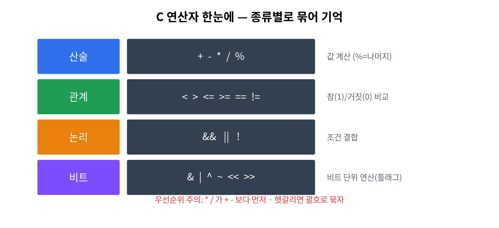

# 4주차 · 연산자
> C언어 · 미래모빌리티학과 | CLO1 | 교재 Ch05




## 학습 목표
- 산술·관계·논리·대입·증감 연산자와 **우선순위**를 사용한다.
- **비트 연산자**로 센서 상태 플래그를 묶고 다룬다.

---

## 강의 해설

4주차의 연산자는 C 코드의 문장 안에서 실제 판단과 계산을 만드는 재료다. 산술 연산자는 속도, 거리, 시간, 배터리 잔량을 계산하고, 관계 연산자는 "장애물이 가까운가", "속도가 제한보다 큰가" 같은 질문에 답한다. 논리 연산자는 여러 조건을 묶어 "전방 장애물이 있고 속도가 0이 아니면 감속"처럼 실제 제어 규칙을 만든다.

우선순위는 암기표처럼 접근하면 금방 잊어버린다. 수업에서는 중요한 원칙 하나를 먼저 잡는다. 계산이 헷갈리면 괄호를 써서 의도를 드러낸다. 컴파일러는 우선순위대로 계산하지만, 사람은 코드를 읽으며 의도를 이해해야 한다. 특히 조건문 안에 산술, 관계, 논리 연산이 섞이면 괄호가 곧 문서 역할을 한다.

비트 연산은 처음에는 낯설지만 임베디드와 자동차 제어에서 매우 자주 등장한다. 센서 여러 개의 on/off 상태를 변수 하나에 담으면 메모리를 아낄 수 있고, 통신으로 보내기도 쉽다. `S_FRONT`, `S_LEFT`, `S_RIGHT` 같은 플래그는 "정수 하나를 작은 스위치 묶음으로 사용한다"는 생각이다. 이 감각은 이후 레지스터 제어, CAN 메시지, 상태 플래그를 이해하는 기초가 된다.

## 3시간 강의 운영 포인트

- **0~25분**: 산술, 관계, 논리 연산자를 실제 주행 판단 문장으로 바꾸어 읽는다. 예를 들어 "거리 < 정지거리 && 속도 > 0"을 코드와 자연어로 번갈아 설명한다.
- **25~80분**: 우선순위와 괄호를 다룬다. 복잡한 식을 일부러 제시한 뒤, 사람이 읽기 좋은 식으로 다시 쓰게 한다.
- **80~135분**: 센서 플래그 비트 연산을 시연한다. 2진수 표를 그려 `|`, `&`, `~`가 스위치를 켜고 끄는 동작임을 확인한다.
- **135~180분**: 홀짝 판별, 플래그 조합, 속도 계산 문제를 실습으로 돌리고, 마지막에는 학생이 만든 조건식을 서로 리뷰한다.

## 강의 본문 보강

### 개념을 더 풀어 설명하기
연산자는 값을 새 값으로 바꾸는 규칙이다. 산술 연산자는 거리, 시간, 속도 같은 수치를 계산하고, 관계 연산자는 두 값을 비교해 참과 거짓을 만든다. 논리 연산자는 여러 판단을 묶는다. 예를 들어 "장애물이 가깝고 속도가 0보다 크면 감속한다"는 자연어 문장은 C에서 `(distance < stop_distance) && (speed > 0)` 같은 조건식이 된다.

우선순위는 표를 외우기보다 의도를 분명히 쓰는 습관으로 접근한다. 사람도 헷갈리는 식은 컴파일러가 맞게 계산하더라도 유지보수에 좋지 않다. 그래서 조건문 안에서는 괄호를 적극적으로 사용한다. 괄호는 계산 순서를 바꿀 뿐 아니라, 코드를 읽는 사람에게 "내가 이렇게 판단하려고 했다"는 설명이 된다.

### 비트 연산을 쉽게 설명하기
비트 연산은 숫자를 작은 스위치 묶음으로 보는 방법이다. `0000 0101`은 십진수 5이면서 동시에 0번 센서와 2번 센서가 켜져 있는 상태라고 볼 수 있다. `|`는 스위치를 켜고, `&`는 특정 스위치가 켜져 있는지 확인하고, `~`는 스위치 상태를 뒤집는다. 임베디드 보드와 차량 제어에서는 여러 센서 상태를 작은 변수 하나에 담아 보내는 일이 많기 때문에 이 감각이 중요하다.

### 학생 활동
- 속도 제한, 배터리 부족, 장애물 감지 조건을 각각 관계/논리식으로 바꾼다.
- `a + b * c`와 `(a + b) * c`의 결과를 비교한다.
- 4방향 센서 플래그를 비트로 만들고, 특정 방향이 감지되었는지 확인한다.
- 일부러 괄호가 없는 복잡한 조건식을 괄호가 있는 읽기 쉬운 식으로 고친다.

### 자주 막히는 지점
- `=`는 대입이고 `==`는 비교다.
- `&&`와 `&`, `||`와 `|`는 용도가 다르다.
- `%`는 나머지 연산자이며 실수에는 그대로 쓸 수 없다.
- 증감 연산자 `i++`는 반복문에서 자주 쓰이므로 반복 흐름과 함께 이해해야 한다.

## 1. 이론

### 1.1 연산자 분류
| 종류 | 연산자 | 예 |
|------|--------|----|
| 산술 | `+ - * / %` | `7 % 3 → 1`(나머지) |
| 관계 | `> < >= <= == !=` | `a > b` → 0/1 |
| 논리 | `&& || !` | `(a>0)&&(b>0)` |
| 대입 | `= += -= *= /=` | `x += 5` |
| 증감 | `++ --` | `i++` |
| 비트 | `& | ^ ~ << >>` | 아래 1.3 |

!!! warning "정수 나눗셈과 나머지"
    `/`는 정수끼리면 몫만 남는다(`7/2=3`). `%`(나머지)는 **정수에만** 쓴다.

### 1.2 우선순위(요약)
`( )` → `! ++ --` → `* / %` → `+ -` → `< >` → `== !=` → `&& ` → `||` → `=`
> 헷갈리면 **괄호로 명확히**. 가독성도 좋아진다.

### 1.3 비트 연산 — 센서 플래그
센서 여러 개의 on/off를 정수 하나의 **비트**에 담는다(임베디드 핵심 기법).
```c
#define S_FRONT (1 << 0)   // 0b001
#define S_LEFT  (1 << 1)   // 0b010
#define S_RIGHT (1 << 2)   // 0b100
unsigned char s = 0;
s |= S_FRONT;              // 켜기  (OR)
s &= ~S_LEFT;             // 끄기  (AND NOT)
s ^= S_RIGHT;             // 토글  (XOR)
if (s & S_FRONT) { /* 전방 감지 */ }   // 확인 (AND)
```
| 동작 | 연산 |
|------|------|
| 켜기 | `s |= FLAG` |
| 끄기 | `s &= ~FLAG` |
| 토글 | `s ^= FLAG` |
| 확인 | `s & FLAG` |

---

## 2. 핵심 용어 정리
| 용어 | 설명 |
|------|------|
| 피연산자 | 연산의 대상 값 |
| 우선순위 | 연산이 적용되는 순서 |
| 단락 평가 | `&&`/`||`에서 결과가 정해지면 뒤를 건너뜀 |
| 비트 플래그 | 각 비트로 on/off 상태를 표현 |
| 시프트(`<< >>`) | 비트를 좌/우로 이동(×2, ÷2 효과) |

---

## 3. 실습

### 실습 4-1 · 속도 계산 (예제 `ex02_operators.c`)
```c
double dist = 150.0, t = 12.0;
double speed = dist / t;
printf("%.2f m/s (%.1f km/h)\n", speed, speed * 3.6);
```

### 실습 4-2 · 센서 플래그
4방향 센서를 비트로 켜기/끄기/토글/확인 (위 1.3).

### 실습 4-3 · 홀짝 판별(비트)
`n & 1`로 홀짝 판별(`%` 없이). 연습 2-3.

---

## 4. 과제
- 속도 계산기, 비트 플래그 센서 관리(연습 2-1~2-3).

## 5. 참조
- 교재 Ch05 · 연산자 <https://en.cppreference.com/w/c/language/operator_precedence>

## 형성평가 체크포인트
- [ ] 우선순위 예측 · [ ] `&/|/^/~` 용도 구분 · [ ] 켜기/끄기/토글/확인 구현

---

## 연습문제
1. `3 + 4 * 2` 의 값은?
2. `unsigned char s=0; s |= (1<<0); s |= (1<<2);` 일 때 `s`의 값은?
3. 이어서 `s &= ~(1<<0);` 을 하면 `s`의 값은?
4. `n & 1` 의 결과가 1이면 `n`은 홀수인가 짝수인가?

??? success "정답 및 해설"
    1. `11` — `*`가 `+`보다 우선(4*2=8, +3).
    2. `5` — 0b001 | 0b100 = 0b101 = 5.
    3. `4` — 0번 비트를 끄면 0b100 = 4.
    4. **홀수** — 마지막 비트가 1이면 홀수.
