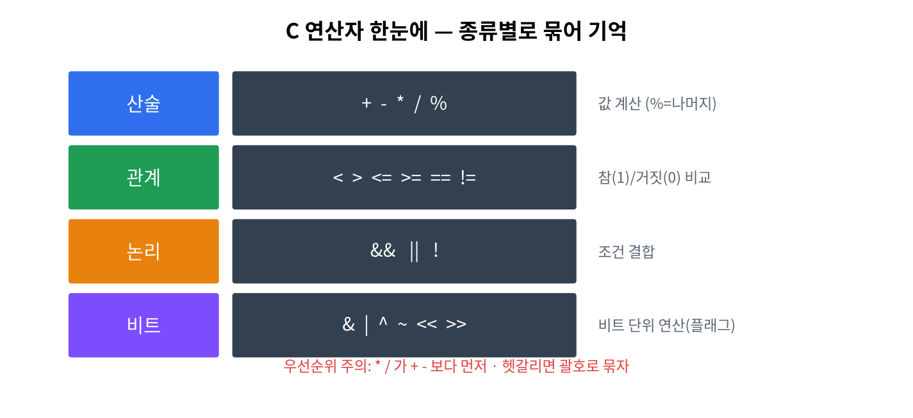
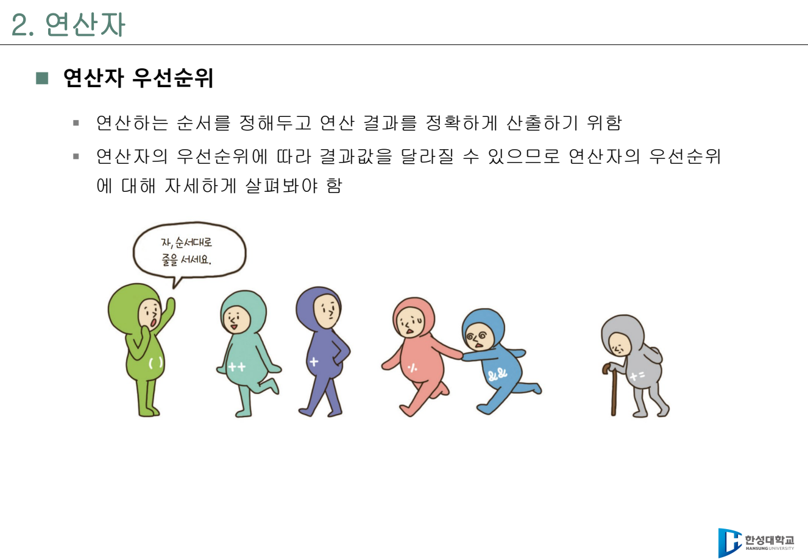
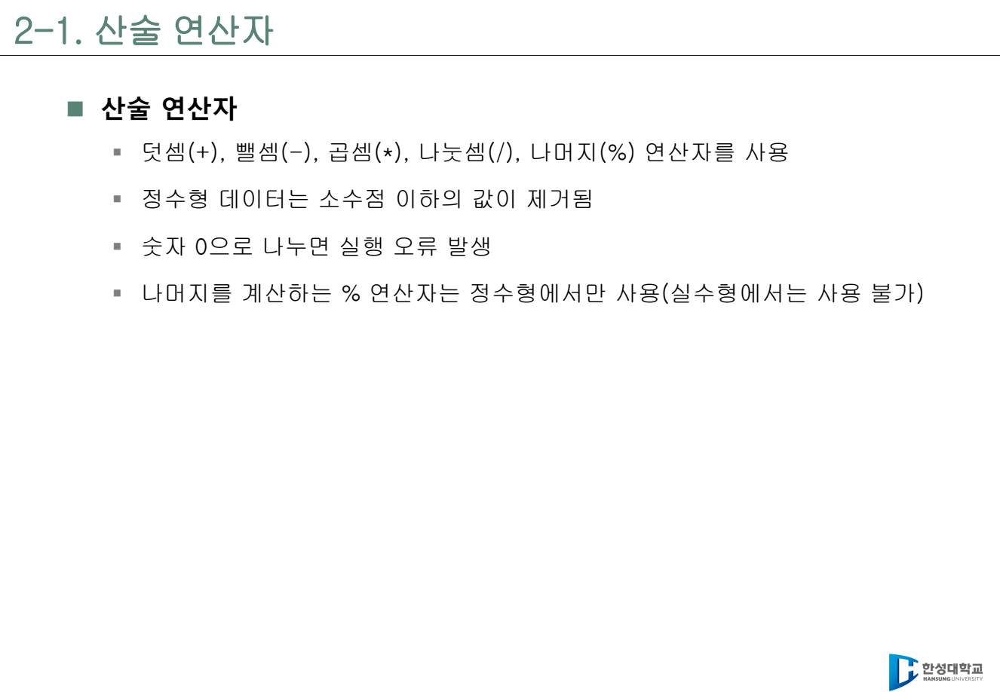
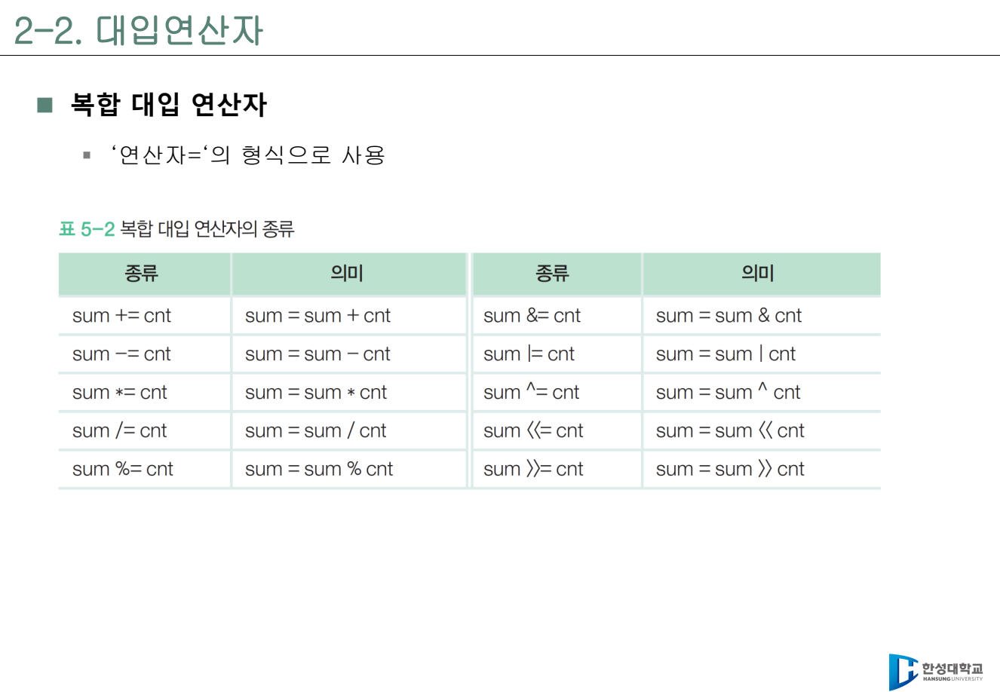
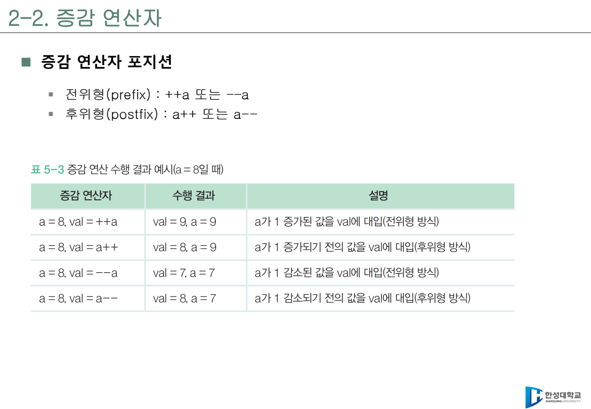
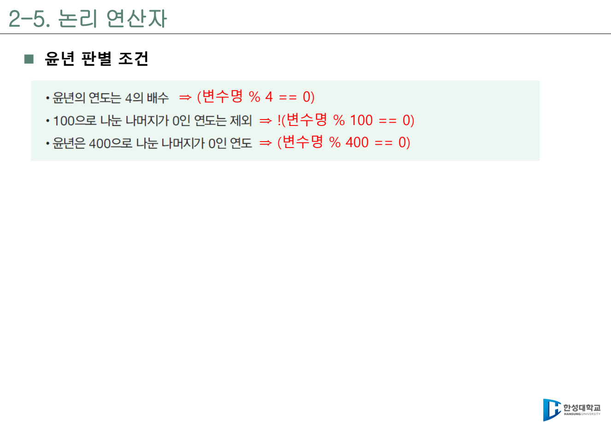
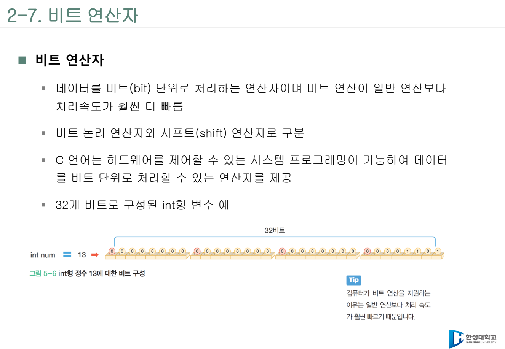
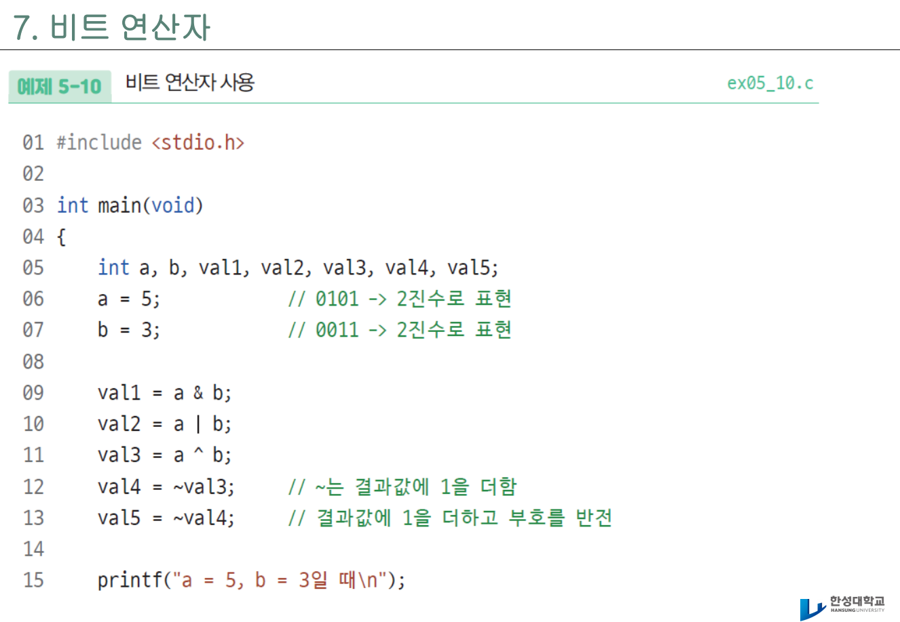
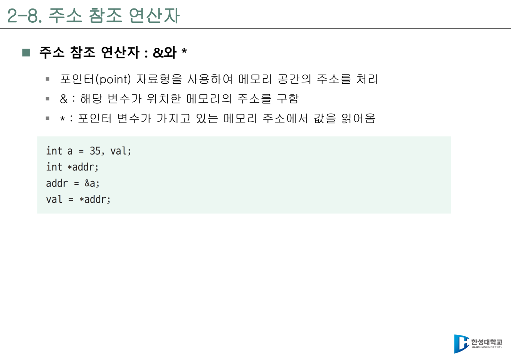

# 4주차 · 연산자
> C언어 · 미래모빌리티학과 | CLO1 | 교재 Ch05 | 원본 PDF: `5-1. 연산자`, `5-2. 연산자 - 실습`



## 학습 목표

- 수식(expression), 연산자(operator), 피연산자(operand)의 의미를 설명할 수 있다.
- 산술, 대입, 복합 대입, 증감, 관계, 논리, 조건, 비트 연산자를 구분해 사용할 수 있다.
- 연산자 우선순위와 결합 방향을 이해하고, 괄호로 의도를 명확히 표현할 수 있다.
- 정수 나눗셈, 0으로 나누기, 나머지 연산자 `%`의 제한을 설명할 수 있다.
- `=`와 `==`, `&&`와 `&`, `||`와 `|`의 차이를 구분할 수 있다.
- 비트 연산자로 센서 상태 플래그를 켜기, 끄기, 토글, 확인할 수 있다.
- 주소 참조 연산자 `&`, 간접 참조 연산자 `*`, `sizeof`, 캐스트 연산자를 다음 단원과 연결해 이해한다.
- Arduino UNO R4 WiFi에서 센서·버튼·LED 상태를 연산자로 처리하는 예제를 읽을 수 있다.

---

## 이번 주차의 큰 그림

3주차까지는 값을 입력받고 변수에 저장하고 출력하는 방법을 배웠다. 4주차는 그 값들을 실제로 "계산하고 판단하는" 방법을 배운다. 연산자는 C 프로그램의 문장 안에서 값을 바꾸거나, 비교하거나, 여러 조건을 묶거나, 하드웨어 상태를 비트 단위로 다루는 도구다.

연산자는 단순 계산 기호가 아니다. 모빌리티 시스템에서는 다음처럼 실제 판단으로 연결된다.

- 산술 연산: `speed = distance / time`
- 관계 연산: `distance < stop_distance`
- 논리 연산: `(distance < stop_distance) && (speed > 0)`
- 대입 연산: `speed_kmh = speed_mps * 3.6`
- 비트 연산: `sensor_flags & FRONT_SENSOR`

이번 주차의 중요한 태도는 두 가지다. 첫째, 컴파일러가 계산하는 순서를 이해한다. 둘째, 사람이 읽기 쉬운 식을 쓴다. 우선순위를 외우는 것보다 괄호를 사용해 의도를 드러내는 습관이 더 오래 간다.



---

## 3시간 강의 운영안

| 시간 | 내용 | 교수자 진행 포인트 | 학생 활동 |
|---:|---|---|---|
| 0~15분 | 3주차 복습 | 변수, 자료형, `scanf_s`, `printf` 형식 지정자 연결 | 입력값 2개를 받아 출력 |
| 15~40분 | 수식과 산술 연산자 | `/`, `%`, 0으로 나누기, 정수 나눗셈 함정 설명 | 몫/나머지/속도 계산 |
| 40~60분 | 대입·복합 대입 | `=`, `+=`, `-=`, `*=`, `/=`, `%=`의 의미 | 누적 거리, 배터리 감소식 작성 |
| 60~80분 | 증감 연산자 | 전위형 `++i`, 후위형 `i++` 결과 비교 | 출력 순서 예측 |
| 80~105분 | 관계·논리 연산자 | 참은 1, 거짓은 0, `&&`, `||`, `!`, 단락 평가 설명 | 정지 조건과 윤년 조건 작성 |
| 105~125분 | 조건 연산자 | `(조건) ? 참값 : 거짓값`으로 최대값/상태 문자열 선택 | 큰 값 고르기 |
| 125~155분 | 비트 연산자 | `&`, `|`, `^`, `~`, `<<`, `>>`를 센서 플래그로 설명 | 센서 플래그 켜기/끄기 |
| 155~170분 | 주소·sizeof·캐스트·콤마 | `&`, `*`, `sizeof`, `(double)`, 콤마 연산자를 다음 단원과 연결 | 핵심 용도 표 작성 |
| 170~180분 | 형성평가 | 헷갈리는 연산자 5개를 짧게 점검 | 연습문제 풀이 |

---

## 이론-실습 연결표

| 이론 개념 | 바로 해볼 실습 | 확인 질문 |
|---|---|---|
| 연산자는 값을 바꾸는 규칙이다 | 몫, 나머지, 평균 계산 코드를 작성한다 | 정수 나눗셈과 실수 나눗셈 결과가 왜 다른가? |
| 비교와 논리는 판단을 만든다 | 정지거리, 윤년, 범위 조건식을 작성한다 | `&&`와 `||` 중 어떤 상황에 써야 하는가? |
| 비트 연산은 상태를 압축한다 | 센서 플래그를 켜고 끄는 코드를 실행한다 | `&`가 논리 AND가 아니라 비트 검사일 때는 언제인가? |
| Arduino 상태 처리 | 버튼/센서 상태를 플래그로 표현한다 | 보드 입력 여러 개를 숫자 하나에 담는 장점은 무엇인가? |

## 1. 수식과 연산자

수식(expression)은 값을 만들어 내는 코드 조각이다. `3 + 4`, `speed > 0`, `distance / time`은 모두 수식이다. 연산자(operator)는 계산이나 판단을 수행하는 기호이고, 피연산자(operand)는 연산의 대상이 되는 값이다.

```c
int result = a + b;
```

위 코드에서 `+`는 연산자, `a`와 `b`는 피연산자다. `a + b`는 수식이고, 그 결과가 `result`에 대입된다.

연산자는 크게 다음처럼 나누어 볼 수 있다.

| 분류 | 연산자 | 대표 용도 |
|---|---|---|
| 산술 | `+`, `-`, `*`, `/`, `%` | 거리, 속도, 평균, 나머지 계산 |
| 대입 | `=`, `+=`, `-=`, `*=`, `/=`, `%=` | 변수값 저장, 누적, 감소 |
| 증감 | `++`, `--` | 카운터 1 증가/감소 |
| 관계 | `>`, `<`, `>=`, `<=`, `==`, `!=` | 두 값 비교 |
| 논리 | `&&`, `||`, `!` | 여러 조건 결합 |
| 조건 | `? :` | 조건에 따라 값 선택 |
| 비트 | `&`, `|`, `^`, `~`, `<<`, `>>` | 플래그, 레지스터, 센서 상태 |
| 주소 참조 | `&`, `*` | 주소 구하기, 주소가 가리키는 값 읽기 |
| 기타 | `sizeof`, 캐스트, 콤마 | 크기 확인, 자료형 변환, 수식 연결 |

## 2. 산술 연산자

산술 연산자는 덧셈, 뺄셈, 곱셈, 나눗셈, 나머지를 계산한다.



```c
#include <stdio.h>

int main(void) {
    int a = 7;
    int b = 2;

    printf("a + b = %d\n", a + b);
    printf("a - b = %d\n", a - b);
    printf("a * b = %d\n", a * b);
    printf("a / b = %d\n", a / b);
    printf("a %% b = %d\n", a % b);

    return 0;
}
```

예상 출력:

```text
a + b = 9
a - b = 5
a * b = 14
a / b = 3
a % b = 1
```

`7 / 2`가 `3`인 이유는 두 피연산자가 모두 정수이기 때문이다. 정수 나눗셈에서는 소수점 이하가 버려진다. 실수 결과가 필요하면 명시적으로 실수 계산으로 바꿔야 한다.

```c
printf("%.1f\n", (double)a / b);   // 3.5
```

### 나머지 연산자 `%`

나머지 연산자 `%`는 정수에서만 사용할 수 있다. 실수에는 그대로 사용할 수 없다.

```c
int n = 17;

printf("n %% 2 = %d\n", n % 2);
printf("n %% 3 = %d\n", n % 3);
```

활용 예:

- `n % 2 == 0`: 짝수 판별
- `n % 2 != 0`: 홀수 판별
- `n % 3 == 0`: 3의 배수 판별
- `seconds % 60`: 초 단위를 분/초로 나눌 때 남는 초 계산

!!! warning "0으로 나누기"
    `/` 또는 `%`의 오른쪽 값이 0이면 실행 오류가 발생할 수 있다. 입력받은 값으로 나눌 때는 5주차 조건문에서 `time_s != 0` 같은 확인을 먼저 하게 된다.

## 3. 대입 연산자와 복합 대입 연산자

대입 연산자 `=`는 오른쪽 값을 왼쪽 변수에 저장한다. 수학의 등호처럼 "같다"가 아니라 "넣는다"는 뜻이다.

```c
int speed = 0;
speed = 42;
```

`=`의 왼쪽에는 값을 저장할 수 있는 변수가 와야 한다.

```c
speed = 42;    // 가능
42 = speed;    // 불가능
```



복합 대입 연산자는 현재 변수값에 연산을 적용한 뒤 다시 저장한다.

| 표현 | 같은 의미 | 예 |
|---|---|---|
| `x += 5` | `x = x + 5` | 누적 거리 증가 |
| `x -= 5` | `x = x - 5` | 배터리 잔량 감소 |
| `x *= 2` | `x = x * 2` | 배율 적용 |
| `x /= 2` | `x = x / 2` | 절반으로 줄임 |
| `x %= 10` | `x = x % 10` | 마지막 자리만 남김 |

```c
double distance_m = 0.0;
double step_m = 1.25;

distance_m += step_m;
distance_m += step_m;

printf("distance = %.2f m\n", distance_m);
```

모빌리티 로그에서는 누적 거리, 누적 시간, 배터리 감소량처럼 이전 값에 계속 더하거나 빼는 경우가 많다. 이때 복합 대입 연산자가 자연스럽다.

## 4. 증감 연산자

증감 연산자는 변수를 1 증가시키거나 1 감소시킨다.

```c
count++;
count--;
++count;
--count;
```

전위형(prefix)은 먼저 증가/감소한 뒤 값을 사용한다. 후위형(postfix)은 현재 값을 먼저 사용한 뒤 증가/감소한다.



```c
#include <stdio.h>

int main(void) {
    int a = 10;
    int b;

    b = ++a;
    printf("a=%d, b=%d\n", a, b);

    a = 10;
    b = a++;
    printf("a=%d, b=%d\n", a, b);

    return 0;
}
```

예상 출력:

```text
a=11, b=11
a=11, b=10
```

초반에는 `i++`를 단독 문장으로 사용하는 습관이 가장 안전하다.

```c
i++;
```

복잡한 수식 안에서 `i++`와 `++i`를 섞으면 읽기 어려워지고 실수하기 쉽다. 반복문에서 다시 다루게 된다.

## 5. 관계 연산자

관계 연산자는 두 값을 비교한다. 결과는 참이면 1, 거짓이면 0이다. C에는 초반부에서 별도의 `true`/`false` 자료형을 깊게 쓰지 않으므로, 관계식의 결과가 0 또는 1로 출력된다고 이해하면 된다.

| 연산자 | 의미 | 예 |
|---|---|---|
| `>` | 크다 | `speed > 60` |
| `<` | 작다 | `distance < 2.0` |
| `>=` | 크거나 같다 | `battery >= 80` |
| `<=` | 작거나 같다 | `temp <= 30` |
| `==` | 같다 | `gear == 'D'` |
| `!=` | 같지 않다 | `error_code != 0` |

```c
#include <stdio.h>

int main(void) {
    int speed = 42;

    printf("%d\n", speed > 30);
    printf("%d\n", speed == 0);
    printf("%d\n", speed != 0);

    return 0;
}
```

!!! warning "`=`와 `==` 구분"
    `speed = 0`은 speed에 0을 대입한다. `speed == 0`은 speed가 0인지 비교한다. 조건문에서 가장 흔한 실수 중 하나다.

## 6. 논리 연산자

논리 연산자는 여러 조건을 묶는다.

| 연산자 | 이름 | 의미 | 예 |
|---|---|---|---|
| `&&` | AND | 둘 다 참이면 참 | `(speed > 0) && (distance < 2.0)` |
| `||` | OR | 하나라도 참이면 참 | `(cmd == 'L') || (cmd == 'R')` |
| `!` | NOT | 참/거짓을 뒤집음 | `!(battery > 20)` |

```c
int obstacle = 1;
double speed = 2.5;

if ((obstacle == 1) && (speed > 0.0)) {
    printf("감속 필요\n");
}
```

관계 연산과 논리 연산이 섞이면 괄호를 넣는 것이 좋다. 괄호는 컴파일러뿐 아니라 코드를 읽는 사람에게도 의도를 알려 준다.

### 윤년 판별 조건

원본 자료에서는 윤년 판별 조건을 논리 연산 예제로 다룬다.



윤년 조건:

- 4로 나누어 떨어지고 100으로 나누어 떨어지지 않으면 윤년
- 또는 400으로 나누어 떨어지면 윤년

```c
int year = 2028;
int leap;

leap = ((year % 4 == 0) && (year % 100 != 0)) || (year % 400 == 0);

printf("leap = %d\n", leap);
```

이 식은 길지만 괄호 덕분에 사람이 읽을 수 있다. 5주차 조건문에서는 이 결과를 이용해 실제 분기 처리를 한다.

### 단락 평가

`&&`와 `||`는 결과가 이미 정해지면 뒤쪽 식을 계산하지 않을 수 있다. 이를 단락 평가(short-circuit evaluation)라고 한다.

```c
if ((time_s != 0.0) && (distance_m / time_s > 10.0)) {
    printf("fast\n");
}
```

`time_s != 0.0`이 거짓이면 뒤쪽 나눗셈을 하지 않는다. 0으로 나누는 위험을 피하는 데 사용할 수 있다.

## 7. 조건 연산자

조건 연산자 `? :`는 세 개의 피연산자를 사용하므로 삼항 연산자라고도 부른다.

```c
result = (condition) ? value_if_true : value_if_false;
```

예를 들어 두 수 중 큰 값을 고를 수 있다.

```c
int a = 10;
int b = 20;
int max_value;

max_value = (a > b) ? a : b;
printf("max = %d\n", max_value);
```

상태 문자열을 고를 때도 사용할 수 있다.

```c
int battery = 18;
const char *state = (battery < 20) ? "LOW" : "OK";
printf("battery state = %s\n", state);
```

조건 연산자는 짧은 선택에는 편하지만, 동작이 여러 줄로 길어지면 5주차의 `if`문이 더 읽기 좋다.

## 8. 비트 연산자

비트 연산자는 데이터를 비트 단위로 처리한다. 하드웨어 제어, 센서 플래그, 통신 패킷, 레지스터 설정에서 자주 사용된다.



| 연산자 | 이름 | 의미 |
|---|---|---|
| `&` | 비트 AND | 둘 다 1이면 1 |
| `|` | 비트 OR | 하나라도 1이면 1 |
| `^` | 비트 XOR | 서로 다르면 1 |
| `~` | 비트 NOT | 각 비트를 뒤집음 |
| `<<` | 왼쪽 시프트 | 비트를 왼쪽으로 이동 |
| `>>` | 오른쪽 시프트 | 비트를 오른쪽으로 이동 |

예를 들어 `5`와 `3`을 2진수로 보면 다음과 같다.

```text
5 = 0101
3 = 0011
```

| 식 | 2진 결과 | 10진 결과 |
|---|---|---:|
| `5 & 3` | `0001` | 1 |
| `5 | 3` | `0111` | 7 |
| `5 ^ 3` | `0110` | 6 |

`~5`는 단순히 5의 반대 숫자가 아니라 모든 비트를 뒤집는다. `int`처럼 부호가 있는 자료형에서는 보수 표현 때문에 보통 `~5`가 `-6`처럼 보인다. 초반에는 `~`를 플래그 끄기에서 주로 사용한다.

## 9. 센서 플래그 실습

비트 연산을 가장 쉽게 이해하는 방법은 각 비트를 작은 스위치로 보는 것이다. 정수 하나에 여러 센서 상태를 담을 수 있다.



```c
#include <stdio.h>

#define S_FRONT (1 << 0)   // 0001
#define S_LEFT  (1 << 1)   // 0010
#define S_RIGHT (1 << 2)   // 0100
#define S_REAR  (1 << 3)   // 1000

int main(void) {
    unsigned char sensors = 0;

    sensors |= S_FRONT;          // 전방 센서 켜기
    sensors |= S_RIGHT;          // 오른쪽 센서 켜기

    printf("sensors = %u\n", sensors);

    if (sensors & S_FRONT) {
        printf("front detected\n");
    }

    sensors &= (unsigned char)~S_FRONT;  // 전방 센서 끄기
    sensors ^= S_LEFT;                   // 왼쪽 센서 토글

    printf("sensors = %u\n", sensors);
    return 0;
}
```

동작 정리:

| 동작 | 코드 | 의미 |
|---|---|---|
| 켜기 | `sensors |= FLAG;` | 해당 비트를 1로 만든다 |
| 끄기 | `sensors &= ~FLAG;` | 해당 비트를 0으로 만든다 |
| 토글 | `sensors ^= FLAG;` | 0이면 1, 1이면 0으로 바꾼다 |
| 확인 | `sensors & FLAG` | 해당 비트가 켜져 있는지 확인한다 |

!!! tip "비트 연산을 어디에 쓰는가"
    Arduino, 로봇 센서, ROS2 메시지, CAN 통신에서는 여러 on/off 상태를 한 정수에 담아 보내는 일이 많다. 비트 플래그는 작은 메모리로 많은 상태를 표현하는 방법이다.

## 10. 시프트 연산자

시프트 연산자는 비트를 왼쪽 또는 오른쪽으로 이동한다.

```c
int a = 5;          // 0000 0101
printf("%d\n", a << 1);   // 10
printf("%d\n", a << 2);   // 20
printf("%d\n", a >> 1);   // 2
```

왼쪽 시프트는 보통 2를 곱하는 효과가 있고, 오른쪽 시프트는 2로 나누는 효과가 있다. 다만 부호 있는 정수의 오른쪽 시프트나 범위를 넘는 시프트는 환경에 따라 조심해야 한다.

플래그 정의에서 `1 << 0`, `1 << 1`, `1 << 2`를 쓰는 이유는 각 비트 위치를 명확히 만들기 위해서다.

```c
#define BIT0 (1 << 0)   // 1
#define BIT1 (1 << 1)   // 2
#define BIT2 (1 << 2)   // 4
#define BIT3 (1 << 3)   // 8
```

## 11. 주소 참조 연산자

주소 참조 연산자는 포인터 단원으로 이어지는 중요한 내용이다.



| 연산자 | 의미 | 예 |
|---|---|---|
| `&` | 변수의 주소를 구함 | `&speed` |
| `*` | 주소가 가리키는 값을 읽거나 씀 | `*p` |

3주차 `scanf_s()`에서 사용한 `&`가 바로 주소 연산자다.

```c
int speed;
scanf_s("%d", &speed);
```

입력 함수는 `speed`의 값을 바꿔야 하므로 `speed`가 저장된 위치를 알아야 한다. 그래서 `&speed`를 넘긴다.

포인터 예고:

```c
int speed = 42;
int *p = &speed;

printf("%d\n", *p);   // speed 값 읽기
```

자세한 포인터 문법은 12주차에 다루지만, 지금은 `&`가 "주소를 알려 주는 연산자"라는 점을 기억하면 된다.

## 12. `sizeof`, 캐스트, 콤마 연산자

### `sizeof`

`sizeof`는 변수나 자료형의 크기를 바이트 단위로 구한다.

```c
printf("sizeof(int) = %zu\n", sizeof(int));
printf("sizeof(double) = %zu\n", sizeof(double));
```

자료형에는 괄호가 필요하다. 변수명에는 괄호를 생략할 수도 있지만, 수업에서는 일관성을 위해 괄호를 붙여 쓴다.

### 캐스트 연산자

캐스트 연산자는 자료형을 명시적으로 바꿔 계산하게 한다.

```c
int a = 7;
int b = 2;

printf("%d\n", a / b);
printf("%.1f\n", (double)a / b);
```

`(double)a / b`는 이 계산에서 `a`를 실수처럼 다루라는 뜻이다. 3주차 자료형 변환과 연결된다.

### 콤마 연산자

콤마 연산자는 두 개 이상의 수식을 하나로 연결한다. 특히 반복문에서 자주 본다.

```c
for (int i = 0, j = 10; i < j; i++, j--) {
    printf("i=%d, j=%d\n", i, j);
}
```

지금은 "여러 초기식이나 여러 증감식을 한 줄에 묶을 때 쓰인다" 정도로 이해하면 충분하다. 반복문 단원에서 다시 만난다.

---

## 13. Arduino UNO R4 WiFi와 연결하기

연산자는 Arduino 코드에서도 그대로 중요하다. 버튼이 눌렸는지 비교하고, 센서값이 임계값보다 큰지 판단하고, LED 상태를 토글하고, 여러 센서 상태를 비트 플래그로 묶을 수 있다.

### 13.1 버튼 상태 토글

```cpp
const int buttonPin = 2;
const int ledPin = 13;

int lastButton = HIGH;
int ledState = LOW;

void setup() {
    pinMode(buttonPin, INPUT_PULLUP);
    pinMode(ledPin, OUTPUT);
}

void loop() {
    int button = digitalRead(buttonPin);

    if ((lastButton == HIGH) && (button == LOW)) {
        ledState = !ledState;
        digitalWrite(ledPin, ledState);
    }

    lastButton = button;
}
```

여기에는 관계 연산자 `==`, 논리 연산자 `&&`, 논리 NOT `!`, 대입 연산자 `=`가 모두 들어 있다.

### 13.2 센서 플래그 만들기

```cpp
#define S_FRONT (1 << 0)
#define S_LEFT  (1 << 1)
#define S_RIGHT (1 << 2)

uint8_t sensors = 0;

void loop() {
    sensors = 0;

    if (analogRead(A0) > 500) sensors |= S_FRONT;
    if (analogRead(A1) > 500) sensors |= S_LEFT;
    if (analogRead(A2) > 500) sensors |= S_RIGHT;

    if (sensors & S_FRONT) {
        Serial.println("front obstacle");
    }
}
```

이 예제는 5주차 조건문, 6주차 반복문, 11주차 통신, 15주차 ROS2 연결로 이어진다. 센서 상태를 정수 하나에 담으면 시리얼 통신이나 ROS2 메시지로 보내기 쉽다.

---

## 14. 실습

### 실습 4-1 · 산술 연산과 정수 나눗셈

```c
#include <stdio.h>

int main(void) {
    int a = 7;
    int b = 2;

    printf("a / b = %d\n", a / b);
    printf("a %% b = %d\n", a % b);
    printf("(double)a / b = %.1f\n", (double)a / b);

    return 0;
}
```

질문: `a / b`와 `(double)a / b`의 결과가 다른 이유를 한 문장으로 적는다.

### 실습 4-2 · 속도 계산기

거리와 시간을 입력받아 m/s와 km/h를 모두 출력한다.

```c
#include <stdio.h>

int main(void) {
    double distance_m;
    double time_s;
    double speed_mps;
    double speed_kmh;

    printf("거리(m) 시간(s): ");
    scanf_s("%lf %lf", &distance_m, &time_s);

    speed_mps = distance_m / time_s;
    speed_kmh = speed_mps * 3.6;

    printf("%.2f m/s\n", speed_mps);
    printf("%.2f km/h\n", speed_kmh);

    return 0;
}
```

확장 질문: `time_s`가 0이면 어떻게 막아야 할까?

### 실습 4-3 · 복합 대입으로 배터리 잔량 계산

```c
#include <stdio.h>

int main(void) {
    double battery = 100.0;

    battery -= 12.5;
    battery -= 7.0;
    battery += 3.5;

    printf("battery = %.1f%%\n", battery);
    return 0;
}
```

### 실습 4-4 · 전위형과 후위형 비교

```c
#include <stdio.h>

int main(void) {
    int a = 3;

    printf("%d\n", ++a);
    printf("%d\n", a++);
    printf("%d\n", a);

    return 0;
}
```

출력 순서를 예측한 뒤 실행한다.

### 실습 4-5 · 윤년 판별식

```c
#include <stdio.h>

int main(void) {
    int year;
    int leap;

    printf("연도 입력: ");
    scanf_s("%d", &year);

    leap = ((year % 4 == 0) && (year % 100 != 0)) || (year % 400 == 0);
    printf("leap = %d\n", leap);

    return 0;
}
```

5주차 조건문을 배우면 `leap`이 1일 때 "윤년입니다"를 출력하게 만들 수 있다.

### 실습 4-6 · 센서 플래그

```c
#include <stdio.h>

#define FRONT (1 << 0)
#define LEFT  (1 << 1)
#define RIGHT (1 << 2)

int main(void) {
    unsigned char flags = 0;

    flags |= FRONT;
    flags |= RIGHT;

    printf("flags = %u\n", flags);
    printf("front = %d\n", (flags & FRONT) != 0);
    printf("left  = %d\n", (flags & LEFT) != 0);
    printf("right = %d\n", (flags & RIGHT) != 0);

    flags &= (unsigned char)~FRONT;
    printf("flags = %u\n", flags);

    return 0;
}
```

### 실습 4-7 · 조건 연산자로 상태 고르기

```c
#include <stdio.h>

int main(void) {
    int battery = 18;
    const char *state;

    state = (battery < 20) ? "LOW" : "OK";
    printf("state = %s\n", state);

    return 0;
}
```

---

## 15. 도전문제

### 도전문제 1 · 우선순위 예측

다음 식의 값을 예측한다.

```c
int result = 3 + 4 * 2;
```

??? success "정답 및 해설"
    결과는 `11`이다. 곱셈이 덧셈보다 먼저 계산되어 `3 + 8`이 된다.

### 도전문제 2 · 괄호로 의도 바꾸기

다음 두 식의 결과를 비교한다.

```c
int a = 3 + 4 * 2;
int b = (3 + 4) * 2;
```

??? success "정답 및 해설"
    `a`는 11, `b`는 14다. 괄호는 계산 순서를 명확히 바꾼다.

### 도전문제 3 · 비트 플래그 계산

```c
unsigned char s = 0;
s |= (1 << 0);
s |= (1 << 2);
s &= (unsigned char)~(1 << 0);
```

최종 `s`의 값은?

??? success "정답 및 해설"
    처음에는 0이다. 0번 비트를 켜면 1, 2번 비트를 켜면 `0101`이라 5, 다시 0번 비트를 끄면 `0100`이라 4가 된다.

### 도전문제 4 · 홀짝 판별

`%` 연산자를 사용하지 않고 홀짝을 판별한다.

```c
int odd = n & 1;
```

??? success "정답 및 해설"
    마지막 비트가 1이면 홀수, 0이면 짝수다. 따라서 `n & 1`이 1이면 홀수다.

### 도전문제 5 · Arduino 센서 상태 압축

Arduino에서 A0, A1, A2 센서값이 500보다 크면 각각 전방, 왼쪽, 오른쪽 장애물로 판단해 `uint8_t flags`에 저장한다. 어떤 연산자를 사용해야 하는가?

??? success "정답 및 해설"
    비교에는 `>`, 비트 켜기에는 `|=`, 특정 플래그 확인에는 `&`를 사용한다.

---

## 16. 자주 막히는 지점

- `=`는 대입이고 `==`는 비교다.
- `&&`와 `&`는 다르다. `&&`는 논리 AND, `&`는 비트 AND다.
- `||`와 `|`도 다르다. `||`는 논리 OR, `|`는 비트 OR다.
- `%`는 정수 나머지 연산자이며 실수에는 사용할 수 없다.
- 정수끼리 나누면 결과도 정수로 계산된다.
- `i++`와 `++i`는 단독 문장에서는 비슷하지만, 다른 수식과 섞이면 결과가 달라질 수 있다.
- 비트 NOT `~`는 부호 비트까지 뒤집을 수 있으므로 플래그 마스크와 함께 조심해서 쓴다.
- 우선순위가 헷갈리면 괄호를 쓴다. 괄호는 가독성을 높이는 도구다.

## 17. 핵심 용어 정리

| 용어 | 설명 |
|---|---|
| 수식 | 값을 만들어 내는 코드 조각 |
| 연산자 | 계산이나 판단을 수행하는 기호 |
| 피연산자 | 연산의 대상 값 |
| 우선순위 | 여러 연산자가 있을 때 먼저 계산되는 순서 |
| 결합 방향 | 같은 우선순위 연산자가 이어질 때 묶이는 방향 |
| 단락 평가 | `&&`, `||`에서 결과가 정해지면 뒤쪽 식을 계산하지 않는 동작 |
| 비트 플래그 | 정수의 각 비트를 on/off 상태로 사용하는 방법 |
| 시프트 | 비트를 왼쪽 또는 오른쪽으로 이동하는 연산 |
| 캐스트 | 자료형을 명시적으로 바꾸는 연산 |

## 18. 형성평가 체크포인트

- [ ] `3 + 4 * 2`와 `(3 + 4) * 2`의 결과를 설명할 수 있다.
- [ ] `=`와 `==`의 차이를 말할 수 있다.
- [ ] `&&`, `||`, `!`의 의미를 예제로 설명할 수 있다.
- [ ] `n % 2`와 `n & 1`로 홀짝 판별을 할 수 있다.
- [ ] `sensors |= FLAG`, `sensors &= ~FLAG`, `sensors & FLAG`의 의미를 설명할 수 있다.
- [ ] `&speed`가 주소를 구하는 표현임을 설명할 수 있다.
- [ ] `(double)a / b`가 필요한 이유를 설명할 수 있다.

## 19. 과제

1. 거리와 시간을 입력받아 m/s, km/h를 모두 출력한다.
2. 정수 하나를 입력받아 `%`로 홀짝을 판별한다.
3. 같은 정수를 `& 1`로도 홀짝 판별한다.
4. 윤년 판별식을 작성하고 `leap` 값 0 또는 1을 출력한다.
5. 전방, 왼쪽, 오른쪽 센서 플래그를 비트로 켜고 확인하는 프로그램을 작성한다.
6. Arduino UNO R4에서 버튼 입력으로 LED 상태를 토글하는 코드를 실행해 본다.

## 20. 다음 주차 연결

이번 주차의 관계 연산자와 논리 연산자는 5주차 조건문의 직접 재료다. 5주차에는 `if`, `else if`, `else`를 사용해 "조건이 참이면 어떤 동작을 수행한다"는 구조를 만든다. 예를 들어 `(distance < stop_distance) && (speed > 0)`이 참이면 LED 표정을 바꾸거나 모터를 감속하는 식으로 확장된다.

## 참조

- 교재 Ch05 · 연산자
- C 연산자 우선순위: <https://en.cppreference.com/w/c/language/operator_precedence>

## 📚 참고 레퍼런스 (외부)
- 연산자 우선순위 표 https://en.cppreference.com/w/c/language/operator_precedence
- 비트 연산 https://en.wikipedia.org/wiki/Bitwise_operation
- 전체 정리: [참고 자료 모음](references.md)
