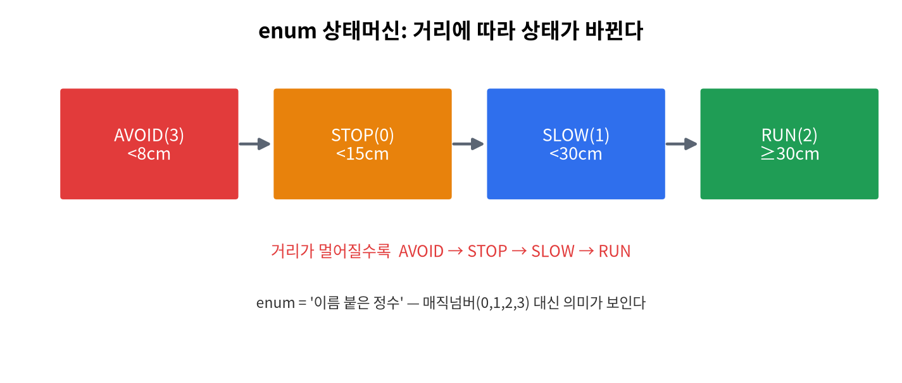
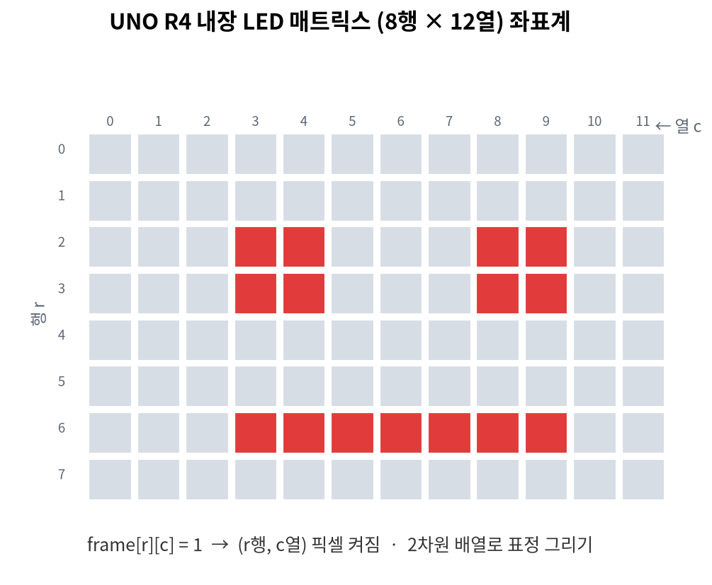

# 5주차 · 조건문 (if / switch) + LED 표정
> C언어 · 미래모빌리티학과 | CLO1·CLO3 | 교재 Ch06






## 학습 목표
- `if/else if/else`, 중첩 조건, `switch-case`, 삼항 연산자를 사용한다.
- 거리에 따른 정지/감속/주행 판단을 구현하고, **LED 매트릭스 표정**으로 표시한다.

---

## 강의 해설

5주차는 프로그램이 스스로 선택하게 만드는 주차다. 앞에서 배운 출력, 입력, 변수, 연산자는 모두 값을 만들고 보여 주는 도구였다. 조건문을 배우면 그 값에 따라 프로그램의 길이 갈라진다. 예를 들어 거리 센서값이 10cm이면 정지, 20cm이면 감속, 40cm이면 주행처럼 같은 코드라도 상황에 따라 다른 행동을 하게 된다.

학생들이 조건문에서 자주 틀리는 지점은 경계값이다. `cm < 15`, `cm <= 15`, `cm < 30`의 차이는 실제 로봇에서는 정지거리 차이가 된다. 그래서 조건문은 단순히 문법을 맞히는 문제가 아니라 "안전 기준을 어디에 둘 것인가"를 코드로 표현하는 일이다. 수업에서는 14.9, 15.0, 29.9, 30.0 같은 값을 직접 넣어 보며 경계가 어떻게 동작하는지 확인한다.

`switch`는 명령 문자가 여러 개로 갈라질 때 유용하다. 시리얼 모니터에서 `h`, `a`, `o`, `n`을 입력해 표정을 바꾸는 구조는 이후 ROS2에서 토픽 메시지에 따라 콜백 동작을 바꾸는 구조와 닮아 있다. 이번 주의 LED 표정 실습은 조건문이 화면 출력에서 끝나지 않고 하드웨어 상태 표시로 이어진다는 점을 보여 주는 첫 번째 실감형 실습이다.

## 3시간 강의 운영 포인트

- **0~25분**: 조건문을 "프로그램의 의사결정"으로 소개하고, 거리값에 따른 정지/감속/주행 기준을 학생들과 함께 정한다.
- **25~80분**: `if`, `else if`, `else`, 중첩 조건을 경계값 테스트와 함께 설명한다. 14.9, 15.0, 30.0 같은 값을 넣어 결과를 예측하게 한다.
- **80~135분**: `switch`와 명령 문자 구조를 실습한다. `break` 누락 사례를 일부러 보여 주면 흐름 제어의 필요성이 분명해진다.
- **135~180분**: Arduino LED 표정 실습으로 마무리한다. 조건문이 콘솔 출력뿐 아니라 하드웨어 상태 표시로 이어진다는 경험을 남긴다.

## 1. 이론

### 1.1 if 문
```c
if (조건) { /* 참일 때 */ }
else if (다른조건) { /* ... */ }
else { /* 모두 거짓일 때 */ }
```
조건은 **0이면 거짓, 0이 아니면 참**. 관계·논리 연산자와 함께 쓴다.

### 1.2 거리 → 상태 판단 (모빌리티)
```c
const char* decide_state(double cm) {
    if (cm < 15.0)      return "STOP";
    else if (cm < 30.0) return "SLOW";
    else                return "RUN";
}
```
!!! tip "경계값 주의"
    `< 15` 와 `<= 15`는 다르다. 15.0이 STOP인지 SLOW인지 **경계 조건**을 분명히 하라.

### 1.3 switch 문
정수/문자 값이 **여러 경우**로 갈릴 때 깔끔하다.
```c
switch (cmd) {
    case 'h': faceHappy();  break;   // break 없으면 다음 case로 흘러감(fall-through)
    case 'a': faceAngry();  break;
    default:  faceNeutral();         // 어느 것도 아닐 때
}
```

### 1.4 삼항 연산자
```c
int speed = (dist < 15) ? 0 : 25;   // 조건 ? 참값 : 거짓값
```

### 1.5 LED 매트릭스 = 2차원 배열의 시각화
UNO R4의 12×8 LED는 `frame[8][12]` 배열. 1이면 켜짐 → 조건에 따라 다른 표정을 그린다(위 그림 참조).

---

## 2. 핵심 용어 정리
| 용어 | 설명 |
|------|------|
| 조건식 | 참/거짓을 만드는 식(0=거짓) |
| 분기(branch) | 조건에 따라 다른 코드 실행 |
| fall-through | switch에서 `break` 누락 시 다음 case로 흐름 |
| `default` | switch의 "그 외 모든 경우" |
| 삼항 연산자 | `조건 ? A : B` |

---

## 3. 실습

### 실습 5-1 · 거리 판단 (예제 `ex03_obstacle.c`)
거리 배열을 받아 각 값에 대해 STOP/SLOW/RUN 출력.
> 한 단계 더: `enum` 으로 상태에 이름을 붙인 상태머신 버전 `ex11_state_enum.c`
> (STOP/SLOW/RUN/AVOID). 매직 넘버 대신 이름을 쓰면 코드가 읽기 쉬워진다.

### 실습 5-2 · 학점 변환(switch)
`score/10`으로 A/B/C/F 분기. 100점(=10) 처리 주의(연습 3-1).

### 실습 5-3 · 아두이노 LED 표정
```cpp
// 거리(가상)에 따라 다른 표정 출력 (code/arduino/05_showface)
if (dist < 15) showFace('o');       // 놀람
else if (dist < 30) showFace('a');  // 화남
else showFace('h');                 // 웃음
```

### 실습 5-4 · 직접 따라하기: 조건문이 하드웨어 상태가 되는 과정

예제: [`code/arduino/05_showface/05_showface.ino`](code/arduino/05_showface/05_showface.ino)

1. Arduino IDE에서 스케치를 연다.
2. 보드를 `Arduino UNO R4 WiFi`로 선택한다.
3. 업로드 후 시리얼 모니터를 `115200`으로 연다.
4. `distance_cm=42.0`, `24.0`, `8.0`이 반복 출력되는지 본다.
5. LED Matrix 표정이 `RUN → SLOW → STOP` 순서로 바뀌는지 확인한다.

| 거리 조건 | 상태 | LED 표정 | C 문법 |
|-----------|------|----------|--------|
| `distance_cm >= 30` | RUN | 웃음 | `else` |
| `15 <= distance_cm < 30` | SLOW | 경고 | `else if` |
| `distance_cm < 15` | STOP | 놀람 | 첫 번째 `if` |

!!! tip "이 실습의 진짜 목표"
    `if`문은 시험 문제에만 나오는 문법이 아니다. 실제 시스템에서는 센서값을 상태로 바꾸고, 그 상태가 LED·모터·로봇 명령으로 이어진다.

!!! warning "자주 하는 실수"
    `distance_cm < 15`와 `distance_cm <= 15`는 다르다. 경계값을 바꾸면 15.0cm에서 어떤 상태가 되는지도 바뀐다.

---

## 4. 과제
- 학점 변환 switch, 아두이노 거리별 LED 표정.
- 도전: `05_showface.ino`에 `REVERSE` 상태를 추가하고, 10cm 미만이면 `STOP`, 10~15cm이면 `REVERSE`가 되게 바꿔 보라.

## 5. 참조
- 교재 Ch06 · 자료 [`code/arduino/05_showface`](code/arduino.md) · 그림 `img/07_led_matrix_coord.png`

## 형성평가 체크포인트
- [ ] if/switch 선택 기준 · [ ] 경계값 처리 · [ ] LED 표정 출력 · [ ] fall-through 이해

---

## 연습문제
1. `decide_state(20.0)` 의 반환값은? (STOP<15, SLOW<30, RUN)
2. `switch`에서 `case` 끝에 `break`를 빠뜨리면 어떤 일이 일어나는가?
3. `int s = (dist < 15) ? 0 : 25;` 에서 `dist=10`이면 `s`는?

??? success "정답 및 해설"
    1. `"SLOW"` — 15 ≤ 20 < 30.
    2. **fall-through** — 다음 `case`의 코드까지 이어서 실행된다.
    3. `0` — 조건이 참이므로 `?` 다음 값.

    **🖼 그림으로 복습** — 조건→상태 전이를 enum 상태머신으로

    
