# 5주차 · 조건문 (if / switch) + LED 표정
> C언어 · 미래모빌리티학과 | CLO1·CLO3 | 교재 Ch06 | 원본 PDF: `6-1. 조건문`, `6-2. 조건문 - 실습`, `6-3. 아두이노 - MatrixLED`

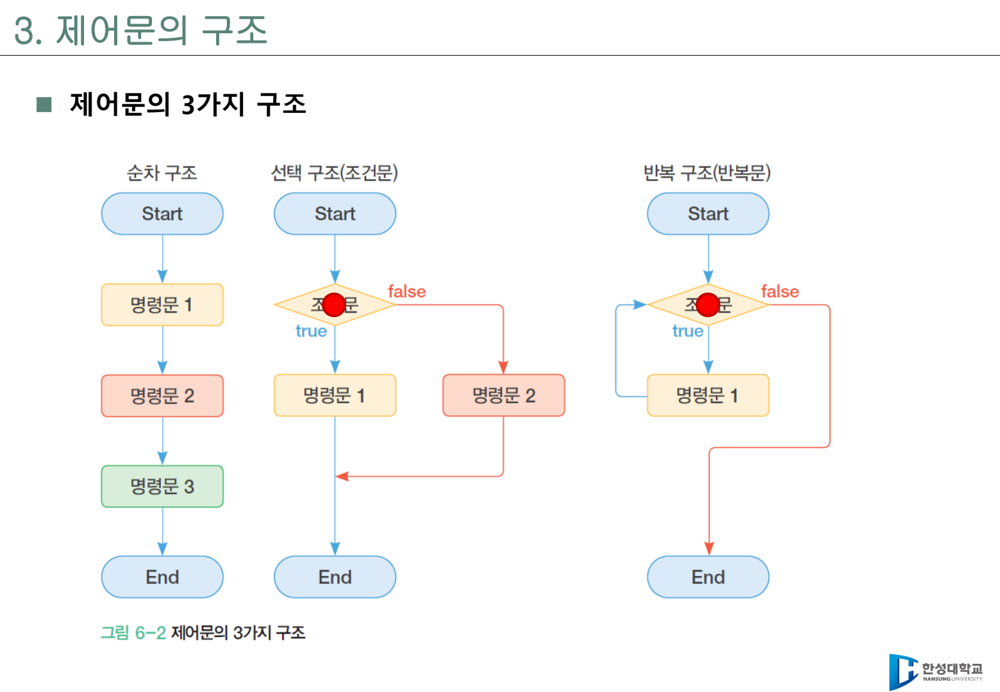

## 학습 목표

- 제어문(control statement)이 왜 필요한지 순차, 선택, 반복 구조로 설명할 수 있다.
- 단순 `if`, `if-else`, 다중 `if-else`, 중첩 `if-else`를 구분해서 작성할 수 있다.
- 조건식에서 0은 거짓, 0이 아닌 값은 참으로 평가된다는 C 언어 규칙을 설명할 수 있다.
- `switch-case-default` 구조와 `break`의 역할을 설명할 수 있다.
- 점수, 문자, 월, 명령 문자처럼 실제 입력값을 조건문으로 분류할 수 있다.
- Arduino UNO R4 WiFi의 LED Matrix에 8x12 배열을 출력하고, 조건문으로 표정을 바꿀 수 있다.
- 시리얼 입력 문자와 `switch`문을 연결해 LED Matrix 표정 명령 처리기를 만들 수 있다.

---

## 이번 주차의 큰 그림

1주차부터 4주차까지는 값을 출력하고, 입력받고, 저장하고, 계산하는 방법을 배웠다. 5주차부터는 프로그램이 스스로 "선택"하게 만든다. 같은 프로그램이라도 입력값이 다르면 다른 문장이 실행되고, 다른 상태가 출력되며, 다른 하드웨어 동작으로 이어진다.

예를 들어 모빌리티 시스템에서 거리값이 들어왔다고 하자. 단순히 `distance_cm = 24.0`이라고 저장하는 것만으로는 의미가 부족하다. 이 값이 안전한지, 감속해야 하는지, 즉시 멈춰야 하는지를 판단해야 한다. 이 판단을 코드로 표현하는 문법이 조건문이다.

```c
if (distance_cm < 15.0) {
    printf("STOP\n");
} else if (distance_cm < 30.0) {
    printf("SLOW\n");
} else {
    printf("RUN\n");
}
```

조건문은 콘솔 출력에서 끝나지 않는다. 같은 판단 결과를 Arduino R4의 LED Matrix 표정으로 보여 줄 수도 있다. 이번 주차의 수업 흐름은 다음처럼 이어진다.

```text
입력값 또는 센서값
-> 조건식으로 판단
-> 상태 이름으로 분류
-> 콘솔 출력 또는 LED Matrix 표정으로 표현
-> 이후 ROS2 토픽/로봇 상태 메시지로 확장
```

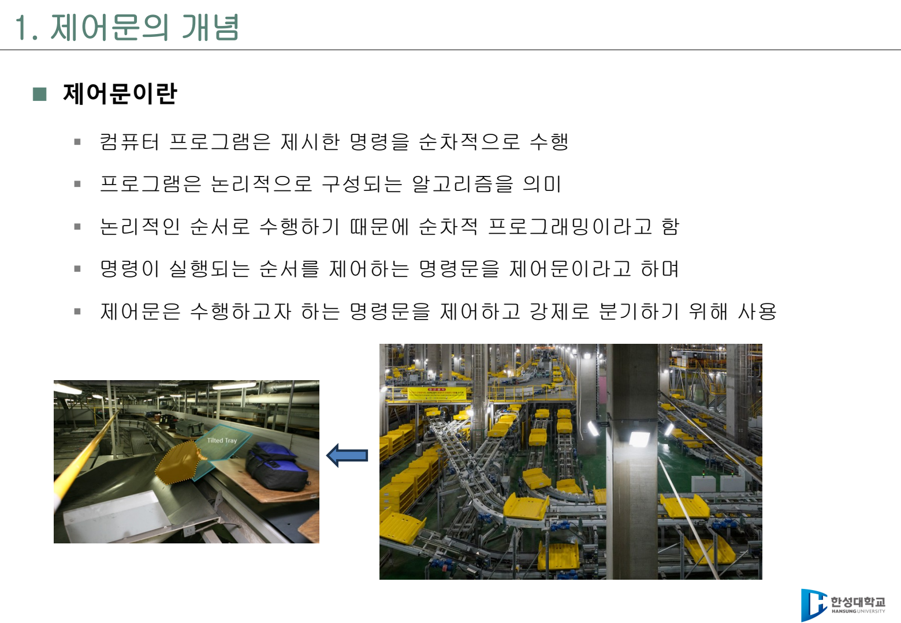

!!! tip "교수자 설명 포인트"
    조건문은 문법 암기보다 "기준을 코드로 표현하는 연습"이 중요하다. `score >= 90`, `distance_cm < 15`, `cmd == 'h'`처럼 기준 하나가 프로그램의 행동을 바꾼다. 특히 로봇과 모빌리티 제어에서는 비교 연산자 하나가 실제 안전 동작과 연결될 수 있으므로 경계값을 함께 다룬다.

---

## 3시간 강의 운영안

| 시간 | 내용 | 교수자 진행 포인트 | 학생 활동 |
|---:|---|---|---|
| 0~10분 | 4주차 복습 | 관계 연산자와 논리 연산자가 조건식의 재료임을 연결 | `score >= 60`, `x % 2 == 0` 해석 |
| 10~25분 | 제어문의 개념 | 순차 구조, 선택 구조, 반복 구조를 흐름도로 설명 | 일상 의사결정을 조건문으로 말하기 |
| 25~45분 | 단순 `if` | 참이면 실행, 거짓이면 건너뛰는 구조를 강조 | 양수 판별 프로그램 작성 |
| 45~65분 | `if-else` | 둘 중 하나는 반드시 실행되는 구조 설명 | 홀수/짝수, 대문자/소문자 판별 |
| 65~90분 | 다중 `if-else` | 범위 조건, 조건 순서, 경계값 테스트 설명 | 학점 변환 프로그램 작성 |
| 90~105분 | 중첩 조건 | 조건 안의 조건이 필요한 경우와 과도한 중첩의 단점 설명 | 윤년/월별 일수 판단 |
| 105~130분 | `switch` | 값이 여러 경우로 나뉠 때 `case`, `default`, `break` 사용 | 계절 출력, 명령 문자 처리 |
| 130~150분 | 실습 점검 | 입력 오류, 음수 점수, 100점, 개행 문자 처리 확인 | 실습 코드 디버깅 |
| 150~170분 | Arduino R4 MatrixLED | 8x12 배열, `matrix.renderBitmap()`, 표정 함수 구조 설명 | 표정 출력 스케치 업로드 |
| 170~180분 | 도전 과제 안내 | 시리얼 명령을 `switch`로 처리해 표정 바꾸기 | `h`, `a`, `o`, `n`, `?` 명령 추가 |

---

## 이론-실습 연결표

| 이론 개념 | 바로 해볼 실습 | 확인 질문 |
|---|---|---|
| 조건문은 실행 경로를 선택한다 | 양수/음수, 홀짝, 점수 등급 코드를 작성한다 | 조건식이 참일 때와 거짓일 때 실행 줄을 따라갈 수 있는가? |
| 경계값은 반드시 테스트한다 | `0`, `59`, `60`, `89`, `90`, `100`을 넣어 본다 | 조건 순서가 바뀌면 결과가 달라지는가? |
| `switch`는 명령 분기에 적합하다 | 문자 명령으로 계절 또는 메뉴를 출력한다 | `break`가 없으면 왜 다음 `case`까지 실행되는가? |
| LED Matrix 표정 | 시리얼 문자에 따라 표정을 바꾸는 스케치를 실행한다 | 콘솔 상태 문자열과 LED 표정은 같은 판단에서 나왔는가? |

## 1. 제어문이 필요한 이유

프로그램은 기본적으로 위에서 아래로 한 문장씩 실행된다. 이것을 순차 구조라고 한다. 순차 구조만 있으면 항상 같은 순서로만 실행되므로, 입력값이나 상황에 따라 다른 행동을 만들 수 없다.

제어문은 실행 순서를 바꾸는 문장이다. C 언어에서 중요한 제어 구조는 다음 세 가지다.

| 구조 | 의미 | C 문법 예 |
|---|---|---|
| 순차 구조 | 위에서 아래로 차례대로 실행 | 일반 문장 |
| 선택 구조 | 조건에 따라 실행 경로 선택 | `if`, `if-else`, `switch` |
| 반복 구조 | 조건이 만족되는 동안 반복 | `for`, `while`, `do-while` |

이번 주차는 선택 구조를 집중적으로 다룬다. 반복 구조는 6주차에서 본격적으로 다룬다.

### 조건문을 자연어로 읽기

```c
if (temperature >= 80) {
    printf("HOT\n");
}
```

이 코드는 다음처럼 읽는다.

- "만약 온도가 80 이상이면"
- `"HOT"`을 출력한다.
- 온도가 80 미만이면 아무것도 하지 않는다.

처음에는 C 코드를 바로 해석하려고 하기보다, 조건식과 실행 문장을 자연어로 바꾸어 읽는 연습이 좋다. 자연어로 설명할 수 없는 조건문은 대부분 기준이 애매하거나 괄호가 부족한 코드다.

---

## 2. 조건식의 기본 규칙

C 언어에서 조건식은 참 또는 거짓으로 평가된다. 중요한 규칙은 다음과 같다.

- 값이 `0`이면 거짓(false)이다.
- 값이 `0`이 아니면 참(true)이다.
- 관계 연산자와 논리 연산자는 보통 `0` 또는 `1` 결과를 만든다.
- 조건식 안에서 `=`와 `==`를 혼동하면 프로그램 흐름이 완전히 바뀐다.

```c
int score = 88;

printf("%d\n", score >= 60);  // 1
printf("%d\n", score < 60);   // 0
```

!!! warning "자주 하는 실수"
    `if (score = 100)`은 비교가 아니라 대입이다. `score`에 100을 넣은 뒤, 100은 0이 아니므로 조건이 참이 된다. 비교하려면 반드시 `if (score == 100)`처럼 `==`를 사용한다.

---

## 3. 단순 if 문

단순 `if`문은 조건이 참이면 문장을 실행하고, 거짓이면 아무것도 실행하지 않는다. "필요할 때만 추가 행동을 한다"는 느낌으로 이해하면 좋다.

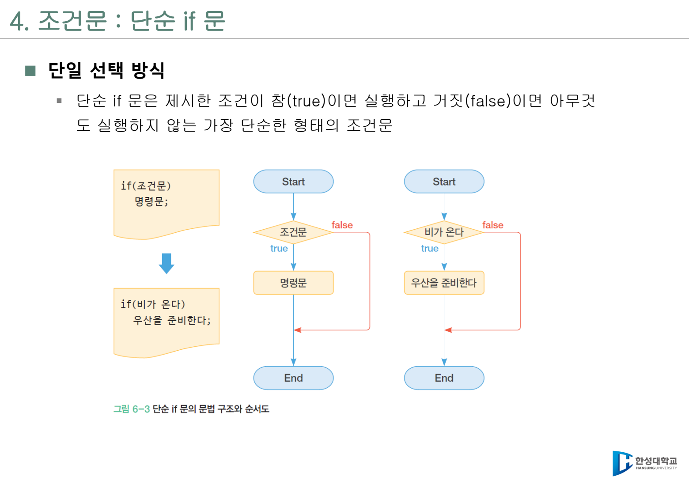

### 기본 형식

```c
if (조건식) {
    조건식이 참일 때 실행할 문장;
}
```

### 예제 1 - 양수 판별

```c
#include <stdio.h>

int main(void)
{
    int input_num;

    printf("정수 입력: ");
    scanf_s("%d", &input_num);

    if (input_num > 0) {
        printf("입력한 정수 %d는(은) 양의 정수입니다.\n", input_num);
    }

    printf("프로그램을 마칩니다.\n");
    return 0;
}
```

이 예제에서 `input_num`이 0 또는 음수이면 `if` 블록은 실행되지 않는다. 그러나 마지막 출력문은 조건문 밖에 있으므로 항상 실행된다. 이 차이를 학생들이 직접 표시하게 하면 블록 범위를 이해하는 데 도움이 된다.

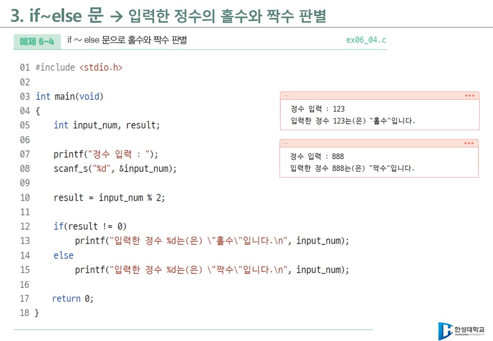

### 코드 블록을 반드시 쓰는 습관

C 문법상 `if` 다음에 문장이 하나만 있으면 중괄호를 생략할 수 있다. 그러나 수업에서는 처음부터 중괄호를 쓰는 습관을 권장한다.

```c
if (input_num > 0)
    printf("양수입니다.\n");
    printf("조건과 관계없이 실행됩니다.\n");  // 들여쓰기와 실제 실행 흐름이 다름
```

겉으로는 두 줄이 모두 `if`에 포함된 것처럼 보이지만, 실제로는 첫 번째 `printf`만 조건문의 영향을 받는다. 이런 실수를 막으려면 다음처럼 쓴다.

```c
if (input_num > 0) {
    printf("양수입니다.\n");
    printf("조건이 참일 때만 함께 실행됩니다.\n");
}
```

---

## 4. if-else 문

`if-else`문은 조건이 참일 때와 거짓일 때의 행동을 모두 정의한다. 두 갈래 중 하나는 반드시 실행된다.

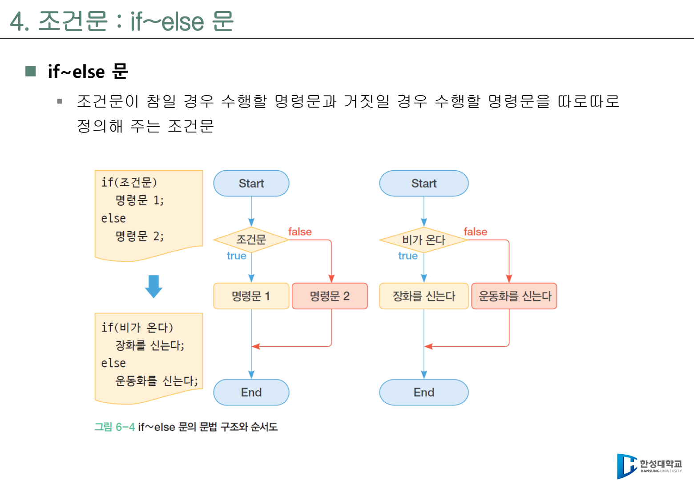

### 기본 형식

```c
if (조건식) {
    참일 때 실행할 문장;
} else {
    거짓일 때 실행할 문장;
}
```

### 예제 2 - 홀수와 짝수 판별

```c
#include <stdio.h>

int main(void)
{
    int input_num;
    int result;

    printf("정수 입력: ");
    scanf_s("%d", &input_num);

    result = input_num % 2;

    if (result != 0) {
        printf("입력한 정수 %d는(은) 홀수입니다.\n", input_num);
    } else {
        printf("입력한 정수 %d는(은) 짝수입니다.\n", input_num);
    }

    return 0;
}
```

여기서 핵심은 `%` 연산자다. 어떤 정수를 2로 나눈 나머지가 0이면 짝수이고, 0이 아니면 홀수다. 4주차 연산자와 5주차 조건문이 자연스럽게 연결되는 지점이다.

### 예제 3 - 대문자와 소문자 판별

```c
#include <stdio.h>

int main(void)
{
    char alphabet;

    printf("알파벳 입력: ");
    scanf_s(" %c", &alphabet, 1);

    if (alphabet >= 'A' && alphabet <= 'Z') {
        printf("입력한 알파벳 %c는(은) 대문자입니다.\n", alphabet);
    } else if (alphabet >= 'a' && alphabet <= 'z') {
        printf("입력한 알파벳 %c는(은) 소문자입니다.\n", alphabet);
    } else {
        printf("알파벳이 아닙니다.\n");
    }

    return 0;
}
```

`scanf_s(" %c", &alphabet, 1)`에서 `%c` 앞의 공백은 이전 입력의 개행 문자를 건너뛰기 위한 장치다. 문자 입력 실습에서 예상과 다른 문자가 들어오면 이 부분을 먼저 확인한다.

---

## 5. 다중 if-else 문

다중 `if-else`문은 조건이 여러 단계로 나뉠 때 사용한다. 중요한 점은 위에서부터 차례대로 검사하고, 처음으로 참이 된 블록만 실행한다는 것이다.

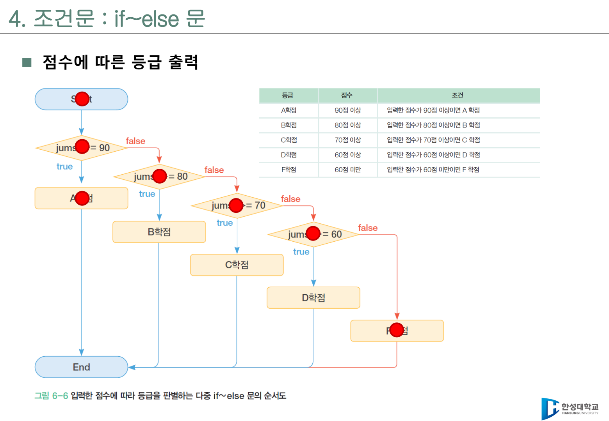

### 예제 4 - 학점 변환

```c
#include <stdio.h>

int main(void)
{
    int jumsu;
    char grade;

    printf("점수 입력: ");
    scanf_s("%d", &jumsu);

    if (jumsu >= 90 && jumsu <= 100) {
        grade = 'A';
    } else if (jumsu >= 80 && jumsu < 90) {
        grade = 'B';
    } else if (jumsu >= 70 && jumsu < 80) {
        grade = 'C';
    } else if (jumsu >= 60 && jumsu < 70) {
        grade = 'D';
    } else if (jumsu >= 0 && jumsu < 60) {
        grade = 'F';
    } else {
        printf("점수 범위는 0~100이어야 합니다.\n");
        return 0;
    }

    printf("입력한 점수: %d\n", jumsu);
    printf("학점: %c\n", grade);
    return 0;
}
```

### 왜 음수 점수를 따로 처리해야 하는가

단순히 마지막을 `else grade = 'F';`로 쓰면 `-50`처럼 말이 안 되는 점수도 F학점으로 처리된다. 프로그램이 "실행은 된다"와 "논리적으로 맞다"는 다르다. 조건문 실습에서는 항상 입력 범위까지 같이 생각해야 한다.

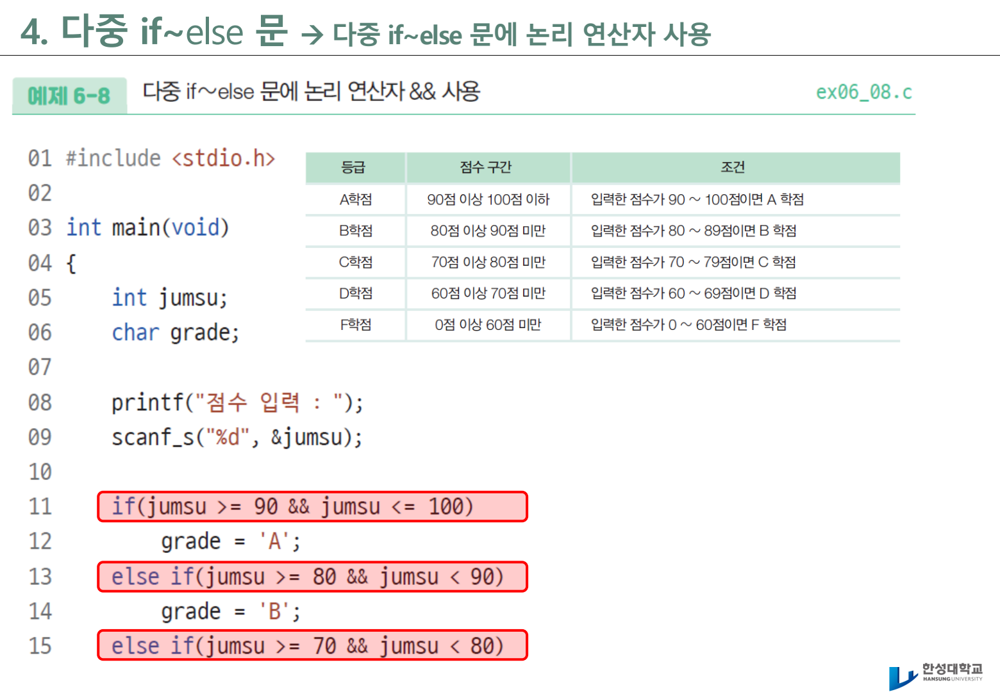

### 경계값 테스트 표

| 입력 점수 | 기대 학점 | 확인할 조건 |
|---:|---|---|
| 100 | A | 최댓값 포함 여부 |
| 90 | A | A와 B의 경계 |
| 89 | B | 바로 아래 값 |
| 60 | D | 통과 기준 |
| 59 | F | 낙제 기준 |
| 0 | F | 최솟값 포함 여부 |
| -1 | 오류 | 입력 범위 검사 |
| 101 | 오류 | 입력 범위 검사 |

!!! tip "학생에게 질문하기"
    `jumsu >= 90 && jumsu <= 100` 대신 `jumsu >= 90`만 쓰면 어떤 문제가 생길까? 이미 입력 범위를 먼저 검사했다면 조건식을 더 간단히 쓸 수 있는가?

---

## 6. 중첩 if-else 문

중첩 조건문은 `if`문 안에 또 다른 `if`문이 들어가는 구조다. 복잡한 판단을 단계별로 나누어 표현할 때 사용한다.

### 예제 5 - 윤년과 월별 일수

```c
#include <stdio.h>

int main(void)
{
    int year, month, day;

    printf("연도와 월 입력(예: 2026 2): ");
    scanf_s("%d %d", &year, &month);

    if (month < 1 || month > 12) {
        printf("월은 1~12 사이여야 합니다.\n");
        return 0;
    }

    switch (month) {
        case 2:
            if ((year % 4 == 0 && year % 100 != 0) || (year % 400 == 0)) {
                day = 29;
            } else {
                day = 28;
            }
            break;

        case 4:
        case 6:
        case 9:
        case 11:
            day = 30;
            break;

        default:
            day = 31;
            break;
    }

    printf("%d년 %d월은 %d일까지 있습니다.\n", year, month, day);
    return 0;
}
```

이 예제는 `switch`와 중첩 `if`가 함께 쓰인다. 월을 먼저 나누고, 2월인 경우에만 윤년 조건을 추가로 판단한다. 모든 조건을 한 줄에 억지로 넣기보다, 판단 순서를 코드 구조로 보여 주는 방식이다.

---

## 7. switch 문

`switch`문은 하나의 값이 여러 경우로 갈라질 때 사용한다. 점수 범위처럼 크고 작음을 비교하는 문제에는 `if-else`가 자연스럽고, 문자 명령이나 메뉴 번호처럼 값이 딱 정해져 있는 문제에는 `switch`가 읽기 쉽다.

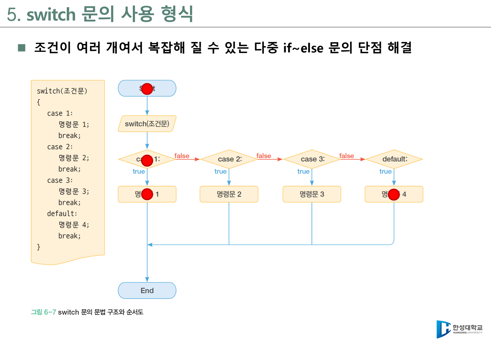

### 기본 형식

```c
switch (식) {
    case 값1:
        문장;
        break;

    case 값2:
        문장;
        break;

    default:
        문장;
        break;
}
```

### switch 사용 시 주의 사항

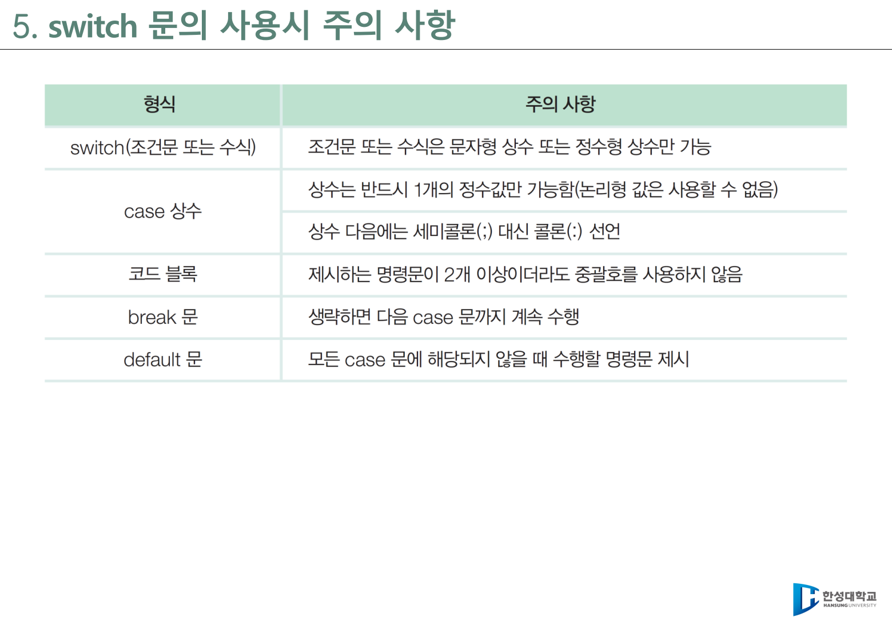

| 항목 | 설명 |
|---|---|
| `switch` 식 | 정수형 또는 문자형처럼 명확한 값이어야 한다. |
| `case` 값 | 변수나 범위식이 아니라 상수 값이어야 한다. |
| `break` | 현재 `case` 실행 후 `switch`문을 빠져나오게 한다. |
| fall-through | `break`가 없으면 다음 `case`로 이어서 실행된다. |
| `default` | 어떤 `case`에도 해당하지 않을 때 실행된다. |

!!! warning "`break`를 일부러 빼는 경우"
    여러 `case`가 같은 동작을 하도록 의도적으로 `break`를 생략할 수 있다. 예를 들어 3월, 4월, 5월을 모두 봄으로 처리할 때 `case 3: case 4: case 5:`처럼 묶는다. 이때는 반드시 주석으로 의도를 남긴다.

### 예제 6 - 계절 출력

```c
#include <stdio.h>

int main(void)
{
    char season;

    printf("A: 봄, S: 여름, D: 가을, F: 겨울\n");
    printf("계절 알파벳 입력: ");
    scanf_s(" %c", &season, 1);

    switch (season) {
        case 'A':
        case 'a':
            printf("선택한 계절: 봄\n");
            break;

        case 'S':
        case 's':
            printf("선택한 계절: 여름\n");
            break;

        case 'D':
        case 'd':
            printf("선택한 계절: 가을\n");
            break;

        case 'F':
        case 'f':
            printf("선택한 계절: 겨울\n");
            break;

        default:
            printf("A, S, D, F 중 하나를 입력하세요.\n");
            break;
    }

    return 0;
}
```

---

## 8. 실습 확장 - switch로 가위바위보 구조 읽기

원본 실습 자료에는 시리얼 통신 입력을 사용한 가위바위보 예제가 포함되어 있다. 이 예제는 지금 단계에서 완성 코드를 모두 외우는 것이 목표가 아니다. 조건문이 다음처럼 실제 프로그램 구조로 확장된다는 점을 보는 것이 중요하다.

- 입력 문자 `r`, `p`, `s`를 내부 선택값으로 변환한다.
- `switch`문으로 선택값 이름을 문자열로 바꾼다.
- `if`문으로 승, 무, 패를 판정한다.
- 시리얼 모니터에 결과를 출력한다.

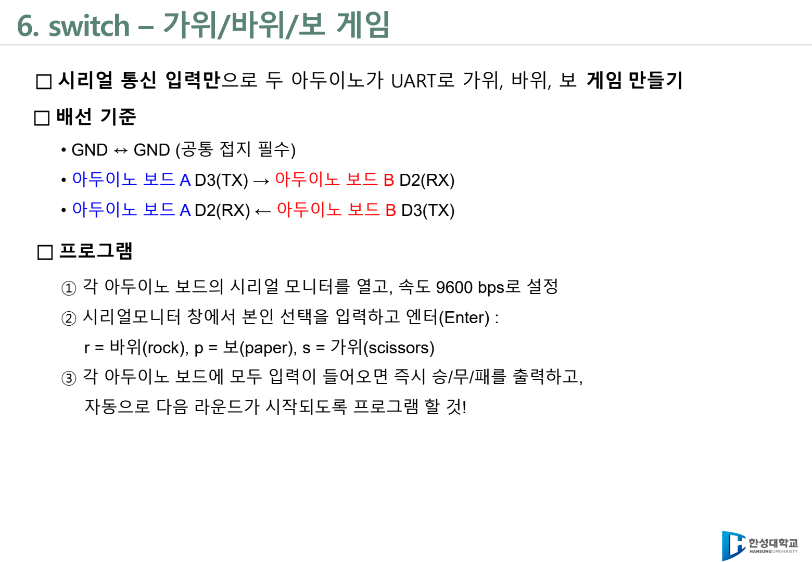

### 핵심 함수만 먼저 이해하기

```cpp
enum Choice {
  ROCK = 0,
  PAPER = 1,
  SCISSOR = 2,
  INVALID = 3
};

Choice charToChoice(char c) {
  if (c == 'r' || c == 'R') return ROCK;
  if (c == 'p' || c == 'P') return PAPER;
  if (c == 's' || c == 'S') return SCISSOR;
  return INVALID;
}

const char* nameOf(Choice c) {
  switch (c) {
    case ROCK: return "rock";
    case PAPER: return "paper";
    case SCISSOR: return "scissor";
    default: return "?";
  }
}

int judge(Choice me, Choice cpu) {
  if (me == cpu) return 0;

  if ((me == ROCK && cpu == SCISSOR) ||
      (me == PAPER && cpu == ROCK) ||
      (me == SCISSOR && cpu == PAPER)) {
    return 1;
  }

  return -1;
}
```

이 구조는 ROS2 노드에서도 자주 등장한다. 토픽으로 들어온 문자열 명령을 내부 상태로 바꾸고, `switch` 또는 `if`로 동작을 결정하는 방식이다. 이번 주에는 C 문법으로 이해하고, 후반 주차에서 로봇 메시지 처리와 연결한다.

---

## 9. Arduino UNO R4 WiFi LED Matrix 준비

Arduino UNO R4 WiFi에는 12x8 LED Matrix가 내장되어 있다. 조건문 실습 결과를 콘솔에만 출력하지 않고, LED 표정으로 표현하면 "값 판단 -> 상태 출력 -> 하드웨어 반응" 흐름이 훨씬 분명해진다.

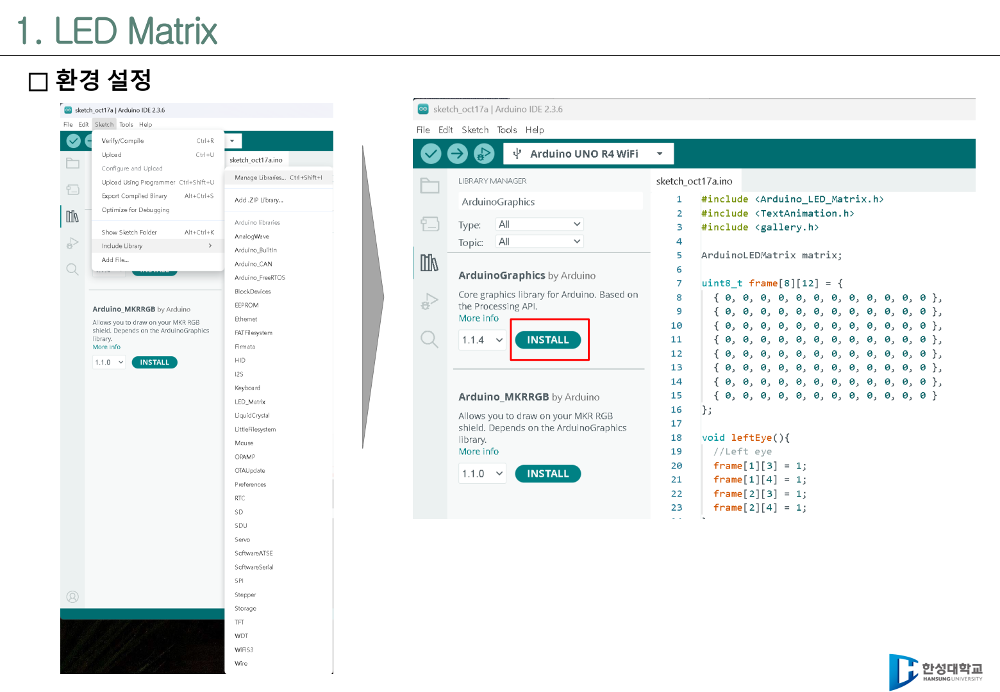

### 실습 준비 체크리스트

- Arduino IDE를 실행한다.
- 보드를 `Arduino UNO R4 WiFi`로 선택한다.
- `Arduino_LED_Matrix` 라이브러리를 사용할 수 있는지 확인한다.
- USB 포트를 선택한다.
- 업로드 후 Serial Monitor를 `115200` 또는 실습 코드의 보드레이트에 맞춘다.

!!! warning "하드웨어 실습 전 확인"
    보드가 연결되지 않았거나 포트가 다르면 코드가 맞아도 업로드가 실패한다. 컴파일 오류인지, 업로드 오류인지, 보드 선택 오류인지 메시지를 구분해 읽게 한다.

---

## 10. LED Matrix는 8x12 배열이다

LED Matrix는 작은 LED가 행(row)과 열(column)로 놓인 화면이다. 이번 실습에서는 8행 12열 배열을 만들고, `1`인 위치의 LED를 켠다.

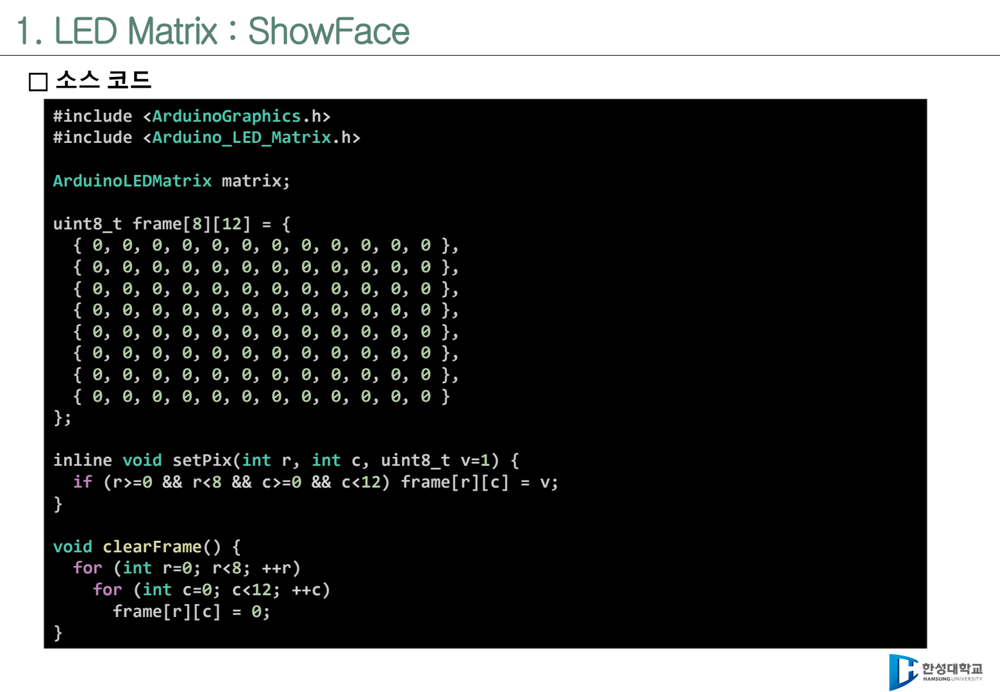

```cpp
#include <Arduino_LED_Matrix.h>

ArduinoLEDMatrix matrix;
uint8_t frame[8][12];

void clearFrame() {
  for (int r = 0; r < 8; ++r) {
    for (int c = 0; c < 12; ++c) {
      frame[r][c] = 0;
    }
  }
}

void setPixel(int r, int c) {
  if (r >= 0 && r < 8 && c >= 0 && c < 12) {
    frame[r][c] = 1;
  }
}

void render() {
  matrix.renderBitmap(frame, 8, 12);
}
```

`setPixel()` 안의 조건문은 안전장치다. 행은 0~7, 열은 0~11까지만 유효하다. 범위를 벗어난 좌표를 배열에 넣으면 예상하지 못한 메모리 접근이 발생할 수 있다. 따라서 하드웨어 실습에서도 조건문은 안전을 위한 코드가 된다.

---

## 11. 표정을 함수로 분리하기

표정 하나를 그릴 때마다 모든 좌표를 `loop()` 안에 직접 쓰면 코드가 금방 복잡해진다. 눈, 입, 표정을 함수로 분리하면 조건문에서는 "어떤 표정을 보여 줄지"만 결정하면 된다.

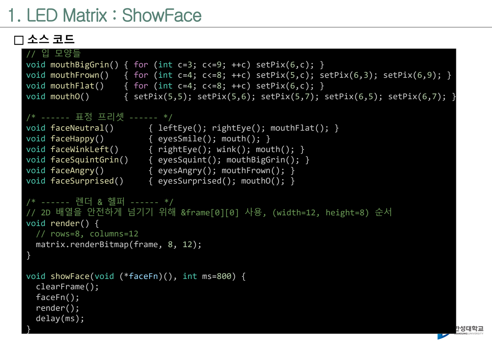

```cpp
void eyesNormal() {
  setPixel(2, 3);
  setPixel(2, 4);
  setPixel(2, 8);
  setPixel(2, 9);
}

void mouthSmile() {
  for (int c = 3; c <= 9; ++c) {
    setPixel(6, c);
  }
  setPixel(5, 2);
  setPixel(5, 10);
}

void mouthFlat() {
  for (int c = 4; c <= 8; ++c) {
    setPixel(6, c);
  }
}

void mouthO() {
  setPixel(5, 5);
  setPixel(5, 6);
  setPixel(5, 7);
  setPixel(6, 5);
  setPixel(6, 7);
}

void faceHappy() {
  eyesNormal();
  mouthSmile();
}

void faceAngry() {
  setPixel(1, 2);
  setPixel(1, 3);
  setPixel(2, 4);
  setPixel(1, 10);
  setPixel(1, 9);
  setPixel(2, 8);
  mouthFlat();
}

void faceSurprised() {
  eyesNormal();
  mouthO();
}

void showFace(void (*drawFace)()) {
  clearFrame();
  drawFace();
  render();
}
```

`showFace(void (*drawFace)())`는 함수 포인터를 사용한다. 지금은 깊게 설명하지 않아도 된다. "표정을 그리는 함수를 매개변수로 받아 실행한다" 정도로만 이해하고, 포인터 단원에서 다시 연결한다.

---

## 12. 조건문으로 거리 상태를 LED 표정으로 바꾸기

예제 파일: [`code/arduino/05_showface/05_showface.ino`](code/arduino/05_showface/05_showface.ino)

```cpp
void loop() {
  const float distances[] = {42.0, 24.0, 8.0};

  for (int i = 0; i < 3; ++i) {
    float distance_cm = distances[i];

    Serial.print("distance_cm=");
    Serial.println(distance_cm);

    if (distance_cm < 15.0) {
      Serial.println("state=STOP");
      showFace(faceSurprised);
    } else if (distance_cm < 30.0) {
      Serial.println("state=SLOW");
      showFace(faceAngry);
    } else {
      Serial.println("state=RUN");
      showFace(faceHappy);
    }

    delay(1500);
  }
}
```

| 거리 조건 | 상태 | LED 표정 | 조건문 구조 |
|---|---|---|---|
| `distance_cm < 15.0` | STOP | 놀란 표정 | 첫 번째 `if` |
| `distance_cm < 30.0` | SLOW | 경고/화난 표정 | `else if` |
| 그 외 | RUN | 웃는 표정 | `else` |

### 수업 진행 방법

1. 먼저 `Serial.println()` 결과만 보게 한다.
2. 같은 조건문이 LED Matrix 표정으로 이어지는 것을 확인한다.
3. `15.0`, `30.0` 경계값을 바꾸면 표정이 어떻게 달라지는지 실험한다.
4. `STOP`, `SLOW`, `RUN` 외에 `REVERSE` 상태를 추가하게 한다.

---

## 13. 시리얼 명령과 switch 연결

원본 MatrixLED 자료의 도전 문제는 시리얼 모니터에서 한 글자를 입력하고, 그 글자에 맞는 표정을 출력하는 구조다. 이때 `switch`문이 아주 자연스럽게 쓰인다.

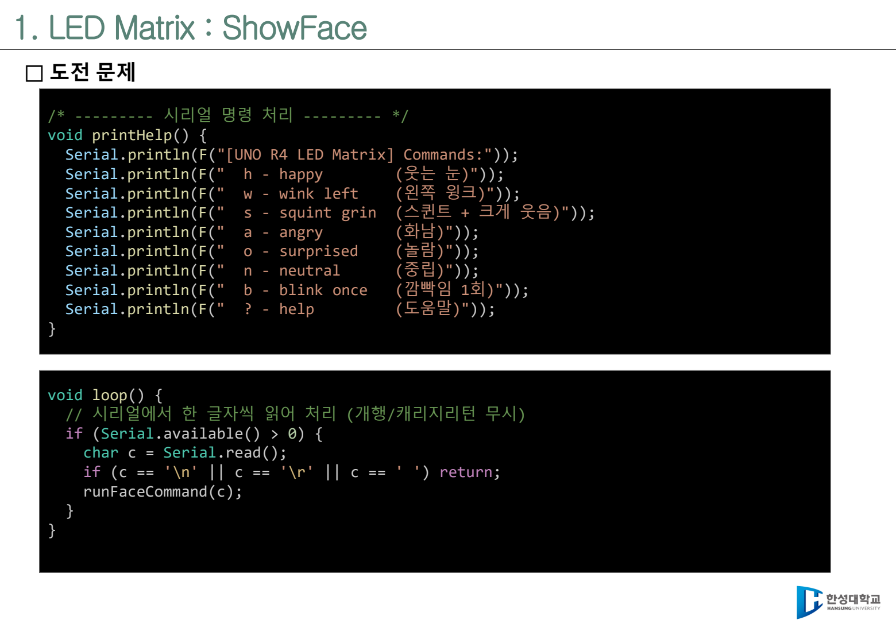

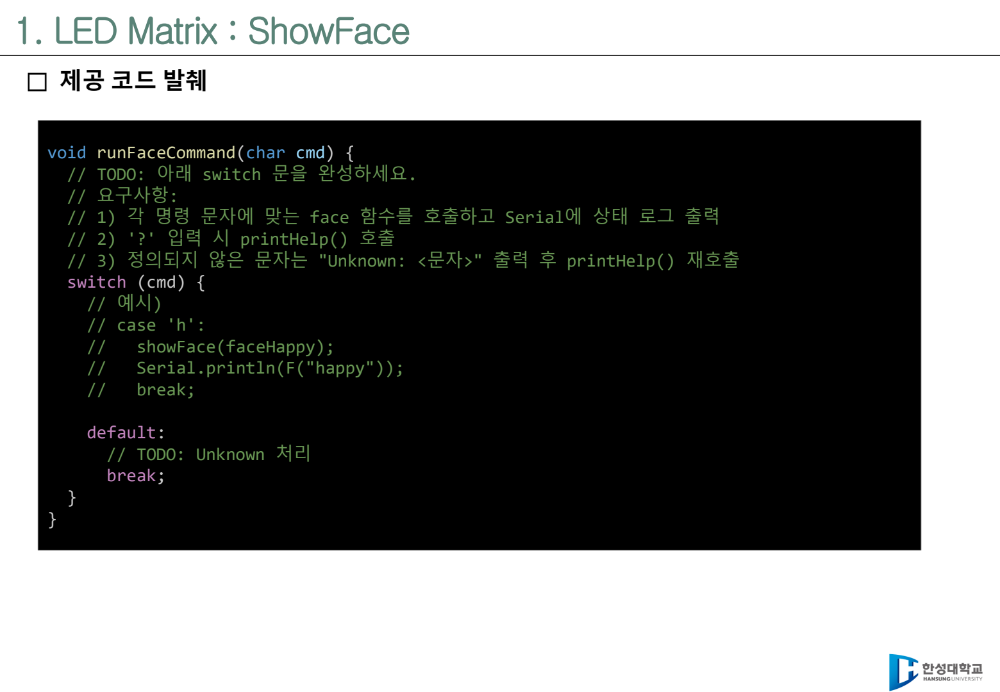

### 완성 예시

```cpp
void printHelp() {
  Serial.println("[UNO R4 LED Matrix] Commands:");
  Serial.println(" h - happy");
  Serial.println(" a - angry");
  Serial.println(" o - surprised");
  Serial.println(" n - neutral");
  Serial.println(" ? - help");
}

void runFaceCommand(char cmd) {
  switch (cmd) {
    case 'h':
    case 'H':
      showFace(faceHappy);
      Serial.println("happy");
      break;

    case 'a':
    case 'A':
      showFace(faceAngry);
      Serial.println("angry");
      break;

    case 'o':
    case 'O':
      showFace(faceSurprised);
      Serial.println("surprised");
      break;

    case '?':
      printHelp();
      break;

    default:
      Serial.print("Unknown: ");
      Serial.println(cmd);
      printHelp();
      break;
  }
}

void loop() {
  if (Serial.available() > 0) {
    char c = Serial.read();

    if (c == '\n' || c == '\r' || c == ' ') {
      return;
    }

    runFaceCommand(c);
  }
}
```

### 학생에게 강조할 점

- `Serial.read()`는 한 글자를 읽는다.
- 시리얼 모니터에서 Enter를 누르면 `\n` 또는 `\r`도 들어올 수 있다.
- 명령 문자가 정해져 있을 때는 `switch`문이 읽기 쉽다.
- 알 수 없는 명령은 `default`에서 안내해야 한다.

---

## 14. ROS2로 이어지는 생각

이번 주차에서 만든 구조는 ROS2에서도 거의 같은 형태로 나타난다. 아직 ROS2 코드를 작성하지 않아도, 구조를 미리 익혀 두면 15주차의 C-ROS2 연결이 훨씬 쉬워진다.

| 5주차 실습 | ROS2에서의 대응 |
|---|---|
| `Serial.read()`로 문자 입력 | 토픽 메시지 수신 |
| `cmd == 'h'` 조건 판단 | 메시지 값 또는 상태 필드 판단 |
| `switch (cmd)` | 명령 종류별 콜백 처리 |
| `showFace(faceHappy)` | 로봇 상태 LED, 모터 명령, 로그 출력 |
| `default`에서 오류 안내 | 알 수 없는 명령 메시지 처리 |

예를 들어 ROS2에서 `"stop"`, `"slow"`, `"run"` 같은 문자열 명령을 받으면 내부적으로 상태를 바꾸고, 그 상태에 따라 LED나 모터 명령을 선택할 수 있다. C 조건문은 단순 문법이 아니라 로봇 상태 전이의 기초다.

---

## 15. 실습 과제

### 실습 5-1 - 양수 판별

입력한 정수가 양수이면 "양의 정수입니다"를 출력한다. 0 또는 음수일 때는 마지막 종료 메시지만 출력되도록 한다.

확인 질문:

- `if` 블록 안에 있는 문장과 밖에 있는 문장은 실행 조건이 어떻게 다른가?
- 중괄호를 제거하면 어떤 실수가 생길 수 있는가?

### 실습 5-2 - 홀수와 짝수 판별

입력한 정수를 2로 나눈 나머지를 이용해 홀수와 짝수를 판별한다.

확인 질문:

- `input_num % 2`의 결과가 0인 경우는 무엇인가?
- 음수를 입력하면 프로그램은 어떤 결과를 내는가?

### 실습 5-3 - 학점 변환

점수를 입력받아 A, B, C, D, F 학점을 출력한다. 0~100 범위를 벗어나면 오류 메시지를 출력한다.

필수 테스트:

```text
100, 90, 89, 80, 79, 60, 59, 0, -1, 101
```

### 실습 5-4 - switch 계절 출력

문자 `A`, `S`, `D`, `F`를 입력받아 봄, 여름, 가을, 겨울을 출력한다. 소문자 입력도 처리한다.

### 실습 5-5 - Arduino R4 LED Matrix 표정

예제 [`05_showface.ino`](code/arduino/05_showface/05_showface.ino)를 업로드하고, 거리값에 따라 RUN, SLOW, STOP 상태가 표정으로 바뀌는지 확인한다.

### 실습 5-6 - 시리얼 명령 표정 전환

`runFaceCommand(char cmd)`를 완성해 시리얼 모니터에서 다음 명령을 처리한다.

| 명령 | 동작 |
|---|---|
| `h` 또는 `H` | 웃는 표정 |
| `a` 또는 `A` | 화난 표정 |
| `o` 또는 `O` | 놀란 표정 |
| `?` | 도움말 출력 |
| 그 외 | Unknown 메시지와 도움말 출력 |

---

## 16. 도전 문제

### 도전 1 - 경계값을 명확히 하라

거리 상태 기준을 다음처럼 바꾸어라.

| 거리 | 상태 |
|---:|---|
| 10cm 미만 | STOP |
| 10cm 이상 15cm 미만 | REVERSE |
| 15cm 이상 30cm 미만 | SLOW |
| 30cm 이상 | RUN |

질문:

- 10.0cm는 어느 상태인가?
- 15.0cm는 어느 상태인가?
- 30.0cm는 어느 상태인가?

### 도전 2 - 메뉴 프로그램 만들기

문자 메뉴를 입력받아 다음 기능을 수행하는 콘솔 프로그램을 작성한다.

| 입력 | 기능 |
|---|---|
| `p` | 양수/음수/0 판별 |
| `o` | 홀수/짝수 판별 |
| `g` | 점수 학점 변환 |
| `q` | 종료 안내 출력 |

이번 주차에서는 반복문을 쓰지 않아도 된다. 한 번 입력받고 한 번 처리하는 구조로 작성한다.

### 도전 3 - LED Matrix 명령 확장

`runFaceCommand()`에 다음 명령을 추가한다.

| 명령 | 동작 |
|---|---|
| `n` | 중립 표정 |
| `b` | 깜빡임 한 번 |
| `r` | 후진 또는 위험 표정 |

`default` 처리는 반드시 남겨 둔다. 알 수 없는 입력을 조용히 무시하는 프로그램은 디버깅이 어렵다.

---

## 17. 자주 막히는 지점

| 막히는 지점 | 설명 | 해결 방법 |
|---|---|---|
| `=`와 `==` 혼동 | 대입과 비교를 착각한다. | 조건식에서는 비교 연산자인지 확인한다. |
| 중괄호 생략 | 들여쓰기와 실제 실행 범위가 다를 수 있다. | 수업에서는 항상 `{}`를 쓴다. |
| 조건 순서 오류 | 큰 범위를 먼저 검사해 작은 범위가 실행되지 않는다. | 경계값 표를 만든 뒤 조건 순서를 정한다. |
| `break` 누락 | `switch`에서 다음 `case`까지 실행된다. | 각 `case` 끝에 `break`를 확인한다. |
| 문자 입력 오류 | 이전 입력의 개행 문자를 읽는다. | `%c` 앞에 공백을 넣거나 개행을 무시한다. |
| 보드 업로드 실패 | 포트/보드/라이브러리 설정 문제일 수 있다. | 오류 메시지를 컴파일/업로드/포트 문제로 구분한다. |

---

## 18. 형성평가 체크포인트

- [ ] `if`, `if-else`, 다중 `if-else`를 구분할 수 있다.
- [ ] 조건식에서 0과 0이 아닌 값의 의미를 설명할 수 있다.
- [ ] 점수 학점 변환에서 `-1`, `0`, `59`, `60`, `100`, `101`을 테스트할 수 있다.
- [ ] `switch`에서 `case`, `break`, `default`의 역할을 설명할 수 있다.
- [ ] `switch`가 범위 비교보다 값 분기에 적합하다는 점을 설명할 수 있다.
- [ ] Arduino R4 LED Matrix의 8x12 배열 좌표를 이해할 수 있다.
- [ ] 조건문 결과를 LED 표정으로 연결할 수 있다.
- [ ] 시리얼 입력의 개행 문자 문제를 설명할 수 있다.

---


## 📚 참고 레퍼런스 (외부)
- if/switch https://en.cppreference.com/w/c/language/switch
- Arduino LED 매트릭스 https://docs.arduino.cc/tutorials/uno-r4-wifi/led-matrix/
- 전체 정리: [참고 자료 모음](references.md)

## 연습문제

1. `int x = 0; if (x) printf("A"); else printf("B");`의 출력은 무엇인가?
2. `score = 90`일 때 `if (score >= 90) grade='A'; else if (score >= 80) grade='B';`의 결과는 무엇인가?
3. `switch`문에서 `break`를 빠뜨리면 어떤 일이 일어나는가?
4. 문자 `cmd`가 `'h'` 또는 `'H'`일 때 같은 동작을 하게 하려면 `case`를 어떻게 작성하는가?
5. `distance_cm < 15.0`과 `distance_cm <= 15.0`은 15.0cm에서 어떤 차이가 있는가?
6. LED Matrix에서 `frame[8][12]`의 유효한 행 번호와 열 번호 범위는 각각 무엇인가?

??? success "정답 및 해설"
    1. `B` - `x`가 0이므로 조건식은 거짓이다.
    2. `A` - 첫 번째 조건이 참이므로 뒤의 `else if`는 검사하지 않는다.
    3. fall-through가 발생해 다음 `case`의 문장까지 이어서 실행될 수 있다.
    4. `case 'h': case 'H':`처럼 연속으로 배치하고, 공통 실행 문장을 한 번만 작성한다.
    5. `< 15.0`에서는 15.0이 거짓이고, `<= 15.0`에서는 15.0이 참이다.
    6. 행은 0~7, 열은 0~11이다.

---

## 참조

- 교재 Ch06 조건문
- 원본 강의자료: `6-1. 조건문.pdf`, `6-2. 조건문 - 실습.pdf`, `6-3. 아두이노 - MatrixLED.pdf`
- Arduino 예제: [`code/arduino/05_showface/05_showface.ino`](code/arduino/05_showface/05_showface.ino)
- 배경 개념: [Arduino R4 실습 코드 모음](code/arduino.md)
