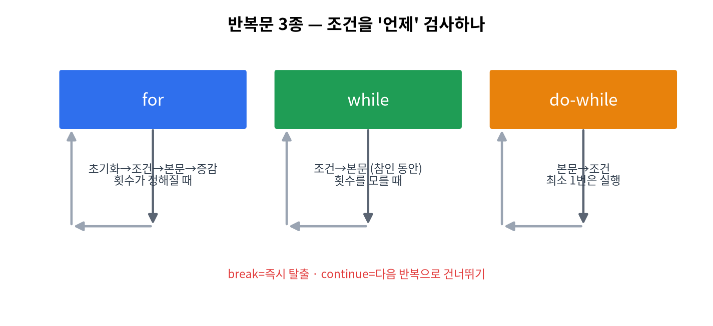

# 6주차 · 반복문 (for / while / do-while) + 애니메이션
> C언어 · 미래모빌리티학과 | CLO1·CLO3 | 교재 Ch07





## 학습 목표
- `for`, `while`, `do-while`, 중첩 반복, `break`/`continue`를 사용한다.
- 센서를 N회 샘플링해 합·평균·최대/최소를 구하고, LED 애니메이션을 만든다.

---

## 강의 해설

6주차의 반복문은 "같은 일을 여러 번 정확히 수행하는 방법"이다. 컴퓨터가 사람보다 잘하는 일은 빠르게 반복하고, 지치지 않고 같은 규칙을 적용하는 것이다. 센서값 10개를 읽어 평균을 내거나, LED Matrix의 96개 칸을 모두 지우거나, 로봇 제어 루프를 0.1초마다 반복하는 일은 모두 반복문으로 표현된다.

`for`, `while`, `do-while`은 서로 완전히 다른 문법이라기보다 반복을 바라보는 세 가지 습관이다. 횟수가 정해져 있으면 `for`, 조건이 만족되는 동안 계속해야 하면 `while`, 최소 한 번은 실행해야 하면 `do-while`이 자연스럽다. 학생은 문법 모양을 외우는 것보다 "언제 어떤 반복문이 읽기 좋은가"를 판단할 수 있어야 한다.

누적 패턴은 이후 배열, 센서처리, LiDAR 분석까지 계속 등장한다. `sum += data[i]`, `if (data[i] > max) max = data[i]`는 단순한 예제가 아니라 모든 데이터 처리의 기본 골격이다. LED 애니메이션 실습에서는 반복문이 숫자 계산뿐 아니라 시간에 따른 상태 변화, 즉 움직임을 만드는 도구라는 점을 확인한다.

## 1. 이론

### 1.1 세 가지 반복문
```c
for (int i = 0; i < 10; i++) { ... }   // 횟수가 정해질 때
while (조건) { ... }                    // 조건이 참인 동안
do { ... } while (조건);                // 최소 1번은 실행
```
| 구문 | 특징 |
|------|------|
| `for` | 초기화·조건·증감을 한 줄에 — 횟수 반복에 적합 |
| `while` | 조건 먼저 검사 |
| `do-while` | 본문 먼저 실행 후 조건 검사 |

### 1.2 break / continue
```c
for (int i = 0; i < n; i++) {
    if (data[i] < 0) continue;   // 이번 회차 건너뛰기
    if (data[i] > 100) break;    // 반복 즉시 종료
    sum += data[i];
}
```

### 1.3 누적·통계 패턴 (모빌리티: 센서 샘플링)
```c
double sum = 0, mx = data[0];
for (int i = 0; i < n; i++) {
    sum += data[i];
    if (data[i] > mx) mx = data[i];
}
double avg = sum / n;
```
!!! warning "무한 루프 주의"
    `while` 조건이 절대 거짓이 안 되면 멈추지 않는다. **증감/탈출 조건**을 꼭 확인.

### 1.4 중첩 반복 = 2차원 처리
LED 매트릭스(8×12) 전체를 훑을 때 `for` 안에 `for`.

---

## 2. 핵심 용어 정리
| 용어 | 설명 |
|------|------|
| 반복(iteration) | 같은 코드를 여러 번 실행 |
| 루프 변수 | 반복을 제어하는 변수(`i`) |
| `break`/`continue` | 반복 종료 / 이번 회차 건너뛰기 |
| 누적 변수 | 합·개수를 모으는 변수(`sum`) |
| 무한 루프 | 종료 조건이 없어 멈추지 않는 반복 |

---

## 3. 실습

### 실습 6-1 · 센서 통계
샘플 10개의 합·평균·최댓값·최솟값 구하기.

### 실습 6-2 · 3의 배수 합(연습 3-2)
```c
int sum = 0;
for (int n = 1; n <= 100; n++)
    if (n % 3 == 0) sum += n;   // 결과 1683
```

### 실습 6-3 · 아두이노 표정 애니메이션
`for`로 표정 시퀀스를 반복 출력(`code/arduino/06_showface`).

---

## 4. 과제
- 센서 통계, 표정 애니메이션. 연습 3-2.

## 5. 참조
- 교재 Ch07 · 자료 `code/arduino/06_showface`

## 형성평가 체크포인트
- [ ] for/while 변환 · [ ] break/continue 구분 · [ ] 누적 패턴 · [ ] 무한루프 회피

---

## 연습문제
1. `for (int i=0; i<5; i++)` 는 몇 번 반복하는가?
2. 1~10 중 짝수의 합은? (코드로 구해보기)
3. `break`와 `continue`의 차이를 한 줄로 설명하시오.

??? success "정답 및 해설"
    1. **5번** (i=0,1,2,3,4).
    2. `30` (2+4+6+8+10).
    3. `break`는 **반복을 즉시 종료**, `continue`는 **이번 회차만 건너뛰고** 다음 반복 진행.

    **🖼 그림으로 복습** — LED 매트릭스 8×12 좌표 (반복문으로 그린다)

    
