# 6주차 · 반복문 (for / while / do-while) + LED 애니메이션
> C언어 · 미래모빌리티학과 | CLO1·CLO3 | 교재 Ch07 | 원본 PDF: `7-1. 반복문`, `7-2. 반복문 실습`

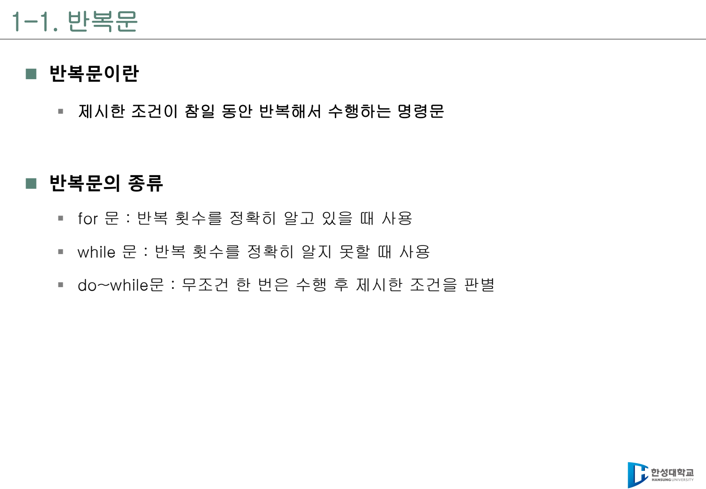

## 학습 목표

- 반복문이 필요한 이유를 순차 실행과 비교해 설명할 수 있다.
- `for`, `while`, `do-while`의 구조와 실행 순서를 구분할 수 있다.
- 반복 횟수가 정해진 문제와 종료 조건이 필요한 문제에 알맞은 반복문을 선택할 수 있다.
- 누적 합계, 개수 세기, 평균, 최댓값, 최솟값을 반복문으로 계산할 수 있다.
- 중첩 반복문으로 표, 별 모양, 2차원 LED Matrix 좌표를 처리할 수 있다.
- `break`, `continue`, `return`의 차이를 설명하고 안전하게 사용할 수 있다.
- Arduino UNO R4 WiFi의 LED Matrix에서 반복문으로 스캔 애니메이션과 막대 애니메이션을 만들 수 있다.

---

## 이번 주차의 큰 그림

조건문이 프로그램의 실행 경로를 "선택"하게 했다면, 반복문은 같은 규칙을 여러 번 실행하게 만든다. 사람은 같은 작업을 반복하면 지치고 실수하지만, 컴퓨터는 정해진 조건이 유지되는 동안 같은 코드를 빠르고 정확하게 반복한다.

반복문은 단순히 `printf()`를 여러 번 출력하는 문법이 아니다. 모빌리티와 로봇 시스템에서는 다음과 같은 구조가 모두 반복문으로 만들어진다.

- 센서값을 여러 번 읽어 평균을 낸다.
- 8x12 LED Matrix의 모든 칸을 차례대로 지운다.
- 주행 상태를 일정 주기로 확인한다.
- 통신 버퍼에서 문자를 하나씩 읽는다.
- 일정 조건이 만족될 때까지 안전 정지 절차를 반복한다.

```text
초기값 설정
-> 조건 검사
-> 반복할 문장 실행
-> 값 변화
-> 다시 조건 검사
```

반복문을 잘 쓰려면 네 가지 질문을 먼저 던져야 한다.

| 질문 | 의미 |
|---|---|
| 무엇을 반복하는가? | 반복할 문장 또는 코드 블록 |
| 언제 시작하는가? | 초기값 |
| 언제 멈추는가? | 조건식 |
| 반복할 때마다 무엇이 바뀌는가? | 증감식 또는 상태 변화 |

!!! tip "교수자 설명 포인트"
    반복문은 "코드를 짧게 쓰는 기술"이 아니라 "반복 규칙을 명확하게 표현하는 기술"이다. 반복 조건이 틀리면 프로그램은 너무 적게 실행되거나, 너무 많이 실행되거나, 아예 멈추지 않는다. 그래서 수업에서는 반복 횟수보다 변수 변화표를 함께 보는 것이 좋다.

---

## 3시간 강의 운영안

| 시간 | 내용 | 교수자 진행 포인트 | 학생 활동 |
|---:|---|---|---|
| 0~10분 | 5주차 복습 | 조건식이 반복문의 종료 조건으로도 쓰인다는 점 연결 | `i < 10`, `sum <= 100` 해석 |
| 10~25분 | 반복문의 개념 | 반복문은 조건이 참인 동안 코드 블록을 다시 실행하는 구조임을 설명 | 반복이 필요한 일상 작업 찾기 |
| 25~55분 | `for`문 | 초기값, 조건식, 증감값, 본문 실행 순서를 손으로 추적 | 1~10 출력, 합계 계산 |
| 55~80분 | `while`문 | 반복 횟수를 모를 때 종료 조건을 어떻게 설계하는지 설명 | 입력값이 0이 될 때까지 누적 |
| 80~100분 | `do-while`문 | 최소 한 번 실행되는 구조와 메뉴/입력 검증 예시 설명 | 점수 입력을 한 번 이상 받기 |
| 100~125분 | 누적 패턴 | 합계, 개수, 평균, 최댓값, 최솟값의 공통 구조 설명 | 센서 샘플 통계 계산 |
| 125~145분 | 중첩 반복문 | 행과 열, 바깥 반복과 안쪽 반복의 역할 구분 | 구구단, 별 모양, LED 좌표 |
| 145~160분 | 분기문 | `break`, `continue`, `return`의 탈출 범위 비교 | 2500 초과 합, 짝수만 건너뛰기 |
| 160~175분 | Arduino LED 애니메이션 | 8x12 Matrix를 반복문으로 스캔하고 막대그래프처럼 표시 | 예제 업로드와 속도 조절 |
| 175~180분 | 형성평가 | 반복문 선택 기준과 무한 루프 점검 | 체크포인트 풀이 |

---

## 1. 반복문이란 무엇인가

반복문(loop)은 제시한 조건이 참인 동안 같은 문장 또는 코드 블록을 반복해서 수행하는 제어문이다. 5주차에서 배운 조건문이 "실행할지 말지"를 한 번 판단한다면, 반복문은 그 판단을 반복한다.

### 반복문이 필요한 예

```c
printf("1\n");
printf("2\n");
printf("3\n");
printf("4\n");
printf("5\n");
```

위 코드는 1부터 5까지 출력할 수는 있지만, 1부터 100까지 출력해야 한다면 매우 불편하다. 반복문을 쓰면 규칙만 표현하면 된다.

```c
for (int i = 1; i <= 5; i++) {
    printf("%d\n", i);
}
```

이 코드는 다음처럼 읽는다.

- `i`를 1에서 시작한다.
- `i <= 5`인 동안 반복한다.
- 한 번 실행할 때마다 `i++`로 1씩 증가한다.
- 반복할 문장은 `printf("%d\n", i);`이다.

### 반복문 3종 비교

| 반복문 | 주로 쓰는 상황 | 핵심 질문 |
|---|---|---|
| `for` | 반복 횟수가 비교적 명확할 때 | 몇 번 반복할 것인가? |
| `while` | 조건이 언제 거짓이 될지 실행 중에 결정될 때 | 언제까지 반복할 것인가? |
| `do-while` | 본문을 최소 한 번 실행해야 할 때 | 먼저 실행하고 다시 할지 판단할 것인가? |

---

## 2. for 문

`for`문은 초기값, 조건식, 증감값이 한 줄에 모여 있어 반복 횟수를 파악하기 쉽다. 배열, 표, LED 좌표처럼 "몇 번째"를 다루는 문제에서 가장 자주 사용한다.

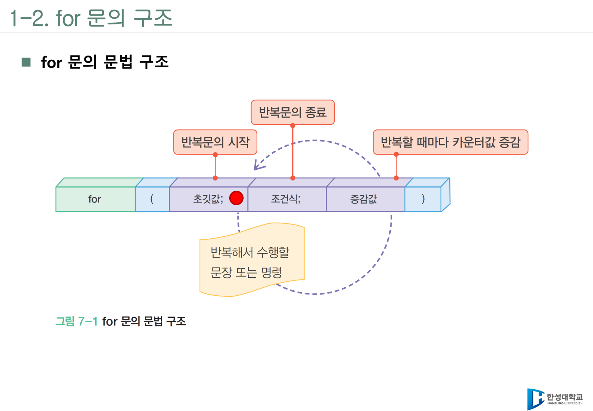

### 기본 형식

```c
for (초기값; 조건식; 증감값) {
    반복해서 수행할 문장;
}
```

실제 코드는 다음과 같이 작성한다.

```c
for (int count = 1; count <= 10; count++) {
    printf("%d 번째 반복입니다.\n", count);
}
```

### for 문의 실행 순서

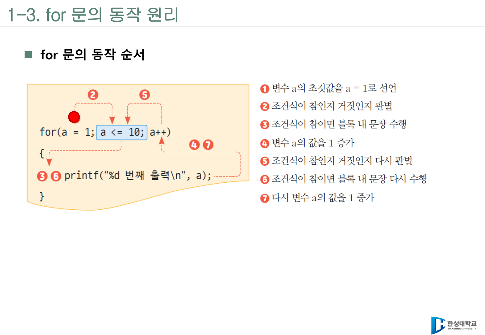

`for`문의 실행 순서는 다음과 같다.

1. 초기값을 한 번 실행한다.
2. 조건식을 검사한다.
3. 조건식이 참이면 본문을 실행한다.
4. 증감값을 실행한다.
5. 다시 조건식을 검사한다.
6. 조건식이 거짓이면 반복문을 빠져나간다.

### 변수 변화표로 추적하기

```c
for (int count = 1; count <= 5; count++) {
    printf("%d\n", count);
}
```

| 반복 회차 | 조건 검사 전 `count` | 조건식 `count <= 5` | 출력 | 증감 후 |
|---:|---:|---|---:|---:|
| 1 | 1 | 참 | 1 | 2 |
| 2 | 2 | 참 | 2 | 3 |
| 3 | 3 | 참 | 3 | 4 |
| 4 | 4 | 참 | 4 | 5 |
| 5 | 5 | 참 | 5 | 6 |
| 종료 검사 | 6 | 거짓 | 없음 | 종료 |

학생들이 자주 헷갈리는 부분은 "마지막에 `count`가 6이 되는데 왜 6은 출력되지 않는가"이다. 증감 후 다시 조건식을 검사하고, 조건이 거짓이면 본문을 실행하지 않기 때문이다.

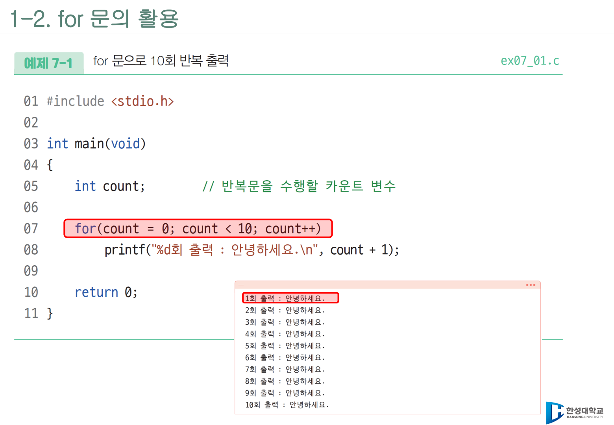

### 1부터 100까지 합계

```c
#include <stdio.h>

int main(void)
{
    int hap = 0;

    for (int count = 1; count <= 100; count++) {
        hap += count;
    }

    printf("1부터 100까지의 합: %d\n", hap);
    return 0;
}
```

누적 변수 `hap`은 반복문 밖에서 0으로 초기화해야 한다. 만약 반복문 안에서 `hap = 0;`을 실행하면 매 반복마다 이전 합계가 사라진다.

### 짝수의 합

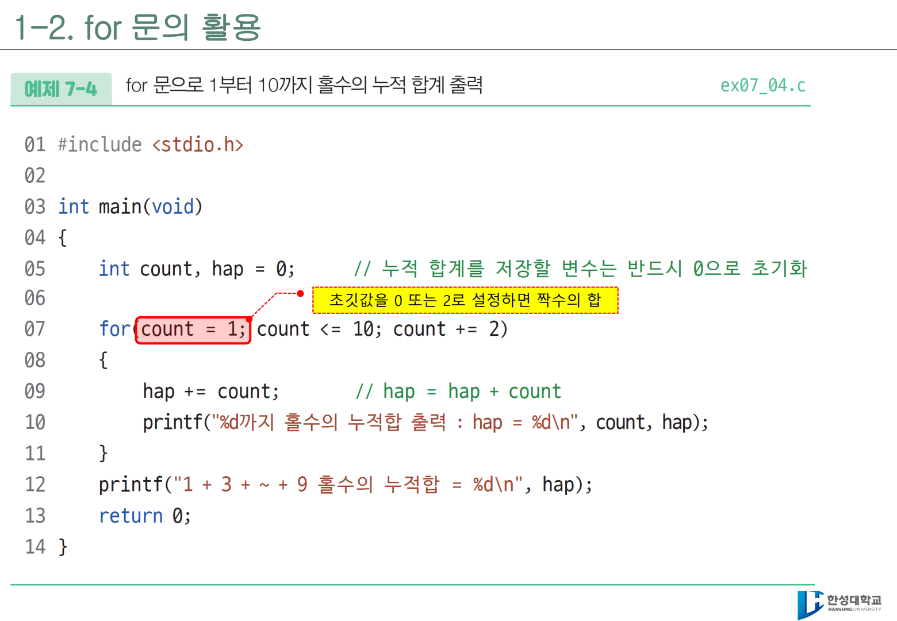

```c
int sum = 0;

for (int n = 2; n <= 100; n += 2) {
    sum += n;
}

printf("1부터 100까지 짝수의 합: %d\n", sum);
```

같은 문제를 다음처럼 풀 수도 있다.

```c
int sum = 0;

for (int n = 1; n <= 100; n++) {
    if (n % 2 == 0) {
        sum += n;
    }
}
```

첫 번째 코드는 짝수만 방문한다. 두 번째 코드는 모든 수를 방문한 뒤 조건문으로 짝수만 고른다. 둘 다 맞지만, 반복 횟수와 의도 표현이 다르다.

---

## 3. while 문

`while`문은 조건을 먼저 검사하고, 조건이 참이면 본문을 실행한다. 반복 횟수가 정확히 정해져 있지 않고, 어떤 상태가 될 때까지 반복해야 할 때 자연스럽다.

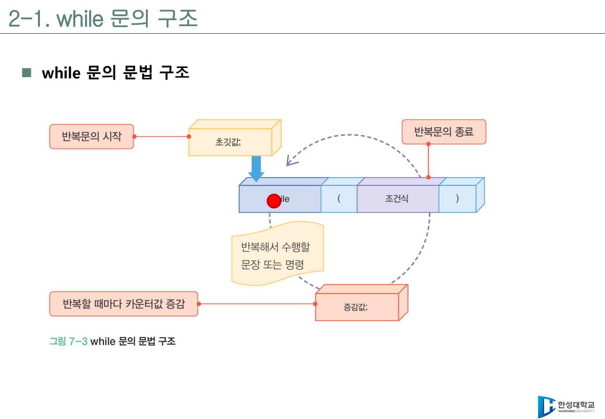

### 기본 형식

```c
while (조건식) {
    반복해서 수행할 문장;
}
```

### 1부터 입력한 수까지 합계

```c
#include <stdio.h>

int main(void)
{
    int num;
    int count = 1;
    int hap = 0;

    printf("정수 입력: ");
    scanf_s("%d", &num);

    while (count <= num) {
        hap += count;
        count++;
    }

    printf("1부터 %d까지의 합: %d\n", num, hap);
    return 0;
}
```

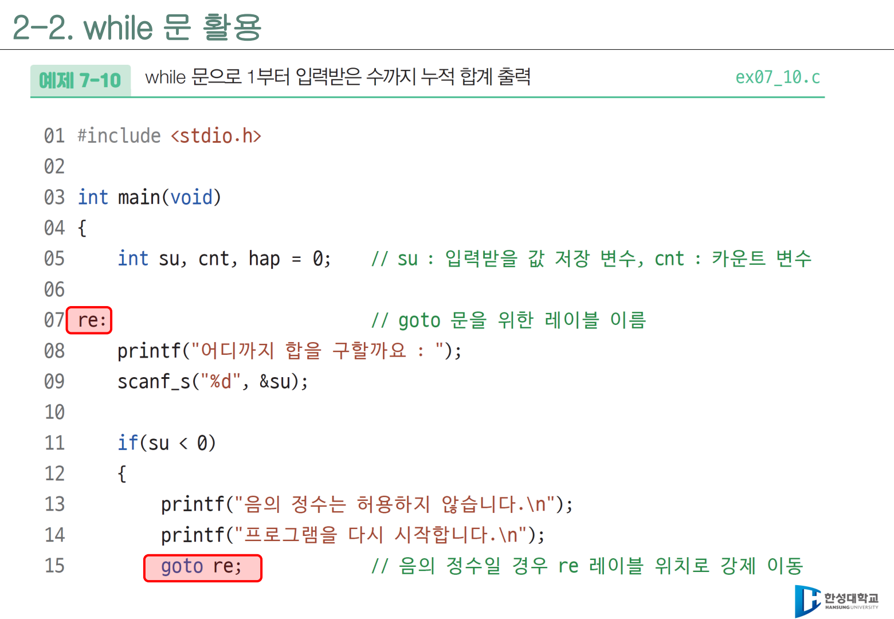

### while 문에서 꼭 확인할 것

`while`문은 조건식과 조건을 바꾸는 문장이 떨어져 있기 때문에 무한 루프가 되기 쉽다.

```c
int count = 1;

while (count <= 10) {
    printf("%d\n", count);
    // count++가 없으면 count는 계속 1이므로 반복이 끝나지 않는다.
}
```

!!! warning "무한 루프 점검"
    `while`문을 작성할 때는 조건식에 들어간 변수가 반복문 안에서 실제로 변하는지 확인한다. 변하지 않으면 조건은 계속 참이고 프로그램은 멈추지 않는다.

### 입력 종료 조건 예제

```c
#include <stdio.h>

int main(void)
{
    int value;
    int sum = 0;
    int count = 0;

    printf("정수 입력(0 입력 시 종료): ");
    scanf_s("%d", &value);

    while (value != 0) {
        sum += value;
        count++;

        printf("정수 입력(0 입력 시 종료): ");
        scanf_s("%d", &value);
    }

    printf("입력 개수: %d\n", count);
    printf("합계: %d\n", sum);
    return 0;
}
```

이 구조는 센서 데이터, 시리얼 입력, 파일 입력을 처리할 때 자주 등장한다. 끝을 알리는 값이 들어올 때까지 계속 읽고, 그동안 필요한 처리를 반복한다.

---

## 4. do-while 문

`do-while`문은 본문을 먼저 실행한 뒤 조건을 검사한다. 그래서 조건이 처음부터 거짓이어도 본문이 최소 한 번은 실행된다. 메뉴 출력, 입력 검증, "한 번 실행 후 계속할지 묻기"에 잘 맞는다.

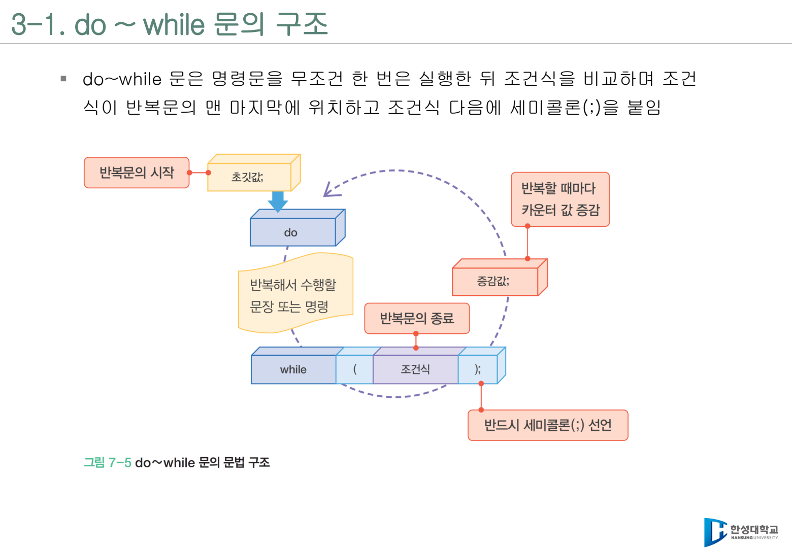

### 기본 형식

```c
do {
    반복해서 수행할 문장;
} while (조건식);
```

`do-while`문은 마지막에 세미콜론이 붙는다. 이 세미콜론을 빠뜨리면 컴파일 오류가 발생한다.

### 입력한 수까지 누적 합계

```c
#include <stdio.h>

int main(void)
{
    int su;
    int count = 1;
    int hap = 0;

    printf("어디까지 합계를 구할까요? ");
    scanf_s("%d", &su);

    do {
        hap += count;
        count++;
    } while (count <= su);

    printf("1부터 %d까지의 합: %d\n", su, hap);
    return 0;
}
```

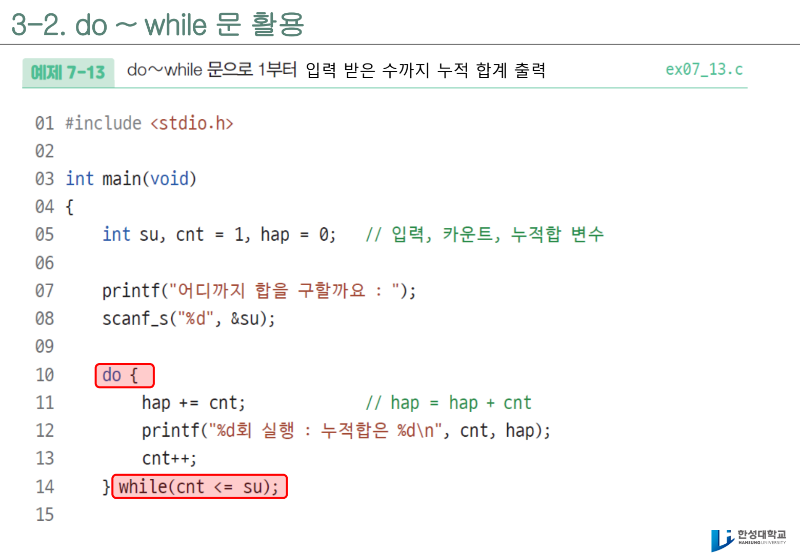

### do-while과 점수 입력 검증

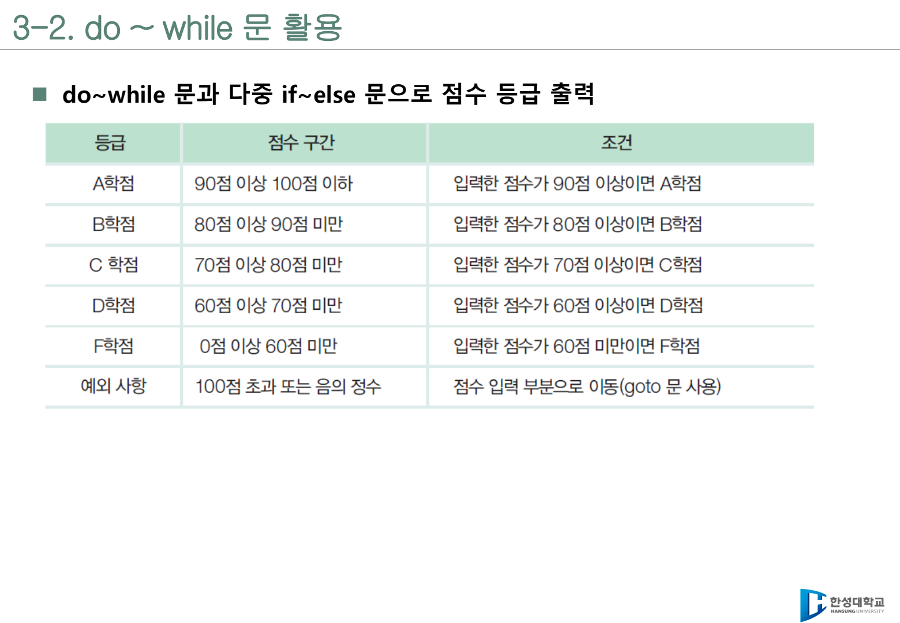

```c
#include <stdio.h>

int main(void)
{
    int score;

    do {
        printf("점수 입력(0~100): ");
        scanf_s("%d", &score);

        if (score < 0 || score > 100) {
            printf("점수는 0~100 사이여야 합니다.\n");
        }
    } while (score < 0 || score > 100);

    if (score >= 90) {
        printf("A학점\n");
    } else if (score >= 80) {
        printf("B학점\n");
    } else if (score >= 70) {
        printf("C학점\n");
    } else if (score >= 60) {
        printf("D학점\n");
    } else {
        printf("F학점\n");
    }

    return 0;
}
```

입력은 최소 한 번 받아야 하므로 `do-while`이 자연스럽다. 잘못된 값이면 다시 입력받고, 올바른 값이면 반복을 끝낸 뒤 등급을 계산한다.

---

## 5. 반복문 선택 기준

세 반복문은 서로 바꿔 쓸 수 있는 경우가 많다. 하지만 읽기 좋은 코드는 문제의 성격과 반복문이 잘 맞는다.

| 상황 | 추천 반복문 | 이유 |
|---|---|---|
| 10번 반복 | `for` | 반복 횟수가 명확하다. |
| 배열 0번부터 9번까지 처리 | `for` | 인덱스와 반복 횟수가 연결된다. |
| 사용자가 0을 입력할 때까지 반복 | `while` | 종료 조건이 입력에 의해 결정된다. |
| 메뉴를 한 번 보여 준 뒤 계속 여부 확인 | `do-while` | 최소 한 번 실행되어야 한다. |
| 센서를 일정 주기로 계속 감시 | `while` | 상태가 바뀔 때까지 반복한다. |

### 같은 문제를 세 가지 반복문으로 보기

```c
for (int i = 1; i <= 3; i++) {
    printf("%d\n", i);
}
```

```c
int i = 1;
while (i <= 3) {
    printf("%d\n", i);
    i++;
}
```

```c
int i = 1;
do {
    printf("%d\n", i);
    i++;
} while (i <= 3);
```

세 코드는 모두 1, 2, 3을 출력한다. 그러나 반복 횟수가 분명하므로 이 문제에서는 `for`가 가장 읽기 쉽다.

---

## 6. 누적 패턴: 합계, 개수, 평균, 최대/최소

반복문 실습에서 가장 중요한 패턴은 누적(accumulation)이다. 누적은 반복하면서 값을 조금씩 모으는 방식이다.

### 센서 샘플 통계

```c
#include <stdio.h>

int main(void)
{
    double data[] = {14.2, 15.1, 13.8, 18.0, 16.4};
    int n = 5;
    double sum = 0.0;
    double max = data[0];
    double min = data[0];

    for (int i = 0; i < n; i++) {
        sum += data[i];

        if (data[i] > max) {
            max = data[i];
        }

        if (data[i] < min) {
            min = data[i];
        }
    }

    printf("평균: %.2f\n", sum / n);
    printf("최댓값: %.2f\n", max);
    printf("최솟값: %.2f\n", min);
    return 0;
}
```

이 예제는 이후 배열 단원과 바로 연결된다. 지금은 배열 문법을 깊게 설명하지 않아도, 반복문이 "여러 데이터를 하나씩 처리하는 구조"라는 점을 강조한다.

### 누적 패턴 체크리스트

- 합계 변수는 반복문 전에 0으로 초기화한다.
- 개수 변수는 조건을 만족할 때만 증가시킨다.
- 평균은 반복이 끝난 뒤 `sum / count`로 계산한다.
- 최댓값과 최솟값은 첫 번째 데이터로 초기화하는 방식이 안전하다.
- 데이터 개수가 0일 때 평균을 계산하면 안 된다.

---

## 7. 중첩 반복문

중첩 반복문은 반복문 안에 반복문이 들어간 구조다. 행과 열을 다루거나, 표를 만들거나, 2차원 LED Matrix를 처리할 때 사용한다.

### 구구단 일부 출력

```c
for (int dan = 2; dan <= 4; dan++) {
    for (int n = 1; n <= 9; n++) {
        printf("%d x %d = %d\n", dan, n, dan * n);
    }
    printf("\n");
}
```

바깥 반복문은 단(`dan`)을 바꾸고, 안쪽 반복문은 곱하는 수(`n`)를 바꾼다. 중첩 반복문을 읽을 때는 "바깥이 한 번 움직일 때 안쪽이 몇 번 도는가"를 먼저 생각한다.

### 별 모양 출력

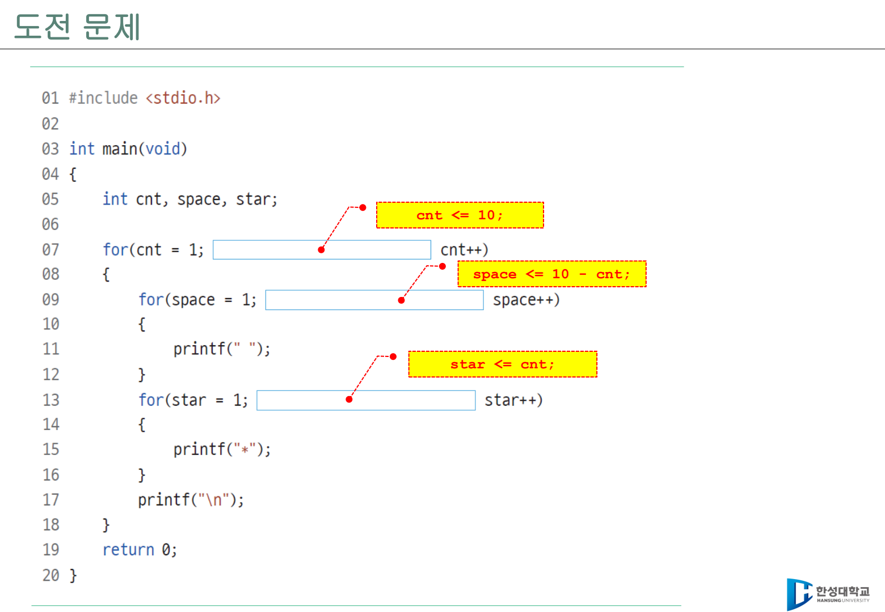

```c
#include <stdio.h>

int main(void)
{
    int cnt, space, star;

    for (cnt = 1; cnt <= 10; cnt++) {
        for (space = 1; space <= 10 - cnt; space++) {
            printf(" ");
        }

        for (star = 1; star <= cnt; star++) {
            printf("*");
        }

        printf("\n");
    }

    return 0;
}
```

이 문제의 핵심은 별을 찍는 반복문만이 아니다. 줄마다 공백 개수와 별 개수가 함께 바뀐다.

| 줄 번호 `cnt` | 공백 개수 `10 - cnt` | 별 개수 `cnt` |
|---:|---:|---:|
| 1 | 9 | 1 |
| 2 | 8 | 2 |
| 3 | 7 | 3 |
| 10 | 0 | 10 |

---

## 8. 분기문: break, continue, return

반복문 안에서 흐름을 바꾸는 문장을 분기문이라고 한다. 원본 강의자료에서는 `break`, `continue`, `goto`, `return`을 다루지만, 실무와 수업에서는 먼저 `break`, `continue`, `return`의 차이를 확실히 구분하는 것이 중요하다.

### break 문

`break`는 가장 가까운 반복문 또는 `switch`문을 빠져나간다.

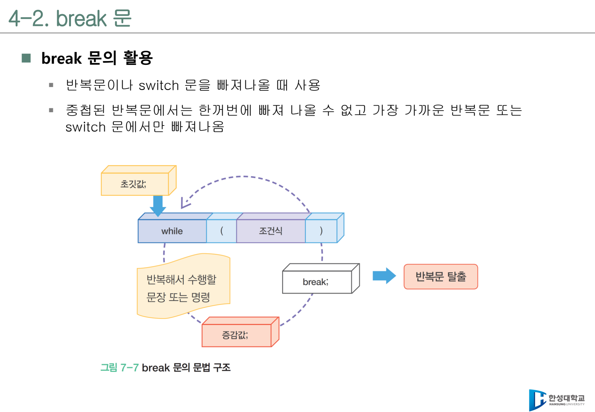

```c
for (int n = 1; n <= 100; n++) {
    if (n > 10) {
        break;
    }
    printf("%d\n", n);
}
```

위 코드는 `n`이 11이 되는 순간 반복문을 종료한다. 11은 출력되지 않는다.

### 합계가 2500을 넘으면 종료

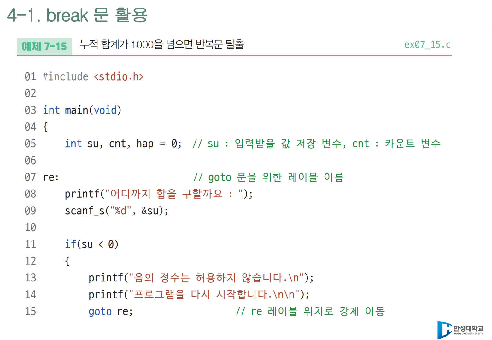

```c
#include <stdio.h>

int main(void)
{
    int count = 1;
    int hap = 0;

    while (1) {
        hap += count;

        if (hap > 2500) {
            break;
        }

        count++;
    }

    printf("합계가 2500을 넘은 순간의 count: %d\n", count);
    printf("합계: %d\n", hap);
    return 0;
}
```

`while (1)`은 일부러 만든 무한 루프다. 이 경우 반드시 내부에 `break`처럼 빠져나갈 조건이 있어야 한다.

### continue 문

`continue`는 반복문 전체를 끝내지 않고, 이번 회차의 나머지 문장만 건너뛴다.

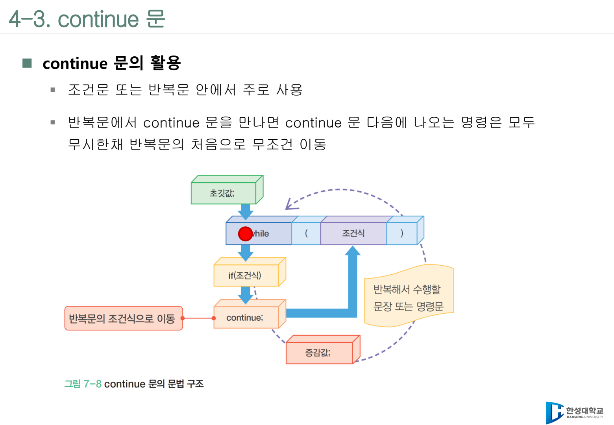

```c
for (int n = 1; n <= 10; n++) {
    if (n % 2 == 0) {
        continue;
    }
    printf("%d\n", n);
}
```

위 코드는 짝수일 때 `printf()`를 건너뛰므로 홀수만 출력한다.

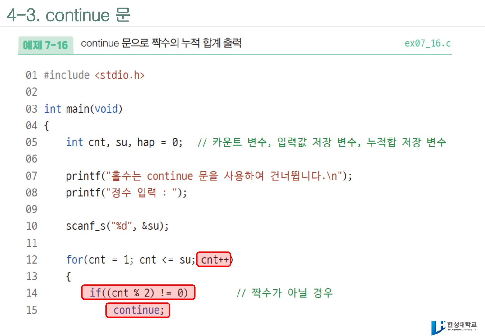

### break와 continue 비교

| 문장 | 의미 | 반복문은 계속되는가? |
|---|---|---|
| `break` | 반복문 자체를 종료한다. | 아니오 |
| `continue` | 이번 회차만 건너뛰고 다음 반복으로 간다. | 예 |
| `return` | 현재 함수를 종료한다. | 함수가 끝나므로 반복도 끝난다. |

### return 문

`return`은 현재 실행 중인 함수를 끝내고 호출한 곳으로 돌아간다. `main()`에서 `return 0;`은 프로그램이 정상 종료되었다는 의미로 사용한다.

```c
if (count < 0) {
    printf("count는 음수가 될 수 없습니다.\n");
    return 0;
}
```

입력이 잘못되어 더 진행할 수 없을 때는 `return`으로 함수를 종료하는 편이 복잡한 중첩 조건을 줄일 수 있다.

!!! warning "goto는 왜 조심해야 하는가"
    `goto`는 지정한 레이블로 강제로 이동한다. 작은 예제에서는 동작을 이해할 수 있지만, 코드가 커지면 흐름을 추적하기 어려워진다. 이번 수업에서는 존재와 문법만 확인하고, 일반적인 반복 제어는 `break`, `continue`, `return`으로 해결한다.

---

## 9. Arduino UNO R4 WiFi: 반복문으로 LED 애니메이션 만들기

조건문 실습에서는 거리 상태에 따라 LED 표정을 바꾸었다. 이번 주차에서는 반복문으로 LED Matrix의 여러 좌표를 차례대로 켜고 끄며 움직임을 만든다.

예제 파일: [`code/arduino/06_loop_animation/06_loop_animation.ino`](code/arduino/06_loop_animation/06_loop_animation.ino)

### Matrix 전체 지우기

```cpp
void clearFrame() {
  for (int r = 0; r < 8; ++r) {
    for (int c = 0; c < 12; ++c) {
      frame[r][c] = 0;
    }
  }
}
```

8행 12열이므로 총 96칸을 지워야 한다. 직접 96줄을 쓰지 않고, 행 반복문과 열 반복문을 중첩해 모든 좌표를 처리한다.

### 한 점을 왼쪽에서 오른쪽으로 이동

```cpp
void scanDot() {
  for (int c = 0; c < 12; ++c) {
    clearFrame();
    setPixel(3, c);
    render();
    delay(80);
  }
}
```

열 번호 `c`가 0부터 11까지 변하면서 같은 행의 LED가 차례대로 켜진다. 반복 변수 하나가 화면의 움직임이 되는 예다.

### 막대그래프 애니메이션

```cpp
void showBar(int level) {
  clearFrame();

  for (int c = 0; c < level; ++c) {
    setPixel(6, c);
    setPixel(7, c);
  }

  render();
}
```

`level` 값이 커질수록 더 많은 열이 켜진다. 이 구조는 10주차 배열 막대그래프와 11주차 센서값 시각화로 이어진다.

### 실습 절차

1. Arduino IDE에서 예제 파일을 연다.
2. 보드를 `Arduino UNO R4 WiFi`로 선택한다.
3. 업로드 후 LED Matrix에서 점 스캔, 막대 증가, 테두리 애니메이션이 반복되는지 확인한다.
4. `delay(80)` 값을 30, 150, 300으로 바꾸어 속도 차이를 관찰한다.
5. `for (int c = 0; c < 12; ++c)`를 `for (int c = 11; c >= 0; --c)`로 바꾸어 방향을 반대로 만든다.

!!! tip "이 실습의 핵심"
    반복문은 숫자 계산만 하는 문법이 아니다. LED Matrix에서는 반복 변수가 곧 위치가 되고, `delay()`와 결합하면 시간이 흐르는 애니메이션이 된다.

---

## 10. ROS2와 로봇 제어로 이어지는 생각

반복문은 ROS2와 로봇 제어에서도 계속 등장한다.

| C 반복문 실습 | 로봇/ROS2에서의 대응 |
|---|---|
| `for`로 센서 샘플 10개 평균 | 일정 개수의 LiDAR/IMU 샘플 필터링 |
| `while`로 0 입력 전까지 누적 | 종료 명령이 오기 전까지 노드 실행 |
| `do-while`로 입력 검증 | 명령을 최소 한 번 보내고 응답 확인 |
| 중첩 반복으로 LED Matrix 처리 | 2D occupancy grid 또는 이미지 픽셀 처리 |
| `break`로 조건 만족 시 종료 | 목표 도달, 비상 정지, 타임아웃 처리 |
| `continue`로 특정 데이터 건너뜀 | 이상치 센서값 또는 유효하지 않은 메시지 무시 |

ROS2에서는 `while (rclcpp::ok())`처럼 시스템이 정상 동작하는 동안 반복하는 구조를 자주 본다. C 언어 수업에서는 아직 ROS2 API를 쓰지 않지만, 반복 조건과 탈출 조건을 정확히 설계하는 습관은 그대로 이어진다.

---

## 11. 실습 과제

### 실습 6-1 - 1부터 N까지 합계

정수 `N`을 입력받아 1부터 `N`까지의 합을 출력한다.

필수 조건:

- `for`문으로 먼저 작성한다.
- 같은 문제를 `while`문으로 다시 작성한다.
- `N <= 0`이면 오류 메시지를 출력하고 종료한다.

### 실습 6-2 - 3의 배수 합

1부터 100까지의 수 중 3의 배수만 더한다.

```c
int sum = 0;

for (int n = 1; n <= 100; n++) {
    if (n % 3 == 0) {
        sum += n;
    }
}

printf("%d\n", sum);
```

기대 결과는 `1683`이다.

### 실습 6-3 - 센서 통계

다음 거리 샘플의 합계, 평균, 최댓값, 최솟값을 구한다.

```c
double distance_cm[] = {42.0, 24.0, 8.0, 31.5, 17.2, 28.4};
```

확장:

- 15cm 미만인 값의 개수를 센다.
- 30cm 이상인 값의 개수를 센다.
- 평균보다 큰 값만 출력한다.

### 실습 6-4 - do-while 입력 검증

0~100 사이의 점수를 입력받을 때까지 반복해서 다시 입력받는다. 올바른 점수가 들어오면 학점을 출력한다.

### 실습 6-5 - break와 continue

다음 두 프로그램의 차이를 설명한다.

```c
for (int n = 1; n <= 10; n++) {
    if (n == 5) {
        break;
    }
    printf("%d ", n);
}
```

```c
for (int n = 1; n <= 10; n++) {
    if (n == 5) {
        continue;
    }
    printf("%d ", n);
}
```

### 실습 6-6 - Arduino LED Matrix 반복 애니메이션

예제 [`06_loop_animation.ino`](code/arduino/06_loop_animation/06_loop_animation.ino)를 실행하고 다음을 수정한다.

- 점이 움직이는 행을 3번 행에서 1번 행으로 바꾼다.
- 점이 오른쪽에서 왼쪽으로 움직이게 한다.
- 막대그래프가 12칸까지 찼다가 다시 줄어들게 한다.

---

## 12. 도전 문제

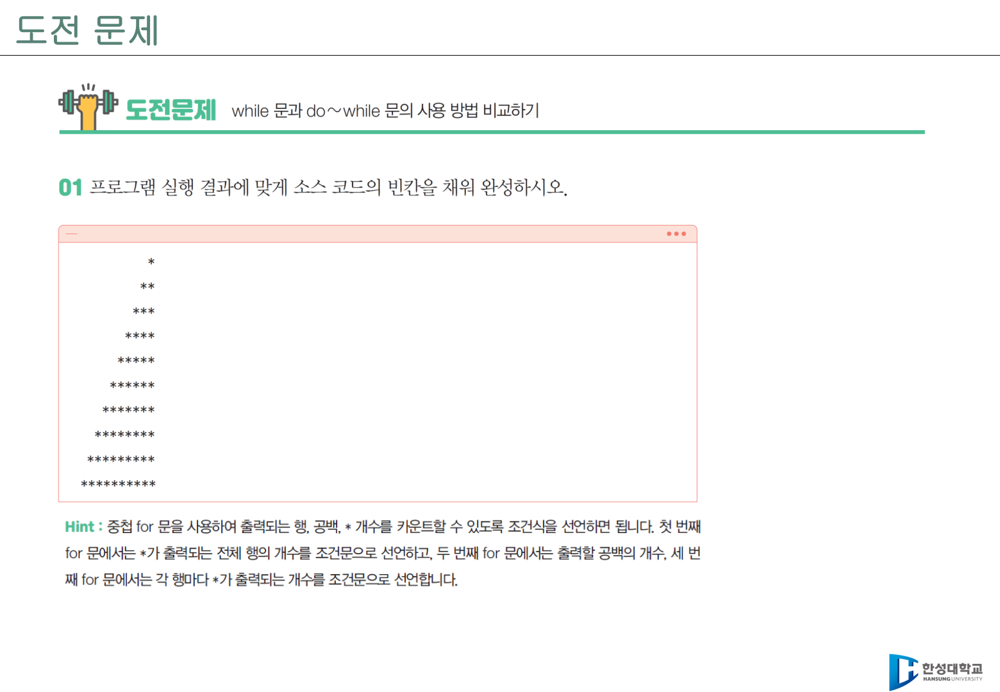

### 도전 1 - 별 피라미드

중첩 반복문으로 다음 모양을 출력한다.

```text
         *
        **
       ***
      ****
     *****
    ******
   *******
  ********
 *********
**********
```

핵심은 한 줄 안에서 공백 반복과 별 반복을 분리하는 것이다.

### 도전 2 - 홀수 줄만 별 출력

1부터 9까지 홀수 줄에만 별을 출력한다.

```text
*
***
*****
*******
*********
```

힌트:

```c
if (cnt % 2 == 0) {
    continue;
}
```

### 도전 3 - 합계가 2500을 넘는 순간 찾기

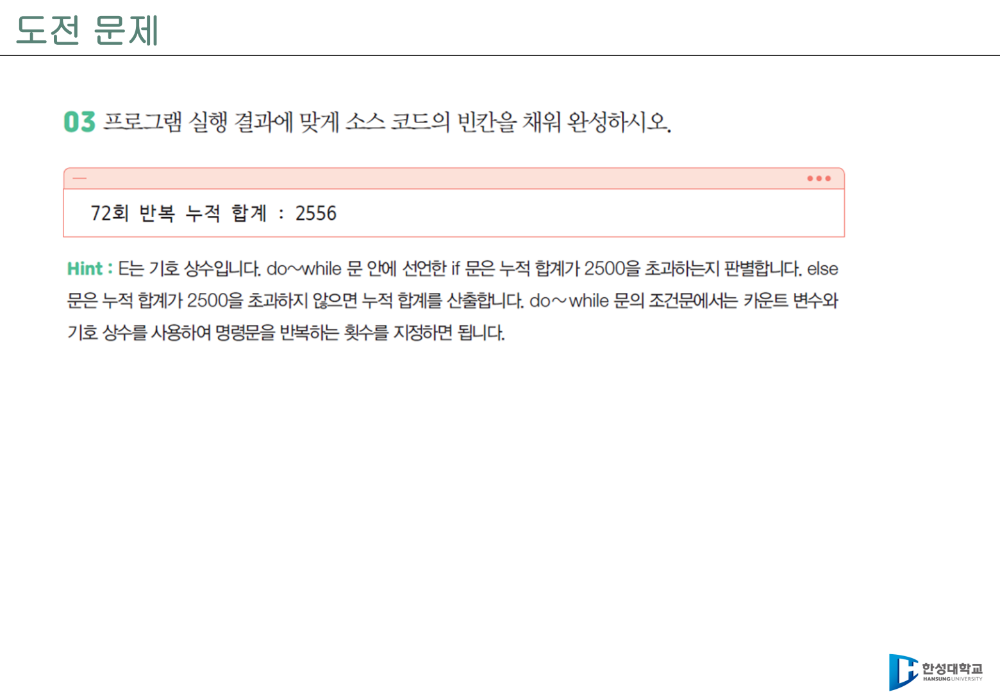

1부터 차례대로 더하다가 합계가 2500을 넘는 순간의 `count`와 `hap`을 출력한다.

확인 질문:

- 이 문제에서 `for`와 `while` 중 무엇이 더 자연스러운가?
- `break`가 없다면 어떤 일이 일어나는가?
- `hap > 2500` 검사를 더하기 전과 후 중 어디에 두어야 하는가?

---

## 13. 자주 막히는 지점

| 막히는 지점 | 설명 | 해결 방법 |
|---|---|---|
| 반복 횟수 1개 차이 | `<`와 `<=`를 혼동한다. | 변수 변화표를 작성한다. |
| 누적 변수 초기화 위치 오류 | 반복문 안에서 `sum = 0`을 실행한다. | 누적 변수는 반복문 전에 초기화한다. |
| 무한 루프 | 조건식에 들어간 변수가 변하지 않는다. | 증감식 또는 입력 갱신을 확인한다. |
| `break`와 `continue` 혼동 | 반복 종료와 회차 건너뛰기를 착각한다. | 출력 결과를 손으로 추적한다. |
| 중첩 반복문 흐름 혼동 | 안쪽 반복이 모두 끝난 뒤 바깥 반복이 1번 증가한다. | 행/열 표를 그린다. |
| `do-while` 세미콜론 누락 | `while (조건);`의 세미콜론을 빼먹는다. | do-while 형식을 통째로 외운다. |
| LED 좌표 범위 오류 | 행 0~7, 열 0~11을 벗어난다. | `setPixel()` 안에서 범위를 검사한다. |

---

## 14. 형성평가 체크포인트

- [ ] `for`, `while`, `do-while`의 실행 순서를 설명할 수 있다.
- [ ] 반복 횟수가 정해진 문제에 `for`문을 사용할 수 있다.
- [ ] 종료 조건이 입력에 따라 달라지는 문제에 `while`문을 사용할 수 있다.
- [ ] 최소 한 번 실행해야 하는 입력 검증 문제에 `do-while`문을 사용할 수 있다.
- [ ] 합계, 개수, 평균, 최댓값, 최솟값을 반복문으로 계산할 수 있다.
- [ ] `break`, `continue`, `return`의 차이를 설명할 수 있다.
- [ ] 중첩 반복문으로 행과 열을 처리할 수 있다.
- [ ] Arduino LED Matrix에서 반복문으로 모든 좌표를 지우거나 애니메이션을 만들 수 있다.

---

## 연습문제

1. `for (int i = 0; i < 5; i++)`는 몇 번 반복하는가?
2. `for (int i = 1; i <= 5; i++)`가 끝난 뒤 `i`는 어느 범위까지 증가했는가?
3. `while`문이 무한 루프가 되는 대표적인 이유는 무엇인가?
4. `do-while`문이 `while`문과 다른 가장 큰 특징은 무엇인가?
5. 1부터 10까지 짝수의 합을 구하는 코드를 작성하라.
6. `break`와 `continue`의 차이를 한 문장으로 설명하라.
7. LED Matrix `frame[8][12]` 전체를 0으로 만드는 중첩 반복문의 바깥 반복과 안쪽 반복은 각각 무엇을 의미하는가?

??? success "정답 및 해설"
    1. 5번 반복한다. `i`는 0, 1, 2, 3, 4일 때 본문을 실행한다.
    2. 조건 검사 시점에는 `i`가 6이 되어 `i <= 5`가 거짓이 된다.
    3. 조건식에 들어간 변수가 반복문 안에서 변하지 않거나, 종료 조건이 잘못 작성되었기 때문이다.
    4. `do-while`은 조건 검사 전에 본문을 먼저 실행하므로 최소 한 번은 실행된다.
    5. 예: `for (int i = 2; i <= 10; i += 2) sum += i;`
    6. `break`는 반복문을 끝내고, `continue`는 이번 회차만 건너뛰고 다음 반복으로 간다.
    7. 바깥 반복은 행(row)을, 안쪽 반복은 열(column)을 의미한다.

---

## 참조

- 교재 Ch07 반복문
- 원본 강의자료: `7-1. 반복문.pdf`, `7-2. 반복문 실습.pdf`
- Arduino 예제: [`code/arduino/06_loop_animation/06_loop_animation.ino`](code/arduino/06_loop_animation/06_loop_animation.ino)
- 배경 개념: [Arduino R4 예제](code/arduino.md)
