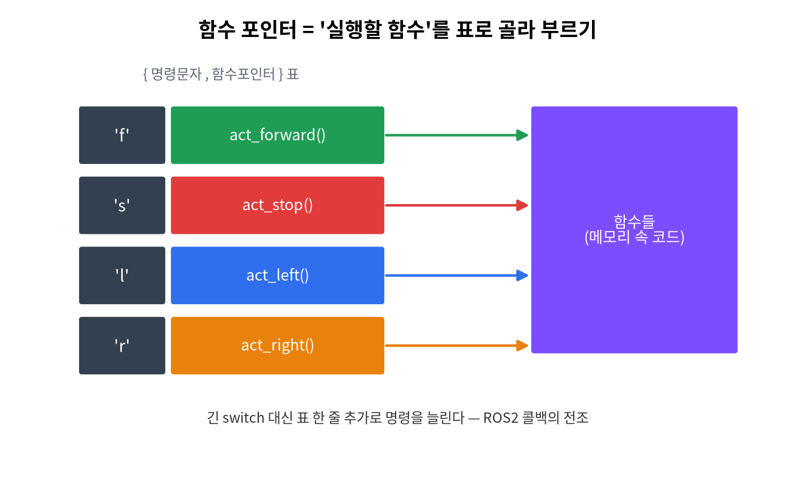

# 7주차 · 함수 + 시리얼 명령 제어 (중간 정리)
> C언어 · 미래모빌리티학과 | CLO1·CLO3 | 교재 Ch08





## 학습 목표
- 함수 정의/선언/호출, 매개변수·반환값을 이해하고 코드를 **모듈화**한다.
- 시리얼 명령(문자) → 동작 디스패치를 구현한다(함수 포인터 맛보기).

---

## 강의 해설

7주차는 코드를 길게 쓰는 단계에서 벗어나, 의미 있는 단위로 나누는 방법을 배운다. 지금까지는 `main` 안에 모든 코드를 넣어도 예제가 동작했지만, 프로그램이 조금만 커져도 그런 방식은 읽기 어렵고 고치기도 어렵다. 함수는 "이 코드 묶음이 어떤 일을 하는지" 이름을 붙이는 방법이며, 좋은 함수 이름은 주석보다 더 강력한 설명이 된다.

매개변수와 반환값은 함수와 함수 사이의 약속이다. `decide_state(distance)`처럼 입력을 주면 상태를 돌려주는 함수는 테스트하기 쉽다. 반대로 전역변수에 몰래 의존하는 함수는 작은 예제에서는 편하지만 큰 프로그램에서는 원인을 찾기 어렵게 만든다. 이 주차에서는 함수가 잘 나뉜 코드와 모든 것이 한곳에 섞인 코드를 비교해 읽기 차이를 느끼게 하는 것이 좋다.

시리얼 명령 제어는 함수의 필요성을 보여 주는 좋은 사례다. 명령 문자를 읽고, 그 문자에 맞는 함수를 호출하고, 각 함수는 자기 역할만 수행한다. 이 구조는 후반부 ROS2 콜백과 직접 연결된다. ROS2에서도 메시지가 들어오면 콜백 함수가 실행되고, 그 안에서 제어 함수를 호출한다. 따라서 7주차는 중간고사 전 문법 정리이면서, 동시에 로봇 소프트웨어 구조의 첫 맛보기다.

## 3시간 강의 운영 포인트

- **0~25분**: 지금까지 `main`에 쌓인 코드를 보여 주고, 함수가 필요한 이유를 "읽기, 테스트, 재사용" 관점에서 설명한다.
- **25~85분**: 함수 정의, 선언, 호출, 매개변수, 반환값을 작은 계산 함수로 반복한다. 함수 호출 시 값이 복사된다는 점을 변수 그림으로 보여 준다.
- **85~140분**: 거리 판단, LED 제어, 명령 처리 코드를 함수로 분리한다. 학생에게 "이 함수의 책임은 무엇인가"를 이름으로 표현하게 한다.
- **140~180분**: 시리얼 명령 디스패치 실습과 1~7주 종합 복습을 연결한다. 중간고사 전에는 함수 호출 흐름을 손으로 따라가는 연습을 반드시 남긴다.

## 1. 이론

### 1.1 함수의 구조
```c
반환형 함수이름(매개변수목록) {
    // 본문
    return 값;   // 반환형이 void면 생략
}
```
```c
double get_speed(double dist, double t) {  // 정의
    return dist / t;
}
double v = get_speed(150, 12);             // 호출
```

### 1.2 왜 함수로 나누나
- **중복 제거**·**재사용**·**가독성**·**테스트 용이**. SW공학의 출발점.
- 큰 문제를 작은 함수로 쪼개는 것 = **분할 정복**.

### 1.3 함수 선언(프로토타입)
`main` 위에서 함수를 미리 알리는 선언. 큰 프로그램·여러 파일에서 필요.
```c
double get_speed(double, double);   // 선언(프로토타입)
```

### 1.4 값 전달(call by value)
C는 인자를 **복사**해서 넘긴다. 함수 안에서 매개변수를 바꿔도 **원본은 안 바뀐다**(원본을 바꾸려면 12~13주 포인터).

### 1.5 명령 → 동작 디스패치
```c
void run_command(char cmd) {
    switch (cmd) {
        case 'h': faceHappy(); break;
        case 'a': faceAngry(); break;
        default:  faceNeutral();
    }
}
```
> 이 "명령을 받아 해당 함수를 부르는" 구조가 **ROS2 콜백**의 전조다.

---

## 2. 핵심 용어 정리
| 용어 | 설명 |
|------|------|
| 함수 | 이름 붙은 코드 블록 |
| 매개변수/인자 | 함수가 받는 입력(정의 측/호출 측) |
| 반환값 | 함수가 돌려주는 결과(`return`) |
| 프로토타입 | 함수의 미리 선언 |
| call by value | 인자를 복사해 전달(원본 불변) |
| 모듈화 | 기능을 함수 단위로 분리 |

---

## 3. 실습

### 실습 7-1 · 제어 함수 분리 (예제 `ex07_functions.c`)
주행 로직을 `stop()`, `go_forward()`, `decide_state()` 등으로 나누고,
지역/전역/`static` 변수의 수명 차이를 출력으로 확인.

### 실습 7-2 · 명령 디스패치 (예제 `ex09_dispatch.c`)
명령 문자 → 실행 함수를 **함수 포인터 표**로 연결(길어지는 `switch` 대체).

### 실습 7-3 · 시리얼 명령 제어 (아두이노)
시리얼로 `h/w/a/o/n`을 입력받아 표정 전환(`code/arduino/09_face_main`).

예제: [`code/arduino/09_face_main/09_face_main.ino`](code/arduino/09_face_main/09_face_main.ino)

| 입력 문자 | 호출되는 함수 | 결과 |
|-----------|---------------|------|
| `h` | `faceHappy()` | 웃는 표정 |
| `a` | `faceAngry()` | 경고 표정 |
| `o` | `faceSurprised()` | 놀란 표정 |
| `n` | `faceNeutral()` | 중립 표정 |
| `b` | `faceBlink()` | 눈 감기 |

!!! note "ROS2 콜백과의 연결"
    지금은 시리얼 모니터에서 `h`를 입력하면 `faceHappy()`를 호출한다. ROS2에서는 `/cmd_vel`이나 `/robot_state` 토픽 메시지가 들어오면 콜백 함수가 호출된다. 즉, **명령 → 함수 호출**이라는 구조는 같다.

### 실습 7-4 · 중간 정리
1~7주 핵심(출력·입력·자료형·연산·조건·반복·함수) 복습, 중간고사 범위 확인.

---

## 4. 과제
- 제어 로직 3개 이상 함수 분리, 시리얼 명령 제어.
- 도전: `runCommand()`에 `r` 명령을 추가하고, 빠르게 두 번 깜박이는 함수를 새로 만들어 연결하라.

## 5. 참조
- 교재 Ch08 · 자료 [`code/arduino/09_face_main`](code/arduino.md)

## 형성평가 체크포인트
- [ ] 함수 분할 기준 설명 · [ ] 매개변수/반환 정확 · [ ] call by value 이해 · [ ] 명령→동작 동작

---

## 연습문제
1. `void f(int x){ x = 10; }` 를 `int a=1; f(a);` 로 호출한 뒤 `a`의 값은?
2. 반환형이 `void`인 함수는 `return`을 어떻게 쓰는가?
3. 함수 프로토타입(선언)을 두는 목적은?

??? success "정답 및 해설"
    1. `1` — C는 **값 전달(call by value)**: 복사본만 바뀌고 원본은 불변.
    2. 값 없이 `return;` 또는 생략.
    3. `main`보다 아래에 정의된 함수를 **미리 알려** 호출 가능하게(타입 검사).

    **🖼 그림으로 복습** — 함수 호출과 변수 스코프

    
