# 7주차 · 함수 + 시리얼 명령 제어 (중간 정리)
> C언어 · 미래모빌리티학과 | CLO1·CLO3 | 교재 Ch08 | 원본 PDF: `8-1. 함수`, `8-2. 함수 실습`, `8-3. 함수 실습 과제`

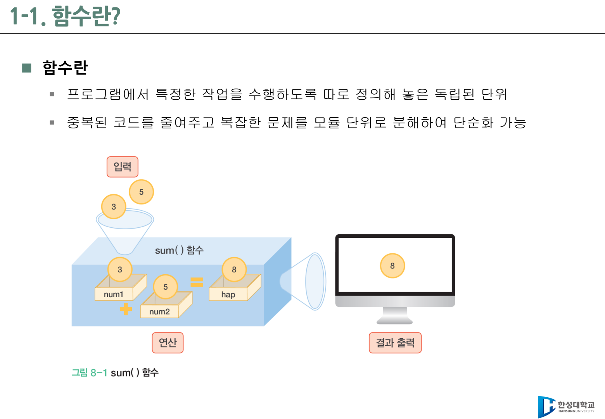

## 학습 목표

- 함수가 필요한 이유를 중복 제거, 모듈화, 재사용, 테스트 관점에서 설명할 수 있다.
- 라이브러리 함수와 사용자 정의 함수의 차이를 구분할 수 있다.
- 함수의 선언, 호출, 정의 3단계 구조를 설명하고 작성할 수 있다.
- 반환형, 함수 이름, 매개변수, 인수, 반환값의 의미를 구분할 수 있다.
- 매개변수와 반환값이 있는 함수, 없는 함수를 각각 작성할 수 있다.
- `rand()`, `srand()`, `ceil()`, `floor()`, `fabs()` 같은 라이브러리 함수를 사용할 수 있다.
- 재귀 함수의 탈출 조건과 스택 사용 위험을 설명할 수 있다.
- 함수 관계도를 보고 점수 입력-등급 계산 프로젝트를 함수 단위로 설계할 수 있다.
- Arduino UNO R4 WiFi에서 시리얼 명령 문자를 함수 호출로 연결할 수 있다.

---

## 이번 주차의 큰 그림

지금까지의 예제는 대부분 `main()` 함수 안에 입력, 계산, 조건, 반복, 출력이 함께 들어 있었다. 예제가 짧을 때는 문제가 없어 보이지만, 프로그램이 길어지면 어디에서 무엇을 하는지 찾기 어려워진다. 함수(function)는 코드를 "의미 있는 일의 단위"로 나누고 이름을 붙이는 방법이다.

예를 들어 점수를 입력받고 등급을 출력하는 프로그램을 생각해 보자. `main()` 안에 모든 코드를 넣을 수도 있지만, 다음처럼 나누면 훨씬 읽기 쉽다.

```text
main()
-> score_fun()       점수를 입력받는다.
-> grade_fun(score) 점수에 맞는 등급을 계산한다.
-> print_result()   결과를 출력한다.
```

함수를 잘 나누면 좋은 점은 다음과 같다.

- 같은 코드를 반복해서 쓰지 않아도 된다.
- 함수 이름만 보고 코드의 역할을 짐작할 수 있다.
- 작은 함수 단위로 테스트할 수 있다.
- 이후 Arduino, ROS2, 로봇 제어 코드에서 콜백과 제어 함수를 분리하기 쉬워진다.

!!! tip "교수자 설명 포인트"
    함수는 "코드를 짧게 만드는 문법"이 아니라 "책임을 나누는 설계 도구"다. `sum()`, `grade_fun()`, `showFace()`, `runCommand()`처럼 이름을 붙이는 순간, 코드 블록은 하나의 역할을 갖는다.

---

## 3시간 강의 운영안

| 시간 | 내용 | 교수자 진행 포인트 | 학생 활동 |
|---:|---|---|---|
| 0~10분 | 1~6주 복습 | 조건문과 반복문 코드가 길어지는 순간을 보여 준다. | 긴 `main()`에서 역할 표시 |
| 10~25분 | 함수의 필요성 | 중복 제거, 모듈화, 재사용, 라이브러리 제공 관점 설명 | 같은 출력 코드를 함수로 묶기 |
| 25~45분 | 라이브러리 함수 | `stdlib.h`, `time.h`, `math.h`와 함수 원형 연결 | `rand()`, `ceil()`, `fabs()` 실행 |
| 45~70분 | 사용자 정의 함수 구조 | 머리(header), 본문(body), 반환형, 매개변수 설명 | `Add()` 함수 작성 |
| 70~95분 | 선언-호출-정의 | 3단계 과정과 프로토타입의 세미콜론 강조 | 함수 선언 오류 찾기 |
| 95~120분 | 인수와 매개변수 | 호출 측 인수와 정의 측 매개변수, 값 전달 설명 | `swap`이 안 되는 이유 예측 |
| 120~140분 | 매개변수/반환값 조합 | 4가지 함수 형태를 비교한다. | 합계 함수, 출력 함수 작성 |
| 140~155분 | 재귀 함수 | 팩토리얼과 탈출 조건, 스택 위험 설명 | `Fact(5)` 호출 흐름 추적 |
| 155~175분 | 함수 프로젝트 | 점수 입력-등급 계산을 함수 관계도로 설계 | `score_fun`, `grade_fun` 구현 |
| 175~180분 | Arduino/ROS2 연결 | 시리얼 명령이 함수 호출로 연결되는 구조 정리 | 명령 문자 1개 추가 |

---

## 이론-실습 연결표

| 이론 개념 | 바로 해볼 실습 | 확인 질문 |
|---|---|---|
| 함수는 코드에 이름을 붙인 단위다 | `add()`, `max()`, `grade()` 함수를 작성한다 | 함수 이름만 보고 역할을 설명할 수 있는가? |
| 매개변수와 반환값 | 누적 합계 함수와 평균 함수를 분리한다 | 입력값, 내부 계산, 반환값을 화살표로 그릴 수 있는가? |
| 값 전달 | 함수 안에서 매개변수를 바꾸어 원본이 바뀌는지 확인한다 | 왜 원본을 바꾸려면 포인터가 필요한가? |
| 시리얼 명령 함수화 | Arduino 명령 문자를 함수 호출로 연결한다 | `switch` 안의 코드가 함수로 분리되면 무엇이 좋아지는가? |

## 1. 함수란 무엇인가

함수는 특정한 작업을 수행하도록 따로 정의해 놓은 독립된 코드 단위다. C 프로그램은 `main()` 함수에서 시작하지만, 모든 코드를 `main()`에 몰아넣을 필요는 없다.

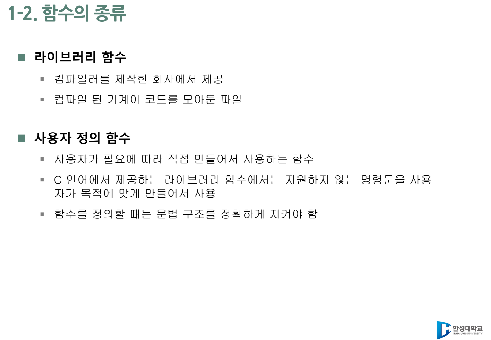

함수는 크게 두 종류로 볼 수 있다.

| 종류 | 의미 | 예 |
|---|---|---|
| 라이브러리 함수 | 컴파일러 또는 표준 라이브러리에서 제공하는 함수 | `printf`, `scanf_s`, `rand`, `ceil` |
| 사용자 정의 함수 | 사용자가 목적에 맞게 직접 만드는 함수 | `Add`, `grade_fun`, `showFace` |

### 함수를 사용하는 이유

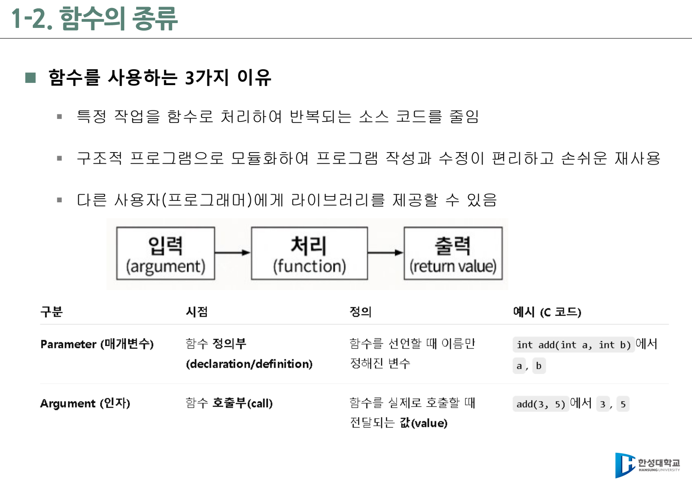

1. 반복되는 코드를 줄인다.
2. 큰 문제를 작은 기능 단위로 나눈다.
3. 작성과 수정이 쉬워진다.
4. 다른 프로그램에서도 재사용할 수 있다.
5. 함수 단위로 테스트하고 오류를 찾을 수 있다.

### 나쁜 구조와 좋은 구조

```c
int main(void)
{
    // 입력
    // 계산
    // 조건 판단
    // 출력
    // 다시 계산
    // 다시 조건 판단
    // 다시 출력
}
```

위 구조는 처음에는 빠르게 만들 수 있지만, 코드가 길어지면 수정 지점이 흩어진다.

```c
int input_score(void);
char grade_fun(int score);
void print_result(int score, char grade);

int main(void)
{
    int score = input_score();
    char grade = grade_fun(score);
    print_result(score, grade);
    return 0;
}
```

이 구조는 각 함수가 맡은 일이 분명하다. `grade_fun()`만 따로 테스트할 수도 있다.

---

## 2. 라이브러리 함수

라이브러리 함수는 이미 만들어져 제공되는 함수다. 사용하려면 해당 함수의 원형이 들어 있는 헤더 파일을 포함해야 한다.

### 난수 함수: rand, srand

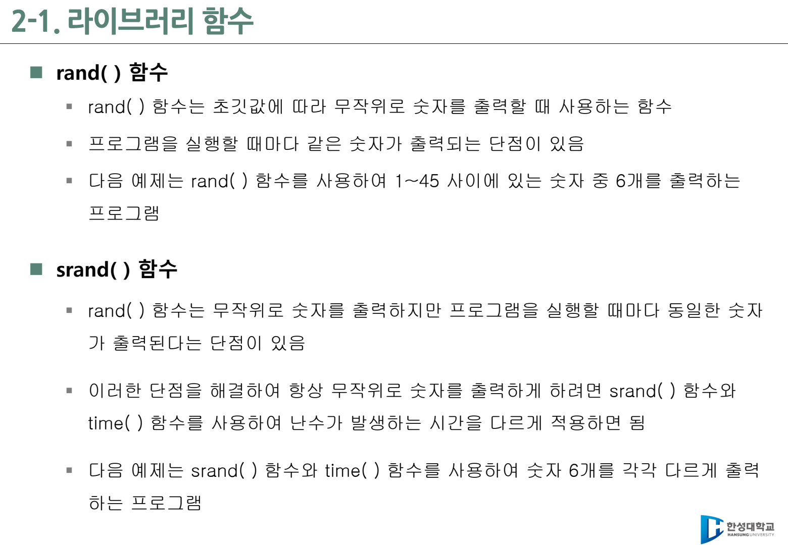

```c
#include <stdio.h>
#include <stdlib.h>
#include <time.h>

int main(void)
{
    srand((unsigned int)time(NULL));

    for (int i = 0; i < 6; i++) {
        int lotto = rand() % 45 + 1;
        printf("%d ", lotto);
    }

    printf("\n");
    return 0;
}
```

`rand()`는 난수를 만들지만, 시드(seed)가 같으면 같은 순서의 숫자가 나온다. `srand()`는 난수 발생의 시작점을 바꾸는 함수다. 보통 현재 시간을 사용해 실행할 때마다 다른 시드를 준다.

!!! warning "난수 실습에서의 주의"
    `srand()`를 반복문 안에서 계속 호출하지 않는다. 보통 프로그램 시작 부분에서 한 번만 호출한다.

### 수학 함수: ceil, floor, fabs

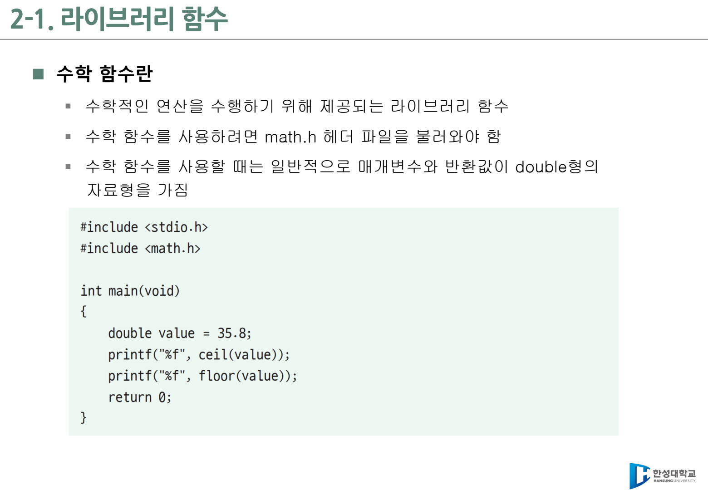

```c
#include <stdio.h>
#include <math.h>

int main(void)
{
    double value = -3.25;

    printf("ceil: %.2f\n", ceil(value));
    printf("floor: %.2f\n", floor(value));
    printf("fabs: %.2f\n", fabs(value));
    return 0;
}
```

| 함수 | 의미 | 예 |
|---|---|---|
| `ceil(x)` | 올림 | `ceil(3.2)` -> `4.0` |
| `floor(x)` | 버림 | `floor(3.8)` -> `3.0` |
| `fabs(x)` | 실수 절댓값 | `fabs(-3.25)` -> `3.25` |

Visual Studio에서는 `<math.h>`만 포함하면 대부분 바로 사용할 수 있다. 다른 컴파일 환경에서는 수학 라이브러리 링크 옵션이 필요할 수 있다.

---

## 3. 사용자 정의 함수의 구조

사용자 정의 함수는 개발자가 직접 만드는 함수다. 함수는 머리(header)와 본문(body)으로 구성된다.

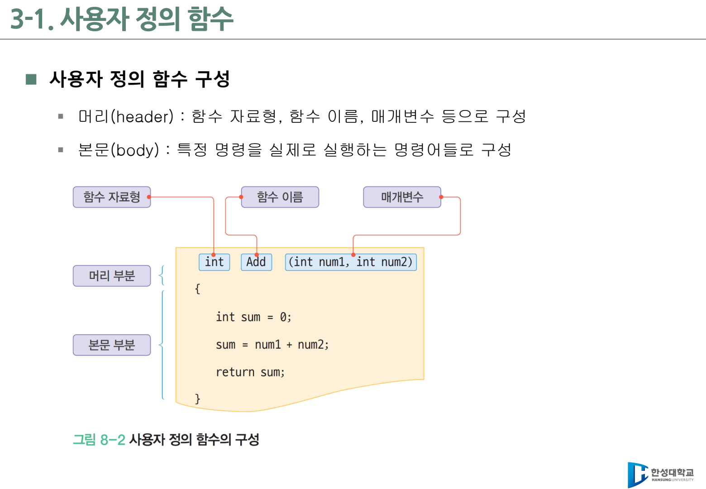

```c
int Add(int num1, int num2)
{
    int sum;
    sum = num1 + num2;
    return sum;
}
```

| 구성 요소 | 예 | 의미 |
|---|---|---|
| 반환형 | `int` | 함수가 돌려주는 값의 자료형 |
| 함수 이름 | `Add` | 함수를 호출할 때 사용하는 이름 |
| 매개변수 | `int num1, int num2` | 함수가 입력으로 받는 값 |
| 본문 | `{ ... }` | 함수가 실제로 수행하는 명령 |
| 반환문 | `return sum;` | 호출한 곳으로 결과 전달 |

### 함수 이름 짓기

좋은 함수 이름은 주석을 줄여 준다.

| 좋지 않은 이름 | 더 나은 이름 |
|---|---|
| `f1` | `input_score` |
| `abc` | `grade_fun` |
| `doit` | `print_result` |
| `calc` | `calc_average_speed` |

함수 이름은 동사 또는 동사구로 시작하면 역할이 선명해진다. 예를 들어 `input_score`, `print_result`, `showFace`, `runCommand`처럼 작성한다.

---

## 4. 함수의 선언, 호출, 정의

함수를 사용하는 과정은 보통 세 단계로 나누어 설명한다.

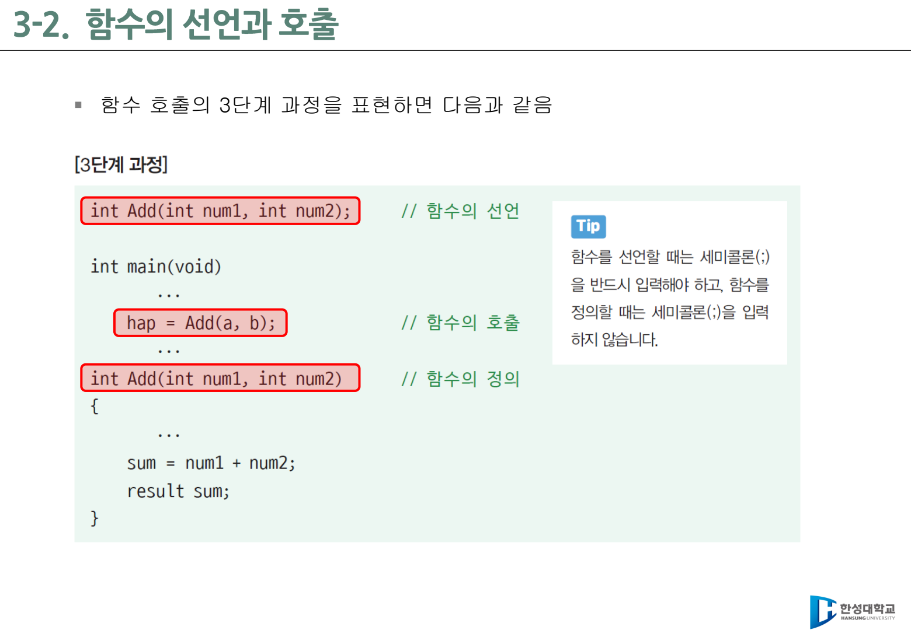

| 단계 | 의미 | 예 |
|---|---|---|
| 선언(prototype) | 컴파일러에게 함수의 형태를 미리 알림 | `int Add(int, int);` |
| 호출(call) | 함수 이름을 사용해 실행 요청 | `hap = Add(a, b);` |
| 정의(definition) | 함수가 실제로 할 일을 작성 | `int Add(int x, int y) { ... }` |

### 3단계 구조 예제

```c
#include <stdio.h>

int Add(int num1, int num2);  // 함수 선언

int main(void)
{
    int a = 10;
    int b = 20;
    int result;

    result = Add(a, b);       // 함수 호출
    printf("result = %d\n", result);
    return 0;
}

int Add(int num1, int num2)   // 함수 정의
{
    return num1 + num2;
}
```

!!! warning "세미콜론 위치"
    함수 선언에는 세미콜론이 붙는다. 함수 정의에는 세미콜론을 붙이지 않고 본문 `{ ... }`을 작성한다.

### 호출 관계

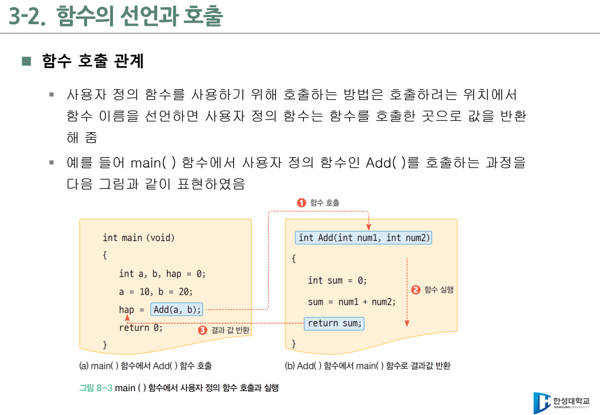

함수 호출은 잠시 다른 함수로 이동했다가, `return`을 만나면 호출한 위치로 돌아오는 흐름이다. 이 흐름을 손으로 따라갈 수 있어야 중간고사 문제에서 함수 출력 결과를 예측할 수 있다.

---

## 5. 인수와 매개변수

함수 호출에서 괄호 안에 넣는 실제 값을 인수(argument)라고 한다. 함수 정의에서 그 값을 받는 변수를 매개변수(parameter)라고 한다.

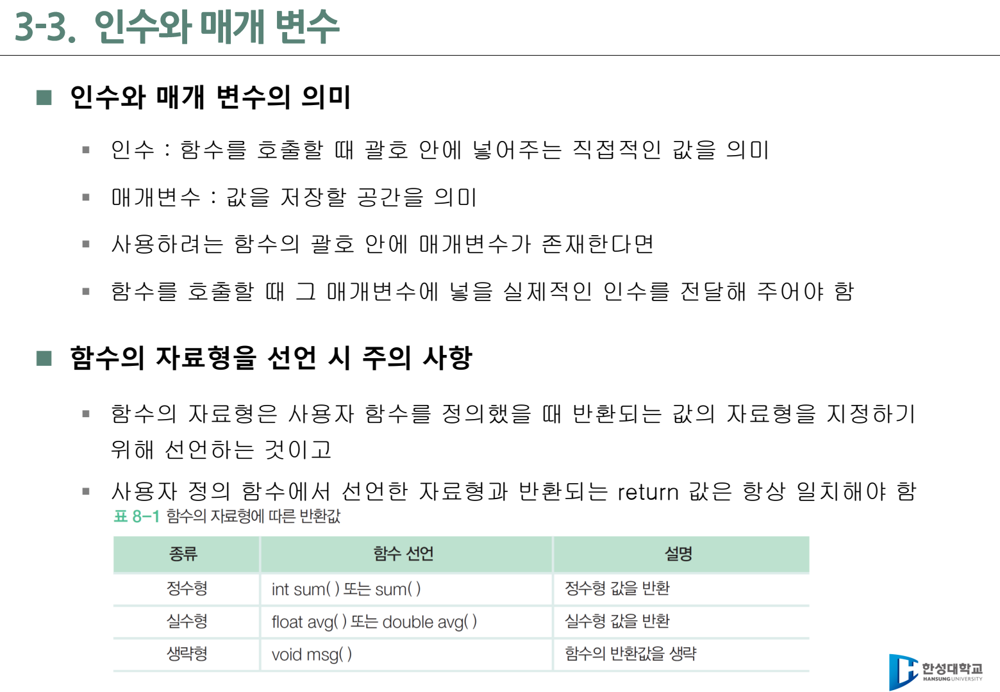

```c
int Add(int num1, int num2)
{
    return num1 + num2;
}

int main(void)
{
    int a = 10;
    int b = 20;
    int result = Add(a, b);
    return 0;
}
```

여기서 `a`, `b`는 호출하는 쪽의 인수이고, `num1`, `num2`는 함수가 받는 매개변수다.

### C 언어는 값 전달이다

C 언어는 기본적으로 값을 복사해서 함수에 전달한다. 함수 안에서 매개변수를 바꾸어도 호출한 쪽의 원본 변수는 바뀌지 않는다.

```c
#include <stdio.h>

void change(int x)
{
    x = 10;
}

int main(void)
{
    int a = 1;
    change(a);
    printf("%d\n", a);  // 1
    return 0;
}
```

원본을 바꾸려면 포인터가 필요하다. 이 내용은 12~13주차에서 다시 다룬다.

---

## 6. 매개변수와 반환값 조합

사용자 정의 함수는 매개변수와 반환값의 유무에 따라 네 가지 형태로 나눌 수 있다.

| 형태 | 예 | 설명 |
|---|---|---|
| 매개변수 있음, 반환값 있음 | `int sum_fun(int n)` | 가장 많이 쓰는 계산 함수 |
| 매개변수 있음, 반환값 없음 | `void print_grade(char grade)` | 받은 값을 출력하거나 장치를 제어 |
| 매개변수 없음, 반환값 있음 | `int input_score(void)` | 입력을 받아 결과를 돌려줌 |
| 매개변수 없음, 반환값 없음 | `void print_menu(void)` | 메뉴 출력, 도움말 출력 |

### Add 함수 실습

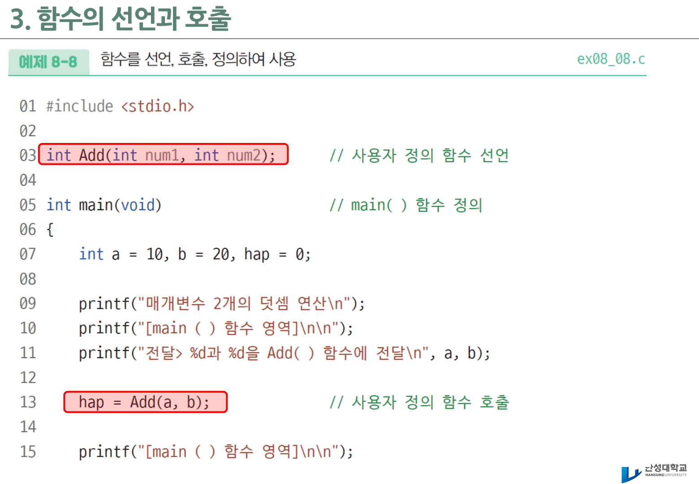

```c
int Add(int num1, int num2)
{
    return num1 + num2;
}
```

### 누적 합계 함수

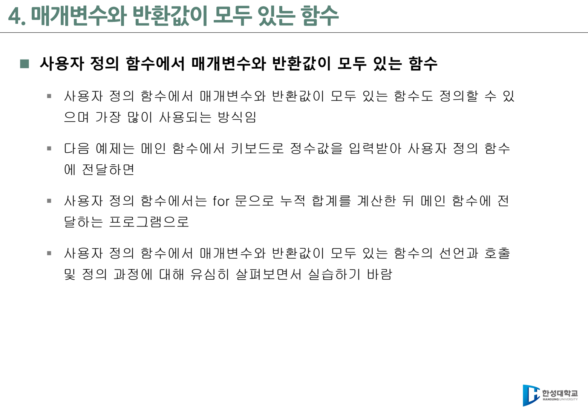

```c
int sum_to_n(int n)
{
    int hap = 0;

    for (int count = 1; count <= n; count++) {
        hap += count;
    }

    return hap;
}
```

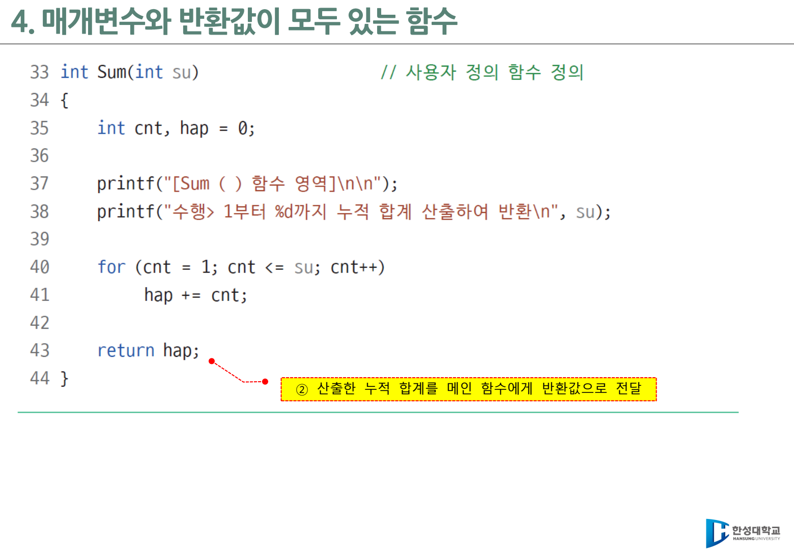

```c
int main(void)
{
    int input;
    int result;

    printf("어디까지 합계를 구할까요? ");
    scanf_s("%d", &input);

    result = sum_to_n(input);
    printf("1부터 %d까지의 합: %d\n", input, result);
    return 0;
}
```

이 실습은 6주차 반복문과 7주차 함수를 연결한다. 반복문으로 계산하는 부분을 함수로 분리하면 `main()`은 입력과 출력 흐름만 담당한다.

---

## 7. 재귀 함수

재귀 함수(recursive function)는 자기 자신을 다시 호출하는 함수다. 반복문으로 풀 수 있는 문제 중 일부는 재귀로도 표현할 수 있다.

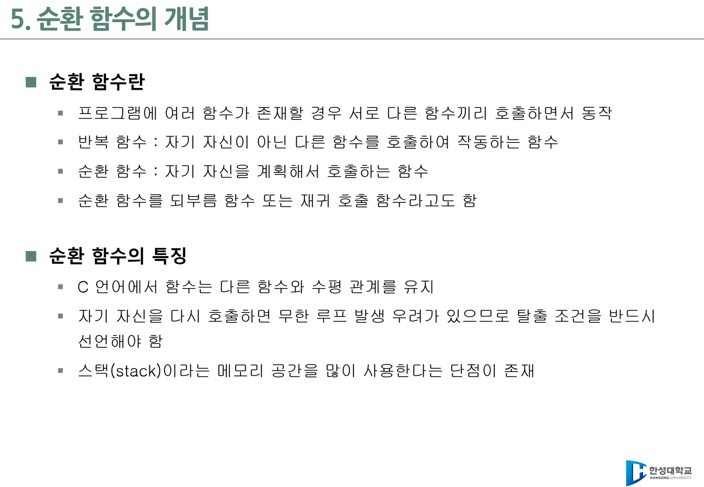

재귀 함수에는 반드시 탈출 조건이 있어야 한다. 탈출 조건이 없으면 함수가 자기 자신을 계속 호출해 스택 메모리를 많이 사용하다가 프로그램이 멈출 수 있다.

### 팩토리얼 예제

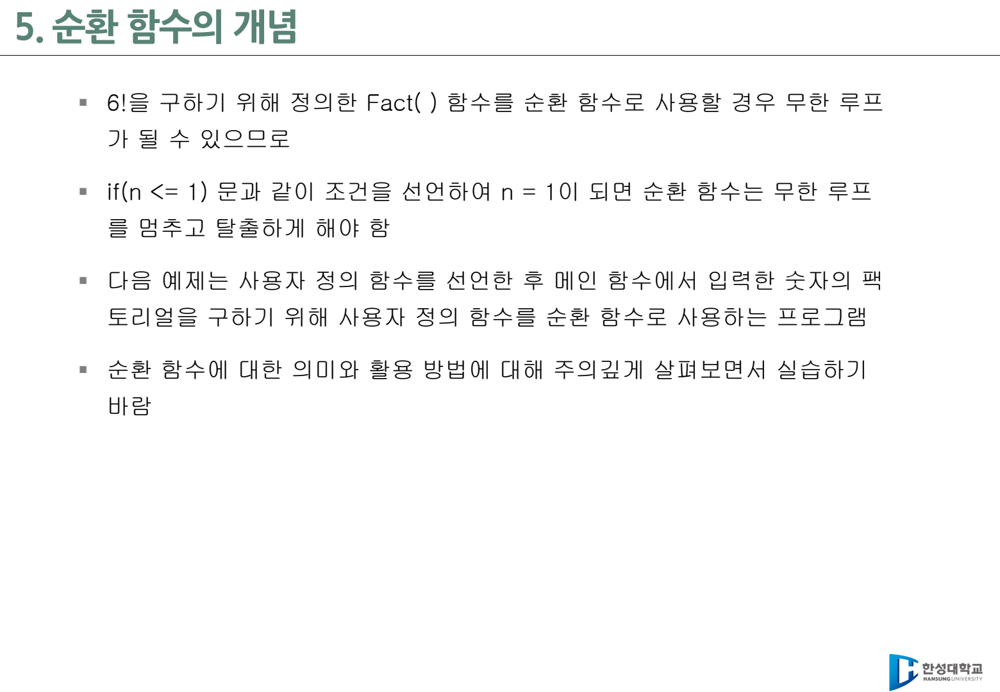

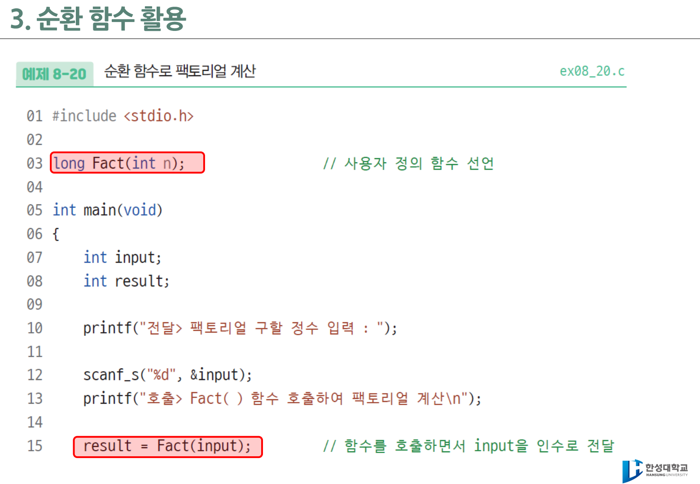

```c
#include <stdio.h>

int Fact(int n);

int main(void)
{
    int input;
    int result;

    printf("팩토리얼을 구할 숫자 입력: ");
    scanf_s("%d", &input);

    result = Fact(input);
    printf("%d! = %d\n", input, result);
    return 0;
}

int Fact(int n)
{
    if (n <= 1) {
        return 1;
    }

    return n * Fact(n - 1);
}
```

### 호출 흐름

```text
Fact(4)
-> 4 * Fact(3)
-> 4 * 3 * Fact(2)
-> 4 * 3 * 2 * Fact(1)
-> 4 * 3 * 2 * 1
```

!!! warning "재귀 함수 주의"
    재귀는 코드가 짧아 보이지만 호출이 쌓이는 구조다. 입력값이 너무 크거나 탈출 조건이 잘못되면 스택 메모리 문제가 생긴다. 처음에는 반복문 풀이와 함께 비교해 보는 것이 좋다.

---

## 8. 함수 프로젝트: 점수 입력과 등급 계산

원본 함수 실습 과제는 알고리즘, 순서도, 함수 관계도를 이용해 점수 입력-등급 계산 프로젝트를 작성하는 흐름이다.

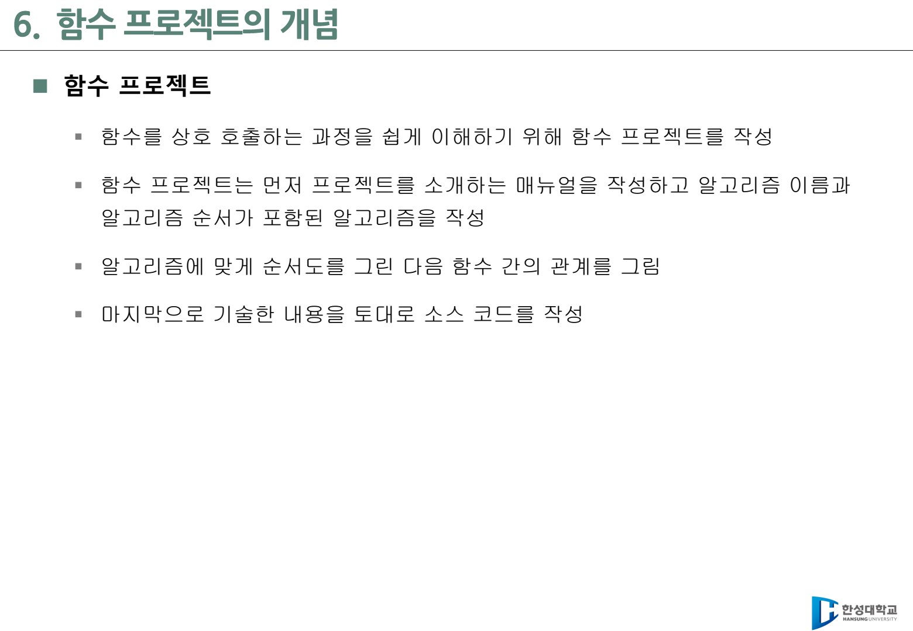

### 함수 관계도

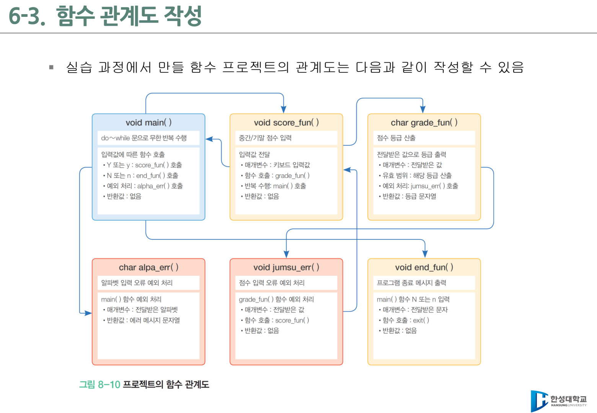

### 과제 코드 구조

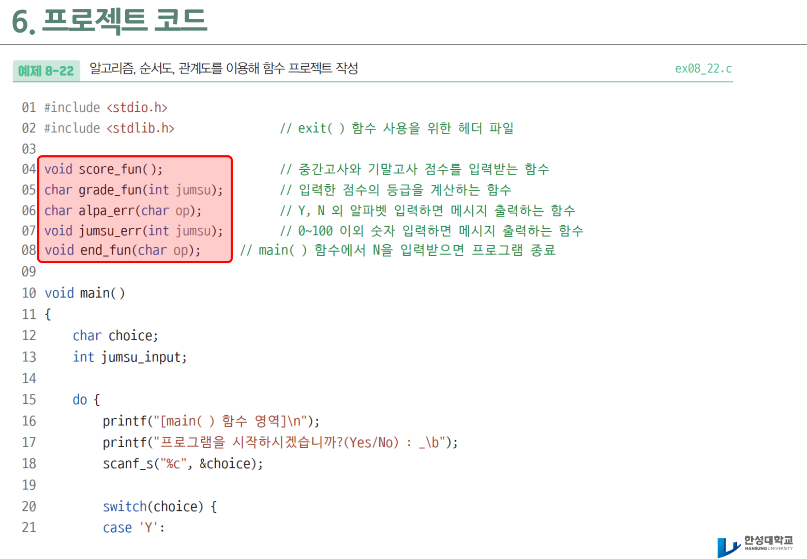

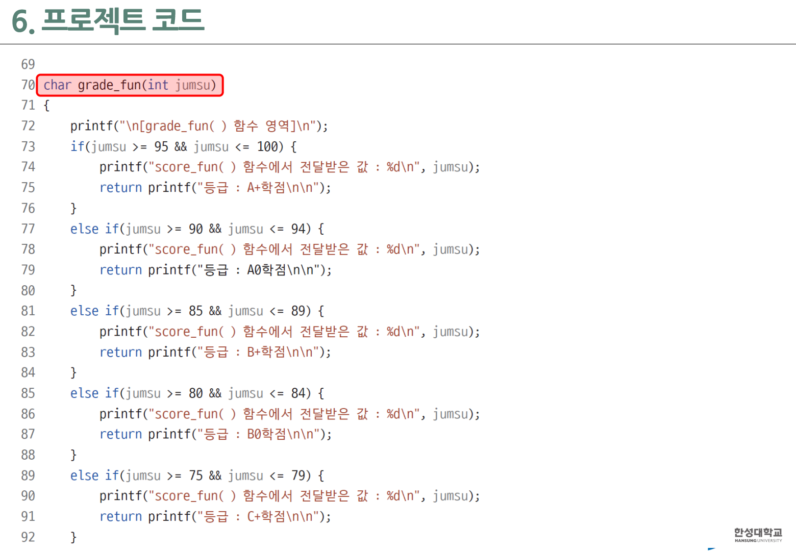

예제 파일: [`code/c/examples/ex07_function_project.c`](code/c/examples/ex07_function_project.c)

```c
int input_score(const char *label);
char grade_fun(int score);
void print_result(int midterm, int final_exam, double average, char grade);
```

이 프로젝트에서 중요한 점은 "기능별로 함수를 나눈다"는 것이다.

| 함수 | 역할 |
|---|---|
| `input_score` | 중간고사와 기말고사 점수를 입력받고 범위를 검사 |
| `grade_fun` | 평균 점수를 등급 문자로 변환 |
| `print_result` | 점수, 평균, 등급을 출력 |
| `main` | 전체 흐름 조립 |

### 함수 프로젝트 예시


```c
#include <stdio.h>

int input_score(const char *label);
char grade_fun(int score);
void print_result(int midterm, int final_exam, double average, char grade);

int main(void)
{
    int midterm = input_score("중간고사");
    int final_exam = input_score("기말고사");
    double average = (midterm + final_exam) / 2.0;
    char grade = grade_fun((int)average);

    print_result(midterm, final_exam, average, grade);
    return 0;
}
```

---

## 9. Arduino UNO R4 WiFi: 시리얼 명령을 함수로 연결

7주차의 Arduino 실습은 함수가 왜 필요한지 하드웨어로 확인하는 활동이다. 시리얼 모니터에서 한 글자를 입력하면, 그 문자에 맞는 함수가 호출되고 LED Matrix 표정이 바뀐다.

예제 파일: [`code/arduino/09_face_main/09_face_main.ino`](code/arduino/09_face_main/09_face_main.ino)

```cpp
void runCommand(char cmd) {
  switch (cmd) {
    case 'h':
      showFace(faceHappy);
      Serial.println("happy");
      break;
    case 'a':
      showFace(faceAngry);
      Serial.println("angry");
      break;
    case 'o':
      showFace(faceSurprised);
      Serial.println("surprised");
      break;
    case 'n':
      showFace(faceNeutral);
      Serial.println("neutral");
      break;
    case 'b':
      showFace(faceBlink);
      Serial.println("blink");
      break;
    default:
      Serial.println("unknown command");
      printHelp();
      break;
  }
}
```

| 입력 문자 | 호출되는 함수 | 결과 |
|---|---|---|
| `h` | `faceHappy()` | 웃는 표정 |
| `a` | `faceAngry()` | 경고 표정 |
| `o` | `faceSurprised()` | 놀란 표정 |
| `n` | `faceNeutral()` | 중립 표정 |
| `b` | `faceBlink()` | 눈 감기 |
| `?` | `printHelp()` | 명령 도움말 |

!!! note "ROS2 콜백과의 연결"
    지금은 시리얼 모니터에서 `h`를 입력하면 `faceHappy()`가 호출된다. ROS2에서는 토픽 메시지가 들어오면 콜백 함수가 호출되고, 그 안에서 제어 함수가 실행된다. 구조는 "명령 또는 메시지 -> 함수 호출"로 같다.

---

## 10. 실습 과제

### 실습 7-1 - Add 함수

두 정수를 입력받아 `Add()` 함수로 합계를 계산하고 출력한다.

필수 조건:

- 함수 선언, 호출, 정의 3단계를 모두 사용한다.
- `Add()` 함수는 매개변수 2개와 반환값 1개를 갖는다.

### 실습 7-2 - 누적 합계 함수

정수 `n`을 입력받아 `1 + 2 + ... + n`을 계산하는 `sum_to_n()` 함수를 작성한다.

확장:

- `n <= 0`이면 0을 반환한다.
- `main()`에서 입력 오류 메시지를 출력한다.

### 실습 7-3 - 라이브러리 함수 비교

다음 값을 대상으로 `ceil`, `floor`, `fabs` 결과를 표로 출력한다.

```c
double values[] = {3.2, 3.8, -3.2, -3.8};
```

### 실습 7-4 - 재귀 팩토리얼

`Fact(n)`을 재귀로 작성하고, `n = 1`, `3`, `5`, `10`일 때 결과를 확인한다.

확인 질문:

- `n <= 1` 조건을 제거하면 어떤 일이 일어나는가?
- `Fact(10)`보다 훨씬 큰 값을 입력하면 어떤 문제가 생길 수 있는가?

### 실습 7-5 - 함수 프로젝트

중간고사와 기말고사 점수를 입력받고 평균 등급을 출력한다.

필수 함수:

- `input_score`
- `grade_fun`
- `print_result`

### 실습 7-6 - Arduino 시리얼 명령 함수 추가

`09_face_main.ino`의 `runCommand()`에 새 명령을 추가한다.

| 명령 | 새 함수 | 동작 |
|---|---|---|
| `r` | `faceRapidBlink()` | 빠르게 두 번 깜박임 |
| `m` | `faceMoodCycle()` | 여러 표정을 순서대로 표시 |

---

## 11. 자주 막히는 지점

| 막히는 지점 | 설명 | 해결 방법 |
|---|---|---|
| 선언과 정의 불일치 | 반환형이나 매개변수 목록이 다르다. | 선언, 호출, 정의를 나란히 비교한다. |
| `return` 누락 | 반환형이 `int`인데 값을 돌려주지 않는다. | 반환형이 `void`인지 아닌지 먼저 확인한다. |
| 인수와 매개변수 혼동 | 호출 측 값과 함수 내부 변수를 섞어 생각한다. | 호출하는 쪽과 정의하는 쪽을 분리해 표시한다. |
| 값 전달 오해 | 함수 안에서 매개변수를 바꾸면 원본도 바뀐다고 생각한다. | C는 기본적으로 복사본을 넘긴다고 설명한다. |
| 함수 이름 부적절 | `f1`, `aaa`처럼 역할이 드러나지 않는다. | 동사 중심 이름으로 바꾼다. |
| 재귀 탈출 조건 누락 | 함수가 자기 자신을 끝없이 호출한다. | 가장 작은 문제와 종료 조건을 먼저 쓴다. |
| 전역변수 과다 사용 | 함수가 몰래 외부 상태를 바꾼다. | 매개변수와 반환값으로 의존성을 드러낸다. |

---

## 12. 형성평가 체크포인트

- [ ] 함수의 필요성을 중복 제거, 모듈화, 재사용 관점에서 설명할 수 있다.
- [ ] 라이브러리 함수 사용 시 필요한 헤더 파일을 찾을 수 있다.
- [ ] 함수 선언, 호출, 정의 3단계를 작성할 수 있다.
- [ ] 반환형과 `return` 값의 자료형을 맞출 수 있다.
- [ ] 인수와 매개변수를 구분할 수 있다.
- [ ] C의 값 전달 방식 때문에 원본 변수가 바뀌지 않는다는 점을 설명할 수 있다.
- [ ] 재귀 함수의 탈출 조건을 설명할 수 있다.
- [ ] 함수 관계도를 보고 프로그램을 여러 함수로 나눌 수 있다.
- [ ] Arduino 시리얼 명령을 함수 호출로 연결할 수 있다.

---


## 📚 참고 레퍼런스 (외부)
- 함수 https://en.cppreference.com/w/c/language/functions
- 함수 포인터 https://en.wikipedia.org/wiki/Function_pointer
- 전체 정리: [참고 자료 모음](references.md)

## 연습문제

1. 함수 선언 `int Add(int, int);`에서 마지막 세미콜론은 왜 필요한가?
2. `int Add(int a, int b)` 함수가 `return a + b;`를 실행하면 결과는 어디로 돌아가는가?
3. `void print_menu(void)`에서 앞의 `void`와 괄호 안의 `void`는 각각 무엇을 의미하는가?
4. `void change(int x){ x = 10; }`를 `int a = 1; change(a);`로 호출한 뒤 `a`는 얼마인가?
5. 재귀 함수에 탈출 조건이 없으면 어떤 문제가 생기는가?
6. `grade_fun()`이 점수를 입력까지 직접 받는 구조보다, 점수를 매개변수로 받는 구조가 좋은 이유는 무엇인가?

??? success "정답 및 해설"
    1. 함수 선언은 함수의 형태를 컴파일러에게 알려 주는 문장이므로 세미콜론으로 끝난다.
    2. 함수를 호출한 위치로 돌아간다. 예를 들어 `result = Add(a, b);`의 오른쪽 값이 된다.
    3. 앞의 `void`는 반환값이 없다는 뜻이고, 괄호 안의 `void`는 매개변수가 없다는 뜻이다.
    4. `1`이다. C는 값을 복사해서 전달하므로 함수 안의 `x`만 바뀐다.
    5. 함수 호출이 계속 쌓여 무한 호출 또는 스택 메모리 문제가 발생할 수 있다.
    6. 입력과 등급 계산의 책임이 분리되어 테스트와 재사용이 쉬워진다.

---

## 참조

- 교재 Ch08 함수
- 원본 강의자료: `8-1. 함수.pdf`, `8-2. 함수 실습.pdf`, `8-3. 함수 실습 과제.pdf`
- C 예제: [`code/c/examples/ex07_function_project.c`](code/c/examples/ex07_function_project.c)
- Arduino 예제: [`code/arduino/09_face_main/09_face_main.ino`](code/arduino/09_face_main/09_face_main.ino)
