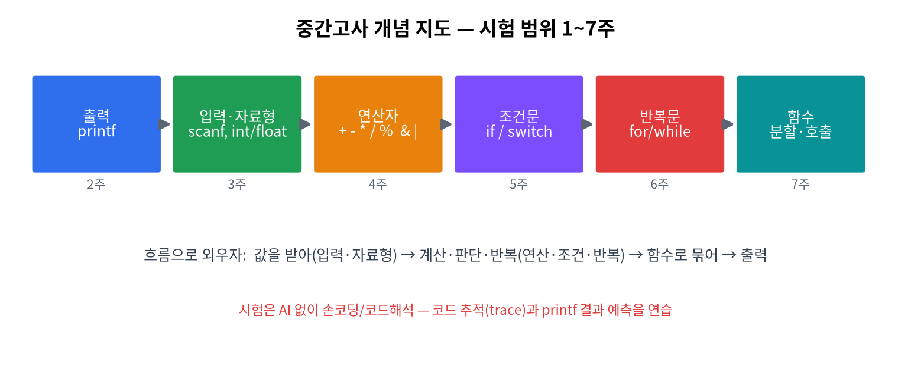

# 8주차 · 중간고사
> C언어 · 미래모빌리티학과 | CLO1 | 범위 1~7주

## 강의 해설

8주차 중간고사는 단순히 점수를 매기는 시간이 아니라, 후반부 배열·포인터·구조체로 넘어가기 전에 기본기를 점검하는 분기점이다. 1~7주차의 내용은 모두 연결되어 있다. `printf`로 값을 확인하고, `scanf_s`로 입력을 받고, 자료형과 연산자로 값을 계산하고, 조건문과 반복문으로 흐름을 만들고, 함수로 코드를 나눈다. 이 흐름을 한 문장으로 설명할 수 있으면 중간 범위의 큰 구조를 이해한 것이다.

시험 대비에서 가장 중요한 훈련은 코드 추적이다. C 시험은 "이 용어의 뜻을 쓰시오"보다 "이 코드가 실행되면 어떤 값이 되는가"가 더 중요하다. 변수 표를 직접 그리고, 반복문이 한 번 돌 때마다 값이 어떻게 변하는지 적어 보면 실수가 줄어든다. 특히 `i++`, `sum += i`, `if`의 참/거짓, 함수 호출 후 반환값을 손으로 따라가는 연습이 필요하다.

시험 후 오답은 후반부 학습의 안내판이다. 정수 나눗셈을 틀렸다면 배열 평균에서도 틀릴 가능성이 있고, `&`를 빠뜨렸다면 포인터에서 다시 막힐 가능성이 있다. 따라서 오답 노트는 점수 확인용이 아니라 9주차 이후의 약점을 미리 발견하는 도구로 사용한다.

## 평가 개요
- **범위**: 출력·입력·자료형·연산자·조건문·반복문·함수
- **형태**: 지필 + 간단 코딩(코드 해석·작성). **시험은 AI 미사용**(손코딩 능력 확인).
- **배점**: 학기 전체의 25%

## 출제 가이드(예시)
| 유형 | 비중 | 예 |
|------|------|----|
| 출력/형식 | 15% | `printf` 형식 결과 예측 |
| 자료형/연산 | 25% | 캐스팅·비트연산 결과, 우선순위 |
| 조건/반복 | 35% | 코드 추적(trace), 출력 예측, 빈칸 채우기 |
| 함수 | 25% | 함수 작성, 매개변수/반환 |

## 대비 학습법
- 1~7주 **형성평가 체크포인트**를 스스로 점검.
- 연습문제를 **AI 없이** 먼저 풀고, 막힌 곳만 [AI 활용 가이드](ai-literacy.md) 방식으로 복습.
- 코드 **추적(trace)** 연습: 변수 값이 단계마다 어떻게 바뀌는지 손으로 적기.

## 시험 후
- 오답은 AI로 복습(허용). 9주차 도입부 5분 보충.

## 형성평가(사후)
- [ ] 취약 개념 식별 · [ ] 오답 노트 작성 · [ ] 9주차 연결(스코프) 준비

---

## 모의 점검 문제 (1~7주 종합)
1. `printf("%d", 10 % 3);` 의 출력은?
2. `for(int i=1;i<=3;i++) sum+=i;` 후 `sum`은? (초기 0)
3. `char c='A'; printf("%c %d", c, c);` 의 출력은? (ASCII 'A'=65)

??? success "정답 및 해설"
    1. `1` — 10을 3으로 나눈 나머지.
    2. `6` — 1+2+3.
    3. `A 65` — `%c`는 문자, `%d`는 문자의 정수(아스키) 값.
