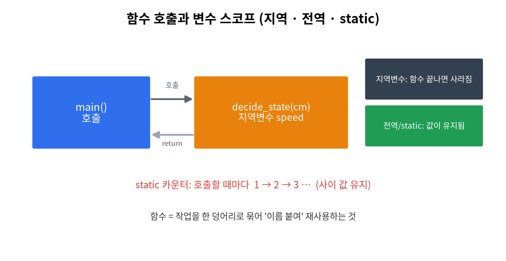
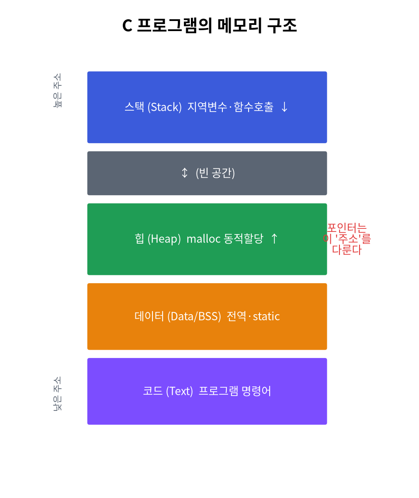

# 9주차 · 함수와 변수 (스코프)
> C언어 · 미래모빌리티학과 | CLO1·CLO2 | 교재 Ch09






## 학습 목표
- 지역변수·전역변수·`static`의 **생존범위(scope)·수명(lifetime)** 을 구분한다.
- 차량 "상태"를 유지하는 변수 패턴을 작성한다.

---

## 강의 해설

9주차는 같은 변수라도 "어디에서 보이는가"와 "언제까지 살아 있는가"가 다르다는 점을 배운다. 중간고사 전까지는 변수를 만들고 값을 넣는 데 집중했다면, 이제는 변수를 어디에 두어야 프로그램이 안전하고 이해하기 쉬운지를 생각한다. 지역변수, 전역변수, `static` 변수는 모두 값을 저장하지만 쓰임새가 다르다.

지역변수는 함수 안에서만 보이기 때문에 실수를 줄여 준다. 전역변수는 여러 함수가 함께 볼 수 있어 편하지만, 어느 함수가 값을 바꾸었는지 추적하기 어려워진다. `static` 지역변수는 함수 안에 숨어 있으면서도 호출이 끝난 뒤 값을 기억한다. 이 특성은 버튼 누른 횟수, 상태 전환 횟수, 필터 내부 상태처럼 "기억은 필요하지만 외부에는 숨기고 싶은 값"에 적합하다.

모빌리티 프로그램에서는 변수의 위치가 안정성과 직결된다. 예를 들어 현재 주행 상태를 아무 함수나 바꿀 수 있게 전역으로 열어 두면 디버깅이 어렵다. 반대로 모든 값을 지역변수로만 두면 이전 상태를 기억할 수 없다. 이번 주차는 문법 암기가 아니라 "데이터의 책임을 어디에 둘 것인가"를 배우는 시간이다.

## 1. 이론

### 1.1 스코프(scope) — 어디서 보이나
- **지역변수**: 함수(또는 블록) 안에서 선언, 그 안에서만 보임. 함수가 끝나면 사라짐.
- **전역변수**: 함수 밖에서 선언, 프로그램 어디서나 보임.
```c
int g = 0;            // 전역
void f(void) {
    int local = 1;    // 지역: f 안에서만
    g += local;
}
```

### 1.2 수명(lifetime) — 언제까지 사나
- 지역변수: 함수 호출~종료 (스택에 생성).
- 전역/`static`: 프로그램 시작~끝 (데이터 영역).

### 1.3 static 지역변수
함수가 끝나도 **값을 기억**한다(초기화는 처음 1번).
```c
void count_call(void) {
    static int n = 0;   // 호출 사이에도 유지
    n++;
    printf("호출 %d회\n", n);
}
```

### 1.4 메모리 영역(그림 참조)
| 영역 | 저장 |
|------|------|
| 스택 | 지역변수·함수 호출 |
| 힙 | 동적 할당(`malloc`) |
| 데이터/BSS | 전역·static |
| 코드 | 명령어 |

!!! tip "전역변수는 신중히"
    전역은 편하지만 **누가 언제 바꾸는지 추적이 어렵다**(버그 원인). 꼭 필요한 "상태"에만.

---

## 2. 핵심 용어 정리
| 용어 | 설명 |
|------|------|
| 스코프 | 변수가 보이는 범위 |
| 수명 | 변수가 메모리에 사는 기간 |
| 지역/전역 변수 | 함수 안 / 함수 밖 선언 |
| static | 수명을 프로그램 전체로 늘린 지역변수 |
| 스택/힙/데이터 | 메모리 영역 구분 |

---

## 3. 실습

### 실습 9-1 · 스코프 증명
같은 이름의 지역/전역 변수를 두고 어느 것이 쓰이는지 출력으로 확인.

### 실습 9-2 · static 카운터 (예제 `ex07_functions.c`)
`drive_count()`을 여러 번 불러 `static` 값이 유지·누적됨을 확인.

### 실습 9-3 · 상태머신(도전)
누적 주행거리를 `static`으로 유지하며 명령에 따라 주행/정지 모드 전환.

---

## 4. 과제
- 전역/지역/static 차이 출력 증명, (도전) 누적 주행거리 상태머신.

## 5. 참조
- 교재 Ch09 · 그림 `img/01_memory_layout.png`

## 형성평가 체크포인트
- [ ] 스코프/수명 설명 · [ ] static 동작 예측 · [ ] 전역 남용 위험 인지

---

## 연습문제
1. `static int n=0; n++; printf("%d",n);` 인 함수를 3번 호출하면 마지막 출력은?
2. 지역변수는 함수가 끝나면 어떻게 되는가?
3. 전역변수와 `static` 변수는 메모리의 어느 영역에 저장되는가?

??? success "정답 및 해설"
    1. `3` — `static`은 호출 사이에도 값을 유지(초기화는 처음 1번).
    2. **소멸**한다(스택에서 사라짐).
    3. **데이터/BSS 영역**(프로그램 종료까지 유지).

    **🖼 그림으로 복습** — 지역/전역/static 변수의 수명

    
