# 9주차 · 함수와 변수 (스코프)
> C언어 · 미래모빌리티학과 | CLO1·CLO2 | 교재 Ch09 | 원본 PDF: `9-1. 함수와 변수`, `9-2. 함수와 변수 실습`

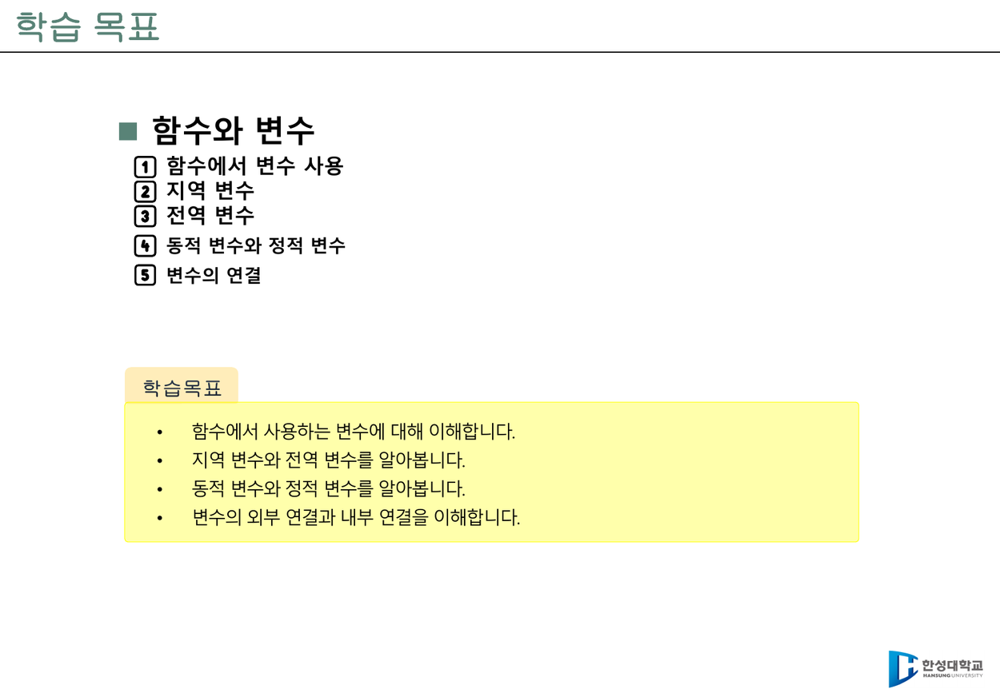

## 학습 목표

- 함수에서 변수를 사용할 때 **선언 위치**가 의미하는 바를 설명할 수 있다.
- 지역변수(local variable)와 전역변수(global variable)의 사용 범위와 수명을 구분할 수 있다.
- 지역변수를 초기화하지 않았을 때 생기는 문제를 설명하고 수정할 수 있다.
- 매개변수가 함수 안에서 지역변수처럼 동작한다는 점을 이해할 수 있다.
- 전역변수와 지역변수의 이름이 같을 때 어떤 변수가 우선되는지 예측할 수 있다.
- `auto`, `static`, `extern`, `register`의 기본 의미와 사용 주의점을 설명할 수 있다.
- Arduino UNO R4 WiFi와 ROS2 예제에서 상태를 어느 변수에 저장해야 하는지 판단할 수 있다.

---

## 이번 주차의 큰 그림

7주차에서 함수로 코드를 나누는 방법을 배웠다. 9주차에서는 함수 안팎에 있는 변수가 **어디에서 보이고, 언제 만들어지고, 언제 사라지는지**를 배운다. 같은 `int count`라도 함수 안에 있으면 지역변수이고, 함수 밖에 있으면 전역변수다. `static`이 붙으면 보이는 범위는 좁게 유지하면서 값은 오래 기억하게 만들 수도 있다.

모빌리티·로봇 프로그램에서는 이 차이가 중요하다. 예를 들어 로봇의 현재 상태(`RUN`, `STOP`)를 아무 함수나 바꿀 수 있는 전역변수로 두면 편하다. 하지만 어느 함수가 언제 상태를 바꾸었는지 찾기 어려워진다. 반대로 모든 값을 지역변수로만 두면 함수가 끝날 때 값이 사라져 이전 상태를 기억할 수 없다. 이번 주차의 핵심 질문은 다음과 같다.

```text
이 값은 어디에서 읽고 쓰는가?
이 값은 다음 함수 호출 때도 기억되어야 하는가?
이 값은 다른 소스 파일에서도 보여야 하는가?
```

이 세 질문에 답할 수 있으면 지역변수, 전역변수, 정적 변수, 외부 연결을 훨씬 안정적으로 사용할 수 있다.

!!! tip "교수자 설명 포인트"
    변수는 값을 저장하는 그릇이지만, 그 그릇을 어디에 놓느냐가 설계다. 지역변수는 안전하고, 전역변수는 편하며, `static` 지역변수는 숨겨진 기억장치처럼 동작한다. 편한 선택이 항상 좋은 설계는 아니라는 점을 예제로 보여 준다.

---

## 3시간 강의 운영안

| 시간 | 내용 | 교수자 진행 포인트 | 학생 활동 |
|---:|---|---|---|
| 0~10분 | 7주차 함수 복습 | `main()`에서 함수를 호출할 때 값이 어떻게 전달되는지 확인 | 함수 호출 흐름 다시 그리기 |
| 10~25분 | 변수의 속성 | 변수의 선언 위치가 사용 범위와 수명을 결정한다는 큰 그림 설명 | 코드에서 지역/전역 표시 |
| 25~45분 | 지역변수 | 블록 `{}` 안에서만 보이는 범위, for문 안 변수 오류 설명 | `sum` 오류 코드 수정 |
| 45~65분 | 지역변수 초기화 | 초기화하지 않은 지역변수의 위험, Visual Studio 경고 확인 | 초기화 누락 찾기 |
| 65~80분 | 매개변수 | 매개변수는 함수 호출 때 인수 값으로 초기화되는 지역변수임을 설명 | 값 전달 결과 예측 |
| 80~105분 | 전역변수 | 프로그램 시작부터 종료까지 유지, 자동 0 초기화, 공유 상태 설명 | 전역변수 사용 예제 실행 |
| 105~120분 | 이름 가림 | 지역변수가 전역변수보다 우선되는 예제 추적 | 출력값 손으로 예측 |
| 120~140분 | auto/static | 동적 변수와 정적 변수의 생성·소멸, `static` 카운터 실습 | 호출 횟수 출력 비교 |
| 140~160분 | extern/static 전역 | 외부 연결과 내부 연결, 여러 소스 파일 프로젝트 설명 | `extern` 선언 위치 표시 |
| 160~170분 | register | 현대 C에서 거의 쓰지 않는 이유와 주소 연산자 제한 설명 | `&register변수` 오류 예측 |
| 170~180분 | Arduino/ROS2 연결 | 상태 변수, 누적 카운터, 콜백 상태 관리로 확장 | 상태 저장 위치 토론 |

---

## 이론-실습 연결표

| 이론 개념 | 바로 해볼 실습 | 확인 질문 |
|---|---|---|
| 스코프는 이름이 보이는 범위다 | 블록 안팎에서 같은 변수명을 사용해 본다 | 어느 줄에서 어떤 변수가 보이는가? |
| 생명주기는 변수가 살아 있는 시간이다 | local, global, static 카운터를 비교한다 | 함수가 끝난 뒤에도 값이 남는 변수는 무엇인가? |
| 전역변수는 공유되지만 위험하다 | Arduino 상태값을 전역/지역/static으로 바꿔 본다 | 누가 값을 바꾸었는지 추적하기 쉬운 구조인가? |
| ROS2 콜백 상태 | 콜백이 공유 상태를 읽고 쓰는 상황을 표로 그린다 | 상태를 어디에 두어야 안전하게 설명할 수 있는가? |

## 1. 변수의 속성: 위치가 의미를 만든다

원본 강의자료는 먼저 지역 변수와 전역 변수를 선언 위치로 구분한다.

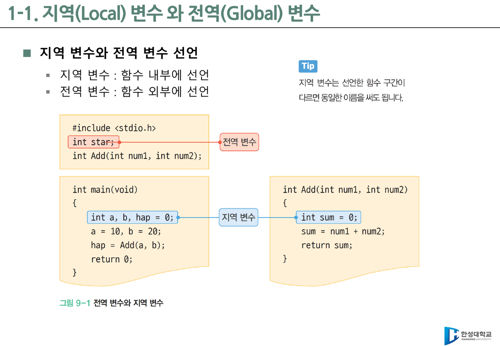

변수의 속성은 크게 네 관점으로 나누어 볼 수 있다.

| 관점 | 질문 | 대표 예 |
|---|---|---|
| 스코프(scope) | 이 이름을 어디에서 볼 수 있는가? | 블록 안, 함수 안, 파일 전체 |
| 수명(lifetime) | 이 값은 언제 만들어지고 언제 사라지는가? | 함수 호출 중, 프로그램 전체 |
| 저장 방식(storage duration) | 어느 메모리 영역에 저장되는가? | 스택, 데이터 영역 |
| 연결(linkage) | 다른 소스 파일에서도 같은 이름을 연결할 수 있는가? | `extern`, `static` 전역 |

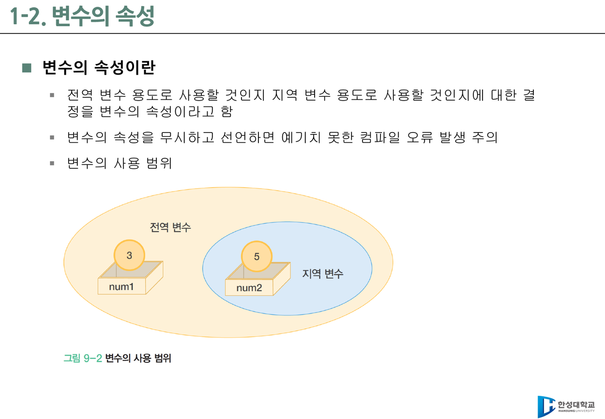

처음에는 스코프와 수명만 확실히 구분해도 충분하다. 스코프는 "이름이 보이는 범위"이고, 수명은 "값이 살아 있는 시간"이다.

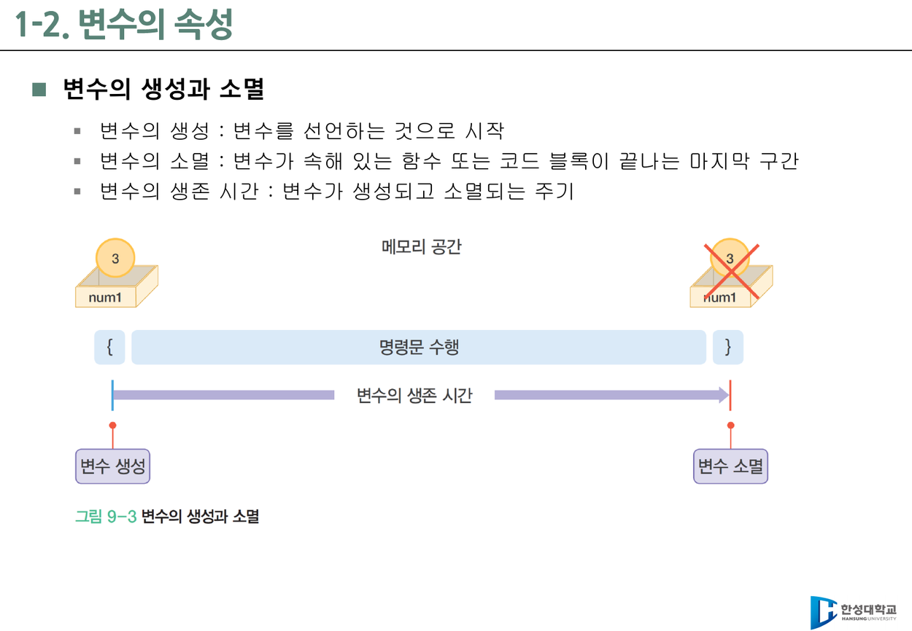

```c
void example(void)
{
    int local = 10;  // example 함수 안에서만 이름이 보인다.
}                   // 여기서 local의 수명이 끝난다.
```

---

## 2. 지역변수: 가까운 곳에서만 보이는 안전한 변수

지역변수(local variable)는 함수 또는 코드 블록 안에서 선언한 변수다. 선언된 블록을 벗어나면 이름도 사용할 수 없고, 일반 지역변수의 값도 사라진다.

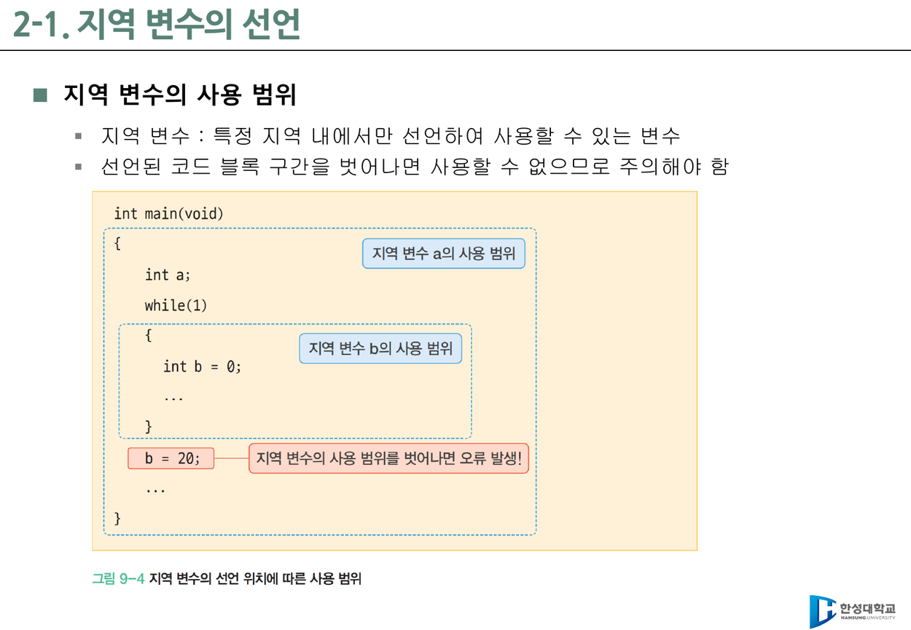

### 2.1 지역변수 오류 예시: 블록 밖에서 사용

다음 예제는 `for`문 안에서 선언한 `sum`을 반복문 밖에서 출력하려고 하므로 오류가 난다.

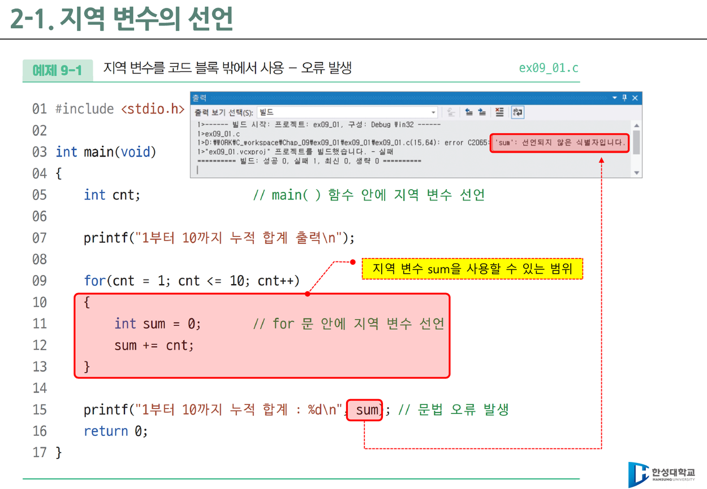

```c
#include <stdio.h>

int main(void)
{
    int cnt;

    for (cnt = 1; cnt <= 10; cnt++) {
        int sum = 0;
        sum += cnt;
    }

    printf("sum = %d\n", sum);  // 오류: sum은 여기서 보이지 않는다.
    return 0;
}
```

문법 오류를 고치려면 `sum`을 반복문 밖에서 선언해야 한다. 그리고 누적 합계가 필요하므로 반복문이 시작되기 전에 한 번만 0으로 초기화해야 한다.

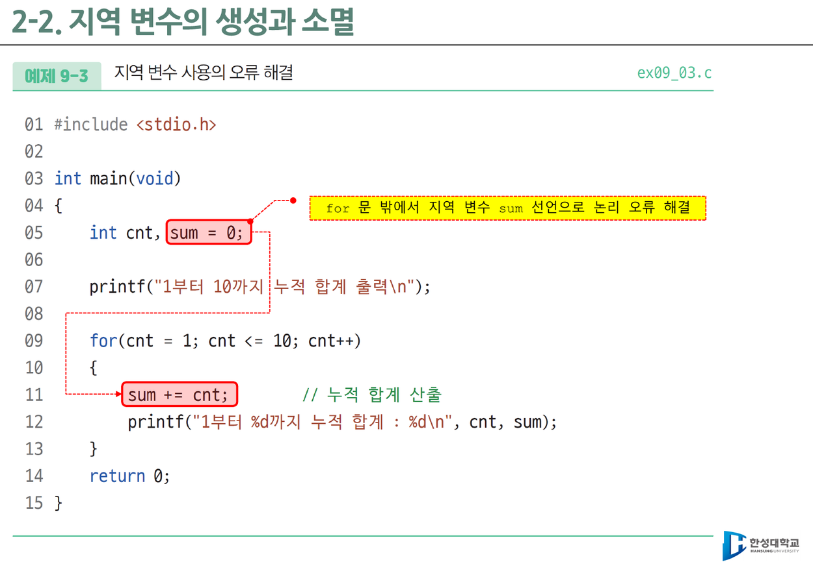

```c
#include <stdio.h>

int main(void)
{
    int cnt;
    int sum = 0;

    for (cnt = 1; cnt <= 10; cnt++) {
        sum += cnt;
    }

    printf("1부터 10까지 누적 합계: %d\n", sum);
    return 0;
}
```

!!! warning "초기화 위치를 같이 봐야 한다"
    `sum`을 반복문 안에 두면 매 반복마다 새로 만들어진다. 누적을 원하면 반복문 밖에서 한 번만 초기화해야 한다. 지역변수의 범위와 초기화 위치를 함께 판단해야 한다.

### 2.2 지역변수 초기화

지역변수는 자동으로 0이 된다고 생각하면 안 된다. 전역변수와 정적 변수는 초기화하지 않으면 0으로 시작하지만, 일반 지역변수는 초기화하지 않고 읽으면 쓰레기값이 될 수 있다.

```c
void bad_example(void)
{
    int count;
    printf("%d\n", count);  // 초기화하지 않은 값을 읽는다.
}
```

수업에서는 다음 원칙을 사용한다.

| 상황 | 권장 |
|---|---|
| 합계 | `int sum = 0;` |
| 개수 | `int count = 0;` |
| 최댓값 | 첫 입력값으로 초기화하거나 충분히 작은 값으로 초기화 |
| 상태 | 명확한 초기 상태 지정, 예: `int state = 0;` |

### 2.3 매개변수도 지역변수처럼 동작한다

함수의 매개변수(parameter)는 함수가 호출될 때 인수(argument)의 값으로 초기화되는 지역변수라고 볼 수 있다.

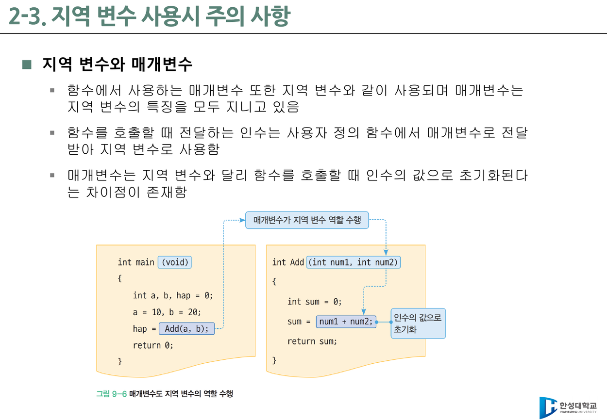

```c
void change(int value)
{
    value = 100;
}

int main(void)
{
    int score = 70;
    change(score);
    printf("%d\n", score);  // 70
    return 0;
}
```

`change()` 안의 `value`는 `score`의 복사본이다. 함수 안에서 `value`를 바꾸어도 `main()`의 `score`는 바뀌지 않는다. 이것이 C 언어의 값 전달(call by value)이다.

---

## 3. 전역변수: 여러 함수가 공유하지만 조심해야 하는 변수

전역변수(global variable)는 함수 밖에서 선언한다. 같은 소스 파일 안의 여러 함수에서 접근할 수 있다.

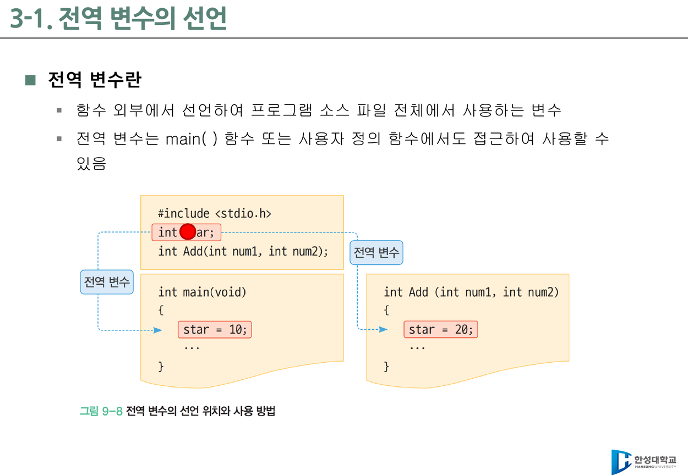

```c
#include <stdio.h>

int g_count = 0;  // 전역변수

void add_count(void)
{
    g_count++;
}

int main(void)
{
    add_count();
    add_count();
    printf("%d\n", g_count);  // 2
    return 0;
}
```

### 3.1 전역변수의 생성과 소멸

전역변수는 프로그램 시작과 함께 만들어지고 프로그램이 끝날 때 사라진다. 초기값을 쓰지 않으면 컴파일러가 0으로 초기화한다.

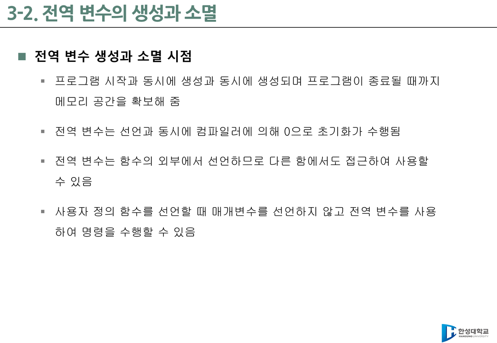

| 변수 | 선언 위치 | 초기화하지 않았을 때 | 수명 |
|---|---|---|---|
| 일반 지역변수 | 함수/블록 안 | 쓰레기값 가능 | 블록 실행 중 |
| 전역변수 | 함수 밖 | 0 | 프로그램 전체 |
| 정적 지역변수 | 함수/블록 안 + `static` | 0 | 프로그램 전체 |

### 3.2 전역변수가 편한 경우와 위험한 경우

전역변수는 여러 함수가 같은 상태를 공유해야 할 때 편하다. 예를 들어 Arduino에서 현재 주행 상태를 여러 함수가 읽어야 한다면 전역변수를 둘 수 있다.

```c
int current_state = 0;  // 0=STOP, 1=RUN

void stop_robot(void)
{
    current_state = 0;
}

void run_robot(void)
{
    current_state = 1;
}
```

하지만 전역변수는 아무 함수나 값을 바꿀 수 있으므로 디버깅이 어려워진다. 규모가 커질수록 다음 질문을 해야 한다.

- 이 값은 정말 여러 함수가 직접 바꿔야 하는가?
- 함수의 매개변수와 반환값으로 표현할 수 없는가?
- 전역변수를 바꾸는 함수를 한두 개로 제한할 수 있는가?

!!! tip "수업 기준"
    전역변수는 "공유해야 하는 상태"에만 사용한다. 임시 계산값, 합계, 반복 횟수처럼 한 함수 안에서 끝나는 값은 지역변수로 둔다.

---

## 4. 이름이 같으면 지역변수가 전역변수를 가린다

전역변수와 지역변수 이름이 같을 수는 있지만, 좋은 습관은 아니다. 같은 이름이 겹치면 가장 가까운 블록의 지역변수가 우선된다.

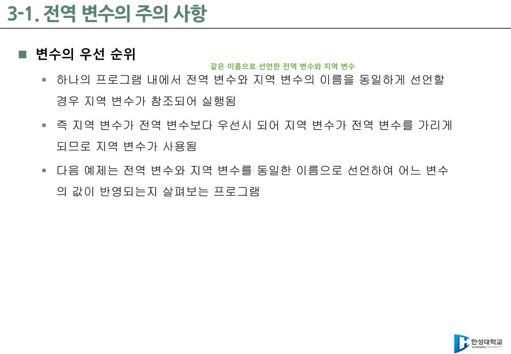

```c
#include <stdio.h>

int number = 3;

void print_number(void)
{
    int number = 8;
    printf("%d\n", number);  // 8
}

int main(void)
{
    print_number();
    printf("%d\n", number);  // 3
    return 0;
}
```

이 현상을 이름 가림(shadowing)이라고 한다. 수업에서는 같은 이름을 일부러 겹치게 만들지 않는 것을 원칙으로 한다.

| 나쁜 이름 겹침 | 더 나은 이름 |
|---|---|
| 전역 `count`, 지역 `count` | 전역 `g_total_count`, 지역 `count` |
| 전역 `state`, 지역 `state` | 전역 `current_state`, 지역 `next_state` |
| 전역 `sum`, 지역 `sum` | 지역변수만 사용하거나 역할별 이름 사용 |

---

## 5. 동적 변수(auto)와 정적 변수(static)

원본 자료에서는 지역변수처럼 블록이 끝나면 자동으로 사라지는 변수를 동적 변수(automatic variable) 또는 자동 변수라고 설명한다.

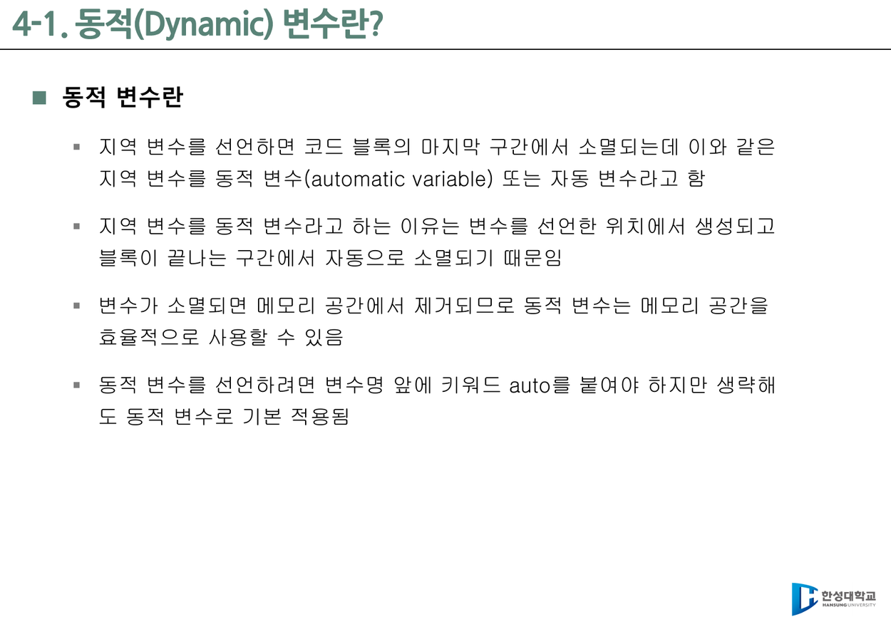

`auto` 키워드를 붙일 수 있지만, 일반 지역변수는 기본적으로 `auto`이므로 보통 생략한다.

```c
void example(void)
{
    auto int a = 10;  // 가능하지만 거의 쓰지 않는다.
    int b = 20;       // 일반적으로 이렇게 쓴다.
}
```

### 5.1 정적 변수(static variable)

정적 변수는 `static` 키워드를 사용한다. 지역변수에 `static`을 붙이면 함수 안에서만 보이지만 프로그램이 끝날 때까지 값이 유지된다.

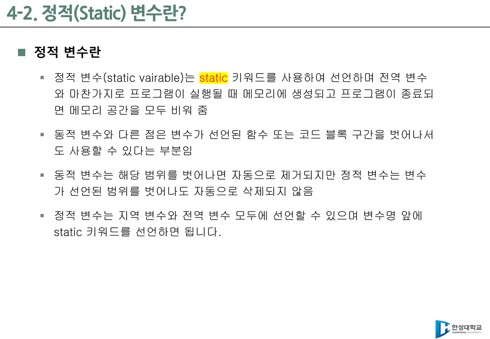

```c
#include <stdio.h>

void count_call(void)
{
    static int count = 0;
    count++;
    printf("count = %d\n", count);
}

int main(void)
{
    count_call();  // count = 1
    count_call();  // count = 2
    count_call();  // count = 3
    return 0;
}
```

### 5.2 static 초기화

정적 변수는 초기화하지 않으면 0으로 초기화된다. 그리고 초기화는 프로그램 실행 중 한 번만 일어난다.

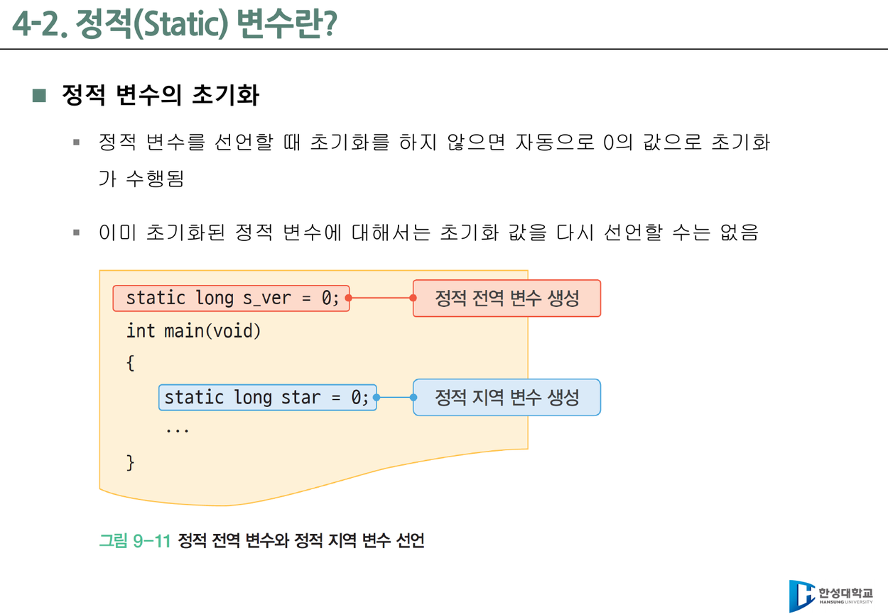

다음 그림처럼 일반 동적 변수는 함수가 호출될 때마다 다시 만들어지지만, 정적 변수는 이전 값을 기억한다.

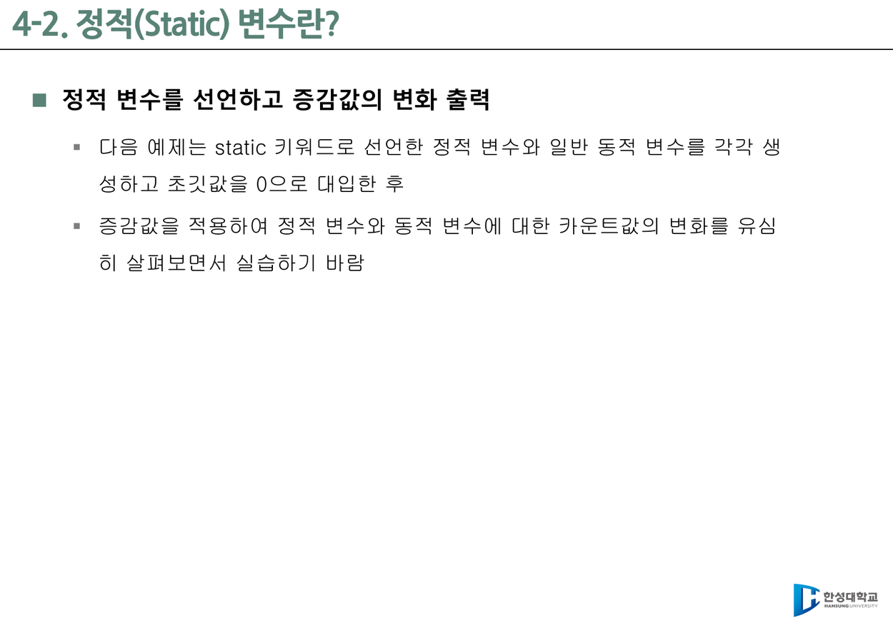

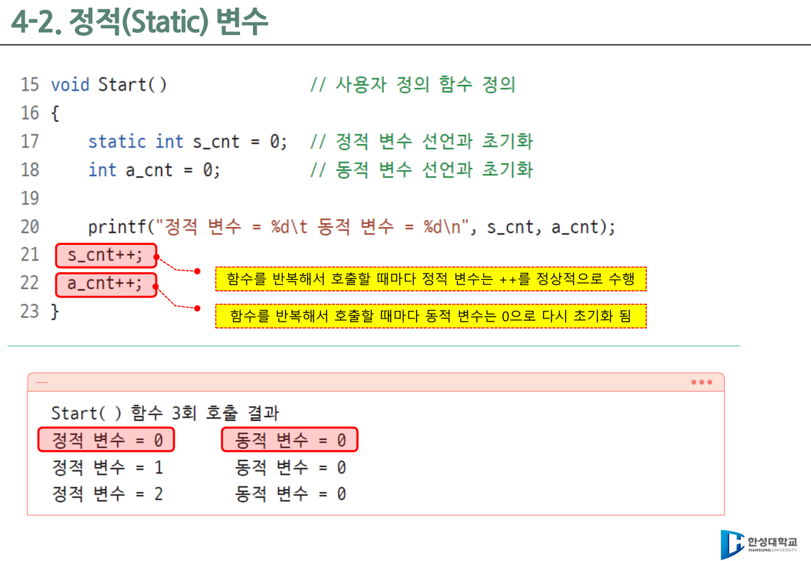

| 구분 | 일반 지역변수 | static 지역변수 |
|---|---|---|
| 보이는 범위 | 블록 안 | 블록 안 |
| 수명 | 블록 실행 중 | 프로그램 전체 |
| 초기화 | 직접 해야 안전 | 생략 시 0, 한 번만 초기화 |
| 대표 사용 | 임시 계산 | 호출 횟수, 누적 상태, 내부 캐시 |

!!! warning "static은 숨겨진 상태다"
    `static` 지역변수는 함수 밖에서 직접 볼 수 없어 깔끔하지만, 호출 사이 값이 남는다. 테스트할 때는 이전 호출의 영향이 다음 호출에 이어진다는 점을 반드시 고려해야 한다.

---

## 6. 변수의 연결: extern과 static 전역

규모가 큰 프로젝트는 소스 파일을 여러 개로 나눈다. 이때 한 파일의 전역변수를 다른 파일에서 사용할지, 아니면 한 파일 안에 숨길지를 결정해야 한다.

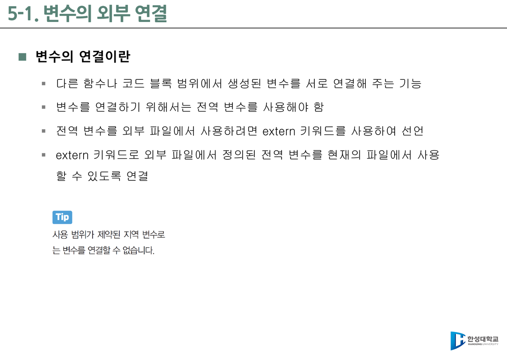

### 6.1 외부 연결(external linkage)

`extern`은 다른 소스 파일에 정의된 전역변수를 현재 파일에서 사용하겠다고 알리는 선언이다.

```c
/* sensor.c */
int g_sensor_count = 0;

void update_sensor_count(void)
{
    g_sensor_count++;
}
```

```c
/* main.c */
#include <stdio.h>

extern int g_sensor_count;
void update_sensor_count(void);

int main(void)
{
    update_sensor_count();
    printf("%d\n", g_sensor_count);
    return 0;
}
```

여기서 `sensor.c`에는 실제 저장 공간이 있고, `main.c`의 `extern int g_sensor_count;`는 "다른 파일에 있는 그 변수를 쓰겠다"는 약속이다.

### 6.2 내부 연결(internal linkage)

전역변수 앞에 `static`을 붙이면 그 변수는 해당 소스 파일 안에서만 보인다.

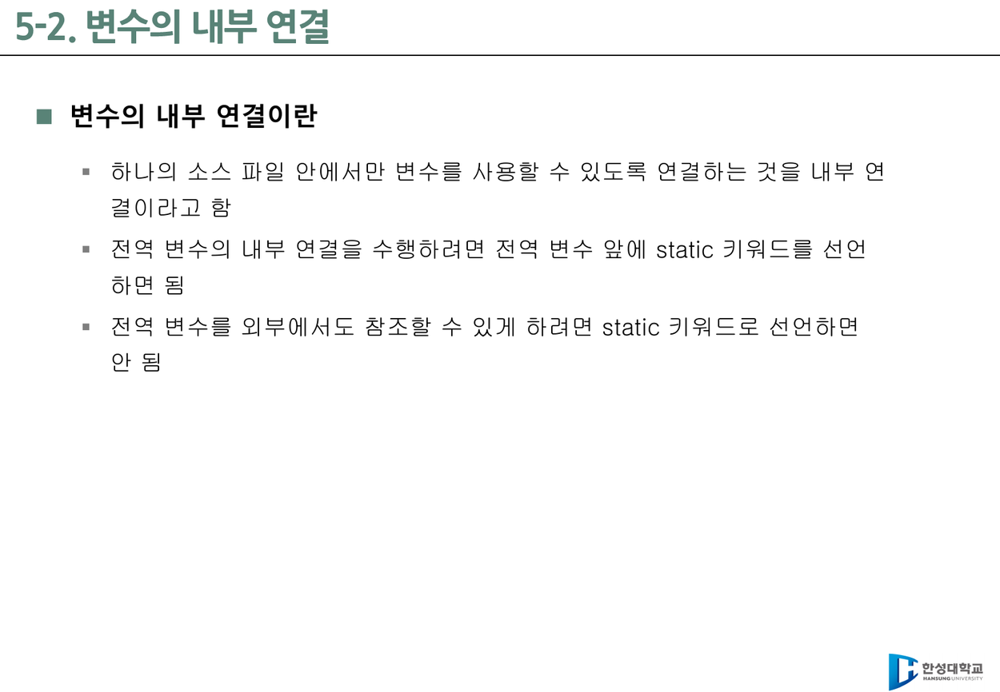

```c
/* motor.c */
static int motor_error_count = 0;

void record_motor_error(void)
{
    motor_error_count++;
}
```

이렇게 하면 다른 파일에서 `extern int motor_error_count;`로 가져올 수 없다. 파일 내부 구현 세부사항을 숨길 때 사용한다.

### 6.3 여러 소스 파일 프로젝트의 그림

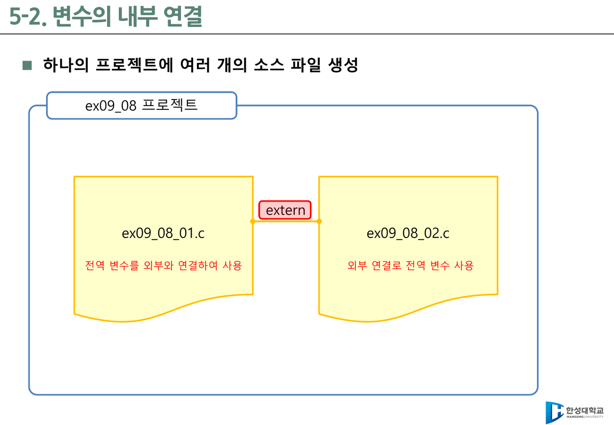

원본 실습의 도전 문제는 전역 변수, 정적 전역 변수, 외부 함수 선언을 구분해 주석으로 표시하는 활동이다.

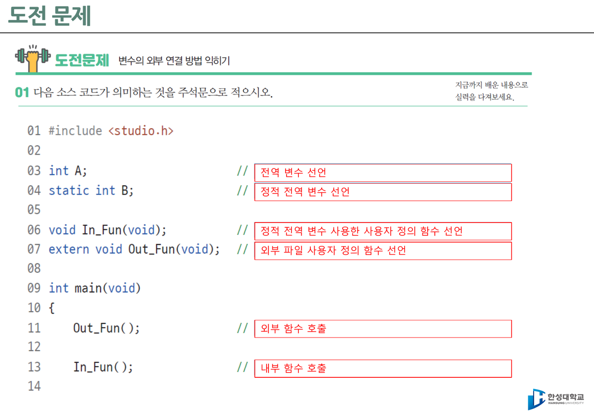

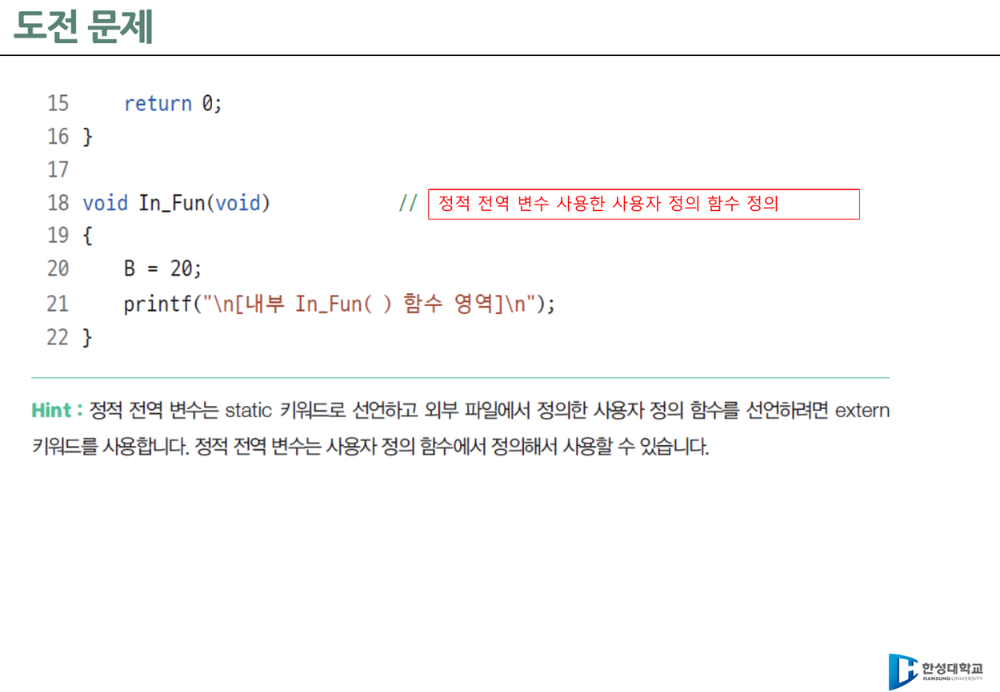

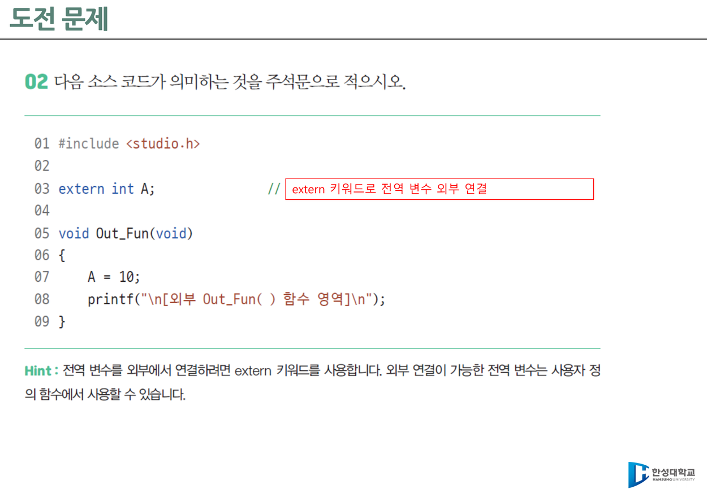

!!! note "실무식 정리"
    여러 파일에서 공유해야 하는 전역변수는 가능하면 줄이고, 꼭 필요하다면 `extern` 선언을 헤더 파일에 모아 관리한다. 파일 내부에서만 쓰는 전역변수와 보조 함수는 `static`으로 숨겨 충돌을 줄인다.

---

## 7. register 변수

`register` 변수는 CPU 레지스터 사용을 컴파일러에게 요청하는 키워드다.

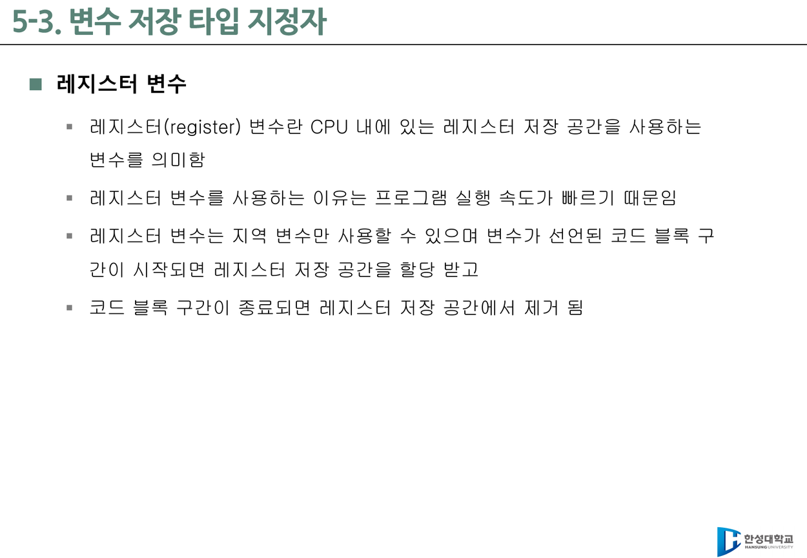

예전에는 반복문에서 자주 쓰는 값을 레지스터에 두면 빠를 수 있었다. 하지만 현대 컴파일러는 최적화를 스스로 잘 수행하므로 초급 수업에서는 거의 쓰지 않는다.

```c
void example(void)
{
    register int count = 0;
    count++;
}
```

주의할 점은 `register` 변수에는 주소 연산자 `&`를 사용할 수 없다는 것이다.

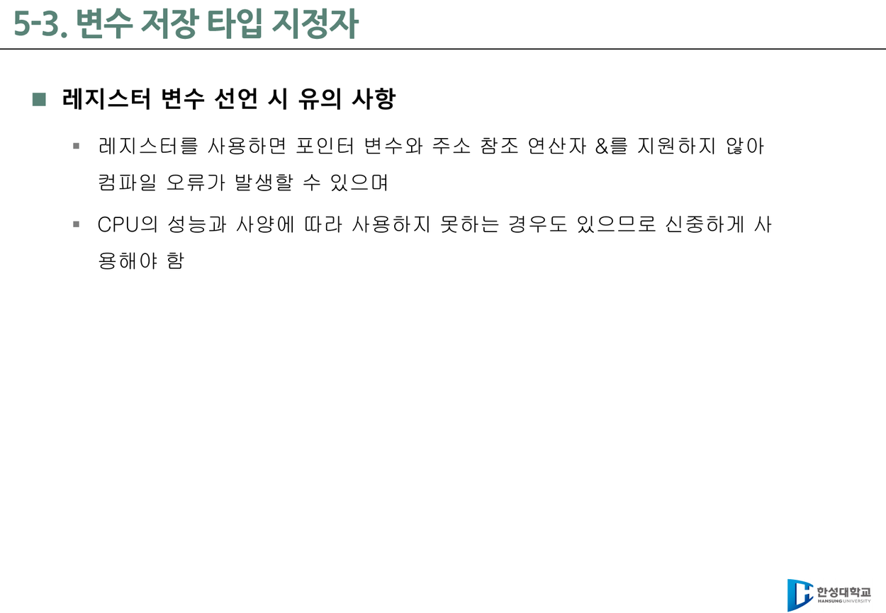

```c
void bad_example(void)
{
    register int count = 0;
    int *ptr = &count;  // 오류 가능: register 변수의 주소를 얻을 수 없다.
}
```

수업에서는 `register`를 "과거 최적화 힌트이며, 포인터와 주소 연산에서 제약이 있다" 정도로 이해하면 충분하다.

---

## 8. 메모리 영역으로 다시 정리

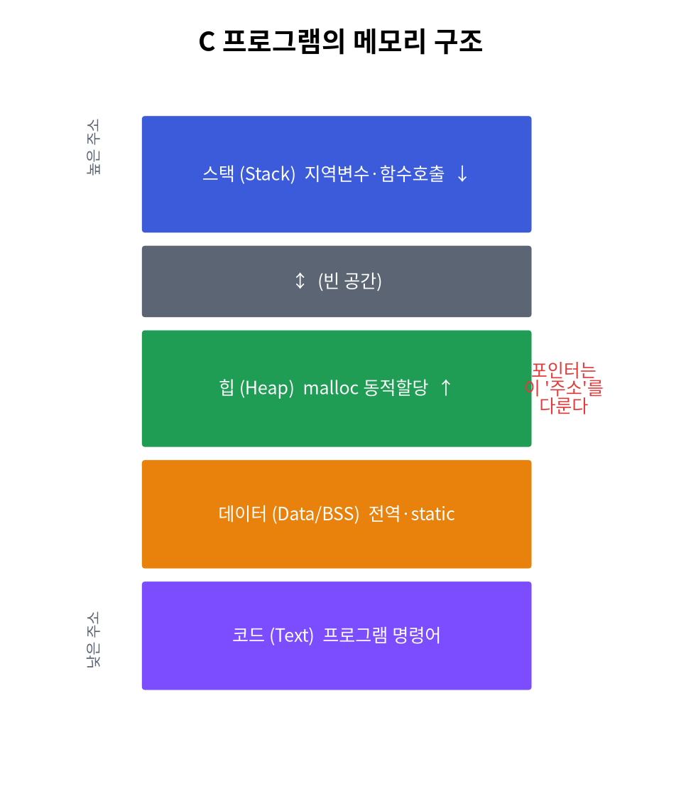

| 메모리 영역 | 대표 저장 대상 | 9주차와의 연결 |
|---|---|---|
| 코드 영역 | 프로그램 명령어 | 함수의 실행 코드 |
| 데이터/BSS 영역 | 전역변수, `static` 변수 | 프로그램 전체 수명 |
| 힙 영역 | `malloc` 등 동적 할당 | 12주차 이후 심화 |
| 스택 영역 | 일반 지역변수, 매개변수, 함수 호출 정보 | 함수 호출 중 수명 |

스택에 있는 지역변수는 함수가 끝나면 사라진다. 데이터 영역에 있는 전역변수와 정적 변수는 프로그램이 끝날 때까지 남는다. 따라서 `static` 지역변수는 "보이는 범위는 지역변수처럼 좁지만, 수명은 전역변수처럼 긴 변수"라고 정리할 수 있다.

---

## 9. C 실습 예제: 한 파일에서 차이를 눈으로 확인

예제 파일: [`code/c/examples/ex09_scope_lifetime.c`](code/c/examples/ex09_scope_lifetime.c)

```c
#include <stdio.h>

int global_count = 0;

void local_counter(void);
void static_counter(void);
void global_counter(void);
void shadowing_demo(void);
void parameter_demo(int value);

int main(void)
{
    local_counter();
    local_counter();

    static_counter();
    static_counter();

    global_counter();
    global_counter();

    shadowing_demo();

    int score = 70;
    parameter_demo(score);
    printf("main score = %d\n", score);
    return 0;
}
```

예상 출력의 핵심은 다음과 같다.

| 함수 | 변수 위치 | 두 번 호출했을 때 |
|---|---|---|
| `local_counter` | 일반 지역변수 | 매번 1 |
| `static_counter` | static 지역변수 | 1, 2 |
| `global_counter` | 전역변수 | 1, 2 |
| `parameter_demo` | 매개변수 | 함수 안 값만 바뀜 |

---

## 10. Arduino UNO R4 WiFi 연결: 상태는 어디에 둘까?

Arduino에서는 `loop()`가 계속 반복 호출된다. 따라서 "이전 반복에서 무슨 일이 있었는지"를 기억해야 하는 경우가 많다.

예제 파일: [`code/arduino/09_scope_state/09_scope_state.ino`](code/arduino/09_scope_state/09_scope_state.ino)

```cpp
char currentState[] = "IDLE";  // 여러 함수가 함께 보는 전역 상태

void handleCommand(char cmd)
{
  static int commandCount = 0;  // 함수 밖에서는 보이지 않지만 호출 사이 값 유지
  commandCount++;

  if (cmd == 'r') {
    setState("RUN");
  } else if (cmd == 's') {
    setState("STOP");
  }

  Serial.print("commands=");
  Serial.println(commandCount);
}
```

이 예제에서 `currentState`는 여러 함수가 함께 읽고 쓰므로 전역으로 두었다. 반면 `commandCount`는 명령 처리 함수 안에서만 의미가 있으므로 `static` 지역변수로 숨겼다.

| 값 | 추천 위치 | 이유 |
|---|---|---|
| 현재 주행 상태 | 전역변수 또는 상태 구조체 | 여러 함수가 함께 사용 |
| 명령 처리 횟수 | `handleCommand()`의 `static` 지역변수 | 함수 내부 통계 |
| 한 번 계산한 거리 | 지역변수 | 함수 밖에서 필요 없음 |
| 이전 센서값 | `static` 지역변수 또는 구조체 필드 | 다음 호출 때 비교 필요 |

---

## 11. ROS2 콜백과의 연결

ROS2에서는 메시지가 들어올 때 콜백 함수가 호출된다. C++ 노드에서는 보통 전역변수보다 **클래스 멤버 변수**로 상태를 보관한다. 그래도 원리는 9주차와 같다.

```cpp
class RobotNode : public rclcpp::Node {
public:
  RobotNode() : Node("robot_node"), message_count_(0) {}

private:
  void scanCallback(const sensor_msgs::msg::LaserScan::SharedPtr msg)
  {
    message_count_++;
    // msg를 해석해 현재 상태를 갱신한다.
  }

  int message_count_;
};
```

`message_count_`는 전역변수가 아니라 객체 내부 상태다. 전역변수처럼 오래 살지만, 아무 코드에서나 직접 바꿀 수 없기 때문에 더 안전하다. 9주차의 스코프 개념은 이후 C++ 클래스, ROS2 노드, 콜백 설계로 이어진다.

---

## 12. 실습 과제

### 실습 9-1 - 지역변수 범위 찾기

다음 코드에서 컴파일 오류가 나는 줄을 찾고, 이유를 설명한다.

```c
int main(void)
{
    if (1) {
        int value = 10;
    }

    printf("%d\n", value);
    return 0;
}
```

수정 방법:

1. `value`를 `if`문 밖에서 선언한다.
2. 또는 출력도 `if`문 안에서 수행한다.
3. 실제로 어느 방법이 더 좋은지는 `value`가 필요한 범위로 판단한다.

### 실습 9-2 - 누적 합계 오류 수정

원본 실습의 `sum` 예제를 완성한다.

- `sum`이 보이는 범위를 표시한다.
- `sum`을 반복문 밖으로 옮긴다.
- 초기화를 반복문 전에 한 번만 수행한다.
- 결과가 `55`인지 확인한다.

### 실습 9-3 - local/static/global 카운터 비교

[`ex09_scope_lifetime.c`](code/c/examples/ex09_scope_lifetime.c)를 실행하고 다음 표를 채운다.

| 함수 | 1회 호출 | 2회 호출 | 왜 그런가 |
|---|---:|---:|---|
| `local_counter` | | | |
| `static_counter` | | | |
| `global_counter` | | | |

### 실습 9-4 - Arduino 상태 저장 위치 결정

[`09_scope_state.ino`](code/arduino/09_scope_state/09_scope_state.ino)를 업로드하고 시리얼 모니터에서 다음 명령을 보내 본다.

| 명령 | 의미 |
|---|---|
| `r` | RUN 상태 |
| `s` | STOP 상태 |
| `i` | IDLE 상태 |
| `?` | 도움말 |

관찰할 점:

- `loop()`가 계속 반복되어도 전역 상태는 유지된다.
- `handleCommand()`의 `static int commandCount`는 명령을 보낼 때마다 증가한다.
- 일반 지역변수로 바꾸면 호출마다 다시 0이 된다.

### 실습 9-5 - extern 도전 문제

원본 도전 문제처럼 `main.c`와 `state.c` 두 파일을 만든다고 가정한다.

```c
/* state.c */
int robot_state = 0;
static int error_count = 0;

void set_robot_state(int state)
{
    robot_state = state;
}
```

```c
/* main.c */
extern int robot_state;
void set_robot_state(int state);
```

질문:

1. `main.c`에서 `robot_state`를 읽으려면 어떤 키워드가 필요한가?
2. `error_count`를 `main.c`에서 직접 읽을 수 없는 이유는 무엇인가?
3. `error_count`를 꼭 읽어야 한다면 전역으로 열어야 하는가, 아니면 함수로 값을 반환해야 하는가?

---

## 13. 자주 막히는 지점

| 막히는 지점 | 증상 | 해결 |
|---|---|---|
| 블록 안 변수 사용 | "선언되지 않은 식별자" 오류 | 변수가 필요한 범위보다 안쪽에 선언되지 않았는지 확인 |
| 지역변수 초기화 누락 | 실행할 때 값이 이상함 | 선언과 동시에 초기화 |
| 전역변수 남용 | 어디서 값이 바뀌었는지 추적 어려움 | 값을 바꾸는 함수를 제한하거나 매개변수/반환값 사용 |
| `static` 오해 | 함수 호출마다 0으로 돌아간다고 착각 | 초기화는 한 번, 값은 계속 유지 |
| `extern` 오해 | `extern`만 쓰면 변수가 생긴다고 착각 | 실제 정의는 한 파일에 필요 |
| `static` 전역 오해 | 다른 파일에서 `extern`으로 못 가져옴 | 파일 내부 전용 변수라는 뜻 |

---

## 14. 형성평가 체크포인트

- [ ] 지역변수와 전역변수의 선언 위치를 구분할 수 있다.
- [ ] 스코프와 수명을 다른 말로 설명할 수 있다.
- [ ] 일반 지역변수와 `static` 지역변수의 출력 차이를 예측할 수 있다.
- [ ] 매개변수가 지역변수처럼 동작한다는 점을 설명할 수 있다.
- [ ] 전역변수와 지역변수 이름이 같을 때 지역변수가 우선됨을 설명할 수 있다.
- [ ] `extern` 선언과 실제 전역변수 정의를 구분할 수 있다.
- [ ] Arduino/ROS2 상태 변수의 저장 위치를 근거를 들어 선택할 수 있다.

---

## 연습문제

1. `for`문 안에서 선언한 `int sum`을 `for`문 밖에서 출력하면 왜 오류가 나는가?
2. 일반 지역변수는 초기화하지 않으면 항상 0인가?
3. `static int n = 0; n++;`을 가진 함수를 3번 호출하면 마지막 `n`은 얼마인가?
4. 전역변수와 지역변수의 이름이 같으면 어느 변수가 우선되는가?
5. `extern int count;`는 변수를 새로 만드는 코드인가?
6. 전역변수 앞에 `static`을 붙이면 다른 소스 파일에서 사용할 수 있는가?
7. `register` 변수의 주소를 `&`로 얻으려고 하면 왜 문제가 될 수 있는가?
8. Arduino에서 버튼 누른 횟수처럼 함수 내부에서만 필요한 누적값은 지역, 전역, static 지역 중 어디에 두는 것이 좋은가?

??? success "정답 및 해설"
    1. `sum`의 스코프가 `for`문 블록 안이기 때문이다. 블록을 벗어나면 이름을 사용할 수 없다.
    2. 아니다. 일반 지역변수는 초기화하지 않고 읽으면 쓰레기값이 될 수 있다.
    3. `3`이다. `static` 지역변수는 호출 사이 값이 유지된다.
    4. 더 가까운 블록의 지역변수가 우선된다. 이를 이름 가림(shadowing)이라고 한다.
    5. 아니다. 다른 파일에 정의된 전역변수를 사용하겠다는 선언이다. 실제 정의는 별도로 있어야 한다.
    6. 사용할 수 없다. `static` 전역변수는 해당 소스 파일 내부에서만 연결된다.
    7. `register` 변수는 레지스터 저장을 요청하는 변수라 주소 연산자 사용이 제한될 수 있다.
    8. `static` 지역변수가 적절하다. 함수 밖에서는 숨기면서 호출 사이 값은 유지할 수 있다.

## 참조

- 원본 PDF: `9-1. 함수와 변수`, `9-2. 함수와 변수 실습`
- C 예제: [`code/c/examples/ex09_scope_lifetime.c`](code/c/examples/ex09_scope_lifetime.c)
- Arduino 예제: [`code/arduino/09_scope_state/09_scope_state.ino`](code/arduino/09_scope_state/09_scope_state.ino)
- 배경 개념: [Arduino R4 예제](code/arduino.md), [C와 ROS2](code/ros2.md)
