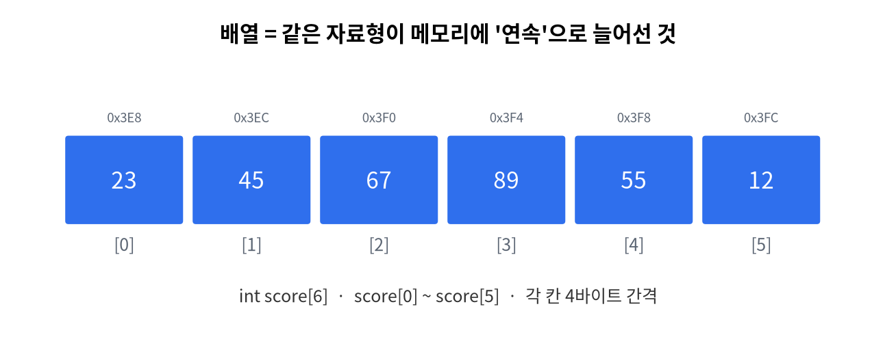

# 10주차 · 배열 (1차원) + LED 막대그래프
> C언어 · 미래모빌리티학과 | CLO2·CLO3 | 교재 Ch10



## 학습 목표
- 배열 선언·초기화·인덱스 접근과 배열-반복문 패턴을 사용한다.
- 배열을 함수에 전달한다(주소 전달의 첫 경험).
- 센서 버퍼·**이동평균 필터**·통계를 구현하고 LED 막대그래프로 시각화한다.

---

## 1. 이론

### 1.1 배열이란
같은 자료형이 **메모리에 연속**으로 늘어선 묶음. 인덱스는 **0부터**.
```c
int score[6] = {23, 45, 67, 89, 55, 12};
printf("%d\n", score[0]);   // 23 (첫 원소)
printf("%d\n", score[5]);   // 12 (마지막)
```

### 1.2 배열과 반복문
```c
int sum = 0;
int n = sizeof(score) / sizeof(score[0]);  // 원소 개수 = 24/4 = 6
for (int i = 0; i < n; i++) sum += score[i];
```
!!! warning "인덱스 범위 초과(off-by-one)"
    크기 6 배열의 유효 인덱스는 `0~5`. `score[6]`은 **범위 밖**(미정의 동작). 반복 조건 `i < n` 사용.

### 1.3 배열을 함수에 전달
배열은 **첫 원소의 주소**로 넘어간다(복사 아님). 그래서 길이를 같이 넘긴다.
```c
double average(const double *arr, int n) {
    double s = 0;
    for (int i = 0; i < n; i++) s += arr[i];
    return s / n;
}
```

### 1.4 이동평균 필터 (모빌리티)
센서 잡음을 줄이는 기본기. 최근 W개의 평균으로 값을 부드럽게.
```c
// 최근 3개 평균: raw[i-2], raw[i-1], raw[i]
double avg = average(&raw[i-2], 3);
```

---

## 2. 핵심 용어 정리
| 용어 | 설명 |
|------|------|
| 배열 | 같은 자료형의 연속 묶음 |
| 인덱스 | 원소 위치(0부터) |
| 원소 개수 | `sizeof(arr)/sizeof(arr[0])` |
| off-by-one | 인덱스를 1 벗어나는 흔한 버그 |
| 이동평균 | 최근 N개 평균으로 잡음 제거 |

---

## 3. 실습

### 실습 10-1 · 통계
배열의 최댓값·최솟값·평균 구하기.

### 실습 10-2 · 이동평균 (예제 `ex04_movavg.c`)
잡음이 섞인 배열에 윈도우 3 이동평균 적용.

### 실습 10-3 · LED 막대그래프 (아두이노)
배열값을 0~8 높이로 환산해 매트릭스에 막대로 표시(`code/arduino/11_graph`).

---

## 4. 과제
- 최댓값, 가변 윈도우 이동평균, (도전) 제자리 뒤집기(연습 4-1~4-3).

## 5. 참조
- 교재 Ch10 · 자료 `code/arduino/11_graph` · 그림 `img/03_array_memory.png`

## 형성평가 체크포인트
- [ ] 인덱스 경계 처리 · [ ] 배열을 함수에 전달 · [ ] 이동평균 이해 · [ ] 막대그래프 동작

---

## 연습문제
1. `int a[6];` 일 때 `sizeof(a)/sizeof(a[0])` 의 값은?
2. 크기 6 배열의 **유효한 인덱스 범위**는?
3. (OX) 배열을 함수에 넘기면 원소 전체가 복사된다.

??? success "정답 및 해설"
    1. `6` — 전체 바이트 ÷ 한 원소 바이트 = 원소 개수.
    2. `0 ~ 5` — `a[6]`은 범위 밖(미정의 동작).
    3. **X** — 배열은 **첫 원소의 주소**로 전달된다(복사 아님). 그래서 길이를 함께 넘긴다.
