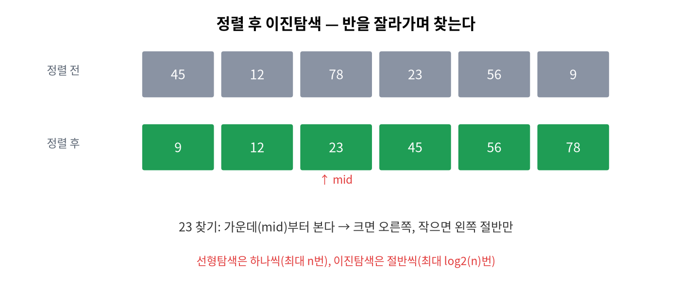

# 10주차 · 배열 (1차원) + LED 막대그래프
> C언어 · 미래모빌리티학과 | CLO2·CLO3 | 교재 Ch10




## 학습 목표
- 배열 선언·초기화·인덱스 접근과 배열-반복문 패턴을 사용한다.
- 배열을 함수에 전달한다(주소 전달의 첫 경험).
- 센서 버퍼·**이동평균 필터**·통계를 구현하고 LED 막대그래프로 시각화한다.

---

## 강의 해설

10주차부터는 데이터가 하나가 아니라 여러 개일 때의 프로그래밍을 배운다. 센서값은 보통 한 번만 읽고 끝나지 않는다. 시간에 따라 여러 번 읽고, 그 값들을 비교하고, 평균을 내고, 갑자기 튄 값을 걸러야 한다. 배열은 같은 종류의 데이터를 번호로 묶어 저장하는 가장 기본적인 구조다.

배열을 배울 때 중요한 감각은 인덱스가 0부터 시작한다는 점과, 배열 길이를 넘어서 접근하면 위험하다는 점이다. `data[0]`은 첫 번째 값이고, 길이가 10이면 마지막은 `data[9]`다. `data[10]`은 열한 번째 칸을 의미하므로 배열 밖을 건드린다. C는 이런 실수를 항상 친절하게 막아 주지 않기 때문에, 반복문의 조건 `i < n`을 정확히 쓰는 습관이 중요하다.

이동평균 필터는 배열이 왜 필요한지 보여 주는 좋은 모빌리티 예제다. 센서값은 흔들리고 잡음이 섞인다. 최근 몇 개 값을 평균내면 순간적인 흔들림을 줄일 수 있다. 이때 배열은 최근 샘플을 담는 창(window)이 되고, 반복문은 그 창 안의 값을 계산하는 도구가 된다. 후반부 LiDAR의 `ranges[]` 배열도 같은 방식으로 이해할 수 있다.

## 3시간 강의 운영 포인트

- **0~25분**: 여러 센서값을 하나씩 변수로 만들 때의 불편함을 보여 주고, 배열이 필요한 상황을 학생이 먼저 말하게 한다.
- **25~80분**: 배열 선언, 초기화, 인덱스, 범위 초과 위험을 설명한다. `data[0]`과 `data[n-1]`을 반복해서 확인해 0부터 시작하는 감각을 만든다.
- **80~135분**: 배열과 반복문으로 합계, 평균, 최대/최소, 이동평균을 작성한다. 각 실습은 먼저 손으로 인덱스 표를 채운 뒤 실행한다.
- **135~180분**: Arduino LED 막대그래프 또는 센서 버퍼 실습으로 시각화한다. 배열 길이와 반복 조건을 함께 넘기는 습관을 다음 주 2차원 배열과 연결한다.

## 강의 본문 보강

### 개념을 더 풀어 설명하기
배열은 같은 자료형의 값을 번호로 묶어 저장하는 구조다. 변수 `s1`, `s2`, `s3`처럼 이름을 계속 늘리는 방식은 값이 많아질수록 관리가 어렵다. 배열을 사용하면 `sensor[0]`, `sensor[1]`, `sensor[2]`처럼 하나의 이름과 인덱스로 여러 값을 다룰 수 있다.

C 배열에서 가장 중요한 규칙은 인덱스가 0부터 시작한다는 점이다. 길이가 10인 배열의 첫 번째 값은 `data[0]`, 마지막 값은 `data[9]`다. `data[10]`은 배열 밖이다. C는 배열 밖 접근을 항상 막아 주지 않으므로, 반복 조건을 `i < n`으로 쓰는 습관이 매우 중요하다.

### 모빌리티 예제로 이해하기
센서값은 한 번만 읽고 끝나지 않는다. 짧은 시간 동안 여러 번 읽은 값을 배열에 저장하면 평균, 최댓값, 최솟값, 변화량을 계산할 수 있다. 이동평균 필터는 최근 몇 개의 센서값을 평균내어 흔들림을 줄이는 간단한 필터다. 이 원리는 LiDAR 거리 배열과 배터리 전압 로그에도 그대로 쓰인다.

### 학생 활동
- 배열 길이 5인 센서값을 만들고 합계와 평균을 구한다.
- 최댓값과 최솟값을 찾을 때 현재까지의 후보값이 어떻게 바뀌는지 표로 추적한다.
- `i <= n`으로 잘못 작성한 반복문을 찾고 왜 위험한지 설명한다.
- 배열값을 LED 막대그래프 높이로 바꾸어 시각화한다.

### 자주 막히는 지점
- 배열 선언 시 길이는 원소 개수이지 마지막 인덱스가 아니다.
- 배열 전체를 `printf("%d", data);`처럼 출력할 수 없다. 반복문으로 하나씩 출력해야 한다.
- 함수에 배열을 넘길 때는 배열 길이도 함께 넘겨야 한다.
- 초기화하지 않은 배열 원소에는 예측하기 어려운 값이 들어 있을 수 있다.

## 1. 이론

### 1.1 배열이란
같은 자료형이 **메모리에 연속**으로 늘어선 묶음. 인덱스는 **0부터**.
```c
int score[6] = {23, 45, 67, 89, 55, 12};
printf("%d\n", score[0]);   // 23 (첫 원소)
printf("%d\n", score[5]);   // 12 (마지막)
```

### 1.2 배열과 반복문
```c
int sum = 0;
int n = sizeof(score) / sizeof(score[0]);  // 원소 개수 = 24/4 = 6
for (int i = 0; i < n; i++) sum += score[i];
```
!!! warning "인덱스 범위 초과(off-by-one)"
    크기 6 배열의 유효 인덱스는 `0~5`. `score[6]`은 **범위 밖**(미정의 동작). 반복 조건 `i < n` 사용.

### 1.3 배열을 함수에 전달
배열은 **첫 원소의 주소**로 넘어간다(복사 아님). 그래서 길이를 같이 넘긴다.
```c
double average(const double *arr, int n) {
    double s = 0;
    for (int i = 0; i < n; i++) s += arr[i];
    return s / n;
}
```

### 1.4 이동평균 필터 (모빌리티)
센서 잡음을 줄이는 기본기. 최근 W개의 평균으로 값을 부드럽게.
```c
// 최근 3개 평균: raw[i-2], raw[i-1], raw[i]
double avg = average(&raw[i-2], 3);
```

---

## 2. 핵심 용어 정리
| 용어 | 설명 |
|------|------|
| 배열 | 같은 자료형의 연속 묶음 |
| 인덱스 | 원소 위치(0부터) |
| 원소 개수 | `sizeof(arr)/sizeof(arr[0])` |
| off-by-one | 인덱스를 1 벗어나는 흔한 버그 |
| 이동평균 | 최근 N개 평균으로 잡음 제거 |

---

## 3. 실습

### 실습 10-1 · 통계
배열의 최댓값·최솟값·평균 구하기.

### 실습 10-2 · 이동평균 (예제 `ex04_movavg.c`)
잡음이 섞인 배열에 윈도우 3 이동평균 적용.

### 실습 10-3 · LED 막대그래프 (아두이노)
배열값을 0~8 높이로 환산해 매트릭스에 막대로 표시(`code/arduino/11_graph`).

---

## 4. 과제
- 최댓값, 가변 윈도우 이동평균, (도전) 제자리 뒤집기(연습 4-1~4-3).

## 5. 참조
- 교재 Ch10 · 자료 `code/arduino/11_graph` · 그림 `img/03_array_memory.png`

## 형성평가 체크포인트
- [ ] 인덱스 경계 처리 · [ ] 배열을 함수에 전달 · [ ] 이동평균 이해 · [ ] 막대그래프 동작

---

## 연습문제
1. `int a[6];` 일 때 `sizeof(a)/sizeof(a[0])` 의 값은?
2. 크기 6 배열의 **유효한 인덱스 범위**는?
3. (OX) 배열을 함수에 넘기면 원소 전체가 복사된다.

??? success "정답 및 해설"
    1. `6` — 전체 바이트 ÷ 한 원소 바이트 = 원소 개수.
    2. `0 ~ 5` — `a[6]`은 범위 밖(미정의 동작).
    3. **X** — 배열은 **첫 원소의 주소**로 전달된다(복사 아님). 그래서 길이를 함께 넘긴다.

    **🖼 그림으로 복습** — 배열 = 메모리에 연속으로 늘어선 같은 자료형

    
