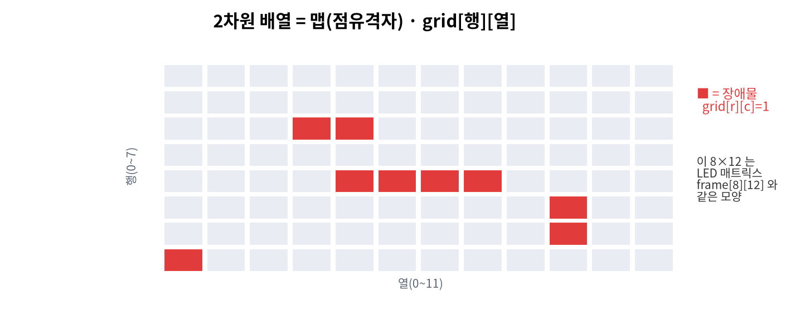
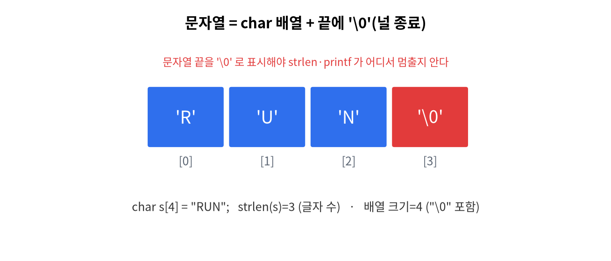

# 11주차 · 배열 (2차원) · 통신 입문 + WiFi 컨트롤러
> C언어 · 미래모빌리티학과 | CLO2·CLO4 | 교재 Ch11





## 학습 목표
- 2차원 배열과 문자 배열(문자열 기초)을 사용한다.
- 점유격자(맵)를 2차원 배열로 표현하고, **WiFi로 보드를 제어**한다.
- 통신이 ROS2 토픽의 전 단계임을 이해한다.

---

## 강의 해설

11주차는 배열이 선(line)에서 면(grid)으로 확장되는 시간이다. 1차원 배열이 센서값을 시간 순서로 담는다면, 2차원 배열은 공간을 담을 수 있다. LED Matrix의 8행 12열, 주차장의 격자 지도, 로봇의 점유격자 지도는 모두 "행과 열로 나뉜 공간"이라는 공통점을 가진다.

문자열은 C에서 특별한 자료형처럼 보이지만 실제로는 문자 배열이다. 끝에 `'\0'`이 있어야 문자열의 끝을 알 수 있다는 점이 중요하다. 이 사실을 이해하면 통신 프로토콜도 더 쉽게 보인다. `"RUN"`, `"STOP"`, `"S,42.0,25.0,RUN"` 같은 데이터는 결국 문자들이 순서대로 놓인 배열이고, 프로그램은 그 배열을 해석해 의미를 만든다.

WiFi 컨트롤러 실습은 "배열과 문자열이 통신으로 이어지는 순간"이다. 브라우저에서 `/run` 요청을 보내면 Arduino는 그 문자열을 읽고 상태를 바꾼다. 지금은 작은 웹 버튼이지만, 후반부 ROS2에서는 토픽 이름과 메시지를 통해 같은 일이 벌어진다. 따라서 이 주차는 2차원 배열, 문자열, 네트워크 명령이 한곳에서 만나는 중요한 연결 지점이다.

## 1. 이론

### 1.1 2차원 배열
```c
int map[8][12];          // 8행 12열 (LED 매트릭스/맵)
map[2][3] = 1;           // 2행 3열에 값
```
- 메모리에는 행 우선(row-major)으로 연속 저장된다.
- 중첩 반복으로 전체 순회:
```c
for (int r = 0; r < 8; r++)
    for (int c = 0; c < 12; c++)
        frame[r][c] = 0;   // 전체 0으로 초기화
```

### 1.2 문자열 = 문자 배열
C의 문자열은 **`char` 배열 + 끝에 널 문자 `'\0'`**.
```c
char state[16] = "RUN";   // 'R','U','N','\0'
printf("%s\n", state);
```
!!! warning "널 종료"
    문자열은 반드시 `'\0'`로 끝나야 한다. 버퍼 크기는 글자수+1 이상.

### 1.3 점유격자(occupancy grid) 맛보기
자율주행의 지도 표현: 칸마다 0(빈 공간)/1(장애물). 2차원 배열이 그 기초.

### 1.4 통신 입문 → 모빌리티
- 시리얼/WiFi로 명령·데이터를 주고받는다. 우리가 쓰는 텍스트 프로토콜 `"S,42,25,RUN"`은 **CAN 프레임의 축소판**.

!!! note "트렌드: 차량 통신 (2026)"
    차내 통신은 **CAN/LIN → 차량용 Ethernet**으로 확장 중. 이 과목의 "프로토콜로 데이터 주고받기"가 4학년 「모빌리티 통신」의 토대다. → [트렌드 검토](review.md)

---

## 2. 핵심 용어 정리
| 용어 | 설명 |
|------|------|
| 2차원 배열 | 행×열 격자형 배열 |
| row-major | 행 우선 연속 저장 방식 |
| 문자열 | `char` 배열 + `'\0'` |
| 널 종료 | 문자열 끝 표시 `'\0'` |
| 점유격자 | 칸으로 장애물 유무를 표현한 지도 |
| CAN | 차내 신호 통신 버스 |

---

## 3. 실습

### 실습 11-1 · 2차원 맵 출력 (예제 `ex08_grid2d.c`)
8×12 점유격자(occupancy grid)에 장애물을 찍고 중첩 반복으로 출력·집계.
이 8×12 는 LED 매트릭스 `frame[8][12]` 와 같은 모양이라 하드웨어로 바로 이어진다.

### 실습 11-2 · 문자열 다루기
`state` 문자열 비교(`strcmp`)로 "STOP"이면 경고 출력.

### 실습 11-3 · WiFi 컨트롤러 (아두이노)
폰 브라우저 버튼으로 보드 LED/동작 제어(`code/arduino/11_wifi_car`).

예제: [`code/arduino/11_wifi_car/11_wifi_car.ino`](code/arduino/11_wifi_car/11_wifi_car.ino)

실행 순서:

1. [`arduino_secrets.h.example`](code/arduino/11_wifi_car/arduino_secrets.h.example)을 `arduino_secrets.h`로 복사한다.
2. WiFi 이름과 비밀번호를 수정한다.
3. 업로드 후 시리얼 모니터에서 IP 주소를 확인한다.
4. 같은 네트워크의 노트북/휴대폰 브라우저에서 `http://보드IP/`로 접속한다.
5. `RUN`, `SLOW`, `STOP` 버튼을 누르고 LED Matrix 변화를 확인한다.

### 11주차에서 꼭 이해할 연결

| C 개념 | Arduino 예제에서의 모습 | ROS2에서의 확장 |
|--------|-------------------------|-----------------|
| 2차원 배열 | `frame[8][12]` LED 픽셀 | 점유격자 지도 |
| 문자열 | HTTP 요청 `"GET /run"` | 토픽 이름, 메시지 문자열 |
| 조건문 | 요청 경로에 따라 상태 변경 | 메시지 값에 따라 주행 판단 |
| 함수 | `setState("RUN")` | 콜백 함수 |

!!! warning "네트워크 디버깅"
    IP 주소가 출력되지 않으면 보드가 WiFi에 연결되지 않은 것이다. SSID/비밀번호, 2.4GHz 지원 여부, 같은 네트워크 접속 여부를 먼저 확인한다.

---

## 4. 과제
- 2차원 8×12 맵 출력, (도전) WiFi로 표정/동작 제어.
- 도전: `/packet` 경로를 추가해 현재 상태를 `S,42.0,25.0,RUN` 같은 문자열로 브라우저에 출력하게 하라.

## 5. 참조
- 교재 Ch11 · 자료 [`code/arduino/11_wifi_car`](code/arduino.md)

## 형성평가 체크포인트
- [ ] 2차원 인덱싱 · [ ] 문자열 널 종료 · [ ] WiFi 제어 동작 · [ ] CAN 키워드 인지

---

## 연습문제
1. `int map[8][12];` 의 전체 원소 개수는?
2. 문자열 `"RUN"` 을 저장하려면 `char` 배열 크기가 최소 몇이어야 하는가?
3. 두 문자열이 같은지 비교하는 표준 함수의 이름은?

??? success "정답 및 해설"
    1. `96` — 8 × 12.
    2. `4` — 'R','U','N' + 널 문자 `'\0'`.
    3. `strcmp` (같으면 0을 반환).

    **🖼 그림으로 복습** — 2차원 배열 = 점유격자(occupancy grid) 맵

    
