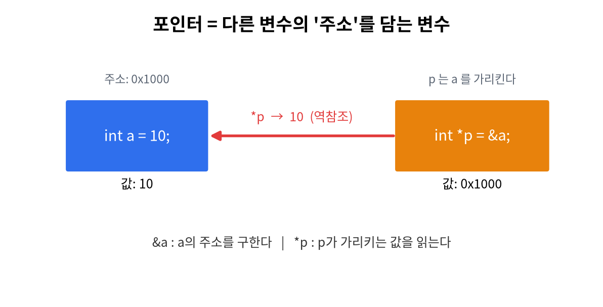

# 12주차 · 포인터 기초
> C언어 · 미래모빌리티학과 | CLO2 | 교재 Ch12



## 학습 목표
- 메모리와 주소 개념을 이해하고 `&`(주소)·`*`(역참조)를 사용한다.
- 포인터를 선언·초기화하고 배열을 포인터로 순회한다.

---

## 1. 이론

### 1.1 주소와 포인터
- 모든 변수는 메모리의 **주소**를 가진다. `&a`로 주소를 구한다.
- **포인터**: 다른 변수의 주소를 담는 변수.
```c
int a = 10;
int *p = &a;     // p는 a의 주소를 가리킴
printf("%d\n", *p);   // 10  (*p = p가 가리키는 값, 역참조)
*p = 20;              // a를 20으로 바꿈
```

### 1.2 선언 읽는 법
`int *p;` → "p는 int를 가리키는 포인터". 자료형마다 포인터가 다르다(`double *`, `char *` …).

### 1.3 널 포인터
아직 아무것도 안 가리킬 때 `NULL`로 둔다.
```c
int *p = NULL;
if (p != NULL) { *p = 1; }   // NULL 역참조는 충돌(segfault)
```

### 1.4 포인터와 배열
배열 이름은 **첫 원소의 주소**다. 그래서 포인터로 순회할 수 있다.
```c
int arr[5] = {3,1,4,1,5};
int *p = arr;            // p = &arr[0]
for (int i = 0; i < 5; i++)
    printf("%d ", *(p + i));   // p[i]와 같다
```

!!! note "트렌드: 왜 임베디드는 포인터를 쓰나"
    센서 버퍼·레지스터·메모리맵·DMA처럼 **특정 메모리 주소를 직접 다뤄야** 하기 때문. 포인터는 ECU·실시간 펌웨어의 필수 도구다.

!!! warning "가장 흔한 사고"
    **초기화 안 한 포인터**를 역참조하면 프로그램이 죽는다(segmentation fault). 항상 유효한 주소(`&변수`)나 `NULL`로 시작.

---

## 2. 핵심 용어 정리
| 용어 | 설명 |
|------|------|
| 주소 | 메모리 위치 번호 |
| 포인터 | 주소를 담는 변수 |
| `&` (주소 연산자) | 변수의 주소를 구함 |
| `*` (역참조) | 포인터가 가리키는 값에 접근 |
| NULL | 아무것도 안 가리키는 포인터 |
| segfault | 잘못된 메모리 접근으로 인한 충돌 |

---

## 3. 실습

### 실습 12-1 · 주소·역참조
변수 주소(`&a`)와 값(`*p`)을 출력해 관계 확인.

### 실습 12-2 · 포인터로 배열 순회 (예제 `ex05_pointer.c`)
`*(p+i)`로 배열을 순회하며 출력.

### 실습 12-3 · 2차원 포인터 실험(도전)
`int (*p)[3]` 등 다중 포인터 개념 맛보기.

### 실습 12-4 · 아두이노 포인터 순회 (`code/arduino/13_pointer_basics`)
센서 샘플 버퍼를 **인덱스가 아니라 포인터로** 순회해 평균을 구하고 LED 막대로 표시.
```cpp
float avg(const float *arr, int n) {              // 배열 첫 주소를 받아
    float sum = 0;
    for (const float *p = arr; p < arr + n; ++p)  // ++p로 한 칸씩 전진
        sum += *p;                                // *p = 그 자리 값
    return sum / n;
}
```
추가 하드웨어 없이 동작(가상 센서).

---

## 4. 과제
- 포인터로 배열 순회, (도전) 다중 포인터 실험. 연습 5-1.

## 5. 참조
- 교재 Ch12 · 아두이노 `code/arduino/13_pointer_basics` · 그림 `img/02_pointer_concept.png`, `img/01_memory_layout.png`

## 형성평가 체크포인트
- [ ] `&`/`*` 구분 · [ ] 포인터 선언 읽기 · [ ] 배열-포인터 관계 · [ ] 미초기화 위험 인지

---

## 연습문제
1. `int a=10; int *p=&a; *p=20;` 실행 후 `a`의 값은?
2. `*(p + 2)` 와 같은 의미의 배열 표기는?
3. 초기화하지 않은(또는 NULL) 포인터를 역참조하면 어떤 일이 생기는가?

??? success "정답 및 해설"
    1. `20` — `*p`로 `a`가 가리키는 값을 직접 변경.
    2. `p[2]`
    3. 잘못된 메모리 접근으로 **프로그램이 충돌**(segmentation fault).

    **🖼 그림으로 복습** — 포인터 = 다른 변수의 '주소'를 담는다

    
