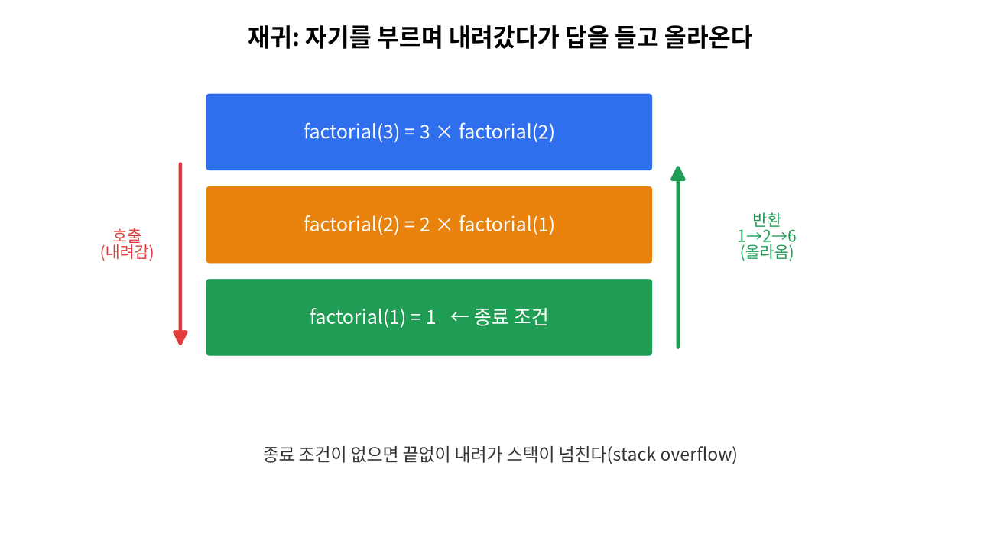
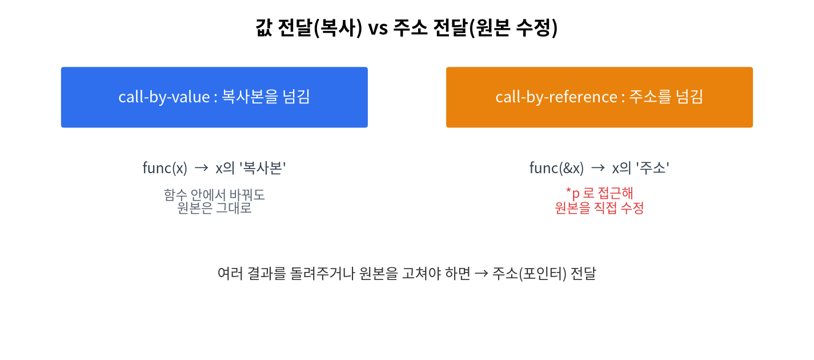

# 13주차 · 포인터 활용
> C언어 · 미래모빌리티학과 | CLO2 | 교재 Ch13






## 학습 목표
- **call-by-reference**로 함수가 바깥 변수를 직접 바꾼다.
- 포인터로 **여러 결과를 동시에 반환**하고, 함수 포인터 개념을 안다.

---

## 1. 이론

### 1.1 값 전달 vs 주소 전달
7주차에서 본 값 전달은 원본을 못 바꾼다. 원본을 바꾸려면 **주소를 넘긴다**.
```c
void calibrate(double *v, double off) { *v += off; }  // 포인터 매개변수
double dist = 40.0;
calibrate(&dist, -2.5);   // dist의 '주소'를 넘김 → dist가 37.5로 바뀜
```

### 1.2 두 변수 교환(swap) — 포인터의 대표 예
```c
void swap(int *a, int *b) { int t = *a; *a = *b; *b = t; }
swap(&x, &y);
```

### 1.3 여러 결과 동시 반환
함수는 `return` 값이 1개뿐 → **포인터 매개변수**로 여러 결과를 내보낸다.
```c
void sum_and_avg(const int *arr, int n, int *sum, double *avg) {
    int s = 0; for (int i=0;i<n;i++) s += arr[i];
    *sum = s; *avg = (double)s / n;
}
```

### 1.4 포인터 배열 / 함수 포인터(맛보기)
```c
const char *names[3] = {"RUN","SLOW","STOP"};   // 포인터 배열
void (*action)(void);   // 함수를 가리키는 포인터 → 명령 디스패치 테이블에 활용
```

!!! tip "모빌리티 적용"
    센서값 보정처럼 "값을 고쳐 돌려줘야" 하는 처리는 call-by-reference가 자연스럽다. 15주차 로봇 브리지의 `analyze_scan(ranges, n, ...)`도 포인터로 배열을 받는다.

---

## 2. 핵심 용어 정리
| 용어 | 설명 |
|------|------|
| call by reference | 주소를 넘겨 원본을 직접 수정 |
| 출력 매개변수 | 결과를 내보내는 포인터 인자 |
| 포인터 배열 | 포인터들을 모은 배열 |
| 함수 포인터 | 함수를 가리키는 포인터 |

---

## 3. 실습

### 실습 13-1 · 보정·swap (예제 `ex05_pointer.c`)
`calibrate`, `swap`을 구현·검증.

### 실습 13-2 · 다중 반환
배열의 합·평균을 동시에 반환(연습 5-2).

### 실습 13-3 · 최댓값+인덱스 반환(도전)
최댓값과 그 인덱스를 포인터로 함께 반환(연습 5-3).

### 실습 13-4 · 아두이노 call-by-ref (`code/arduino/14_pointer_callbyref`)
센서값을 **그 자리에서 보정**하고, 평균·최댓값·인덱스를 포인터로 한 번에 돌려받는다.
```cpp
void calibrate(float *v, float off) { *v += off; }   // 바깥 변수를 직접 수정
void analyze(const float *b, int n, float *avg, float *mx, int *idx);  // 다중 반환
```
추가 하드웨어 없이 동작(가상 센서).

### 실습 13-5 · 재귀 맛보기 (예제 `ex10_recursion.c`)
함수가 자기 자신을 부르는 **재귀**. 핵심은 *종료 조건* 과 *더 작은 문제로 줄이기*.
팩토리얼·거듭제곱·배열 합·하노이탑 이동수(2ⁿ−1)를 재귀로 구현해 본다.
```c
long factorial(int n) {
    if (n <= 1) return 1;              // 종료 조건
    return (long)n * factorial(n - 1); // 더 작은 문제
}
```

---

## 4. 과제
- 합·평균 동시 반환, 최댓값+인덱스 반환, (도전) 함수 포인터 테이블.

## 5. 참조
- 교재 Ch13 · 예제 `code/c/examples/ex05_pointer.c` · 아두이노 `code/arduino/14_pointer_callbyref`

## 형성평가 체크포인트
- [ ] call-by-ref 구현 · [ ] 다중 반환(포인터) · [ ] 포인터=배열 관계 설명

---

## 연습문제
1. `swap(&x, &y)` 호출 뒤 `x`, `y`는 어떻게 되는가?
2. 함수가 결과를 **2개 이상** 돌려주려면 어떤 방법을 쓰는가?
3. `void calibrate(double *v, double off){ *v += off; }` 를 `d=40; calibrate(&d,-2.5);` 로 부르면 `d`는?

??? success "정답 및 해설"
    1. 값이 **서로 교환**된다(call by reference).
    2. **포인터 매개변수(출력 매개변수)** 로 내보낸다. `return`은 1개뿐.
    3. `37.5` — `*v`로 원본 `d`를 직접 수정.

    **🖼 그림으로 복습** — 재귀 호출 스택: 내려갔다가 답을 들고 올라온다

    
