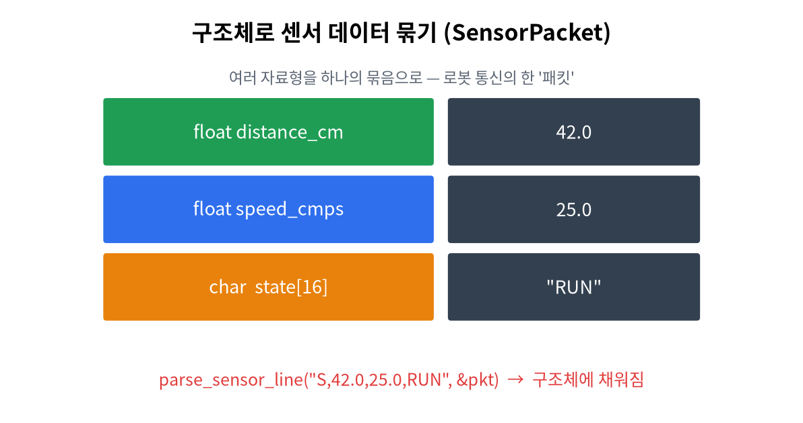

# 14주차 · 구조체 + 연결리스트 맛보기
> C언어 · 미래모빌리티학과 | CLO2·CLO4 | 교재 Ch14



## 학습 목표
- `struct` 정의·멤버 접근·구조체 배열·구조체 포인터(`->`)를 사용한다.
- 센서 패킷/차량 자세(Pose)를 구조체로 묶고 **직렬화/역직렬화**한다.
- 구조체+포인터로 **연결리스트 한 노드 잇기**를 체험한다(자료구조 가교).

---

## 1. 이론

### 1.1 구조체란
여러 자료형을 **하나의 의미 단위**로 묶는다.
```c
typedef struct {
    float distance_cm;
    float speed_cmps;
    char  state[16];
} SensorPacket;            // 센서 패킷 = 통신의 한 묶음

SensorPacket p = {42.0f, 25.0f, "RUN"};
printf("%.1f %s\n", p.distance_cm, p.state);   // 멤버 접근: .
```

### 1.2 구조체 포인터 → `->`
```c
SensorPacket *pp = &p;
printf("%s\n", pp->state);   // (*pp).state 와 같다
```

### 1.3 구조체 배열
```c
SensorPacket fleet[3];
fleet[0].distance_cm = 10.0f;
```

### 1.4 직렬화/역직렬화 (통신의 핵심)
구조체를 **문자열로 변환(직렬화)** 해 보내고, 받아서 **다시 구조체로(역직렬화)**.
```c
// 직렬화: 구조체 → "S,42.0,25.0,RUN"
snprintf(buf, n, "S,%.1f,%.1f,%s", p.distance_cm, p.speed_cmps, p.state);
// 역직렬화: 문자열 → 구조체
sscanf(line, "S,%f,%f,%15[^\r\n]", &p.distance_cm, &p.speed_cmps, p.state);
```
> 이 아이디어가 곧 15주차 ROS2 메시지(geometry_msgs/Pose, Twist)와 똑같다.

### 1.5 연결리스트 맛보기 (자료구조 가교)
구조체가 **자기 자신을 가리키는 포인터**를 가지면 노드를 줄줄이 이을 수 있다.
```c
typedef struct Node {
    int value;
    struct Node *next;   // 다음 노드 주소
} Node;
Node a = {1, NULL}, b = {2, NULL};
a.next = &b;             // a → b 연결
printf("%d %d\n", a.value, a.next->value);  // 1 2
```
> 2학년 「자료구조 및 알고리즘」의 출발점.

---

## 2. 핵심 용어 정리
| 용어 | 설명 |
|------|------|
| 구조체(struct) | 여러 자료형을 묶은 사용자 정의형 |
| 멤버 | 구조체 안의 변수 |
| `.` / `->` | 값 접근 / 포인터로 멤버 접근 |
| 직렬화/역직렬화 | 구조체↔문자열(전송용) 변환 |
| 연결리스트 | 노드를 포인터로 잇는 자료구조 |

---

## 3. 실습

### 실습 14-1 · 센서 패킷/Pose (예제 `ex06_pose_struct.c`)
Pose 구조체를 만들어 직렬화→역직렬화로 왕복 확인.

### 실습 14-2 · 구조체 배열
여러 대 차량(fleet)을 배열로 두고 최댓값/평균.

### 실습 14-3 · 연결리스트 2노드(도전)
노드 2개를 `next`로 잇고 순회 출력.

---

## 4. 과제
- Student 구조체, 두 점 거리(`sqrt`, `-lm`), 구조체 배열 최댓값(연습 6-1~6-3). 기말 팀 구성.

## 5. 참조
- 교재 Ch14 · 예제 `code/c/examples/ex06_pose_struct.c` · 그림 `img/04_struct_packet.png`

## 형성평가 체크포인트
- [ ] `.`/`->` 구분 · [ ] 구조체 배열 순회 · [ ] 직렬화/역직렬화 이해 · [ ] 연결리스트 개념
