# 14주차 · 구조체 + 연결리스트 맛보기

이번 주는 **서로 다른 자료형을 하나의 의미 있는 데이터 묶음으로 만드는 방법**을 배운다. 지금까지 배열은 같은 자료형을 여러 개 저장할 때 사용했다. 하지만 실제 로봇 데이터는 거리, 속도, 상태 문자열처럼 서로 다른 값이 한 세트로 움직인다. C에서는 이런 묶음을 `struct`로 표현한다.

구조체를 이해하면 Arduino에서 만든 센서 패킷을 PC 프로그램에서 해석하고, 나중에는 ROS2 메시지로 바꾸는 흐름까지 자연스럽게 이어진다. 14주차의 목표는 "구조체 문법을 외우기"가 아니라, **데이터를 어떤 단위로 묶어야 프로그램이 읽기 쉬워지는지**를 익히는 것이다.

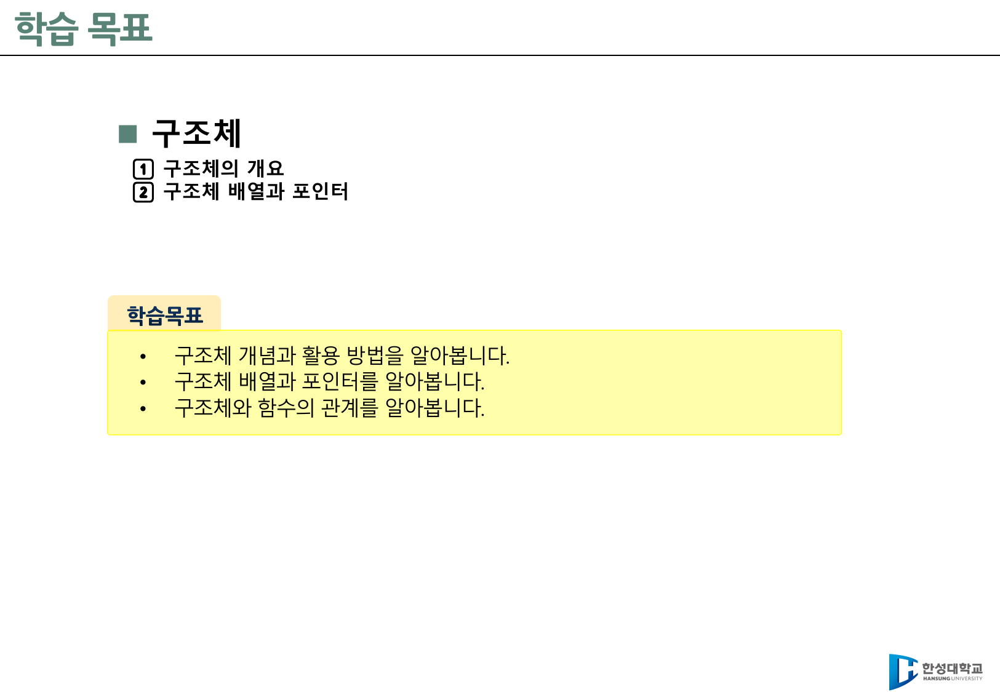

## 학습 목표

- `struct`가 왜 필요한지 배열과 비교해 설명할 수 있다.
- 구조체 선언, 구조체 변수 생성, 초기화, 멤버 접근 연산자 `.`를 사용할 수 있다.
- 구조체 배열을 만들고 반복문으로 순회할 수 있다.
- 구조체 포인터와 `->` 연산자를 사용할 수 있다.
- 구조체를 함수 인수로 전달할 때 값 복사와 포인터 전달의 차이를 설명할 수 있다.
- 구조체 안에 포인터 멤버를 넣어 연결리스트의 기본 모양을 이해한다.
- Arduino UNO R4에서 만든 문자열 패킷을 C 구조체와 ROS2 메시지 관점으로 연결할 수 있다.

## 이번 주차의 큰 그림

| 상황 | 적합한 표현 | 이유 |
|------|-------------|------|
| 학생 30명의 국어 점수 | `int score[30]` | 모두 같은 자료형 |
| 학생 1명의 이름, 학번, 평균 | `struct student` | 서로 다른 자료형이 한 사람을 설명 |
| 센서 10개의 거리, 속도, 상태 | `struct SensorPacket packets[10]` | 패킷 단위로 묶고 여러 개 저장 |
| 다음 데이터로 이어지는 노드 | `struct Node *next` | 구조체 안에 다음 구조체 주소를 저장 |
| ROS2 메시지 | 필드가 있는 메시지 타입 | 구조체처럼 이름 붙은 값의 묶음 |

배열은 "같은 종류의 값이 여러 개"일 때 좋다. 구조체는 "서로 다른 종류의 값이 함께 하나의 대상을 설명"할 때 좋다. 로봇 프로그램에서는 두 방식이 함께 쓰인다. 예를 들어 LiDAR 거리값은 배열로 저장하지만, 로봇의 현재 상태는 `x`, `y`, `theta`, `speed`, `state` 같은 값을 구조체로 묶는 편이 읽기 쉽다.

## 원본 자료 반영 보강 포인트

이번 페이지는 첨부된 `14-1. 구조체.pdf`, `14-2. 구조체 실습.pdf`, `14-3. 구조체 도전 문제.pdf`의 흐름을 기준으로 보강했다. 원본 자료의 핵심은 다음 네 가지다.

| 원본 자료 | 수업에서 반드시 짚을 내용 | 이 페이지의 위치 |
|-----------|----------------------------|------------------|
| `14-1. 구조체.pdf` | 구조체는 형틀(template)을 먼저 만들고, 그 형틀로 변수를 만든다 | 1~3절 |
| `14-1. 구조체.pdf` | 구조체 배열, 구조체 포인터, `(*p).member`와 `p->member` | 4~5절 |
| `14-2. 구조체 실습.pdf` | 구조체 변수 대입, 포인터 멤버, 구조체 함수 인수와 반환값 | 6~7절 |
| `14-3. 구조체 도전 문제.pdf` | 중첩 구조체, 구조체 복사, 구조체 반환값 문제 풀이 | 12절 |

강의자는 슬라이드 이미지를 먼저 보여 주고, 바로 아래 해설 문단과 코드 조각을 판서하듯 따라가면 된다. 특히 구조체는 단어가 낯설어서 어렵게 느껴지지만, 실제로는 **값들을 한 이름 아래 묶고, 그 묶음을 변수처럼 사용하는 문법**이라고 반복해서 잡아 주는 것이 좋다.

## 3시간 강의 운영안

| 시간 | 내용 | 수업 포인트 |
|------|------|-------------|
| 0~20분 | 배열과 구조체 비교 | 같은 자료형 묶음과 다른 자료형 묶음의 차이를 예로 설명 |
| 20~50분 | 구조체 선언과 초기화 | `struct student`를 만들고 멤버 접근 `.` 실습 |
| 50~80분 | 구조체 배열 | 여러 학생 또는 여러 센서 패킷을 반복문으로 처리 |
| 80~110분 | 구조체 포인터 | `(*p).member`와 `p->member`의 관계 설명 |
| 110~135분 | 구조체와 함수 | 값 복사, 포인터 전달, 구조체 반환값 비교 |
| 135~155분 | 이중 포인터 맛보기 | 문자열 배열과 예상 문제 풀이로 포인터 복습 |
| 155~175분 | 연결리스트와 패킷 | `next` 포인터, Arduino 문자열 패킷, ROS2 메시지 연결 |
| 175~180분 | 형성평가 | `.`/`->`, 구조체 배열, 예상 문제 출력 확인 |

## 1. 구조체는 사용자 정의 자료형이다

구조체는 C가 기본으로 제공하는 `int`, `double`, `char`만으로는 표현하기 어려운 데이터를 직접 묶어서 만드는 자료형이다.

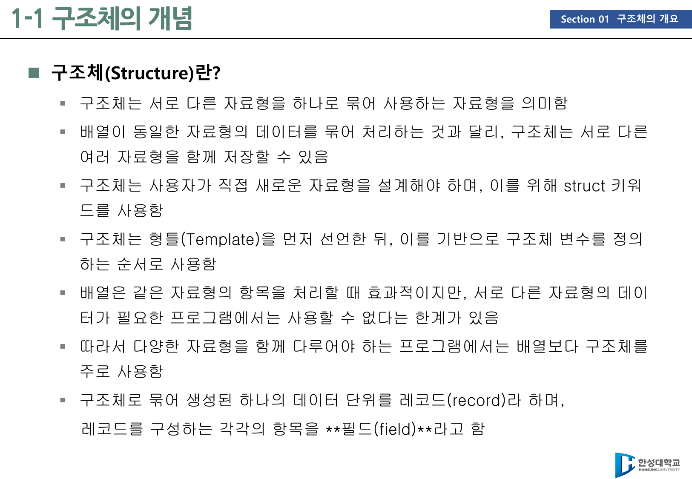

예를 들어 학생 한 명을 다음 변수들로 표현할 수 있다.

```c
char name[20];
int kor;
int math;
double avg;
```

이 변수들이 모두 같은 학생을 설명한다는 사실은 사람이 기억해야 한다. 변수가 많아질수록 실수하기 쉽다. 구조체로 묶으면 코드가 이렇게 바뀐다.

```c
struct student {
    char name[20];
    int kor;
    int math;
    double avg;
};
```

이제 `name`, `kor`, `math`, `avg`는 따로 흩어진 값이 아니라 `student`라는 하나의 자료형에 속한 멤버가 된다. 이처럼 구조체는 **데이터 사이의 관계를 코드에 남기는 도구**다.

### 형틀과 실제 변수의 차이

원본 자료에서는 구조체를 **형틀(template)**이라고 설명한다. 이 표현을 꼭 잡아야 한다. `struct student { ... };`는 학생 데이터를 저장하는 공간을 만든 것이 아니라, "학생 데이터는 이런 모양으로 저장하겠다"라는 설계도를 만든 것이다. 실제 저장 공간은 `struct student s1;`처럼 변수를 선언할 때 생긴다.

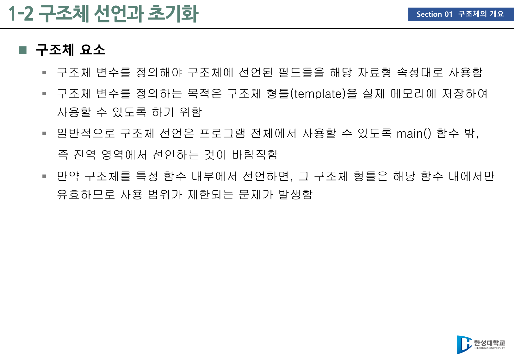

```c
struct student {
    char name[20];
    int kor;
    int math;
    double avg;
};                  // 형틀 선언: 아직 학생 한 명이 저장된 것은 아님

struct student s1;  // 변수 선언: 이제 s1이라는 저장 공간이 생김
```

수업 중에는 다음 세 문장을 반복해서 확인하면 좋다.

- 구조체 선언은 자료형을 만드는 일이다.
- 구조체 변수 선언은 실제 메모리 공간을 만드는 일이다.
- 멤버는 구조체 변수 안에 들어 있는 각각의 필드다.

## 2. 구조체 선언과 초기화

구조체 선언은 "형틀"을 만드는 과정이다. 선언만으로 학생 데이터가 생기는 것은 아니다. 구조체 변수를 만들어야 실제 저장 공간이 생긴다.

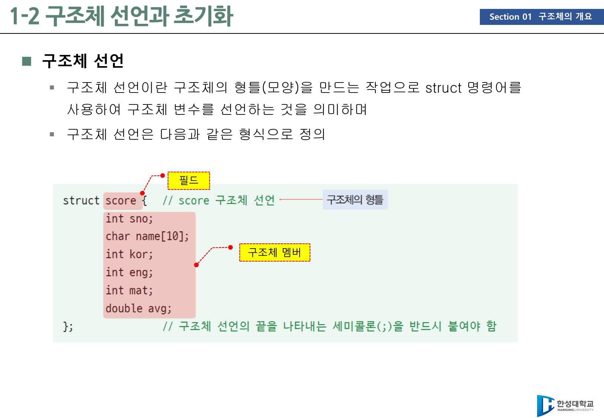

```c
struct student {
    char name[20];
    int kor;
    int math;
    double avg;
};

int main(void)
{
    struct student s1 = {"Kim", 90, 85, 87.5};
    return 0;
}
```

구조체는 보통 함수 밖 전역 영역에 선언한다. 그래야 여러 함수가 같은 구조체 자료형을 사용할 수 있다. 실제 값이 저장되는 구조체 변수는 필요한 함수 안에서 만들면 된다.

### 구조체 선언 위치

구조체 형틀을 `main()` 함수 안에 선언하면 그 함수 안에서만 사용할 수 있다. 여러 함수가 같은 구조체를 사용해야 한다면 함수 밖에 선언한다.

```c
struct student {
    char name[20];
    int kor;
    int math;
    double avg;
};

void print_student(struct student s);

int main(void)
{
    struct student s1 = {"Kim", 90, 85, 87.5};
    print_student(s1);
    return 0;
}
```

초보자가 자주 하는 실수는 `main()` 안에서 구조체를 선언해 놓고 다른 함수의 매개변수에서 그 구조체 이름을 쓰는 것이다. 함수 밖에 구조체를 선언하면 이런 범위(scope) 문제를 줄일 수 있다.

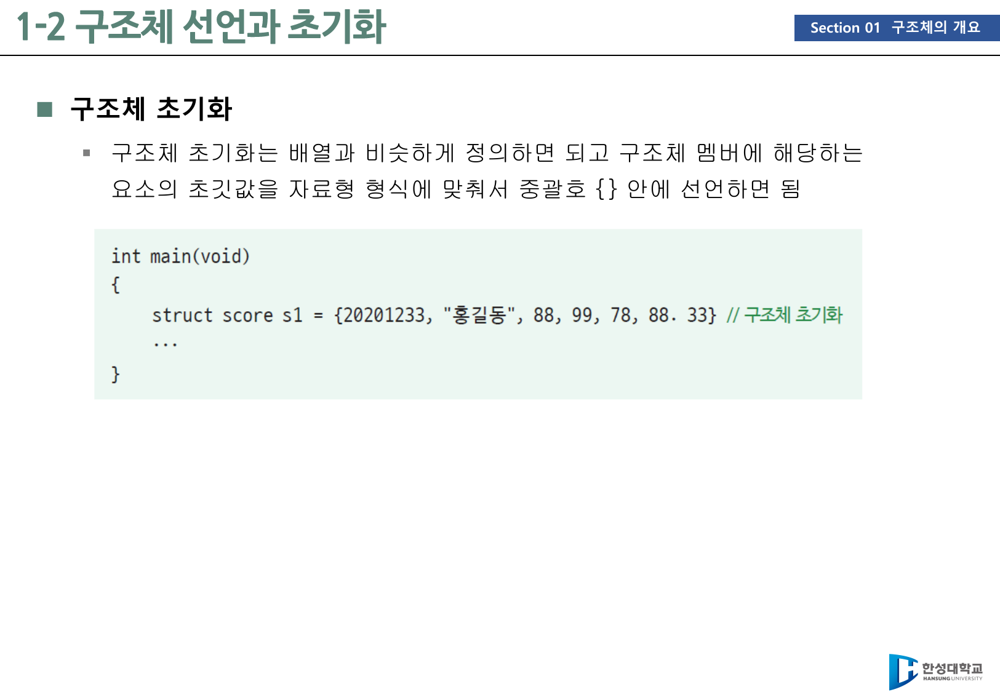

초기화할 때는 멤버 선언 순서대로 값을 넣는다. 일부 멤버만 초기화하면 나머지 멤버는 0 또는 빈 값으로 채워진다. 하지만 초보 단계에서는 모든 멤버를 명확히 채우는 습관이 좋다.

### 구조체 변수 생성 방식

원본 자료는 구조체 변수 생성 방식을 따로 강조한다. 다음 세 방식은 모두 가능하지만, 강의에서는 첫 번째 방식을 기본으로 잡고 나머지는 읽을 수 있는 정도로 소개하면 충분하다.

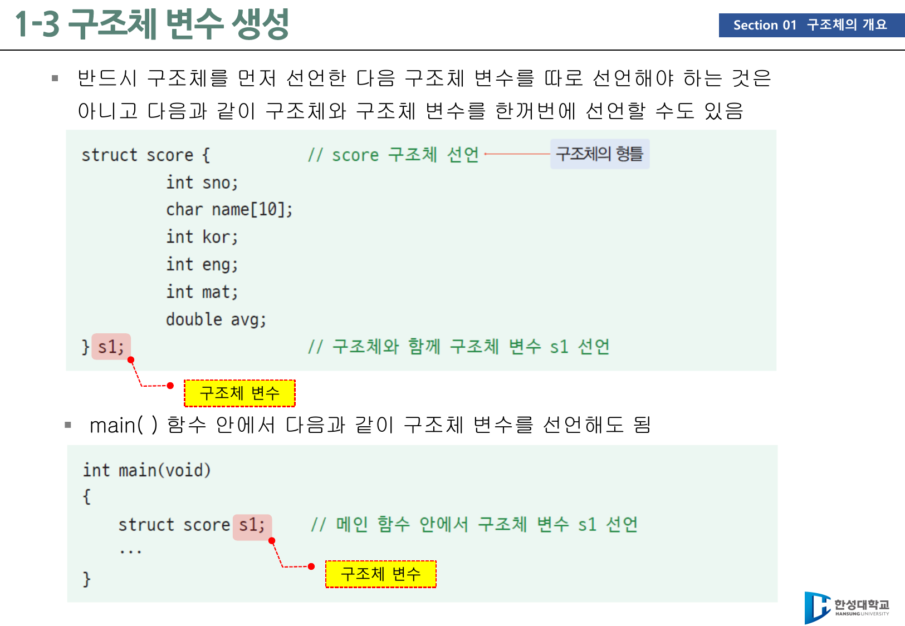

```c
struct score {
    int number;
    char name[20];
    int total;
};

struct score s1;       // 1. 구조체 선언 뒤 변수 선언
```

```c
struct score {
    int number;
    char name[20];
    int total;
} s1;                  // 2. 구조체 선언과 변수 선언을 동시에 수행
```

```c
int main(void)
{
    struct score s2;   // 3. 함수 안에서 필요한 변수만 생성
}
```

`typedef`를 사용하면 긴 `struct score` 표현을 짧게 줄일 수 있다.

```c
typedef struct {
    int number;
    char name[20];
    int total;
} Score;

Score s1;
```

도전 문제에서 보이는 `PS avg(PS s1, PS s2);` 같은 형태는 `PS`가 어떤 구조체의 별칭으로 정의되어 있다는 뜻이다.

## 3. 멤버 접근 연산자 `.`

구조체 변수 안의 멤버에 접근할 때는 점 연산자 `.`를 사용한다.

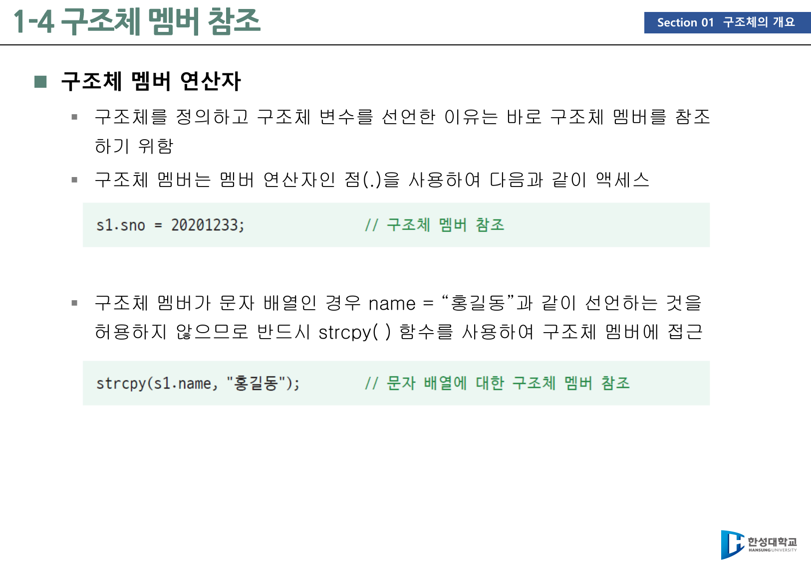

```c
struct student s1 = {"Lee", 88, 91, 0.0};

s1.avg = (s1.kor + s1.math) / 2.0;
printf("%s %.1f\n", s1.name, s1.avg);
```

문자 배열 멤버는 주의가 필요하다. C에서 배열 이름에는 대입할 수 없기 때문에 다음 코드는 사용할 수 없다.

```c
s1.name = "Hong";      // 오류
```

문자열을 나중에 바꾸려면 `strcpy()`를 사용한다.

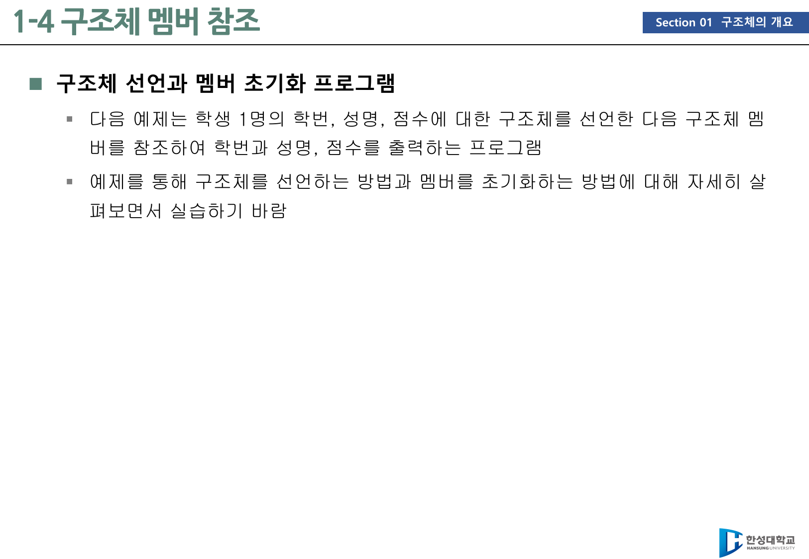

```c
#include <string.h>

strcpy(s1.name, "Hong");
```

정리하면 구조체 변수는 `변수이름.멤버이름` 형식으로 읽고 쓴다.

### 구조체 대입과 복사

같은 구조체 자료형끼리는 대입 연산자 `=`로 값을 복사할 수 있다. 이 부분은 배열과 구조체가 크게 다른 지점이다. 배열은 `a = b;`처럼 통째로 대입할 수 없지만, 구조체 변수는 같은 자료형이면 통째로 대입할 수 있다.

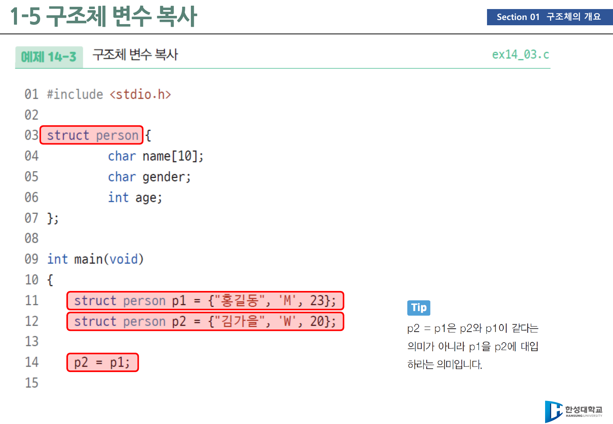

```c
typedef struct {
    char name[20];
    int age;
} Person;

Person p1 = {"Hong", 20};
Person p2;

p2 = p1;  // 같은 Person 자료형이므로 멤버 값이 복사됨
```

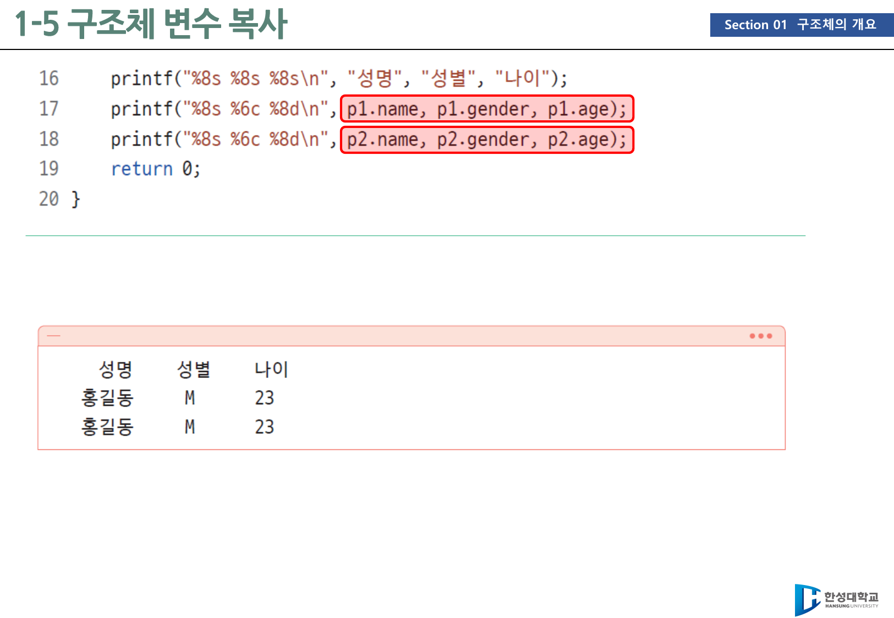

단, 구조체 안에 포인터 멤버가 있으면 주의해야 한다. 포인터 멤버는 "가리키는 데이터 전체"가 아니라 **주소값**이 복사된다. 그래서 두 구조체가 같은 문자열이나 같은 배열을 가리키는 상태가 될 수 있다. 이것을 얕은 복사(shallow copy)라고 부른다.

```c
typedef struct {
    const char *name;
    int age;
} PersonView;

PersonView a = {"Kim", 21};
PersonView b = a;      // name 문자열의 주소가 복사됨
```

학생에게는 이렇게 설명하면 좋다. `char name[20]`은 구조체 안에 문자 칸 20개가 들어 있다. `char *name`은 구조체 안에 문자열이 있는 주소 하나만 들어 있다. 둘은 비슷해 보이지만 복사와 수명 관리에서 매우 다르다.

## 4. 구조체 배열

학생이 한 명이면 구조체 변수 하나면 충분하다. 학생이 여러 명이면 구조체 배열을 사용한다.

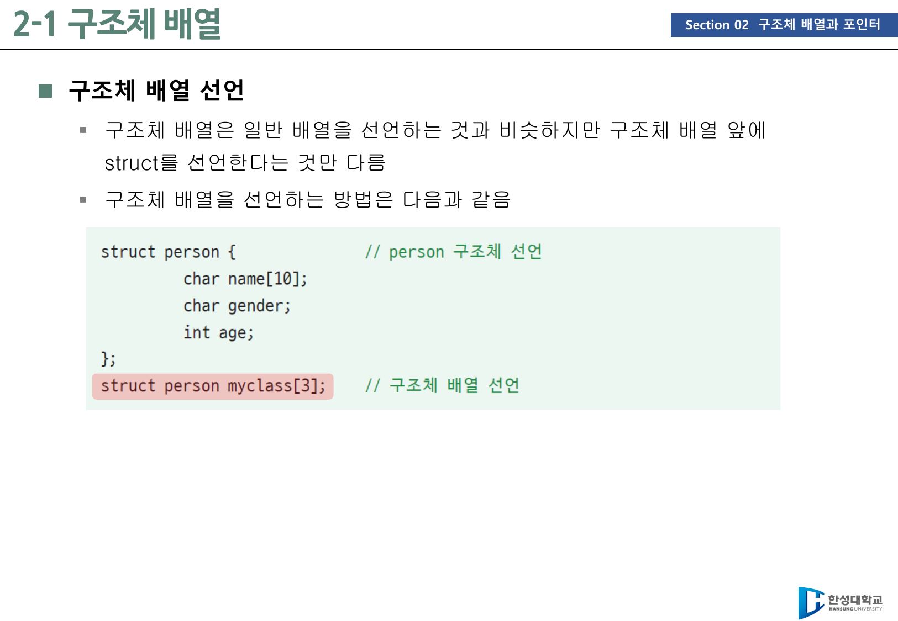

```c
struct student classroom[3] = {
    {"Hong", 90, 85, 0.0},
    {"Lee", 88, 91, 0.0},
    {"Park", 80, 75, 0.0}
};
```

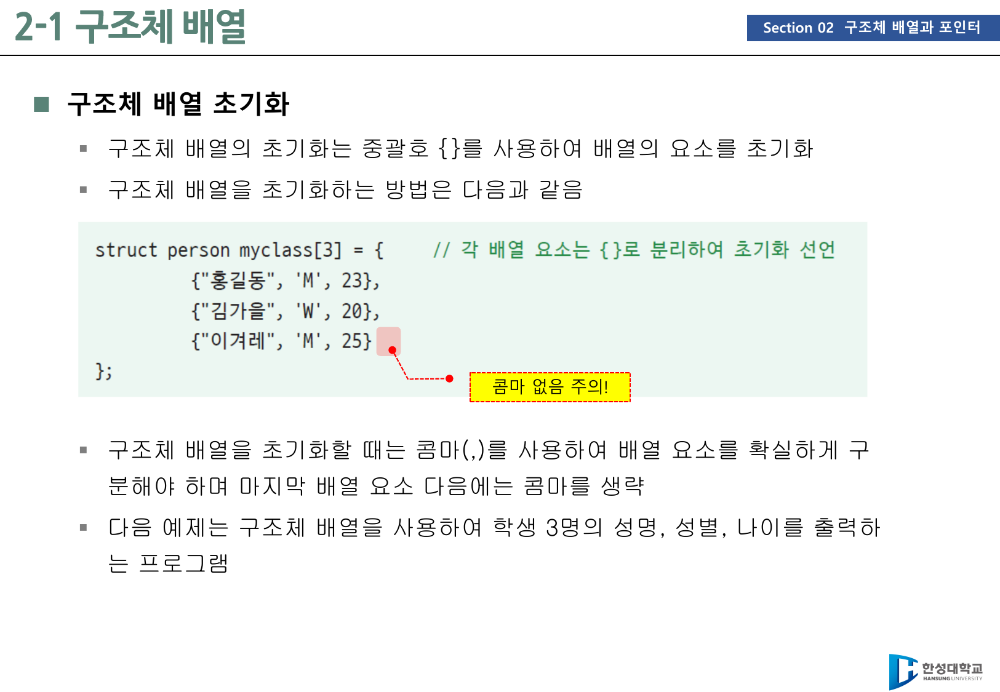

구조체 배열도 일반 배열처럼 인덱스를 사용한다.

```c
for (int i = 0; i < 3; i++) {
    classroom[i].avg = (classroom[i].kor + classroom[i].math) / 2.0;
    printf("%s %.1f\n", classroom[i].name, classroom[i].avg);
}
```

Arduino 예제로 바꾸면 `SensorPacket packets[10]`처럼 여러 센서 패킷을 저장할 수 있다. 10주차 배열과 14주차 구조체가 결합되는 지점이다.

## 5. 구조체 포인터와 `->`

구조체도 변수이므로 주소가 있다. 구조체 주소를 저장하는 포인터를 만들 수 있다.

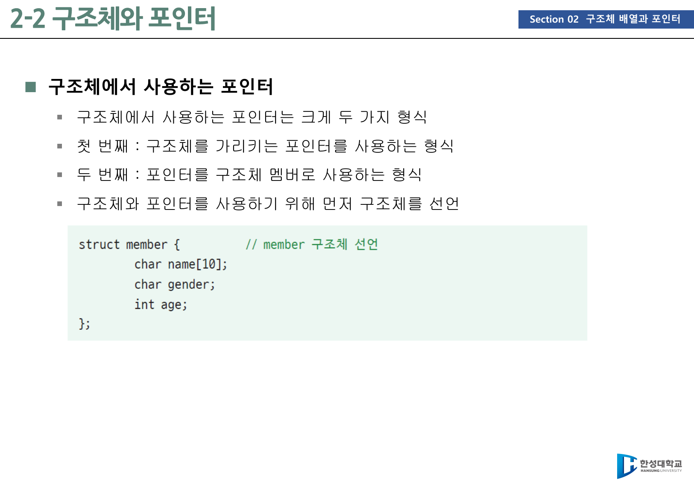

```c
struct student s1 = {"Kim", 90, 85, 87.5};
struct student *p = &s1;
```

포인터 `p`가 가리키는 구조체의 멤버에 접근하는 정식 표현은 `(*p).name`이다.

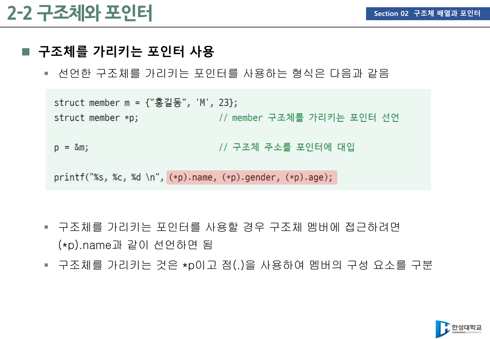

```c
printf("%s %d\n", (*p).name, (*p).kor);
```

괄호가 필요한 이유는 연산자 우선순위 때문이다. `.`가 `*`보다 먼저 계산되므로 `*p.name`처럼 쓰면 의도와 다르게 해석된다.

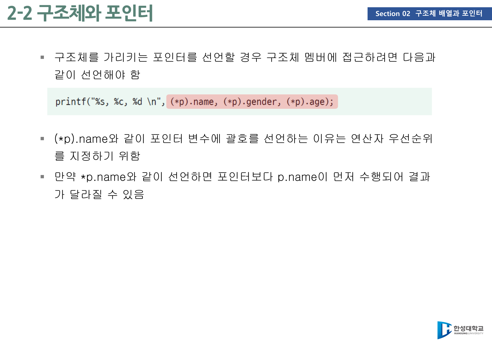

그래서 C는 더 읽기 쉬운 `->` 연산자를 제공한다.

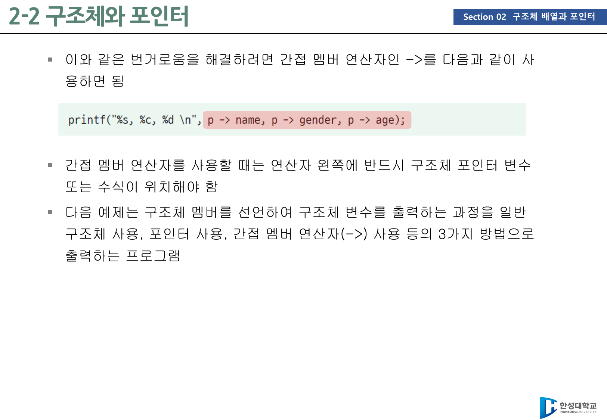

```c
printf("%s %d\n", p->name, p->kor);
```

다음 두 표현은 같은 뜻이다.

```c
(*p).kor
p->kor
```

실무에서는 구조체 포인터를 다룰 때 거의 항상 `->`를 사용한다. 함수에서 구조체를 수정해야 할 때도 포인터를 넘기고 `->`로 멤버를 바꾸는 패턴이 자주 나온다.

## 6. 구조체와 함수

구조체 변수를 함수 인수로 넘기면 전체 구조체가 복사된다.

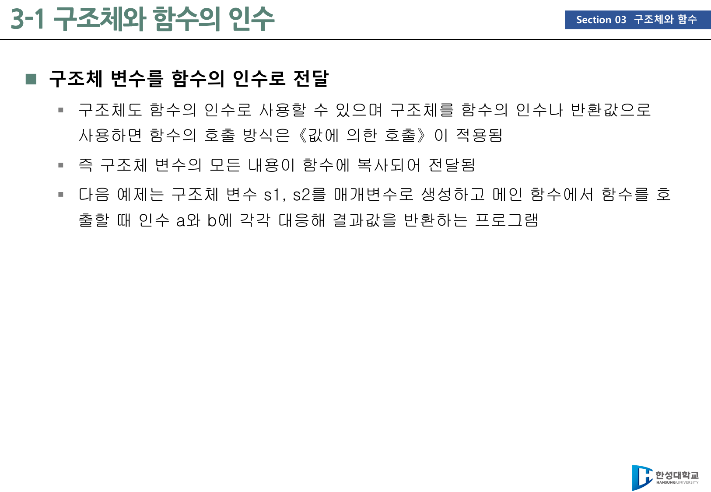

```c
void print_student(struct student s)
{
    printf("%s %d %d\n", s.name, s.kor, s.math);
}
```

출력만 한다면 값 복사도 괜찮다. 하지만 함수 안에서 원본을 수정하려면 구조체 포인터를 넘겨야 한다.

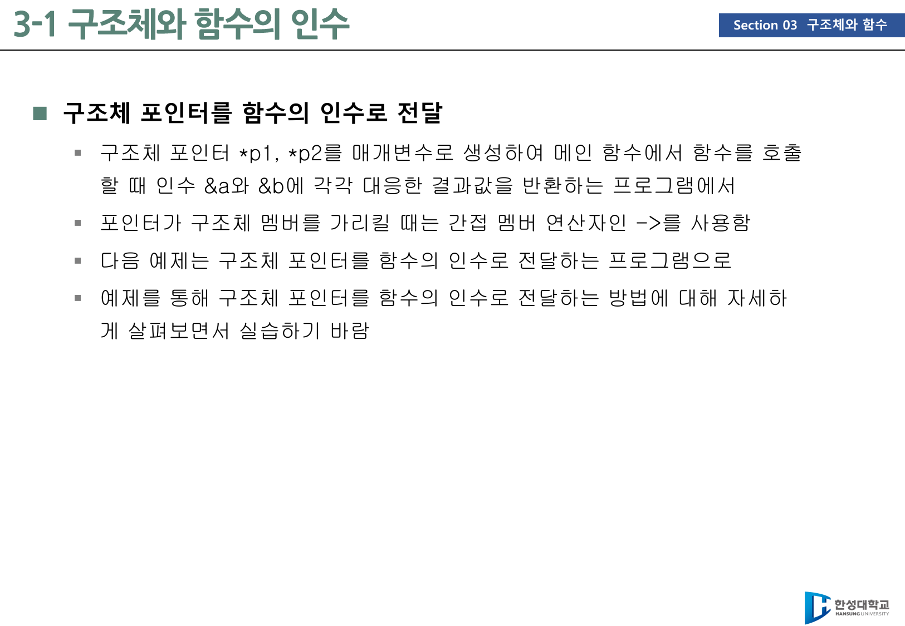

```c
void update_average(struct student *s)
{
    s->avg = (s->kor + s->math) / 2.0;
}
```

구조체를 함수 반환값으로 사용할 수도 있다.

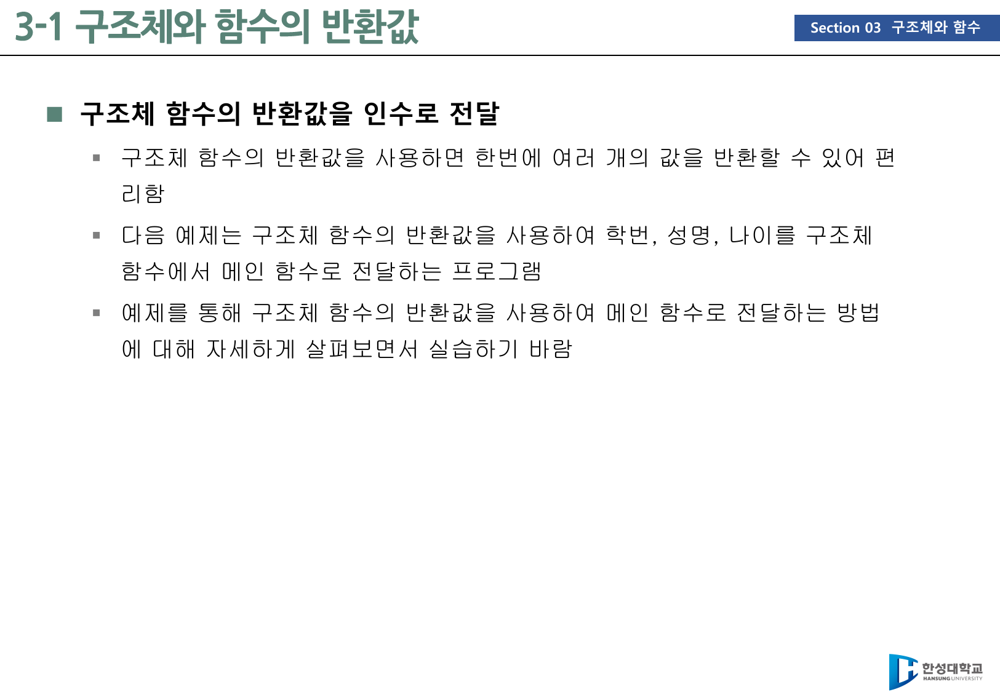

```c
struct student make_student(const char *name, int kor, int math)
{
    struct student s = {"", kor, math, 0.0};
    strcpy(s.name, name);
    s.avg = (kor + math) / 2.0;
    return s;
}
```

이 방식은 함수가 여러 값을 한 번에 돌려주는 것처럼 사용할 수 있다. 단, 큰 구조체를 자주 복사하면 비용이 커질 수 있으므로 수정이 필요한 함수는 포인터를 넘기는 편이 좋다.

### 구조체 반환값을 읽는 방법

실습 자료는 구조체 함수의 반환값을 별도 슬라이드로 다룬다. 핵심은 함수가 `int` 하나만 돌려주는 것이 아니라, 여러 멤버를 가진 구조체 한 덩어리를 돌려줄 수 있다는 점이다.

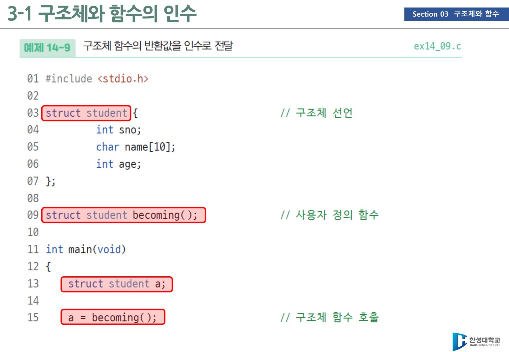

```c
typedef struct {
    int id;
    char name[20];
    int age;
} StudentInfo;

StudentInfo make_info(int id, const char *name, int age)
{
    StudentInfo s = {id, "", age};
    strcpy(s.name, name);
    return s;
}
```

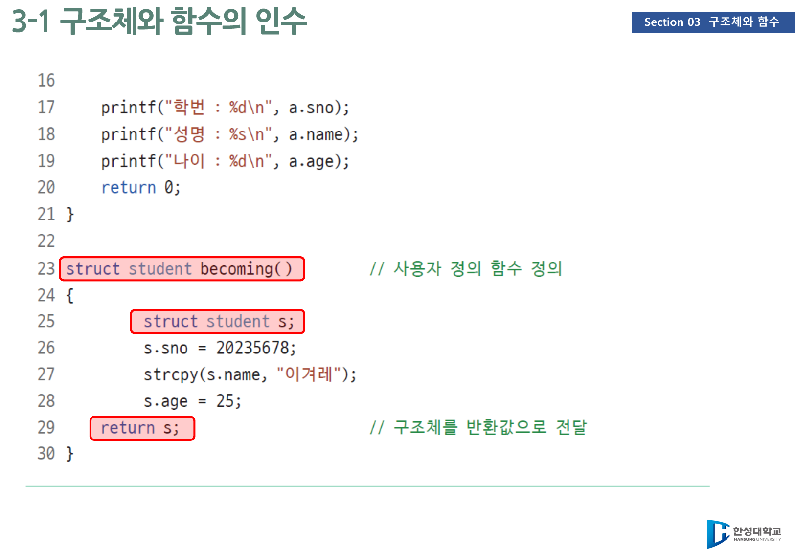

이 코드는 `id`, `name`, `age` 세 값을 따로 반환하지 않는다. 세 값을 `StudentInfo`라는 하나의 묶음으로 만든 뒤 그 묶음을 반환한다. 이 관점은 ROS2 메시지를 이해할 때도 도움이 된다. 메시지 하나가 여러 필드를 함께 가지고 이동하기 때문이다.

## 7. 구조체 안의 포인터

구조체 멤버로 포인터를 넣을 수도 있다.

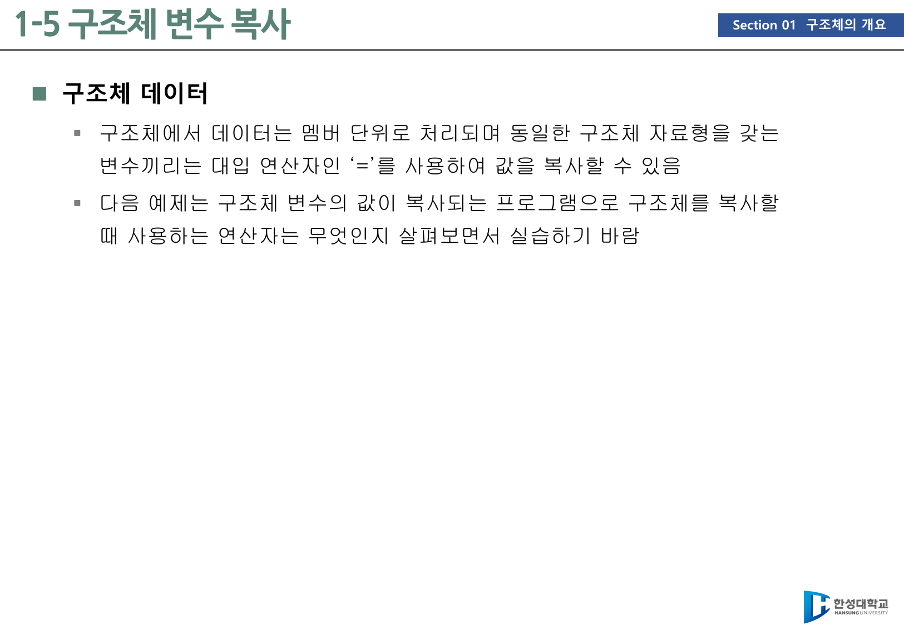

```c
struct label {
    const char *name;
    int value;
};
```

이 경우 `name` 멤버는 문자열 자체를 저장하는 배열이 아니라 문자열이 있는 위치를 가리키는 주소다. 포인터 멤버를 사용할 때는 "이 주소가 가리키는 데이터가 언제까지 살아 있는가"를 생각해야 한다.

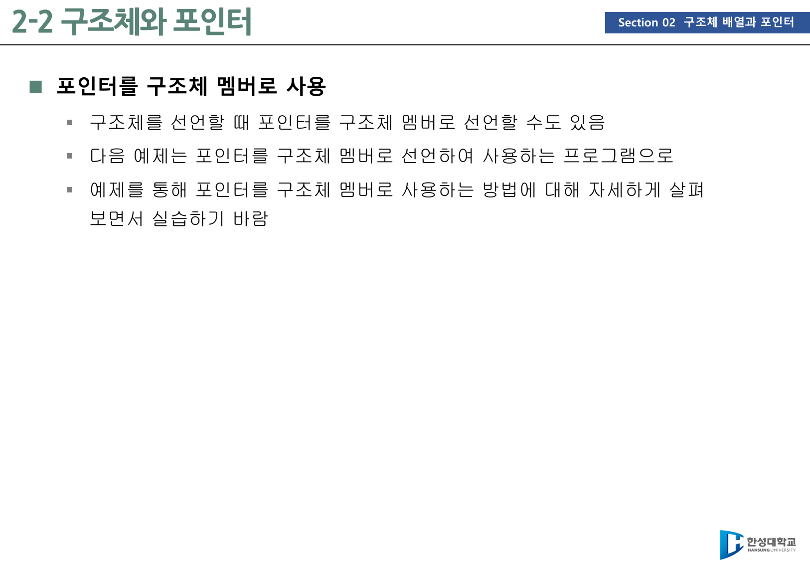

포인터 멤버는 세 가지 질문을 항상 같이 확인해야 한다.

| 질문 | 확인 이유 |
|------|-----------|
| 무엇을 가리키는가? | 문자열, 배열, 다른 구조체 등 대상 확인 |
| 그 대상은 언제까지 살아 있는가? | 지역 변수 주소를 저장하면 함수 종료 뒤 위험 |
| 복사하면 무엇이 복사되는가? | 데이터 전체가 아니라 주소만 복사될 수 있음 |

연결리스트는 구조체 안에 다음 노드의 주소를 넣는 대표적인 예다.

```c
typedef struct Node {
    int value;
    struct Node *next;
} Node;
```

`next`는 다음 `Node`의 주소를 저장한다. 배열은 메모리에서 연속된 칸을 사용하지만, 연결리스트는 포인터로 다음 데이터를 찾아간다. 이번 주에는 깊은 자료구조 구현보다 "구조체 안에 같은 구조체를 가리키는 포인터를 넣을 수 있다"는 감각을 잡는 것이 목표다.

## 8. 이중 포인터 빠른 복습

14주차 실습 자료에는 이중 포인터가 함께 등장한다. 이중 포인터는 포인터의 주소를 저장하는 포인터다.

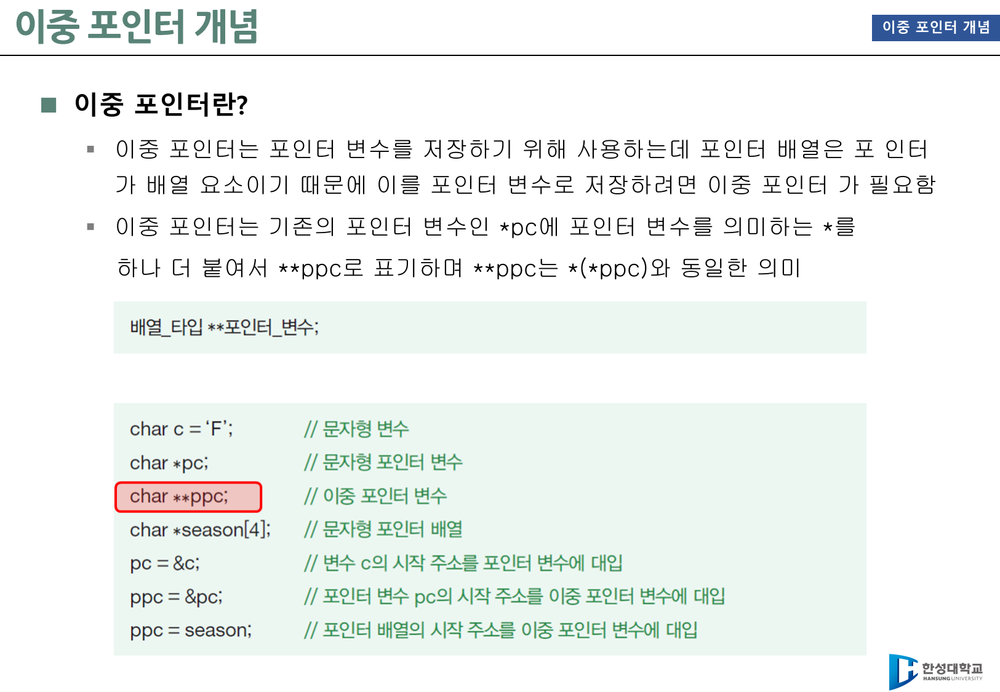

```c
char c = 'F';
char *pc = &c;
char **ppc = &pc;

printf("%c\n", c);
printf("%c\n", *pc);
printf("%c\n", **ppc);
```

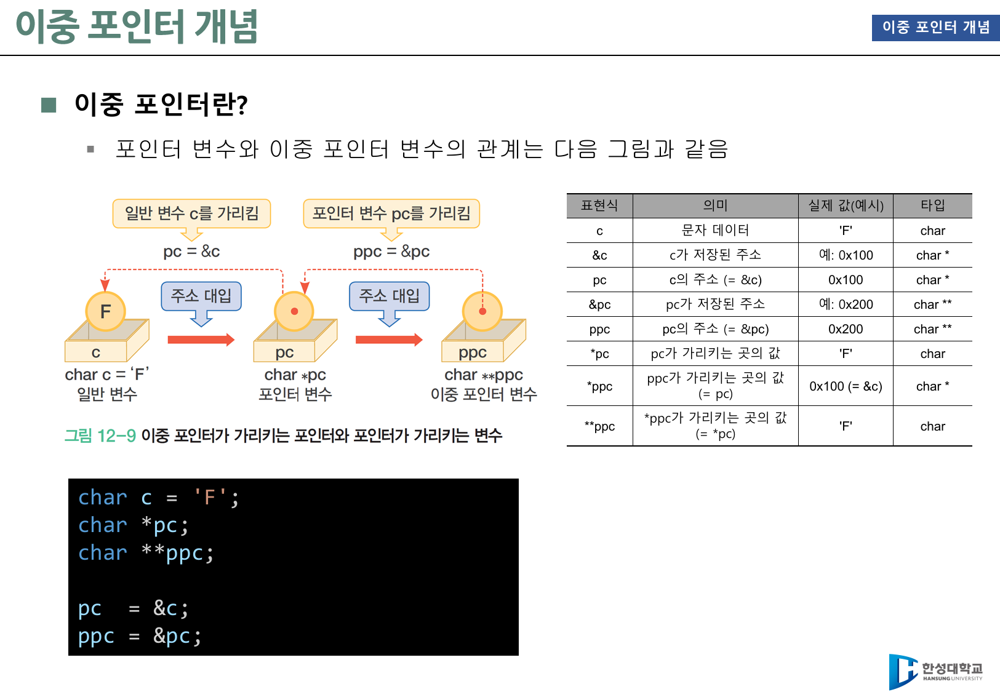

문자열 배열을 다룰 때 `char **`가 자주 나온다. 예상 문제 #1은 이 개념을 확인하는 문제다.

## 9. Arduino와 ROS2로 연결하기

구조체는 통신과 잘 어울린다. 메모리 안에서는 구조체로 다루고, 시리얼이나 WiFi로 보낼 때는 문자열로 바꾸면 사람이 확인하기 쉽다.

```c
typedef struct {
    float distance_cm;
    float speed_cmps;
    char state[16];
} SensorPacket;
```

이 구조체를 `"S,42.0,25.0,RUN"` 같은 문자열로 바꾸는 과정을 **직렬화**라고 한다. 반대로 문자열을 다시 구조체로 바꾸는 과정을 **역직렬화**라고 한다.

```c
SensorPacket p = {42.0f, 25.0f, "RUN"};
// 구조체 -> "S,42.0,25.0,RUN"
```

Arduino UNO R4 예제 `code/arduino/15_struct_packet/15_struct_packet.ino`는 센서 패킷 구조체를 만들어 시리얼로 출력한다. PC C 예제 `packet_parser.c`와 `ex14_struct_packet_list.c`는 그 문자열을 다시 구조체로 해석한다.

ROS2 메시지도 결국 이름 붙은 필드들의 묶음이다. 예를 들어 `geometry_msgs/msg/Twist`는 선속도와 각속도 필드를 가진 구조체처럼 생각할 수 있다. C에서 구조체로 데이터를 잘 묶는 연습은 15주차 ROS2 토픽을 이해하는 준비가 된다.

## 10. 실습 14-1 · 학생 구조체 만들기

파일: [`code/c/examples/ex14_struct_student.c`](code/c/examples/ex14_struct_student.c)

실습 순서:

1. `Student` 구조체의 멤버를 읽는다.
2. `make_student()`가 구조체를 반환하는 방식을 확인한다.
3. `update_score()`가 구조체 포인터를 받아 원본을 수정하는 방식을 확인한다.
4. 구조체 배열을 반복문으로 순회한다.

핵심 질문:

- `Student s`와 `Student *s`는 무엇이 다른가?
- 함수에서 평균을 수정하려면 왜 포인터가 필요한가?
- `students[i].avg`와 `p->avg`는 언제 사용하는가?

## 11. 실습 14-2 · 구조체 패킷과 연결리스트 맛보기

파일: [`code/c/examples/ex14_struct_packet_list.c`](code/c/examples/ex14_struct_packet_list.c)

이 예제는 세 가지를 한 번에 연결한다.

- `SensorPacket` 구조체로 거리, 속도, 상태를 묶는다.
- `serialize_packet()`과 `parse_packet()`으로 문자열 패킷을 왕복한다.
- `Node` 구조체의 `next` 포인터로 두 개의 패킷을 연결한다.

이 예제를 실행하면 Arduino가 보낸 것과 같은 형식의 문자열을 PC에서 먼저 검증할 수 있다. 보드에 올리기 전에 PC에서 문자열 형식을 확인하는 습관은 통신 디버깅 시간을 크게 줄인다.

## 12. 원본 도전 문제 풀이 방향

도전 문제는 구조체 선언, 구조체 대입, 구조체 함수 반환값을 확인한다.

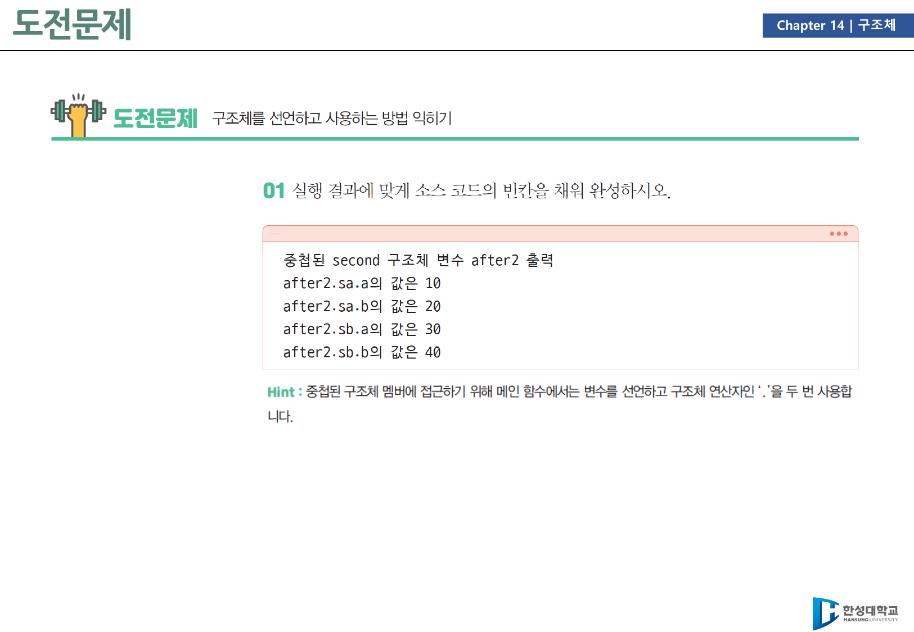

첫 번째 문제는 중첩 구조체의 멤버 접근을 확인한다. 구조체 안에 다른 구조체가 들어 있으면 `after2.before1.num`처럼 점 연산자를 이어서 사용한다.

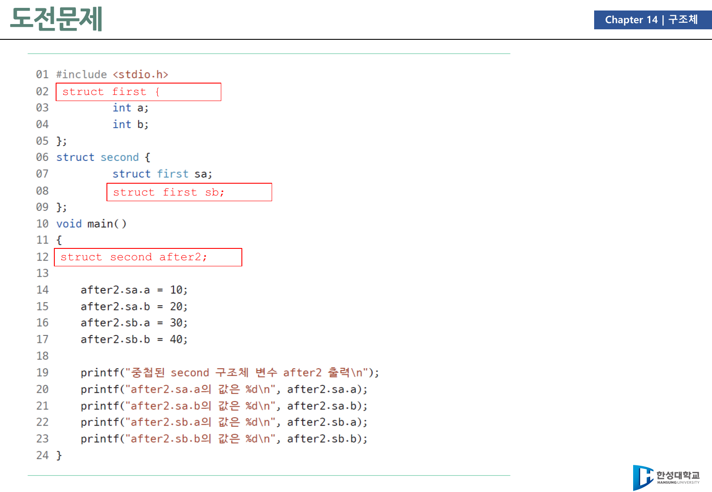

풀이 순서:

1. `struct first`가 먼저 선언되어 있는지 확인한다.
2. `struct second` 안에 `struct first sb;`처럼 첫 번째 구조체 변수가 멤버로 들어가는지 확인한다.
3. 바깥 구조체 변수에서 안쪽 구조체 멤버를 읽을 때는 점을 두 번 사용한다.

```c
after2.sb.num
after2.sb.ch
after2.num
```

이 문제의 핵심은 "구조체 안에 구조체가 들어가도 멤버 접근 규칙은 그대로"라는 점이다. 바깥 멤버로 한 번 들어가고, 안쪽 멤버로 한 번 더 들어간다고 설명하면 된다.

두 번째 문제는 구조체 변수끼리 대입할 수 있는지 확인한다.

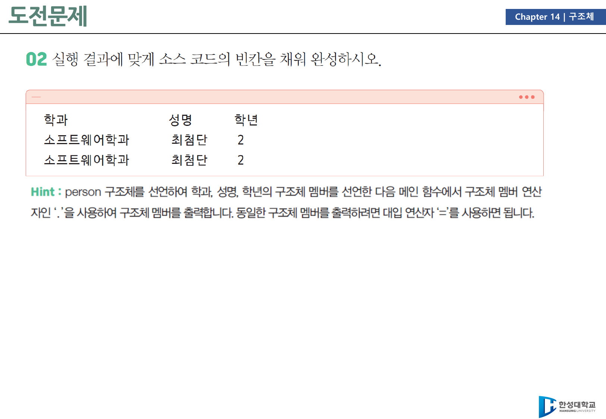

같은 구조체 자료형끼리는 `p2 = p1;`처럼 대입할 수 있다. 이때 멤버 값이 복사된다.

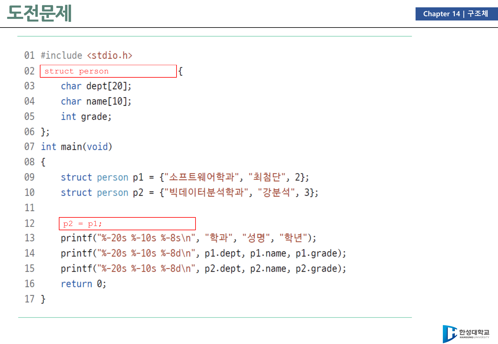

풀이 순서:

1. `p1`에 이름, 학번, 학년이 저장된다.
2. `p2 = p1;`이 실행되면 `p1`의 모든 멤버 값이 `p2`로 복사된다.
3. 그 뒤 `p2`를 출력하면 `p1`과 같은 내용이 나온다.

여기서 꼭 비교할 점은 배열이다. `int a[3]`, `int b[3]`는 `b = a;`로 복사할 수 없다. 하지만 `struct person p1`, `struct person p2`는 같은 구조체 자료형이므로 `p2 = p1;`이 가능하다.

세 번째 문제는 구조체를 함수 인수와 반환값으로 사용하는 문제다.

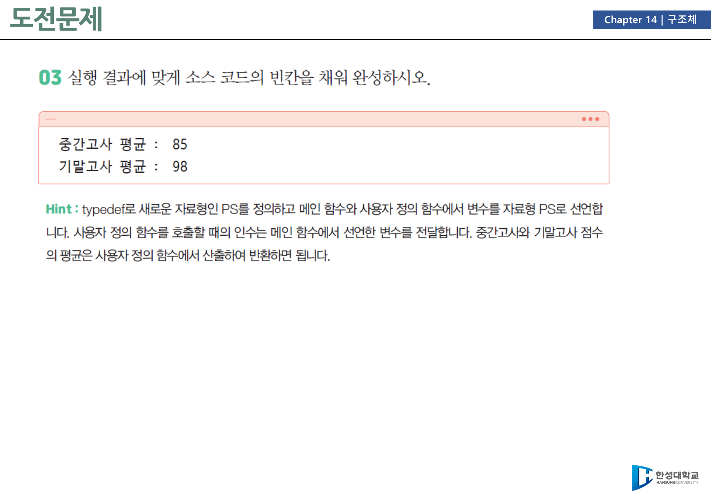

구조체를 반환하면 여러 값을 한 덩어리로 돌려주는 효과를 낼 수 있다.

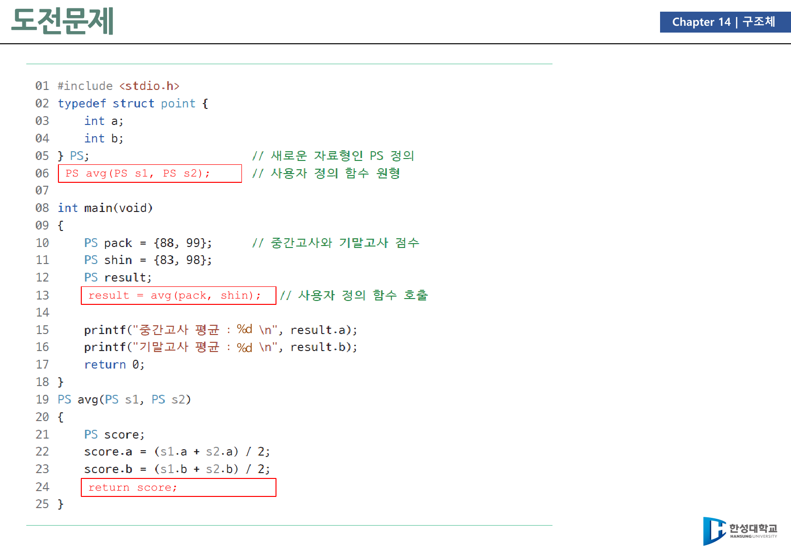

풀이 순서:

1. `typedef`로 구조체 별칭 `PS`가 만들어졌는지 확인한다.
2. `PS avg(PS s1, PS s2);`는 구조체 두 개를 받아 구조체 하나를 반환하는 함수 원형이다.
3. `result = avg(pack, shin);`에서는 `pack`, `shin` 구조체가 함수로 복사되어 들어간다.
4. 함수 안에서 평균 또는 합산 결과를 `score` 구조체에 채운 뒤 `return score;`로 반환한다.

이 문제를 풀 때는 "함수가 반환하는 값이 숫자 하나가 아니라 구조체 한 묶음"이라는 사실을 먼저 표시해 두면 덜 헷갈린다.

```c
PS result;
result = avg(pack, shin);  // avg 함수가 PS 구조체를 반환
```

수업 중에는 함수 호출 화살표를 그려서 `pack`, `shin`이 함수 안의 `s1`, `s2`로 복사되고, `score`가 다시 `result`로 복사된다고 보여 주면 좋다.

## 13. 예상 문제 해설

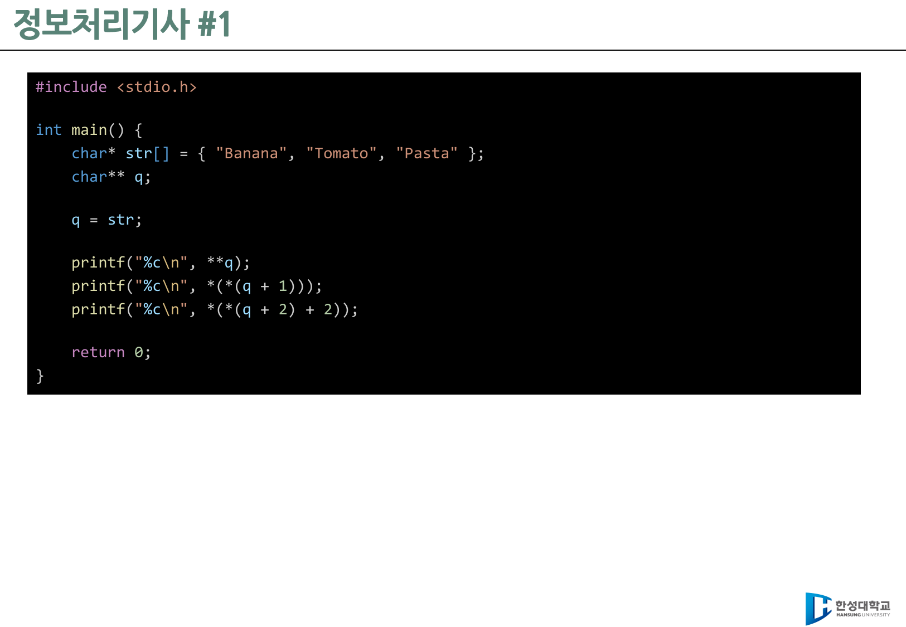

예상 문제 #1은 문자열 배열과 이중 포인터 문제다.

```c
char* str[] = { "Banana", "Tomato", "Pasta" };
char** q = str;

printf("%c\n", **q);
printf("%c\n", *(*(q + 1)));
printf("%c\n", *(*(q + 2) + 2));
```

풀이:

- `q`는 `str[0]`, 즉 `"Banana"`를 가리킨다. `**q`는 첫 글자 `B`.
- `q + 1`은 `"Tomato"`를 가리킨다. 첫 글자는 `T`.
- `q + 2`는 `"Pasta"`를 가리킨다. `+ 2`는 세 번째 글자이므로 `s`.

출력:

```text
B
T
s
```

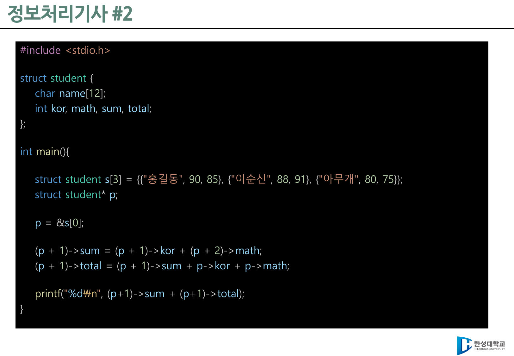

예상 문제 #2는 구조체 배열과 포인터 연산 문제다.

```c
(p + 1)->sum = (p + 1)->kor + (p + 2)->math;
(p + 1)->total = (p + 1)->sum + p->kor + p->math;
printf("%d\n", (p + 1)->sum + (p + 1)->total);
```

계산:

- `(p + 1)->kor`는 두 번째 학생의 국어 점수 `88`.
- `(p + 2)->math`는 세 번째 학생의 수학 점수 `75`.
- `sum = 88 + 75 = 163`.
- `p->kor`와 `p->math`는 첫 번째 학생의 `90`, `85`.
- `total = 163 + 90 + 85 = 338`.
- 최종 출력은 `163 + 338 = 501`.

## 14. 형성평가 체크포인트

- [ ] 배열과 구조체의 차이를 예로 설명할 수 있다.
- [ ] 구조체 변수의 멤버에 `.`로 접근할 수 있다.
- [ ] 구조체 포인터의 멤버에 `->`로 접근할 수 있다.
- [ ] 구조체 배열을 반복문으로 순회할 수 있다.
- [ ] 구조체를 함수에 값으로 넘길 때 복사된다는 점을 설명할 수 있다.
- [ ] 구조체 포인터를 함수에 넘겨 원본을 수정할 수 있다.
- [ ] `Node` 구조체의 `next` 포인터가 왜 연결리스트의 핵심인지 설명할 수 있다.
- [ ] Arduino 문자열 패킷과 ROS2 메시지가 "필드 묶음"이라는 점에서 구조체와 연결된다는 것을 설명할 수 있다.

## 15. 과제

1. `Student` 구조체에 `total`, `grade` 멤버를 추가하고 평균에 따라 `A`, `B`, `C`를 저장한다.
2. `SensorPacket` 구조체 배열 5개를 만들고 평균 거리와 가장 빠른 속도를 출력한다.
3. `Node` 3개를 연결한 뒤 반복문으로 모든 노드를 출력한다.
4. Arduino `15_struct_packet` 예제의 상태 문자열을 `STOP`, `SLOW`, `RUN` 중 하나로 바꾸어 출력한다.
5. 예상 문제 #1, #2의 출력 과정을 종이에 주소 그림으로 설명한다.

## 16. 참조 예제

- PC C: [`ex14_struct_student.c`](code/c/examples/ex14_struct_student.c)
- PC C: [`ex14_struct_packet_list.c`](code/c/examples/ex14_struct_packet_list.c)
- PC C: [`packet_parser.c`](code/c/examples/packet_parser.c)
- Arduino UNO R4: [`15_struct_packet`](code/arduino.md)
- ROS2 bridge: [`stella_n2_bridge`](code/ros2/stella_n2_bridge/index.md)
