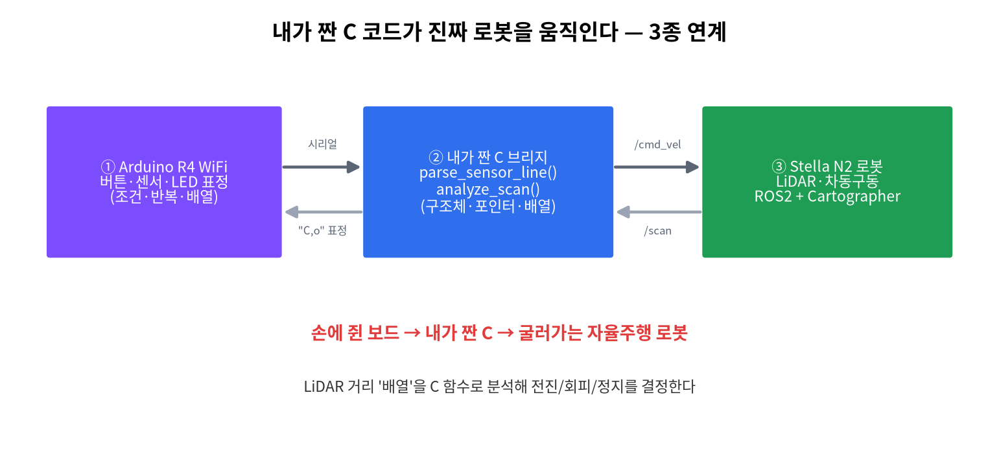

# 15주차 · C ↔ ROS2 · 로봇 · 기말 프로젝트
> C언어 · 미래모빌리티학과 | CLO2·CLO4·CLO5



## 학습 목표
- 배운 C(구조체·포인터·배열)가 로봇 통신의 핵심 코드임을 체험한다.
- C 프로그램과 ROS2 노드가 데이터를 주고받게 한다.
- (캡스톤) **Arduino + C + Stella N2 로봇**으로 자율 동작을 구현·발표한다.

---

## 강의 해설

15주차는 한 학기 동안 배운 문법이 실제 로봇 시스템에서 어떻게 만나는지 확인하는 종합 주차다. 처음에는 `printf`로 숫자를 출력했지만, 이제는 센서 배열을 분석하고 구조체로 판단 결과를 묶고 ROS2 토픽으로 주행 명령을 내보낸다. 이때 새로 등장하는 ROS2가 주인공처럼 보일 수 있지만, 실제 판단의 중심은 여전히 C로 작성한 함수다.

ROS2의 토픽은 프로그램들이 데이터를 주고받는 통로다. `/scan`은 LiDAR 거리 배열을 보내고, `/cmd_vel`은 로봇의 선속도와 각속도를 보낸다. 여기서 `/scan`의 `ranges[]`는 10주차 배열, 가장 가까운 장애물 탐색은 6주차 반복문, 정지/회피 판단은 5주차 조건문, 판단 결과 묶음은 14주차 구조체, 배열 전달은 12~13주차 포인터와 연결된다.

기말 프로젝트의 목표는 멋진 기능을 많이 붙이는 것이 아니라, 작은 기능을 안전하고 설명 가능하게 완성하는 것이다. 로봇은 실제로 움직이는 장비이므로 코드 품질과 안전 절차가 기능만큼 중요하다. 바퀴를 띄운 상태에서 `/cmd_vel` 값을 먼저 확인하고, 속도는 작게, 정지거리는 크게 시작한다. 발표에서는 "어떤 C 함수가 어떤 판단을 했고, 그 결과가 어떤 ROS2 메시지로 바뀌었는가"를 설명할 수 있어야 한다.

## 1. 이론

### 1.1 ROS2와 C의 관계
- ROS2는 로봇 SW의 표준 미들웨어. 노드들이 **토픽(topic)** 으로 데이터를 주고받는다(발행 publish / 구독 subscribe).
- C 진입점: **rcl**(ROS2의 C 코어), **rclc**(MCU용 순수 C, micro-ROS). → 우리가 배운 C가 그대로 쓰인다.

### 1.2 두 가지 연동 방식
=== "방식 A · 시리얼 브리지 (기본)"
    보드는 시리얼 송수신, PC의 C/C++ 브리지가 ROS2로 변환. 설치 간단, C 학습(파싱·구조체) 집중.
    핵심 C 함수: `parse_sensor_line()`(구조체로 파싱), `analyze_scan()`(배열 분석).

=== "방식 B · micro-ROS (도전)"
    보드가 직접 ROS2 노드. **rclc=순수 C**. UNO R4 공식 지원(RAM 32KB라 경량).

### 1.3 LiDAR 배열 → C로 판단 (자율주행의 심장)
Stella N2의 LiDAR는 거리 **배열**을 `/scan`으로 보낸다. 이를 C로 분석해 주행을 정한다.
```c
ScanResult analyze_scan(const float *ranges, int n, float stop_dist) {
    // 1) 배열 순회로 최솟값(가장 가까운 거리) 탐색
    // 2) 거리·방향 → 전진(F)/좌회피(L)/우회피(R)/정지(S)
}
```
> 배운 것 총동원: **배열 순회 + 조건 판단 + 구조체 반환 + 포인터 인자**.
> 상세: [C↔ROS2 & Stella N2 로봇](ros2-robot.md)

---

## 2. 핵심 용어 정리
| 용어 | 설명 |
|------|------|
| ROS2 | 로봇 SW 표준 미들웨어 |
| 노드/토픽 | 실행 단위 / 데이터 통로 |
| publish/subscribe | 발행 / 구독 |
| `/scan`, `/cmd_vel` | LiDAR 거리 / 주행 속도 토픽 |
| 브리지 | 시리얼↔ROS2를 잇는 프로그램 |
| micro-ROS / rclc | MCU용 ROS2 / 순수 C API |

---

## 3. 실습

### 실습 15-1 · 종합 복습
배열·포인터·구조체 총정리.

### 실습 15-2 · C↔ROS2 연동
시리얼 브리지로 보드 ↔ ROS2 토픽 pub/sub 확인.

기본 실행 흐름:

```bash
source /opt/ros/jazzy/setup.bash
mkdir -p ~/cprog_ws/src
cp -r courses-src/c-programming-202602/docs/code/ros2/stella_n2_bridge ~/cprog_ws/src/
cd ~/cprog_ws
colcon build --packages-select stella_n2_bridge
source install/setup.bash
ros2 run stella_n2_bridge stella_n2_bridge
```

테스트용 `/scan`:

```bash
ros2 topic pub /scan sensor_msgs/msg/LaserScan "{ranges: [1.2, 0.9, 0.4, 0.8, 1.1], range_min: 0.05, range_max: 8.0}" -r 2
ros2 topic echo /cmd_vel
```

!!! note "학생이 읽어야 하는 파일"
    먼저 `scan_logic.c`를 읽는다. 이 파일은 ROS2를 몰라도 이해할 수 있는 순수 C 코드다. 그 다음 `stella_n2_bridge.cpp`를 보면 C 함수의 결과가 `/cmd_vel` 메시지로 바뀌는 과정을 볼 수 있다.

### 실습 15-3 · 로봇 캡스톤
Stella N2 LiDAR(`/scan`) → `analyze_scan()` → 주행(`/cmd_vel`) + 아두이노 LED 표정.

!!! warning "안전 최우선"
    로봇 바퀴를 띄워 받침대에서 먼저 시험. 속도는 작게, 정지거리는 크게.

---

## 4. 기말 프로젝트(캡스톤)
- 주제 예: 텔레메트리 / 표정로봇 ROS2 제어 / 미니 자율주행 / **Stella N2 장애물 회피 주행**
- 평가: C 코드 품질(최대 비중) + 기능 + 연동 + **안전(게이트)** + 발표 + AI 리터러시 + 난이도 가산.
- 후속 교과(센서처리와 모터제어, 이동로봇과 ROS)의 예고편.

## 5. 참조
- [C↔ROS2 & Stella N2 로봇](ros2-robot.md) · [AI 활용 가이드](ai-literacy.md) · [2026 트렌드 검토](review.md)
- 코드: [`code/ros2/stella_n2_bridge`](code/ros2/stella_n2_bridge/index.md) · [`code/ros2/microros_uno_r4`](code/ros2/microros_uno_r4/index.md)

## 형성평가 체크포인트
- [ ] 토픽 pub/sub 동작 · [ ] C 로직이 실제 동작을 좌우 · [ ] 안전수칙 준수 · [ ] 발표·문서화

---

## 연습문제
1. ROS2에서 데이터를 보내는 것과 받는 것을 영어 용어로?
2. Stella N2에서 LiDAR 거리 데이터 토픽과 주행 명령 토픽의 이름은?
3. micro-ROS가 보드에서 사용하는 **순수 C** 클라이언트 API의 이름은?

??? success "정답 및 해설"
    1. **publish(발행)** / **subscribe(구독)**.
    2. `/scan` (LiDAR) / `/cmd_vel` (주행 속도 명령).
    3. **rclc** — rcl(C 코어) 위의 MCU용 C API.

    **🖼 그림으로 복습** — 내 C 코드가 진짜 로봇을 움직인다 — 3종 연계

    
