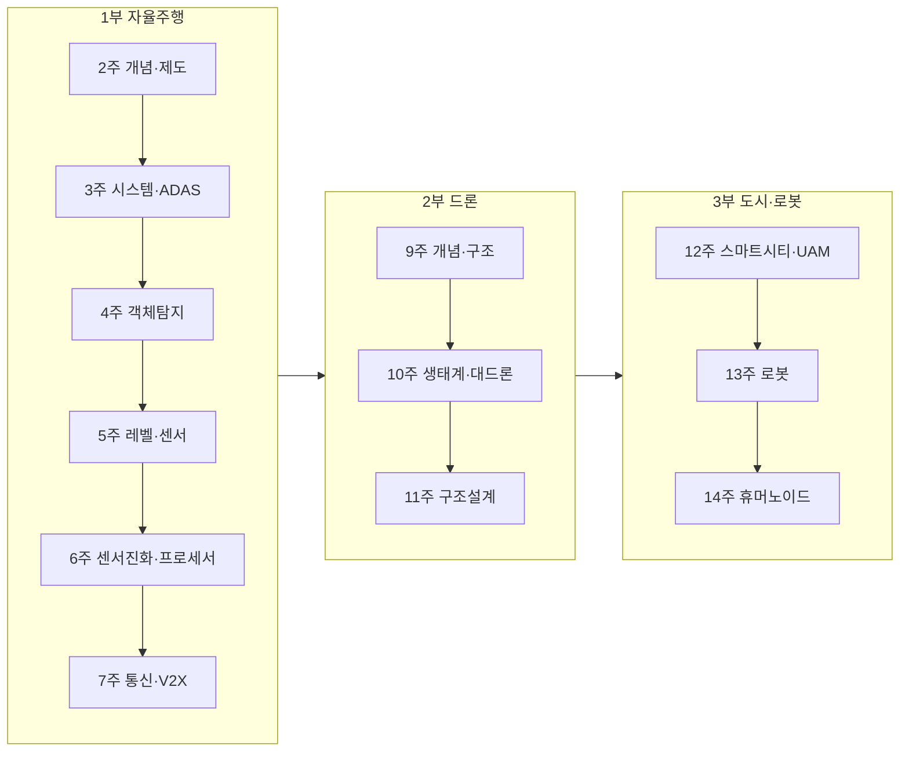

# 커리큘럼 (15주차 실제 운영표)

강의계획서 원안은 [Syllabus](syllabus.md)에 그대로 두었고, 이 페이지는 **2026-1학기에 실제로 진행된 순서**다. 시험 범위는 이 표를 기준으로 한다.

## 마스터 표

| 주 | 주제 | 강의 덱 (일자) | 핵심 키워드 |
|---:|---|---|---|
| 1 | [미래모빌리티란 무엇인가](week01.md) | 1 (3/4) | 모빌리티 정의 · 스마트시티(HMGICS·Woven City) · 쉘&맥킨지 도시 3분류 · LCA · 타산업 융합 BM |
| 2 | [자율주행 개념·레벨·제도](week02.md) | 2 (3/9) | 자율주행 정의 · 필요성(NHTSA 94%) · 임시운행허가 A/B/C형 · 시범운행지구 · 5-F(ree) |
| 3 | [자율주행 시스템과 ADAS](week03.md) | 3 (3/16) · 4 (3/23) | 시스템 4구성 · ADAS 11종 · SENSE–PERCEIVE/LOCALIZE/MAP–PLAN–CONTROL · 오토라벨링 · CNN |
| 4 | [객체탐지와 데이터 기반 의사결정](week04.md) | 5 (3/23) · 6 (3/30) | 1-stage vs 2-stage · IoU · NMS · 인지–인식–계획–제어 · 세이프티 드라이버 · 로보택시 |
| 5 | [자율주행 단계·규제와 센서 시스템](week05.md) | 7 (4/2) · 8 (4/6) | SAE 레벨 · UNECE ALKS/DSSAD/R155/R156 · 테슬라 vs 웨이모 · SDV·AUTOSAR · REM · 군집주행 |
| 6 | [센서의 진화와 AI 프로세서](week06.md) | 9 (4/9) · 10 (4/9) | 카메라·라이다·레이더 · Pseudo-LiDAR · SWIR/열화상 · TOPS · KITTI·nuScenes |
| 7 | [통신·V2X와 공학 설계 프로세스](week07.md) | 11 (4/16) · 12 (4/20) | V2V/V2I/V2P · DSRC · Time-to-Green · MEC-View · 5G · 7단계 공학설계 |
| 8 | **[중간고사](week08.md)** | 4/23 | 객관식 20 + 서술형 5 |
| 9 | [드론 개념·분류·시스템 구조](week09.md) | 13 (4/30) · 14 (5/4) | UAV/UAS/RPAS · 크기·무게·고도 분류 · 항법–유도–제어 · MTOW·T/W · 로터 수별 특성 |
| 10 | [드론 생태계·DNA+드론·대드론](week10.md) | 15 (5/11) · 16 (5/14) | DNA+드론 · 날다–찍다–운반하다–지키다 · 드론법·UTM · DTI · React/Interdict |
| 11 | [드론 구조설계와 멀티콥터 설계](week11.md) | 17 (5/18) · 18 (5/25) | 강성 vs 강도 · 안전계수·Weight Spiral · 구조–제어 코디자인 · 배터리 4방식 · 모달해석 |
| 12 | [스마트시티·MaaS·UAM](week12.md) | 19 (5/28) · 20 (6/1) | 스마트시티 정의 · MaaS 5단계·Whim · UAM 역사·종류 · UTM vs ATM · 로봇 산업 |
| 13 | [로봇의 등장과 산업용 로봇](week13.md) | 21 (6/8) · 21-2 | 로봇 어원·3원칙 · 로봇 연표 · 산업용 로봇 6종 · 중국 휴머노이드 VLA |
| 14 | [휴머노이드 보행과 Physical AI](week14.md) | 22 (6/11) | 유압 vs 전기·하모닉 · 다리 6 DOF · 컴플라이언트 액추에이터 4종 · Kimodo 파이프라인 |
| 15 | **[기말고사](week15.md)** | 6/22 | 객관식 10 + 서술형 |

## 원안 대비 무엇이 바뀌었나

| 계획서 원안 | 실제 운영 | 사유 |
|---|---|---|
| 3주 자율주행 AI · 4주 핵심기술 | 3~4주 AI 기초, 5~7주 센서·프로세서·통신 | 자율주행 파트를 **3주 확대** — 중간고사 비중(40%)에 맞춤 |
| 5~6주 드론 | 9~11주 드론 | 중간고사 이후로 이동, **구조설계 주차 신설**(11주) |
| 7주 UAM | 12주 UAM(스마트시티와 통합) | 스마트시티–MaaS–UAM을 하나의 도시 문맥으로 묶음 |
| 9주 우주산업 | (별도 주차 없음) | 성층권 드론·우주 탐사 로봇 사례로 9·13주에 흡수 |
| 11주 자동차 SW공학 · 12주 ROS | (별도 주차 없음) | SDV·AUTOSAR·완성차 OS로 5주차에 흡수 |
| 13주 웨이모 사례 연구 | (별도 주차 없음) | 5·6주 센서/프로세서 비교와 4주 로보택시 사례로 분산 |
| 14주 드론 산업 경쟁력 | 13~14주 로봇·휴머노이드 | **Physical AI·휴머노이드**를 최신 동향으로 신규 편성 |

## 학습 흐름 한 장 요약

## 반복되는 4단 리듬

세 파트가 모두 같은 순서로 전개된다. 이것을 알면 **처음 보는 분야도 어디를 물어볼지 예측**할 수 있다.

| 단계 | 자율주행 | 드론 | 로봇 |
|---|---|---|---|
| ① 개념·정의 | 자율주행자동차/시스템, SAE 레벨 | UAV/UAS/RPAS, 드론법 | Robota, 로봇 3원칙, 지능형 로봇 |
| ② 하드웨어·센서 | 카메라·라이다·레이더 | 프레임·추진·전원·FC | 액추에이터(유압/전기/SEA/QDD) |
| ③ AI·플랫폼 | 객체탐지·AI 프로세서·V2X | DNA+드론, 자율비행 | VLA, Physical AI, Kimodo |
| ④ 산업·법제도 | 임시운행허가·시범지구·UNECE | 드론법·UTM·대드론 | 로봇 산업·HRC·CES |
