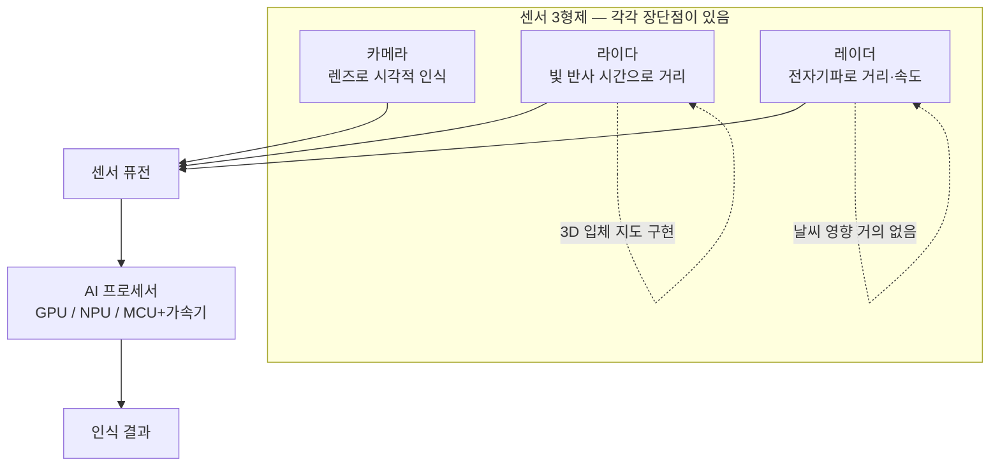
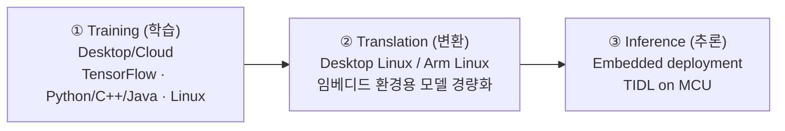

# 6주차 · 센서의 진화와 AI 프로세서

> 🔗 **강의 흐름** — 5주차에서 "센서 성능이 아니라 비용 대비 성능"이라고 했다. 이번 주는 그 말의 근거를 **센서별 물리 원리와 가격표**로 확인하고, 경쟁의 무게중심이 왜 **AI 반도체**로 넘어갔는지 본다. 중간고사 서술형 3번(센서 비교 + 센서 퓨전)이 여기서 나온다.

> **학습목표** — 카메라·라이다·레이더·열화상·SWIR 센서의 물리적 원리와 장단점을 비교하고, 각 센서의 진화 방향을 설명하며, 자율주행 AI 프로세서의 성능 지표와 시장 구도를 설명할 수 있다.

> 💡 **기초 다지기** — **센서는 각각 "보는 방식"이 다르다.** 카메라는 빛(색·형태), 라이다는 레이저의 왕복 시간(거리·3D), 레이더는 전파와 도플러(거리·속도), 열화상은 온도. 그래서 **하나가 실패하는 상황에서 다른 하나가 살아남는다.** 이것이 센서 퓨전의 존재 이유다.

## 🗺️ 한눈에 보는 개념도

## 1. 주요 자율주행 센서 3종

| 센서 | 원리 | 강점 |
|---|---|---|
| **카메라(Camera)** | 렌즈를 통해 **시각적으로** 주변 사물·상황 인식 | 색·문자·형태(신호등, 표지판, 차선) |
| **라이다(Lidar)** | **빛(레이저)이 반사되는 시간**으로 거리 측정 | **3D 입체 지도 구현 가능** |
| **레이더(Radar)** | **전자기파 송수신**을 통한 거리·속도 측정 | **날씨 등 외부환경 영향 거의 없음** |

> **레이더, 라이다, 카메라 — 각각 장단점이 있다.** 그래서 **센서 퓨전**이 필요하다.

**센서 시스템의 진화 3축**

1. **라이다 vs 스테레오 카메라** — 3D 인식, 처리속도, 환경 등에서 차이. 다양한 참조 모델이 진화 중
2. **라이다 센서의 저가화** — 관련 기술의 발달, **고정형 라이다 상용화 가시화**
3. **레이더 기술의 진화** — 3D 레이더 기술

## 2. 카메라

- ADAS 시장에서 이미 **핵심 센서로 발전**했고, **모든 자율주행 차량 제조사가 카메라를 필수 센서로 채택·탑재**한다.
- 종류: 전방 카메라 / 스테레오 카메라 / 어라운드 뷰 카메라 / 운전자 모니터링 카메라
- 탑재 수: **초기 1~3개 구조 → 중장기 8~14개 구조**

### 노출의 3요소 (카메라 요구 사양의 기초)

| 요소 | 정의 |
|---|---|
| **조리개(Aperture)** | 카메라 렌즈에서 **빛의 양을 조절**하는 장치 (f/1.4 ~ f/22) |
| **셔터 속도(Shutter Speed)** | 설정한 시간만큼 열리고 닫히며 **노출 시간을 조정**하여 빛의 양을 조절 (1/1000s ~ 1/4s) |
| **감도(ISO)** | 이미지 센서가 조리개와 셔터를 거쳐 노출된 **빛을 증폭할 수준** (ISO 50 ~ 25600, 높을수록 노이즈↑) |

### 자율주행용 카메라의 요구 사양

- **카메라 설치 위치 최적화** — 시야각과 사각지대를 고려한 배치
- **슈도 라이다(Pseudo-LiDAR)** — 카메라 기반의 3D 인식 데이터를 LiDAR처럼 표현한 기술, **"가짜 LiDAR"**. 스테레오 카메라로 3D 인식을 구현
- **조명 변화에 대한 내구성** — 터널, 역광, 밤 시간대 등 → 향후 **조리개 조절 기능**에 대한 고려
- **날씨 조건에 대한 문제** — 악천후

### 카메라의 진화 기술

| 기술 | 내용 |
|---|---|
| 조리개 자동 조절 | 자동 조리개 조절이 되는 트랜센드 블랙박스 |
| **HDR** (High Dynamic Range) | 명암비가 큰 장면에서 밝은 곳과 어두운 곳을 동시에 표현 |
| 센서 떨림 보정 | **센서 시프트 / 렌즈 시프트** 방식 |
| 센서 클리닝 | dlhBOWLES의 라이다 클리닝 시스템 |

### 열화상 카메라와 SWIR

- **열화상 카메라** — **온도 인지**로 사람/동물/차량 등의 **야간 인지 가능**. 예: 열화상 카메라 '바이퍼(Viper)'
- **SWIR 카메라** (이스라엘 TriEye) — **저비용 단파장 적외선 이미징 솔루션**. CMOS 기반 이미지 센서에 SWIR 기능 구현 → 악천후 이미징, 야간 이미징, 원격 물질 감지, 1000배 낮은 가격, 저전력, 고해상도

!!! danger "시험 포인트 — 매년 나온다"
    **"온도를 감지하여 야간에도 사람, 동물, 차량 등을 인식할 수 있는 센서는?"**
    → ① 4D 이미징 라이다 ② 이벤트 카메라 ③ Short Wave IR 센서 ④ **열화상 카메라** ← 정답

## 3. 라이다 (LiDAR)

### 원리

$$d = \frac{c \cdot t}{2}$$

- **d** — 물체까지의 거리
- **c** — 빛의 속도 (약 3×10⁸ m/s)
- **t** — 왕복 시간 (펄스가 갔다가 되돌아오는 데 걸리는 시간)

→ 왕복이므로 **2로 나눈다**는 점이 핵심이다.

### 라이다의 장점과 한계

| 구분 | 내용 |
|---|---|
| ✅ 장점 | 레이저 신호가 반사되어 돌아오는 **시간을 이용해 거리를 측정**한다 / **3D 인식**이 가능하여 주변 환경을 정밀하게 파악할 수 있다 |
| ❌ 한계 | **오염에 민감**하기 때문에 클리닝 시스템이 필요한 경우가 있다 / **안개·비·눈에서는 성능이 저하**된다 / 고가 |

!!! danger "시험 포인트 — 라이다 오답 보기"
    **"안개나 비, 눈이 올 때도 정확한 성능을 유지할 수 있다"** → **틀린 설명**이다. 날씨에 강한 것은 **레이더**다.

### 라이다 주요 이슈

**① Eye-safe LiDAR — 950nm vs 1550nm**

| 파장 | 특징 |
|---|---|
| 950nm | 기존 주류. 출력을 높이면 눈에 위험 |
| **1550nm** | **출력이 높아져도 사람의 눈에 흡수되지 않아 안전**. 다만 **양산 비용과 소모 전력이 상대적으로 높음** |

**② 회전형 vs 고정형 라이다 — 고정형으로의 진화**

| 방식 | 용도 |
|---|---|
| **Flash** | 근거리, 작은 기기 (드론, 스마트폰) |
| **MEMS** | 차량용 ADAS, 로봇 (균형 잡힌 성능) |
| **OPA** | 미래형 고정형 라이다, 군사/자율주행차 |

**③ VCSEL** (Vertical Cavity Surface Emitting Laser) — Apple 아이폰X에 **Face ID 기능을 위해 처음으로 도입**된 광원. 라이다 소형화·저가화의 열쇠.

**④ 고정형 라이다와 양산을 위한 진화 (CES 2022)**

- 우리나라 — **SOS랩, 카네비컴** 등
- 해외 — **루미나, 발레오, 이노비즈, 헤사이, 로보센스** 등

### 라이다 제품 비교 (대표 사양)

| 모델 | 채널 | 측정거리 | 가격 |
|---|---:|---|---:|
| Valeo ScaLa I (ADAS) | 4 | 100~200m | **$600** |
| Velodyne HDL-64 | 64 | 100~120m | **$75,000** |
| Velodyne HDL-32 | 32 | 80~100m | $30,000 |
| Velodyne VLP-16 | 16 | 100m | $8,000 |
| RoboSense RS-LiDAR-32 | 32 | 200m | $16,800 |
| Ouster OS-1 | 64 | 100m | $12,000 |
| ibeo Lux | 4~8 | 120~200m | $10,000~20,000 |

!!! tip "이 표가 말하는 것"
    양산용 ADAS 라이다(ScaLa I, $600)와 연구용 고성능 라이다(HDL-64, $75,000)의 **가격 차이가 100배**다. 5주차의 "비용 대비 성능 최적화"가 무슨 뜻인지 이 표 하나로 설명된다.

## 4. 레이더 (Radar)

### 동작 순서

1. 운전자의 차량에서 **전파 신호 송신**
2. 다른 차량이나 장애물로부터 **반사된 전파 수신**
3. 송·수신 데이터 간 **시간차와 도플러 주파수 변화량** 확인
4. 시간차·도플러 변화량 기반으로 **물체와의 거리와 상대속도**를 측정

### 진화 방향

- 이전에는 좁은 범위에서 사물을 인식하도록 사용
- 최근 **넓은 범위에서 물체를 인식**하도록 진화
- 앞으로 레이더 센서가 **360°/3D를 인지**하도록 진화할 것으로 예상

### 4D 이미징 레이더

**"4D"** = 거리·방위각·고도(3D) + **속도**. 카메라·라이다에 비해 **날씨, 조명 등 외부 요인에 강인**하다.

| 기업 | 내용 |
|---|---|
| 피스커 | **최초의 4D 이미징 레이더 적용 차량 마그나 상용화** (CES 2022) |
| 모빌아이 | 4D 이미징 레이더의 효용성 강조 |
| 구글 | 5세대 자율주행 시스템에 4D 이미징 레이더 **자체 설계 및 적용** (2020.03) |
| 엔비디아 | 하이페리온 9 — 서라운드로 확장 (2022.03) |
| 스마트레이더시스템(SRS) | **세계 최고 수준의 4D 이미징 레이더 기술력 보유**(2019, Yole). 서울대와 자율주행 실증 과제 수행(과기정통부 주관) |

## 5. 센서 클리닝 시스템

라이다·카메라는 오염에 취약하다. 실제 상용화를 위해서는 **닦는 기술**이 필요하다.

| 기업 | 방식 |
|---|---|
| 구글 웨이모 (2017) | 라이다 센서에 **일반 자동차와 비슷하게 와이퍼 추가** |
| 발레오 (2018 파리모터쇼) | **에버뷰 센트리캠(EverView Centricam)** — 센서를 감싼 덮개가 고속으로 회전하면서 물을 떨어내 센서를 보호 |
| dlhBOWLES (CES 2019) | 라이다 센서에 묻은 먼지·흙탕물을 **물로 클리닝**하는 시스템 |
| 마이크로시스템 | 액체 자가세정 유리(Liquid self-cleaning glass) — 소수성 층 + 유전체 층 + 전극으로 물방울을 진동시켜 먼지 제거 |

## 6. 센서 진화 방향 — 6가지 요약

> **"카메라, 라이다, 레이더 — 센서의 조합"**

1. **360도 인식**을 위한 진화
2. **3D 인식**을 위한 진화
3. **Worst case / Edge case 인식**을 위한 진화
4. **대량 양산 및 상용화**를 위한 진화
5. **클리닝 시스템** 필요
6. **프로세서 / SW 융합** 필요

## 7. 자율주행 AI 프로세서

### 프로세서의 세 갈래

**GPU** / **NPU** / **MCU + AI 가속기**

→ 특히 **Level 2/3에서는 임베디드 프로세서가 중요**하다.

### 딥러닝의 3단계 흐름

| 단계 | 내용 |
|---|---|
| **Training** | 이미지·모션·소리 데이터로 컴퓨터에서 딥러닝 모델을 학습. TensorFlow, Python/C++/Java, Linux |
| **Translation** | 학습된 모델을 그대로 쓰지 않고 **임베디드 환경(ARM, 리눅스)에서 돌아가게 변환**. PC와 임베디드 보드는 성능이 완전히 다르므로 "가볍게, 빠르게" 바꾸는 과정 |
| **Inference** | 자동차·카메라·로봇에서 실제로 AI가 판단하는 단계. **TIDL**(TI Deep Learning)로 MCU에서 실행 |

!!! warning "Network quantization 문제 발생 → 정확도 감소"
    모델을 경량화(부동소수점 → 정수)하는 과정에서 **정확도가 떨어지는** 문제가 생긴다. 이것이 임베디드 AI의 핵심 난제다.

### 성능 지표 — GFLOPS vs TOPS

| 지표 | 의미 |
|---|---|
| **GFLOPS** (Giga Floating Point Operations per Second) | 초당 **부동소수점** 연산 횟수 — **실수 연산 성능(정밀 계산)**. FLOAT32/FLOAT64 기준 |
| **TOPS** (Tera Operation Per Second) | 초당 **정수** 연산 횟수 — **AI 추론 성능** |

**정밀도** FLOAT64 > FLOAT32 > INT16
**속도/전력** INT16 > FLOAT32 > FLOAT64

→ AI 추론은 정밀도를 조금 희생하고 속도·전력을 얻는 방향으로 간다. 그래서 TOPS가 지표가 된다.

### 딥러닝 프로세서 성능 비교

| 기업 | 제품 | 성능 |
|---|---|---|
| **NVIDIA** | 재비어 SoC | 30 TOPS / 30W |
| | 드라이브 PX 페가수스 | 320 TOPS / 300W |
| | 오린 플랫폼(2023) | 최대 254 TOPS / 100W |
| | **Thor** (GTC 2022) | **2000 TOPS** |
| **Tesla** | FSD computer | (144 TOPS 급) |
| Horizon Robotics | Journey 5 | 30 TOPS / 30W 급 |
| **퀄컴** | 스냅드래곤 라이드 (CES 2020) | **700 TOPS / 130W** |
| **모빌아이** | EyeQ ULTRA | **176 TOPS** (2025년 예정) |

**NVIDIA Drive Thor (GTC 2022)** — HYPERION 8 SENSORS: 2.5 G sample/sec, 750 TOPs ×3 / HYPERION 9 SENSORS: 4.2 G sample/sec, **2000 TOPs ×2**

**Qualcomm Snapdragon Ride Vision SoC** — 업계 선도 **4nm** SoC. Hexagon Processor, Kryo CPU, Embedded Vision Accelerator, Spectra ISP, Video Processor(VPU), Secure Processor, Safety Island. Arriver 협력 발표.

!!! danger "시험 포인트 — 매년 나온다"
    **"다음 중 고성능 자율주행 프로세서를 제조하지 않는 기업은?"**
    → ① **루미나** ← 정답(라이다 업체) ② 퀄컴 ③ 엔비디아 ④ 모빌아이

    **"자율주행용 임베디드 AI 프로세서에 대한 설명으로 옳지 않은 것"**
    → **"전력 소모가 많아도 괜찮다"** ← 정답(옳지 않음). 연산량 최적화 필요 ✅, 빠른 처리 속도 요구 ✅, 양자화 이슈 발생 가능 ✅

## 8. 프로세서 경쟁 구도 — 모빌아이 / 퀄컴 / 엔비디아

### 모빌아이의 전략

- 플랫폼 두 가지 — **camera only platform** / **with LiDAR platform**
- 특징: **정밀 지도** / 자율주행 센서(라이다·카메라) **직접 개발** / 자율주행 처리 소프트웨어 **직접 개발**
- 전략: **자율주행 솔루션 + 정밀 지도 + 센서를 묶어서 납품**
- **REM Cloud-enhanced ADAS, Volkswagen** — 자체 기술이 탑재된 **약 100만 대의 차량**을 활용해 데이터를 크라우드소싱하여 고화질 지도 구축

### 시장 구도

> **기존 ADAS 시장 — 사실상 모빌아이 독점(데이터 독점)**
> **자율주행 시장에서 자동차사의 모빌아이 견제 → 엔비디아/퀄컴 등과 협력**

### 카메라 기반 인식 솔루션 — 스트라드비전(STRADVISION)

기존 **레벨 2, 3 정도의 자율주행 프로세서에 AI 가속기를 붙인 형태**의 경량 인식 소프트웨어에서 많은 시장을 장악.

## 9. 자율주행 데이터셋

| 데이터셋 | 출처·특징 |
|---|---|
| **KITTI** | KIT(Karlsruhe Institute of Technology) 발표 (**2012.03**). 카메라·라이다·GPS 등 사용. **이미지 당 최대 15대의 자동차와 30명의 보행자**. 홈페이지에서 별도의 오픈소스는 제공하지 않음 |
| **KITTI-360** | KITTI 데이터에서 조금 더 진화한 데이터셋 |
| **nuScenes** | 현대자동차와 Aptiv의 합작법인 **모셔널**이 공개한 **멀티모달 데이터셋** (**2019.03**). 카메라·레이더·라이다 데이터셋 조합. 차들이 운행했던 도시(Boston Seaport, Singapore One North)의 **정밀 지도 제공** |
| **BDD100K** | 미국 버클리대에서 만든 데이터셋 |
| **Waymo** | 웨이모 공개 데이터셋 |
| **TuSimple** | 자율주행 트럭 업체 TuSimple 제작 |
| **Cirrus** | **볼보**에서 제작 (**2021.02**). 루미나와 함께. 정밀 지도 제공 |
| **KODAS** | 우리나라 **국토정보공사**에서 만든 데이터셋 |

**딥러닝 vs 비 딥러닝 알고리즘 비교 (KITTI dataset, Vehicle 기준)**

| 방식 | 방법 | 연도 | Vehicle |
|---|---|---:|---:|
| Deep Learning | Multi-Task CNN and ROI | 2018 | **91.67%** |
| | RRC (Recurrent Rolling Convolution) | 2017 | 90.19% |
| | SubCNN | 2017 | 88.86% |
| | SDP+RPN | 2016 | 89.42% |
| Non-Deep Learning | AOG (Hierarchical And-Or model) | 2016 | **75.94%** |
| | SubCat | 2015 | 75.46% |
| | 3DVP (3D Voxel Pattern) | 2015 | 75.77% |

→ **딥러닝과 비딥러닝의 격차가 약 15%p**. 이것이 자율주행이 딥러닝으로 넘어간 이유다.

## 10. 센서 데이터 인식

| 센서 | 인식 방식 |
|---|---|
| **Camera 기반** | 차선 인식 / 객체 인식 알고리즘 → **객체 추적(Object tracking)** |
| **라이다 기반** | **Deep learning 기반 알고리즘(연구용)** — Input Original Data(.pcd) → RoI Filtering → Ground Removal Algorithm → Clustering |
| **레이더 기반** | 전자파 신호를 이용한 객체 인식 / **4D Imaging Radar** → 라이다 기반 인식과 유사하게 사용 |
| **센서 퓨전** | 센서 데이터 융합 — 카메라/라이다/레이더 융합. KITTI 사례(Camera + LiDAR), nuScenes 사례(Camera + LiDAR + Radar) |

### 주행 예측 (Prediction)

> **보행자의 의도 파악을 통한 주행 보조 / 주변 차량의 의도 파악**

| 과제 | 내용 |
|---|---|
| **순환적 인공지능 학습 데이터 구조 설계** | 인공지능 기술을 활용하여 데이터의 선별·라벨링·배포를 자동화하는 기술 필요 |
| **데이터 수집 체계 설계** | 대규모 자율주행 데이터를 효율적으로 수집·관리할 수 있는 체계 필요 |
| **센서 가상화 및 시뮬레이터 설계** | 실사와 같은 **디지털 트윈** 생성 기술 필요. 실도로에서 획득하기 힘든 상황을 모사하여 시뮬레이션 데이터 생성 가능 |

## 🤔 생각해 봅시다

> **중간고사 서술형 3번 시나리오 연습**
> **"짙은 안개가 낀 야간 고속도로에서 선행 트럭 뒤에 정지 차량이 있는 시나리오"** — 각 센서가 기여하는 바와 한계를 센서 퓨전 관점에서 논하시오.

| 센서 | 이 시나리오에서의 기여 | 한계 |
|---|---|---|
| 카메라 | 차선·트럭 후미등 인식 | 야간 + 안개 → **거의 무력**. 선행 트럭에 가려 정지 차량 안 보임 |
| 라이다 | 3D 형상·거리 정밀 | **안개에서 산란으로 성능 저하** |
| 레이더 | **날씨 영향 거의 없음**, 거리·상대속도 직접 측정. 트럭 아래로 반사되어 **선행차 너머 감지 가능** | 해상도 낮음, 객체 종류 구분 어려움 |
| 초음파 | 근거리 주차 보조 | 고속 주행에는 **부적합**(8m 수준) |
| 이벤트 카메라 | 밝기 변화만 감지 → 고속·저지연 | 절대 밝기 정보 없음 |
| 열화상 | **온도로 사람·동물·엔진 열원 감지** → 야간에 유효 | 열 대비가 없는 물체는 약함 |

→ 결론: **레이더 + 열화상**이 이 시나리오의 주력, 카메라·라이다는 보조. 그리고 **V2X**(7주차)가 있다면 선행 트럭이 정지 차량 정보를 직접 전송해 줄 수 있다.

## ✅ 이번 주 체크리스트

- [ ] 카메라·라이다·레이더의 원리와 대표 강점을 한 줄씩 말할 수 있다
- [ ] 라이다 거리 공식 **d = c·t/2**를 쓸 수 있다
- [ ] 1550nm이 eye-safe인 이유와 단점을 안다
- [ ] Flash/MEMS/OPA의 용도 차이를 안다
- [ ] GFLOPS와 TOPS의 차이를 설명할 수 있다
- [ ] 루미나가 프로세서 회사가 아니라는 것을 안다

---

▶️ **다음 주 예고** — 센서로도 못 보는 것을 **통신**으로 본다. V2X 4유형, DSRC, MEC, 5G. 그리고 중간고사 서술형에 나오는 **7단계 공학 설계 프로세스**를 실제 공모전 사례로 익힌다. → [7주차](week07.md)
