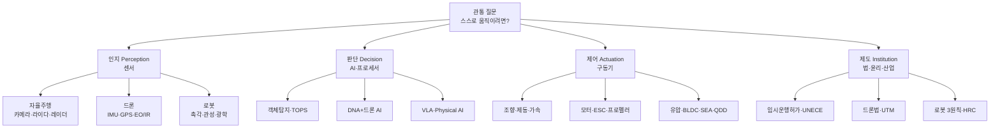

# 🧭 강의 전체 흐름

주차 페이지를 하나씩 보면 "자율주행 → 드론 → 로봇"이 따로 노는 세 과목처럼 보인다. 실제로는 **하나의 질문**을 세 무대에서 반복하는 구조다.

> **관통 질문 — "무엇이 스스로 움직이려면 무엇이 필요한가?"**
> 답은 세 무대에서 똑같다: **인지(센서) → 판단(AI·컴퓨팅) → 제어(액추에이터)**, 그리고 이것을 사회가 받아들이게 하는 **제도**.

## 1. 전체 지도

## 2. 주차 연결표 — "이번 주는 어디에 붙는가"

| 주차 | 인지 | 판단 | 제어 | 제도 |
|---:|---|---|---|---|
| 1 | | | | 모빌리티 정의·도시 변화·LCA |
| 2 | | | | 자율주행 정의·SAE·임시운행허가·5-F |
| 3 | 센서장치·ADAS 입력 | SENSE→PLAN 구조·CNN | 차량제어(ESC·EMS·MDPS) | |
| 4 | | 객체탐지·IoU·NMS | | 세이프티 드라이버·로보택시 산업 |
| 5 | 테슬라/웨이모 센서 구성 | SDV·AUTOSAR·완성차 OS | | UNECE ALKS·R155·R156 |
| 6 | 카메라·라이다·레이더 진화 | GPU/NPU·TOPS·데이터셋 | | |
| 7 | V2X로 센서 한계 극복 | MEC·5G·Digital Twin | | 캘리포니아 무인차 규정 |
| 9 | 드론 항법센서 | 자동조종(항법–유도–제어) | 고정익/회전익/하이브리드 | ICAO·드론법 정의 |
| 10 | 대드론 DTI 센서 | DNA+드론 AI 플랫폼 | Interdict(Kinetic/Non-K) | 드론법·스마트도시법·UTM |
| 11 | 모달해석(진동 계측) | 구조–제어 코디자인 | 모터·프로펠러·배터리 | 안전계수(FoS) 규정 |
| 12 | | MaaS 플랫폼·데이터 | UAM 추진 방식 3종 | K-UAM 운용개념서·UTM vs ATM |
| 13 | 검사용 로봇 센서 | | 산업용 로봇 6종 | 로봇 3원칙·로봇 산업 정책 |
| 14 | IMU·토크센서·SLAM | Kimodo·ProtoMotions | 유압/전기/SEA/QDD | HRC 안전 |

## 3. 네 개의 큰 그림

### ① 자율주행은 "센서 성능"이 아니라 "비용 대비 성능"의 싸움이다
연구용 차량은 라이다를 다수 사용하지만, 양산차는 비용 때문에 적용이 제한된다. 테슬라(카메라 8개 + 레이더 1 + 초음파 12, 144 TOPS)와 웨이모(라이다 중복 배치)는 **같은 문제에 대한 서로 다른 경제적 답**이다.
→ 그리고 이제 경쟁력은 센서가 아니라 **AI 반도체와 시스템 아키텍처**로 이동했다. (5·6주차)

### ② 자율주행의 마지막 20%는 통신이 채운다
카메라는 선행 차량 너머를 인지하지 못하고, 라이다는 코너 뒤를 감지하지 못한다. 이 한계를 **V2X·MEC·5G**가 보완한다. 자율**협력**주행이라는 개념은 여기서 출발한다. 대신 연결이 늘수록 **해킹·프라이버시·시스템 마비** 위험이 같이 커진다. (7주차)

### ③ 드론은 "무엇을 할 것인가"가 기체보다 먼저다
기체는 동일해도 **임무 장비가 목적을 결정**한다. 그래서 수요가 **날다 → 찍다 → 운반하다 → 지키다**로 진화하고, 운반·지키다 단계부터는 AI가 선택이 아니라 필수가 된다. (9·10주차)

### ④ 로봇의 성공은 기술이 아니라 고객 가치가 결정한다
$$\text{고객가치} = \text{편의성} + \text{시간절약} + \text{안전성} \;>\; \text{비용} + \text{불편함} + \text{학습부담}$$
룸바가 ASIMO보다 먼저 대중 시장에 자리 잡은 이유다. 또한 미래 제조의 해답은 완전 무인화가 아니라 **인간–로봇 협업(HRC)** — 사람은 판단·창의, 로봇은 반복·고중량·정밀. (12~14주차)

## 4. 시험을 향한 읽기 순서

!!! tip "중간고사(40%) 대비"
    `2주차 개념·제도` → `5주차 레벨·규제` → `3주차 인지–판단–제어` → `6주차 센서 비교` → `7주차 V2X` 순으로 읽으면 서술형 5문항이 그대로 커버된다.

!!! tip "기말고사(30%) 대비"
    `12주차 스마트시티 정의` → `11주차 구조설계(강성/FoS/동력원)` → `14주차 액추에이터 4종·모션 플래닝` → `10주차 UTM·법률` 순. 기말은 **계산 문제**가 나온다(BPF·FoS·호버링 시간).

전체 문항 유형은 [시험 유형과 핵심 정리](exams.md)에 정리했다.
