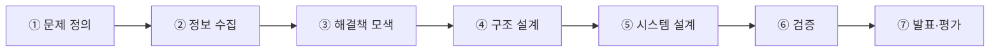

# 과제·발표 안내

**과제 10% + 발표 10% = 20%**. 시험 다음으로 큰 비중이며, 두 과제는 서로 연결되어 있다.

## 1. 미래 자동차산업 아이디어 공모전 제안서

이 과목의 주 과제는 **아이디어 공모전 참가 형식**의 제안서 작성과 발표다. 제출물은 보통 **참가신청서 + 연구계획서(제안서)** 한 벌이다.

### 왜 공모전 형식인가

강의 목표가 *"미래 모빌리티 기술의 산업화/제도화에 따른 법적·행정적·윤리적 문제에 대해 고찰하고 토론한다"*이기 때문이다. 즉 **기술을 아는 것**과 **그 기술로 무엇을 해결할지 제안하는 것**은 다른 능력이며, 이 과제는 후자를 훈련한다.

### 제안서의 뼈대 — 7단계 공학 설계 프로세스

7주차에서 다룬 프로세스를 그대로 쓰면 된다. 실제 수업에서 제시된 **과속방지턱 사례**가 모범 예시다.

| 단계 | 과속방지턱 사례에서 무엇을 했나 |
|---:|---|
| **① 문제 정의** | 과속방지턱의 부작용을 **운전자 / 자동차 / 도로·환경** 세 관점으로 나누어 구체적으로 나열. (승차감 저해, 신체부상, 하부·조향장치 손상, 보행자 공간 침범, 소음, 급가속에 의한 환경오염 등) |
| **② 정보 수집** | 기존 해법 조사 — **Mercedes-Benz Magic Body Control**. 스테레오 카메라가 전방 4.5~13.7m에서 10~20mm 요철 인식. **최초 컨셉의 Lidar가 양산 과정에서 스테레오 카메라로 대체**된 점까지 파악 |
| **③ 해결책 모색** | 구조·시스템 관점의 대안 도출 |
| **④~⑤ 구조·시스템 설계** | 센서(Stereo Camera·IMU·Radar·Vehicle Speed) → State estimation/Perception → Vehicle State/Environment Representation → Control → Actuator Command. 또는 **End-to-End Deep Learning** 대안 |
| **⑥ 검증** | 강화학습 구조(Observation → 256 → 128 → 192 nodes → Action) 등 구현 방안 |
| **⑦ 발표** | 제안서 + 구두 발표 |

!!! tip "좋은 제안서의 조건"
    1. **문제를 관점별로 쪼갠다.** "불편하다"가 아니라 "누구에게, 무엇이, 왜"로.
    2. **이미 있는 해법을 반드시 조사한다.** 벤츠가 왜 라이다를 포기하고 카메라로 갔는지 같은 **결정의 이유**까지 파악하면 제안의 설득력이 다르다.
    3. **기술만 쓰지 말고 제도·비용을 함께 쓴다.** 이 과목은 "사회·제도·법적 문제 고찰"이 교과목 개요에 명시되어 있다.
    4. **숫자를 넣는다.** 4.5~13.7m, 10~20mm처럼 구체적 수치가 있는 제안이 평가에서 유리하다.

### 참고 — 역대 수상작 흐름

수업에서는 지난 회차 공모전 수상작과 최근 공모전 목록(Linkareer 등)을 함께 소개한다. 팀 구성은 개인 또는 2~3인이 일반적이다.

## 2. 무인동력비행장치 4종(무인멀티콥터) 교육 이수

별도 과제로 **무인동력비행장치 4종(무인멀티콥터) 온라인 교육 이수증** 제출이 부과된다.

| 항목 | 내용 |
|---|---|
| 대상 | 최대이륙중량 **250g 초과 ~ 2kg 이하** 무인멀티콥터 |
| 방식 | 온라인 교육 이수 (한국교통안전공단 배움터 등) |
| 제출물 | 교육이수증명서 / 수료증 (PDF·이미지) |

!!! note "왜 이 과제를 하는가"
    9~11주차 드론 파트의 **법·제도 학습을 실제 경험으로 연결**하기 위해서다. 드론법과 항공안전법이 왜 무게 구간(250g / 2kg / 12kg / 150kg)으로 규제를 나누는지, 직접 이수 과정을 밟아 보면 체감된다. → [9주차](week09.md) 무게별 분류 참조

## 3. 발표

- 과제로 작성한 제안서를 수업 시간에 발표한다.
- 발표 순서는 랜덤 선정 도구로 정한다.
- 교수학습방법이 **토의토론식**을 포함하므로, 발표 후 질의응답이 평가에 반영된다.

!!! tip "발표에서 자주 받는 질문"
    - "그 기술은 지금 왜 안 되고 있나요?" → **비용·규제·기술 성숙도** 중 무엇이 병목인지 답할 수 있어야 한다.
    - "누가 돈을 내나요?" → 사용자·지자체·제조사 중 누가 지불하는 구조인지.
    - "안전은요?" → 실패 시나리오와 대응(페일세이프)을 한 줄이라도 준비할 것.

## 4. 매주 「생각해 봅시다」

각 주차 페이지 하단의 **🤔 생각해 봅시다** 문항은 수업 중 토론용이다. 시험 서술형이 이 문항들과 겹치는 경우가 많으므로, 답을 미리 정리해 두면 두 번 이득이다.

| 주차 | 대표 토론 문항 |
|---|---|
| [1주차](week01.md) | 전기차가 "친환경"이라는 주장을 LCA 관점에서 검증하시오 |
| [2주차](week02.md) | 자율주행차의 등장으로 새롭게 생겨나는 직업이 있을까? |
| [3주차](week03.md) | 라벨 오류 4유형 중 자율주행 안전 관점에서 가장 위험한 것은? |
| [5주차](week05.md) | 테슬라와 웨이모 전략 중 어느 쪽이 먼저 대중화될까? |
| [7주차](week07.md) | 신호등이 없는 도시가 가능하려면 무엇이 전제되어야 하는가? |
| [10주차](week10.md) | 도심 대드론 무력화의 부수 피해를 어떻게 통제할 것인가? |
| [12주차](week12.md) | UAM이 도심 밀집도를 낮춘다는 기대는 타당한가? |
| [14주차](week14.md) | 휴머노이드는 과연 필요한가? 바퀴 구동이 더 효율적인데도 두 발로 걷게 하는 이유는 무엇인가? |
