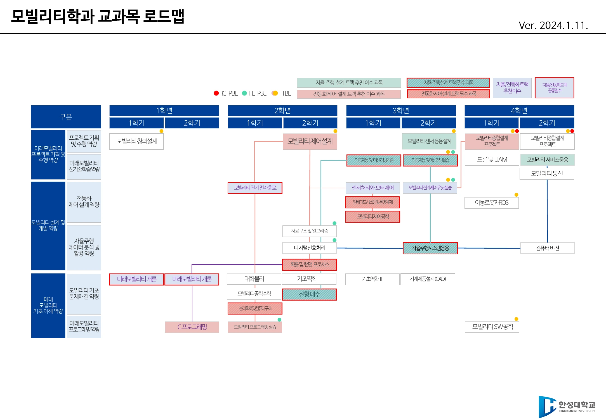
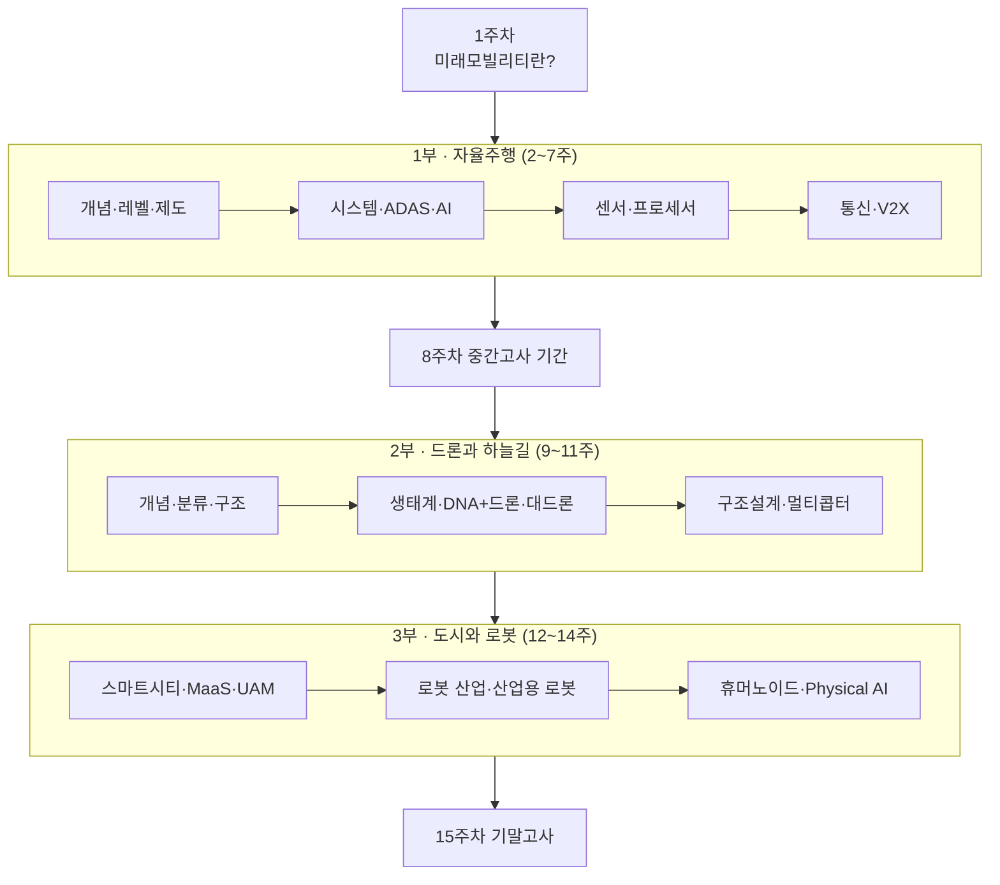

# 미래모빌리티 개론 · 2026-2학기
## 한성대학교 미래모빌리티학과 · 1학년 전공기초

> **"이동(移動)을 다시 설계하는 기술의 지도를 그린다"**
> 자율주행·드론/UAM·로봇으로 확장되는 **미래 모빌리티 기술 전반을 개관**하고, 그 발전이 불러오는 **사회·제도·법·윤리 문제**를 함께 고찰한다. 상세는 [강의계획서](syllabus.md).

## 한 줄 콘셉트

*"모빌리티는 무엇인가의 이동을 가능하게 하는 기술의 총합이다 — 그 총합이 지금 어디까지 왔는지 본다."*

## 교과목 개요

| 항목 | 내용 |
|------|------|
| 교과목 | 미래모빌리티 개론 (전공기초) |
| 학과·학년 | 미래모빌리티학과 · **1학년** |
| 학점 | 3학점 |
| 학기 | 2026학년도 2학기 (202602, 15주) |
| 운영 | 15주 · 오프라인 강의 (이론 + 발표 + 토론) |
| 교수학습방법 | 강의식 · 토의토론식 (T / PT / P / D) |
| 주교재 | 강의 노트(PPT 슬라이드) — 별도 구매 교재 없음 |
| 부교재 | Mobility 3.0(류두진 역, 2021.09) · 포스트 모빌리티(차두원·이슬아, 2022.06) · 미래 세상의 모빌리티(임덕신·양현준, 한빛미디어) |

!!! info "1학년 전공기초의 위치"
    이 과목은 학과 교과목 로드맵에서 **1학년 1·2학기 «미래모빌리티 개론»** — 즉 자율주행 설계 트랙과 전동화 제어 설계 트랙 **양쪽의 공통 출발점**이다.
    여기서 잡은 큰 그림 위에 2학년 «모빌리티 전기전자회로 / 모빌리티 프로그래밍», 3학년 «[모빌리티 전자제어유닛 실습](/courses/202602/mobility-ecu/) / 인공지능 및 머신러닝», 4학년 «모빌리티 종합설계 프로젝트»가 쌓인다.

## 역량 성취기준

| 성취기준 | 평가 방법 | 시점 |
|---|---|---|
| 미래모빌리티의 개념과 핵심 구성 요소의 구조 이해 | 서술형 시험 | 중간고사 |
| 미래모빌리티 시스템 기술 이해 | 서술형 시험 | 중간고사 |
| 각 분야(자율주행·드론·로봇)의 H/W 및 S/W 플랫폼 이해 | 서술형 시험 | 중간고사 |
| 미래모빌리티의 비즈니스 모델과 산업 트렌드 이해 | 사례 연구 | 기말고사 |
| 미래모빌리티와 스마트시티 AI 융합의 이해 | 사례 연구 | 기말고사 |

인재상 — **창의적 전문인**(창의융합역량: 창의력 30% · 융합능력 70%)

> ▲ 미래모빌리티학과 교과목 로드맵 — 「미래모빌리티 개론」은 1학년 1·2학기, 자율주행 트랙과 전동화 제어 트랙 양쪽의 공통 출발점이다 *(출처: 1주차 슬라이드 p5)*

## 평가

| 항목 | 비중 |
|---|---:|
| 출석 | 10% |
| **중간고사** | **40%** |
| 기말고사 | 30% |
| 과제 | 10% |
| 발표 | 10% |

!!! info "평가 비중은 강의계획서 기준"
    위 비중은 강의계획서에 명시된 기준이다. 평가 일정과 세부 방식은 **학사일정과 수업 중 공지**를 따른다.

## 이 강의의 3부 구조

세 파트 모두 **개념 → 하드웨어/센서 → AI·플랫폼 → 산업·법제도** 라는 같은 리듬으로 반복된다. 이 리듬을 알고 들으면 분야가 바뀌어도 길을 잃지 않는다. 자세한 연결은 [강의 전체 흐름](00-course-flow.md)에서 본다.

## 수업 운영 방식

- 매주 슬라이드 덱 1~2개(총 22개 덱)로 진행하며, 인포그래픽·뉴스·저널 기사·영상 자료를 함께 본다.
- 각 주차 끝에는 **「생각해 봅시다」** 토론 문항이 있다. 정답을 외우는 과목이 아니라 **판단 근거를 만드는 과목**이다.
- 과제는 **미래 자동차산업 아이디어 공모전 제안서**(문제 정의 → 정보 수집 → 해결책) 형태로 제출하고, 발표로 연결한다. [과제·발표 안내](assignments.md) 참고.
- **무인동력비행장치 4종(무인멀티콥터)** 온라인 교육 이수증 제출이 별도 과제로 부과된다.

!!! warning "자료의 기준 학기"
    주차별 강의 자료와 커리큘럼은 **직전 운영분(2026-1학기)을 기준으로 정리**한 것이다. 주제 구성은 그대로 이어지지만, **주차별 강의 일자와 최신 산업 동향 수치는 2026-2학기 개강 시점에 갱신**한다.
    이전 학기(2026-1학기) 목록에서도 이 페이지로 연결된다.

!!! note "이 사이트의 자료에 대하여"
    본 사이트의 주차별 페이지는 강의 슬라이드의 **핵심 개념·수치·용어를 강의자가 재정리한 학습 노트**이며, 여기에 **강의 슬라이드 원본 도해 55장**을 200 DPI로 캡처해 함께 실었다. 글로는 옮기기 어려운 **비교표·계통도·계산 표**를 중심으로 골랐고, 각 이미지 아래에 캡션과 출처 슬라이드 번호를 붙였다.

    본 강의자료의 저작권은 강의자에게 있으며, **수업 목적 외 재배포를 금한다.** 슬라이드에 인용된 외부 기관 자료(보고서·기사·제품 사진 등)의 권리는 각 원저작자에게 있다. 수업 중 배포되는 원본 PDF는 학내 LMS에서 확인한다.
