# 심화 · 자율주행 안전 아키텍처 — L2++와 ASIL-D

!!! abstract "이 자료의 위치"
    1주차에서 미래모빌리티의 큰 그림을 그렸다면, 이 심화 자료는 그중 **자율주행이 실제로 어디까지 왔고, 그 수준을 안전하게 떠받치려면 무엇이 필요한가**를 다룬다. 2주차(자율주행 레벨·제도)와 3주차(자율주행 시스템과 ADAS)를 예습하는 성격이며, 5주차(단계·규제)와 7주차(공학 설계 프로세스)에서 다시 만난다.

    핵심 질문은 하나다. **L3 상용화가 늦어지는 동안 업계는 무엇을 선택했고, 그 선택은 어떤 안전 설계를 요구하는가.**

!!! note "L2+ · L2++ 표기에 관하여"
    **L2+/L2++는 SAE J3016의 공식 분류가 아니다.** 업계 관행상 고도화된 Level 2 시스템을 가리키는 명칭이며, 법적 책임 구조는 어디까지나 Level 2를 따른다. 이 자료 전체에서 같은 의미로 사용한다.

---

## 1. 패러다임 전환 — L3에서 L2++로의 현실적 선회

2022년 무렵 주요 OEM은 2025년 전후를 목표로 **L3 상용화**를 선언했다. 그러나 기술 완성도와 법규 정비가 함께 늦어지면서, 각 사는 목표를 낮추는 대신 **Level 2의 기능을 극한까지 끌어올리는 쪽**으로 방향을 바꾸었다.

| OEM | 당초 L3 계획 | 현실적 타협점 |
|---|---|---|
| Mercedes-Benz | Drive Pilot (L3) · ODD 제한 | **MB.Drive Assist Pro** (L2++, 2026) |
| BMW | Personal Pilot (L3) · 소규모 볼륨 | **City Assist** (L2++, 2026) |
| Hyundai / Kia | HDP (L3) · 양산 지연 | **HDA4** (L2+ 2026 → L2++ 2028) |
| GM / Ford | L3 스킵 | **Super Cruise / BlueCruise 고도화** (L2++, 2028) |

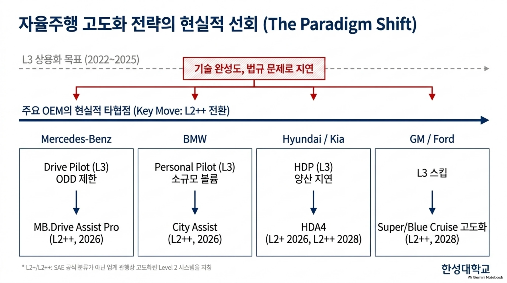

> ▲ L3 상용화 지연과 주요 OEM의 L2++ 전환 *(출처: 1주차 심화 자료 「자율+주행 기술의 패러다임 전환과 안전 아키텍처」 p2)*

이 전환은 후퇴가 아니다. **법적 책임 구조는 그대로 둔 채 기능만 최대치로 끌어올리는 전략**이며, 그 결과 시장 구조 자체가 재편된다.

## 2. 시장 침투율 전망 — L2/L2++ 중심의 재편

2022년 기준 전망은 2030년에 L3~L4가 18%를 차지하고 L0~L1이 25%로 줄어드는 그림이었다. 2024년 기준 전망은 이와 다르다.

| 구분 | 2024 | 2026 | 2028 | 2030 |
|---|---|---|---|---|
| L3~L4 | 20% | 18% | 17% | **12%** |
| L2 / L2+ | 30% | 41% | 62% | **60%** |
| L0~L1 | 23% | 27% | 17% | **10%** |

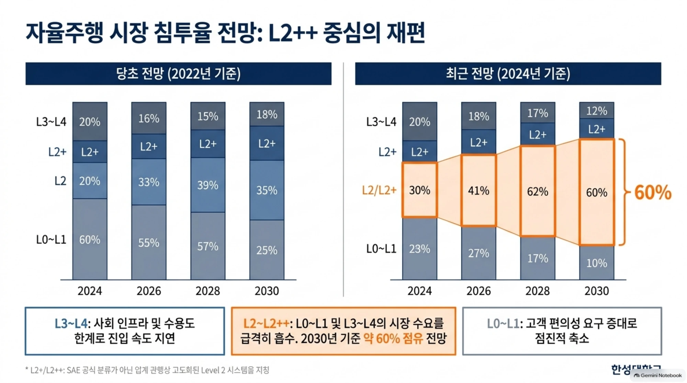

> ▲ 자율주행 시장 침투율 전망의 변화 — L2~L2++가 2030년 약 60% 점유 *(출처: 동 자료 p3)*

- **L3~L4** — 사회 인프라와 수용도의 한계로 진입 속도가 지연된다.
- **L2~L2++** — L0~L1과 L3~L4 양쪽의 수요를 흡수하며, **2030년 기준 약 60% 점유**가 전망된다.
- **L0~L1** — 고객의 편의성 요구가 커지면서 점진적으로 축소된다.

## 3. 레벨별 기능 확장과 책임 구조

기능은 올라가는데 책임은 그대로다. 이 자료 전체의 논지가 이 표 한 장에 들어 있다.

| | L2 | L2+ | L2++ | L3 |
|---|---|---|---|---|
| **기능** | 조향 + 가감속 동시 제어 | 고속도로 주행 보조 | **도심 및 고속도로 목적지 자동주행(Point-to-Point)** | 시스템이 주체가 됨 |
| **운전자 상태** | 상시 감시(Hands-on) | Hands-off 기능 고도화 | **Hands-off, Eyes-on** | Eyes-off 가능, 개입 요청 시에만 인수 |
| **최종 책임** | 운전자 | 운전자 | **운전자** | 시스템 |

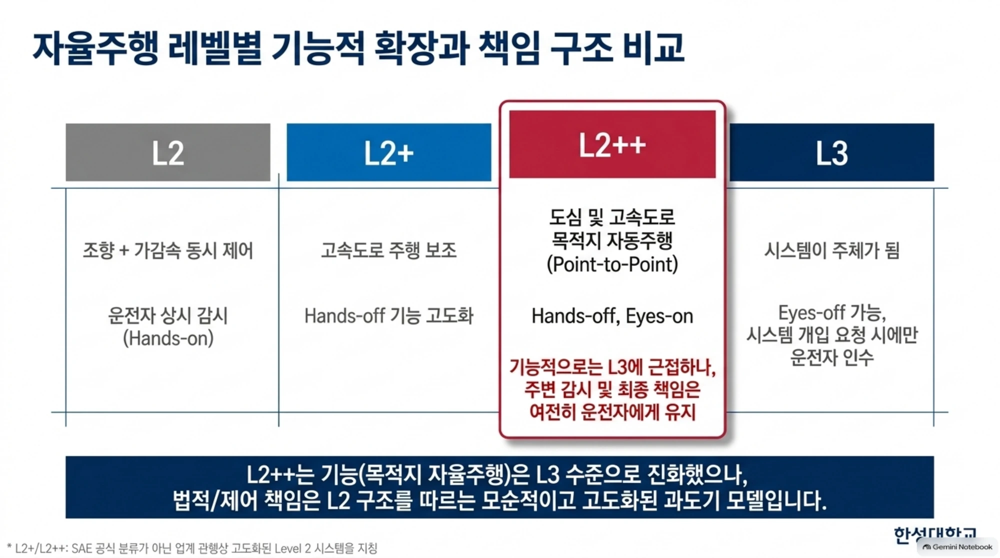

> ▲ 자율주행 레벨별 기능적 확장과 책임 구조 비교 *(출처: 동 자료 p4)*

!!! danger "L2++의 본질"
    L2++는 기능(목적지 자율주행)은 L3 수준으로 진화했으나, **법적·제어 책임은 여전히 L2 구조를 따르는 모순적이고 고도화된 과도기 모델**이다. 이 모순이 이후 모든 안전 설계 요구의 출발점이 된다.

## 4. 주행 환경 복잡도와 기술 진화 — 고속도로에서 도심으로

| | L2+ Highway (고속도로) | L2++ City (도심) |
|---|---|---|
| 복잡도 | 낮음 (규칙 개수 적음) | 높음 (규칙 방대, 예측 불가능한 변수 다수) |
| 접근 방식 | **Rule-based approach** | **End-to-End AI-based approach** |
| 특징 | 안전성·신뢰성 확보가 비교적 용이하여 선제 상용화 | E2E AI 도입을 통한 단계적 확대 구상 |

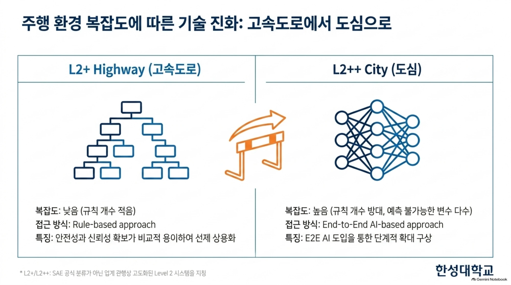

> ▲ 주행 환경 복잡도에 따른 기술 진화 — 규칙 기반에서 E2E AI로 *(출처: 동 자료 p5)*

고속도로는 규칙을 열거할 수 있으므로 결정론적 설계가 통한다. 도심은 열거가 불가능하므로 학습 기반으로 넘어간다. **접근 방식이 달라지면 검증 방식도 달라진다**는 점이 뒤의 SOTIF 논의로 이어진다.

## 5. 개념적 딜레마와 기술적 당위성 (The Missing Link)

L2++의 모순은 네 단계를 거쳐 하나의 공학적 요구로 수렴한다.

1. **기능적 확장** — L2++는 장기간 Hands-off 상태로 목적지 자율주행을 수행한다. 그 결과 운전자의 상황 인지력(Situational Awareness)은 자연스럽게 저하된다.
2. **모순적 책임 구조** — 그러나 고장 발생 시 최종 제어 책임은 여전히 운전자(L2)에게 있다.
3. **제어권 전환(Handover) 버퍼 필수** — 인지력이 떨어진 운전자가 상황을 파악하고 물리적으로 제어권을 회복할 시간(**최소 1초 이상**)이 필요하다.
4. **Fail-operational 당위성** — 이 '버퍼 타임' 동안 차량이 스스로 궤도를 유지하고 안전상태를 확보해야 하므로, **단일 고장 시에도 동작을 유지하는 ASIL-D 수준의 이중화(Redundancy)**가 필수불가결하다.

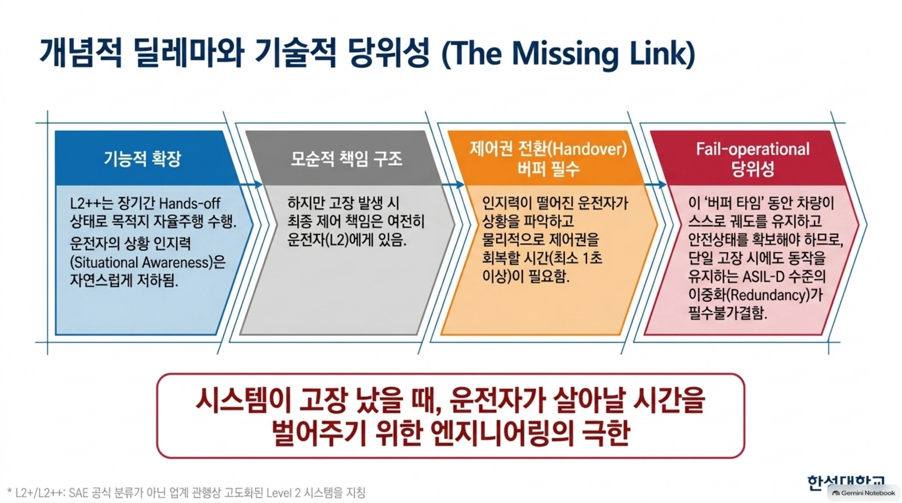

> ▲ 개념적 딜레마에서 Fail-operational 당위성으로 *(출처: 동 자료 p6)*

!!! quote "한 문장 정리"
    이중화 설계란 결국, **시스템이 고장 났을 때 운전자가 상황을 회복할 시간을 벌어주기 위한 엔지니어링**이다.

## 6. 국제 규제(DCAS)와 ASIL-D 안전 목표의 도출

기술적 당위성은 규제와 표준을 거쳐 **정량적 안전 목표**로 확정된다.

=== "① UNECE R-171 DCAS 요구사항"

    - **Hands-free 허용** — 제어권 인수 요청(HOR, Hand-Over Request) 준비
    - **조종성(Controllability)** — 운전자 반응 시간(최소 1초) 보장
    - **안전한 전환(Safe Transition)** 보장

=== "② ISO 26262 안전 분석"

    - **HARA** (Hazard Analysis and Risk Assessment, 위험 시나리오 분석)
    - **기능안전 요구사항**(FSC/FSR) 도출

=== "③ 최종 도출된 Key Safety Goal"

    > *"Unintended generation of vehicle driving trajectory shall be prevented"*
    > (의도치 않은 차량 주행 궤적 생성 방지)

    **요구 등급: ASIL-D**

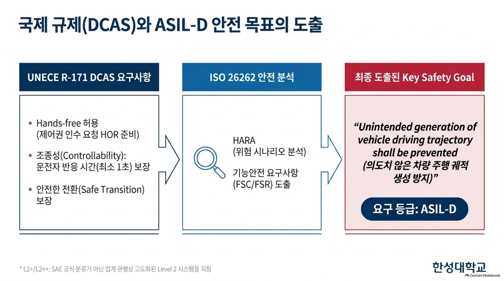

> ▲ 국제 규제(DCAS)와 ASIL-D 안전 목표의 도출 *(출처: 동 자료 p7)*

!!! info "용어"
    - **DCAS** — Driver Control Assistance Systems. UNECE(유엔유럽경제위원회)가 규정한 운전자 제어 보조 시스템 규제로, 규정 번호는 **R-171**이다.
    - **ASIL** — Automotive Safety Integrity Level. ISO 26262가 정의하는 자동차 기능안전 등급으로 A~D 네 단계이며, **D가 가장 엄격**하다.
    - **HOR** — Hand-Over Request. 시스템이 운전자에게 제어권 인수를 요청하는 절차.

## 7. DCAS 기반 안전 대응 전략

자율주행 파이프라인은 **Sense → Perceive → Plan → Control** 네 단계로 구성된다. 이 파이프라인이 정상 동작하지 못하는 상황은 세 가지로 나뉘며, 각각 대응 전략이 다르다.

| 상황 | 정의 | 대응 전략 |
|---|---|---|
| **Out of ODD** (설계 영역 이탈) | 고속도로 진출 등 조건 이탈 시 | **DCA** (Direct Control Alert) — 즉각적인 수동 운전 전환 경고 |
| **FRU Failure** (운전자 상태 불량) | 운전자 졸음, 부재 등 | **DUR** (Driver Unavailability Response) — 감속 및 정차 유도 |
| **System Failure** (시스템 고장) | HW/SW 결함 발생 시 | **DMO** (Degraded Mode Operation) — 기능 축소 운행 |

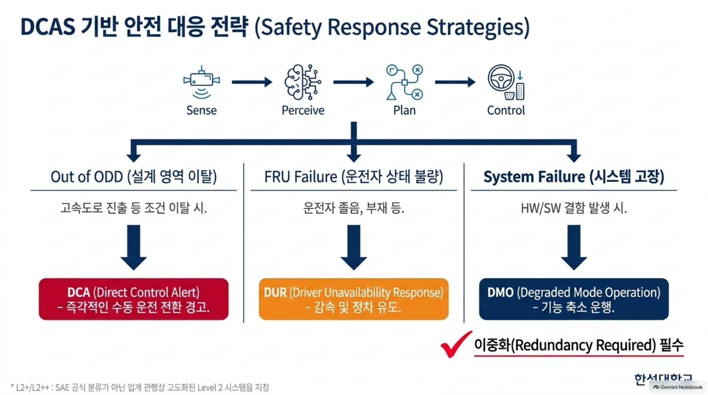

> ▲ DCAS 기반 안전 대응 전략 — 셋 중 System Failure만이 이중화를 요구한다 *(출처: 동 자료 p8)*

세 전략 중 **System Failure 대응(DMO)만이 이중화(Redundancy)를 필수로 요구한다.** 앞의 둘은 시스템이 살아 있는 상태에서 운전자에게 넘기는 절차지만, 세 번째는 시스템 자체가 고장 난 상태에서도 차량을 계속 제어해야 하기 때문이다.

## 8. ASIL-D 충족을 위한 시스템/하드웨어 이중화 아키텍처

이중화는 한 지점이 아니라 **센서에서 액추에이터까지 경로 전체**에 걸쳐 설계된다.

| 계층 | 구성 |
|---|---|
| **Sensors (Diversity)** | 카메라 / 전방·코너 레이다 / HD 맵 등 다변화 — 서로 다른 원리의 센서를 교차 배치 |
| **Dual Computing Path** | **L2 ECU**(Vision) + **L2+ ECU**(Driving Controller, ASIL-D AP 적용) |
| **Dual Communication Path** | **Primary Channel (CAN)** + **Secondary Channel (Ethernet)** |
| **Redundant Vehicle Platform** | Fail-operational Braking(ESC + EPB 분리) / Fail-operational Steering(Dual EPS, Dual SAS) / 이중화된 전원 구조(독립 PMIC) |

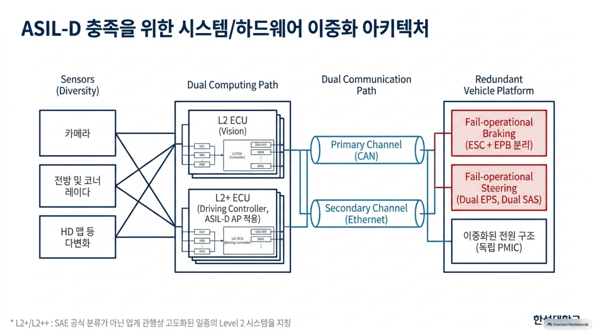

> ▲ ASIL-D 충족을 위한 시스템/하드웨어 이중화 아키텍처 *(출처: 동 자료 p9)*

!!! tip "'다변화(Diversity)'가 왜 중요한가"
    같은 종류의 센서를 두 개 다는 것은 고장에는 대비하지만 **원리적 한계에는 대비하지 못한다.** 카메라 두 대는 짙은 안개에서 동시에 실패한다. 원리가 다른 센서(카메라·레이다·지도)를 섞는 이유가 여기에 있으며, 이 논점은 6주차 센서 융합에서 다시 다룬다.

## 9. 논리적 안전 메커니즘 — Doer, Checker, Fallback

하드웨어 이중화만으로는 부족하다. **연산 결과가 옳은지 판정하는 논리 구조**가 ECU 내부에 함께 있어야 한다.

- **FSC**(Functional Safety Concept) — 안전 메커니즘을 정의한다.
- **TSC**(Technical Safety Concept) — Fail-operational 설계를 통해 차량 궤적 제어를 구현한다.

L2+ ECU 내부는 두 개의 코어로 분리된다.

| 코어 | 등급 | 구성 요소 | 역할 |
|---|---|---|---|
| **Application Core** | ASIL-B | **Doer** (기본 제어) | 상황 예측 및 1차 주행 경로 생성 |
| **Real-time Core** | ASIL-D | **Checker** (감시) | 궤적 유효성 검증 |
| | | **Fallback** (백업) | 2차 경로 생성 |
| | | **Safety Selector** (안전 선택기) | 최종 출력 선택, 비정상 신호 원천 차단 |

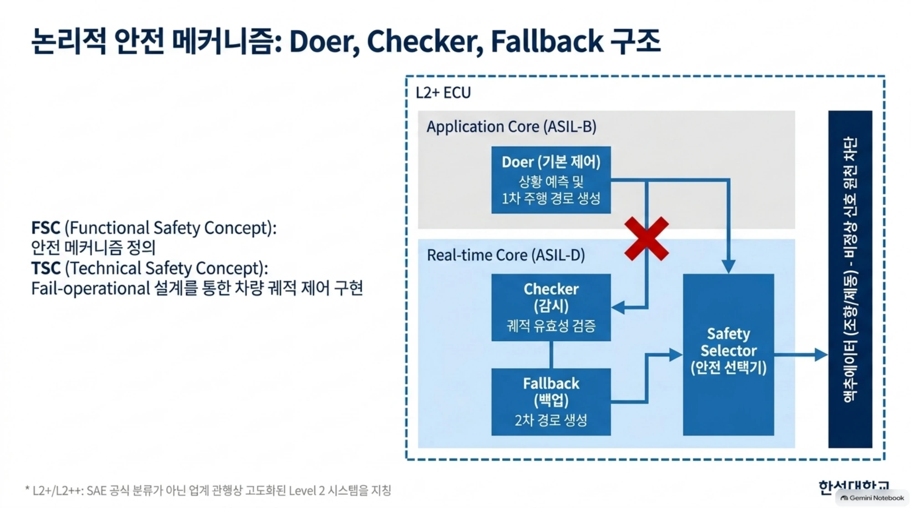

> ▲ 논리적 안전 메커니즘 — Doer, Checker, Fallback 구조 *(출처: 동 자료 p10)*

동작 원리는 다음과 같다. Doer가 생성한 1차 경로를 Checker가 검증하고, 검증에 실패하면 **Safety Selector가 Doer의 출력을 차단하고 Fallback의 2차 경로를 액추에이터로 내보낸다.** 성능이 높은 저등급 연산(ASIL-B)의 결과를, 단순하지만 신뢰도가 높은 고등급 코어(ASIL-D)가 감시하는 구조다.

## 10. 제어 능력의 안전한 하강 — DMO 캐스케이드

고장이 발생했다고 해서 제어를 즉시 놓지 않는다. **제어 능력을 단계적으로 낮추면서 안전 상태로 수렴시킨다.**

| 단계 | 상태 | 구간 |
|---|---|---|
| 1 | 경고 (Control with Warning, 경고 지속) | **제어 기능 유지 구간** |
| 2 | 경고 + 제어 유지 (20초 버퍼 부여, 운전자 인수 유도) | |
| 3 | 경고 + 제어 유지 (5초, 심각 고장 시) | |
| 4 | 종제어 성능 저하 | **제어 능력 축소 구간** |
| 5 | 종제어(가감속)만 가능, 횡제어(조향) 상실 | |
| 6 | 횡제어(조향)만 가능, 종제어(가감속) 상실 | |
| — | **Safe State** (안전 상태 수렴 후 OFF) | |

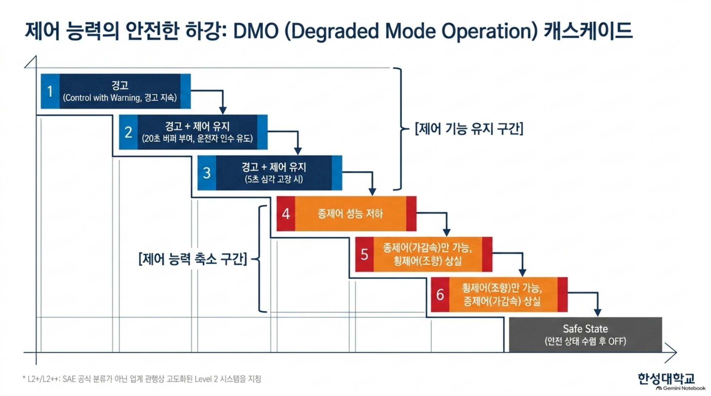

> ▲ 제어 능력의 안전한 하강 — DMO 캐스케이드 *(출처: 동 자료 p11)*

5절에서 말한 '버퍼 타임'이 여기서 **20초 / 5초**라는 구체적 수치로 나타난다. 고장의 심각도에 따라 운전자에게 주는 시간이 달라지며, 그 시간 동안 차량은 스스로 궤도를 유지한다.

## 11. 잔여 위험 통제 — SOTIF 프로세스

ASIL-D는 **고장(Fault)**을 막는 체계다. 그러나 부품이 모두 정상인데도 사고가 나는 경우가 있다. 센서가 원리적으로 인식하지 못하는 상황, 즉 **기술의 본질적 한계(Limitation)**다. 이를 다루는 체계가 **SOTIF**(Safety Of The Intended Functionality, 의도된 기능의 안전, ISO 21448)이다.

**Phase 1 · 위험 발생 과정**

1. **성능 한계** (폭우, 안개 등 센서 인식 불가)
2. **위험 거동** (차로 이탈 경향)
3. **Hazard** (위험 증가)

**Phase 2 · 위험 극복 과정 (V-Cycle)**

1. **Measure** — 제어권 전환 직접 요청
2. **New Requirement** — 신규 로직 반영
3. **V&V** — 시뮬레이션 및 실차 검증
4. **Residual Risk Evaluation** — 허용 기준 만족 판정
5. **Specification Freeze** — 사양 확정

4단계에서 허용 기준을 만족하지 못하면 1단계로 되돌아가는 **피드백 루프**가 작동한다.

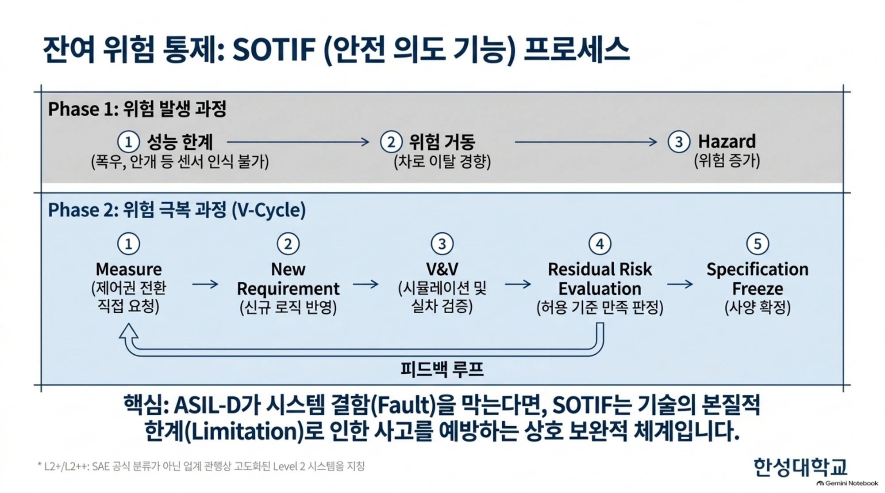

> ▲ 잔여 위험 통제 — SOTIF 프로세스 *(출처: 동 자료 p12)*

!!! success "핵심"
    **ASIL-D가 시스템 결함(Fault)을 막는다면, SOTIF는 기술의 본질적 한계(Limitation)로 인한 사고를 예방하는 상호 보완적 체계다.** 둘 중 하나만으로는 L2++의 안전을 논증할 수 없다.

## 12. 결론 — 기대와 안전의 균형

**Advanced ADAS(안전한 운영 보장)**는 두 개의 기둥 위에 선다.

| Opportunities (시장 기회) | Challenges (도전 과제) |
|---|---|
| 고객의 편의성 요구(장기간 Hands-off, ODD 확대)에 부응하는 고도화된 L2++ 시스템의 확산 | 운전자 오용(Overreliance) 방지, 직관적 HMI 제공, 엄격한 DCAS 승인 절차 통과 필수 |

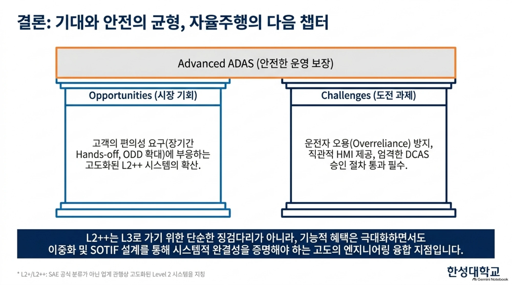

> ▲ 결론 — 기대와 안전의 균형 *(출처: 동 자료 p13)*

!!! quote "맺음말"
    L2++는 L3로 가기 위한 단순한 징검다리가 아니라, **기능적 혜택은 극대화하면서도 이중화 및 SOTIF 설계를 통해 시스템적 완결성을 증명해야 하는 고도의 엔지니어링 융합 지점**이다.

---

## 🤔 생각해 봅시다

1. L2++는 기능상 L3에 근접하지만 책임은 운전자에게 있다. 이 구조가 실제 사고 상황에서 어떤 법적·윤리적 쟁점을 낳는지 논하시오.
2. 「최소 1초」라는 운전자 반응 시간 기준은 어떤 근거로 정해졌다고 볼 수 있는가? 이 값이 더 길어져야 한다고 주장하려면 어떤 데이터가 필요한가?
3. ASIL-D 이중화는 원가를 크게 높인다. 보급형 차량에도 동일한 수준을 요구하는 것이 옳은가, 아니면 ODD를 좁히는 편이 옳은가?
4. Doer-Checker 구조에서 Checker가 Doer보다 성능이 낮은데도 판정 권한을 갖는 이유를 설명하시오.

## ✅ 심화 체크리스트

- [ ] L3 상용화 지연과 L2++ 전환의 배경을 설명할 수 있다
- [ ] L2 · L2+ · L2++ · L3의 기능과 최종 책임 주체를 구분할 수 있다
- [ ] Fail-operational 이중화가 필요한 이유를 '버퍼 타임'으로 설명할 수 있다
- [ ] DCA · DUR · DMO 세 대응 전략과 각각의 발동 조건을 안다
- [ ] Doer · Checker · Fallback · Safety Selector의 역할을 각각 말할 수 있다
- [ ] ASIL-D(Fault)와 SOTIF(Limitation)의 역할 차이를 설명할 수 있다

---

!!! info "자료 출처"
    본 페이지는 1주차 심화 자료 「자율+주행 기술의 패러다임 전환과 안전 아키텍처 — L3 상용화 지연에 따른 L2++ 시스템의 부상 및 ASIL-D 이중화 설계의 당위성」(자율주행 시스템 공학 연구실)의 내용을 정리한 것이다. 수업 목적 외 재배포를 금지하며, 인용 자료의 권리는 각 원저작자에게 있다.

◀️ [1주차 · 미래모빌리티란 무엇인가](week01.md) · ▶️ [2주차 · 자율주행 개념·레벨·제도](week02.md)
