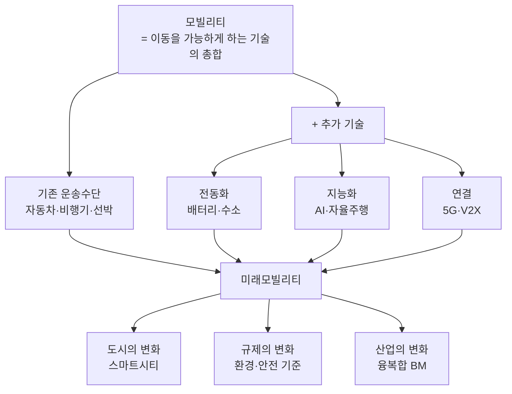
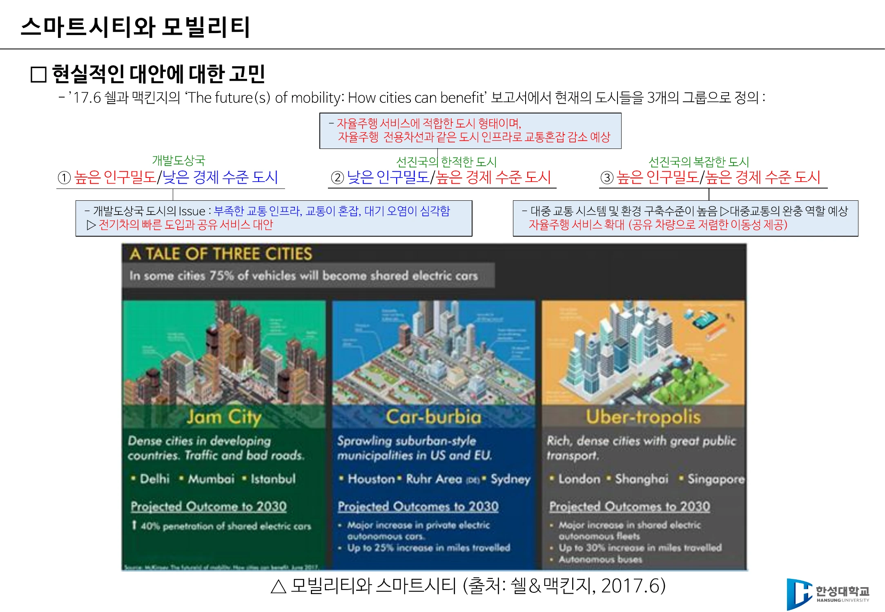
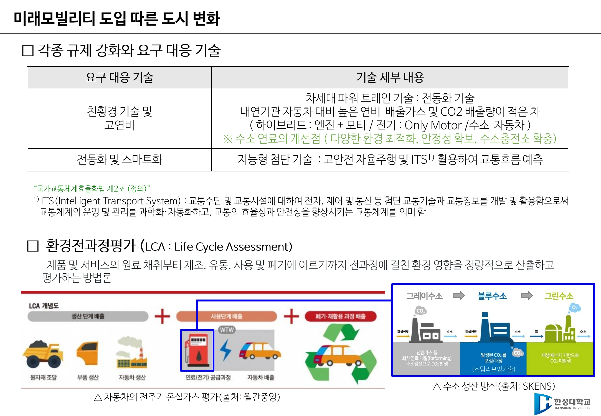
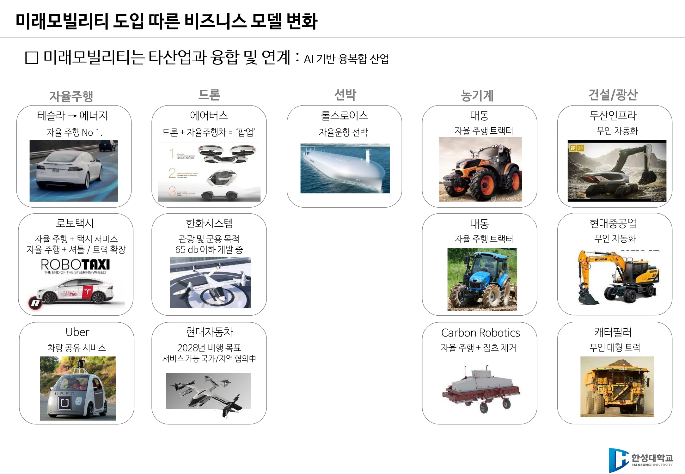

# 1주차 · 미래모빌리티란 무엇인가

> 🔗 **강의 흐름** — 1주차는 지도를 펼치는 주다. 이 과목이 앞으로 15주 동안 다룰 자율주행·드론·로봇이 왜 "모빌리티"라는 한 단어로 묶이는지, 그리고 그것이 왜 **도시와 산업 전체를 바꾸는 문제**인지 잡는다.

> **학습목표** — 모빌리티와 미래모빌리티의 개념을 정의하고, 미래모빌리티 도입이 도시·규제·비즈니스 모델에 미치는 변화를 사례로 설명할 수 있다.

> 💡 **기초 다지기** — **모빌리티(Mobility)는 "탈것"이 아니다.** 자동차·비행기·선박이라는 물건이 아니라, **무엇인가의 이동을 가능하게 하는 기술의 총합**을 뜻한다. 그래서 배터리도, 통신도, AI도, 심지어 도시 설계도 전부 모빌리티 기술에 들어간다.

## 🗺️ 한눈에 보는 개념도

## 1. 모빌리티의 정의

- **모빌리티** = 무엇인가의 이동을 가능하게 하는 **기술의 총합**.
- 인류는 자동차·비행기·선박으로 **사람의 이동뿐 아니라 물류의 이동**까지 획기적으로 가능하게 했다.
- **미래모빌리티**는 이 기존 운송수단에 **추가적인 기술이 포함되어 확장되는 개념**이다.

!!! success "정의를 정확히 — 자주 혼동하는 지점"
    미래 모빌리티는 **사람과 물류의 이동을 효율적으로 지원하기 위해 기존 운송수단에 첨단 기술이 융합·확장된 개념**이다.
    전기차 중심 기술로만 좁혀 보거나, 제조사의 디지털 전환(DX)과 같은 뜻으로 쓰거나, 드론·로봇만 가리키는 말로 이해하면 정의가 어긋난다.

## 2. 자율주행이 바꾸는 도시 — 세 가지 실제 사례

| 사례 | 주체 | 내용 |
|---|---|---|
| CES 2020 미래 도시 비전 | 현대자동차 | 수소 에너지 · 자율주행 셔틀 · 로봇 · UAV를 하나의 도시 비전으로 제시 |
| **HMGICS** (싱가포르 글로벌혁신센터) | 현대차그룹 | 2023.11 준공. 부지 14,000㎡, 연면적 약 9만㎡(축구장 13개), 지하2~지상7층. 웨어러블 로봇 착용 작업자, AMR 자율 배송, 스마트팜. "도시 인프라·모빌리티·사람이 연결되는 스마트 도심형 모빌리티 허브" |
| **Woven City** | 토요타 | 2021 착공. 인공지능·로보틱스·모빌리티·재료과학·수소를 실증. 사람↔기계, 사람↔사람, 도시↔사람을 잇는 **Connectivity**. (토요타의 사업 초기 모델이 방직 공장이었다는 점이 이름의 유래) |

> **"모빌리티의 발전은 도시의 변화를 가져온다."**

## 3. 스마트시티와 모빌리티 — 도시는 하나가 아니다

쉘 & 맥킨지 보고서 *The future(s) of mobility: How cities can benefit* (2017.6)는 도시를 **3개 그룹**으로 나눈다.

| 그룹 | 특징 | 대표 | 처방 |
|---|---|---|---|
| ① 고밀도 · 저소득 | 교통 인프라 부족, 혼잡, 대기오염 심각 | 개발도상국 도시 | **전기차의 빠른 도입 + 공유 서비스** |
| ② 저밀도 · 고소득 | 자율주행 서비스에 적합한 형태 | 선진국의 한적한 도시 | **자율주행 전용차선** 등 인프라로 혼잡 감소 |
| ③ 고밀도 · 고소득 | 대중교통·환경 구축 수준이 높음 | 선진국의 복잡한 도시 | 대중교통이 **완충 역할**, 공유 자율주행 확대 |

!!! note "핵심 통찰"
    같은 "자율주행 도입"이라도 도시의 **인구밀도와 경제 수준**에 따라 정답이 다르다. 기술이 아니라 **맥락**이 처방을 결정한다.

> ▲ 쉘&맥킨지 「A Tale of Three Cities」 — Jam City(고밀도·저소득) / Car-burbia(저밀도·고소득) / Uber-tropolis(고밀도·고소득) *(출처: 1주차 슬라이드 p11)*

## 4. 기존 도시 vs 자율주행 전용 도시

| 구분 | 기존 도시 | 새로운 자율주행 전용 도시 |
|---|---|---|
| 환경 | 극심한 도로 혼잡, 법·제도 미비 | **자율주행 차량만 운영**, 모빌리티 규제 샌드박스 |
| 기술 | 자율주행 기술 부족 | **5G + 자율주행 융합** (차량 공유를 전제로 도시 설계) |

→ 주차장 없는 자율주행 전용 도시 개념도(LG CNS), 도시 외곽 태양광 충전 스테이션.

## 5. 글로벌 정책 동향 — 두 개의 축

**① 온실가스 감축**

- 차량 연비 향상 및 CO₂ 배출 기준 강화
- 전기자동차 재고·판매 목표 의무화
- 충전 인프라 규정 및 설치 지원

**② 내연기관 차량의 단계적 축소**

| 국가 | 목표 |
|---|---|
| 유럽연합(EU) | **2035년부터 내연기관 자동차 판매 금지** |
| 미국 | **2032년까지 판매 신차의 67%를 전기차로 대체** |
| 중국 | **2035년까지 신에너지 50% · 플러그인 하이브리드 50%** 비중 제조 |

!!! warning "국가별 정책은 연도와 수치를 정확히"
    한편 **한국에는 "2025년부터 내연기관 차량의 신규 등록을 단계적으로 제한한다"는 정책이 없다.** 국가별 정책은 연도와 수치가 섞이기 쉬우므로 위 표 그대로 익힌다.

## 6. 규제 강화에 대응하는 기술

| 요구 대응 기술 | 세부 내용 |
|---|---|
| **친환경·고연비** | 차세대 파워트레인 = **전동화 기술**. 내연기관 대비 높은 연비, 배출가스·CO₂ 적은 차. (하이브리드 = 엔진 + 모터 / 전기 = 모터만 / 수소차) ※ 수소 연료의 개선점: 다양한 환경 최적화, 안정성 확보, 수소충전소 확충 |
| **전동화 및 스마트화** | 지능형 첨단 기술 — 고안전 자율주행 및 **ITS** 활용으로 교통흐름 예측 |

- **ITS**(Intelligent Transport System, 지능형 교통체계) — 교통수단·교통시설에 전자·제어·통신 등 첨단 교통기술과 교통정보를 개발·활용하여 교통체계의 운영·관리를 과학화·자동화하고 효율성과 안전성을 향상시키는 교통체계. *(국가교통체계효율화법 제2조 정의)*
- **LCA**(Life Cycle Assessment, 환경전과정평가) — 제품·서비스의 **원료 채취 → 제조 → 유통 → 사용 → 폐기** 전 과정에 걸친 환경 영향을 **정량적으로 산출·평가**하는 방법론.

!!! tip "왜 LCA가 중요한가"
    전기차는 주행 중 배출가스가 0이지만, 배터리 제조와 발전 과정의 배출이 있다. LCA는 "주행 중"이 아니라 **전 생애주기**로 따지자는 관점이며, 수소 생산 방식(그레이/블루/그린)을 논할 때도 같은 잣대가 쓰인다.

> ▲ 요구 대응 기술 표와 LCA(환경전과정평가) 도해 — 원료채취→제조→유통→사용→폐기 전 과정을 정량 평가한다 *(출처: 1주차 슬라이드 p13)*

## 7. 미래모빌리티의 비즈니스 모델 — AI 기반 융복합 산업

미래모빌리티는 **타 산업과 융합·연계**된다. 자율주행 기술이 자동차 밖으로 퍼져 나가는 지도다.

| 분야 | 사례 |
|---|---|
| 자율주행 | 테슬라(→에너지로 확장), **로보택시**(자율주행 + 택시 서비스), 셔틀·트럭으로 확장, 우버(차량 공유) |
| 드론 | 에어버스(드론 + 자율주행차 = '팝업'), 한화시스템(관광·군용, 65dB 이하 개발 중), 현대자동차(2028년 비행 목표) |
| 선박 | 롤스로이스 — 자율운항 선박 |
| 농기계 | 대동 — 자율주행 트랙터, Carbon Robotics — 자율주행 + 잡초 제거 |
| 건설·광산 | 두산인프라코어·현대중공업 무인 자동화, 캐터필러 무인 대형 트럭 |

> ▲ 자율주행·드론·선박·농기계·건설/광산으로 퍼져 나가는 융복합 산업 지도 *(출처: 1주차 슬라이드 p14)*

## 🤔 생각해 봅시다

1. 자신이 거주하는 도시는 쉘&맥킨지의 3개 그룹 중 어디에 속하는가? 그 도시에 가장 먼저 도입해야 할 모빌리티 기술은 무엇인가?
2. 전기차가 "친환경"이라는 주장을 **LCA 관점**에서 반박하거나 옹호하시오. 이때 어떤 데이터가 필요한가?
3. Woven City처럼 "도시를 새로 짓는" 접근과, 기존 도시를 개조하는 접근 중 어느 쪽이 현실적인가?

## ✅ 이번 주 체크리스트

- [ ] 모빌리티/미래모빌리티를 **한 문장으로** 정의할 수 있다
- [ ] 쉘&맥킨지 도시 3분류와 각각의 처방을 말할 수 있다
- [ ] EU·미국·중국의 내연기관 축소 목표 연도와 수치를 안다
- [ ] LCA와 ITS를 각각 한 문장으로 설명할 수 있다

---

▶️ **다음 주 예고** — 미래모빌리티의 여러 갈래 중 **자율주행**을 먼저 파고든다. 자율주행자동차와 자율주행시스템의 법적 정의, 왜 필요한가(사고의 94%), 그리고 우리나라 제도(임시운행허가·시범운행지구)를 본다. → [2주차](week02.md)
