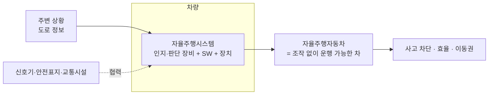
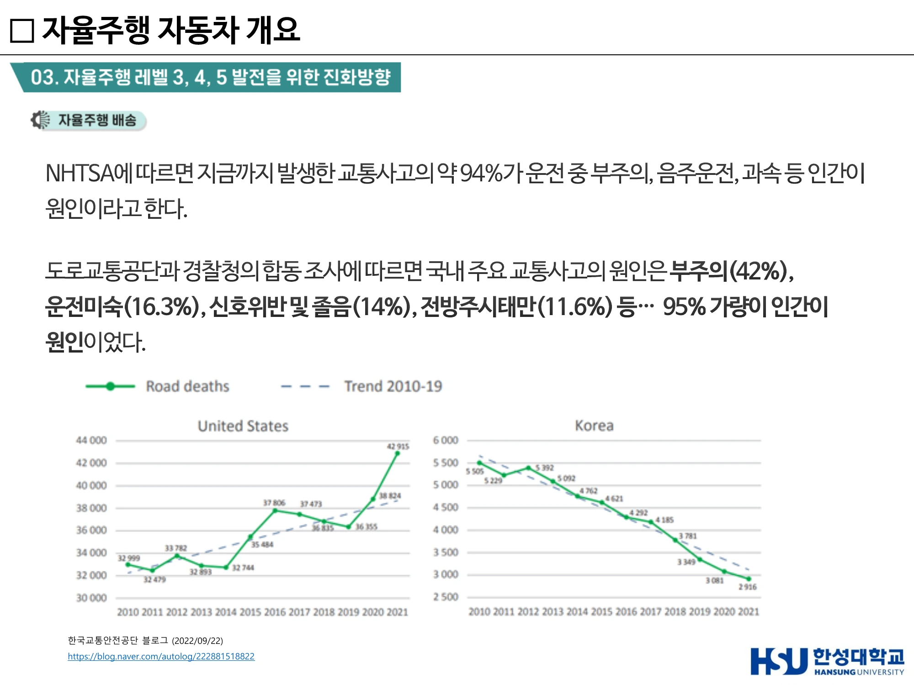
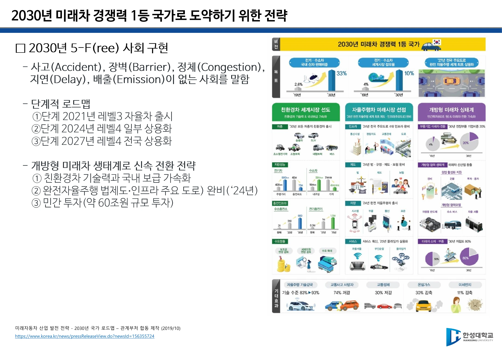

# 2주차 · 자율주행 개념·레벨·제도

> 🔗 **강의 흐름** — 1주차에서 "미래모빌리티 = 기존 운송수단 + 첨단기술"이라 정의했다. 이번 주는 그 첨단기술의 첫 갈래인 **자율주행**을 용어 수준에서 정확히 세운다. 여기서 잡는 정의와 레벨은 5주차 규제, 7주차 통신까지 계속 쓰인다.

> **학습목표** — 자율주행자동차와 자율주행시스템을 구분해 정의하고, 자율주행이 필요한 이유를 데이터로 설명하며, 국내 제도(임시운행허가·시범운행지구)와 국가 로드맵을 설명할 수 있다.

> 💡 **기초 다지기** — **"자율주행차"와 "자율주행시스템"은 다른 말이다.** 차(車)는 물건이고, 시스템은 그 안에서 인지·판단하게 만드는 **장비 + 소프트웨어 + 관련 장치 일체**다. 법에서도 이 둘을 따로 정의한다.

## 🗺️ 한눈에 보는 개념도

## 1. 기본 용어 정의

| 용어 | 정의 |
|---|---|
| **자율주행자동차** | 운전자 또는 승객의 **조작 없이 스스로 운행이 가능한 자동차** |
| **자율주행시스템** | 주변 상황과 도로 정보 등을 스스로 **인지하고 판단**하여 자동차를 운행할 수 있게 하는 **자동화 장비, 소프트웨어, 그리고 이와 관련한 일체의 장치**. 자율주행자동차는 이 시스템을 통해 움직인다 |
| **자율주행 협력 시스템** | 더 폭넓은 관점 — 신호기·안전표지·교통시설 등 **환경까지 협업**하는 것을 가정한 시스템 |

**사용자 경험 관련 용어** (강의에서 함께 정의)

- **UI**(User Interface) — 사용자와 시스템 사이에 존재하는 **접점**
- **User Interaction** — 그 접면을 통해 행하는 **상호작용**
- **UX**(User eXperience) — 제품·서비스를 사용하며 하게 되는 **모든 경험** → **CX**(Customer eXperience, 고객 경험) → **DX**(Digital Transformation, 디지털 전환)으로 확장 중

![[그림 1-10] 자율주행자동차의 구성 — 인식센서(Lidar·Camera·FCM·Radar) / 액추에이터(EPS·ABS&ESP·ECU) / 제어·협력주행·HMI 시스템](figures/w02-av-vehicle-composition.webp)

> ▲ [그림 1-10] 자율주행자동차의 구성 — 인식센서(Lidar·Camera·FCM·Radar) / 액추에이터(EPS·ABS&ESP·ECU) / 제어·협력주행·HMI 시스템 *(출처: 2주차 슬라이드 p22)*

## 2. 자율주행은 왜 필요한가

!!! danger "가장 중요한 숫자"
    **NHTSA — 지금까지 발생한 교통사고의 약 94%가 인간이 원인**(운전 중 부주의, 음주운전, 과속 등).
    국내(도로교통공단·경찰청 합동 조사) — **부주의 42%, 운전미숙 16.3%, 신호위반 및 졸음 14%, 전방주시태만 11.6% → 약 95%가 인적 요인.**

- **안전** — 운전 환경의 다양한 변수를 통제하여 교통사고 차단. 전방주시 태만·판단 및 운전 미숙·졸음 등 **인적요인 사전 차단**
- **효율** — 안정성 및 교통 효율 증가, 교통손실 비용 및 에너지 절감
- **형평** — 운전자 편의성 향상, **교통약자의 이동성 향상**

> 서술형 1번 단골: *"자율 주행 기술이 필요한 이유와 그 핵심 가치에 대하여 설명하시오."* → **안전(94%) · 효율(비용·에너지) · 접근성(교통약자)** 세 축으로 서술한다.

> ▲ NHTSA 94% · 국내 약 95%가 인적 요인 — 미국·한국의 교통사고 사망자 추이 그래프 *(출처: 5주차 슬라이드(덱 8) p19)*

## 3. 자율주행의 역사 — 세 개의 이정표

| 연도 | 사건 |
|---|---|
| 1925 | 라디오 장비 업체 후디나 라디오 컨트롤의 **'아메리칸 원더'** — 최초의 자율주행 시도. **통신(무선 조종) 기반**이었다 |
| 1980년대~ | 카네기멜런대학 로보틱스연구소 **Navlab** 프로젝트 — 컴퓨터 비전 기반 자율주행. **ADAS 기술 발전에 영향** |
| 1990년대 | 미국에서 자율주행 자동차에 대한 **본격적인 연구** 시작 |

!!! tip "기출 포인트"
    - 최초의 자율주행 시스템은 **통신 기반 기술에서 출발**했다 (✅ 맞는 설명)
    - 자율주행의 급속한 발전은 **ADAS 기술의 빠른 발전**에 기인한다 (✅)
    - 자율주행 핵심기술은 **통신기술 의존도가 매우 높다** (✅)

## 4. 자율주행시스템의 연산 성능

- 테슬라 **FSD**(Full Self-Driving) computer — **TOPS**(Trillion Operation Per Second) 단위로 성능을 표기한다.
- 자세한 프로세서 비교는 [6주차](week06.md)에서 다룬다.

## 5. 우리나라의 제도 ①  — 임시운행 허가제도

국토부는 민간의 자율주행 기술개발을 지원하기 위해 **2016년 2월 자율주행차 임시운행허가제도**를 도입했다.

- 신청 시 제출 서류 3종: **시험·연구계획서**, **자율주행차의 구조와 기능에 대한 설명서**, **안전운행요건 적합 여부 확인에 필요한 서류**
- 신청 후 국토교통부장관이 정하는 날짜·장소에 차량을 제시하여 **안전운행요건 적합 여부 확인**을 받아야 한다.
- **2016년 현대 제네시스가 국내 자율주행차 임시운행 제1호 차** 허가.
- **2020년 임시운행 허가 차량이 119대(41개 기관)**로 100대를 넘었다.

**2020년 개정 — 유형별 맞춤형 허가요건 신설**

| 유형 | 내용 |
|---|---|
| **A형** | 기존 자동차 형태의 자율주행차 |
| **B형** | **운전석이 없는** 자율주행차 |
| **C형** | **사람이 탑승하지 않는** 무인 자율주행차 |

![[그림 1-11] 임시운행 허가 대상 자율주행차 유형 — A형(기존 차 형태) / B형(운전석 없음) / C형(무인)](figures/w02-permit-types-abc.webp)

> ▲ [그림 1-11] 임시운행 허가 대상 자율주행차 유형 — A형(기존 차 형태) / B형(운전석 없음) / C형(무인) *(출처: 2주차 슬라이드 p24)*

## 6. 우리나라의 제도 ② — 시범운행지구

**자율주행자동차 시범운행지구** = 자율주행차의 연구·시범 운행을 촉진하기 위하여 **규제 특례가 적용되는 구역**.

- 2020년 5월 시행된 **자율주행자동차법**에 따라 새롭게 도입.
- 1차 6개 지구 지정 후 1개 추가 → **서울 상암·제주 등 7개 지구**, 2022년 **전국 10개 시·도 14개 지구**로 확대 공표.
- 세종·광주 **규제자유특구**를 통한 서비스 실증과 규제 정비 병행.
- **K-City** 등 자율주행 테스트베드 고도화, 기업 상주 연구공간 마련.

!!! example "세종시 자율주행버스 1년 운행 결과 (KBS 보도)"
    - 이용자의 **80%가 "신기하다"며 만족**, **70%가 "다시 이용할 의향"**
    - 다만 자율주행이 2~3단계 수준이라 **안전 우려**의 목소리
    - **어린이보호구역에서는 자율주행이 법으로 금지**
    - 도로에서는 돌발상황 대비로 **운전석에 사람이 타서 최소한의 수동 운행**
    → 대구 시범지구는 반대로 **"이용자 적고 차량 없다"**는 보도. 같은 제도라도 운영이 다르면 결과가 다르다.

## 7. 국가 로드맵 — 2030년 미래차 경쟁력 1등 국가

*미래자동차 산업 발전 전략 – 2030년 국가 로드맵* (관계부처 합동, 2019.10)

!!! success "2030년 **5-F(ree) 사회** 구현"
    사고(**A**ccident) · 장벽(**B**arrier) · 정체(**C**ongestion) · 지연(**D**elay) · 배출(**E**mission)이 **없는** 사회
    → 머리글자 **A·B·C·D·E**로 정리된다.

**단계적 로드맵**

| 단계 | 연도 | 목표 |
|---|---|---|
| ① | 2021 | **레벨3 자율차 출시** |
| ② | 2024 | **레벨4 일부 상용화** + 완전자율주행 법·제도·인프라(주요 도로) 완비 |
| ③ | 2027 | **레벨4 전국 상용화** |

- 개방형 미래차 생태계로 신속 전환: 친환경차 기술력·국내 보급 가속화, **민간 투자 약 60조원** 규모.
- 미래자동차 = **친환경 전기차·수소차 + ICT·AI 기반 자율주행차**를 포괄하는 개념. 정부는 미래자동차 산업을 **8대 혁신성장 선도과제**로 선정.
- 2030년 미래자동차 시장 3대 축: ① 친환경차 ② 자율주행차(스마트카) ③ **서비스 산업**

> ▲ 2030년 5-F(ree) 사회 구현과 단계적 로드맵(2021 Lv3 → 2024 Lv4 일부 → 2027 Lv4 전국) *(출처: 2주차 슬라이드 p18)*

## 8. 제1차 교통물류 기본계획 (국토교통부, 2021.6)

비전 — **2025년 자율주행 기반 교통물류체계 상용화 시대 개막**. 전 고속도로와 시·도별 주요 거점에서 자율주행 상용서비스 제공.

| 축 | 내용 |
|---|---|
| 기술 고도화 | 자율주행 여객·화물·사회기반 서비스 기술력 확보 |
| 실증 환경 조성 | PoC 가능한 시범운행지구 지속 확대 및 규제 정비, 테스트베드 고도화 |
| 사업환경 조성 | 도로·통신 인프라 전국 구축, **C-ITS 2025년까지 전국 주요도로 구축**, 동적 지도(신속 갱신), 데이터 표준화·빅데이터 공통 플랫폼 |
| 안전성·수용성 | 레벨4 주행·충돌·통신·시스템 안전성 평가 기준과 시험방법, **해킹방지 등 사이버보안**, 안전기준 국제조화, 개인정보 보호 가이드라인 |
| 생태계 | 국제 공동연구, 테스트베드 간 협력, 국토교통 혁신펀드 확대, **대학 커리큘럼 개선 등 인력양성**, 일자리 전환 대응 |

- **C-ITS** (Cooperative-Intelligent Transport Systems, 차세대 지능형교통체계)

**기대효과**

| 항목 | 내용 |
|---|---|
| 편의성 | 대중교통 접근 시간 **20% 감축**, 환승 소요시간 **50% 감축**, 교통약자 이동권 확보 |
| 안전성 | 서비스 종사자 부주의 교통사고 **50% 감축**, 교통사고 사망률 2015년 대비 **50% 감소** |
| 일자리 | 서비스 다양화·데이터 고부가가치 산업 육성으로 **일자리 1만 개 창출** |

## 9. 국가별 준비도

Confused.com이 발표한 **"자율주행차 시대를 가장 잘 준비하고 있는 국가 Top 5"**(2022.2). 기술 개발만으로는 부족하고 **국가의 법률 지원 + 일반 소비자의 인식 개선**이 함께 완성되어야 대중화된다는 것이 요지다.

## 🤔 생각해 봅시다

1. 세종시 사례에서 볼 때, 자율주행차의 **상용화 확대를 위해 해결해야 할 이슈**는 무엇인가? (기술·제도·수용성으로 나누어 서술하시오)
2. 자율주행차의 등장으로 **새롭게 생겨나는 직업**이 있는가? 제주 라이드플럭스 안전요원 사례를 참고하여, 안전요원이 갖추어야 할 요건과 역할을 정리하시오.
3. 임시운행허가 유형을 A/B/C로 나눈 이유는 무엇인가? 각 유형에 서로 다른 안전요건이 필요한 까닭을 설명하시오.

## ✅ 이번 주 체크리스트

- [ ] 자율주행자동차 / 자율주행시스템 / 자율주행 협력 시스템을 구분해 정의할 수 있다
- [ ] "사고의 94%가 인적 요인"이라는 수치와 출처(NHTSA)를 안다
- [ ] 임시운행허가 A·B·C형을 설명할 수 있다
- [ ] 5-F(ree)의 다섯 가지와 3단계 로드맵 연도(2021/2024/2027)를 안다

---

▶️ **다음 주 예고** — 자율주행차 **안을 열어본다**. 자율주행자동차가 어떤 장치로 이루어져 있고, ADAS 기능들이 실제로 무엇을 하며, 자율주행 알고리즘이 어떤 순서(SENSE → PLAN → CONTROL)로 도는지 본다. → [3주차](week03.md)
