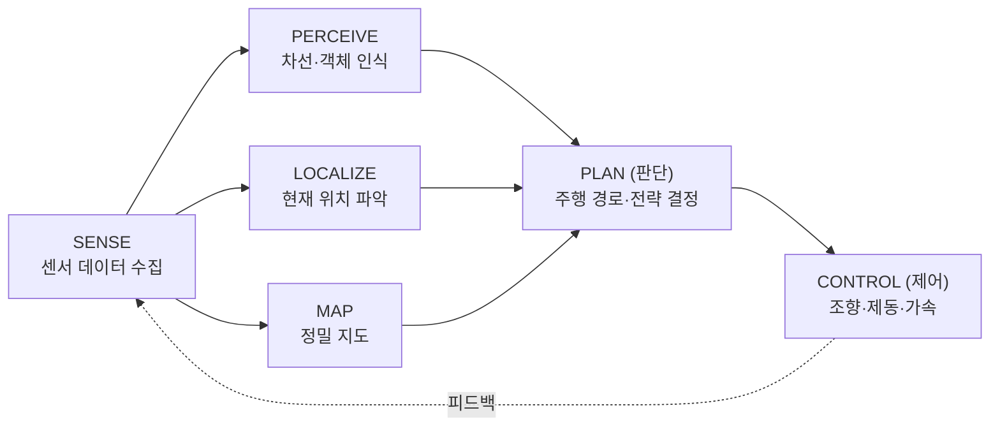
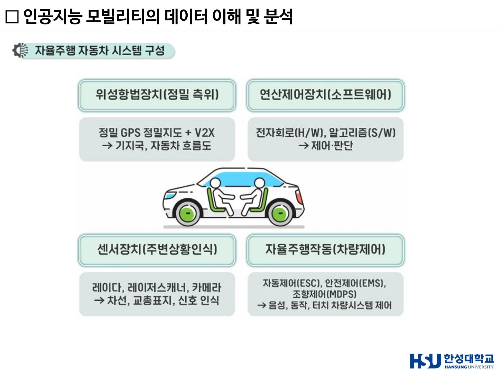
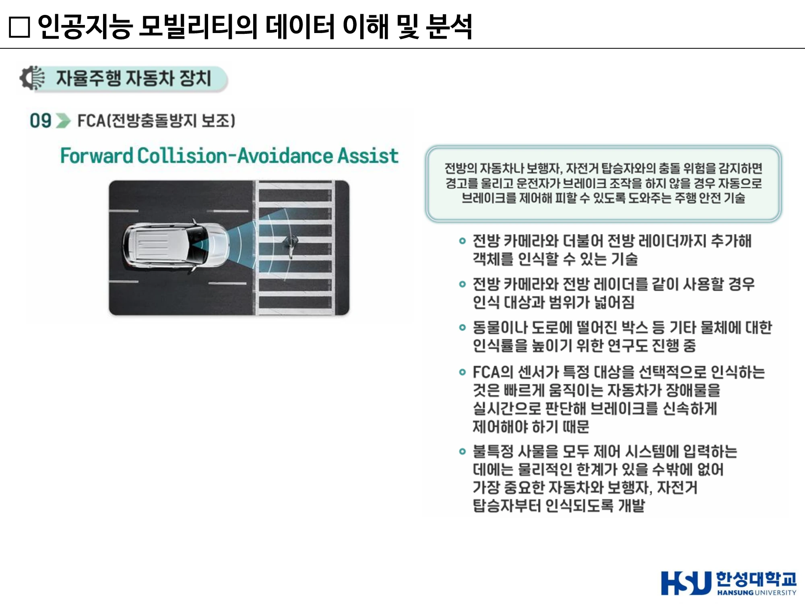
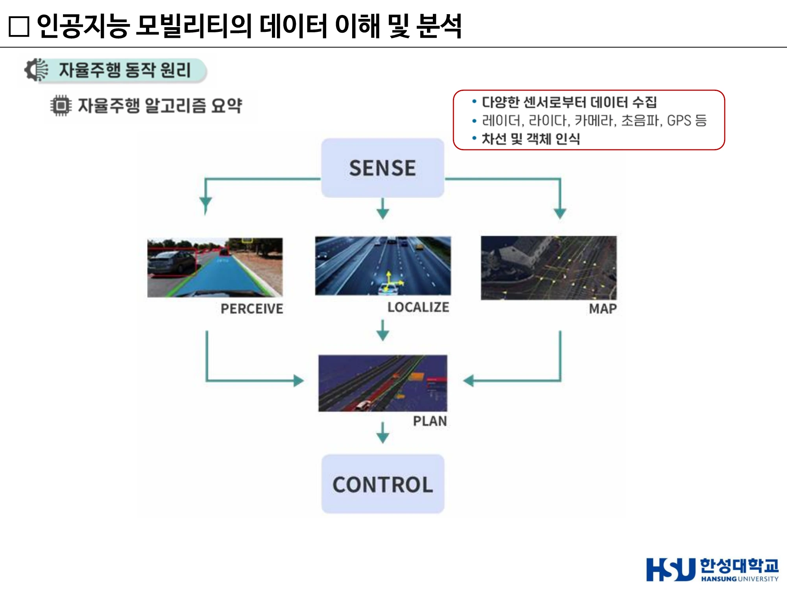
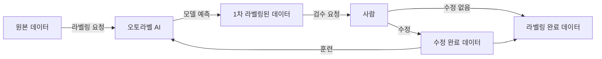
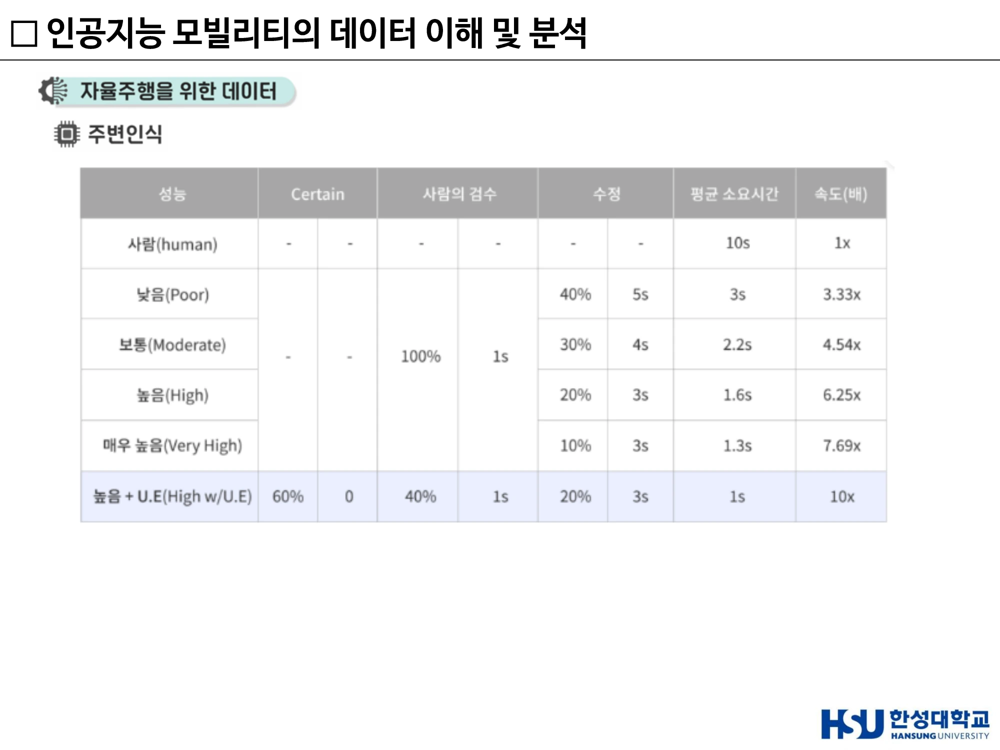

# 3주차 · 자율주행 시스템과 ADAS

> 🔗 **강의 흐름** — 2주차에서 "자율주행시스템"을 법적 정의로 배웠다. 이번 주는 그 시스템의 **실제 구성품과 동작 순서**를 연다. 여기서 배우는 **인지–판단–제어** 3단 구조는 중간·기말 서술형에 매년 나온다.

> **학습목표** — 자율주행자동차의 시스템 4구성을 설명하고, 주요 ADAS 기능의 원리를 구분하며, 자율주행 알고리즘의 SENSE–PLAN–CONTROL 흐름과 각 단계의 기술을 예로 들어 서술할 수 있다.

> 💡 **기초 다지기** — **ADAS(첨단 운전자 보조 시스템)는 자율주행의 "부품 창고"다.** 자동 긴급제동, 크루즈 컨트롤, 차선 유지… 이런 기능들을 하나씩 만들다 보니 그 조합이 곧 레벨 2 자율주행이 되었다. 그래서 "자율주행의 급속한 발전은 ADAS 발전 덕분"이라고 말한다.

## 🗺️ 한눈에 보는 개념도

## 1. 자율주행자동차 시스템 4구성

| 구성 | 역할 | 세부 |
|---|---|---|
| **위성항법장치** | 정밀 측위 | 정밀 GPS + 정밀지도 + V2X → 기지국, 자동차 흐름도 |
| **센서장치** | 주변상황 인식 | 레이다, 레이저스캐너(라이다), 카메라 → 차선·교통표지·신호 인식 |
| **연산제어장치** | 제어·판단 | 전자회로(H/W) + 알고리즘(S/W) |
| **자율주행작동** | 차량제어 | 자동제어(ESC), 안전제어(EMS), 조향제어(MDPS) → 음성·동작·터치 차량시스템 제어 |

!!! warning "4구성의 명칭을 정확히"
    **위성항법장치 · 센서장치 · 연산제어장치 · 자율주행작동**이 공식 명칭이다. "입력장치", "자율주행작동장치"처럼 비슷한 표현과 섞이기 쉬우므로 명칭 그대로 숙지한다.

**우버(Uber) 자율주행차 구성 예시**

- 카메라 — 병렬 연결된 다수의 카메라로 주변 사물·빛·신호·사람 인식
- 라이다(LIDAR) — 레이저빔으로 주변환경을 3D로 인식하는 **자율주행차의 핵심장치**
- 추가 레이더 센서
- 메인 컴퓨터 — 주로 **트렁크에 위치**, 탐지 정보를 입력된 지도 위치정보와 비교하여 현재 상태를 판단

> ▲ 자율주행 자동차 시스템 구성 — 위성항법장치 / 연산제어장치 / 센서장치 / 자율주행작동(차량제어) *(출처: 3주차 슬라이드 p4)*

## 2. ADAS 주요 기능 11종

| # | 기능 | 원리 |
|---:|---|---|
| 01 | **자동 긴급제동(AEB)** | 전면 센서(레이더·라이다·카메라)로 장애물 거리 측정 → 주행 속도 계산 → 추돌 위험/불가피 판단 시 경고와 함께 강하게 브레이크 작동 |
| 02 | **크루즈 컨트롤(ACC)** | 설정 속도에 맞춰 앞차와의 거리를 스스로 유지. **반자율주행에 필요한 가장 기초적인 기술**. 전방 센서로 거리 계산 → 가속페달·브레이크 자동 제어 |
| 03 | 보행자/차량 검출 | AI 기반 검출 |
| 04 | **차선이탈 경고 / 보조** | 방향지시등을 켜지 않은 상황에서 차선을 밟으면 **운전자의 실수로 판단** → 소리·진동 경고, 또는 운전대 조작·반대쪽 바퀴 제동으로 차선 유지 |
| 05 | 차선 인식 | 카메라 기반, 곡률 반경·차로 중앙 대비 오프셋 산출 |
| 06 | 상향등 보조 | 전방 카메라로 앞차·마주오는 차·가로등(주변 광원)을 파악해 상향등 자동 점등/소등 |
| 07 | 불빛 검출 | 야간 광원 분리 인식 |
| 08 | 속도제한 보조 | 카메라 + 내비게이션 제한속도 정보 → 초과 시 감속할 때까지 경고 |
| 09 | **FCA** (Forward Collision-Avoidance Assist, 전방충돌방지 보조) | 전방 카메라 **+ 전방 레이더**를 함께 사용해 인식 대상과 범위를 넓힘. 빠르게 움직이는 자동차가 장애물을 실시간 판단해 브레이크를 신속 제어해야 하므로 **선택적 인식**이 필요 → 가장 중요한 자동차·보행자·자전거 탑승자부터 인식하도록 개발 |
| 10 | **FCA-JT** (Junction Turning) | 교차로 좌회전 시 마주 오는 차량과의 예기치 못한 충돌을 막는 기능 |
| 11 | **LKA / LFA** | 아래 별도 정리 |

### LKA vs LFA — 자주 헷갈리는 한 쌍

| 구분 | 정의 | 작동 특성 |
|---|---|---|
| **LKA** (Lane Keeping Assist, 차로 이탈방지 보조) | 차가 차로를 벗어날 것 같은 **순간** 조향을 보조 | 이탈 임박 시에만 개입 |
| **LFA** (Lane Following Assist, 차로 유지 보조) | 차가 **차로 중앙을 유지**하며 주행하도록 하는 기술 | 차로 중앙에서 **30cm만 벗어나도** 작동 → 사실상 **상시 작동 상태** |

→ **LFA가 LKA보다 훨씬 넓은 제어 범위**를 갖는다.

### ADAS 서술 시 주의

!!! warning "ADAS를 서술할 때 주의할 점"
    - 자율주행 시스템을 더욱 견고하게 만드는 데 기여했다
    - 테슬라는 오토파일럿 기능을 통해 상용차에 ADAS를 탑재했다
    - ADAS는 카메라·레이더·라이다 등 다양한 센서를 **융합**하는 시스템이다
    - 카네기멜런대 Navlab 프로젝트가 ADAS 기술 발전에 영향을 주었다
    - 다만 ADAS가 카메라·초음파·레이더를 **"처음으로" 동시에 사용한 시스템**이라는 서술은 사실과 다르다

> ▲ FCA(전방충돌방지 보조) — 카메라와 레이더를 함께 써 인식 대상·범위를 넓히고, 자동차·보행자·자전거를 우선 인식하도록 설계한다 *(출처: 3주차 슬라이드 p13)*

## 3. 자율주행 알고리즘 — SENSE → PLAN → CONTROL

### ① SENSE (인지)

- 다양한 센서로부터 데이터 수집 — **레이더, 라이다, 카메라, 초음파, GPS 등**
- 차선 및 객체 인식

### ② 판단 (PERCEIVE · LOCALIZE · MAP → PLAN)

| 요소 | 역할 |
|---|---|
| **Map** | 정밀 지도 정보 |
| **Perceive** | 주행 중 모든 정보를 확인 (차선, 장애물 등) |
| **Localization** | 지도 정보 및 센서 값을 이용하여 **정확한 현재 위치 파악** |
| **Plan** | 차량 **주행 경로 생성** — 주행 경로 및 주행 전략 결정 |

### ③ CONTROL (제어)

- **차량 움직임 제어**
- 기본 제어 — **조향, 제동, 가속** / 샤시 제어
- **종방향 / 횡방향** 제어
- 휴먼 팩터 고려

!!! warning "제어 단계가 하는 일 — 가장 자주 혼동하는 지점"
    제어(CONTROL)는 **조향·제동·가속**을 담당한다.
    **위치(Localization)는 판단 단계의 일**이며 제어 단계에 속하지 않는다.

> 이 구조를 설명할 때는 각 단계에 적용되는 기술을 함께 든다 — **인지 = 센서/카메라 / 판단 = AI 알고리즘 / 제어 = 액추에이터 제어**.

> ▲ 자율주행 알고리즘 요약 — SENSE → PERCEIVE·LOCALIZE·MAP → PLAN → CONTROL *(출처: 3주차 슬라이드 p17)*

## 4. 자율주행을 위한 데이터

> **"자율주행의 기반기술은 인공지능, 인공지능의 학습방법은 빅데이터"**

자동차 사물인식이 답해야 하는 두 질문:

1. **물체와 자동차 간 거리는 얼마나 멀리 떨어져 있는가?**
2. **어떤 물체인가?**

→ **Object Detection** 분야에서 인공지능 알고리즘을 이용한다. 자동차 주변에 어떤 물체가 있는지 파악하고, 정보들을 종합하여 **다시 한 번 인공지능 기술로 작동방식을 결정**한다. 주변 이미지 기반 운행작업 결정에는 인식에 썼던 것과는 **별개의 인공지능을 새로 개발**할 가능성이 높다.

### 오토라벨링 (Auto-Labeling)

주변사물인식 결과를 순차적으로 받아들여 이를 다시 데이터로 이해하고, 미세한 시간 단위로 계속 진행한다. 이때 **오토라벨링은 시간당 50.25개의 이미지 데이터 라벨링이 가능**하다.

### 라벨 오류 4유형 — 수정 비용이 다르다

| 유형 | 내용 | 수정 시간 |
|---|---|---:|
| **1. Classification Error** | Object Class를 잘못 지정 (고양이인데 개로 표기) — 클래스만 살짝 수정 | 약 **2초** |
| **2. Low Precision (False Positives)** | 정밀도가 낮아 라벨링하지 않아도 될 것에 라벨을 다는 경우 (산의 윗부분을 지붕으로 인식) — 해당 라벨 삭제 | 약 **2초** |
| **3. Low Recall (False Negatives)** | 재현율이 낮아 Object를 발견조차 못함 (사람을 아예 놓침) — 검수자가 **직접 바운딩 박스를 그리고** 라벨을 달아야 함 | 약 **10초** |
| **4. Low IoU** | 라벨링 결과가 Object 모양에 딱 맞지 않음 — 위치·형태 조정 필요 | 약 **10초** |

**성능별 라벨링 속도 비교**

| 성능 | 사람의 검수 | 수정 비율 | 평균 소요시간 | 속도 |
|---|---|---:|---:|---:|
| 사람(human) | — | — | 10s | 1x |
| 낮음(Poor) | 100% (1s) | 40% (5s) | 3s | 3.33x |
| 보통(Moderate) | 100% (1s) | 30% (4s) | 2.2s | 4.54x |
| 높음(High) | 100% (1s) | 20% (3s) | 1.6s | 6.25x |
| 매우 높음(Very High) | 100% (1s) | 10% (3s) | 1.3s | 7.69x |
| **높음 + U.E** | Certain 60% / 검수 40% (1s) | 20% (3s) | **1s** | **10x** |

> **U.E** = User Evaluation(사용자 검수/편집). 모델이 "확신(Certain)"하는 60%는 사람이 아예 보지 않고 넘김으로써 **10배 속도**를 달성한다.

!!! warning "파이프라인과 후처리를 구분한다"
    Corner Case mining · Data Augmentation · Active Learning은 **데이터 품질·학습 파이프라인**에 속하고,
    **NMS(Non-Maximum Suppression)는 추론 단계의 후처리**다.

> ▲ 오토라벨링 성능별 검수 속도 — 사람 10s/1x 대비 High+U.E는 1s/10x *(출처: 3주차 슬라이드 p26)*

## 5. CNN 개요

**CNN**(Convolutional Neural Network) — 이미지나 영상 데이터를 직접 학습하여 패턴을 인식·분류하는 딥러닝 알고리즘. 수십~수백 개의 계층을 가질 수 있으며, 각 계층은 영상의 서로 다른 특징을 검출한다.

| 단계 | 역할 |
|---|---|
| Input | 이미지 또는 센서 데이터 입력 |
| **Convolution** | 필터(kernel)로 특징 추출 — edge, texture, pattern |
| **ReLU** | 음수 제거 → 비선형성 추가, 학습 성능 향상 |
| **Pooling** | 데이터 크기 축소(Downsampling). 연산량 감소, 과적합 방지, 위치 변화 강건성 |
| 반복 | Conv+ReLU+Pooling 반복 → 저수준(선) → 중간(모서리) → 고수준(물체 형태) |
| Flatten | 2D → 1D 벡터 |
| Fully Connected | 일반 신경망처럼 판단 |
| Softmax | 최종 분류 결과 출력 (자동차/트럭/자전거…) |

!!! warning "CNN을 설명할 때 주의할 점"
    - CNN의 구성 요소는 객체 인식뿐 아니라 **객체의 위치 정보도 제공**할 수 있다
    - 위치 정보는 **물체 중심 좌표(x, y)와 너비·높이**로 구성된다
    - **Softmax가 객체 인식의 필수 조건은 아니다**
    - **객체 탐지 모델로 음성인식을 구현할 수는 없다**
    - **Canny는 에지(Edge) 검출 방법**이며, 경계 상자 내부의 클래스를 분류하는 데 쓰지 않는다

### 참고 — Canny 에지 검출의 4단계

차선 검출처럼 **경계를 찾는** 전처리에 쓰이는 고전 알고리즘이다. 객체의 종류를 분류하지는 않는다.

| 단계 | 처리 |
|---:|---|
| **1. 노이즈 제거** | 5×5 가우시안 필터로 이미지를 흐리게 하여 잡음을 줄인다 |
| **2. Gradient 계산** | Sobel 커널을 수평·수직 방향으로 적용해 각 방향의 gradient(Gx, Gy)를 얻고, 이를 합쳐 **각 픽셀의 gradient 크기와 방향**을 구한다 |
| **3. 비최대 억제** | 이미지 전체를 훑어 **에지가 아닌(주변보다 크지 않은) 픽셀 값을 0으로** 만든다 |
| **4. Hysteresis Thresholding** | 두 임계값(min·max)으로 진짜 에지를 가린다. max 이상이면 **강한 에지**, min~max 사이면 **약한 에지**. 약한 에지는 **강한 에지와 이어져 있을 때만** 에지로 인정한다 |

> OpenCV에서는 `cv2.Canny(이미지, 최소 임계값, 최대 임계값)` 형태로 사용한다.

**참고** — **MFCC**(Mel-Frequency Cepstral Coefficients): 사람의 귀(청각 특성)를 반영해 소리를 수치화한 특징. Mel-Frequency(사람이 느끼는 주파수 스케일) + Cepstral(스펙트럼을 다시 변환) + Coefficients(최종 특징 벡터). 영상 외 음향 데이터에도 같은 CNN 구조를 적용할 수 있음을 보이는 사례다.

## 🤔 생각해 봅시다

1. 라벨 오류 4유형 중 **Low Recall이 가장 비싼 이유**는 무엇인가? 자율주행 안전 관점에서 4유형 중 가장 위험한 유형은 무엇인가?
2. FCA가 "모든 물체"가 아니라 자동차·보행자·자전거부터 인식하도록 개발된 이유는 무엇이며, 이는 어떤 한계를 낳는가?
3. 오토라벨링의 "Certain 60%는 사람이 보지 않는다"는 선택은 안전한가? 어떤 조건이 갖춰져야 정당화되는가?

## ✅ 이번 주 체크리스트

- [ ] 자율주행 시스템 4구성을 명칭 그대로 말할 수 있다
- [ ] LKA와 LFA의 차이(30cm·상시작동)를 설명할 수 있다
- [ ] SENSE–PERCEIVE/LOCALIZE/MAP–PLAN–CONTROL 순서를 그릴 수 있다
- [ ] **제어 단계에 "위치"가 포함되지 않는다**는 것을 안다
- [ ] 라벨 오류 4유형과 각 수정 시간(2s/2s/10s/10s)을 안다

---

▶️ **다음 주 예고** — 인지 단계의 핵심 기술인 **객체탐지**를 파고든다. YOLO와 R-CNN은 무엇이 다른가, IoU·NMS는 왜 필요한가, 그리고 그 위에서 굴러가는 로보택시 산업은 지금 어디까지 왔는가. → [4주차](week04.md)
