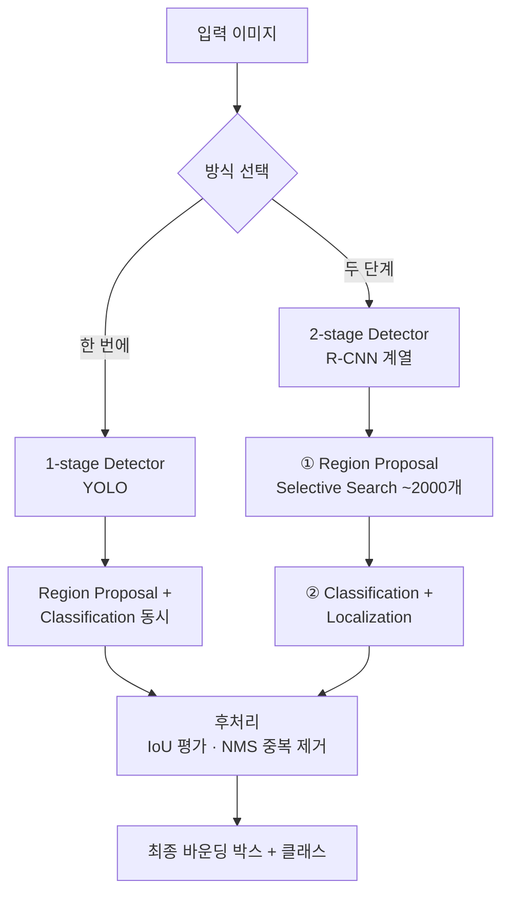
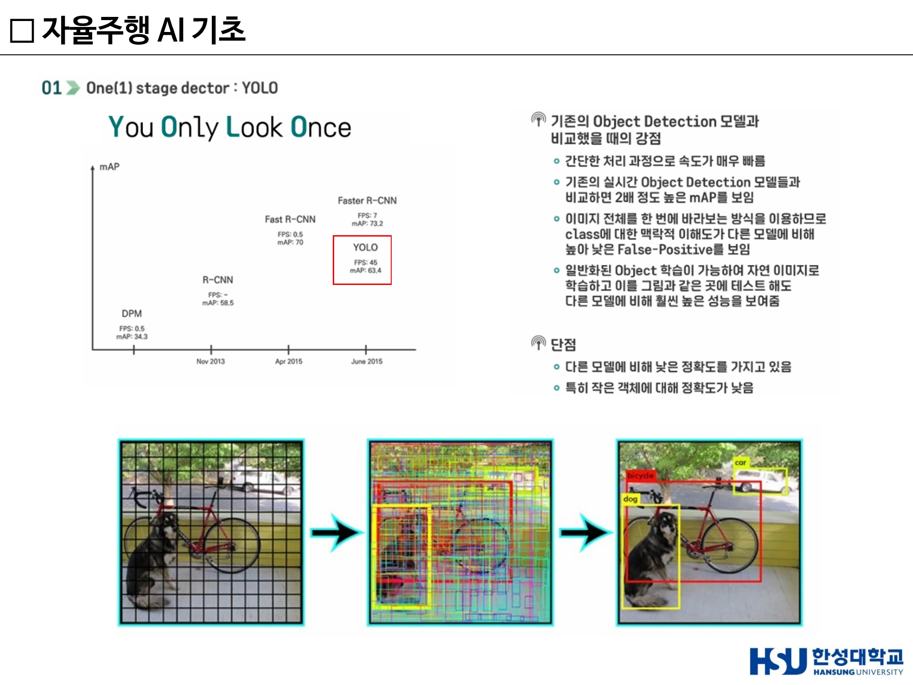
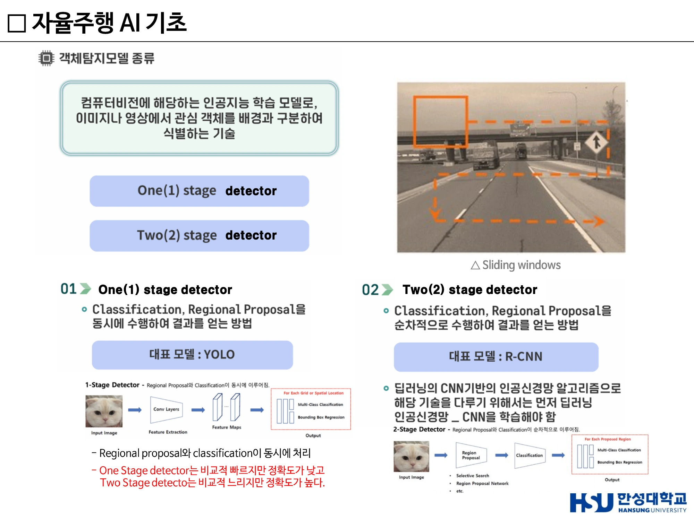
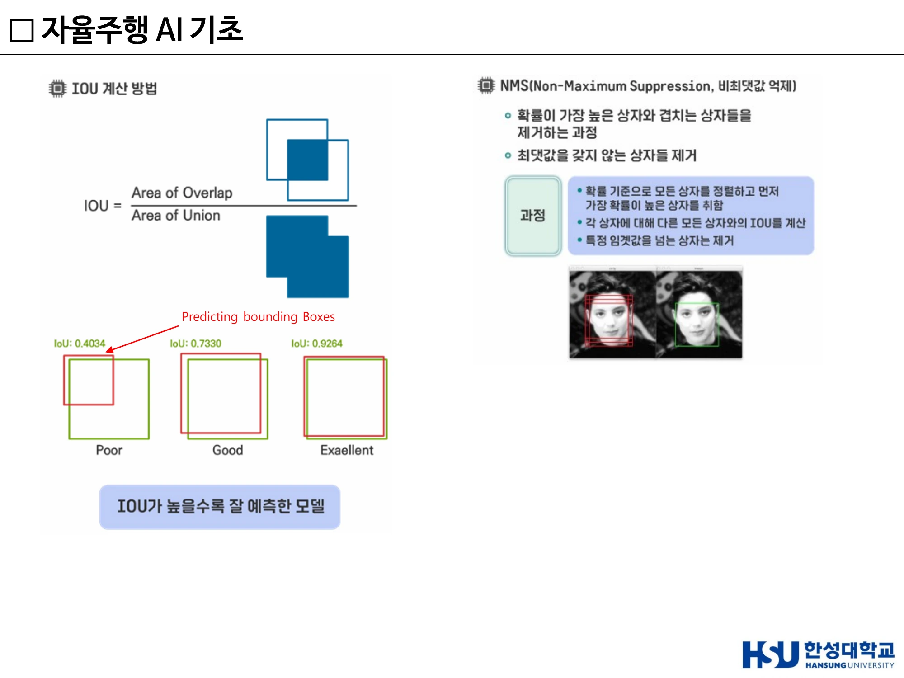
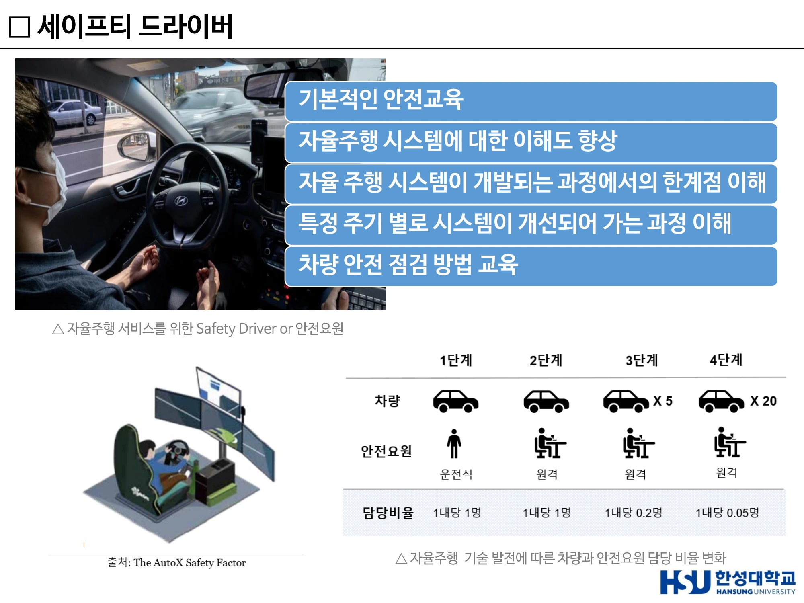

# 4주차 · 객체탐지와 데이터 기반 의사결정

> 🔗 **강의 흐름** — 3주차에서 "인지 = 센서 + AI"라고 했다. 이번 주는 그 AI의 정체인 **객체탐지(Object Detection)**를 연다. 이론이 끝나면 그 기술로 실제 돈을 버는 **로보택시 산업**의 현재를 본다.

> **학습목표** — 객체탐지의 정의와 1-stage·2-stage 방식의 차이를 설명하고, IoU와 NMS의 역할을 계산 개념으로 이해하며, 글로벌 자율주행 기업의 경쟁 구도를 설명할 수 있다.

> 💡 **기초 다지기** — **분류(Classification)와 탐지(Detection)는 다르다.** 분류는 "이 사진은 고양이다"까지만 말한다. 탐지는 **"어디에"** 있는지까지 말해야 한다. CNN은 "무엇인지"는 잘 맞추지만 "어디에 있는지"는 모른다. 그래서 **Localization** 정보를 추가하는 것이 객체탐지다.

## 🗺️ 한눈에 보는 개념도

## 1. 객체탐지란

**객체 탐지(Object Detection)** — 영상 및 영상 내의 **객체 종류(class)와 객체 위치(bounding box) 정보를 함께 포함**하는 것. 도로 영상에서 차량·차선·표지판을 찾아내고 그 위치를 박스로 표시한다.

- 얼굴, 도로 상황, 보행자 및 차량 등의 인식에 **머신러닝 기반 객체 탐지 기술**이 많이 활용된다.
- 이미지·영상 속에서 사람·동물·차량 등 객체의 **위치를 찾기 위해 컴퓨터비전 기술**이 활용된다.
- 검출 대상에 대한 **후보 영역을 찾고 그 안에서 객체의 종류와 위치를 예측**하는 방식으로 동작한다.
- 과거에는 **슬라이딩 윈도우**로 화면을 조금씩 이동시키며 탐지했지만, 현재는 딥러닝 기반 모델이 주로 사용된다.

**출력** — 일반적으로 이미지를 입력받아 **경계 상자와 객체 클래스 리스트**를 출력하며, 경계 상자에는 **예측된 클래스와 그 신뢰도(confidence score)**가 함께 나온다. 모델 성능 평가는 주로 **정확도와 재현율**을 기준으로 한다.

## 2. 1-stage vs 2-stage Detector

| 구분 | **1-stage detector** | **2-stage detector** |
|---|---|---|
| 대표 모델 | **YOLO** | **R-CNN 계열** |
| 동작 | Region Proposal과 Classification이 **동시에** 처리 | ① 객체가 있을 만한 영역(Region Proposal)을 찾고 ② 그 영역을 분류 |
| 속도 | **빠르다** | 느리다 |
| 정확도 | 상대적으로 낮다 | **높다** |
| 적합 분야 | 자율주행·실시간 영상 처리 | 정밀 분석 |

!!! quote "한 문장 요약"
    **"One Stage detector는 비교적 빠르지만 정확도가 낮고, Two Stage detector는 비교적 느리지만 정확도가 높다."**

### YOLO의 동작 3단계

1. **그리드 분할** — 입력 이미지를 S×S 그리드 셀로 나눈다(7×7, 13×13 등). 셀 중심에 객체가 있으면 그 셀이 해당 객체의 예측을 담당한다.
2. **셀마다 예측** — 각 셀은 B개의 바운딩 박스를 예측. 각 박스는 **(x, y)** 박스 중심 좌표(셀 내 상대 위치), **(w, h)** 너비·높이(전체 이미지 기준 비율), **Confidence**(객체일 확률 × IOU), **Class probabilities**(C개).
3. **후처리 NMS** — 겹치는 박스 중 신뢰도가 높은 것만 남기고 제거 → 최종 위치와 클래스 결정.

> ▲ YOLO의 그리드 기반 탐지 — 이미지를 격자로 나누고 셀마다 박스와 클래스를 동시에 예측 *(출처: 4주차 슬라이드 p10)*

### R-CNN의 동작 2단계

1. **Region Proposal** — **Selective Search**로 이미지에서 객체가 있을 만한 **후보 영역 약 2000개**를 생성.
2. **Classification + Localization** — 각 후보 영역을 CNN에 넣어 무슨 객체인지 분류하고, 정확한 위치(Bounding Box)를 보정.

> ▲ One(1) stage detector(YOLO) vs Two(2) stage detector(R-CNN) — 속도와 정확도의 맞바꿈 *(출처: 4주차 슬라이드 p8)*

## 3. IoU와 NMS — 반드시 이해할 두 개념

### IoU (Intersection over Union)

예측한 박스와 실제 정답 박스가 **얼마나 잘 겹치는지**를 나타내는 지표.

$$\text{IoU} = \frac{\text{겹치는 영역}}{\text{전체(합집합) 영역}}$$

| IoU 값 | 평가 |
|---:|---|
| 약 0.40 | Poor — 겹침이 적다 |
| 약 0.73 | Good |
| 약 0.92 | Excellent — 거의 일치 |

→ **IoU가 높을수록 모델이 위치를 정확하게 예측**했다는 뜻이다.

### NMS (Non-Maximum Suppression, 비최대값 억제)

객체 탐지 모델은 **하나의 객체에 대해 여러 개의 박스를 동시에 예측**하는 경우가 많다. 얼굴 하나인데 박스가 여러 개 겹치는 상황을 정리하는 것이 NMS다.

1. 모든 박스를 **확률 기준으로 정렬**
2. 가장 확률이 높은 박스를 하나 **선택**
3. 그 박스와 다른 박스들의 **IoU를 계산**
4. IoU가 일정 기준(예: **0.5**) 이상이면 겹치는 박스를 **제거**
5. 남은 박스에 대해 **반복**

!!! tip "IoU와 NMS의 관계"
    IoU는 **평가 지표**이면서 동시에 **NMS의 판단 기준**이다. 같은 수식이 두 군데서 쓰인다는 점을 알면 헷갈리지 않는다.

> ▲ IOU 계산 방법과 NMS(비최대값 억제) — 겹치는 박스 중 신뢰도가 높은 것만 남긴다 *(출처: 4주차 슬라이드 p14)*

## 4. 모델의 계보

- **YOLOv3 + Deep SORT** — 탐지(YOLO)에 추적(tracking)을 결합
- **YOLOv8** — 최신 YOLO 모델들과의 성능 비교
- 수많은 YOLO 버전이 탄생 — Object Detection 분야의 논문과 관련 연구가 지속 발전 중
- 데이터셋 — Microsoft(COCO), University of Oxford + PASCAL Challenge(PASCAL VOC)

## 5. 자율주행 AI 시스템의 4단 구조

강의에서 제시하는 자율주행 AI의 확장된 구조로, 3주차의 인지–판단–제어를 한 단계 더 세분한 것이다.

| 단계 | 세부 기술 |
|---|---|
| **인지 (Perception)** | 고성능 임베디드 센서 · 환경 장애물 인식(날씨·조도·도로상태) · 운전자/탑승자 모니터링 |
| **인식 (Recognition)** | 정밀 동적 맵(실시간 업데이트) · AI 기반 객체 검출·추적 알고리즘 고도화 |
| **계획 (Planning)** | 초저지연 차량 간 통신으로 협력 주행 · 장거리 및 자율주행 최적화 · 자율주행 휴먼 팩터 고려 |
| **강화학습 제어 (RL Control)** | 자율 차량 군집 주행 · 교통 제어 |

## 6. 세이프티 드라이버 (안전요원)

- 자율주행 서비스를 위한 **Safety Driver / 안전요원**이 필요하다.
- 자율주행 기술이 발전할수록 **차량이 담당하는 비율이 늘고 안전요원 담당 비율이 줄어드는** 전이(轉移) 구조를 갖는다.
- 이것은 곧 **새로운 직업의 등장**이기도 하다(2주차 「생각해 봅시다」와 연결).

> ▲ 자율주행 기술 발전에 따른 차량과 안전요원의 담당 비율 변화 *(출처: 4주차 슬라이드(덱 6) p14)*

## 7. 산업 지형 — 누가 앞서 있는가

### 가이드하우스 인사이트(Guidehouse Insights) 리더보드

자율주행 업체의 순위를 매년 리더보드 형태로 발표한다.

- **2021년 1분기** 리더 그룹 — **웨이모(Waymo, 구글), 엔비디아(Nvidia), 아르고 AI(Argo AI, 포드·폭스바겐), 바이두(Baidu)**
- **전통적인 완성차 제조업체가 리더 그룹 밖에 있는 현실**
- **2023년** — 모빌아이, 웨이모, 바이두, 크루즈(GM), 모셔널(현대차그룹–앱티브), Nvidia, 오로라, WeRide, 죽스(Zoox), Gatik
- 테슬라는 미국 평가에서 **2년 연속 최하위권**으로 보도됨

!!! note "왜 테슬라가 낮게 평가되는가"
    리더보드는 "전략 + 실행"을 함께 본다. 테슬라의 FSD는 **레벨 2**로 분류되며 책임이 운전자에게 있다. 반면 웨이모는 특정 지역에서 **레벨 4 무인 서비스를 실제 운영**한다. 평가 축이 "판매량"이 아니라 "자율성 수준과 실증"이기 때문이다.

### 주요 로보택시 사업자

| 기업 | 현황 |
|---|---|
| **웨이모(구글)** | 마운틴뷰 등 실리콘밸리까지 확대. **마이애미로 사업 확장, 2026년 로보택시 서비스 출시 목표** — 4번째 도시 확장으로 크루즈·테슬라와의 격차 확대 전망 |
| **바이두** | 베이징·상하이·광저우·선전·충칭·우한·청두·창사·허페이·양취안·우전 등 **10개 이상 대도시**에서 자율주행 택시 운영. 누적 승차 **140만 건 이상**, L4 테스트 마일리지 **4,000만 km 이상**, 자율주행 특허 **3,477건** |
| **크루즈(GM)** | 로보택시 인명 피해 사고로 규제당국 조사 및 운행 중단 |
| **모셔널(현대차그룹)** | 현대차 26% + 기아 14% + 현대모비스 10% + 앱티브 50% 합작(2020 설립). 3년간 **누적 영업적자 약 1조 4,995억원** |
| **테슬라** | 운전대·페달 없는 로보택시 **'사이버캡'** 공개. **3만 달러(약 4천만 원) 미만** 예상, **2026년 양산** 목표. 머스크 — "자율주행차가 있다. 운전자는 없다" |

### 국방 분야로의 확장

- 미국 **'AI 무인전투기' 1000대** 제작 계획 — 스텔스기 호위 임무.

## 🤔 생각해 봅시다

1. 자율주행에는 왜 2-stage보다 1-stage가 더 많이 쓰이는가? "정확도가 높은 쪽이 안전하지 않은가"라는 반문에 어떻게 답할 것인가?
2. 크루즈는 사고 한 번으로 운행이 중단되었다. 자율주행 산업에서 **한 번의 사고가 갖는 무게**는 왜 다른 산업과 다른가?
3. 모셔널의 누적 적자 1조 5천억을 어떻게 평가할 것인가 — 실패인가, 필요한 투자인가? 판단 근거를 제시하시오.

## ✅ 이번 주 체크리스트

- [ ] 객체탐지의 정의(class + bounding box)를 말할 수 있다
- [ ] 1-stage/2-stage의 대표 모델·속도·정확도 트레이드오프를 안다
- [ ] IoU 수식과 NMS 5단계를 설명할 수 있다
- [ ] 가이드하우스 리더보드 상위권과 테슬라의 위치를 안다

---

▶️ **다음 주 예고** — 자율주행의 **레벨과 국제 규제**를 정면으로 다룬다. UNECE ALKS는 왜 60km/h에서 130km/h로 바뀌었나, 테슬라와 웨이모의 센서 구성은 왜 정반대인가, 그리고 자동차가 왜 '소프트웨어 회사'가 되고 있는가. → [5주차](week05.md)
