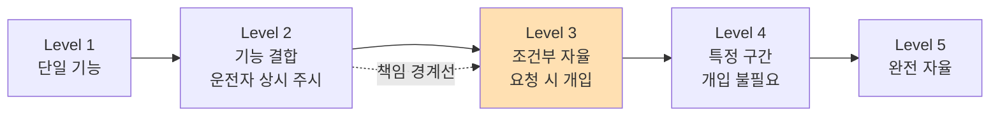
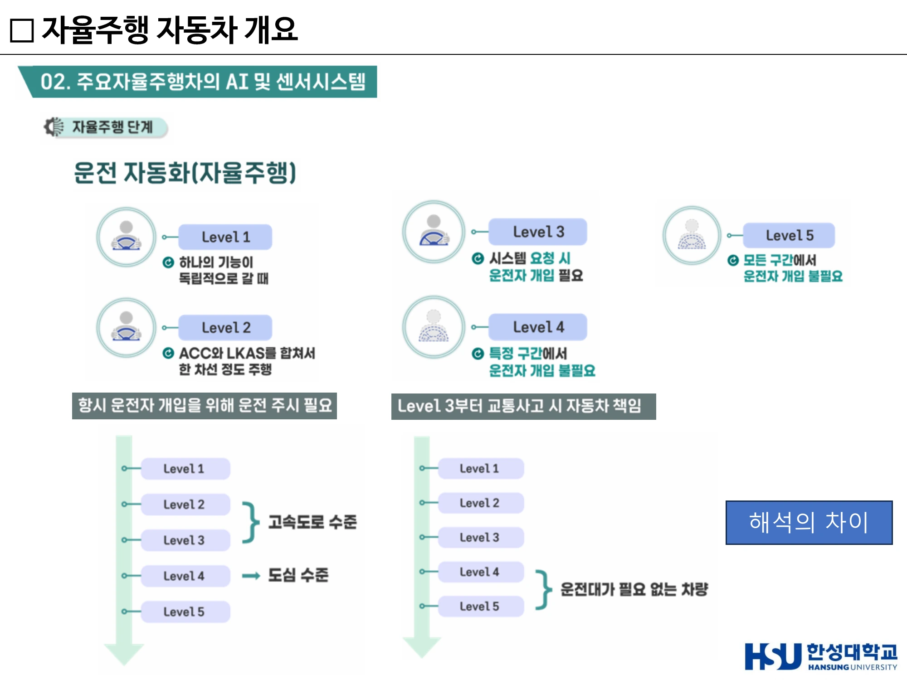
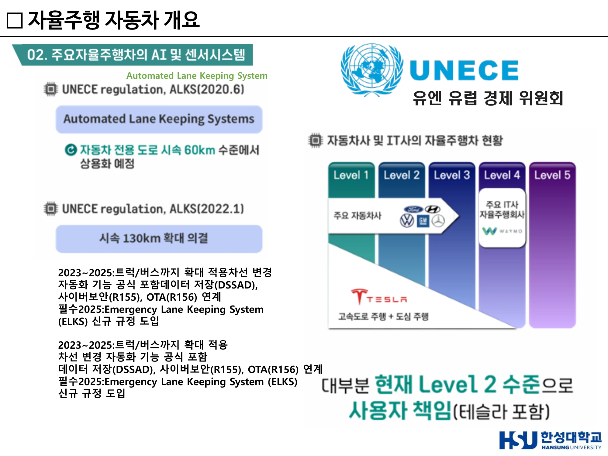
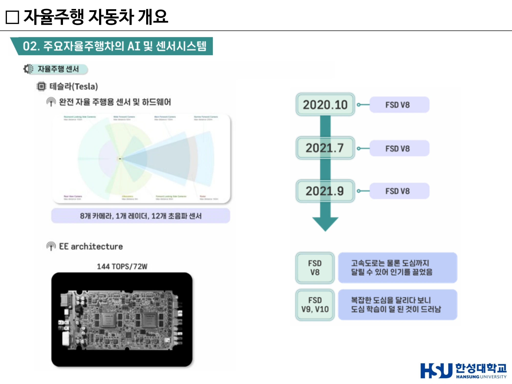
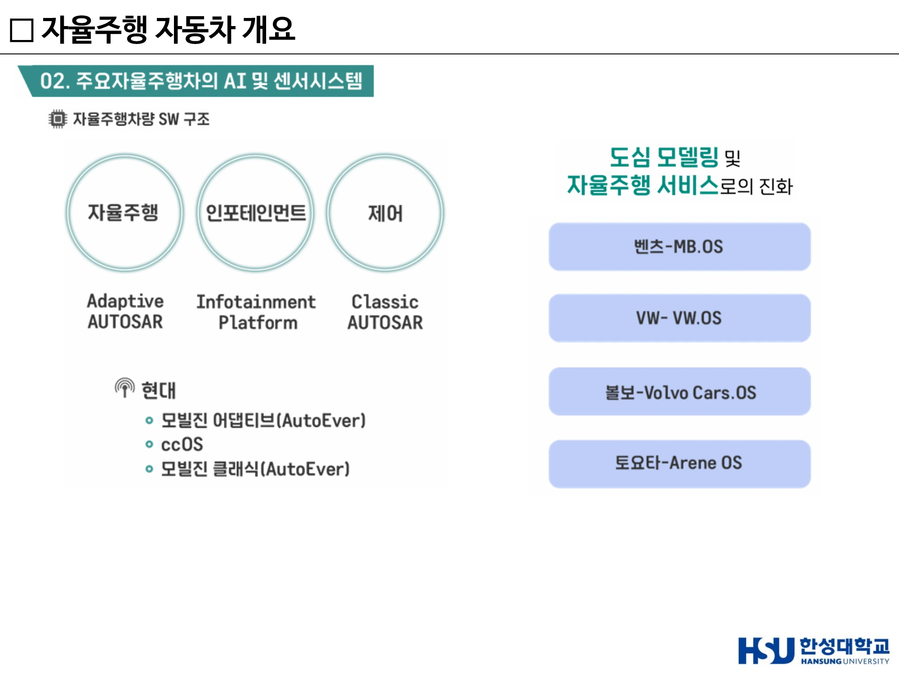
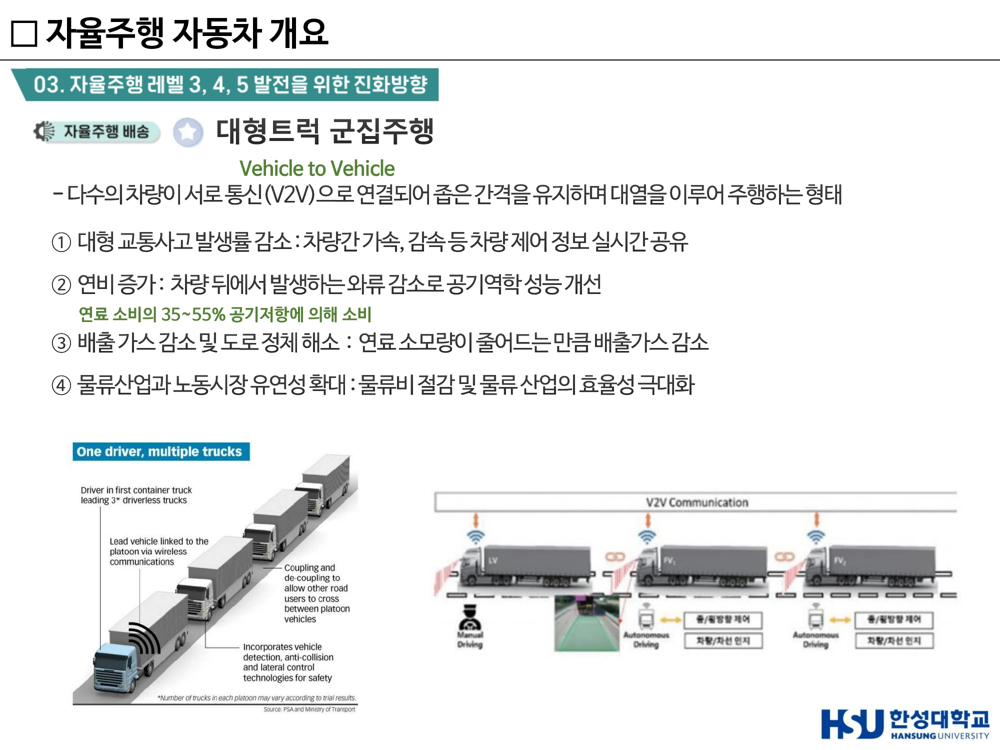

# 5주차 · 자율주행 단계·규제와 센서 시스템

> 🔗 **강의 흐름** — 지금까지 "무엇을 하는가"를 봤다. 이번 주는 **"어디까지 허용되는가"**와 **"누가 어떻게 만드는가"**다. 레벨과 규제는 중간고사 서술형 1번(SAE 레벨)에 직결되고, 테슬라 vs 웨이모 비교는 6주차 센서 심화의 출발점이 된다.

> **학습목표** — SAE 자율주행 레벨을 단계별 특징·운전자 역할 중심으로 설명하고, UNECE 규제의 변화 흐름을 서술하며, 주요 기업의 센서·AI 시스템 구성 전략을 비교할 수 있다.

> 💡 **기초 다지기** — **레벨 3이 실질적인 경계선이다.** 레벨 2까지는 "운전자가 항상 보고 있어야 하는 보조 장치", 레벨 3부터는 "차가 운전을 주도하되 요청 시 사람이 받는다". 그래서 **사고 책임이 처음으로 자동차 쪽으로 넘어오는 지점**이 레벨 3이다.

## 🗺️ 한눈에 보는 개념도

## 1. SAE 자율주행 레벨 1~5

| 레벨 | 특징 | 운전자 역할 | 예 |
|---:|---|---|---|
| **1** | 차량이 **한 가지 기능만** 자동 수행 | 운전자가 운전 | ACC(차간거리 유지) **또는** LKAS(차선 유지)가 각각 독립 작동 |
| **2** | **여러 기능이 결합**. ACC와 LKAS가 동시 작동해 일정 구간 스스로 주행 | **항상 주시**, 언제든 개입 준비 | 테슬라 오토파일럿, 대부분의 현재 양산차 |
| **3** | **조건부 자율주행(Conditional Automation)**. 차량이 주행을 주도하되, **시스템이 요청하면 운전자가 반드시 개입** | 요청 시 제어권 인수 | **사고 발생 시 자동차의 책임이 일부 포함** |
| **4** | 특정 구간(고속도로·제한된 도심)에서 **운전자 개입 불필요**. 모든 환경에서 가능한 것은 아님 | 해당 구간에서 불필요 | 웨이모 로보택시 |
| **5** | **완전 자율주행**. 모든 환경에서 개입 전혀 불필요 | 없음(운전대 자체가 불필요) | — |

**두 가지 해석 축**

- **도로 환경 기준** — Level 1~3은 주로 고속도로 수준, Level 4부터 도심까지 확장
- **운전자 필요 여부 기준** — Level 4부터 운전자 없이 주행 가능, Level 5는 완전 무인

!!! danger "시험 포인트"
    - **"주행 중에는 자동차가 책임지지만, 시스템의 요청이 있을 때는 사용자가 개입해 제어권을 넘겨받아야 하는 단계"** → **레벨 3**
    - **"SAE 자율주행 단계 구분에서 '조건부 자율주행(Conditional Automation)'에 해당하는 레벨"** → **레벨 3**
    - 서술형 1번(2026): *"SAE 자율주행 단계(Level 0~5)를 각 단계별 특징·운전자 역할을 중심으로 설명하시오."*

> ▲ 운전 자동화 Level 1~5와 두 가지 해석 축(도로 환경 기준 / 운전자 필요 여부 기준) *(출처: 5주차 슬라이드 p3)*

## 2. UNECE 규제 — 기술이 아니라 법이 상용화를 정한다

**UNECE** = UN 산하 **유럽경제위원회**. 사이버 보안 및 SW 업데이트 관련 법규를 관장한다.

### ALKS (Automated Lane Keeping System)

| 시기 | 규정 내용 |
|---|---|
| **2020** | **시속 60km 이하**의 자동차 전용도로에서만 자율주행 기능 허용 → 초기 레벨 3은 매우 제한된 환경에서만 사용 가능 |
| **2022** | 속도 **130km/h까지 확대** → 고속도로 환경에서도 실제 사용 가능 수준으로 발전 |
| **2023~2025** | 단순 기능 확장이 아니라 **시스템 전체 요구사항 강화**: · 트럭과 버스까지 적용 확대 · **차선 변경 자동화** 기능 공식 포함 · **DSSAD**(Data Storage System for Automated Driving, 주행 데이터 기록 장치) · **R155** — UN Regulation No.155 (**Cyber Security**) · **R156** — UN Regulation No.156 (**Software Update / OTA**) 연계 필수 |
| **2025** | **ELKS**(Emergency Lane Keeping System, 긴급 차선 유지 시스템) 신규 규정 도입 |

!!! success "핵심 메시지"
    자율주행은 이제 단순 기능이 아니라 **하나의 완전한 안전 시스템 + 데이터 시스템 + 보안 시스템**으로 발전하고 있다. 기술만으로는 상용화되지 않고 **국제 규제 기준을 만족해야** 한다.

### 현재 산업 수준의 현실

- 대부분의 자동차 제조사(현대차·벤츠·GM·폭스바겐)는 **Level 1~2** 수준에 머물러 있다.
- **테슬라 역시 실제로는 Level 2** — 많은 사람이 완전 자율주행이라 생각하지만 **운전자의 책임이 여전히 존재**한다.
- **Level 4 영역**에는 자동차 회사가 아니라 **IT 기반 기업(웨이모 등)**이 위치하며, 특정 지역에서 실제 서비스를 운영한다.

> **👉 현재 대부분의 차량은 Level 2 수준이며, 책임은 여전히 사용자에게 있다.**

### 라이다 상용화 흐름

- **아우디 A8** — 라이다 센서가 **최초로 적용**되면서 자율주행 상용화 가능성 제시
- **2021** — 혼다, 벤츠 EQS 등에서 레벨 3 일부 상용화
- **2023** — 현대차에서도 **장거리 라이다**를 적용한 차량 등장
- **연구용 vs 양산 차량의 차이** — 연구용은 정확한 인식을 위해 라이다를 많이 쓰지만, **양산차는 비용 문제로 라이다 사용이 제한적**

!!! quote "이 주차의 핵심 문장"
    **"결국 자율주행의 핵심은 '센서 성능'이 아니라 '비용 대비 성능을 어떻게 최적화하느냐'다."**

> ▲ UNECE ALKS 규정 변화(2020 60km/h → 2022 130km/h)와 기업별 자율주행 수준 — 대부분 현재 Level 2, 책임은 사용자 *(출처: 5주차 슬라이드 p4)*

## 3. 기업별 전략 비교 — 같은 문제, 다른 답

> ▲ 테슬라 — 카메라 8 + 레이더 1 + 초음파 12, 자체 AI 칩 144 TOPS, FSD V8→V9·V10 전개 *(출처: 5주차 슬라이드 p7)*

### 테슬라 — 카메라 중심 (Vision only)

- **라이다를 사용하지 않는다.** 사람의 눈과 유사한 **시각 기반 인지**
- 구성: **카메라 8개 + 레이더 1개 + 초음파 센서 12개**
- **자체 설계 AI 칩**, 약 **144 TOPS** 연산 성능으로 실시간 판단
- **EE 아키텍처** — 센서 데이터 통합 처리, 인지·판단·제어를 하나의 시스템에서 수행하는 **통합형 구조**
- **FSD 소프트웨어 흐름** — 2020~2021 FSD V8로 고속도로뿐 아니라 도심 주행 가능 → 큰 주목. 그러나 도심은 상황이 매우 복잡해 V9, V10으로 발전하는 과정에서 **도심 주행 학습이 충분치 않다는 한계**도 드러남

**카메라 배치와 인식 거리** — Narrow Forward 250m / Main Forward 150m / Wide Forward 60m / Forward Looking Side 80m / Rearward Looking Side 100m / Rear View 50m / Radar 150m / Ultrasonics 8m

### 웨이모(구글) — 고정밀 멀티 센서 융합

- 지붕 위 **360도 라이다** + 차량 전반에 분산된 센서
- 전방 **장거리 카메라 + 레이더**로 먼 거리 물체 인식, 차량 주변 **Perimeter 라이다 + Vision**으로 360도 정밀 인식
- 핵심은 **센서를 중복(redundant)으로 사용해 인지 정확도를 극대화**하는 것 — 오차를 줄이고 안정성을 높인다
- **단점이 분명하다** — 고가 센서가 많아 **비용이 매우 높고 양산에 불리**

### 모빌아이 SuperVision — 11개 카메라

Front Main Camera / Front Long-Range Camera / Side Cameras ×4 / Rear Camera / Surround Parking Cameras ×4. 별도로 Radar(Long Range + Corner ×4), Lidar(Long-range ×3) 구성.

### 현대차 · 글로벌 OEM

- **CES 2017 현대 아이오닉 자율주행차** — Aptiv 기반 시스템. 단거리·장거리 라이다, 전방·측면 레이더, 카메라, GPS·통신 결합. **컴퓨팅 시스템도 이중화 구조**로 안전성·신뢰성 확보. **폭우 등 악조건에서도 안정적 자율주행을 성공**시켜 주목받음
- **최근 변화** — 아이오닉5 로보택시, 폭스바겐 ID. Buzz AD 모두 **차량 측면에 라이다 추가**. 도심에서는 보행자·자전거·측면 차량 같은 복잡한 상황이 많아 **측면 인지 성능이 중요**해졌기 때문
- 👉 **자율주행 센서는 "많이 쓰는 것"이 아니라 "어디에 배치하느냐"가 중요한 단계로 발전**

## 4. 자율주행 컴퓨팅의 내재화 — SDV로 가는 길

**과거** — 트렁크에 별도 산업용 컴퓨터를 장착. 전력 소모가 크고 공간 효율도 나쁨.
**현재** — 자율주행 기능이 차량 내부로 통합되며 **소형 임베디드 보드 형태로 내재화**. 즉 차량 자체가 하나의 컴퓨터처럼 동작하는 **SDV(Software Defined Vehicle)** 구조로 발전.

**생태계 구조** — 완성차 + 반도체 + 센서 기업의 협력

| 완성차 | 협력 파트너 |
|---|---|
| 볼보 · 벤츠 | 엔비디아 + 루미나 |
| 폭스바겐 | 퀄컴 + 이노비즈 |

> 👉 **자율주행 경쟁력은 이제 센서가 아니라 "AI 반도체와 시스템 아키텍처"에서 결정된다.**
> 2025년을 기점으로 자율주행이 본격 상용화 단계에 진입하며, 특히 **모빌아이 중심의 양산형 플랫폼 확대**가 예상된다.

## 5. 차량 소프트웨어 구조 3영역

| 영역 | 담당 기능 | 플랫폼 | 요구 특성 |
|---|---|---|---|
| **자율주행** | 인지·판단·경로계획 | **Adaptive AUTOSAR** | 고성능 컴퓨팅, AI·데이터 처리 중심 |
| **인포테인먼트** | 내비게이션·UI·콘텐츠 | Infotainment Platform | 차량 사용자 경험(UX)의 핵심 |
| **제어** | 브레이크·조향·모터 제어 | **Classic AUTOSAR** | **실시간성·안정성**이 가장 중요(안전 직결) |

**현대차** — 모빌진 어댑티브(Adaptive AUTOSAR) / ccOS / 모빌진 클래식(Classic AUTOSAR)

**완성차의 자체 OS 개발**

| 기업 | OS |
|---|---|
| 벤츠 | **MB.OS** |
| 폭스바겐 | **VW.OS** |
| 볼보 | **Volvo Cars OS** |
| 토요타 | **Arene OS** |

> 👉 **자동차의 경쟁력이 하드웨어가 아니라 소프트웨어 플랫폼으로 이동하고 있다.**

> ▲ 자율주행(Adaptive AUTOSAR) / 인포테인먼트 / 제어(Classic AUTOSAR) 3영역과 완성차 자체 OS *(출처: 5주차 슬라이드 p14)*

## 6. HD Map과 크라우드소싱 — REM

**REM** (Road Experience Management) — **Crowdsourcing 기반 정밀지도 생성 기술**(= 정밀 지도 구축)

- 일반 차량에 장착된 **ADAS 카메라 센서**를 통해 수집한 도로 주행 영상 데이터를 활용
- 도로의 **차선, 표지판, 도로 구조물, 주행 경로** 등의 정보를 자동으로 추출
- 수많은 차량의 데이터를 집계해 **실시간 정밀지도(HD Map)를 구축하고 갱신**

!!! tip "왜 중요한가"
    HD Map을 전용 측량 차량으로 만들면 비용과 갱신 주기가 문제가 된다. REM은 **이미 도로를 달리고 있는 수백만 대의 일반 차량**을 지도 제작 장비로 쓴다. 모빌아이가 폭스바겐 등과 함께 약 100만 대의 차량 데이터를 크라우드소싱해 고화질 지도를 구축한 것이 대표 사례다.

## 7. 대형트럭 군집주행 (Platooning)

**정의** — 다수의 차량이 서로 통신(**V2V**)으로 연결되어 좁은 간격을 유지하며 대열을 이루어 주행하는 형태.

**왜 필요한가** — 장거리 물류 운송은 고질적으로 누적된 피로로 **졸음 운전 위험**에 노출된다. 졸음을 쫓거나 야간 고속도로 주행 중 휴대폰으로 음악을 조작하다 사고 위험이 증가한다.

**효과 4가지**

| # | 효과 | 근거 |
|---:|---|---|
| ① | **대형 교통사고 발생률 감소** | 차량 간 가속·감속 등 제어 정보 실시간 공유 |
| ② | **연비 증가** | 차량 뒤에서 발생하는 **와류 감소**로 공기역학 성능 개선. **연료 소비의 35~55%가 공기저항**에 의해 소비됨 |
| ③ | **배출가스 감소 및 도로 정체 해소** | 연료 소모량 감소분만큼 배출가스 감소 |
| ④ | **물류산업과 노동시장 유연성 확대** | 물류비 절감 및 물류 산업 효율성 극대화 |

**사례**

- **현대자동차 (2019.11)** — 국내 최초 고속도로 내 **대형트럭 군집주행 시연 성공**
- **소프트뱅크 (2019)** — 신토메이고속도로 **14km** 구간. **5G NR(New Radio)** 기반 V2V 통신으로 차간거리 및 자율주행 구현. **4.5GHz 5G 통신망**으로 차량 간 위치·속도 정보 공유. 제어 기술은 **CACC**(Coordinated Adaptive Cruise Control, 협조형 차간거리 유지 제어)

!!! danger "시험 포인트"
    **"트럭 군집주행에서 주로 사용되는 통신 방식과 주된 이점의 조합"** → **V2V — 연료 효율 향상 및 운전자 부담 완화**
    (✕ V2G-전력망 / ✕ V2P-보행자 안내 / ✕ V2I-신호등 최적화)
    **"군집 주행의 주요 이점 중 아닌 것"** → **운전자의 운전 부담 증가**

> ▲ V2V 기반 대형트럭 군집주행과 효과 4가지 — 연료 소비의 35~55%가 공기저항 *(출처: 5주차 슬라이드(덱 8) p24)*

## 8. 시뮬레이션 — 웨이모 Simulation City

실도로 주행만으로는 위험 상황을 충분히 학습할 수 없다. 웨이모는 **Simulation City**를 통해 가상 환경에서 대규모 주행 시나리오를 반복 검증한다. (7주차 Digital Twin과 연결된다.)

## 🤔 생각해 봅시다

1. 테슬라(카메라 중심)와 웨이모(라이다 중복)의 전략 중 **어느 쪽이 먼저 대중화**되겠는가? 판단 근거를 비용·안전·데이터 관점에서 정리하시오.
2. UNECE가 **속도 상한(60→130km/h)**으로 자율주행을 규제하는 방식은 타당한가? 도로 유형·날씨·ODD 등 다른 기준은 어떠한가?
3. REM처럼 **일반 운전자의 주행 데이터를 수집**하는 것은 정당한가? 어떤 동의 절차가 필요한가?

## ✅ 이번 주 체크리스트

- [ ] 레벨 1~5를 **운전자 역할** 중심으로 설명할 수 있다
- [ ] 레벨 3이 책임의 경계선인 이유를 안다
- [ ] ALKS 60→130km/h, DSSAD·R155·R156·ELKS를 열거할 수 있다
- [ ] 테슬라(8+1+12, 144 TOPS)와 웨이모(멀티 라이다)의 전략 차이를 설명할 수 있다
- [ ] Classic AUTOSAR vs Adaptive AUTOSAR의 역할 차이를 안다
- [ ] 군집주행 효과 4가지와 "공기저항 35~55%"를 안다

---

▶️ **다음 주 예고** — 센서 하나하나를 물리 원리 수준까지 내려가 본다. 라이다 거리 공식, 1550nm이 왜 안전한가, 4D 이미징 레이더는 무엇이 4D인가, 그리고 TOPS 전쟁의 실제 숫자들. → [6주차](week06.md)
