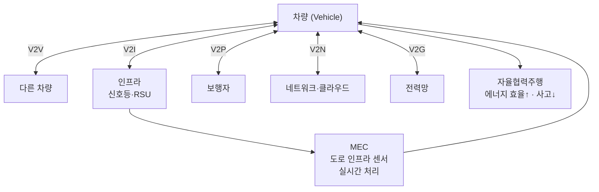
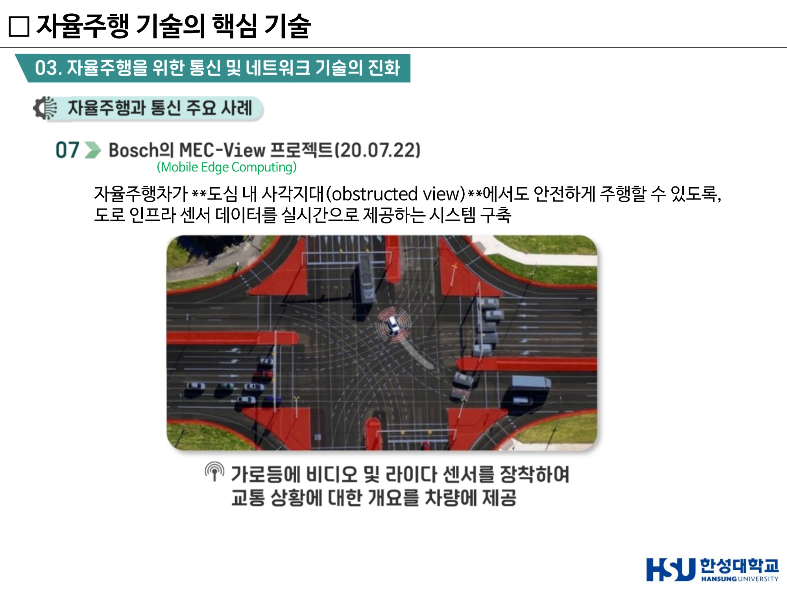
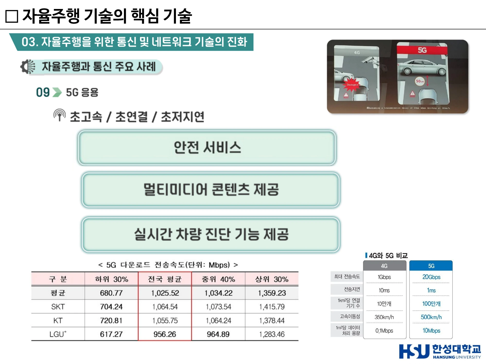
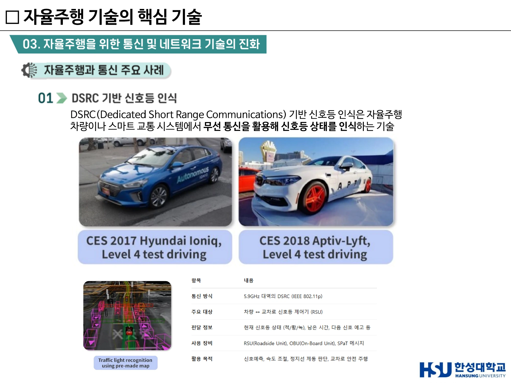
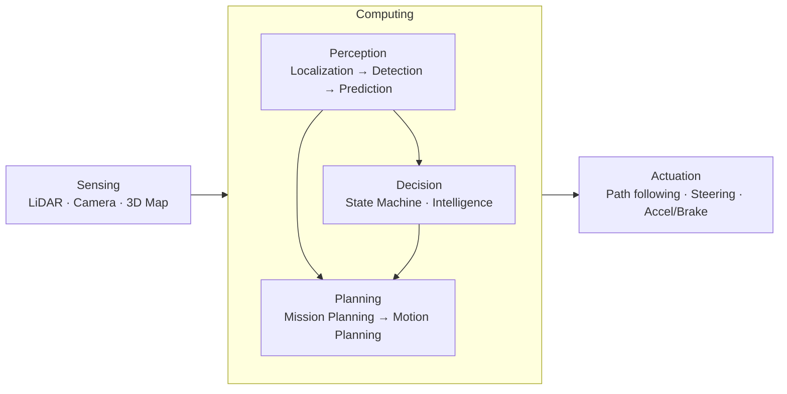
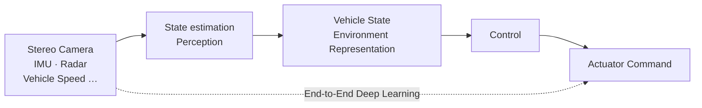

# 7주차 · 통신·V2X와 공학 설계 프로세스

> 🔗 **강의 흐름** — 6주차 마지막 시나리오(안개 낀 야간 고속도로)에서 센서만으로는 부족하다는 것을 확인했다. 이번 주는 그 빈칸을 **통신**이 어떻게 메우는지 본다. 중간고사 서술형 4번(V2X)과 5번(도전과제)이 여기서 나오고, 2025년 서술형 3번의 **7단계 공학 설계 프로세스**도 이 주차 내용이다.

> **학습목표** — V2X 4유형을 정의하고 협조주행과 자율주행의 관계를 논하며, 통신 기반 자율주행 사례를 설명하고, 7단계 공학 설계 프로세스로 문제를 구조화할 수 있다.

> 💡 **기초 다지기** — **"센서는 보이는 것만 본다."** 카메라는 선행 차량 너머를 인지하지 못하고, 라이다는 코너 뒤를 감지하지 못한다. 그러나 선행 차량이 "전방에 결빙 구간이 있다"는 정보를 **전송해 주면**, 직접 보지 않고도 알 수 있다. 이것이 V2X다. 자율주행이 "보는" 단계에서 **"데이터로 이해하는"** 단계로 넘어가는 것이다.

## 🗺️ 한눈에 보는 개념도

## 1. 왜 통신인가

> **"자동차를 기반으로 서비스를 만들어내야 되는 시대" — 자율주행 전기차 서비스로의 패러다임 변화**

**두 가지 필요성**

| 구분 | 필요성 |
|---|---|
| **안전한 자율주행을 위한 기반 기술** | 도로·인프라·차량 실시간 연동 / 데이터 수집 및 제공 |
| **자율주행 차량에서 제공되는 서비스를 위한 기술** | 자율주행 서비스 / 멀티미디어 서비스 |

**5G 자율주행 융합 서비스 4종** (과기부 기가코리아 사업단)

1. 주문형 자율주행 교통 서비스
2. 자율주행 물류/배송 서비스
3. 자율주행 차량 관리 서비스
4. 자율주행 콘텐츠 서비스

### 센서만으로는 한계가 있다

| 센서 | 인지하지 못하는 대상 |
|---|---|
| 카메라 ❌ | 전방 시야 확보 불가 (선행 차량에 가림) |
| 라이다 ❌ | 코너 뒤 감지 불가 |

→ **차들끼리 통신해서 해결한다.** 전달되는 정보: **도로 상태**(결빙, 파손), **교통 상황**(혼잡, 사고, 고장 차량)

## 2. V2X — Vehicle to Everything

| 유형 | 대상 | 대표 활용 |
|---|---|---|
| **V2V** (Vehicle-to-Vehicle) | 차량 ↔ 차량 | **군집주행**, 사고·급제동 경고, 사각지대 경고 |
| **V2I** (Vehicle-to-Infrastructure) | 차량 ↔ 신호등·도로 인프라 | **교통 사고 예방**, 신호 예측(Time-to-Green), 속도 조절 |
| **V2P** (Vehicle-to-Pedestrian) | 차량 ↔ 보행자 | 보행자 안내·충돌 경고 |
| **V2N** (Vehicle-to-Network) | 차량 ↔ 네트워크·클라우드 | 상태 공유, 원격 관제, 콘텐츠 |
| **V2G** (Vehicle-to-Grid) | 차량 ↔ 전력망 | 전력망 전력 공급·수요 반응 |

!!! danger "시험 포인트"
    - **"V2I 통신이 주로 사용되는 목적은?"** → **교통 사고 예방**
    - **"대형 트럭 군집 주행에서 트럭 간의 무선 데이터 교환 방식은?"** → **V2V**
    - 서술형 4번(2026): *"V2X 통신의 4가지 유형(V2V, V2I, V2P, V2G)을 각각 정의하고, V2X 기반 협조주행(Cooperative Driving)과 자율주행(Autonomous Driving)의 관계를 논하시오."*

### 협조주행 vs 자율주행 — 서술형 대비 정리

| 구분 | 자율주행 (Autonomous Driving) | 협조주행 (Cooperative Driving) |
|---|---|---|
| 정보원 | **자차 센서**(카메라·라이다·레이더) | 자차 센서 **+ 외부(차량·인프라·클라우드)** |
| 인지 범위 | 가시선(Line of Sight) 내 | **비가시선(NLoS)까지 확장** |
| 독립성 | 통신 없이도 동작 | 통신 인프라에 의존 |
| 관계 | **기반** | 자율주행의 **한계를 보완·확장** |

→ **협조주행은 자율주행을 대체하는 것이 아니라 완성시킨다.** 통신이 끊겨도 자율주행은 동작해야 하므로 센서 기반은 필수이고, 통신은 그 위에 안전 마진과 효율을 더한다.

## 3. 통신 기반 자율주행 주요 사례 9선

### ① DSRC 기반 신호등 인식

**DSRC** (Dedicated Short Range Communications) 기반 신호등 인식은 자율주행 차량이나 스마트 교통 시스템에서 **무선 통신을 활용해 신호등 상태를 인식**하는 기술.

| 항목 | 내용 |
|---|---|
| 통신 방식 | **5.9GHz 대역의 DSRC (IEEE 802.11p)** |
| 주요 대상 | 차량 ↔ 교차로 신호등 제어기 (**RSU**) |
| 전달 정보 | 현재 신호등 상태(적/황/녹), **남은 시간**, 다음 신호 예고 등 |
| 사용 장비 | **RSU**(Roadside Unit), **OBU**(On-Board Unit), **SPaT** 메시지 |
| 활용 목적 | 신호예측, 속도 조절, 정지선 제동 판단, 교차로 안전 주행 |

**사례** — CES 2017 Hyundai Ioniq Level 4 test driving / CES 2018 Aptiv-Lyft Level 4 test driving

### ② Audi Time-to-Green

차량이 신호등과 통신해서 **초록불까지 남은 시간**을 알려 주는 기술.

- 왜 중요한가 — ① 운전자 편의(미리 알 수 있음) ② **연비 개선**(급가속하지 않고 부드럽게 출발) ③ 자율주행차가 신호를 **'보는' 것이 아니라 '데이터로 이해하는' 단계**로 넘어감

### ③ 해킹과 보안에 대한 대비

> **"연결이 많아질수록 해킹 위험이 같이 커진다."**

**Shift 10: Smart Cities**

- **변곡점(Tipping Point)** — 인구 50,000명 이상의 도시에서 **신호등 없이 운영되는 최초의 도시** 출현
- **예상 시점** — **2026년**
- 응답자 전망 — 2025년까지 **64%**가 이 변곡점에 도달할 것이라 예상

**부정적 영향 (Negative Impacts)**

1. **감시 및 프라이버시 침해** — 고도화된 센서·CCTV·통신 인프라 기반이므로 개인정보 침해 우려
2. **시스템 붕괴 위험(Total Blackout)** — 에너지 시스템 또는 IT 인프라 장애 시 전체 도시 기능 마비 가능
3. **사이버 공격에 대한 취약성 증가**

### ④ 자율주행 레벨 3과 통신

- **Handover and communication** — 제어권 넘김. 차가 운전하다 사람에게 넘길 수도, 다시 받아올 수도 있는데 이 과정에서 통신이 중요하다. 시스템 → 운전자로 개입 요청이 전달되며, 차량과 클라우드가 상태를 공유한다
- **V2X information** — Swarm intelligence / Car-to-X

### ⑤ 캘리포니아 운전자 없는 자율주행차 규정

- **승객과 원격 운영자 간의 쌍방향 통신 연결**
- 제조사의 통신 모니터링 방법 인증

### ⑥ Snake Road (State Route 190)

**V2X 응용** — 도로의 상태(결빙, 파손 등) 및 교통 상황(혼잡도, 고장 등) 전송 가능.

### ⑦ Cavnue — 세계 최초 "자율주행 전용 도로"

- 통신으로 연결되는 자율주행차와 도로
- **도로와 차량의 데이터 공유**
- 일반 차량보다 **빠르게 이동할 수 있도록 설계**

### ⑧ Bosch MEC-View 프로젝트 (2020.07.22)

**MEC** = **Mobile Edge Computing**

- 자율주행차가 **도심 내 사각지대(obstructed view)**에서도 안전하게 주행할 수 있도록, **도로 인프라 센서 데이터를 실시간으로 제공**하는 시스템 구축
- **가로등에 비디오 및 라이다 센서를 장착**하여 교통 상황에 대한 개요를 차량에 제공

> ▲ Bosch MEC-View — 가로등에 비디오·라이다 센서를 달아 도심 사각지대 정보를 차량에 실시간 제공 *(출처: 7주차 슬라이드 p21)*

### ⑨ 5G 응용

**초고속 / 초연결 / 초저지연**

| 항목 | 4G | **5G** |
|---|---|---|
| 최대 전송속도 | 1 Gbps | **20 Gbps** |
| 전송지연 | 10 ms | **1 ms** |
| 1km²당 연결 기기 수 | 10만 개 | **100만 개** |
| 고속이동성 | 350 km/h | **500 km/h** |
| 1m²당 데이터 처리 용량 | 0.1 Mbps | **10 Mbps** |

**서비스** — 안전 서비스 / 멀티미디어 콘텐츠 제공 / 실시간 차량 진단 기능 제공

!!! tip "1ms가 왜 중요한가"
    시속 100km로 달리는 차는 10ms에 약 28cm를 간다. 지연이 1ms로 줄면 그 거리가 **2.8cm**가 된다. 긴급 제동 명령 전달에서 이 차이가 곧 제동거리 차이가 된다.

> ▲ 5G 응용 — 초고속·초연결·초저지연, 4G 대비 20Gbps/1ms/100만 개 비교표 *(출처: 7주차 슬라이드 p23)*

### 현대자동차 대형트럭 군집주행 (2019.11)

**물류산업 혁신** + **연비 및 배출가스 저감** — 상세는 [5주차](week05.md) 참조.

> ▲ DSRC 기반 신호등 인식 — 5.9GHz IEEE 802.11p, RSU·OBU·SPaT 메시지 *(출처: 7주차 슬라이드 p14)*

## 4. 정리 및 시사점 — 자율주행과 통신 융합

| 축 | 효과 |
|---|---|
| **센서 한계 극복** | → 사각지대 극복 / 차량 시야 확대 |
| **정밀 측위 응용** | → 상대위치 추정 / 악천후 극복 / **Digital Twin** |
| **자율협력주행** | → **에너지 효율 증가 / 사고 저감** |

**발전 방향**

- **V2X 정밀 측위를 통한 Digital Twin 구축** — 실도로 로그를 시뮬레이션에서 전량 재생(Replay logged real-world data in simulation)
- 클라우드 기반 **원격제어 / 원격자율주행**
- 자율주행 **실내 콘텐츠 서비스**
- **관광 등 연계 서비스** 응용

**4차 산업혁명과 차량 관련 변화**

- **주문형 교통 시스템** = 승차공유 + 자율주행
- **자율주행 물류 및 배송** — 자율주행차에 따른 물류·배송 변화 (Mercedes-Benz Vision Van)
- **맞춤형 자동차** = 전기차 플랫폼 + 3D 프린팅
- **스마트 시티** — 도시의 변화와 자율주행차 융합

### 자율주행 차량 플랫폼 — Autoware 구조

### 자율주행 금융

**자율주행차량 자체 결제** — 자율주행 차량이 스스로 결제(정비소, 주유소, 세차).

## 5. 모빌리티 데이터로 읽는 사회

> **"빅데이터가 아닌 모빌리티 데이터"** (카카오모빌리티 리포트)

- **빅데이터** — 예전에 볼 수 없던 수준의 크기와 속도, 다양한 형태로 축적되는 데이터. 많은 기업들이 목적을 위해 빅데이터를 수집·분석하는 데 많은 비용과 인력 투입 중
- **모빌리티 데이터** — 출도착 지점, 소요시간, 비용 등 데이터의 형태도 다양함

!!! quote "핵심 질문"
    **"평소에 많이 보이던 빈 택시는 왜 내가 필요할 때만 안 잡히는 걸까?"**
    → 모빌리티 데이터는 모두가 **체감상 알고 있던 불편함의 원인을 정확하게 파악**하고, 해결책을 찾기 위한 기술 혁신의 단초 역할을 한다.

**분석 사례**

| 사례 | 발견 |
|---|---|
| 수도권 시간대별 택시 수요와 공급 | 시간·장소·기상 여건에 따른 수요·공급 패턴 |
| 세계불꽃축제 (2017.9.30 21~22시) | 지역 축제 시 수요·공급 불균형 **폭발적 가중** |
| 월드컵 응원일 (2018.6.18 23~24시) | 동일 |
| 기상악화 시 택시 수요·공급 (2017.9~2018.8, 서울) | 폭염·혹한·폭우·폭설 시 불균형 심화 |
| 주 52시간 근로제 시행(2023.7) 이후 | 모빌리티 데이터로 직장인의 삶의 변화를 읽음 |

> **"무인 자율주행차가 모빌리티 서비스에서 수요 공급의 불일치를 보완해 줄 것으로 기대"**

## 6. 7단계 공학 설계 프로세스 — 과제·서술형 대비

이 주차의 후반부는 **미래 자동차산업 아이디어 공모전** 준비와 연결된다. 2025년 중간고사 서술형 3번이 *"도심에서의 자율주행 차량 도입이 직면한 주요 도전 과제와 해결 방안을 **7단계 공학 설계 프로세스 모델링 기법**에 따라 서술하시오"* (20점)였다.

### 실제 적용 사례 — 과속방지턱 문제

**1단계 · 문제 정의** — 과속방지턱으로 인한 부작용

| 구분 | 세부 내용 |
|---|---|
| **운전자** | 운전자·탑승자 승차감 저해 / 신체부상(척추, 등뼈 등) 초래 / 운전조작 어려움(핸들을 놓치는 경우) / 불안심리 및 피로 조장 |
| **자동차**(이륜차 포함) | 하부 및 조향장치(휠얼라이먼트, 타이어) 손상 / 급제동으로 인한 추돌사고 / 차내 안전사고 유발 / 불필요한 가·감속으로 연료 및 브레이크 패드 소모 |
| **도로·환경** | 과속방지턱을 피하는 차량에 의한 **보행자 공간 침범** / 급제동·급출발 및 통행 시 소음 발생 / 제동 후 급가속 차량으로 인한 환경오염 |

**2단계 · 정보 수집** — Mercedes-Benz **Magic Body Control**

- **Stereo Camera**는 전방 **4.5~13.7m** 영역에서 최소 **10~20mm** 요철을 인식
- 최초 컨셉에는 **Lidar 센서**를 썼으나, **양산화 과정에서 Stereo Camera로 대체**함
  → 5주차의 "비용 대비 성능 최적화"가 실제 제품에서 어떻게 나타나는지 보여 주는 사례

**3단계 · 해결책 모색** — 구조 / 시스템 관점

시스템 구성 예:

- 강화학습 예시 구조 — Observation → 256 nodes → 128 nodes → 192 nodes → Action(P target for links, D target for wheels)
- 사용 언어 — **C, C++, Python**

### 참고 — 바퀴의 역사와 미래 (수업 중 사례)

| 시기 | 내용 |
|---|---|
| 기원전 4천~5천년경 | 메소포타미아에서 처음 사용 (그릇을 빚는 도자기 물레) |
| **1846년** | **토머스 핸콕**, 바퀴에 고무를 사용. 통고무 구조 — 장점: 나무·금속처럼 미끄러지지 않고 충격 보완 / 단점: **발열에 의해 내구성 부족** |
| 현재~미래 | 한국타이어 '부스트랙'(가변형 블록 구조) / 브릿지스톤 **에어 프리 타이어** / 굿이어 **이글 360** / 한국타이어 **PMV** / 모빈(MOBINN) 배달 로봇(계단 극복) |

> 산업혁명 = **바퀴 재료의 큰 변화의 시작**

## 🤔 생각해 봅시다

1. **중간고사 서술형 5번 연습** — 도심 자율주행 확산 과정에서 발생할 수 있는 **기술적·윤리적·법제도적 도전 과제**를 각각 1개 이상 제시하고 해결 방안을 논리적으로 서술하시오.
   - 기술: 사각지대·악천후·Edge case → 센서 퓨전 + V2X + 시뮬레이션 검증
   - 윤리: 사고 시 선택(보행자 vs 탑승자), 책임 소재 → 투명성·설명가능성·기록장치(DSSAD)
   - 법제도: 레벨 3 책임 배분, 데이터·개인정보, 보험 → 규제 샌드박스·시범운행지구·국제 조화(UNECE)
2. Shift 10처럼 **신호등이 없는 도시**가 가능하려면 무엇이 전제되어야 하는가? 그 도시에서 정전이 발생하면 어떤 일이 벌어지는가?
3. 카카오모빌리티 사례처럼, 학교 주변의 어떤 불편을 **모빌리티 데이터**로 설명할 수 있는가?

## ✅ 이번 주 체크리스트

- [ ] V2V/V2I/V2P/V2N/V2G를 각각 정의하고 대표 활용을 말할 수 있다
- [ ] DSRC의 주파수(5.9GHz)·표준(802.11p)·장비(RSU/OBU/SPaT)를 안다
- [ ] MEC-View가 무엇을 해결하는지 설명할 수 있다
- [ ] 4G 대비 5G의 4대 지표 수치를 안다
- [ ] 협조주행과 자율주행의 관계를 한 단락으로 논할 수 있다
- [ ] 7단계 공학 설계 프로세스로 문제를 구조화할 수 있다

---

▶️ **다음 주 예고** — **중간고사(40%)**. 1~7주차 전 범위. → [8주차](week08.md)
