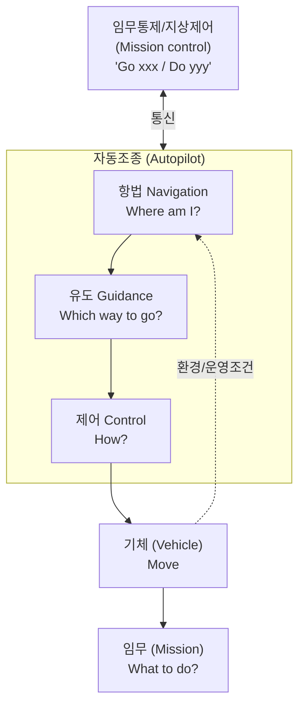
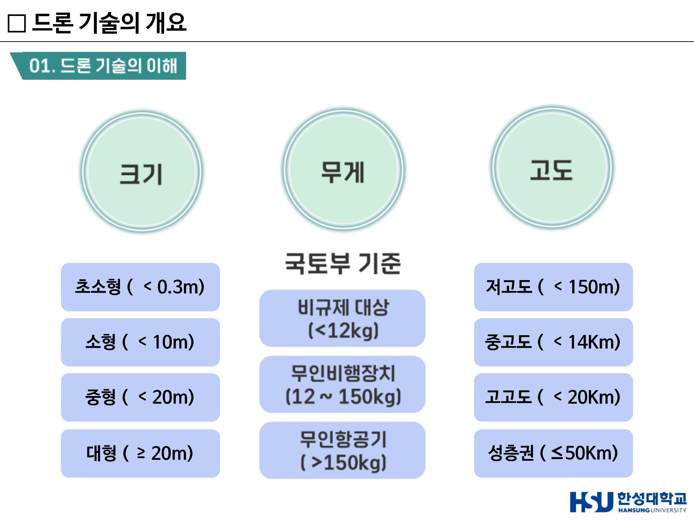
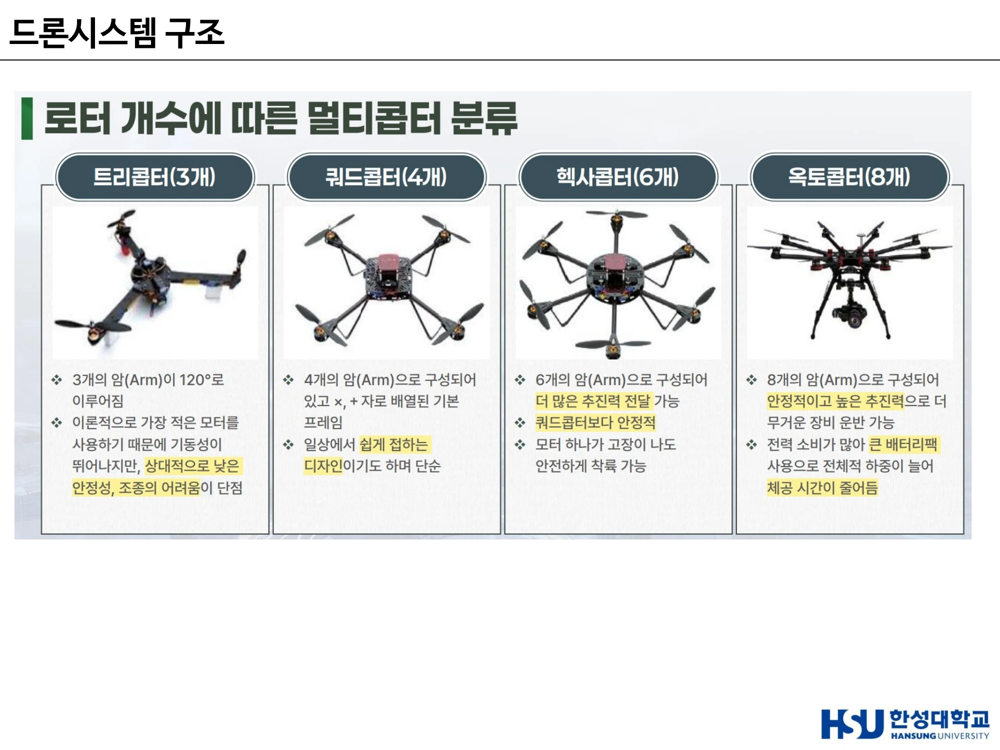
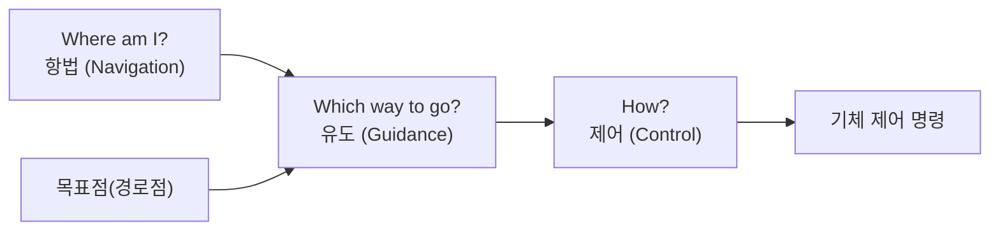
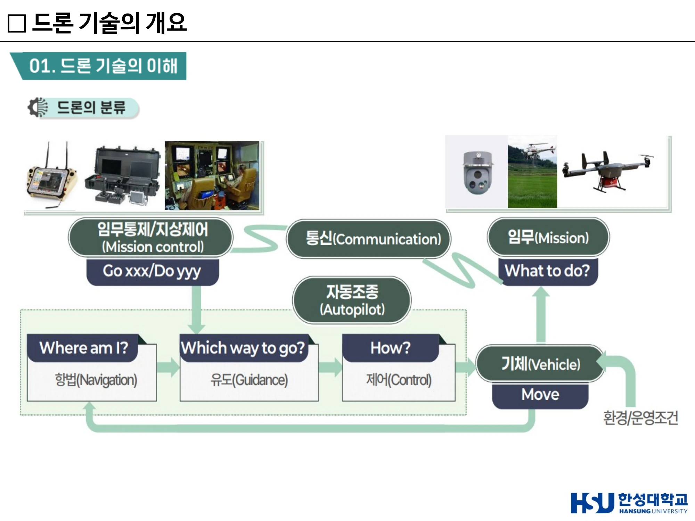
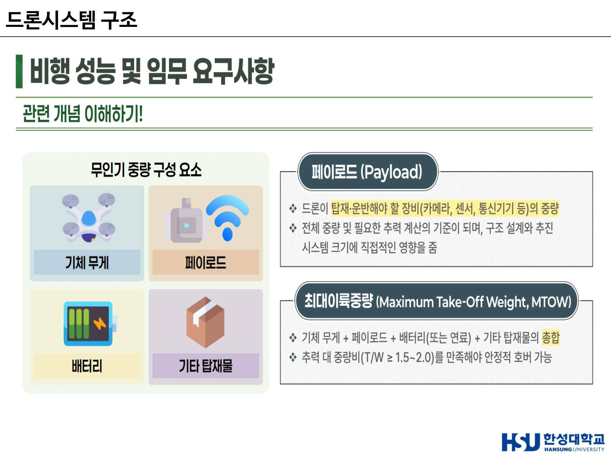

# 9주차 · 드론 개념·분류·시스템 구조

> 🔗 **강의 흐름** — 파트 2의 시작. 자율주행에서 배운 **인지–판단–제어**가 하늘에서는 **항법–유도–제어**라는 이름으로 다시 나타난다. 무대가 바뀌어도 질문은 같다.

> **학습목표** — 드론 관련 용어(UAV·UAS·RPAS·무인비행장치)를 구분해 정의하고, 운용주체·형태·크기·무게·고도별 분류 기준을 설명하며, 드론 시스템의 구성과 비행 제어 흐름을 서술할 수 있다.

> 💡 **기초 다지기** — **"드론"은 원래 수벌이다.** 사전적으로는 윙윙거리며 날아다니는 수벌을 뜻했는데, 최근에는 **무인항공기를 통칭**하는 용어로 주로 사용된다. 중요한 것은, 우리가 "드론"이라 부를 때 실제로는 **기체 하나가 아니라 시스템 전체(UAS)**를 가리킨다는 점이다.

## 🗺️ 한눈에 보는 개념도

## 1. 드론의 개념 — 용어 정리

| 용어 | 정의 |
|---|---|
| **UAV** (Unmanned Aerial Vehicle) | 조종자가 **탑승하지 않고** 전파의 유도에 의해 비행 및 조정이 가능하게 제작된 **장치** |
| **UAS** (Unmanned Aircraft System) | **기체만이 아닌** 항공기의 **안전성과 체계까지 포함**하는 개념 |
| **RPAS** (Remote Piloted Aircraft System) | 무선조종 항공기 시스템. **ICAO 공식 용어** (RPA / RPAV / RPAS) |
| **OPV** (Optionally Piloted Vehicle) | 유인기 ↔ 무인기 전환이 가능한 기체 (예: 한국 육군 500MD ↔ 무인화된 500MD, 보잉 Little Bird, Joby S4) |

!!! success "핵심 문장"
    **"일반적으로 드론이라 함은 UAS를 의미한다."**

**ICAO** (International Civil Aviation Organization, 국제민간항공기구) — UN 산하의 전문기구로 국제 항공 운송에 필요한 원칙과 기술 및 안전에 대해 연구하며, 국제 항공 운항의 원칙과 기술을 체계화하고 안전하고 질서 있는 성장을 보장하기 위해 국제 항공 운송의 계획과 개발을 촉진한다.

### 기관·법령별 정의 비교

| 용어 | 정의 | 근거 |
|---|---|---|
| **무인비행장치** | 항공법·항공안전법에서 표현하는 용어로, 항공기에 사람이 탑승하지 않고 원격조정 또는 자율로 비행할 수 있는 이동체 | 국가기술표준원 / 항공안전법 |
| **무조종자항공기** | Pilotless Aircraft, 조종자 없이 비행할 수 있는 항공기 | 국제민간항공협약 8조(CICA) |
| **무인기시스템** | 조종자가 비행체에 직접 탑승하지 않고 지상에서 원격조종, 사전 프로그램 경로에 따라 자동 또는 반자동 형식으로 자율비행하거나 인공지능을 탑재하여 자체 환경판단에 따라 임무를 수행하는 **비행체와 지상통제장비 및 통신장비, 지원장비 등의 전체 시스템**을 통칭 | 한국드론산업진흥협회 |
| **무인항공기** | 실제 조종자가 직접 탑승하지 않고, 지상에서 사전 프로그램된 경로에 따라 자동 또는 반자동으로 비행하는 비행체, 탑재임무장비, 지상통제장비, 통신장비, 지원장비 및 운용인력의 **전체 시스템(System)**을 통칭 | 위키백과 |
| **드론 (드론법)** | 조종자가 탑승하지 아니한 상태로 항행할 수 있는 비행체로서 **국토교통부령으로 정하는 기준을 충족**하는 기기. **2020년부터 '드론법'에 정의**를 내림으로써 공식적으로 사용 | 드론 활용의 촉진 및 기반조성에 관한 법률 |

## 2. 드론의 분류

### ① 운용주체별

| 군사용 | 민수용 |
|---|---|
| 정찰용 · 수송용 · 공격용 | 촬영용 · 운송용 · 농업용 · 취미용 |

### ② 형태별

| 형태 | 특징 | 장점 | 단점 |
|---|---|---|---|
| **고정익 (Fixed wing)** | 기체에 수평으로 붙어 있는 **고정된 날개로 양력** 발생(비행기 형태) | 오랜 시간 비행 가능 / 고고도 비행 가능 / 넓은 지역 촬영 / 빠른 속도 / 고효율 | **활주로 필요**(수직 이착륙 불가) / **호버링 불가** |
| **회전익 (Rotor wing)** | 회전 축에 설치된 **로터가 회전하면서 양력** 발생(헬리콥터 형태) | **수직 이착륙(VTOL)** 가능(활주로 불필요) / 자유로운 방향 전환 / **호버링** → 영상 촬영에 가장 적합 | 고고도 비행 불가 / 느린 속도 / 단거리 비행(**평균 5~30분**) / 저효율 |
| **하이브리드 (형상)** | 고정익과 회전익의 장점을 결합 | 긴 항속 거리 / 빠른 운항 속도 / 고고도 비행 / 수직 이착륙 | **복잡한 장치 / 고비용 / 높은 기술 요구** |
| **하이브리드 (추진)** | **두 가지 이상의 동력원** 사용 — 엔진(연료)과 전기배터리를 함께 사용 | 연료 효율 개선, 긴 항속거리 | 추가 중량, 기술적 복잡성 |

**하이브리드(형상) 4종 세부**

| 종류 | 설명 |
|---|---|
| **틸트로터** (Tilt-rotor) | 프로펠러와 **나셀만 회전**하여 수직에서 수평 추력 전환 |
| **틸트윙** (Tilt-wing) | **날개 자체가 회전**·전환 시 간섭, **실속 관리가 어려움** |
| **리프트+크루즈** (Quadplane) | **수직용 로터와 순항용 추진기를 분리** |
| **테일시터** (Tailsitter) | 기체 자세를 세워/눕혀 전환 |

> ※ 하이브리드(Hybrid) = 두 가지 이상의 요소나 기능의 결합 / 틸트로터(Tilt Rotor) = 회전날개(Rotor)를 기울일(Tilt) 수 있는 형태
> ※ VTOL = Vertical Take-Off and Landing / Hovering = 제자리에서 정지 비행

### ③ 크기·무게·고도별

| 크기 | 무게 (국토부 기준) | 고도 |
|---|---|---|
| 초소형 ( < 0.3m) | **비규제 대상** ( <12kg) | 저고도 ( < 150m) |
| 소형 ( < 10m) | **무인비행장치** (12~150kg) | 중고도 ( < 14km) |
| 중형 ( < 20m) | **무인항공기** ( >150kg) | 고고도 ( < 20km) |
| 대형 ( ≥ 20m) | | 성층권 ( ≤ 50km) |

!!! warning "무게 경계 12kg / 150kg"
    **12kg**과 **150kg**은 비규제 대상 · 무인비행장치 · 무인항공기를 가르는 규제 경계다.

### ④ 로터 개수에 따른 멀티콥터 분류

| 종류 | 특징 |
|---|---|
| **트리콥터 (3개)** | 3개의 암(Arm)이 120°로 이루어짐. 이론적으로 가장 적은 모터를 사용해 **기동성이 뛰어나지만**, 상대적으로 **낮은 안정성·조종의 어려움**이 단점 |
| **쿼드콥터 (4개)** | 4개의 암, ×자·+자 배열의 **기본 프레임**. 일상에서 쉽게 접하는 디자인이며 단순 |
| **헥사콥터 (6개)** | 6개의 암. **더 많은 추진력** 전달 가능, **쿼드콥터보다 안정적**. **모터 하나가 고장 나도 안전하게 착륙 가능** |
| **옥토콥터 (8개)** | 8개의 암. **안정적이고 높은 추진력**으로 더 무거운 장비 운반 가능. 단, **전력 소비가 많아 큰 배터리팩** 사용으로 전체적 하중이 늘어 **체공 시간이 줄어듦** |

> ▲ 크기·무게(국토부 기준)·고도별 드론 분류 — 12kg / 150kg이 규제가 갈리는 경계 *(출처: 9주차 슬라이드 p12)*

> ▲ 로터 개수에 따른 멀티콥터 분류 — 트라이(3) / 쿼드(4) / 헥사(6) / 옥토(8) *(출처: 9주차 슬라이드(덱 14) p7)*

### 항공안전법상의 위치

법령에서 "드론"은 두 갈래로 규정된다.

| 근거 | 대상 |
|---|---|
| **항공안전법 제2조 제3호** | **무인비행장치** — 무인동력비행장치, 무인비행선 |
| **항공안전법 제2조 제6호** | **무인항공기** — 사람이 탑승하지 않고 원격 조종 등의 방법으로 비행하는 항공기 |

여기에 더해 원격·자동·자율 등으로 항행할 수 있는 비행체가 폭넓게 포함된다.

!!! success "드론 vs 드론시스템"
    **드론** = 조종자가 탑승하지 아니한 상태로 항행할 수 있는 비행체.
    **드론시스템** = 그 운용이 유기적·체계적으로 이루어지기 위한 체계 전체 — **드론 + 통신체계 + 지상통제국 + 항행관리 및 지원체계**.
    9주차 첫머리에서 "드론이라 하면 사실상 UAS를 뜻한다"고 한 것과 같은 이야기다.

### 드론의 구성요소 3부

| 구성 | 내용 |
|---|---|
| **기체부** | 비행체 프레임, 추진시스템(모터·프로펠러·배터리) |
| **비행제어 시스템**(FCS) | 자세·위치·속도·경로를 안정적으로 제어하고 자동·자율 비행을 가능하게 하는 핵심 시스템. GPS, IMU, 제어보드, 통신시스템 |
| **탑재체**(Payload) | 카메라, 센서, 화물 |

## 3. 드론의 기술 스택 5요소

| 요소 | 세부 기술 |
|---|---|
| **모터 / 배터리** | BLDC · 연료전지 · 차세대전지 |
| **프로펠러 / 프레임** | 탄소재료 · 3D프린팅 · 최적화설계 |
| **탑재컴퓨터** | 경량 HPC · SW · **AI(자율지능)** |
| **항법센서** | 위성항법 · MEMS · 임베디드SW |
| **통신** | **5G** · 네트워크 · 디지털보안 |

### 비행제어 컴퓨터(FC) 구조 예 — Pixhawk FMUv6X

| 계층 | 구성 |
|---|---|
| **IMU** | IMU 1·2, Mag 1, Baro 1, Heating, IMU BOARD ID EEPROM |
| **FMUM** | IMU 3, Baro 2, **FMU = STM32H753 (2MB Flash / 1MB RAM)**, NXP SE050 Secure Element, Micro-SD, FRAM, Sensors Power |
| **Base** | Power 1·2 & I2C, Power Path Selector, Power Protection, **IO = STM32F103 (64KB Flash / 20KB RAM)**, Telem 1·2, 100Base-T, SPI, CAN 1·2, GPS 1·2, SBUS Out, DSM/SBUS, UART/I2C, ADIO, IO PWM, FMU PWM |

!!! tip "왜 MCU가 두 개인가"
    **FMU**(고성능, STM32H7)가 비행 제어 연산을, **IO**(STM32F1)가 입출력과 안전 백업을 담당한다. 고성능 계산이 멈춰도 IO가 최소한의 안전 동작을 유지하는 **이중화** 설계다. IMU도 3중, Baro도 2중으로 둔다.
    → 3학년 [모빌리티 전자제어유닛 실습](/courses/202602/mobility-ecu/)에서 STM32를 직접 다루게 된다.

## 4. 비행 제어 흐름 — 항법·유도·제어

**기능** — **안정한 비행 상태를 유지**하며 원하는(수직·수평) 방향과 빠르기로 **속도를 변환**시킬 수 있으며, 현재 위치와 목표점 사이의 차이를 줄이는 방식으로 **점진적으로 목표점으로 비행**한다.

**구성** — 비행제어 컴퓨터, 항법 센서, 자세 센서, **제어 작동기**(고정익은 **조종면**, 회전익은 **로터 추력 조절**)

**자세 3축** — Roll(에일러론) / Pitch(엘리베이터) / Yaw(러더)

!!! note "자율주행과 대응시켜 보기"
    | 자율주행 | 드론 |
    |---|---|
    | LOCALIZE (현재 위치) | **항법 Navigation** |
    | PLAN (경로 생성) | **유도 Guidance** |
    | CONTROL (조향·제동·가속) | **제어 Control** |
    같은 3단 구조다. 무대만 다르다.

> ▲ 임무통제/지상제어 ↔ 자동조종(항법 Where am I? → 유도 Which way to go? → 제어 How?) ↔ 기체 *(출처: 9주차 슬라이드 p20)*

## 5. 드론 구조 설계가 중요한 이유

| 축 | 이유 |
|---|---|
| **안전 (Safety)** | 비행 중 최대 하중·충격에도 **파손 없이 견디는 골격**이 중요 |
| **성능 (Performance)** | **경량화**와 **공력/하중 경로 최적화**가 **체공시간·페이로드**를 좌우 |
| **제어 안정성 (Control Stability)** | **강성·고유진동수**를 고려한 설계로 흔들림·진동 억제 |
| **내구·신뢰성 (Durability/Reliability)** | 피로·환경(온도/습기/먼지) 등을 고려해 수명 보장 |
| **정비성·모듈성 (Maintainability)** | 현장 교체·수리가 쉬운 구조가 가동률을 높임 |
| **규제·안전여유 (Compliance & FoS)** | **Factor of Safety**를 만족하며 법·표준 요구를 충족해야 함 |

→ 상세 설계는 [11주차](week11.md)에서 다룬다.

## 6. 비행 성능 및 임무 요구사항

### 페이로드·최대이륙중량 (Payload & MTOW)

- 필요한 **추력·크기·구조 용량**을 올바르게 산정
- 임무 장비 + 하중을 포함한 **총중량**을 정해 **T/W(추력/중량비) 목표**를 설정
- **모터·프로펠러 선택, 착륙장치/프레임 강도**에 직접 영향

| 개념 | 정의 |
|---|---|
| **페이로드 (Payload)** | 드론이 탑재·운반해야 할 장비(카메라, 센서, 통신기기 등)의 **중량**. 전체 중량 및 필요한 추력 계산의 기준이 되며, 구조 설계와 추진 시스템 크기에 직접적인 영향을 줌 |
| **최대이륙중량 (MTOW)** | **기체 무게 + 페이로드 + 배터리(또는 연료) + 기타 탑재물의 총합**. **추력 대 중량비(T/W ≥ 1.5~2.0)**를 만족해야 안정적 호버 가능 |

> 무인기 중량 구성요소 = 기체 무게 · 페이로드 · 배터리 · 기타 탑재물

### 비행 시간·거리 (Flight Time & Range)

- 임무가 요구하는 **체공시간·항속거리** 달성
- **에너지 예산**(배터리/연료)과 **평균전력 프로파일**(호버·순항·체공)을 맞춤
- **양항비 L/D** 향상과 경량화로 전력소모 감소

### 운용 환경 (Operating Environment)

- 목표 환경에서의 **신뢰성·가용성** 확보
- 비·바람·온도·먼지/염분·**EMI**를 반영해 **방수/방진(IP)**, 제빙·냉각, 진동·충격 대비

> ▲ 페이로드와 최대이륙중량(MTOW) — 기체 무게 + 페이로드 + 배터리 + 기타, T/W ≥ 1.5~2.0 *(출처: 9주차 슬라이드(덱 14) p10)*

## 7. 드론의 역할 — 무엇을 할 수 있는가

취미용 장난감(오락기구) / 지상에서 찍기 어려운 부분 촬영 / 정찰·모니터·감시 / 운송·운반

!!! quote "이 주차의 핵심 문장"
    **"드론으로 무엇을 할까를 결정하는 게 중요!"**
    드론의 기체는 동일하지만, 드론이 장착하는 **임무 장비는 각각 사용하는 목적에 따라서 달라진다.**
    **"드론은 매우 많은 일들을 할 수 있다. AI가 결합되면 더 많은 일들을 할 수 있다."**

**드론 생태계 키워드 맵** — 탐지 · 식별 · 안티드론 · 드론 아키텍트 · 드론 리터러시 · 데이터 번역가 · 센서/SW · AI, IR · 빅데이터 · 5G · UTM/UASTM · 초연결 드론 · 실증 · 하늘길 · 치매노인 · 날다 · 찍다 · 운반하다 · 지키다

## 🤔 생각해 봅시다

1. 촬영용 드론과 물류 배송용 드론은 형태(고정익/회전익/하이브리드)를 어떻게 선택해야 하는가? 선택의 근거를 함께 제시하시오.
2. 헥사콥터는 "모터 하나가 고장 나도 착륙 가능"하다. 쿼드콥터는 왜 그렇지 못한가? 안전 관점에서 로터 수가 갖는 의미를 설명하시오.
3. FC에 IMU를 3개 두는 것은 비용 낭비인가? 항공 안전에서 **이중화(redundancy)** 원칙을 근거로 설명하시오.

## ✅ 이번 주 체크리스트

- [ ] UAV / UAS / RPAS를 구분해 정의하고, "드론 = UAS"임을 안다
- [ ] RPAS가 **ICAO 공식 용어**임을 안다
- [ ] 크기·무게(12kg/150kg)·고도 분류 기준을 안다
- [ ] 고정익·회전익·하이브리드의 장단점을 표로 쓸 수 있다
- [ ] 로터 수별(3/4/6/8) 특성과 옥토콥터의 체공시간 단점을 안다
- [ ] 항법–유도–제어 3단계를 질문 형태("Where am I?")로 말할 수 있다
- [ ] MTOW 구성과 T/W ≥ 1.5~2.0을 안다

---

▶️ **다음 주 예고** — 드론이 **산업**이 되는 지점을 본다. 국내외 생태계 지도, ETRI의 DNA+드론 플랫폼, 그리고 드론을 막는 기술인 **대드론(Counter-UAS)**. → [10주차](week10.md)
