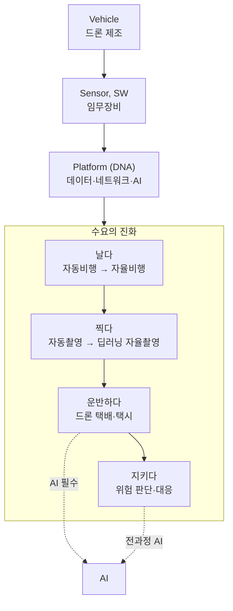
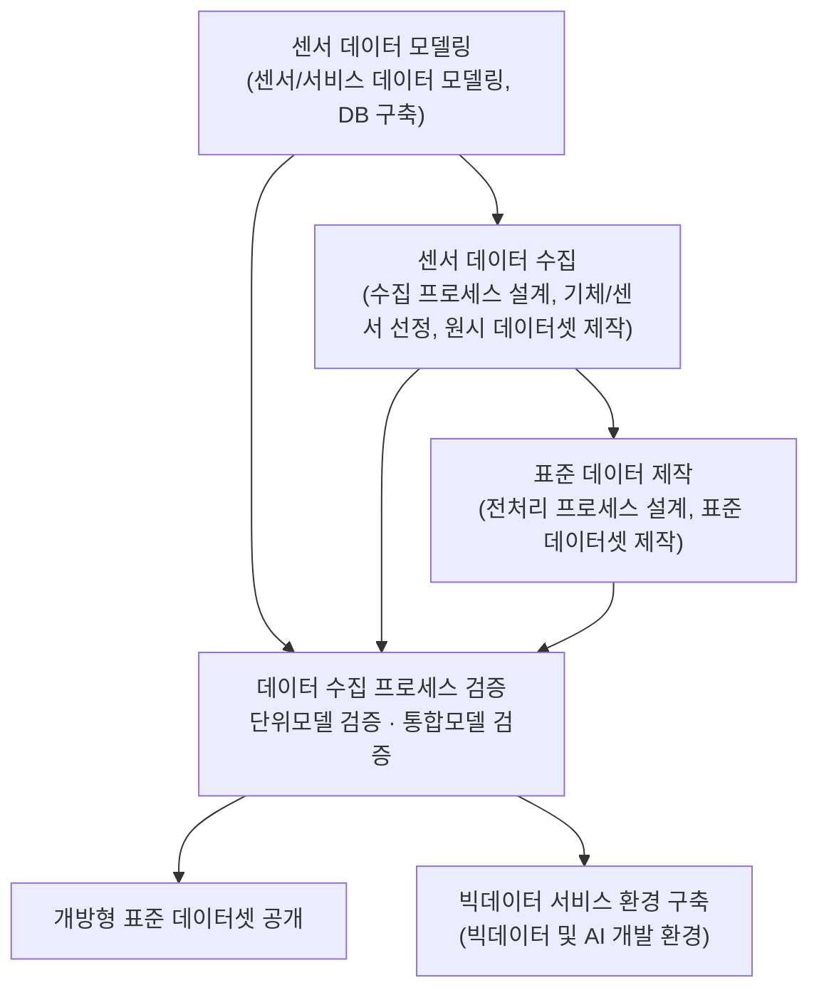
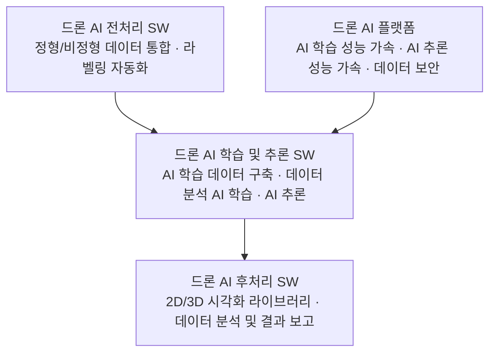
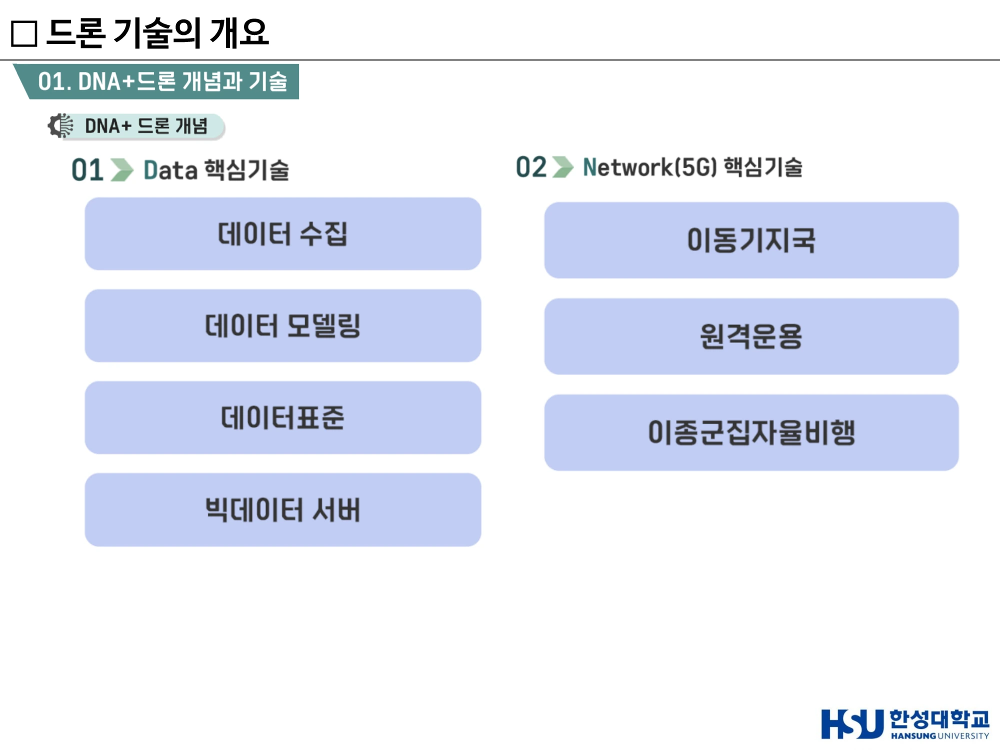
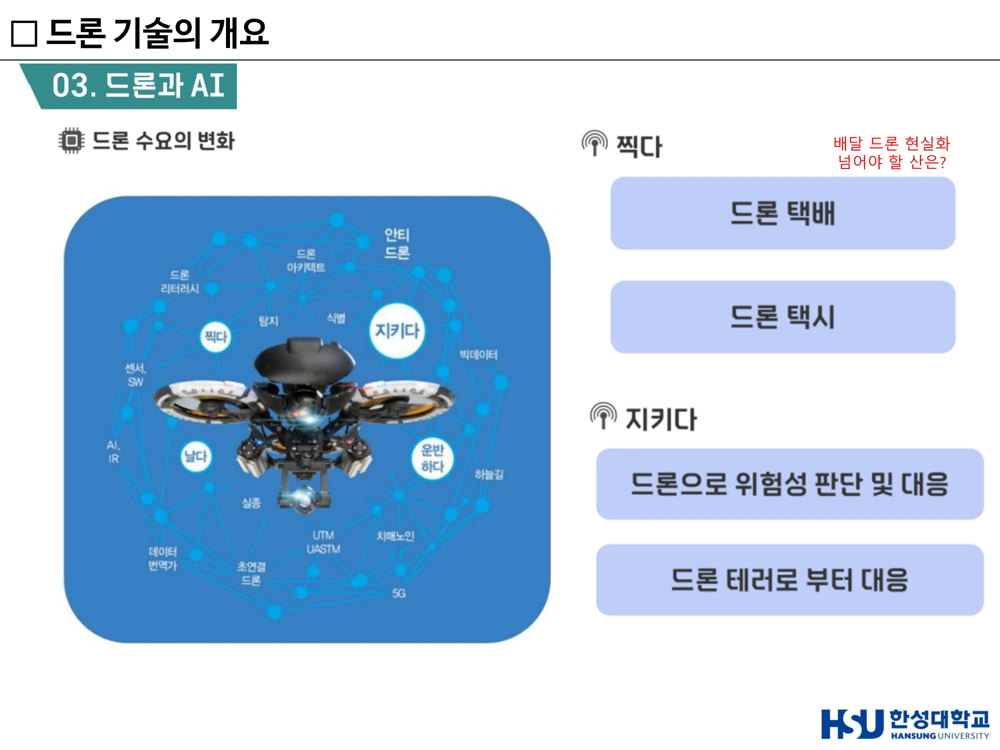
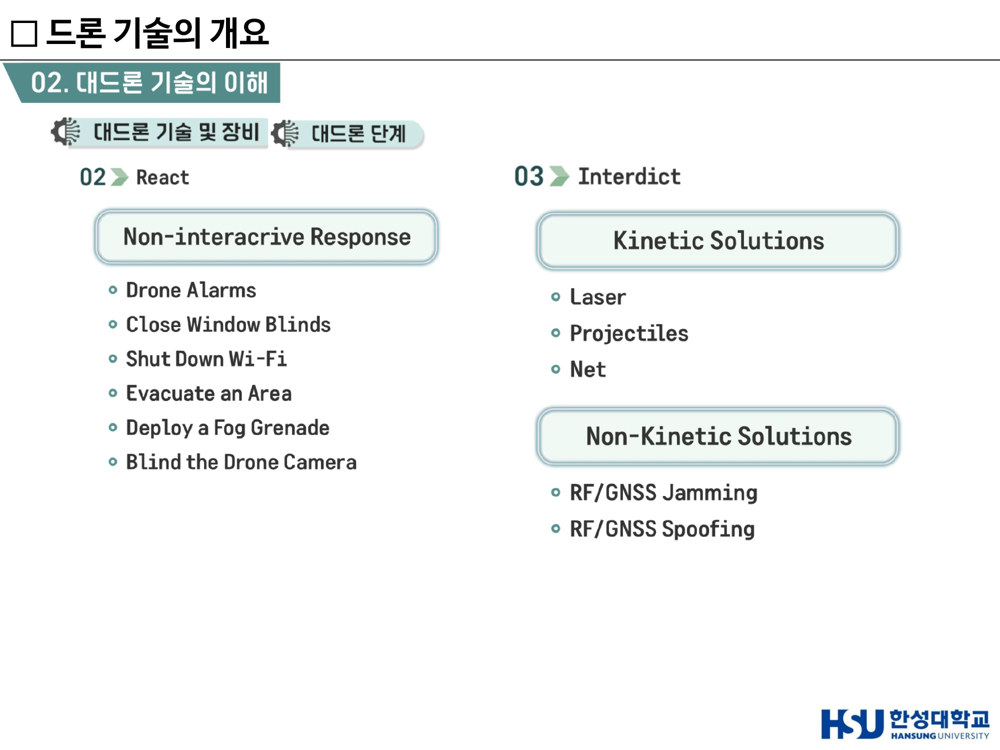
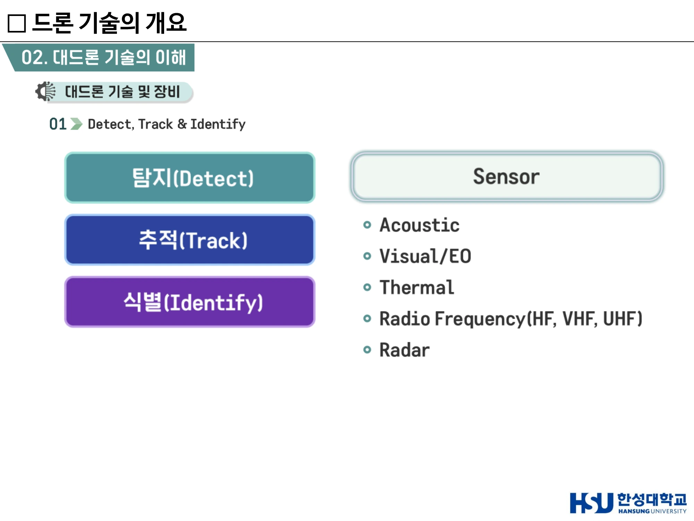

# 10주차 · 드론 생태계·DNA+드론·대드론

> 🔗 **강의 흐름** — 9주차에서 드론이 무엇인지 봤다. 이번 주는 그것이 **산업**과 **제도**가 되는 과정이다. 그리고 기술이 성숙하면 반드시 따라오는 문제 — **나쁜 드론을 어떻게 막을 것인가**.

> **학습목표** — 국내 드론 산업 생태계와 주요 국책 사업을 설명하고, DNA+드론 플랫폼의 구성요소를 서술하며, 드론 수요의 진화 단계와 관련 법률을 설명하고, 대드론 기술의 단계별 절차를 설명할 수 있다.

> 💡 **기초 다지기** — **드론 산업은 기체를 파는 산업이 아니다.** 기체(Vehicle) 위에 센서와 소프트웨어(Sensor/SW)가 얹히고, 그 위에 데이터·네트워크·AI 플랫폼(DNA)이 얹힌다. 돈은 점점 **위쪽**에서 벌린다.

## 🗺️ 한눈에 보는 개념도

## 1. 국내 드론 제조 현황과 국책 사업

### ① 한국항공우주연구원(KARI) — 성층권드론기술개발사업단

**성층권 태양광 드론 (EAV-4)**

| 항목 | 사양 |
|---|---|
| 크기 | 날개길이 **30m급** |
| 운용고도 | **12km ~ 18km** |
| 체공기간 | **30일 이상** |
| 동력원 | 태양전지 + 배터리 |
| 임무장비 | 기상관측, EO/IR 등 **20kg 탑재 가능** |
| 운용거리 | **500km 내외** |

> 성층권 태양광 드론은 **상시 재난 감시용**으로, 성층권에서 20kg 이상 임무 장비를 탑재하고 태양광 에너지와 배터리를 사용해 30일 이상 장기 체공할 수 있는 **친환경 드론**이다. 성층권 드론은 대기가 안정한 성층권에서 장기간 체공할 수 있어 **저궤도위성과는 달리 상시 감시가 가능**하여 기존 관측 체계의 한계를 보완할 수 있다. 또한 태양광 드론으로 운용 및 유지비용이 낮고, 최근 이슈가 되고 있는 **우주 쓰레기 문제도 발생하지 않는다.**

| 주요 성능 | 해외 실적 | 해외 목표 | 국내 실적 | 국내 목표 |
|---|---:|---:|---:|---:|
| 체공시간 | 26일 | 수개월 | 53시간 | **30일 이상** |
| 임무장비 | 5kg 이내 | 20kg | 2kg | **20kg** |

> 국내 드론 사양 비교 — 날개길이 기존 20m → 개발 **30m**, 중량 66kg → **150kg**

### ② 한국전자통신연구원(ETRI) — DNA+드론기술개발사업단

- **D**(Data): DNA+드론서비스를 위한 드론센서 데이터 표준화 및 정합 기술 제공
- **N**(Network): **5G 원격군집자율 운용** 및 실시간 데이터 전송을 지원하는 **이음 5G 드론시스템** 구축
- **A**(AI): 군집 드론 및 대용량 임무데이터의 **실시간 AI 처리와 운용**을 지원하는 AI 플랫폼 제공

### ③ 한국원자력연구원(KAERI) — 불법드론 지능형 대응기술개발 사업단

- 드론과 데이터, 불법드론 **탐지·식별·추적·무력화·사고조사**를 하나로 통합
- 불법드론 위협에 대비하여 안전을 확보하는 **드론캅** 및 포렌식 기술 기반의 지능형 대응 시스템 **IGAAD**(Integrated Ground and Airborne Anti Drone system)
- **순찰드론캅**은 공중기반 안티드론 시스템으로, 여기에 사용되는 **'드론 라이브포렌식' 기술**은 불법드론이 **비행 중일 때에도 비행정보·촬영영상·조종자 위치 등 정보를 파악 가능한 세계 최초의 원천기술**이다

**순찰 드론캅 사양** — 형태: Lift & Cruise / 크기: Wing Size 4m급 / 중량: 50kg 이하 / 비행거리: 255km / 항속시간: 최대 3시간(영상장비 장착)

## 2. DNA+드론 플랫폼 상세

!!! success "정의"
    **DNA+드론 = 드론 + DNA (Data · Network(5G) · AI)**
    **5G 네트워크를 기반으로 비가시권 자율비행 원격운용을 가능하게 하고, 수집된 드론 Data를 AI 학습을 통하여 실시간 데이터처리 기반 활용 서비스를 창출하는 것**을 말함.
    **드론 플랫폼 구축사업** — 과기정통부, **2020년 ~ 2025년, 473억**

### 핵심기술 4영역

| 영역 | 핵심기술 |
|---|---|
| **01 Data** | 데이터 수집 · 데이터 모델링 · 데이터표준 · 빅데이터 서버 |
| **02 Network(5G)** | 이동기지국 · 원격운용 · **이종군집자율비행** |
| **03 AI** | 전처리 · 학습 및 추론 · **자율비행(회피)** · AI 플랫폼 |
| **04 개방형 워크스페이스** | 빅데이터 서버 · AI 학습 추론서버 · **개방형 API** |

### D — 데이터 파이프라인

**데이터 분야** — 경찰 · 구조물 · 농업 · 공통 · 수자원

### N — 네트워크 구성요소

5G 통신 장치(5G 통신 모듈, 5G 영상 수신 모듈) / 임무관리시스템(임무계획, 임무 감시분석, 임무데이터 관리) / 자율비행 기술(**이종 군집 자율비행**, **비가시권 자율비행**) / 이동 관제국(이동형 통합관제플랫폼, 충전·격납·이착륙) / 드론운용시스템(드론 자원관리, 운용관리, 외부 인터페이스) / 임무 관리 기술(실시간 임무관리, 이상상황 대응 임무 재설정) / 이동 기지국(**저지연 보장**, 3차원 셀 지원, 네트워크 연동) / 3차원 조종기 / 드론시뮬레이터

### A — AI 구성요소

### 이동형 이음5G DNA+드론 플랫폼

- 공중지향 이음5G 이동기지국 / 업링크 상향(**70% 비중**) / 기지국에 클라우드 전진 배치
- **20대 군집 자율비행**, 드론 데이터별 QoS, 4K 동영상/정지영상 실시간 전송, 5G MEC 연동
- 목표 — **골든타임 내, 수색 음영지역 없이, 5분 이내 AI 기반 실시간 분석**

### 플랫폼 공개 과정

**DNA+ 드론 워크스페이스**를 중심으로 국가슈퍼컴퓨팅센터(KISTI, Online High-Performance) — Replica System(ETRI, BigData & Dev. Infra) — 표준 데이터셋(ETRI 나눔, 대국민 개방형 표준데이터셋 공개) — DNA+ 드론 데이터/서비스 챌린지(과제 종료 후 민간 이양, AI 챌린지·드론 챌린지 등 각종 경진대회와 협력).

> ▲ DNA+드론 핵심기술 — 01 Data(수집·모델링·표준·빅데이터 서버) / 02 Network 5G(이동기지국·원격운용·이종군집자율비행) *(출처: 10주차 슬라이드 p5)*

## 3. 국내외 드론 생태계

### 국내 드론 산업 생태계 지도 (2023.02 기준, 국토교통부·KIAST·드론정보포털)

감시·정찰·수색·인프라관리 / 취미·교육 / 기관 / 통합솔루션 / 임무장비 / 다목적 H/W / 방역·방제·살포 / 안티드론 / 지상통제장비 / 환경측정 / 방송·공연 / 드론스테이션 / 모듈 / 앱 / 공간정보·특수촬영 / 물류·운송·구조 / 유통

→ **기관** 항목에 **한성대학교**가 포함되어 있다.

### 해외 생태계 (Drone Industry Insights)

**Hardware / Software / Service** 3분류. Hardware는 Drone Platforms(Agriculture, Delivery & Cargo, Safety & Security, Fixed-Wing, VTOL Fixed-wing, Recreational, Passenger drones & eVTOLs, Counter-Drone Solutions), Components & Systems(Cameras/Imaging, Navigation·Positioning·Guidance, Propulsion & Power, Communication, Launch and Recovery, Drone Base Stations & Charging Pads) 등.

**CB Insights — Drones Market Map: 70+ Companies** — Manufacturers(EHANG, HOVER, GET, Hexo+, YUNEEC, DJI, Prioria, UVify, TEAL, FLYPRO), Terrestrial Imagery & Mapping, Precision Agriculture, Inspection & Monitoring, Delivery & Transport(Flirtey, Flytrex, NATILUS, STARSHIP, Matternet, zipline), Navigation & Autonomy, Airspace Management(UNIFLY, KITTYHAWK.IO, vHive, AIRMAP), Military & Defense, Insurance Providers.

### KIAST 항공안전기술원 — 드론 8대 활용 분야

1. 물품수송 2. **산림보호 및 재해 감시** 3. 시설물 안전 진단 4. 국토조사 및 순찰 5. 해안 및 접경 지역 관리 6. 통신망 활용 무인기 제어 7. 촬영·레저 8. 농업지원

!!! danger "시험 포인트 (기말 1번)"
    **"산림 보호 및 재해 감시용 드론에 가장 적합한 센서 조합은?"**
    → **EO/IR 복합 센서 + 열화상 카메라**
    (EO = 가시광 전자광학, IR = 적외선. 주간 식별 + 야간·연기 속 열원 탐지를 함께 커버)

### 국내 주요 제조사 제품 예시

| 기업 | 모델 | 사양 |
|---|---|---|
| 메타로보틱스 | 반디-A10 | 총중량 24.9kg, 비행 25분, 임무반경 1km, 최대 임무중량 10kg, 배터리(Li-po) |
| 샘코 | RiverEye_FC | 총중량 38kg, 비행 1시간, 임무반경 10km, 최대 임무중량 7kg, **수소연료전지 + Lipo** |
| 성우엔지니어링 | REMO-H V3 | 총중량 110kg, 비행 40분, 임무반경 300m, 최대 임무중량 20kg, **35마력급 수냉식 로터리 엔진** |
| 숨비 | S-200 | 총중량 73.8kg, 비행 25분 내외, 임무반경 10km 이내, 최대 임무중량 30kg |
| KAI | UAV-II | 총중량 1,700kg, EO/IR·해상레이더 |
| 두산모빌리티이노베이션 | DS30 | 총중량 24.99kg, 비행 **2시간**, 임무면적 20만평, 최대 임무중량 5kg, **수소연료전지** |

## 4. 토마스 프레이 — 드론이 할 수 있는 192개의 일

**토마스 프레이(Thomas Frey)**는 구글이 선정한 최고의 미래학자이며, 미래연구소 **다빈치 인스티튜트**의 설립자다. 전 세계를 돌며 정부·글로벌 기업·리더들에게 미래 비전을 전파하고 있으며, **"발명의 아버지"**라는 별칭도 가지고 있다. 과거 IBM에서 15년간 근무하며 270회 이상의 포상을 받았고, Triple Nine Society(지능지수 상위 0.1%)의 전 회원이다. 대표 저서는 『에피파니 Z』와 『미래와의 대화』.

**24개 카테고리** — 조기경보시스템 · 긴급 서비스 · 뉴스 리포팅 · 배달 · 사업활동 모니터링 · 게임용 드론 · 스포츠 드론 · 엔터테인먼트 드론 · 마케팅 · 농업용 드론 · 목장용 드론 · 경찰 드론 · 스마트 홈 드론 · 부동산 드론 · 도서관 드론 · 군대 스파이 드론 · 건광관리 드론 · 교육용 드론 · 과학과 발견 · 여행용 드론 · 로봇 팔 드론 · 현실왜곡 영역 · 참신한 아이디어 드론 · 머나먼 개념의 드론

> **"미래에는 더 많은 일을 드론으로 할 수 있을 것"**

## 5. 드론 + AI — 수요의 진화

| 단계 | 변화 | AI |
|---|---|---|
| **날다** | 자동비행 → **자율비행** | |
| **찍다** | 자동 촬영 → **딥러닝을 통해 자율 촬영** | |
| **운반하다** | 드론 택배 · 드론 택시 | **AI 필수** |
| **지키다** | 드론으로 **위험성 판단 및 대응** / **드론 테러로부터 대응** | **AI 필수 (전과정 AI)** |

!!! danger "시험 포인트 (기말 3번)"
    **"드론 기술의 발전으로 인해 AI 적용이 필수적인 단계가 아닌 것은?"**
    → ① **비행(날다)** ② **영상 촬영(찍다)** ③ 자율 운항(운반하다) ④ 유지 관리(지키다)
    → 날다·찍다는 **자동화** 단계로도 가능하고, 운반·지키다부터 AI가 필수다.

**기술 플랫폼 흐름** — Vehicle → Sensor, SW → **Platform(DNA)**

**새로운 드론 개념** — 자율비행 + 안티드론 ← 빅데이터 + 5G
**DNA+DRONE = AI 결합 / UAM 도입 전단계 = AI & 5G 필수**

### 드론 연구의 증가 — 두 갈래

| 초점 | 내용 |
|---|---|
| **필요성에 초점을 둔 연구** | 상업성 / 실생활 사용 여부 |
| **법률적 규제의 필요성** 관련 연구 | 사생활 침해 / 개인정보 침해 / 인권 침해 |

**연구 확장 영역** — AI / **안티드론** / Platform
→ 드론의 필요성 / 드론의 규제 / 플랫폼 / 드론과 AI / 기타 드론과 대드론에 대한 연구

> ▲ 드론 수요의 변화 — 날다 · 찍다 · 운반하다(드론 택배·택시) · 지키다(위험성 판단·드론 테러 대응) *(출처: 10주차 슬라이드 p17)*

## 6. 법률의 변화

| 법률 | 내용 |
|---|---|
| **자율주행차법** | 자율주행차 상용화 촉진 및 지원에 관한 법률 |
| **드론법** | **드론 활용 촉진 및 기반조성에 관한 법률** |
| **스마트도시법** | 스마트도시 조성 및 산업진흥 등에 관한 법률 |
| **행정규제기본법** | **규제 샌드박스(특례)**, 신산업 우선 허용 |
| **UTM** | 2021년(**한국 2023년**), 미국·일본·싱가폴·중국 진행 중 |

!!! danger "시험 포인트 (기말 6번)"
    **"자율주행 및 드론 산업의 확산에 따라 제정된 국내 법률의 공통된 목적은?"**
    → **새로운 산업의 창출과 활용 촉진을 위한 제도적 기반 마련**

## 7. 드론 기술 발전 방향

| 계층 | 세부 기술 |
|---|---|
| **드론제조 (Vehicle)** | UAV, UAS (기체, 통신) |
| **임무장비 (Sensor/SW)** | SENSOR, SW ← **AI** |
| **이동서비스 (택배, UAM)** | PAV, UAM(택시드론), RAM, AAM ← **AI** |
| **관제서비스 (AI, 5G, UTM)** | UTM(하늘길, SKYWAY) · 공간정보(디지털트윈) · 관제센터(군집비행, SWARM) · 빅데이터(딥러닝) · 소재(그래핀) · 동력원(수소전지원료, 양자배열) ← **Data** |
| | **대드론 (COUNTER-UAS)** |

**개념의 계보** — UAV → UAS → DNA+DRONE → DNA+DRONES → DNA+DRONE PLATFORM → **UAM**

!!! danger "시험 포인트 (기말 4·7번)"
    - **"플랫폼 기반 드론 연구의 핵심 요소가 아닌 것"** → **고정익 기체의 날개 형상 해석** (이는 기체 설계 영역)
    - **"드론 연구가 확장되고 있는 무인 이동체 기술 영역으로 보기 어려운 것"** → **정밀 타격을 위한 미사일 운용 체계 도입 연구**

## 8. 대드론 (Counter-UAS)

!!! success "정의"
    **대드론(Counter UAS) = 드론의 불법적인 사용을 예방하고 방어하기 위한 일련의 활동**

| 착한 드론 | 나쁜 드론 |
|---|---|
| 찍다 · 지키다 · 날다 · 운반하다 | 불법 촬영 · 드론 테러 · 불법 비행 · 불법적인 물건 운반 |

### 대드론 3단계

#### ① Detect · Track · Identify (DTI)

| 단계 | 내용 |
|---|---|
| **탐지(Detect)** | 드론의 존재 여부를 최초로 감지 — 비행체 접근 여부 탐지, 이상 신호 및 움직임 감지, 광역 감시 |
| **추적(Track)** | 탐지된 드론의 위치와 이동 경로를 지속 추적 — 실시간 위치 추적, 속도·방향 분석, **다중 객체 추적(Multi-Target Tracking)** |
| **식별(Identify)** | 탐지·추적된 대상의 종류와 위협 수준 분석 — 드론/비드론 구분, 기종 및 신호 분석, 위협도 판단 및 대응 연계 |

**활용 센서**

| 센서 | 원리 |
|---|---|
| **Acoustic** | 드론 프로펠러 및 모터 **소리** 기반 음향 탐지 |
| **Visual / EO** (Electro-Optical) | **가시광 카메라** 기반 영상 탐지 — RGB 카메라, 광학 줌 카메라, 고해상도 영상 센서 |
| **Thermal** | **열화상** 기반 야간·저시야 탐지 |
| **Radio Frequency** (HF/VHF/UHF) | 드론–조종기 간 **RF 통신 신호** 분석 |
| **Radar** | **전파 반사**를 이용한 거리·속도·방향 탐지 |

#### ② React — Non-interactive Response (비접촉형 대응)

드론 위협 발생 시 직접적인 물리 충돌 없이 피해를 최소화하기 위한 **초기 대응** 단계.

- **Drone Alarms** — 드론 침입 경보 발생
- **Close Window Blinds** — 창문 및 차폐 장치 폐쇄
- **Shut Down Wi-Fi** — 무선 네트워크 차단
- **Evacuate an Area** — 위험 지역 대피
- **Deploy a Fog Grenade** — 연막/시야 차단 장비 운용
- **Blind the Drone Camera** — 레이저·광학장치 기반 카메라 무력화

> ▲ 대드론 2·3단계 — React(비접촉형 대응)와 Interdict(Kinetic / Non-Kinetic 무력화) *(출처: 10주차 슬라이드(덱 16) p7)*

#### ③ Interdict — 무력화

| 구분 | 기술 |
|---|---|
| **Kinetic Solutions** (물리적 무력화) | **Laser**(고에너지 레이저 기반 파괴) · **Projectiles**(탄환·요격체) · **Net**(그물 포획) |
| **Non-Kinetic Solutions** (비물리적 무력화) | **RF/GNSS Jamming**(무선통신 및 위성항법 신호 교란) · **RF/GNSS Spoofing**(가짜 위치·제어 신호 송출을 통한 기만) |

!!! quote "발표용 요약 문장"
    **"대드론 시스템은 Detect–Track–Identify(DTI) 절차를 기반으로 드론을 탐지하고, 이동 경로를 추적하며, 최종적으로 위협 여부를 식별하는 통합 감시 체계이다. 이후 비접촉형 대응(React)과 물리·비물리 기반 무력화(Interdict) 단계를 통해 드론 위협에 대응한다."**

### 장비 구성의 단계적 확장 (KU1000 계열 예)

| 구성 | 기능 |
|---|---|
| **RF only** — KU1000 360 Degrees Drone Sensor/Detector | **탐지** |
| **RF Detection & jamming** — KU1000 4x Directional Jammers | 탐지 + **무력화** |
| **RF detection & video** — KU1000 EO/IR video | 탐지 + **식별** |
| **RF detection, jamming & video** — KU1000 EO/IR video + RF JAMMING | 탐지(RF) + 식별 + 무력화 |
| **Radar, RF detection & video** — RADAR + EO/IR video + EA-2 DF | 탐지(Radar) + 식별 + 무력화 |
| **Radar, RF detection, jamming & video** — + RF Jamming | 탐지(Radar) + 식별 + **무력화(Double)** |

**해외 사례** — **Anduril Lattice** Counter Drone System

### 국내 사례

1. **드론캅** — 원전·공항 주변 배회하는 불법드론 포획. '국민안전 감시 및 대응 무인항공기 융합시스템 개발사업'을 통해 개발된 무인기 시제품
2. **불법드론 조종사를 찾아내는 포렌식 기술**

> ▲ 대드론 1단계 — Detect · Track · Identify와 활용 센서(Acoustic / Visual·EO / Thermal / RF / Radar) *(출처: 10주차 슬라이드(덱 16) p5)*

## 🤔 생각해 봅시다

1. **드론의 상업적 활용 확대에 따라 가장 먼저 고려되어야 할 법적 쟁점**은 무엇인가? (기말 8번 — 정답은 **수집 영상의 개인정보 및 사생활 침해 가능성**) 왜 고도·주파수·중계시스템보다 이것이 먼저인가?
2. RF Jamming은 주변의 정상 통신도 방해할 수 있다. 도심에서 대드론 무력화를 시행할 때의 **부수 피해**를 어떻게 통제해야 하는가?
3. DNA+드론 플랫폼처럼 **국가가 데이터셋을 개방**하는 것의 장단점은 무엇인가? 민간 이양 후에도 표준이 유지되려면 무엇이 필요한가?

## ✅ 이번 주 체크리스트

- [ ] DNA+드론의 D·N·A를 각각 풀어서 설명할 수 있다
- [ ] 성층권 태양광 드론 EAV-4의 핵심 사양(30m급/12~18km/30일/20kg)을 안다
- [ ] 수요 진화 4단계와 AI 필수 구간을 안다
- [ ] 드론법·자율주행차법·스마트도시법·규제샌드박스의 공통 목적을 말할 수 있다
- [ ] DTI 3단계와 5가지 센서를 열거할 수 있다
- [ ] React와 Interdict의 차이, Kinetic/Non-Kinetic 구분을 안다

---

▶️ **다음 주 예고** — 드론을 **직접 설계**하는 관점으로 들어간다. 강성과 강도는 어떻게 다른가, 안전계수를 높이면 왜 무거워지는가, 배터리를 무엇으로 바꿔야 30분을 날 수 있는가. **기말고사 계산 문제가 여기서 나온다.** → [11주차](week11.md)
