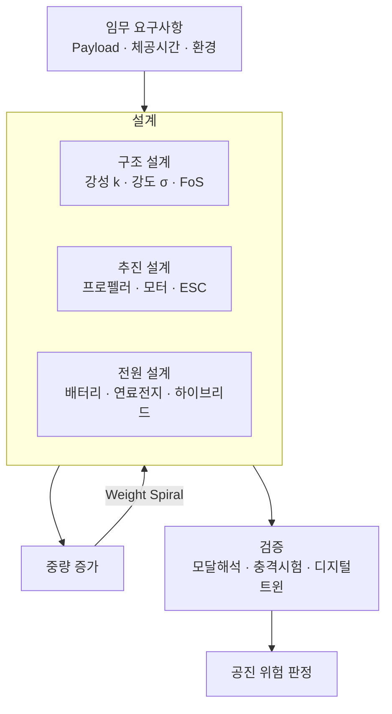
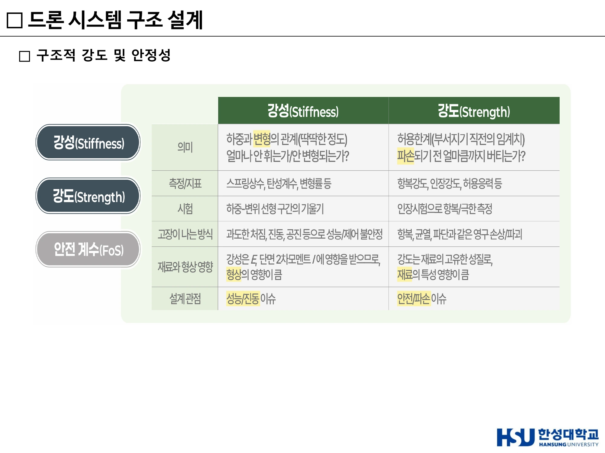
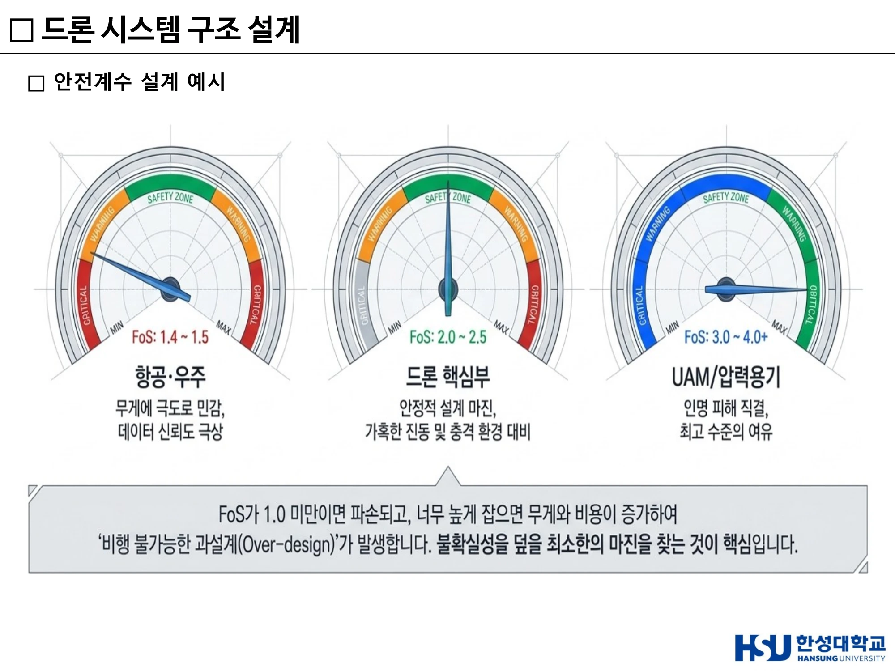
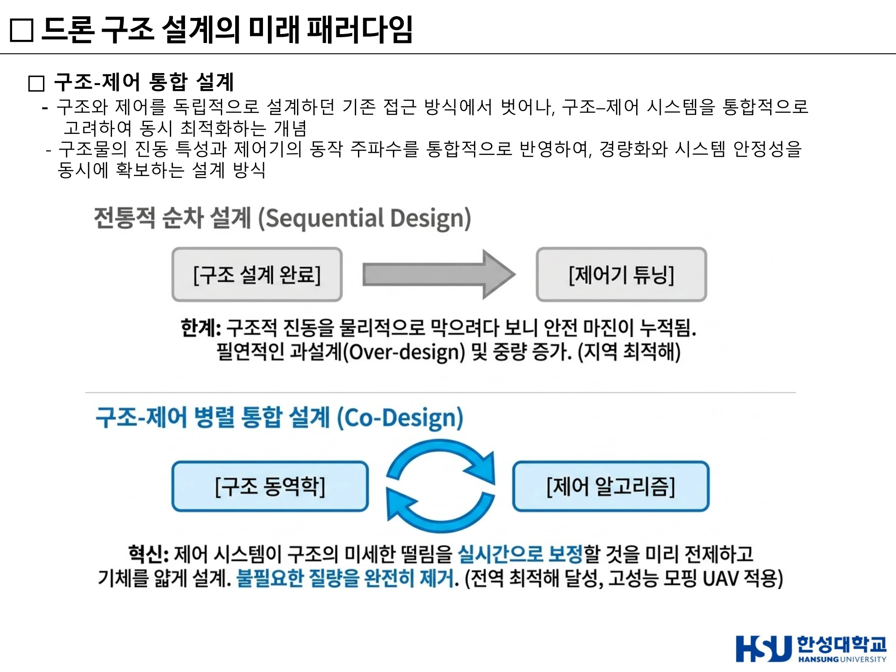
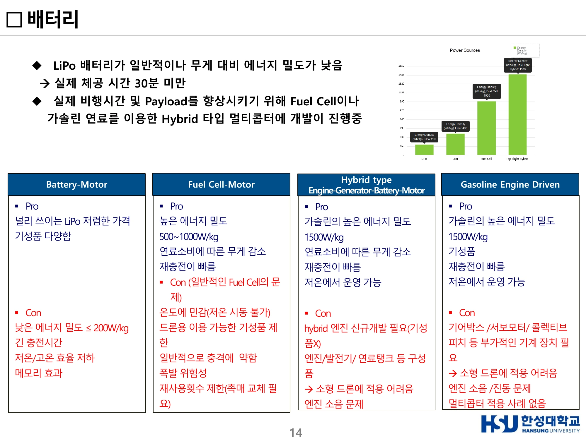
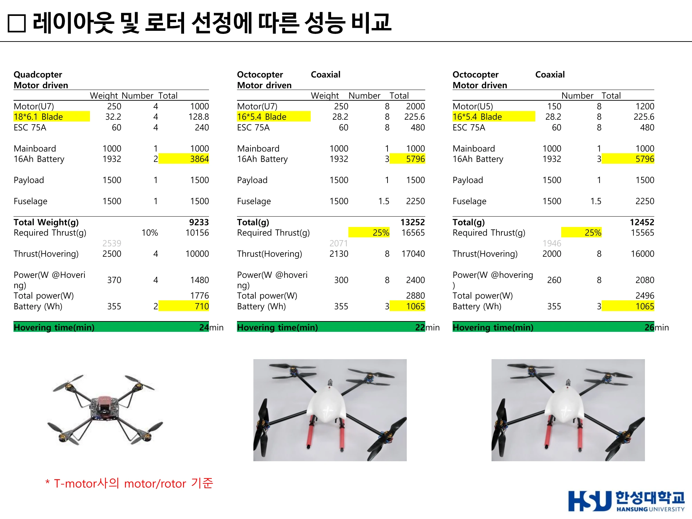
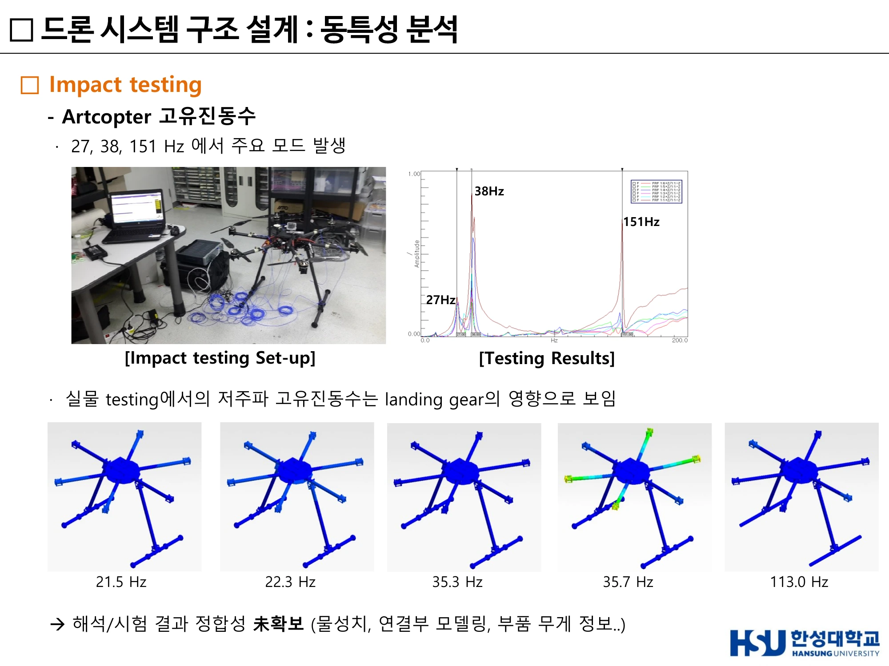

# 11주차 · 드론 구조설계와 멀티콥터 설계

> 🔗 **강의 흐름** — 이 주차는 개론 과목에서 유일하게 **정량 설계**를 다룬다. 강성·안전계수·동력원·공진 — 네 가지 개념을 숫자로 다룰 수 있어야 한다.

> **학습목표** — 강성과 강도를 구분하고, 안전계수와 Weight Spiral의 관계를 설명하며, 구조-제어 통합설계와 디지털 트윈의 개념을 서술하고, 프로펠러·모터·배터리 선정과 레이아웃 비교를 정량적으로 수행할 수 있다.

> 💡 **기초 다지기** — **"강성이 부족하면 흔들리고, 강도가 부족하면 부러진다."**
> 이 한 문장이 이번 주차의 전부다. 흔들림(진동·공진)은 **강성(Stiffness)** 문제, 부러짐(파괴)은 **강도(Strength)** 문제. 둘은 다른 물리량이고, 다른 방법으로 해결한다.

## 🗺️ 한눈에 보는 개념도

## 1. 개념 이해하기 — 강성 vs 강도

| 구분 | **강성 (Stiffness)** | **강도 (Strength)** |
|---|---|---|
| 정의 | **변형 저항** | **파괴·항복 저항** |
| 수식 | $k = F/\delta$ | 허용응력(항복강도) |
| 관련 현상 | **고유진동수** $\omega_n = \sqrt{k/m}$ → **공진 문제의 핵심** | 부재가 깨지는지의 문제 |
| 부족하면 | **흔들린다** | **부러진다** |

!!! warning "공진은 강성 문제다"
    공진은 **강성–질량 문제**다. 강도를 아무리 높여도 공진은 해결되지 않는다. 이 구분을 명확히 쓰지 않으면 감점된다.

> ▲ 강성(Stiffness)과 강도(Strength)의 의미·측정지표·시험·고장 모드 비교 *(출처: 11주차 슬라이드 p6)*

## 2. 안전계수(FoS)와 Weight Spiral

### 안전계수 설계 예시

| 적용 분야 | Factor of Safety |
|---|---|
| **드론 핵심부** | **2.0 ~ 2.5** |
| **항공·우주** | **1.4 ~ 1.5** |

$$\text{요구 설계 허용응력} = \text{해석응력} \times \text{FoS}$$

!!! example "계산 예제 — 요구 설계 허용응력"
    동일 Arm의 굽힘 응력 해석값이 **80 MPa**일 때:

    - 드론 핵심부 기준 (FoS = 2.0) → 80 MPa × 2.0 = **160 MPa**
    - 항공·우주 기준 (FoS = 1.4) → 80 MPa × 1.4 = **112 MPa**

    → 재료는 핵심부 기준 **160 MPa**, 항공우주 기준 **112 MPa** 이상의 항복강도를 가져야 한다.
    (또는 안전여유 관점: 동일 재료라면 핵심부가 더 큰 단면·중량을 요구한다.)

### 왜 FoS를 무작정 높일 수 없는가 — Weight Spiral & Over-design

**FoS ↑ → 요구 허용응력 ↑ → 단면적·두께 증대 → 구조 중량 증가(과설계)**

> **중량 추정 반복(Weight Spiral, 악순환)** — 구조 중량↑ → 총중량↑, 총중량↑ → 호버 추력 요구↑ → 더 큰 모터·프로펠러 필요 → 모터↑ → 더 큰 배터리 필요 → 또 중량↑ → 다시 1로 되돌아가 **중량이 눈덩이처럼 증가하는 발산 루프**.
>
> **결과: 페이로드 여유·체공시간 급감, 효율 악화.**

> ▲ 안전계수 설계 예시 — 항공·우주 1.4~1.5 / 드론 핵심부 2.0~2.5 / UAM·인력항공기 3.0~4.0 *(출처: 11주차 슬라이드 p8)*

## 3. 재료 선택

프레임 재질 — **탄소섬유(Carbon Fiber)**, 알루미늄, 플라스틱 등. 강성·강도·중량·비용의 균형점을 찾는 것이 설계다.

## 4. 드론 구조 설계의 미래 패러다임

> 경량화와 강성의 물리적 한계를 넘어서기 위해, 드론 구조 설계는 **인간의 직관을 넘어 AI 알고리즘과 첨단 나노 소재의 영역**으로 진입하고 있음

### ① AI 기반 형상 설계

위상 최적화(Topology Optimization)와 생성형 설계로 사람이 떠올리기 어려운 형상을 도출.

### ② 구조-제어 통합 설계 (Co-design)

- 구조와 제어를 **독립적으로 설계하던 기존 방식에서 벗어나**, 구조–제어 시스템을 **통합적으로 고려하여 동시 최적화**하는 개념
- 구조물의 **진동 특성**과 제어기의 **동작 주파수**를 통합 반영하여, **경량화와 시스템 안정성을 동시에 확보**

**사례 — NASA X-56A**

- 유연한(flexible) 날개를 사용하기 때문에 구조가 가벼워진 대신 **진동이 잘 생길 수 있다**
- **구조-제어 통합 설계(Structure–Control Co-design)**와 **능동 플러터 제어(Active Flutter Suppression)**를 적용하여 진동이 커지기 전에 억제
- 센서–액추에이터 기반 능동 제어로 플러터 진동이 증폭되기 전에 실시간 억제
- 플러터 발생 한계를 향상시켜 **경량 구조에서도 안정적인 비행 성능 확보**

!!! info "플러터(Flutter)란"
    **공기력(Aerodynamics) + 구조 진동(Structure) + 관성(Inertia)**이 상호작용하면서 진동이 점점 커지는 **불안정 현상**.
    발생 시 → 날개 진동 급증 / 구조 피로 및 손상 증가 / 제어 안정성 저하 / 심하면 **구조 파손**.

### ③ 차세대 드론 아키텍처

### ④ 디지털 트윈 기반 해석

- 실제 드론의 **구조 동특성과 비행 상태를 가상 환경에서 실시간으로 재현**하는 디지털 모델
- **실시간 센서 데이터 + 물리 기반 해석 모델**을 결합하여 하중·진동·구조 응답을 예측
- 예시 — 비행 중 구조 상태 모니터링 및 **잔여 수명(RUL, Remaining Useful Life) 예측** / **Virtual Flight Test** 기반 반복 시험으로 개발 효율성 향상 및 비용 절감

> 설계 도구의 역사: *"In the late 20th Century, this was engineering. Paper was King!"* → *"Then… Someone introduced Computer Aided Drafting… CAD was born."* → 지금은 **디지털 트윈**.

> ▲ 전통적 순차설계(Sequential Design) vs 구조–제어 병렬 통합설계(Co-Design) *(출처: 11주차 슬라이드 p13)*

## 5. 프로펠러

**선정 시 고려사항**

| 파라미터 | 영향 |
|---|---|
| **직경(Diameter) ↑** | **추력 증가** |
| **피치(Pitch) ↑** | **속도 증가** |
| **블레이드 수 ↑** | 추력 증가, **효율 감소 가능** |
| 재질 | 플라스틱 / 카본파이버 |

**설계 파라미터** — Tip to Tip Diameter, Propeller Pitch, 에어포일 형상, Chord Length, Twist angle

**사례** — T-motor **18 × 6.1 Blade**(직경 18인치, 피치 6.1인치). 현재 로봇 기술 그룹 DARPA용 Prototype 적용. 개발 target 사이즈 1m × 1m 이내 가능한 최대 로터 직경.

**블레이드 성능 해석·제작·시험**

- CFX 이용 초기 검증 완료(헬리콥터 로터 UH-1H 대상), Benchmark 로터 성능 해석, 비행 미션 고려 로터 최적 설계
- **3D Printing을 이용한 Blade Prototype 제작** — Project 3500HD, 정밀도 16~32μm, Printing size 298 × 185 × 203 mm, 제작시간 24시간 예상
- **블레이드 추력 성능 시험** — Single rotor / Coaxial Rotor, 추력 시험용 테스트 리그 제작, **Arduino 기반 측정장치**, 계측값: **전류, 전압, RPM, 추력**

## 6. 전기 모터의 종류와 특징

| 종류 | 특징 |
|---|---|
| **Brushed DC Motor** | 구조 단순·저가, 브러시 마모로 수명·유지보수 부담 |
| **BLDC** (Brushless DC) Motor | 브러시 없음 → 수명·효율 우수. **드론 표준** |
| **Synchronous Motor** (동기 모터) | 회전자가 회전자계와 동기 회전 |
| **Induction Motor** (유도 모터) | 견고·저가, 슬립 존재 |

**성능 파라미터** — KV, 최대 전류, 효율(g/W), 무게 등

**추진계 구성**

| 구성 | 역할 |
|---|---|
| **프레임(Frame)** | 드론의 기본 골격. 모터·배터리·센서·제어장치를 지지 |
| **추진계(Propulsion System)** | 프로펠러 + 모터. 회전력으로 **양력(Thrust)** 발생. 드론 성능(속도·비행시간·적재하중)에 직접 영향 |
| **전원(Power System)** | 일반적으로 **Li-Po** 배터리. 전압(V)·용량(mAh)에 따라 비행시간 결정. 예: **4S(14.8V), 6S(22.2V)** |
| **제어계(Control System)** | **FC**(Flight Controller) — IMU·GPS·센서 정보로 자세·비행 제어 / **ESC**(Electronic Speed Controller) — FC 신호를 받아 모터 속도 제어 |

## 7. 배터리 — 동력원 4방식 비교

!!! info "30분 이상 체공을 위한 동력원 선택"

| 방식 | 에너지 밀도 | Pro | Con |
|---|---|---|---|
| **Battery-Motor (LiPo)** | **≤ 200 Wh/kg** | 널리 쓰이는 LiPo, 저렴한 가격, 기성품 다양 | **낮은 에너지 밀도**, 긴 충전시간, 저온/고온 효율 저하, 메모리 효과 |
| **Fuel Cell-Motor** | **500~1000 W/kg** | 높은 에너지 밀도, **연료소비에 따른 무게 감소**, 재충전이 빠름 | 온도에 민감(저온 시동 불가), 드론용 기성품 제한, 충격에 약함, **폭발 위험성**, 재사용 횟수 제한(촉매 교체) |
| **Hybrid (Engine-Generator-Battery-Motor)** | **가솔린 1500 W/kg** | 높은 에너지 밀도, 연료소비에 따른 무게 감소, 재충전 빠름, **저온에서 운영 가능** | **하이브리드 엔진 신규개발 필요**(기성품 X), 엔진/발전기/연료탱크 등 구성품, 소형 드론 적용 어려움, **엔진 소음** |
| **Gasoline Engine Driven** | 가솔린 1500 W/kg | 높은 에너지 밀도, **기성품 존재**, 재충전 빠름, 저온 운영 가능 | 기어박스/서보모터/콜렉티브 피치 등 부가 기계장치 필요, 소형 드론 적용 어려움, 엔진 소음·진동, **멀티콥터 적용 사례 없음** |

> LiPo 배터리가 일반적이나 무게 대비 에너지 밀도가 낮아 **실제 체공 시간 30분 미만**. 실제 비행시간 및 Payload 향상을 위해 **Fuel Cell이나 가솔린 연료를 이용한 Hybrid 타입 멀티콥터** 개발이 진행 중.

**상용 배터리 사양 검토 — LiPo battery (12V ~ 22.2V)**

대부분의 상용 배터리 에너지 밀도는 **200 Wh/kg 이하**.

| 항목 | Tattu 16000mAh 22.2V 15/30C 6S1P |
|---|---|
| Capacity | 16000mAh (**355Wh**) |
| Weight | 1932g → **184 Wh/kg** |
| Dimensions | 180 × 74 × 65 mm |
| Voltage | 22.2V |
| 비고 | 현재 DARPA용 시제품에 적용, 에너지 밀도 비교적 높음 |

!!! example "동력원 선정 예시"
    **목표: 30분 이상 + Payload 1.5kg급 소형 드론**
    **선정: Hybrid (LiPo + Fuel Cell)** — 단, 규모 제약 시 고에너지 LiPo 우선 검토.
    **근거**: 소형·고응답이 요구되는 멀티콥터 특성상 **순수 Fuel Cell은 부적합**하고, **에너지밀도는 Fuel Cell, 출력밀도는 LiPo가 분담**하는 Hybrid 구성이 30분 이상 체공과 비행 안정성을 동시에 만족하는 가장 타당한 해법이다.

> ▲ Battery-Motor(LiPo) / Fuel Cell-Motor / Hybrid / Gasoline Engine Driven 4방식의 장단점 *(출처: 11주차 슬라이드(덱 18) p14)*

## 8. 모터-로터 성능 비교

**15~18인치 로터/모터 비교 분석** — Motor(blade) supplier: Tiger motor, Tarrot, Rctimer, DJI. 대체로 **Efficiency(W/kg) 기준 10% 이내 차이**.

| 로터 크기 | Thrust 2kg | Thrust 3kg |
|---|---|---|
| **15~18인치** | 250 W | 500 W |
| **26~28인치** | **150 W** | **250 W** |

→ **로터가 클수록 같은 추력을 더 적은 전력으로 낸다.** 이것이 다음 절의 핵심 원리다.

## 9. 레이아웃 및 로터 선정에 따른 성능 비교

**T-motor사의 motor/rotor 기준, Payload 1.5kg**

| 항목 | **Quadcopter** | **Octocopter (Coaxial, U7)** | **Octocopter (Coaxial, U5)** |
|---|---:|---:|---:|
| Motor | U7 250g × 4 = 1000 | U7 250g × 8 = 2000 | U5 150g × 8 = 1200 |
| Blade | 18×6.1, 32.2g × 4 = 128.8 | 16×5.4, 28.2g × 8 = 225.6 | 16×5.4, 28.2g × 8 = 225.6 |
| ESC 75A | 60g × 4 = 240 | 60g × 8 = 480 | 60g × 8 = 480 |
| Mainboard | 1000 | 1000 | 1000 |
| 16Ah Battery | 1932g × 2 = 3864 | 1932g × 3 = 5796 | 1932g × 3 = 5796 |
| Payload | 1500 | 1500 | 1500 |
| Fuselage | 1500 | 1500 × 1.5 = 2250 | 1500 × 1.5 = 2250 |
| **Total Weight (g)** | **9,233** | **13,252** | **12,452** |
| Required Thrust (마진) | 10,156 (10%) | 16,565 (25%) | 15,565 (25%) |
| Thrust (Hovering) | 2500 × 4 = 10,000 | 2130 × 8 = 17,040 | 2000 × 8 = 16,000 |
| Power @Hovering | 370W × 4 = 1,480 | 300W × 8 = 2,400 | 260W × 8 = 2,080 |
| Total power (W) | 1,776 | 2,880 | 2,496 |
| Battery (Wh) | 355 × 2 = 710 | 355 × 3 = 1,065 | 355 × 3 = 1,065 |
| **Hovering time** | **24 min** | **22 min** | **26 min** |

!!! info "왜 더 무거운 옥토콥터가 더 오래 나는가"
    **핵심: 모터당 부하가 낮을수록 로터 효율(g/W)이 높아지기 때문.**

    **① 부하 분산 (모터당 부하)**
    호버링에 필요한 총추력 = 총중량(불변, 추력 = 중량 평형).
    - 쿼드: 4개 로터가 총추력 분담 → 모터당 부하 큼
    - 옥토: 8개 로터가 분담 → 총중량이 다소 무거워도 모터당 부하는 현저히 감소
    - 예: 쿼드 총중량 W₄, 모터당 W₄/4 = **0.25 W₄**. 옥토 총중량 1.2W₄라도 모터당 1.2W₄/8 = **0.15 W₄** < 0.25 W₄ → **모터당 부하 약 40% 감소**

    **② 로터 효율 곡선(g/W)의 비선형성**
    로터 효율(단위 전력당 추력)은 **저추력 영역에서 높고 고추력 영역에서 급격히 떨어지는** 비선형 곡선.
    운동량 이론상 $P \propto T^{3/2}$, 즉 $T \propto P^{2/3}$ → **추력을 절반으로 내리면 전력은 $2^{1.5} \approx 2.83$배 절감.**
    즉 모터당 부하를 낮추면 각 로터가 **효율 좋은(g/W 높은) 동작점**으로 이동한다.

    **③ T/W 마진과 전력 소모**
    옥토는 동일 모터로 더 큰 T/W 여유 확보 → 호버 추력이 **최대추력 대비 낮은 비율(예: 30~40%)**에서 작동.

> ▲ Quadcopter 24분 · Coaxial Octocopter(U7) 22분 · Coaxial Octocopter(U5) 26분 — 중량·추력·전력·호버링 시간 원본 표 *(출처: 11주차 슬라이드(덱 18) p17)*

## 10. 동특성 분석 (Modal Analysis) — 공진

### UAV 주요 동특성 모드

비행 안정성과 vision에 영향을 주는 주요 모드:

| 모드 | 영향 |
|---|---|
| **Z축 병진 mode** | 상승/하강 후 **leveling control issue** |
| **좌우 pitching unbalance mode** | **Hovering instability**, 좌/우 prop의 tilting → **Yaw instability** |
| **Pitching mode** | Incoming wind gust → **Pitch instability** |
| **Rolling mode** | Lateral wind gust → **Roll instability** |

### 기본 설계안 (Type 04) — 고유진동수/고유 모드

기본 보강재(ribs) 추가 → 상세설계 시 cut-out 실시. Skin thickness / Ribs thickness 조정.
중량 예: 기존 456g → **514g (58g ↑)**, 다른 설계안 1377g.

### Impact Testing — Artcopter 고유진동수

- **27, 38, 151 Hz**에서 주요 모드 발생
- 실물 testing에서의 **저주파 고유진동수는 landing gear의 영향**으로 보임
- 해석/시험 결과 정합성 **미확보** (물성치, 연결부 모델링, 부품 무게 정보 부족)
- Testing Results 참고값: 21.5 / 22.3 / 35.3 / 35.7 / 113.0 Hz

!!! example "계산 예제 — 공진 위험 정량 분석"
    **조건**: 쿼드콥터 충격시험 결과 주요 고유진동수가 **27 Hz, 38 Hz, 151 Hz**에서 측정. **18×6.1 프로펠러** 장착, 호버링 시 약 **6,000 RPM** 회전. 프로펠러 통과주파수(BPF)를 계산하고(블레이드 **2매** 가정) 공진 위험을 정량 분석하시오.

    **① 회전 주파수** = 6,000 RPM ÷ 60 = **100 Hz**
    **② BPF** = 회전주파수 × 블레이드 수 = 100 Hz × 2 = **200 Hz**

    **③ 판정**
    - **27 Hz, 38 Hz** — 1× 가진(100 Hz)과도 충분히 이격되어 **안전**
    - **151 Hz가 핵심 쟁점** — BPF(200 Hz)와의 이격이 약 **24.5%**로 ±20% 경계를 약간 벗어나므로 정상 호버링(6,000 RPM)에서는 **직접 공진은 아니다**
    - 그러나 **RPM은 기동 시 변동**한다. 151 Hz에 BPF가 일치하려면 회전주파수 75.5 Hz → **4,530 RPM**. 즉 호버링 RPM(6,000)보다 낮은 운용 영역(상승/하강·저추력 구간)에서 BPF가 151 Hz를 **통과(sweep through)**하게 되어 **천이 공진(transient resonance) 위험**이 존재한다
    - 또한 151 Hz는 1× 성분 기준으로는 9,060 RPM에 해당하므로 정격 범위 밖이나, BPF 경유 통과는 피할 수 없어 **151 Hz 모드가 가장 위험한 모드로 판정**된다

!!! example "이어지는 서술 — 순차설계 vs 코디자인"
    **공진은 강성–질량 문제**($\omega_n = \sqrt{k/m}$).

    | 접근 | 강성 확보 전략 | 중량 영향 |
    |---|---|---|
    | **순차설계 (Sequential Design)** | 강성을 **구조로만** 확보 | **무겁다** |
    | **코디자인 (Co-Design)** | **구조와 제어가 강성을 분담** | 더 **가볍게** 같은 안전성 달성 |

    **강성(Stiffness)** — 변형 저항($k = F/\delta$), 고유진동수를 결정 → 공진 문제의 핵심
    **강도(Strength)** — 파괴·항복 저항(허용응력), 부재가 깨지는지의 문제

> ▲ Impact testing — Artcopter 고유진동수 27 · 38 · 151 Hz와 실측 모드 형상 *(출처: 11주차 슬라이드(덱 18) p20)*

## 🤔 생각해 봅시다

1. 헥사콥터와 옥토콥터 중 **택배 드론**에 적합한 것은 무엇인가? 9주차의 "옥토콥터는 체공시간이 줄어든다"와 이번 주 계산표(옥토콥터가 더 오래 체공한다)는 모순처럼 보인다. 두 진술을 어떻게 양립시킬 수 있는가? *(힌트: 같은 배터리 조건 대 같은 페이로드 조건, 동축 반전 여부)*
2. 안전계수를 2.5로 잡은 설계와 1.4로 잡은 설계 중, **사람이 타지 않는 드론**에는 어느 쪽이 합리적인가? 판단 기준을 제시하시오.
3. 디지털 트윈으로 Virtual Flight Test를 수행하면 실물 시험을 얼마나 줄일 수 있는가? 줄일 수 **없는** 시험은 무엇인가?

## ✅ 이번 주 체크리스트

- [ ] 강성과 강도를 수식과 함께 구분해 설명할 수 있다
- [ ] FoS 계산(해석응력 × FoS)을 할 수 있고, 드론 2.0~2.5 / 항공우주 1.4~1.5를 안다
- [ ] Weight Spiral 루프를 그릴 수 있다
- [ ] 플러터의 3요소(공기력+구조진동+관성)를 안다
- [ ] 동력원 4방식의 에너지 밀도 수치를 안다 (LiPo ≤200 / FC 500~1000 / 가솔린 1500)
- [ ] BPF = 회전주파수 × 블레이드 수를 계산할 수 있다
- [ ] $P \propto T^{3/2}$로 옥토콥터 체공시간 역전을 설명할 수 있다

---

▶️ **다음 주 예고** — 하늘길이 도시로 내려온다. 스마트시티, MaaS, 그리고 **UAM**. 그리고 파트 3의 문을 여는 **로봇 산업**. → [12주차](week12.md)
