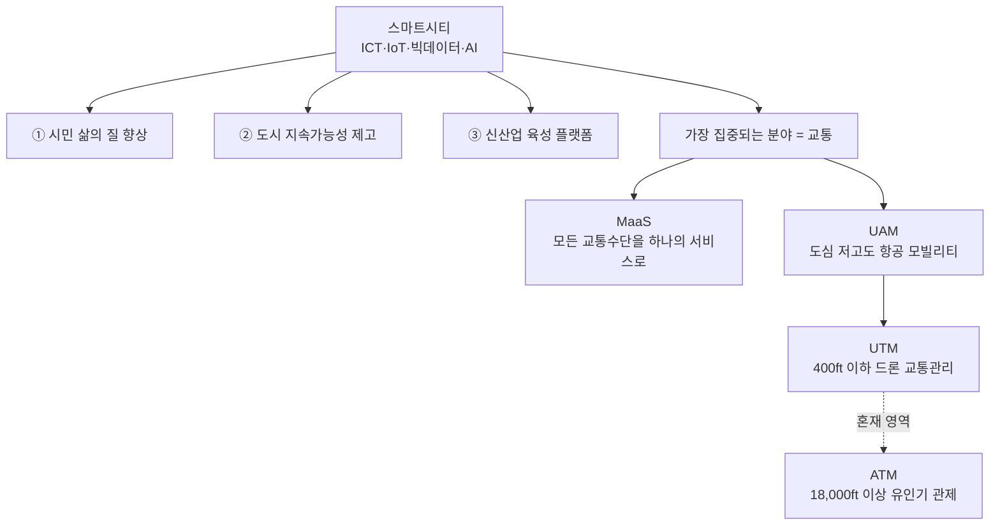
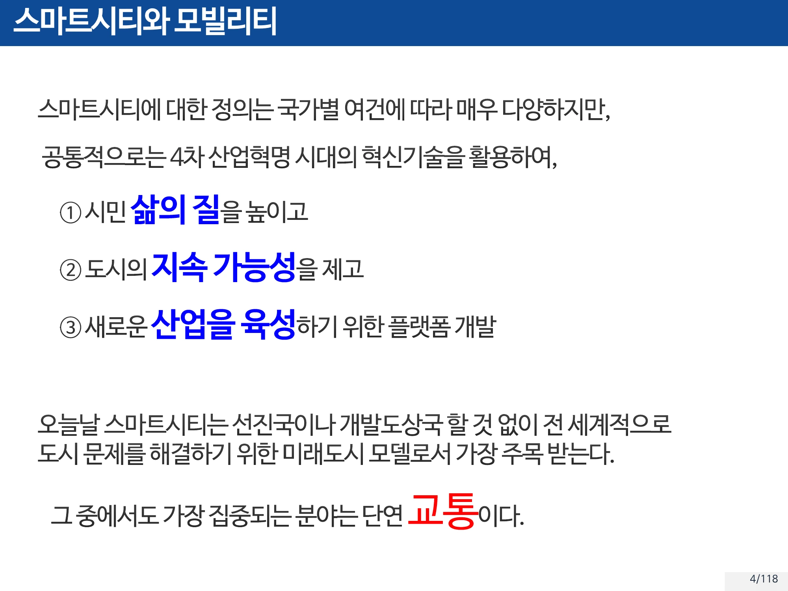
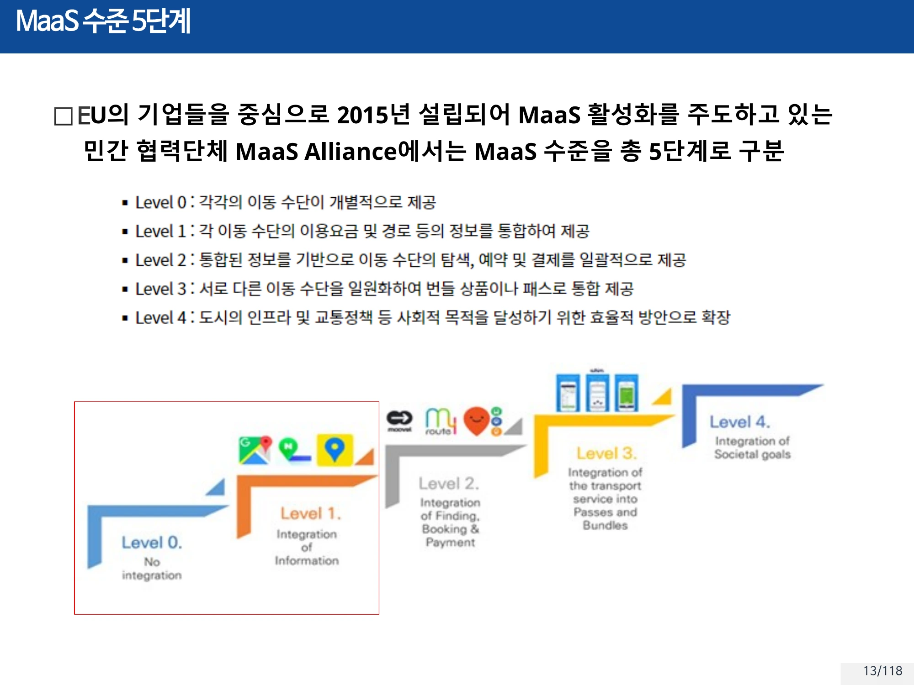
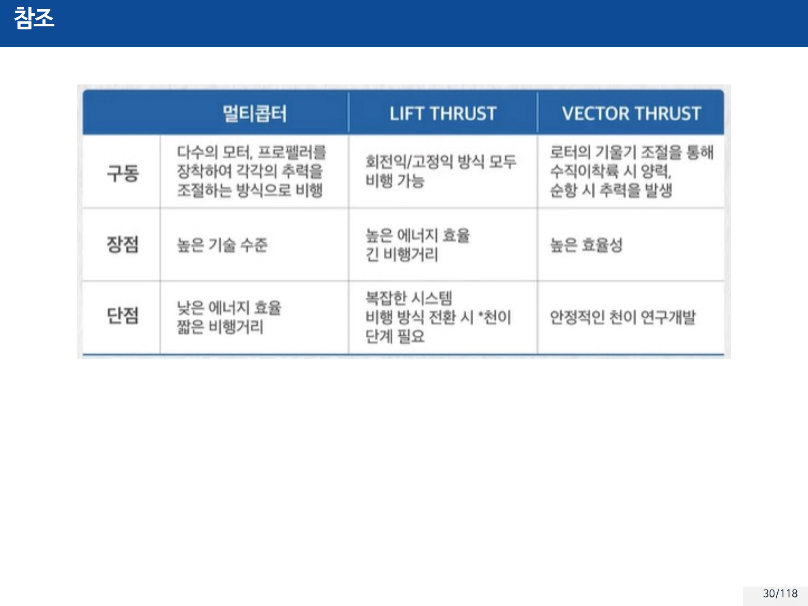
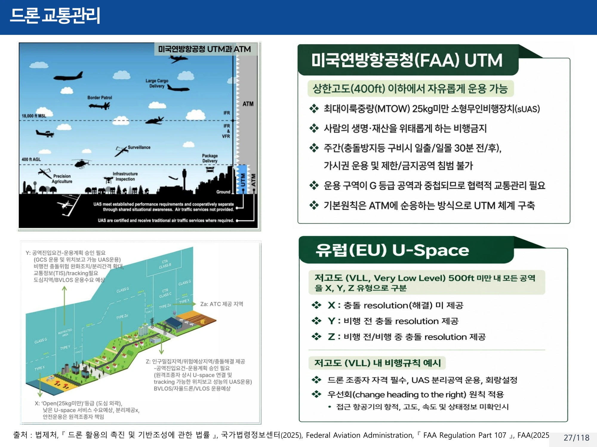

# 12주차 · 스마트시티·MaaS·UAM

> 🔗 **강의 흐름** — 1주차에서 "모빌리티의 발전은 도시의 변화를 가져온다"고 시작했다. 이번 주는 그 문장으로 되돌아온다. 자율주행(1부)과 드론(2부)이 만나는 지점이 **도시**이고, 그 도시의 하늘이 **UAM**이다. 후반부에서 파트 3(로봇)의 문을 연다.

> **학습목표** — 스마트시티의 정의와 '인간 중심'의 의미를 사회·기술·정책 측면에서 설명하고, MaaS의 개념과 수준 5단계를 서술하며, UAM의 개념·역사·종류와 UTM/ATM 구분을 설명할 수 있다.

> 💡 **기초 다지기** — **MaaS는 "앱 하나로 모든 이동"이다.** 지하철 앱, 택시 앱, 따릉이 앱을 각각 켜는 대신 **하나의 서비스로 예약하고 한 번에 결제**한다. 자동차를 소유하지 않아도 불편하지 않게 만드는 것이 목표다.

## 🗺️ 한눈에 보는 개념도

## 1. 스마트시티의 등장

| 시기 | 흐름 |
|---|---|
| **1990년대** | 화석연료 등 에너지 위기에 대비하여 **지속가능한 도시**를 위한 노력 |
| **2000년대** | 정보통신기술의 발달을 계기로 우리나라 중심의 **유비쿼터스도시**, 디지털시티, 인텔리전트도시 등 다양한 도시 모델이 제시 → 최근에는 **스마트시티로 수렴** |

※ 정보통신기술의 발달 → 지능화, 자동화 및 각종 시스템들이 체계적으로 구축
※ UN "세계 인구 80억 돌파"(2022.11.15 기준) — 공중 보건과 영양, 개인 위생과 의학의 발전으로 인간 수명의 점진적 증가

!!! success "스마트시티의 정의"
    스마트시티에 대한 정의는 국가별 여건에 따라 매우 다양하지만, 공통적으로는 **4차 산업혁명 시대의 혁신기술을 활용하여**
    ① **시민 삶의 질을 높이고**
    ② **도시의 지속 가능성을 제고**하며
    ③ **새로운 산업을 육성하기 위한 플랫폼**을 개발하는 것.

    오늘날 스마트시티는 선진국이나 개발도상국 할 것 없이 전 세계적으로 도시 문제를 해결하기 위한 **미래도시 모델로서 가장 주목**받는다. 그중에서도 가장 집중되는 분야는 **단연 교통**이다.

### '인간 중심'의 의미 — 세 측면으로 정리하기

> **문항**: 스마트 시티의 정의를 기술하고 '인간 중심'이 갖는 의미를 **사회·기술·정책** 측면에서 설명하시오. (상20 / 중14 / 하8)

**📌 스마트시티의 정의**
스마트시티란 **ICT(정보통신기술), IoT, 빅데이터, AI 등 첨단 기술을 활용하여 도시의 효율성과 지속가능성을 높이고, 시민의 삶의 질을 향상시키는 도시**를 말한다. 교통, 에너지, 안전, 복지 등의 도시 서비스를 지능화하고 통합적으로 관리하여 지속 가능한 도시 운영과 거주자 편의 증진을 목표로 한다.

**📌 '인간 중심'의 의미**

| 측면 | 내용 |
|---|---|
| **사회적 측면** | 모든 도시 서비스와 인프라의 중심에 시민이 있으며, **소외계층·고령자·장애인 등 모든 시민의 접근성과 포용성**을 보장하는 방향으로 설계된다 |
| **기술적 측면** | 기술 도입의 목적이 '기술 그 자체'가 아니라, **시민의 삶을 안전하고 편리하게 만드는 것**에 있다. 예: 스마트 헬스케어, 에너지 절감형 주택, 개인화된 교통 시스템 |
| **정책적 측면** | **시민의 참여**(시민참여 플랫폼, 디지털 거버넌스 등)를 강화하고, **데이터 기반 정책 수립**을 통해 시민 중심의 의사결정 구조를 구축한다 |

> ▲ 스마트시티의 정의 3요소 — ① 시민 삶의 질 ② 도시의 지속 가능성 ③ 새로운 산업 육성 플랫폼. 가장 집중되는 분야는 교통 *(출처: 12주차 슬라이드 p4)*

## 2. 스마트시티와 모빌리티 (1주차 복습·심화)

쉘 & 맥킨지(2017.6) 도시 3분류와 처방 → [1주차](week01.md) 참조.
기존 도시 vs 자율주행 전용 도시, 글로벌 정책 동향(EU 2035 / 미국 2032 / 중국 2035), LCA·ITS → [1주차](week01.md) 참조.

## 3. MaaS — Mobility as a Service

!!! quote "출발점이 되는 질문"
    **"급한 미팅이 생겨 한성대에서 잠실로 이동해야 된다면 어떤 방법이 가장 빠르고 효과적일까?"**
    ① 택시? 버스? 지하철? 소요시간을 줄이기 위해서 공유 자전거?
    ② 공유 자동차·자전거·킥보드 등 다양한 공유 모빌리티를 선택할까?
    → **Door-to-Door 이동하는 방법을 찾기 위해 또 다른 시간을 투입**하게 된다. 이 문제를 해결하기 위해 주목받는 것이 MaaS다.

**정의** — **MaaS**(Mobility as a Service)를 직역하면 **'서비스로서의 모빌리티'**. **모든 교통수단을 하나의 통합된 서비스로 제공하는 개념**이다.

### 거시적 필요성

| 구분 | 내용 |
|---|---|
| **As-Is** | 도시 집중화에 의한 교통 체증, 주차 공간 부족, 대기 오염 등 |
| **Resolution** | 자가용보다 **더 빠르고, 편하고, 쉽고, 쾌적한 이동 서비스** 제공 |
| **목표** | **2025년까지 자동차 없는 도시**를 만드는 것 — 시민 누구라도 자동차를 소유하지 않고 생활할 수 있는 환경 조성 |

→ 정부·지자체에서 거시적인 도시문제들을 해결할 수 있는 솔루션 = **MaaS**

### 대표 사례 — 핀란드 헬싱키 Whim

- MaaS를 도입해 도시의 교통 문제를 해결하고자 하는 가장 대표적인 도시 = **핀란드 헬싱키**
- **2016년부터** 개인 교통수단과 트램, 열차, 택시, 버스, 공유 자전거 등 **모든 교통수단을 Whim이라는 하나의 앱**을 이용해 예약하고 비용을 지불
- 운영사 **MaaS Global**의 비전 — *"create a world where you don't have to own a car to live a fulfilling life"*

!!! success "실제 효과 — 숫자로 확인"
    MaaS Global사가 Whim 사용자를 대상으로 실시한 조사 결과, Whim 제공 개시 전후 헬싱키의 'Whim 이용자 이동'에서 차지하는 **대중교통 이용 비율이 48% → 74%로 대폭 증가**했다.
    → MaaS에서의 이용자 편익은 '이동의 편리성 향상'뿐 아니라 **'교통비 절감'** 효과도 있으며, 이동 데이터를 하나의 MaaS 플랫폼에 축적함으로써 **새로운 데이터 활용**도 가능하다.

**우버 사례** — UBER가 **JUMP 바이크**와 서비스 통합 → 통합 서비스 사용량 **15% 증가**.

### MaaS 수준 5단계

EU의 기업들을 중심으로 **2015년 설립**되어 MaaS 활성화를 주도하고 있는 민간 협력단체 **MaaS Alliance**에서는 MaaS 수준을 총 **5단계**로 구분한다.

| 단계 | 개념 (일반적 정의) |
|---:|---|
| Level 0 | 통합 없음 — 각 수단이 개별 운영 |
| Level 1 | **정보 통합** — 통합 경로·요금 정보 제공 |
| Level 2 | **예약·결제 통합** — 한 번에 예약·결제 |
| Level 3 | **서비스 제공 통합** — 구독·번들 상품 |
| Level 4 | **정책 통합** — 도시 정책 목표와 연계 |

### 국내 MaaS 주도 기업

| 기업 | 내용 |
|---|---|
| **카카오 모빌리티** | 택시·자전거·셔틀·시외버스·기차 등 중단거리에서 광역 교통까지. 내비게이션·주차·대리운전부터 세차·정비, 중고차 영역까지 서비스 범위 확대 |
| **티맵 모빌리티** | 세계 최대 승용차 공유 서비스 업체 **우버와 합작사 '우티' 출범(2021.4)**. **구글로부터 5천만 달러(약 565억원) 투자 유치** — 구글의 AI·자율주행 기술 접목 사업 기회 모색 중. T맵과 우버의 운영 노하우를 합쳐 렌터카·대리운전·차량 공유·단거리 이동 수단·주차 등 |
| **쏘카** | 차량 공유 |

!!! success "MaaS의 정확한 표기"
    **MaaS = Mobility as a Service**. "Mobility as a Software", "Mobility and Safety" 등과 혼동하지 않는다.

> ▲ MaaS Alliance의 MaaS 수준 5단계 — Level 0(통합 없음) → Level 4(정책 통합) *(출처: 12주차 슬라이드 p13)*

## 4. UAM — 도심 항공 모빌리티

!!! success "정의"
    **UAM**(Urban Air Mobility) — **사람 또는 물자를 탑재한 상태로, 도심 내외를 저고도로 운항하는 소형 비행체 및 운용 체계**

### 왜 필요한가 — 메가시티 문제

**메가시티(megacity)** = 인구 1,000만 명이 넘는 도시. 사회적 중심 역할을 수행하는 대도시로 정치·경제·교육·행정·문화 시설 등이 집중된다.

**인구 집중 → 이동 수단 포화(교통 체증) → 이동 효율성 저하, 물류 운송 비용 등 사회적 비용 급증 → 다양한 사회 문제 초래**

### 기대 효과 3가지

*(출처: 『포스트모빌리티 — 탈것의 혁신에서 공간의 혁명으로』, 차두원·이슬아, 위즈덤하우스, 2022.06.29, p.121 인용)*

1. UAM이 활성화되어 도심에 대한 접근성이 개선된다면 **도심 밀집도는 낮아질 것**으로 기대됨
2. 메가시티의 도로·주차 시설로 활용하고 있는 면적 중 **20%를 다양한 문화 공간(공원, 박물관, 공연 센터)으로 활용** 가능
3. 전기차·수소차와 함께 **도시 환경을 보호하며 깨끗한 공기를 제공**하는 데 기여

> 항공·자율주행·배터리 분야의 기술 발전으로 도심 항공 모빌리티가 본격화되고 있다.

### UAM의 역사

| 시기 | 형태 |
|---|---|
| 라이트 형제 이후 | 첫 동력 비행 후 사람이 탑승하여 도심 내외를 저고도로 운항하는 소형 비행체 개발. **회전익기** 또는 제한적인 UAM으로 활용방안 모색 |
| **2000년대 초반** | 자동차 개념의 **고정익 + Flying Car** 형태 연구 — **에어로모빌 3.0**, **PAL-V** |
| 최근 | **회전익 + Flying Car** 형태 개발 중(AirBus) → 일반 자동차와 같이 공도에서 운행하다 필요시 **회전익 모듈을 장착**하는 개념으로 발전 |
| — | **자이로콥터** — 고정익(Rear Prop.) + 회전익(Main Rotor) 하이브리드 |
| **2010 ~** | **멀티콥터(= 드론)** — 도심 항공 모빌리티에 큰 변화 시작 |

**자이로콥터 사양 예**

| 항목 | 값 | 항목 | 값 |
|---|---|---|---|
| 길이 | 5.1m | 최대 비행 속도 | 172 km/h |
| 높이 | 2.81m | 최소 비행 속도 | 50 km/h |
| 천장(고도) | 3,000m | 좌석 | 2 |
| 이륙 거리 | 90m 이하 | 착륙 거리 | 30m 이하 |
| 연료 탱크 | 68L @95# | 지구력 | 5시간 |
| 비행거리 | 500 km | 순항 속도 | 100~150 km/h |
| 최대 이륙 중량 | 485 kg | 상승률 | 4.5 m/s (1인) / 3.2 m/s (2인) |

- **장점** — 도로 주행 + 공중 비행 가능
- **단점** — 헬리콥터와는 달리 **활주로가 필요**, **내연 기관 엔진으로 공해와 소음** 발생

**멀티콥터의 비행 원리 대비**

| 헬리콥터형 | 멀티콥터형 |
|---|---|
| Main Rotor에서 양력 생성, Main Rotor의 **Angle을 통해 추력(Roll/Pitch) 제어**, Rear Rotor는 Yaw 제어 | **각 Rotor가 양력을 생성**하며, **회전수를 조절해 추력 방향 제어** |

### UAM의 종류

#### ① 멀티콥터(드론) 방식

| Model | **Volocopter** (독일 Volocopter社) | **EHang216** (중국 Ehang社) |
|---|---|---|
| 배터리 | **배터리 교체 ( < 5min)** | **배터리 충전 ( min 1 Hour)** |
| 인원 | 2명 | |
| 비행거리 | 35 km | |
| 최대 비행 속도 | 100 km/h | |
| 로터 | **16개 이상** | |

> 활발한 연구로 급변하는 도심 항공 모빌리티 산업

#### ② Lift & Cruise / Tilt Rotor 방식

| 방식 | 특징 | 사례 |
|---|---|---|
| **리프트 & 크루즈 (Lift + Cruise)** | 수직용 로터와 순항용 추진기를 분리 | 현대자동차 **S-A1** (CES 2020, 스마트 모빌리티 솔루션의 UAM 비전 콘셉트), 브라질 **Embraer X — Eve** |
| **틸트로터 (Tilt Rotor, Vector Thrust)** | **순항 시 Rotor 방향을 수평으로 전환**. ※ 멀티콥터에 비해 **순항 시 적은 에너지 소모** | 한국항공우주연구원 **OPPAV**, KAI社 OPPAV |

**Embraer X Eve 사양** — 인원 5명 / 공허중량·최대중량 500~1,000 kg / 비행거리 60 km / 최대 비행 속도 240 km/h

> ▲ 멀티콥터 / LIFT THRUST / VECTOR THRUST 3방식의 구동·장점·단점 비교 *(출처: 12주차 슬라이드 p30)*

## 5. 드론 교통관리 — UTM vs ATM

!!! success "고도로 나뉘는 두 체계"
    | 고도 | 체계 | 특징 |
    |---|---|---|
    | **400 ft(약 120m) 이하** | **UTM** 중심 영역 | 소형 드론(sUAS) 중심. 도시·농업·시설점검 등 저고도 임무. **자동화 기반 교통관리**. FAA 관제 대신 **협력형 관리(Cooperative Management)** |
    | 400 ft ~ 18,000 ft | **UTM·ATM 혼재** 과도 영역 | 헬리콥터, 감시 드론, 특수 목적 UAV, 저고도 항공기 |
    | **18,000 ft 이상** | **ATM** 중심 영역 | 여객기·화물기·군용기. **IFR 기반 항공교통관제**. 사람이 직접 관제하는 기존 체계 |

- **UTM** (Unmanned Aircraft System Traffic Management) — 드론 중심 저고도 교통관리 체계, 다수 드론을 네트워크 기반으로 관리
- **ATM** (Air Traffic Management) — 기존 유인항공기 중심의 항공교통관리 시스템, 관제사가 항공기를 직접 관리

**근거 문헌**

- 법제처, 『드론 활용의 촉진 및 기반조성에 관한 법률』, 국가법령정보센터(2025)
- Federal Aviation Administration, 『FAA Regulation Part 107』, FAA(2025)
- 국토교통부, 『**한국형 도심항공교통(K-UAM) 운용개념서 1.5**』, UAM Team Korea(2025)

!!! warning "UTM이 담당하는 기능의 범위"
    UTM은 **비행계획 제출·허가, 실시간 충돌 회피, 드론 위치·고도 정보 통합 제공**을 담당한다.
    **연료 보급소 위치 안내와 같은 지상 인프라 정보는 UTM의 기능이 아니다.**

> ▲ 미국 FAA UTM(400ft 이하)과 유럽 U-Space — 고도로 나뉘는 UTM/ATM 관리 체계 *(출처: 12주차 슬라이드 p27)*

## 6. 파트 3의 문 — 로봇 산업의 중요성

12주차 후반부터 **로봇**으로 넘어간다. 상세는 [13주차](week13.md)에서 다루고, 여기서는 **왜 지금 로봇인가**를 짚는다.

### 로봇 산업 Issue

**저출산·고령화 → 생산가능인구 감소 → 노동력 부족 → 생산성 향상·자동화 수요 증가**

### 차세대 성장 엔진의 필요성

| 구분 | 현황 |
|---|---|
| **국내 제조 산업의 현황** | 우리나라는 **세계 수준의 제조 및 생산 기반을 보유**하고 있음. 그러나 산업에서의 **제조업 비중이 감소**하고 있는 시점 |
| **기존 산업의 한계** | 주력 산업은 **세계적 공급 과잉 상태**에 직면. 현재 시장의 확장은 어려우며, **고도 성장은 종료된 상태**로 평가 |

!!! warning "국내 제조업 현황을 정확히"
    우리나라는 글로벌 수준의 제조·생산 기반을 보유하고 있으나, **제조업 비중은 감소**하고 있으며 주력 산업은 **공급 과잉과 확장성 한계**에 직면해 있다.
    "제조업 비중이 계속 증가하고 고도 성장을 지속한다"는 서술은 현황과 다르다.

### 로봇 산업의 성공 공식

$$\textbf{기술 융합(Convergence)} + \textbf{시장 창출(Market Creation)} = \textbf{로봇 산업 성공}$$

| 요인 | 내용 |
|---|---|
| **기술 융합** | AI·센서·반도체·통신·제어 기술의 융합 → 새로운 산업과 서비스 창출, 산업 간 경계를 허무는 혁신. 이종/동종 산업 간 융합, **I(Information)·B(Bio)·N(Nano) Technology**와의 융합, 기계 + 전자(가전·컴퓨터·통신) 융합 → **Mechatronics** |
| **Digital Convergence** | 전자 기능 간의 융합, Network·Infra 간의 융합 |
| **시장 창출** | 기술보다 **고객의 문제 해결**이 중요. 새로운 수요와 시장을 발굴하는 능력 필요. **초기 시장 선점**이 산업 주도권 결정 |

!!! quote "핵심 메시지"
    **"좋은 기술만으로는 성공할 수 없다. 기술 융합을 통해 혁신을 만들고, 시장을 창출하여 고객 가치를 제공해야 한다."**

### 4차 산업혁명과 지능형 로봇

| 산업혁명 | 특징 |
|---|---|
| 1차 | 기계화 (Mechanization) |
| 2차 | 대량생산 (Mass Production) |
| 3차 | 자동화 (Automation) |
| **4차** | **지능화 (Intelligent Automation)** |

**4차 산업혁명의 핵심 변화**

1. **ICT와 제조업의 융합** — AI·클라우드·빅데이터·로봇 기술 통합, 물리 세계와 디지털 세계 연결, 스마트 팩토리 구현
2. **사물인터넷(IoT) 기반 연결** — 기계와 기계(M2M) 통신, 센서 데이터 실시간 수집, 생산설비 간 자율 협업
3. **CPS (Cyber Physical System)** — 현실 공장을 디지털 공간에 구현, 시뮬레이션 기반 생산 최적화, **디지털 트윈** 활용
4. **생산 통제의 변화** — 과거: 사람이 생산 과정 제어 → 현재: 기계가 스스로 판단·제어 → 미래: **AI 기반 자율 생산 시스템**

**로봇 관점에서의 의미** — 산업용 로봇 → 지능형 로봇 / 단순 반복 작업 → 자율 의사결정 / 개별 로봇 → 네트워크 연결 로봇 / **자동화 → 자율화(Autonomy)**

### Industry 4.0

Industry 4.0은 **노동력 부족, 고령화, 글로벌 경쟁에 대응**하기 위해 AI·IoT·로봇을 활용하여 제조업을 지능화하는 혁신 전략이다.

| 구분 | 내용 |
|---|---|
| **필요 이유** | 숙련공 부족 및 노동력 감소 / 고령화 / 글로벌 경쟁 심화와 비용 절감 압박 / **제품 수명주기 단축** / 고객 요구 다양화로 제품 변동성 증가 |
| **목표** | 스마트 팩토리 구현 / 생산설비의 자율적 의사결정 / 공장 내 모든 설비·시스템 연결 / 생산성 향상 및 비용 절감 / **유연 생산(Flexible Manufacturing)** 실현 |
| **핵심 특징** | **맞춤형 대량생산(Mass Customization)** / 소규모 스마트 공장 운영 / 자원 효율성 극대화 / 친환경·도심형 생산 시스템 / 공급망 전체의 디지털 연결 |

### 인간-로봇 협업 (HRC)

**EU ROBO-PARTNER 프로젝트** — 미래 제조환경에서 인간과 로봇이 협력하는 스마트 공장 모델.

| 기존 산업용 로봇 | 4차 산업혁명형 로봇 |
|---|---|
| **안전 펜스(Fence) 내부**에서 독립 작업 | 사람과 **같은 공간**에서 작업 |
| 사람과 작업 공간 분리 | 작업 상황을 **실시간 인식** |
| 반복 작업 자동화 중심 | 사람을 **보조**하는 역할 수행 |
| 생산성 향상이 주요 목적 | **생산성과 유연성을 동시에** 확보 |

**ROBO-PARTNER의 핵심 개념 4가지** — ① Human-Robot Safe Interaction ② Mobile Robot(AMR/AGV) ③ Human-Robot Cooperative Task Planner ④ Cooperative Assembly

**인간-로봇 협력 생산의 장점**

| 장점 | 내용 |
|---|---|
| **① 생산성 향상** | 로봇 = 반복 작업·고중량 작업·정밀 작업 / 인간 = 판단·문제 해결·창의적 의사결정 |
| **② 공정 유연성 증가** | 기존 자동화는 제품 A 전용 라인 → 제품 B 생산 시 재설계 필요. **협동 생산**은 사람이 변화에 대응하고 로봇은 반복 작업 수행 → **다품종 소량생산에 유리** |
| **③ 로봇의 한계 보완** | 현재 AI·로봇 기술이 발전했지만 여전히 인간의 지능이 필요한 영역이 있음 |

> 제조 로봇과 인간이 안전하게 협조함으로써 **사용성과 생산성을 극대화**한다. 인간-로봇 협력생산은 최종목적지인 **완전무인화에 도달하기 위해 필수적으로 거쳐야 할 기술개발 단계**임과 동시에 **현실적인 솔루션**이 될 수 있다. 로봇이 인공지능 학습 기능을 갖춘다면 가까운 미래에 로봇에 의한 완전 무인화 생산이 될 것이다.

!!! success "유연 생산 시스템의 핵심 전략"
    지능형 로봇 기반 유연 생산의 핵심은 **인간-로봇 협업 중심의 유연한 작업 흐름 구축**이다.
    전면 자동화나 전 공정 무인화, 인간 개입의 일괄 최소화는 이 과목이 제시하는 방향이 아니다.

## 🤔 생각해 봅시다

1. 2020년 현대자동차가 그린 가상 스마트시티 시나리오에서, **어떤 부분이 "인간 중심의 스마트시티"**라고 여겨지는가?
2. Whim의 대중교통 이용률 48%→74% 증가를 MaaS만으로 설명할 수 있는가? 다른 요인은 없는가?
3. UAM이 활성화되면 도심 밀집도가 낮아진다는 기대는 타당한가? 오히려 **소음·안전·형평성** 문제가 생기지는 않는가?

## ✅ 이번 주 체크리스트

- [ ] 스마트시티 정의 3요소(삶의 질·지속가능성·신산업 플랫폼)를 말할 수 있다
- [ ] '인간 중심'을 사회·기술·정책 3측면으로 설명할 수 있다
- [ ] MaaS의 정의와 Whim 사례(48%→74%)를 안다
- [ ] UAM 정의와 기대효과 3가지를 안다
- [ ] 멀티콥터/Lift+Cruise/Tilt Rotor 3방식을 구분할 수 있다
- [ ] UTM(400ft 이하)과 ATM(18,000ft 이상)의 경계를 안다
- [ ] 로봇 산업 성공 공식(기술 융합 + 시장 창출)을 안다

---

▶️ **다음 주 예고** — 로봇의 역사를 처음부터 훑는다. 'Robota'라는 단어부터 아시모프의 3원칙, 최초의 산업용 로봇 Unimate, 그리고 지금 중국이 만들고 있는 휴머노이드 VLA 모델까지. → [13주차](week13.md)
