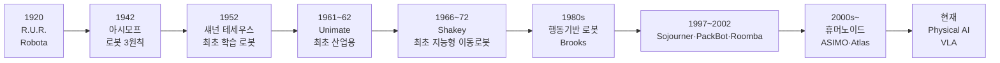
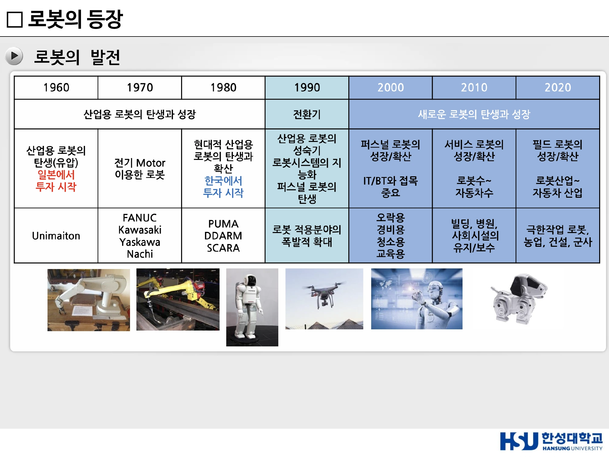
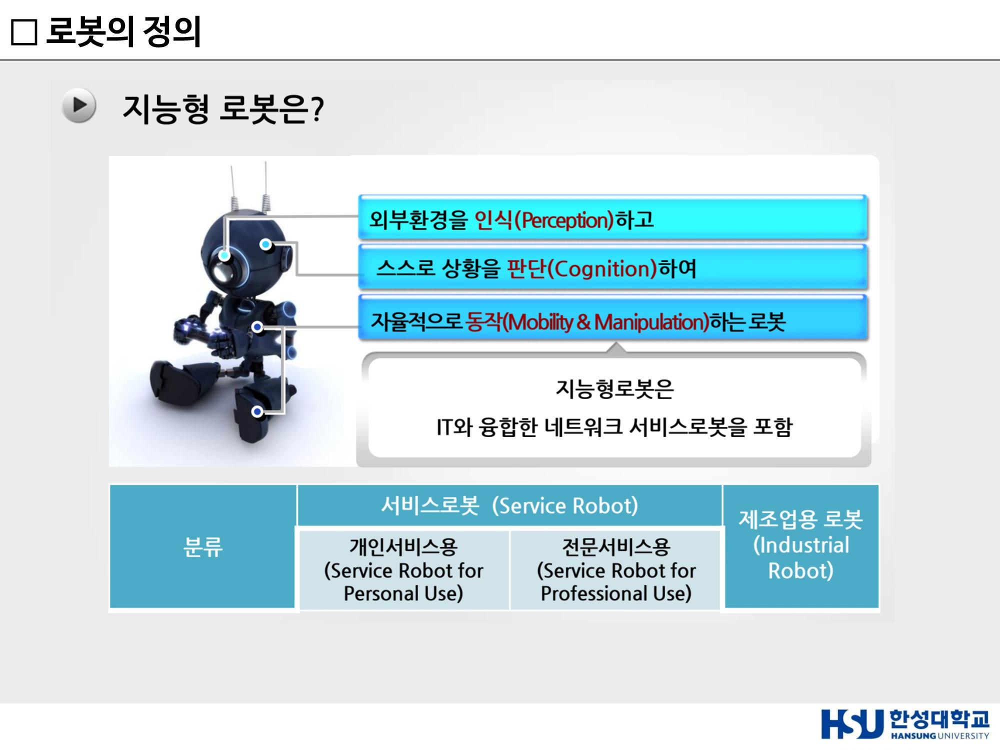
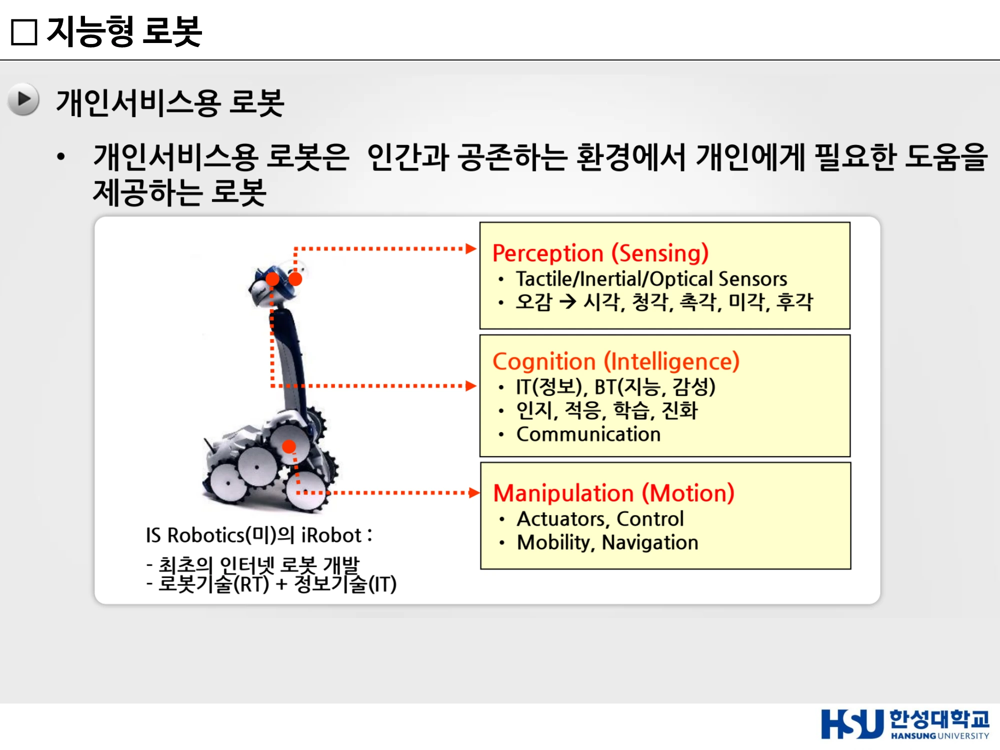
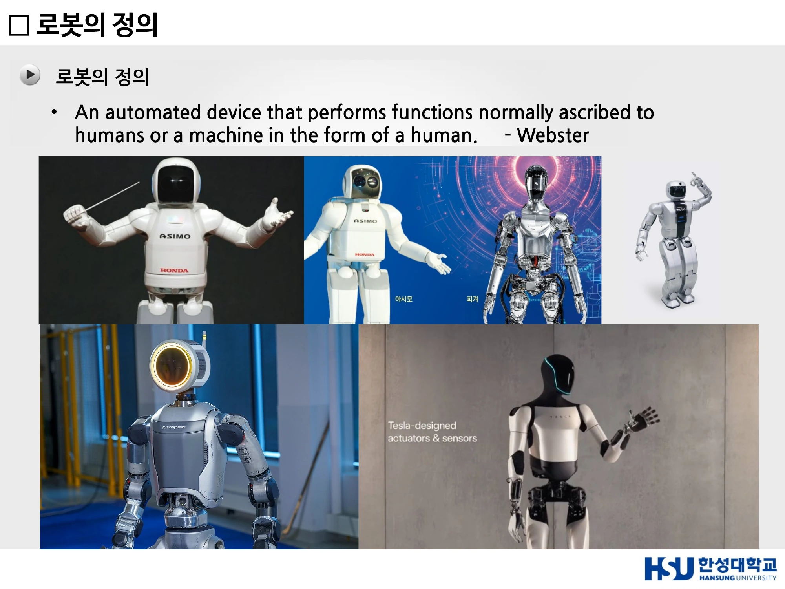

# 13주차 · 로봇의 등장과 산업용 로봇

> 🔗 **강의 흐름** — 12주차에서 "왜 지금 로봇인가"를 봤다. 이번 주는 **로봇이 무엇이고 어떻게 여기까지 왔는가**를 연표로 훑고, 실제 산업 현장에서 쓰이는 로봇의 종류를 구분한다.

> **학습목표** — 로봇의 어원과 3원칙을 설명하고, 로봇공학의 시대별 패러다임 변화를 서술하며, 로봇의 협의·광의 정의와 지능형 로봇의 개념을 구분하고, 산업용 로봇 6종의 특징을 비교할 수 있다.

> 💡 **기초 다지기** — **로봇(Robot)의 어원은 '강제 노동'이다.** 체코어 **Robota**에서 왔고, 1920년 카렐 차페크의 희곡에서 처음 등장했다. 처음부터 로봇은 **"인간을 대신해 힘든 일을 하는 존재"**로 상상되었고, 그 희곡의 결말은 로봇이 인간을 몰살하는 비극이었다. 로봇 윤리 논의가 100년째 이어지는 이유다.

## 🗺️ 한눈에 보는 개념도

## 1. 로봇의 어원

**원래 로봇이란?**

- 체코의 유명한 극작가 **카렐 차펙(Karel Čapek)**이 **1920년**에 쓴 희곡 **「R.U.R. (Rossum's Universal Robots)」**에서 소개
- 로봇의 어원은 **Robota**로 체코어로 **강제적 노동, 노역, 일하는 사람**을 뜻한다
- 이 희곡은 **로봇들이 자신들의 창조주인 인간을 전부 살해하게 되는 비극**을 인상적으로 묘사한 것으로, 다가올 기계문명 사회 속에서 **인간 대 기계와의 관계를 예견**하였다는 점에서 높이 평가되고 있다
- 로봇이라는 말이 탄생하기 이전부터 **「자동인형(Automata)」**, **「살아 움직이는 인형(Animated Doll)」** 등의 말로 로봇의 개념은 이미 널리 알려져 있었다. 여기에는 19세기 막바지에 발명돼 20세기 초부터 광범위한 대중적 영향력을 행사한 **영화의 힘**이 크게 작용하였다

## 2. 아시모프의 로봇 3원칙

**1942년 Isaac Asimov의 단편소설 「Runaround」**에서 제시. 로봇이 인간과 공존하기 위한 **윤리적·안전적 기준**을 제안했으며, 현대 로봇공학과 AI 윤리 논의의 출발점으로 평가된다.

| 원칙 | 내용 |
|---:|---|
| **제1법칙 — 인간 보호** | 로봇은 인간에게 해를 가해서는 안 된다 |
| **제2법칙 — 명령 복종** | 인간의 명령에 따라야 한다. 단, **제1법칙에 위배되는 경우는 제외** |
| **제3법칙 — 자기 보호** | 자신의 존재를 보호해야 한다. 단, **제1·제2법칙에 위배되어서는 안 된다** |

**현대적 의미** — AI 윤리(Ethics) / 안전성(Safety) / 자율성(Autonomy) / 인간-로봇 협업(HRI) / **신뢰성(Trustworthy AI)**

## 3. 로봇공학 연표 — 시대별 패러다임 변화

| 시기 | 패러다임 |
|---|---|
| **1960년대** | 최초의 산업용 로봇 **Unimate** 등장, 공장 자동화 시작. **유압** 방식. **일본에서 투자 시작** |
| **1970~1980년대** | 산업용 로봇 보급 확대, 자동차·제조업 생산성 혁신. **전기 Motor 이용**. **FANUC, Kawasaki, Yaskawa, Nachi** |
| **1980~1990년대** | 현대적 산업용 로봇의 탄생과 확산. **PUMA, DDARM, SCARA**. **한국에서 투자 시작**. 공장 밖 환경에서 동작하는 **이동로봇(Mobile Robot)** 연구 활성화 |
| **1990년대 (전환기)** | 산업용 로봇의 성숙기, 로봇시스템의 지능화, **퍼스널 로봇의 탄생**. 로봇 적용분야의 폭발적 확대. 의료·서비스 로봇 등장 |
| **2000년대** | **퍼스널 로봇의 성장/확산**. IT/BT와 접목 중요. 오락용·경비용·청소용·교육용. 인간과 함께 작업하는 **협동로봇(Cobot)** 및 소프트로봇 개발 |
| **2010년대** | **서비스 로봇의 성장/확산**. 로봇 수 ~ 자동차 수. 빌딩·병원·사회시설의 유지/보수 |
| **2020년대** | **필드 로봇의 성장/확산**. 로봇산업 ~ 자동차 산업. 극한작업 로봇, 농업·건설·군사 |
| **현재** | AI 기반 **휴머노이드 로봇**, 생체모사 로봇, **Physical AI** 로봇 시대로 진입 |

> **로봇 기술의 진화 방향: 자동화 → 이동성 → 서비스 → 협업 → 지능화**

### 주요 이정표 상세

| 연도 | 사건 |
|---|---|
| **1952** | **클로드 섀넌(Claude Shannon)** — 세계 최초의 학습 로봇 **'테세우스(Theseus)'** 개발. 미로를 탐색하며 경험을 기억하고 최적 경로를 학습하는 개념 제시. 현대 머신러닝과 자율주행 로봇의 시초로 평가. *(다만 눈속임이 있었다 — 로봇공학 기술이 없을 때라 쥐는 장식이고 실제로는 기계 하판의 자석 방식 회로가 쥐를 이동시킨 것)* |
| **1977** | **IEEE**가 클로드 섀넌의 테세우스에서 아이디어를 얻어 **로봇 쥐가 미로를 탈출하는 대회(Micromouse)** 발표 |
| **1979** | **세계 최초의 마이크로마우스 대회** 개최 — 로봇이 스스로 환경을 인식하고 최적 경로를 탐색하는 **자율주행 기술의 출발점** |
| **1961~62** | **Unimate** — 세계 최초의 산업용 로봇, 자동차 생산라인에 적용. 반복적이고 위험한 작업을 자동화하며 제조업 혁신 |
| **1966~72** | **Shakey the Robot** (미국 SRI, Stanford Research Institute) — 세계 최초로 **인지(Perception)·추론(Reasoning)·행동(Action)** 기능을 통합한 모바일 로봇. TV 카메라·거리 센서·범퍼 센서로 환경 인식, 스스로 목표를 설정하고 경로를 계획하는 초기 AI 로봇. **산업용 → 지능형 로봇으로 패러다임 전환**, 자율주행 및 **경로계획(Path Planning) 기술의 시초** |
| **1980년대** | 로봇이 공장을 벗어나 **비정형(Unstructured) 환경**에서 활동 시작. **Rodney Brooks(MIT)**의 **행동기반 로봇(Behavior-Based Robotics)** — 복잡한 중앙 제어 없이 센서와 행동의 직접 연결로 자율 행동 구현. 생체모사(Bio-inspired) 로봇 **Genghis**. **"생각 후 행동" → "행동하면서 적응"** 패러다임 전환. iRobot·Roomba의 출발점 |
| **1994** | **CyberKnife** — 세계 최초의 로봇 기반 방사선 수술 시스템. 로봇 팔 + 선형가속기(LINAC). **FDA 승인**으로 의료 로봇 시대 개막. 실시간 영상 추적으로 환자 움직임에도 정확한 치료, 비침습적(Non-invasive) |
| **1997** | **Sojourner** — NASA Mars Pathfinder 임무, 최초의 화성 탐사 로버. 지구–화성 통신 지연으로 **반자율(Semi-Autonomous)** 방식. 이후 Spirit·Opportunity·Curiosity·Perseverance의 기반 |
| **1998~2001** | **iRobot PackBot** — DARPA와 협력 개발 시작(1998), **2001년 9·11 세계무역센터(WTC) 붕괴 현장 수색·구조 임무에 실제 투입**. 이동 플랫폼 + 로봇 팔 결합 → **"이동" 중심에서 "작업" 가능한 로봇으로 진화**. 현대 UGV·국방 로봇·재난 구조 로봇의 기반 |
| **2000** | **da Vinci 수술로봇** — 최소침습수술(MIS)을 위한 복강경 수술 로봇. SRI International 연구 기반, Intuitive Surgical 설립. **FDA 승인**. 의사의 손동작을 정밀 재현, 3D 고해상도 영상과 손 떨림 보정. **"로봇이 인간을 대체하는 것이 아닌 의사를 보조하는" 패러다임** 제시 |
| **2002** | **Roomba** (iRobot) — 세계 최초의 대중적 청소로봇. 산업·군사용에서 **가정용 서비스 로봇으로 패러다임 전환** |
| **2011** | **후쿠시마 원전 사태** — **유일하게 현장에서 작업을 한 로봇 = PackBot** (Endeavor Robotics, 전 iRobot) |

!!! info "IEEE의 탄생"
    - **AIEE** (American Institute of Electrical Engineers) — 1884년 설립, 전력·발전기·송전·전기기기. 대표 인물 Thomas Edison, Nikola Tesla
    - **IRE** (Institute of Radio Engineers) — 1912년 설립, 무선통신·전자공학(레이더·반도체·전자회로·컴퓨터)
    - 1960년대 들어 전기공학 + 전자공학 + 컴퓨터공학의 경계가 사라지면서 → **AIEE + IRE = IEEE (1963)**

> ▲ 로봇의 발전 연표 — 1960s 산업용 로봇 탄생·성장 → 1990s 전환기 → 2000s 이후 새로운 로봇의 탄생과 성장 *(출처: 13주차 슬라이드 p3)*

## 4. 서비스 로봇 성공의 조건

!!! success "로봇 성공의 핵심 공식"
    $$\textbf{고객가치} = \text{편의성} + \text{시간절약} + \text{안전성} \;>\; \text{비용} + \text{불편함} + \text{학습부담}$$

- 로봇의 성공은 **기술 수준보다 고객 가치(Customer Value)**에 의해 결정된다
- 사용자가 느끼는 **편의성이 비용과 불편함보다 커야** 시장이 형성된다
- 기술 혁신보다 **실제 문제 해결**이 중요하다
- 사용하기 쉽고 **유지보수가 간편**해야 대중화 가능
- 로봇은 인간의 **시간을 절약하고 삶의 질을 향상**시켜야 한다
- 서비스 로봇 시장은 **경제성 + 편의성 + 신뢰성의 균형**이 핵심

**Roomba의 성공 요인** — 생활 속 문제 해결 / 저렴한 가격 / 쉬운 사용성 / 유지관리 편의성 / 명확한 고객 가치 제공
**사례** — 로봇청소기(Roomba), 서빙로봇, 물류배송로봇, 잔디깎이 로봇

### 서비스·모바일 로봇 성공의 핵심 기술

$$\text{센싱(Sensing)} \to \text{인지(Perception)} \to \text{지능(Intelligence)} \to \text{판단(Decision)} \to \text{구동(Actuation)} \to \text{행동(Action)}$$

- **센싱** — 주변 환경과 사람을 인식하는 기술
- **지능** — 정보를 분석하고 판단하는 기술
- **구동** — 판단 결과를 실제 행동으로 수행하는 기술

> 최근 AI 발전으로 센싱과 지능 기술이 급속히 향상되었다. 최종적으로 **로봇의 가치는 실제 행동(Action)으로 구현될 때 완성**된다.

## 5. 로봇의 정의

**Webster 사전** — *"An automated device that performs functions normally ascribed to humans, or a machine in the form of a human."*

**강의 정의** — **컴퓨터에 의해 동작하는 장치**

| 범위 | 분류 | 예 |
|---|---|---|
| **협의의 로봇 개념** | **산업용 로봇** | 로봇 팔: 직교, SCARA, 수직다관절 로봇 등 / **무인 반송차(AGV)** |
| | **비산업용 로봇** | **Humanoid 로봇, Toy 로봇, 의료용 로봇** 등 |
| **광의의 로봇 개념** | 자동화 제조장비 | CNC장비, SMT, 반도체, LCD, PDP, 광부품, 바이오 제조장비 등 |
| | 군사장비 | 무인비행기, 무인전투차량 |
| | 상품 | 프린터, 자동세탁기, HDD, DVD |

### 로봇 응용 분야의 확산

| 분야 | 1970 → 2010 확산 |
|---|---|
| **제조용** | 자동차용 → 전자조립, SMD → 반도체·LCD·PDP장비, 광부품 → 바이오·Nano |
| **비제조용** | 심해용, 농업용 → 발전소용, 경비용 → 우주용, 군사용 |
| **서비스용** | 병원용 → 가정용, 오락용, 청소용, 안내용 → **Humanoid**, 노인·장애인용 |

### 지능형 로봇

!!! success "정의 — 반드시 외울 것"
    **지능형 로봇 = 외부환경을 인식(Perception)하고, 스스로 상황을 판단(Cognition)하여, 자율적으로 동작(Mobility & Manipulation)하는 로봇**
    지능형 로봇은 **IT와 융합한 네트워크 서비스로봇을 포함**한다.

**분류**

| 서비스로봇 (Service Robot) | | 제조업용 로봇 |
|---|---|---|
| **개인서비스용** (Service Robot for Personal Use) | **전문서비스용** (Service Robot for Professional Use) | (Industrial Robot) |

**전통적 로봇 vs 지능형 로봇**

| 전통적 로봇 | 지능형 로봇 |
|---|---|
| 제조 현장의 반복 작업 자동화 | 사람과 함께 생활하고 협업 |
| 인간 노동 대체를 목표로 발전 | 환경을 인식하고 스스로 판단 |
| **정형화된 환경**에서 동작 | **비정형 환경**에서 자율적으로 동작 |
| 생산성 및 품질 향상에 집중 | 인간의 삶의 질 향상에 기여 |
| 산업용 로봇 중심 | 서비스·의료·휴머노이드 로봇 중심 |

> 과거의 로봇은 인간을 **대체**하기 위해 개발되었지만, 미래의 로봇은 인간과 **공존하며 삶을 지원**하는 방향으로 발전하고 있다.
> 변화의 원인 — 환경 변화(Environment Change), 기술 혁신(Technology Innovation), 사회적 요구(Social Needs) 증가, AI·디지털 기술 발전, 고령화·노동력 부족.

> ▲ 지능형 로봇 = 외부환경을 인식(Perception)하고 스스로 상황을 판단(Cognition)하여 자율적으로 동작(Mobility & Manipulation)하는 로봇 *(출처: 12주차 슬라이드(덱 20) p36)*

### 개인서비스용 로봇의 3축

**개인서비스용 로봇** = 인간과 공존하는 환경에서 개인에게 필요한 도움을 제공하는 로봇

| 축 | 세부 |
|---|---|
| **Perception (Sensing)** | Tactile / Inertial / Optical Sensors — 오감(시각·청각·촉각·미각·후각) |
| **Cognition (Intelligence)** | IT(정보) + BT(지능, 감성) — 인지·적응·학습·진화, Communication |
| **Manipulation (Motion)** | Actuators, Control — Mobility, Navigation |

**사례** — IS Robotics(미)의 **iRobot**(최초의 인터넷 로봇 개발, 로봇기술(RT) + 정보기술(IT)), Amazon **Astro**, LG **CLOi**, X Sense Robot(바둑), 로봇청소기.

> ▲ 개인서비스용 로봇의 3축 — Perception(Sensing) / Cognition(Intelligence) / Manipulation(Motion) *(출처: 12주차 슬라이드(덱 20) p38)*

### 로봇은 미래 핵심 성장 동력

| 관점 | 내용 |
|---|---|
| **21세기 대표 End-User 제품** | 산업용 로봇 → 생활형 서비스 로봇으로 진화. 인간과 공존하며 다양한 서비스 제공. AI 시대의 대표 소비자 제품으로 성장 |
| **메가트렌드의 핵심 해결책** | 고령화 사회 대응 / 노동력 부족 문제 해결 / 삶의 질 향상 / 개인화·지능화·모바일화 서비스 실현 |
| **대한민국의 기회** | 세계 최고 수준의 ICT 및 제조 인프라 보유 / 로봇 서비스 도입에 적합한 생활환경 / AI·반도체·통신 기술과의 시너지 가능 |

> ▲ 로봇의 정의(Webster) — "An automated device that performs functions normally ascribed to humans, or a machine in the form of a human." *(출처: 12주차 슬라이드(덱 20) p33)*

## 6. 산업용 로봇 — 작업 영역에 따른 분류 6종

| 종류 | 특징 |
|---|---|
| **직교 좌표형 로봇** | **간단한 기구학, 구성이 쉬움** |
| **원통형 로봇** | **장애물 회피가 용이, 기구 설계 간단** |
| **구형 로봇** | 구면 좌표계 기반 |
| **SCARA 로봇** | **S**elective **C**ompliance **A**ssembly **R**obot **A**rm (선택적 유연 조립 로봇 팔). **고속 작동, 설치 단순, 정밀성 우수. 조립 작업에 많이 적용** |
| **수직다관절 로봇** | **운동 자유도 높음 → 용접, 이동, 조립 등 가장 넓게 사용됨** |
| **이동형(Mobile) 로봇** | **물류 시스템에 주로 사용**. Service 로봇 응용 분야로 확대 |

!!! tip "암기 포인트"
    - **SCARA** = 조립 전용, 고속·정밀
    - **수직다관절** = 가장 범용적(용접·이동·조립)
    - **원통형** = 장애물 회피 유리

> **로봇의 구조에 따라 로봇 작업의 동작이 달라지게 됩니다.**

### 용도별 산업용 로봇

| 용도 | 내용 |
|---|---|
| **용접용 로봇** | 용접 작업은 노동집약적이고 열악한 환경 |
| **조립용 로봇** | 생산성, 조립 정밀도 향상 → 중요도 증대. **Turret Head**(최대 6개의 다양한 툴 장착), **Auto Tool Changer**(혼류 생산 중 툴 자동 교체), **COVRA**(Automatic Vibration Alignment Unit — 진동으로 소형 부품을 트레이에 정렬) |
| **조립용 로봇(정밀)** | 초정밀 부품, 반도체 부품 조립 — Chips on Wafer, CSP Bonding, MicroBGA, Simultaneous Recognition, Bonding Force Control, Bonding Position Inspection, Lead Frame Inspection |
| **도장용 로봇** | 열악한 작업 환경, 균일한 품질 |
| **검사용 로봇** | 카메라, laser, 초음파 등 sensor 활용. **X-ray sensor** 활용(BGA·PCB X-ray Inspection, Solder Bridge / Excessive Solder / Insufficient Solder 판별, 3D Image) |
| **이송용 로봇** | **3D 작업**, 노동법상 기계가 수행 |
| **이송용 로봇(반도체)** | 반도체 물류 자동화 → 생산성 향상 핵심 (Samsung FARA RMO-1T, RMO-1L) |

!!! quote "핵심"
    **"현재 로봇 시장에서 가장 큰 비중을 차지하고 있는 분야는 제조업용 로봇이다."**

**산업 제조용 로봇의 예** — 공장용(3D 부분): 용접, 조립, 물류이동, 검사용, 진공용, 클린룸용, 반도체, LCD, PDP 등

**첨단 제조업용 로봇** — 일본 야스카와의 **10대의 로봇이 동시에 작업**하는 사례. 작업물의 형상이 비록 변하더라도 이에 **별도의 Jig나 로봇의 재배치 없이 작업이 가능**하다.

**첨단 정밀 제조업용 로봇** — 제조장비: 연료전지, 광부품 제조용, 반도체 장비 (LD(PD) Align장비, 광부품조립장비)

> **2025 하노버산업박람회(Hannover Messe)** 키워드 — #AI #산업자동화 #스마트제조 #디지털트윈 #지속가능성 #디지털전환 #수소 #협동로봇

!!! quote "지능형 로봇 산업"
    **"제4차 산업혁명, 새로운 제조 환경에서 로봇은 가장 핵심적인 도구입니다."**

## 7. 휴머노이드 로봇의 흐름 (14주차 예고)

| 시기 | 내용 |
|---|---|
| **2000년대 휴머노이드** | 인간을 위한 작업환경에서 활용 가능 — **Honda ASIMO** |
| **최근 휴머노이드** | **Atlas** (Boston Dynamics, 2016) — 험지 보행·파쿠르 / **Tesla bot** (Tesla, 2022) / 중국 휴머노이드 격투 시연 |
| **비정형 환경 로봇 연구** | **후쿠시마 원전 사태** — 유일하게 현장에서 작업한 로봇 = **PackBot** |
| **2000년대 생체모사 로봇** | 자연에 존재하는 다양한 과학적 원리를 로봇에 응용하는 패러다임 |
| **2010년대 소프트 로봇** | 유연 소재의 적응성으로 인간과 조화를 이루는 로봇으로 발전 — 유연한 소재를 사용하여 적응력이 좋고 안전한 로봇 |
| **현재의 로봇** | **자율주행과 드론** — 로봇 & 비정형(정해지지 않은) 환경 사이의 상호작용을 위해서는 **패러다임의 진화가 필요함** |

## 8. 중국 휴머노이드 / 로봇 기업 VLA 모델 비교 (2025)

> **VLA** = **Vision-Language-Action Foundation Models**. 카메라로 보고(Vision), 말로 지시받고(Language), 몸으로 실행하는(Action) 통합 모델.
> *자료: PARC Lab · 한성대학교 미래모빌리티학과 · 2025*

### 6개 기업 비교

| 회사 | 대표 모델 | VLA | 기반 LLM | 모델 규모 | 언어 | 가격대 | 특이사항 / HW |
|---|---|:--:|---|---|---|---|---|
| **X Square Robot** | X1 / 15B(개발 중) | **◎** | π₀ 경량화 / QWEN LLM | 1.5B → 15B | 중/영 (한국어 ✕) | 60~80만 RMB | **Foundation 전략** · GPU 10만장 임대 · 200명 3교대 Dataset 수집 |
| **UBTECH** | TianGong | **○** | QWEN LLM | 미공개 | 중/영 (한국어 ✕) | USD 56~90K | 교육용 휴머노이드 (Walker S2는 산업 E2E, USD 170K) |
| **Unitree** | G1 / B1 | ✕ | — | — | — | USD 50~53K | NVIDIA Jetson Orin · LIVOX 3D LiDAR · 범용 SDK 생태계 |
| **Booster Robotics** | T1 / K1 | ✕ | — | — | — | USD 15~45K | NVIDIA / Qualcomm C8550 — Qualcomm 버전 TOPS 성능 저조 |
| **DEEP Robotics** | X30 / M20 | ✕ | — | — | — | USD 45~85K | RK3588 · On-Device 추론 · **중국 4족 시장 점유율 85%+** |
| **Robint** | 인도공항 서비스 로봇 | ✕ | — | — | — | 80K RMB | LG 클로이 유사형 · 휴머노이드 출시 계획 없음 |

> ◎ VLA Foundation 개발 / ○ VLA 적용 / ✕ VLA 미적용(HW 플랫폼 중심)
> **공통 갭: VLA 보유 2개사 모두 QWEN 기반 → 한국어 미지원**

### X Square Robot — VLA Foundation 전략

중국판 Physical Intelligence(π₀) + OpenVLA 통합 노선.

| 축 | 내용 |
|---|---|
| **MODEL SCALING** | **1.5B → 15B**. π₀ 3.3B 대비 50% 경량화한 X1(1.5B) 상용 출시, 15B Foundation 모델 개발 중(10배 스케일업) |
| **GPU INFRASTRUCTURE** | **10만 장** (~2억 RMB/년). GPU 대여 기반 학습 인프라, 중국 정부·클라우드 자원 활용 |
| **DATA COLLECTION** | **200명 × 3교대, 4,000m² 시설**. 전문 인력의 모방학습 Dataset. 참관 불가(블랙박스 운영) |

**제품 포트폴리오** — X1(교육용 VLA 휴머노이드, 1.5B, 60만 RMB) / X2(자체 학습용 본체, 80만 RMB, DJI 출신 HW 개발자, **2족 보행 미지원**) / 15B(개발 중) / Hands(정밀 조작 액추에이터, **20 DoF · 15 액추에이터**, 31개 정밀 동작, 촉각 센서 내장, 20만 RMB)

### 핵심 시사점 & 한국 진입 전략

| # | 시사점 |
|---:|---|
| **01** | **VLA 모델 보유는 2개사뿐** — 나머지 4개사는 HW/플랫폼 중심. VLA는 협력 파트너의 2차 개발 영역으로 남겨둠 → **SW 차별화 여지 존재** |
| **02** | **X Square의 공격적 Foundation 전략** — π₀ 3.3B → 1.5B 경량화 상용화, 15B QWEN 기반 Foundation + GPU 10만장 + 200명 Dataset 수집 = 사실상 π₀ + OpenVLA 통합 노선 |
| **03** | **한국어 미지원이 공통 갭** — UBTECH·X Square 모두 QWEN 기반. **LoRA 한국어 어댑터 / Fine-tuning** 개발이 차별화 포인트 |
| **04** | **진짜 해자는 데이터 인프라** — 북경 휴머노이드 훈련센터: **2개월간 15,231 episode 수집 → 약 31억원 데이터 자산화**. 5개 도시 확장 → 모방학습 dataset의 표준화·산업화·거래화 |

!!! quote "STRATEGIC TAKEAWAY"
    **모델 자체보다 '한국어 VLA Foundation + 국산 Dataset 인프라' 동시 구축이 한국의 비대칭 우위**

### CES 2026 — 휴머노이드가 핵심 주제

| 구분 | 내용 |
|---|---|
| **전체 흐름** | 휴머노이드 로봇이 CES 2026의 핵심 주제로 부상 — 산업용 중량물 작업부터 가사 도우미까지. 엔비디아 CEO 키노트에서 **'Physical AI'**를 핵심 테마로 제시(자율주행 + 휴머노이드). 가정용보다 **산업용 시스템이 더 두각** — 생성형 AI 붐과 엔비디아 Jetson 확산이 맞물린 결과 |
| **Boston Dynamics** | **전기식 Atlas** 양산형 첫 공개. **56 자유도, 7.5피트 도달 거리, 110파운드(약 50kg) 적재**. Google DeepMind의 **Gemini Robotics AI 통합** → 복잡한 지시 추론 가능. 초기 물량은 **2026년 조지아주 현대차 메타플랜트**에 배치 예정 |
| **NVIDIA** | 휴머노이드용 비전언어모델 **'Gr00t'**(센서 입력→신체 제어), 추론·계획용 **'Cosmos'** 모델 공개 |
| **LG** | **CLOiD** — 가정용 동반자 로봇 |
| **중국 기업** | 휴머노이드 전시의 상당 부분 차지. **Unitree** G1·H2·R1 전 라인업(G1은 고속 무술·복싱 동작 시연, **Robot-as-a-Service** 모델로 전환, 약 **70억 달러 가치로 IPO 추진 중**), ROBOTERA·AgiBot·Galbot·Engine AI·Noetix·X-Humanoid |
| **가정/서비스** | Switchbot **Onero H1**(Engadget 'CES 2026 베스트 로봇'), Fourier **GR-3**, ROBOTERA **L7**(마사지 시연), **Sharpa**(탁구·블랙잭 로봇 손), **Realbotix**(얼굴 추적·감정 인식) |

## 🤔 생각해 봅시다

1. **기말 5번 연습** — "로봇 기술이 인류 문제 해결에 기여하는 사례로 보기 어려운 것"의 정답은 **개인 맞춤형 엔터테인먼트 로봇**이다. 왜 그런가? 엔터테인먼트 로봇은 가치가 없는가, 아니면 "인류 문제 해결"이라는 기준에 안 맞는 것인가?
2. 아시모프의 3원칙은 오늘날 자율주행차의 윤리 문제(트롤리 딜레마)에 그대로 적용 가능한가? 부족한 점은?
3. 중국 휴머노이드 기업 6곳 중 4곳이 VLA 없이 HW만 하는 이유는? 한국 기업은 어느 층위를 노려야 하는가?

## ✅ 이번 주 체크리스트

- [ ] Robota의 어원과 R.U.R.(1920, 카렐 차페크)을 안다
- [ ] 로봇 3원칙을 순서대로 말할 수 있다
- [ ] Unimate·Shakey·Roomba·PackBot의 의의를 각각 한 줄로 말할 수 있다
- [ ] 로봇의 협의/광의 정의를 구분할 수 있다
- [ ] 지능형 로봇의 정의(인식-판단-동작)를 외웠다
- [ ] 산업용 로봇 6종과 SCARA·수직다관절의 용도를 안다
- [ ] VLA가 무엇의 약자인지 안다

---

▶️ **다음 주 예고** — 마지막 주제. 휴머노이드는 **어떻게 걷는가**. 유압과 전기 모터의 대결, 다리에 왜 6개의 관절이 필요한가, 그리고 NVIDIA가 만드는 **모션 생성 AI**. → [14주차](week14.md)
