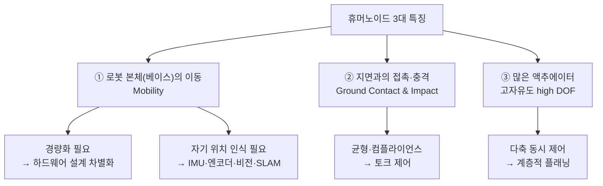
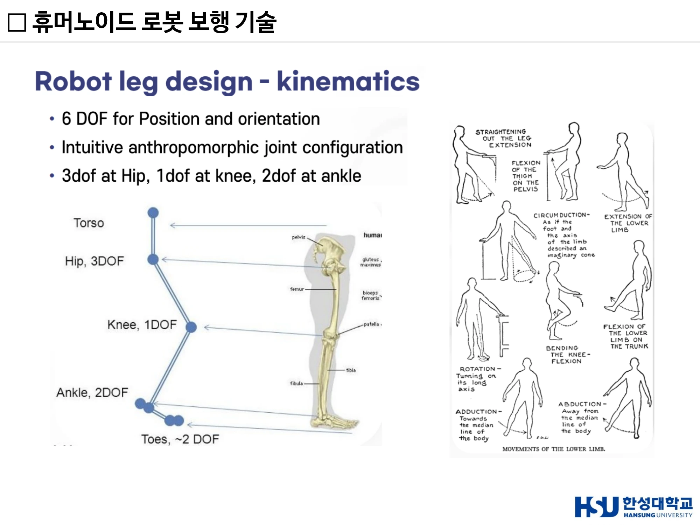
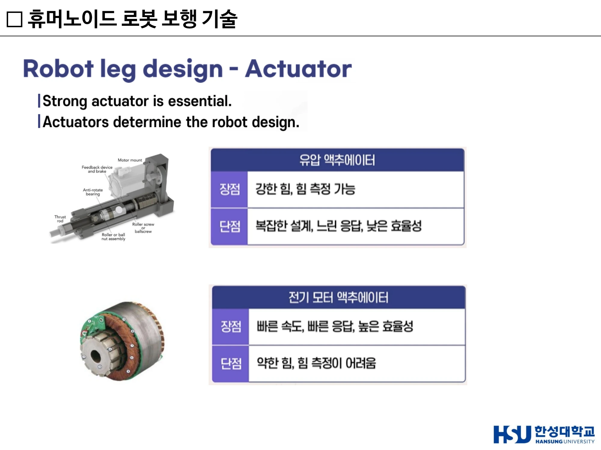
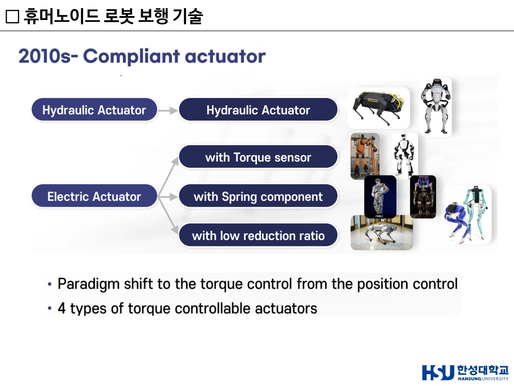
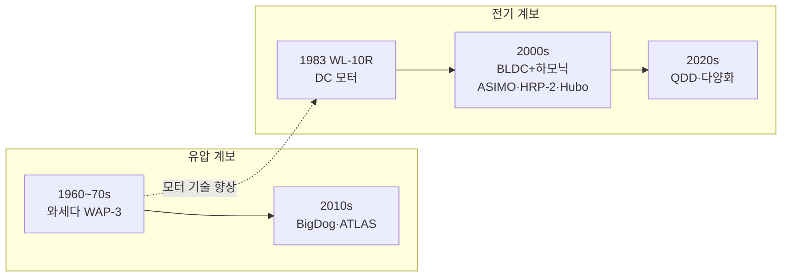
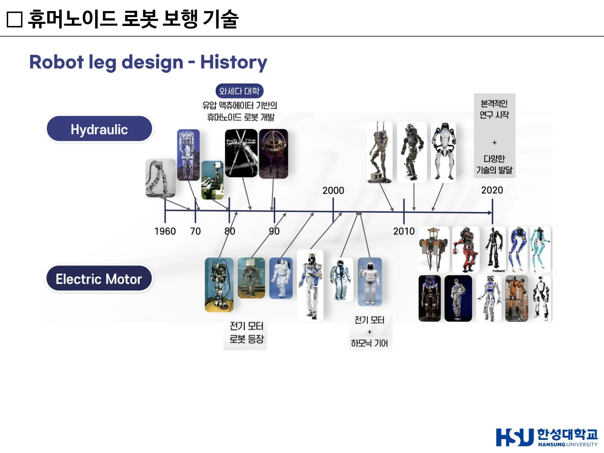
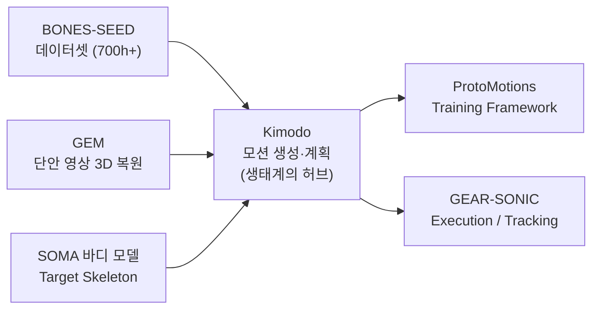

# 14주차 · 휴머노이드 보행과 Physical AI

> 🔗 **강의 흐름** — 15주 여정의 마지막 주제. 자율주행에서 "센서 → AI → 액추에이터"를 배웠고, 드론에서 "구조와 동력"을 배웠다. 휴머노이드는 **그 모든 것이 하나의 몸에 들어간 문제**다. 그리고 그 몸을 어떻게 움직일지 가르치는 것이 **Physical AI**다.

> **학습목표** — 휴머노이드 로봇의 공학적 특징 3가지를 설명하고, 유압과 전기 액추에이터를 비교하며, 토크 제어 기반 액추에이터 4종의 원리·장단점을 서술하고, 모션 플래닝·제어 설계 시 고려사항을 논할 수 있다.

> 💡 **기초 다지기** — **산업용 로봇 팔은 바닥에 고정되어 있다.** 어깨·팔·손목만 움직인다. 그런데 휴머노이드는 **베이스(몸통) 자체가 움직인다.** 이 한 가지 차이 때문에 ① 경량화가 필수가 되고 ② 자기 위치를 스스로 알아야 하고 ③ 넘어지지 않는 균형 제어가 필요해진다.

## 🗺️ 한눈에 보는 개념도

## 1. 휴머노이드 로봇의 주요 특징

**산업용 로봇 vs 휴머노이드**

| 산업용 로봇팔 | 휴머노이드 |
|---|---|
| **베이스(base) 고정** → 어깨·팔·손목만 동작 | **베이스 자체가 이동** → 전신이 움직이는 구조 |

**주요 특징 3가지**

| # | 특징 | 파생 요구사항 |
|---:|---|---|
| ① | **로봇의 이동 (Mobility)** — 로봇 본체(베이스)가 직접 이동. 고정형이 아닌 자가 이동형 시스템 | **경량화(Lightweight)** — 액추에이터, 전자장치, 컴퓨터, 센서, 배터리 전부. 경량 소재·구조 최적화·고출력 밀도 액추에이터 **위치 인식(Self-Localization)** — IMU, 엔코더, 비전/LiDAR, SLAM |
| ② | **지면과의 접촉 및 충격 (Ground Contact & Impact)** — 보행 중 발이 지면과 지속적으로 접촉·충돌 | 착지 충격·외란을 견디고 **균형 유지** 필요 |
| ③ | **많은 액추에이터 (Many Actuators)** — 다수의 관절 → **고자유도(high DOF)** 구조 | **다축 동시 제어** 요구 |

**기술 구성 3대 축** — **Hardware**(액추에이터·구조·기구 설계) / **Control**(균형·보행·힘 제어) / **Planning & AI**(경로 계획·의사결정·지능)

## 2. 다리 운동학 — 왜 6 DOF인가

!!! success "핵심 설계 원칙"
    **위치 + 자세(orientation) 제어를 위해 다리당 6 DOF 필요.** 인체 모사형(anthropomorphic) 관절 배치 → 직관적·자연스러운 설계.

| 관절 | DOF | 세부 |
|---|---:|---|
| **Hip (고관절)** | **3** | 굴곡/신전(앞뒤), 외전/내전(좌우), 회전(축 방향) — 다리의 방향을 3차원으로 설정 |
| **Knee (무릎)** | **1** | 굴곡/신전 단일 회전 — 다리 길이(보폭·높이) 조절 |
| **Ankle (발목)** | **2** | 굴곡/신전(피치), 내번/외번(롤) — 발바닥 자세·지면 접촉 적응 |
| **(참고) Toes (발가락)** | ~2 | 추진력·균형 보조 |
| **합계** | **6 DOF** | |

**왜 6 DOF인가**

- 공간상 강체 **위치** 결정 = 3개 (x, y, z)
- **자세** 결정 = 3개 (roll, pitch, yaw)
- → 발(foot)을 원하는 **위치·방향에 자유롭게 두려면 최소 6 DOF** 필요

> ▲ Robot leg design – kinematics — Hip 3 DOF + Knee 1 DOF + Ankle 2 DOF = 6 DOF *(출처: 14주차 슬라이드 p9)*

## 3. 액추에이터 — 로봇 설계 전체를 결정한다

!!! quote "핵심 명제"
    **"강한 액추에이터가 필수(Strong actuator is essential)."**
    **"액추에이터가 로봇 설계 전체를 결정한다(Actuators determine the robot design)."**
    → 어떤 구동기를 쓰느냐가 **구조·무게·제어 방식을 좌우**한다.

### 유압 vs 전기 모터

| 구분 | **유압 액추에이터 (Hydraulic)** | **전기 모터 (Electric Motor)** |
|---|---|---|
| **장점** | 강한 힘(**고출력 밀도**) → 큰 토크·하중 대응 **힘 측정 가능** → 압력으로 출력 파악, 힘 제어 용이 | **빠른 속도, 빠른 응답** → 정밀·민첩한 제어 **높은 효율성** → 배터리 구동에 유리 |
| **단점** | **복잡한 설계**(펌프·밸브·배관 등 부대 장치 多) **느린 응답**(유체 거동 한계) **낮은 효율성**(에너지 손실·발열) | **약한 힘** → 감속기로 토크 보완 필요 **힘 측정이 어려움** → 별도 토크/전류 센싱 요구 |

### 유압 액추에이터의 작동 원리

- 고압 유체(액체)의 흐름을 제어해 구동력 발생
- **스풀 밸브(spool valve)**가 유로를 열고 닫음 → 메인 피스턴 이동 → 출력 변위(Load 구동)
- 입력 변위(밸브) → 출력 변위(피스턴)로 힘·운동 전달
- **시스템 구성** — 메인 실린더 + 메인 피스턴(실제 힘 발생부) / 스풀 밸브(유량·방향 제어) / 고압 펌프 + 탱크(sump로 환류)

**핵심 특징 4가지**

1. 고압 유체 흐름 제어로 구동
2. 고압 유체 생성을 위해 **펌프 필수** → 부피·무게·소음 부담
3. **소형(miniature) 상용 제품 부족** → 휴머노이드 소형화의 걸림돌
4. **힘 제어가 위치 제어보다 쉬움** → 압력으로 출력 직접 측정·조절

### 전기 모터 + 하모닉 감속기

| 요소 | 역할 |
|---|---|
| **BLDC 모터** | 스테이터 권선 + 로터 → 회전력 발생. **고속 + 저토크** — 빠르게 돌지만 출력 토크는 작음 |
| **하모닉 감속기(Harmonic reducer)** | **토크 증폭** — 고감속비로 모터의 약한 토크를 큰 관절 토크로 변환. **백래시(유격) 거의 없음** → 정밀 제어 유리 |

> **"고속·저토크 모터" + "감속기" = "저속·고토크 관절" 완성**
> 조합 시 장점 — **높은 효율**(배터리 자립에 유리) / **정밀 위치 결정**(정확한 보행·작업) / **빠른 응답**(민첩한 제어)

### 하모닉 감속기의 문제 — 강한 마찰

!!! danger "정밀 힘 제어의 핵심 걸림돌"
    고감속비 하모닉 기어는 큰 토크를 주지만 **강한 마찰을 동반**한다. → 출력 토크에 마찰분이 섞여 **정확한 힘 측정·제어가 어렵다.**

$$\tau = \tau_{motor} + \tau_{friction}, \qquad \tau_{motor} = K \cdot I$$

| 기호 | 의미 |
|---|---|
| **τ** | 최종 출력 토크 (shaft 측, 실제 관절에 작용) |
| **τ_motor** | 모터 자체 생성 토크 |
| **τ_friction** | 하모닉 감속기 등에서 발생하는 **마찰 토크** |
| **K** | 모터 토크 상수 (Nm/A) |
| **I** | 모터 전류 (A) |

**문제의 본질** — 전류(I)로 모터 토크(τ_motor = K·I)는 알 수 있지만, **마찰 토크(τ_friction)가 불확실·비선형**이라 실제 출력 τ를 정확히 모른다. → **"전류만으로 힘을 알 수 없다"**

> ▲ 유압 액추에이터와 전기 모터 액추에이터의 장단점 — "Actuators determine the robot design" *(출처: 14주차 슬라이드 p10)*

## 4. 토크 제어 기반 액추에이터 4종

!!! success "2010년대 패러다임 전환"
    **위치 제어(Position control) → 토크 제어(Torque control)**
    "관절을 정확한 각도에 두기" → **"관절에 적절한 힘을 주기"**
    → 컴플라이언스(유연성) 확보 → **충격 흡수·외란 대응·안전한 접촉** 가능

| # | 방식 | 구성 | 기술적 원리 | 장점 | 단점 |
|---:|---|---|---|---|---|
| ① | **유압 액추에이터** (Hydraulic actuator) | 펌프+밸브+실린더 | 기존 유압 계승, **압력으로 힘 제어** | **높은 출력과 강한 힘** 구현 가능 / **내충격성 우수** | **누유 위험 및 유지보수 복잡** / **정밀 제어 어려움** |
| ② | **전류 기반 토크 센서 통합형 전기 액추에이터** (Electric actuator with torque sensor) | Motor + Reducer + **Sensor** | 관절에 토크 센서를 부착해 **출력 토크를 직접 측정** → 마찰 영향 보상 | **높은 제어 정밀도** / **실시간 토크 피드백** 가능 | **센서 가격이 높고 노이즈 영향** 있음 / **복잡한 보정** 필요 |
| ③ | **스프링 기반 액추에이터 (SEA)** (Series Elastic Actuator) | Motor + Reducer + **Spring** | 스프링 변형량으로 힘 추정 (**F = kx**) + 충격 흡수·에너지 저장 | **충격 흡수** 가능 / **안정적인 힘 전달 및 안전성** 높음 | **반응 속도가 느릴 수 있음** / **고정밀 작업에 불리** |
| ④ | **저감속비 기반 직접 구동형 (QDD, Proprioceptive)** | Motor + **Low reducer** | 감속비를 낮춰 **마찰 자체를 줄임** → 전류만으로 힘 추정 가능, 역구동성 확보 | **백래시 없음 → 부드러운 제어** / **고속 응답성** | **토크 부족** 가능성 / **큰 크기 및 무게** 부담 |

**대표 적용 사례** — ① BigDog·ATLAS / ② TORO·TALOS / ③ Valkyrie / ④ MIT Cheetah, Mini Cheetah

> ▲ 2010s Compliant actuator — 위치 제어에서 토크 제어로의 패러다임 전환과 4가지 토크 제어 액추에이터 *(출처: 14주차 슬라이드 p14)*

## 5. 로봇 다리 설계의 역사 — 두 갈래 계보

### 일본 — 와세다 대학 (가토 이치로 교수)

| 모델 | 연도 | 내용 |
|---|---:|---|
| **WAP-3** | 1971 | 인공근육형 공압/유압 구동, 초창기 이족 보행 실험기 |
| **WABOT-1** | 1973 | **세계 최초의 본격 인간형(전신) 로봇**. 보행·파지·간단한 인지 기능 시도 |
| **WL-10R** | 1983 | **DC 모터 구동으로 전환**. **6 DOF YRPPPR 운동학** → 인체 다리 모사. 동적 보행 연구의 기반 |

> 초기엔 유압을 사용한 이유는 **당시 모터 기술이 미흡(Poor motor technology)**했기 때문. 모터 성능이 향상되며 DC 모터로 이행했다.

### 미국 — MIT Leg Lab (마크 레이버트)

- 마크 레이버트(Marc Raibert)는 훗날 **Boston Dynamics 창립자** → 유압 동적 로봇 계보의 뿌리
- 핵심 컨셉: **호핑(Hopping) 보행** — 정적 균형이 아닌 **동적 균형(dynamic balance)** 기반. 깡총깡총 뛰는 1족/2족 호핑 로봇으로 "달리는 균형" 구현
- **"균형은 정지가 아니라 움직임 속에서 잡는다"**는 패러다임 제시
- 기술 특징: 유압 액추에이터(빠른 응답·고출력으로 점프), **Point foot**(발바닥 없이 점 접촉) + low DOF → 복잡한 발 대신 **제어 알고리즘으로 균형 해결**

!!! tip "일본 vs 미국 초기 접근 대비"
    | 일본(와세다) | 미국(MIT) |
    |---|---|
    | **정적 보행**, 인체 모사 다관절 | **동적 보행**, 단순 구조 + 적극적 제어 |
    | 천천히 안정적으로 | 빠르고 역동적으로 |
    → 이 **동적 제어 철학**이 이후 BigDog·ATLAS 등 Boston Dynamics 로봇으로 계승되었다.

### 2000년대 — BLDC + 하모닉 기어의 황금기

| 모델 | 연도 | 내용 |
|---|---:|---|
| **Honda P3** | 1997 | Honda P 시리즈, 본격 전신 자립형 휴머노이드. 이후 휴머노이드 디자인의 **전형(典型) 확립** |
| **ASIMO** | 2005 | P 시리즈 발전형, 소형·경량화. 정밀 보행·계단·달리기 시연 |
| **AIST HRP-2** | 2002 | 일본. 연구용 표준 플랫폼, 작업형 휴머노이드 |
| **KAIST Hubo** | 2005 | **한국 최초급 이족 보행 휴머노이드**. 한국 휴머노이드 연구의 출발점 |

> 핵심 기술 포인트 — BLDC 액추에이터 + 하모닉 기어 채택 시작. 고감속비로 큰 토크 확보 + 정밀 위치 제어. BLDC 적용으로 효율 향상 → 배터리 자립 구동에 유리. **운동학은 WL-10R과 동일**(인체 모사 6 DOF 다리 구조 계승).

### 세계 휴머노이드 모델 지도

| 모델 | 구동 방식 | 특징 |
|---|---|---|
| **Asimo** (Honda) | 전기 모터 + 감속기 | 소형·경량, 정숙·정밀 보행. 실내 안내·시연용, 1세대 대표 |
| **Atlas** (Boston Dynamics, 초기형) | 유압, **외부 전원·테더 연결형** | 고출력 동적 보행 구현. 유압 라인이 외부에 노출 |
| **Atlas-Unplugged** | 유압 + **내장 배터리 → 무선(untethered)화** | 자율 전원으로 험지 보행·작업. **DARPA Robotics Challenge** 대응형 |
| **Atlas** (개량형) | 유압, 외피 적용 | 통합·경량화 외형. **점프·공중제비·파쿠르** 등 고난도 동적 동작 시연 |
| **PETMAN** | 유압 | 인체 모사 동작 검증용(방호복 테스트 목적) |
| **Digit** (Agility Robotics) | 전기, 경량 설계 | **물류·운반 등 실용 작업 특화**. 상업화·양산 지향 |
| **HRP-5P** (AIST, 일본) | 전기 | 산업 작업용, 건설·중작업 자동화 목표. 고하중 작업 |
| **Hydra** (도쿄대) | **전기-유압 하이브리드(EHA)** | 근육형 액추에이터 컨셉. 인간 유사 유연·고출력 동작 연구용 |
| **Kengoro** (도쿄대) | 근골격형(musculoskeletal) | 다관절·건(腱) 구동, 인체 모사. **발한(發汗) 냉각** 등 생체 모방 |
| **NimbRo-OP2X** (Univ. Bonn) | 전기 | **저비용·오픈소스** 플랫폼. 경량 3D 프린팅 구조. RoboCup 연구·교육용 |
| **TALOS** (PAL Robotics) | 전기 모터 + 하모닉 드라이브 | 고토크 관절, 산업용 작업 대응. 상용 연구 플랫폼 |
| **TORO** (DLR, 독일) | **토크 제어(torque-controlled)** | 전신 컴플라이언스 제어 연구. 정밀 힘 제어·균형 연구용 |
| **Valkyrie** (NASA) | 전기, **SEA** 적용 | 우주 탐사·작업 목표. 극한 환경 작업 휴머노이드 |
| **WALK-MAN** (IIT, 이탈리아) | 전기 | **재난 대응용**. 고출력·내충격 설계. 험지 작업·구조 활동 특화 |
| **E2-DR** (Honda) | — | 재난 구조용 이족 인간형 로봇 |

> ▲ Robot leg design – History — 유압 계보와 전기 모터 계보의 병행 발전(1960~2020) *(출처: 14주차 슬라이드 p8)*

## 6. 모션 플래닝 및 제어 설계

> **문항**: 휴머노이드 로봇의 모션 플래닝 및 제어 설계 시 고려해야 할 공학적 특성을 설명하시오. (상20 / 중14 / 하8)

### 📌 1) 모션 플래닝 시 고려사항

| 항목 | 내용 |
|---|---|
| **고차원 자유도(DoF)** | 휴머노이드는 다관절 구조로, 수십 개의 자유도를 효율적으로 제어하기 위한 **계층적 계획(Hierarchical Planning)** 또는 최적 경로 생성 알고리즘이 요구됨 |
| **충돌 회피 및 안정성 확보** | 실내외 복잡한 환경에서 **지형 인식, 장애물 회피, 실시간 경로 수정**이 필요 |
| **보행 안정성** | **ZMP(Zero Moment Point)**, **캡처 포인트(Capture Point)** 기반의 동적 보행 계획이 중요 |

### 📌 2) 제어 설계 시 고려사항

| 항목 | 내용 |
|---|---|
| **동역학 기반 제어** | 역운동학(Inverse Kinematics)뿐 아니라, **동역학 모델에 기반한 힘 제어 / 임피던스 제어**가 필요 |
| **센서 융합** | 관절 위치 센서, **IMU**, 토크 센서, 비전 센서 등의 센서 융합을 통한 정밀 제어 |
| **휴먼 인터랙션 고려** | 사람과 협력할 수 있는 **안전 제어 알고리즘** 탑재 (예: 충돌 감지 후 속도 저감, 경로 재계획) |

## 7. Physical AI — NVIDIA Kimodo 파이프라인

### 문제 — 고품질 3D 모션 데이터의 공급 병목

| 측면 | 내용 |
|---|---|
| **수요 (Demand)** | **로봇 공학** — 실제 로봇 동작 학습·제어용 모션 데이터 필요 / **시뮬레이션** — 가상환경 내 사실적 움직임 재현에 대량 데이터 필요. 수요 곡선은 지속 상승 |
| **공급 (Supply)** | **양적 부족** — 데이터셋 규모가 작아 모델이 충분히 학습하지 못함 / **질적 불균형** — 수요 대비 공급이 기울어진 불균형 상태 → **병목(Bottleneck)** 발생 |
| **결함 사례** | **발 미끄러짐(Foot Skating)** — 발이 지면에 고정되지 않고 미끄러지듯 이동 / **공중 부양(Floating)** — 캐릭터가 지면과 접촉하지 못하고 떠 있음 (중력·접지 제약 미반영) |

> **"수요는 폭발 → 공급은 부족 → 결과물은 결함"**의 악순환. 따라서 **정밀 제어가 가능하고 대규모로 확장 가능한 데이터 생성 기법**이 핵심 과제.

### Kimodo — 스케일과 제어력을 결합한 운동학적 모션 디퓨전 모델

| 강점 | 내용 |
|---|---|
| **① 압도적 데이터 스케일** | **700시간 이상**의 고품질 광학 모션 캡처 데이터로 학습(Bones Rigplay dataset). 기존 소규모 데이터셋의 한계 극복 → 일반화 성능 확보 |
| **② 혁신적인 2단계 노이즈 제거** | 아티팩트(부자연스러운 떨림·왜곡)를 효과적으로 제거 → 발 미끄러짐·공중 부양 등 물리 오류 제거 |
| **③ 제약 조건 중심의 정밀 제어** | 완벽한 3D 공간 제어 + 관절 단위 제어력. 희소 키프레임(전신) + 엔드 이펙터(손·발) 제약 결합 |

### 핵심 아키텍처 — 2단계 노이즈 제거 (Two-Stage Denoiser)

**왜 2단계로 분리하나**

- **문제 분해** — "어디로 이동"(루트) + "어떤 자세"(바디)를 나눠서 각각 집중
- **품질 향상** — 두 문제가 섞이지 않아 떨림·왜곡 등 아티팩트 감소
- **제약 유연성** — 루트 제약(경로)과 바디 제약(키프레임)을 각 단계에 따로 적용 가능
- **직관** — 사람도 "어디로 갈지" 정한 뒤 "팔다리를 어떻게 둘지" 조정한다

> **디퓨전 모델** = 무작위 노이즈에서 시작해 단계적으로 노이즈를 제거하며 목표 데이터를 생성. 모션 생성에선 "노이즈 낀 동작" → "자연스러운 동작"으로 정제.

### 다차원 제어 스펙트럼 (Levels of Control)

추상적·간편 → 구체적·정밀 순서로, **여러 층위의 제어를 동시에 제공**한다.

| 수준 | 제어 대상 | 특징 |
|---|---|---|
| **① 텍스트 (Text)** | 자연어로 동작의 의미·스타일 지정 ("춤춰", "물구나무 서") | 가장 높은 추상화, 가장 간편. 의도 전달은 쉬우나 세부 통제는 약함 |
| **② 루트 (Root)** | 골반(기준점)의 공간 이동 경로 — 2D **웨이포인트** 또는 **밀집 경로(Dense Path)** | "어디로 갈지". 전신은 자연스럽게 따라옴 |
| **③ 전신 및 관절 (Full-Body / Joints)** | **희소 키프레임(Sparse Keyframes)**으로 특정 포즈 지정 → 사이는 **인비트위닝(Inbetweening)**으로 자동 생성 | 동작의 구체적 형태를 통제. 환경 상호작용(앉기 등) 정확히 구현 |
| **④ 손발 (End-Effectors)** | 손·발 끝점의 **위치 + 회전** 정밀 제어 | 가장 낮은 추상화, 가장 정밀. 정밀 조작·접촉 작업, 발 미끄러짐 방지 |

> 계층 결합 가능 — **"춤춰(텍스트) + 이 경로로(루트) + 이 포즈 거쳐(관절) + 손은 여기(엔드이펙터)"**

**Text-to-Motion 예시** — 춤(Dancing) / 사물 상호작용(Object Interactions) / 스턴트(Stunts, 공중제비·물구나무)
**프롬프트 예** — *"A person walks forward and then turns around and sits down"*, *"A person picks up an object from behind them and places it in front of them"*

### 응용 2가지

| 응용 | 내용 |
|---|---|
| **① 애니메이션 및 디지털 휴먼 파이프라인** | 텍스트 입력만으로 **모션 오소링(Motion Authoring)**. **SOMA 및 G1 골격** 지원. **Python API**로 기존 제작 파이프라인(게임 엔진, Maya/Blender, 메타버스)에 통합. 애니메이터의 수작업 부담 대폭 절감 |
| **② 로봇 공학을 위한 훈련 데이터 생성** | 기존 **원격 조작(Teleoperation)**은 사람이 직접 조종해 시연 데이터를 수집 → 시간·인력 비용 큼. 이를 **모션 생성으로 대체**. 파이프라인: **① Kimodo 생성 모션(G1 골격) → ② 데이터 변환(ProtoMotions / Mujoco 포맷) → ③ 물리 기반 로봇 정책 학습(강화학습 등)** |

### 개념 증명(PoC) — GEAR-SONIC 시뮬레이션 통합

| 단계 | 담당 | 내용 |
|---|---|---|
| **① 운동학적 계획 (Kinematic Plan)** | **Kimodo** | G1 로봇 골격에서 목표 동작을 운동학적으로 설계 — "어떻게 움직일지"에 대한 청사진(관절 궤적) 생성 |
| **② 시뮬레이션 실행 (Simulated Execution)** | **GEAR-SONIC** | 시뮬레이션 환경에서 해당 모션을 정밀 추적·구현 |

> **무엇을 증명하는가** — 운동학적 "계획"과 시뮬레이션 "실행"이 일치함을 시각적으로 입증. 생성된 모션이 단순 영상이 아닌 **실제 제어 가능한 동작**임을 확인하고, 물리 제약(균형·관절 한계)을 만족하는 **실현 가능한 모션**임을 검증한다. **디지털 트윈** 관점에서 계획–실행 정합성 확인의 좋은 사례.

### 차세대 휴머노이드 모션 생태계

> Kimodo는 단독 기술이 아닌 **전체 생태계의 중심 허브**로, 3D 휴머노이드 모션 + **Physical AI**를 지원하는 NVIDIA의 대규모 연구·툴링 파이프라인의 핵심 축이다.

**총괄** — **Sanja Fidler** — 토론토 대학교 부교수, NVIDIA AI 연구 부문 부사장(VP of AI Research), NVIDIA **공간 지능 연구소(Spatial Intelligence Lab, SIL)** 책임자, Vector Institute 공동 설립자, CIFAR AI 의장. 연구 분야는 컴퓨터 비전 + 인공지능(2D·3D 객체 감지, 객체 분할·이미지 레이블링, 3D 장면 이해).

## 🤔 생각해 봅시다

1. 유압식 Atlas의 파쿠르 동작과 전기 구동 Digit의 물류 작업 중 **어느 쪽이 상업적으로 먼저 성공**하겠는가? 그 근거는 무엇인가?
2. Kimodo처럼 **AI가 만든 모션 데이터로 로봇을 학습**시키는 것은 안전한가? 실제 사람의 동작 데이터와 무엇이 다른가?
3. 휴머노이드는 과연 필요한가? 바퀴 구동이 더 효율적인데도 두 발로 걷게 하는 이유는 무엇인가? *(힌트: 인간을 위해 설계된 환경 — 계단, 문손잡이, 좌석)*

## ✅ 이번 주 체크리스트

- [ ] 휴머노이드 3대 특징과 각 파생 요구사항을 말할 수 있다
- [ ] 다리당 6 DOF의 구성(Hip 3 + Knee 1 + Ankle 2)과 이유를 안다
- [ ] 유압과 전기 모터의 장단점을 각각 2개씩 말할 수 있다
- [ ] **τ = τ_motor + τ_friction** 문제와 해결 3가지를 안다
- [ ] 토크 제어 액추에이터 4종을 원리·장단점 표로 쓸 수 있다
- [ ] ZMP·Capture Point가 무엇에 쓰이는지 안다
- [ ] Kimodo의 2단계 디노이저와 4단계 제어 스펙트럼을 설명할 수 있다

---

▶️ **다음 주** — 15주차는 **기말고사**다. → [15주차](week15.md)
