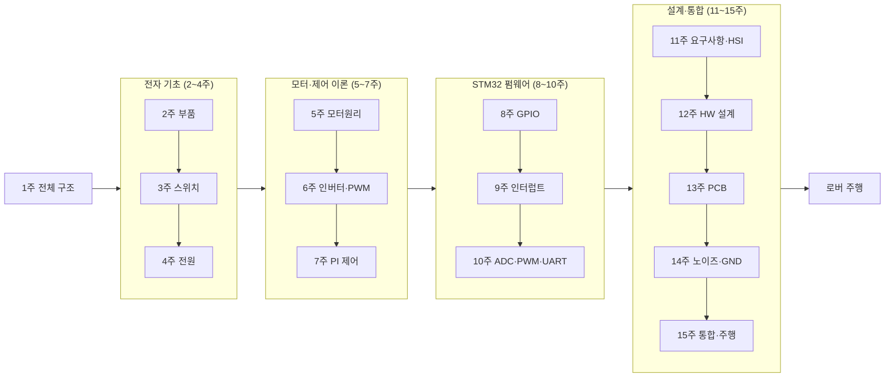

# 강의 전체 흐름 — 하나로 이어지는 15주

이 강의는 흩어진 주제의 모음이 아니라, **로버(2륜 차동구동)·우주 로버 대회의 제어유닛을 부품 하나부터 실제 주행까지 직접 완성**하는 하나의 이야기다. 각 주차는 다음 주차의 재료가 된다.

## 🗺️ 15주 한눈에 보기

## 🧩 네 개의 큰 흐름

| 단계 | 주차 | 한 줄 요약 |
|---|---|---|
| ① 전자 기초 | 2~4 | 회로의 **벽돌(부품)**과 **전력(전원회로)** — 무엇으로 만드는가 |
| ② 모터·제어 이론 | 5~7 | 모터→인버터→PI — **무엇을 어떻게 돌리는가** |
| ③ STM32 펌웨어 | 8~10 | GPIO→인터럽트→ADC/PWM/UART — **MCU로 직접 제어** |
| ④ 설계·통합 | 11~15 | 요구사항→회로→PCB→노이즈→통합 — **제품으로 완성** |

## 🔗 주차가 이어지는 방식 (이전 결과 → 이번 주 → 다음 주 재료)

| 주차 | 이번 주가 만드는 것 | 다음 주가 그것을 이렇게 쓴다 |
|---:|---|---|
| 1 | 시스템 전체 지도 | 각 부품을 하나씩 파고든다 |
| 2 | 저항·커패시터·인덕터 선정 | 이 소자로 전원·스위치 회로를 구성 |
| 3 | MOSFET 스위치 이해 | 이 스위치로 벅·인버터를 만든다 |
| 4 | 벅으로 12V/5V/3.3V 확보 | 이 전원으로 모터·MCU를 구동 |
| 5 | 모터 회전 원리·홀 6-step | 인버터로 실제 통전·구동 |
| 6 | 인버터·PWM 구동 | PWM 출력을 PI로 정밀 제어 |
| 7 | PI 속도 제어기 | STM32 코드로 직접 구현 |
| 8 | 레지스터 직접 제어(GPIO) | 입력·인터럽트로 확장 |
| 9 | 인터럽트로 신호 포착 | ADC·Timer·UART와 결합 |
| 10 | 센서·PWM·통신 펌웨어 | 이 기능을 담을 하드웨어 설계 |
| 11 | 요구사항·HSI·블록도 | 실제 부품값으로 회로 설계 |
| 12 | 게이트드라이버·벅 회로 | PCB에 배치·배선 |
| 13 | PCB 배치·배선 | 노이즈·그라운드로 완성도 상승 |
| 14 | 저노이즈 PCB | 펌웨어를 올려 통합 |
| 15 | 통합 펌웨어·로버 주행 | 최종 프로젝트로 마무리 |

## 🎯 모든 지식이 로버 ECU로 모인다

| 로버 ECU 부위 | 관련 주차 |
|---|---|
| 전원부(배터리→벅→MCU) | 2·4 |
| 모터 구동(H-브리지/인버터·PWM·PI) | 3·5·6·7 |
| MCU 펌웨어(GPIO·ADC·Timer·인터럽트·UART) | 8·9·10 |
| 요구사항·HSI·구동보드 PCB | 11·12·13·14 |
| 통합·속도제어·원격통신·주행 | 15 |

> **핵심 메시지** — "1주차에 본 블록도의 모든 칸을, 15주에 걸쳐 내 손으로 하나씩 채워 넣으면, 마지막에 그 블록도가 실제로 굴러가는 로버 ECU가 된다."
