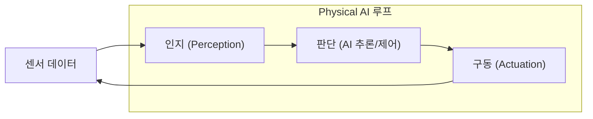
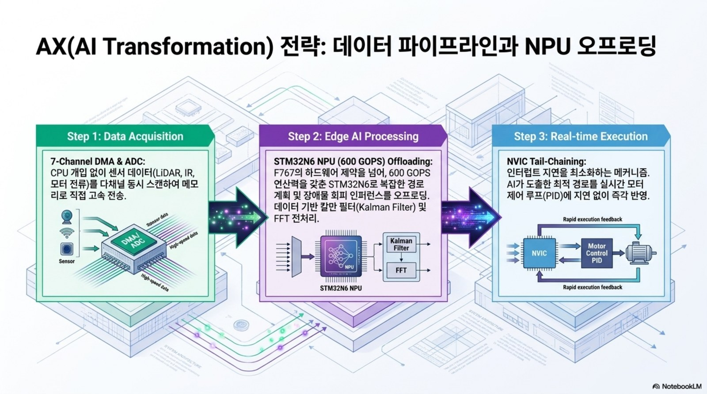
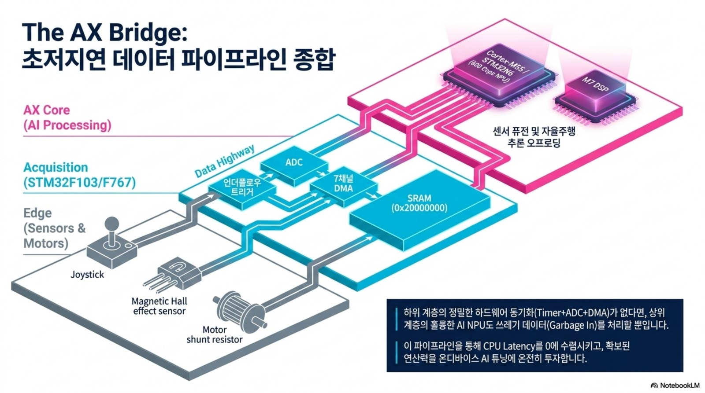
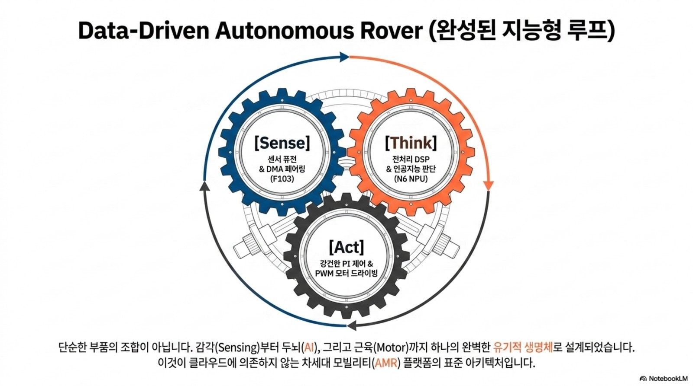

# AX 교육과정 개편안 — Physical AI로 확장하는 전자제어유닛 실습

> **AX(AI Transformation)** = 기존 임베디드·제어 골격 위에 **AI 도구 활용 · 데이터 기반 제어 · 엣지 AI(TinyML) · Physical AI**를 통합해, 학생이 "제어유닛을 만들 뿐 아니라 **데이터로 학습하고 스스로 판단하는** 제어유닛"까지 다룰 수 있도록 개편한다. (PARC Lab: Physical AI Real-Time Control)

## 개편 철학

- **AI 보조 개발(AI-assisted)**: LLM/Copilot으로 데이터시트 해석·코드 생성·설계 검토 생산성 향상
- **데이터 기반(Data-driven)**: 측정 데이터로 모델 식별·제어 튜닝·이상 탐지
- **엣지 AI(Edge AI/TinyML)**: MCU 위에서 추론(고장 진단·상태 예측·인지)
- **Physical AI**: 인지→판단→제어 파이프라인을 실물 모빌리티에 구현

## AX·Physical AI 시각 로드맵

AI 도구 활용은 보고서 자동화가 아니라 **데이터 취득 → AI 전처리 → 실시간 제어/추론**으로 이어지는 개발 방식의 변화다. 10주차 ADC·Timer·UART 로그가 15주차 Edge AI 이상탐지의 입력 데이터가 되도록 설계한다.

!!! tip "강의 운영 포인트"
    학생에게 AI를 별도 주제로 가르치기보다, 각 주차 산출물에 “AI가 검토할 데이터”와 “사람이 검증할 안전 기준”을 동시에 남기게 한다.

## 학습 성과(CLO) 추가

기존 CLO 1~5(부품·모터·STM32·설계·펌웨어)에 다음을 추가한다.

6. **AI 개발도구**(LLM·Copilot)로 임베디드 개발·문서화 생산성을 높인다.
7. 센서 데이터를 수집·전처리하고 **엣지 AI(TinyML)** 추론을 MCU에 구현한다.
8. **데이터 기반 제어·진단**으로 고전 제어를 보완하고 예지보전(PdM)을 설계한다.

## 주차별 AI 연계 (Overlay)

| 주차 | 핵심 주제 | 🤖 AX 연계 |
|---:|---|---|
| 1 | 오리엔테이션·구조 | Physical AI 개념(인지-판단-제어), AI 개발도구(Copilot/ChatGPT) 세팅 |
| 2 | 저항·커패시터·인덕터 | LLM으로 데이터시트 요약·부품 선정 보조, 부품 파라미터 데이터셋 개념 |
| 3 | 다이오드·BJT·MOSFET | AI로 손실 계산 검증, 스위칭 손실 데이터 회귀 예측 |
| 4 | 전원회로 | 벅 설계 자동 계산(AI 보조), 효율 데이터 기반 최적화 |
| 5 | DC/BLDC 모터 | **데이터 기반 시스템 식별**(파라미터 추정), 모터 모델 학습 |
| 6 | 인버터·PWM | PWM·데드타임 파라미터 **자동 탐색/최적화** |
| 7 | 제어공학·PI | **고전 PI vs 데이터기반/강화학습 제어**, 오토튜닝 |
| 8 | STM32 GPIO·레지스터 | AI 코드 어시스트로 레지스터 코드 생성·리뷰 |
| 9 | 입력·클럭·인터럽트 | 이벤트 로그 데이터화, 이상 이벤트 탐지 개념 |
| 10 | ADC·Timer·UART | **센서 데이터 수집 파이프라인 → ML 준비**(Teleplot→데이터셋) |
| 11 | 요구사항·HSI | AI 요구사항 분석, **디지털 트윈** 블록도(SIL) |
| 12 | 인버터 HW 설계 | AI 기반 부품 선정·설계 검토, 열/손실 예측 |
| 13 | 회로도·PCB 기초 | AI PCB 배치/DRC 보조 |
| 14 | PCB 노이즈·그라운드 | EMI 예측·데이터 기반 진단 |
| 15 | BLDC 펌웨어 통합 | **엣지 AI(TinyML) 고장 진단·예지보전**, 데이터로그→이상탐지 모델 통합 |

## AX 캡스톤 — AI-Enabled 로버 (Physical AI)

기존 로버 캡스톤을 인지·학습·판단이 결합된 **Physical AI 로봇**으로 확장.

- **인지**: 초음파/IMU/(옵션)카메라 데이터 융합
- **추론**: TensorFlow Lite Micro / CMSIS-NN / Edge Impulse로 MCU 온디바이스 추론
- **제어**: 고전 PI + 데이터 기반(학습) 하이브리드
- **진단**: 모터 전류·진동 데이터 이상 탐지 → 예지보전

## AX 도구 스택

| 목적 | 도구 |
|---|---|
| AI 보조 개발 | GitHub Copilot · ChatGPT/Claude · 강의 전용 GPTs |
| 데이터 분석 | Python(NumPy·pandas·scikit-learn) · Teleplot |
| 엣지 AI | TensorFlow Lite Micro · CMSIS-NN · Edge Impulse |
| 모델·시뮬 | Python/MATLAB·Simulink · 디지털 트윈(SIL/HIL) |

## 평가 반영 (AX 역량)

- **최종 프로젝트**에 AI 요소(엣지 추론 또는 데이터 기반 분석/진단) **1개 이상 포함**을 필수화
- AX 역량 루브릭: (a) AI 도구 활용도 (b) 데이터 파이프라인 (c) 엣지 AI 구현/분석의 타당성

## 윤리·안전

AI 판단이 구동(모터)에 직접 영향을 주므로 **안전 인터록·페일세이프**(AI 추론 실패 시 고전 제어로 폴백, 과전류·과열 하드 리밋)를 필수 설계 원칙으로 둔다.
